# 渗透测试-非寻常漏洞案例-先知社区

> **来源**: https://xz.aliyun.com/news/16389  
> **文章ID**: 16389

---

# 声明

本文章所分享内容仅用于网络安全技术讨论，切勿用于违法途径，所有渗透都需获取授权，违者后果自行承担，与本号及作者无关，请谨记守法.  
此文章不允许未经授权转发至除先知社区以外的其它平台！！！

# 前言

在渗透测试中挖掘到许多不一样的漏洞，在常见的渗透测试案例中非常稀少，即使是SRC中也很少见，这么久也没遇到过几次，所以在这里分享一下，亲身经历挖掘到的其中的几个比较奇奇怪怪的漏洞。

# 奇异签约漏洞

看过月神的都清楚，签约漏洞的逻辑概念，这里就不多说了，不懂可以去B站看一下月神的课。但是在挖掘的时候，我发现除了月神讲到的情况，还有另一种情况，就是检测到支付异常会对你的操作做出阻碍，但是并没有对续费问题进行停止操作。  
首先登录网站，查看会员中心功能点

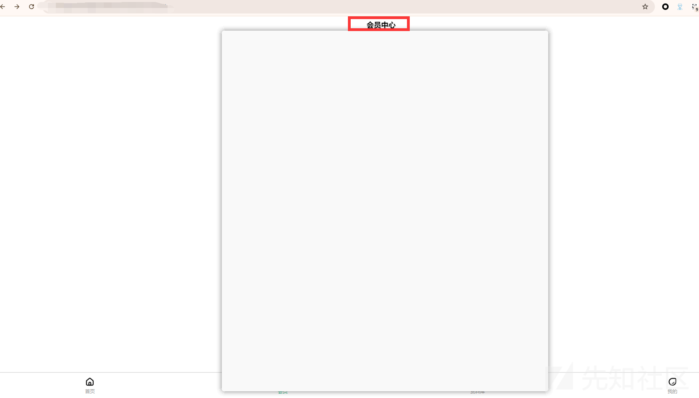  
点击获取文档

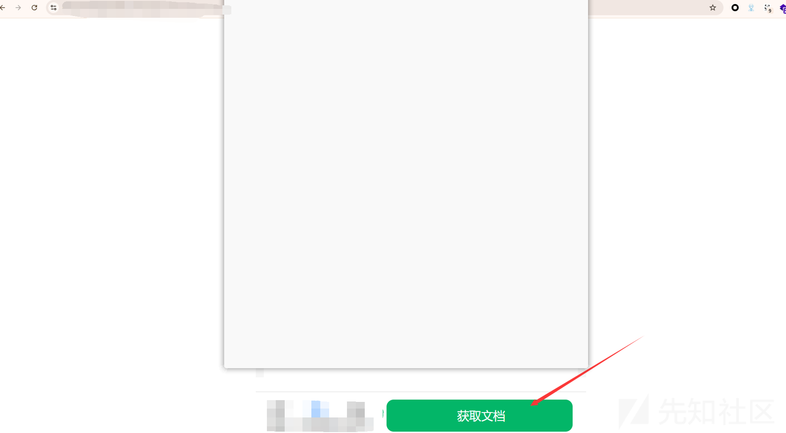  
当即上述获取文档时因为需要会员，因此会自动跳转至会员充值界面，因充值页面太敏感了，就不放图了。  
我们分别通过支付宝和另一款银行卡支付APP两种方式进行支付  
如下图均支付成功：

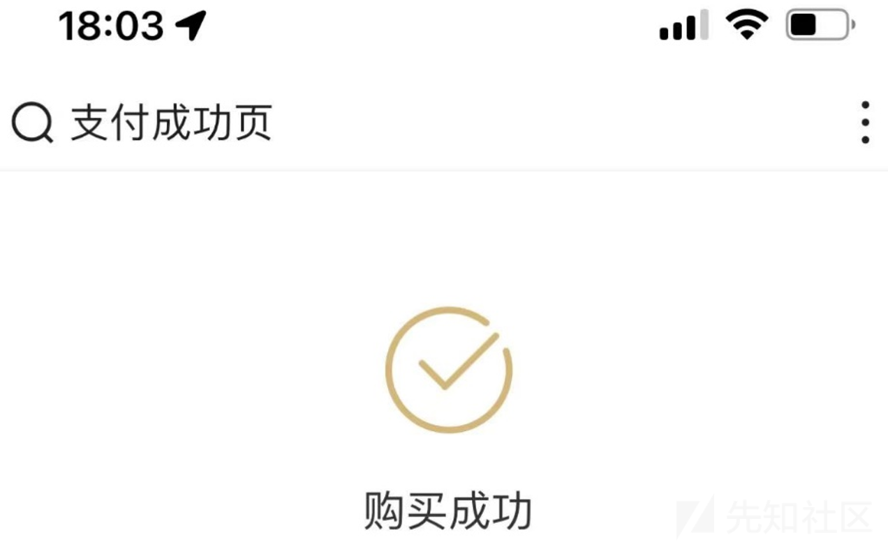

  
均支付成功，但是过几分钟就会退回支付宝并显示支付失败，而另一种支付方式并没有退回，此处不存在漏洞，但是充值会员是需要允许下个月自动续费才能进行充值，因此两种支付均存在自动续费，但是支付宝退款发现自动续费还存在，而查看支付成功的一边自动续费也没有取消，因此类似签约漏洞的问题产生。后面都太敏感了，就不看了。

# 不安全对象漏洞

访问网站，发现许多视频资源  

任意点击一个，在没有登录的情况下并不能对视频资源进行访问

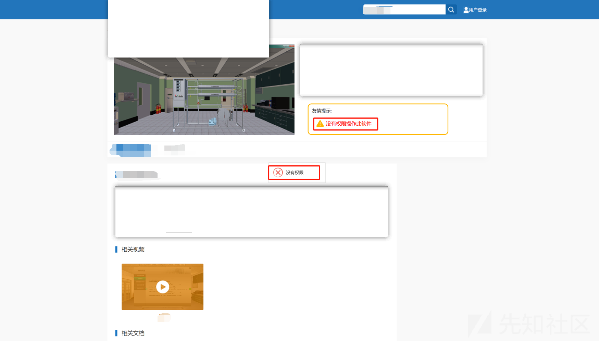  
点击F12查看前端源码发现视频路径

  
复制路径可使用迅雷进行下载

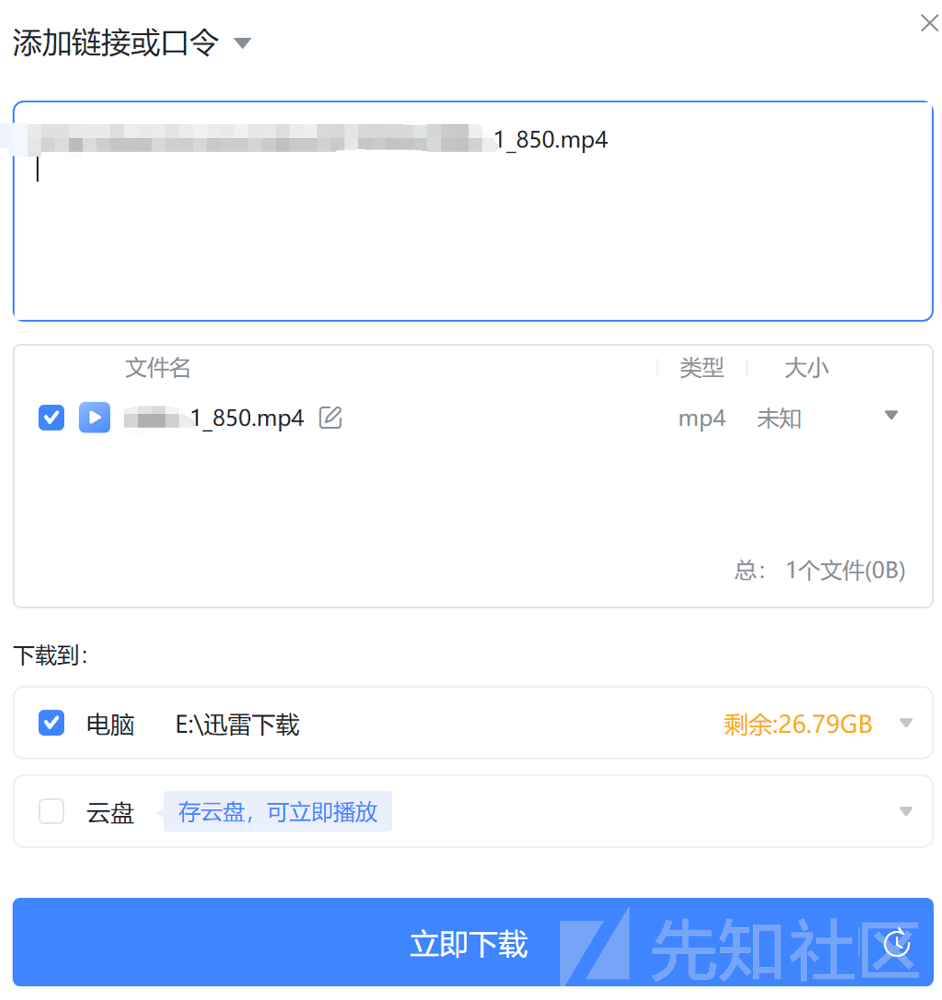  
下载成功，直接绕过登录权限限制

  
点击文档发现同样存在无权限访问

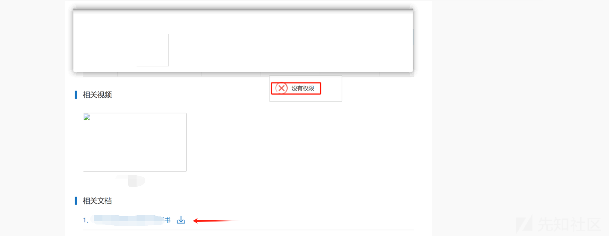  
和上述视频下载一样，F12打开前端源码查看发现存在路径

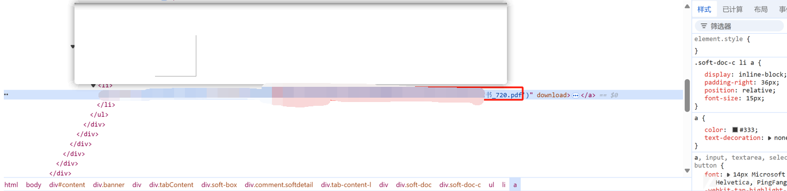  
使用迅雷下载即可

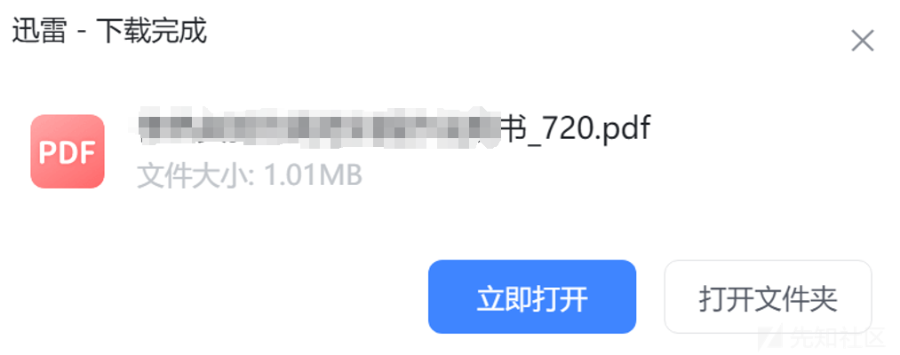

# 奇特登录绕过漏洞

某登录口，访问网站，发现提示专家入口可直接进入后台，但是并没有看见专家后台啊，猜测应该是关闭了专家后台的功能点

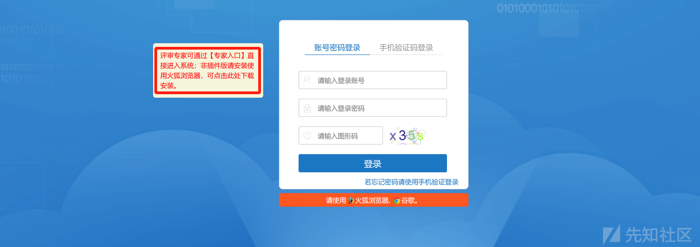  
但是通过登录口任意输入抓包，可对用户名进行替换，我们替换为expert（专家），注意验证码需要保证一致

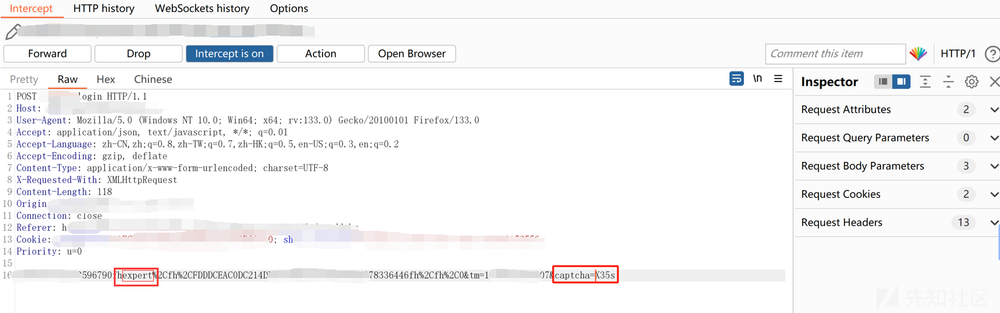  
发包，成功的直接进入后台

# XSS案例

漏洞点为优先级处，此处功能点为固定值，因此很多人会忽略此处

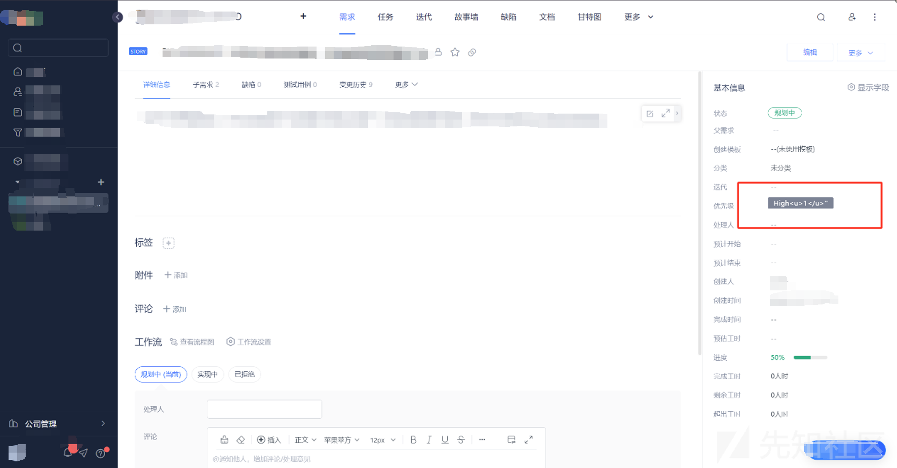  
抓包，修改此处为XSS语句，这里的XSSpayload还需要绕过以下，寻常XSSpayload是弹不了窗的

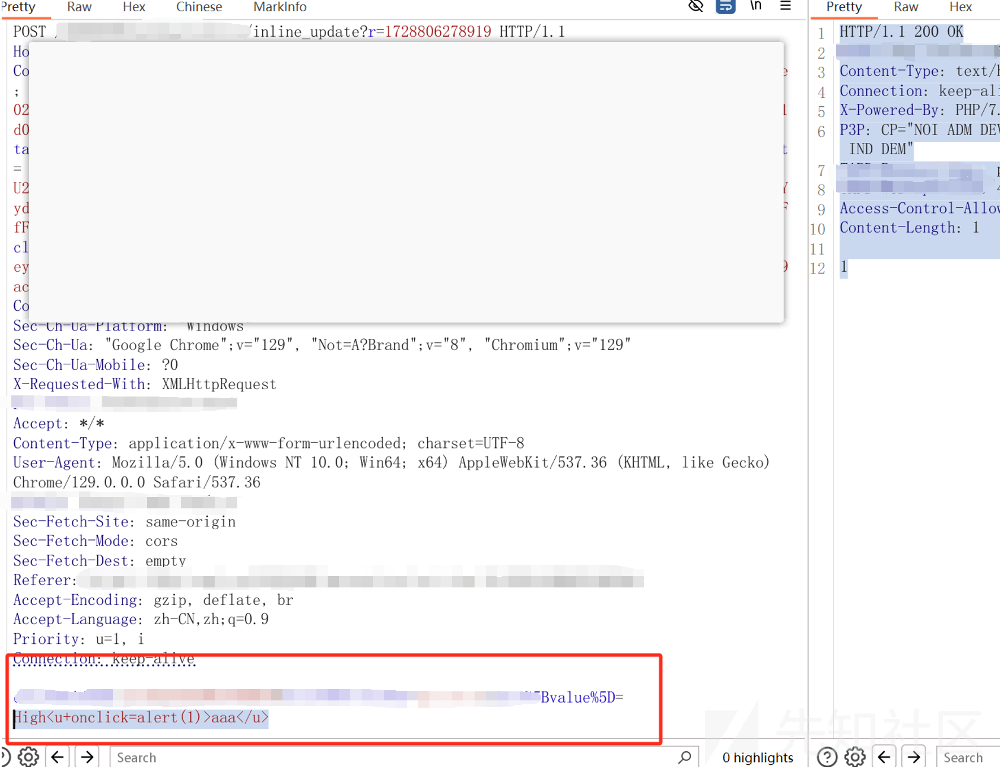  
成功弹框

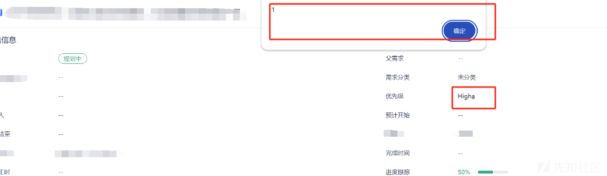
