# 安卓逆向入门全面解析入口点定位,资源文件,四大组件,native,java层逆向(带实战例题)-先知社区

> **来源**: https://xz.aliyun.com/news/16398  
> **文章ID**: 16398

---

## 第一章：引言与背景

Android逆向工程，作为一种深入分析Android应用程序的技术，主要目的就是通过分析应用的代码、资源和行为来理解其功能、结构和潜在的安全问题。它不仅仅是对应用进行破解或修改，更重要的是帮助开发者、研究人员和安全人员发现并解决安全隐患。  
本文主要对整个安卓逆向入门的体系进行整理,解决一些安卓逆向时候的痛点问题!每个知识点都会有对应的例题下载,或者前文对应刷题的链接,在刷题中学习,才可以更快的掌握知识!  
**下面是本文的关键点**:

* **APK逆向工具**：工欲善其事，必先利其器(这部分可以掠过,只做了工具的下载地址和简单介绍)
* APK的基本结构(**详细解析了每个文件的作用和目的**)
* Android逆向分析中的基础(**解决没有安卓开发基础学习安卓逆向时候的痛点问题**)
  + 如何找出APP的程序的入口点?
  + 如何识别是否加壳,并且简单脱壳?
  + 如何寻找一个页面的xml布局文件?
  + 如何确定按钮所绑定的函数?
  + 如何寻找app中涉及到的资源文件?
  + 什么是java层逆向,什么是Native层逆向?
* 安卓系统中的四大组件是如何在逆向题目中被应用的?
* 最后进行了安卓体系的梳理!

## 第二章：APK逆向工具：工欲善其事，必先利其器

#### 1.1 雷电模拟器运行APK

**雷电模拟器**，作为安卓模拟器的佼佼者，一直以来备受用户青睐。它不仅可以让你在PC上畅快运行安卓应用，还能提供与手机端接近的使用体验，让你在开发、调试乃至游戏娱乐中都能游刃有余。安装雷电模拟器其实并不复杂，但要确保顺利完成，还是有一些细节需要关注。  
相关使用:[雷电模拟器的使用 - 搜索](https://cn.bing.com/search?q=%E9%9B%B7%E7%94%B5%E6%A8%A1%E6%8B%9F%E5%99%A8%E7%9A%84%E4%BD%BF%E7%94%A8)  
下载地址:[雷电模拟器官网\_安卓模拟器\_电脑手游模拟器](https://www.ldmnq.com/?n=401674&msclkid=ba4dfe48672f1d4a015299263da317a3)

#### 1.2 ADB的使用

**ADB（Android Debug Bridge）**，简直是安卓开发者和逆向工程师的“瑞士军刀”。无论是调试、安装应用，还是进行日志分析，ADB都是不可或缺的工具。你可能会认为ADB只是一个命令行工具，然而它的强大远超你的想象。  
相关使用:[ADB安装及使用详解（非常详细）从零基础入门到精通，看完这一篇就够了-CSDN博客](https://blog.csdn.net/Python_0011/article/details/132040387)  
下载地址:<https://dl.google.com/android/repository/platform-tools-latest-windows.zip>

#### **1.4 使用JADX反编译APK**

**JADX**是一款非常流行且功能强大的APK反编译工具，它能够将APK中的DEX文件（即Dalvik Executable文件）反编译成可读的Java源代码。JADX的优势不仅仅在于它的易用性，还在于它的反编译效果非常优秀，能够清晰地显示反编译后的Java代码，帮助开发者和安全人员深入理解应用的内部逻辑。

##### JADX的优点：

* **易用性**：图形界面的设计使得操作简单直观，适合初学者和经验丰富的开发者。
* **高效的反编译效果**：JADX能够将DEX文件反编译成非常接近原始Java代码的源代码，对于Java层的应用分析尤为高效。
* **支持多种格式**：除了反编译Java代码，JADX还支持查看APK中的资源文件（如图片、XML文件等），让你能够全面了解应用的构成。

相关使用:[APK反编译工具jadx - chuyaoxin - 博客园](https://www.cnblogs.com/cyx-b/p/13401991.html)  
下载地址:<https://down.52pojie.cn/Tools/Android_Tools/jadx-1.5.0.zip>  
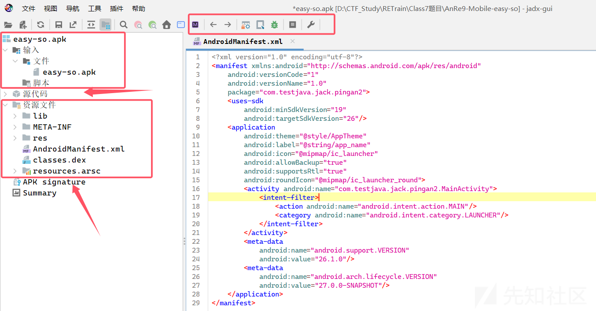

#### **1.5 使用GAD进行APK反汇编**

GAD（**Google Android Disassembler**）是一个专注于APK底层字节码分析的工具。与JADX不同，GAD更多侧重于字节码级别的反汇编，它能够帮助安全研究人员和开发者深入到应用的最底层，查看其具体的机器码和执行逻辑。GAD特别适用于那些对字节码和汇编语言感兴趣的逆向工程师，它可以帮助我们获得应用中深层次的行为信息。

##### **GAD的优点：**

* **底层分析能力**：GAD能够提供非常详细的底层字节码分析，帮助你更深入地理解应用的执行过程。
* **适用于高级分析**：如果你需要分析复杂的应用行为或破解复杂的加密算法，GAD提供的反汇编信息可以帮助你做出准确的判断。

相关使用:[[原创]GDA使用手册-Android安全-看雪-安全社区|安全招聘|kanxue.com](https://bbs.kanxue.com/thread-266700.htm)  
下载地址:<https://down.52pojie.cn/Tools/Android_Tools/GDA4.11.zip>  
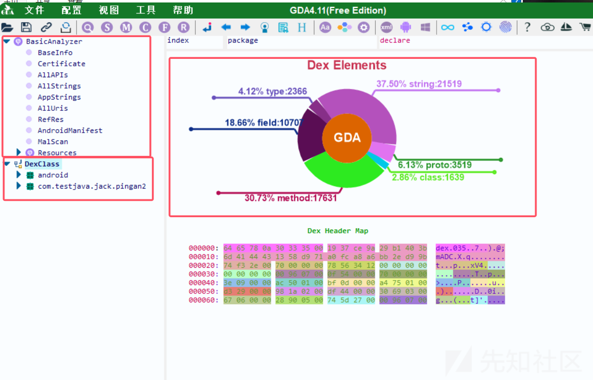

#### **1.6 JEB进行APK反汇编**

**JEB**的魅力在于其高精度的反汇编能力。它不仅能解析传统的DEX文件，还能处理各类复杂的文件格式，包括加固过的APK、经过混淆处理的代码，甚至是一些非标准的Android文件结构。它像一把锐利的刀刃，切开了应用的“外壳”，揭示其最核心的部分。

##### **JEB的优点：**

* **强大的反汇编能力**:JEB不仅仅局限于常规的字节码反汇编，它能够对各种复杂和非标准格式的APK进行深入分析。
* **支持多种文件格式** :JEB支持广泛的文件格式解析，除了DEX文件，还包括PE（Portable Executable）、ELF、Java字节码等多种格式。
* **高级功能与插件支持** :JEB的插件架构极为强大，用户可以根据自己的需求，定制化扩展JEB的功能。

相关使用:[第36讲: 使用Jeb工具反编译安卓APK\_jeb反编译工具-CSDN博客](https://blog.csdn.net/weixin_38819889/article/details/108910525)  
下载地址:<https://down.52pojie.cn/Tools/Android_Tools/JEB_Decompiler_3.19.1_Professional.rar>  
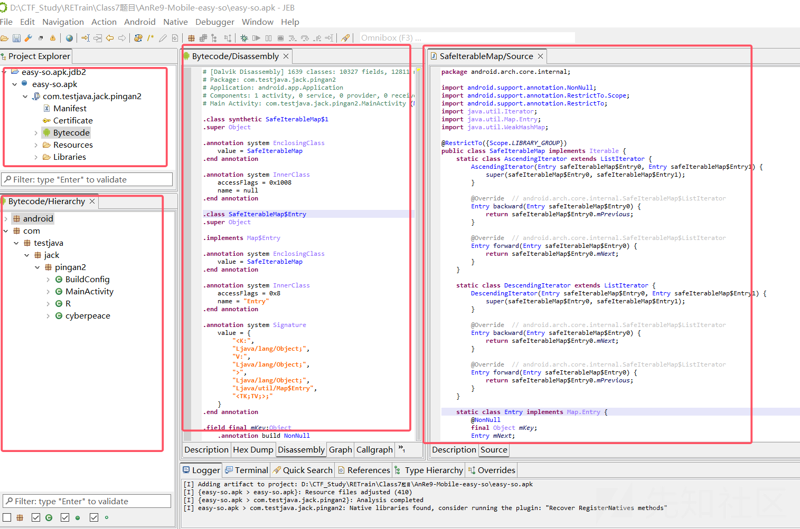

#### 1.7 IDA进行反汇编

进入**IDA**的世界，你将步入一个顶级的反汇编领域。**IDA**（Interactive Disassembler）是众多逆向工程师手中的“神器”，无论是操作系统、应用程序还是嵌入式系统，它都能提供无与伦比的反汇编支持。

##### **IDA的优势：**

* **精确的反汇编能力**：IDA能反汇编几乎所有的二进制文件格式，展示底层机器码及其执行路径，让逆向分析更加精准。
* **高度可扩展**：IDA支持插件开发，用户可以根据需求扩展其功能，实现个性化分析。
* **复杂任务支持**：IDA特别适合进行复杂的逆向分析任务，如破解软件、分析恶意代码等。

相关使用:[菜鸟的逆向工程学习之路——逆向工具IDA的使用\_ida工具-CSDN博客](https://blog.csdn.net/m0_74762365/article/details/133960727)  
下载地址:<https://down.52pojie.cn/Tools/Disassemblers/IDA_Pro_v8.3_Portable.zip>  
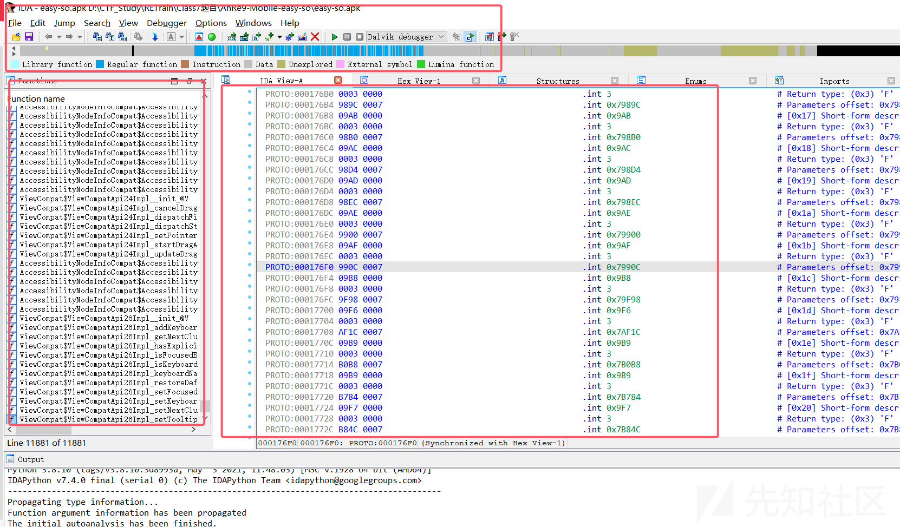

#### 1.8 Frida脱壳工具的使用

Frida 是一个强大的动态分析工具，广泛应用于反向工程和安全测试中，尤其是在对 Android 应用进行脱壳（解除保护）时，它能够帮助研究人员通过动态注入脚本来分析应用程序的行为。以下是使用 Frida 进行脱壳的环境配置和基本步骤。  
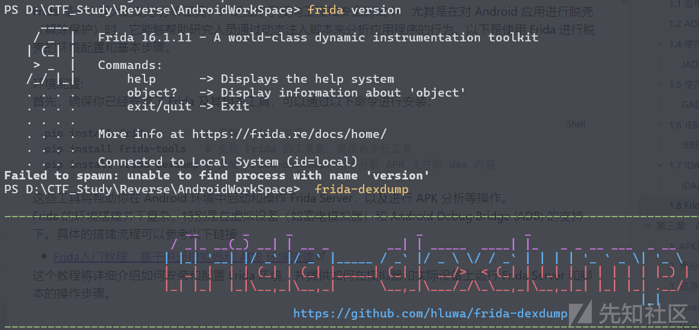  
环境配置:  
首先，确保你已经安装了 Frida 及其相关工具，可以通过以下命令进行安装：

```
pip install frida         # 安装 Frida 主库
pip install frida-tools   # 安装 Frida 的工具集，提供命令行工具
pip install frida-dexdump # 安装 frida-dexdump，用于分析 APK 文件的 dex 内容

```

这些工具将帮助你在 Android 环境中启动和操作 Frida Server，以及进行 APK 分析等操作。  
Frida 的环境搭建并不复杂，特别是在虚拟设备（如雷电模拟器）和 Android Debug Bridge (ADB) 的支持下。具体的搭建流程可以参考以下链接：

* [Frida入门教程：基于逍遥模拟器和 ADB 环境搭建](https://blog.csdn.net/qq_45429426/article/details/125187375)  
  这个教程将详细介绍如何安装和配置 Frida 环境，并提供如何在模拟器和实际设备上运行 Frida Server 和脚本的操作步骤。

## 第三章：APK解析基础

在深入理解Android应用的工作原理和内部结构之前，我们首先需要了解应用打包的核心文件——**APK（Android Package）**。APK 文件是Android操作系统中的应用程序包，它包含了应用的所有资源、代码和必要的配置文件。可以把APK看作一个容器，其中集成了Android应用的所有组成部分。  
为了能够更深入地分析和理解Android应用的结构，我们可以将APK文件拆解为多个关键组件。每个组件在应用运行中都扮演着不同的角色，理解这些组件有助于我们全面掌握应用的运行机制，甚至为后续的逆向分析和漏洞挖掘打下基础。

### APK的基本结构

实际上，APK 文件是以 **ZIP** 格式进行压缩打包的，因此，我们可以像操作普通的ZIP文件一样，使用解压工具对其进行解压。通过解压后查看APK文件的目录结构，我们能够清晰地了解每个组成部分的作用。以下是一个典型的APK文件的结构示例：  
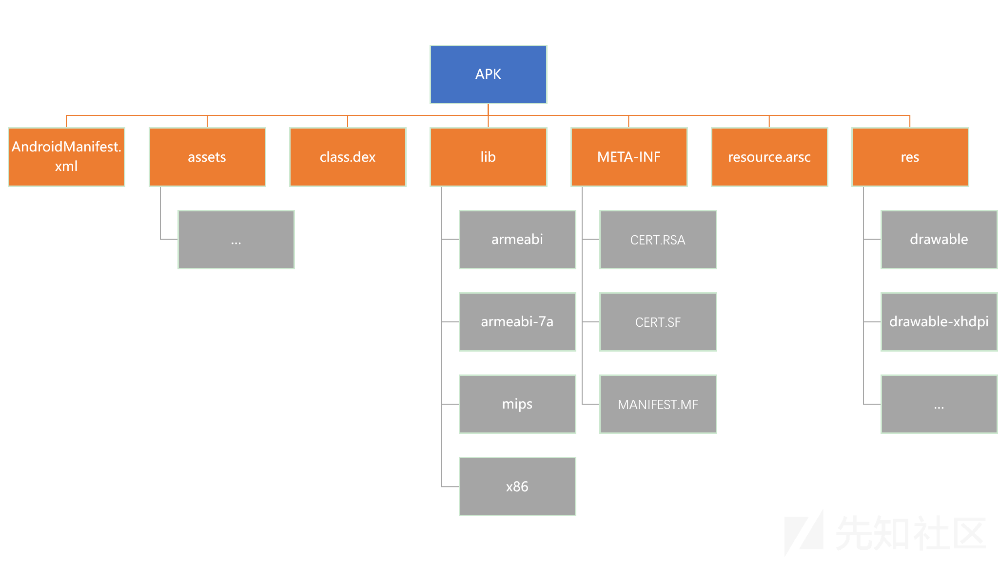  
APK **文件通常包括以下几个主要部分**：

1. **AndroidManifest.xml**
2. **classes.dex**
3. **resources.arsc**
4. **assets/**
5. **lib/**
6. **res/**
7. **META-INF/**  
   接下来，我们将详细解析这些文件和目录的作用及其内容。  
   将一个apk进行解压,可以发现如下结构的文件目录,测试案例下载:[攻防世界-Mobile-easy-so](https://adworld.xctf.org.cn/media/file/task/456c1dab04b24036ba1d6e32a08dc882.apk)  
   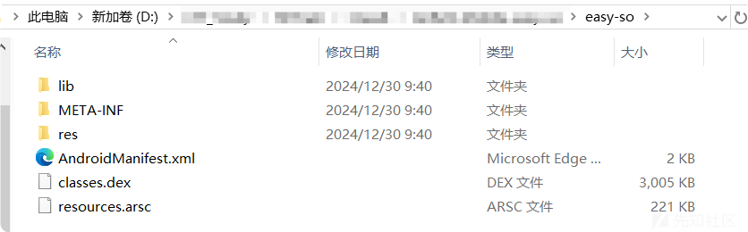

#### 1.AndroidManifest.xml(关键核心)

**AndroidManifest.xml** 是每个Android应用不可或缺的配置文件，它包含了应用的关键信息。我们可以把它看作是应用的“蓝图”或“说明书”，它向系统声明了应用的基本属性、组件以及权限等。AndroidManifest.xml中包括以下重要部分：

* **应用的包名（package）**：每个Android应用都有一个唯一的包名，通过包名来区分不同的应用。
* **应用的组件（Activities, Services, Broadcast Receivers, Content Providers）**：声明应用包含哪些组件，以及这些组件的属性和功能。
* **权限声明**：列出应用所需的权限，如访问网络、读取存储、使用相机等。
* **应用主题和图标**：定义应用的UI样式、图标等。
* **最小SDK版本和目标SDK版本**：确定应用能在什么版本的Android系统上运行。

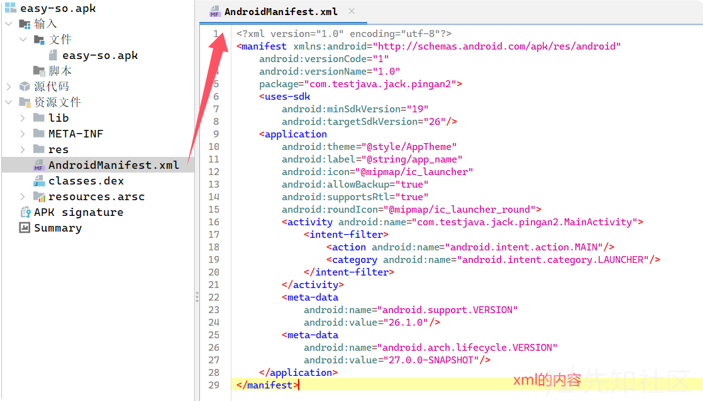

**详细解析Manifest中的关键字段**

* `<manifest>`：包含整个应用的包信息及权限定义。
  + `package`: 定义了应用的包名，通常为反向域名格式，如`com.example.app`。
  + `android:versionCode`: 定义应用的版本号。
  + `android:versionName`: 定义应用的版本名称。
* `<application>`：包含应用的核心配置，如主题、图标等。
  + `android:icon`: 定义应用的图标。
  + `android:label`: 定义应用的名称。
  + `android:theme`: 应用的UI主题。
* `<activity>`：声明应用的各个界面（Activity），以及这些Activity的属性和行为。
  + `android:name`: Activity的类名。
  + `android:label`: Activity的标签。
  + `android:theme`: Activity特有的UI主题。
* `<uses-permission>`：声明应用所需要的权限，如访问网络、发送短信等。
* `<intent-filter>`：定义组件的功能和响应的事件，如Activity的启动方式或Broadcast Receiver接收的广播类型。

#### 2. classes.dex

**classes.dex** 文件包含了应用程序的可执行代码。它是应用的Dalvik字节码文件，也是Android应用在运行时通过 **Dalvik虚拟机** 或 **ART（Android Runtime）** 解释执行的核心文件。每个Android应用中，所有的Java源代码都经过编译后形成一个或多个DEX（Dalvik Executable）文件，这些文件包含了应用的业务逻辑和代码实现。  
在Android 5.0（Lollipop）之后，Google引入了 **ART（Android Runtime）** 代替了传统的Dalvik虚拟机，ART的执行方式比Dalvik更高效，支持Ahead-of-Time（AOT）编译和即时编译（JIT）策略。  
这部分比较难可以拓展阅读一下,相关文档:

* [JAVA虚拟机、Dalvik虚拟机和ART虚拟机简要对比\_java dalvik-CSDN博客](https://blog.csdn.net/Jason_Lee155/article/details/136579888)
* [安卓逆向学习----smali,dex,java等文件之间转换关系\_dex与smail-CSDN博客](https://blog.csdn.net/qq_34418601/article/details/103443015)

#### 3. resources.arsc

**resources.arsc** 文件包含了应用程序的所有编译后的资源映射信息。这个文件并不存储实际的资源内容（如图片或字符串），而是存储资源与资源ID的映射关系。例如，它会保存应用中的字符串、颜色、尺寸、样式等信息以及这些资源的ID。通过这个文件，Android系统能够在应用运行时快速访问和加载所需的资源。

使用jadx可以看见:  
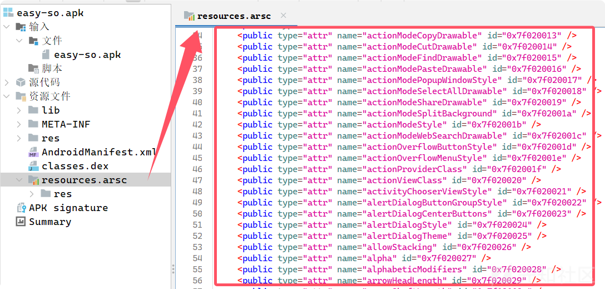

#### 4. assets/

**assets/** 目录包含了应用程序的原始资源文件，这些资源不经过编译，直接以原始形式存储。通常，开发者可以在该目录中存放字体文件、音频文件、HTML文件等，应用在运行时通过API来读取这些资源。例如，游戏可能会将所有的地图文件或纹理图像存放在此目录中。通过`AssetManager` API，应用可以访问这些文件。

#### 5. lib/

**lib/** 目录包含了本地库文件，通常是通过 **JNI（Java Native Interface）** 与C/C++编写的本地代码。这些库文件可以针对不同的硬件架构（如arm、x86等）进行编译，因此`lib/`目录下通常会为每个架构创建相应的子目录。这个目录中存放的本地库可以通过Java代码调用JNI接口实现与系统底层的交互。  
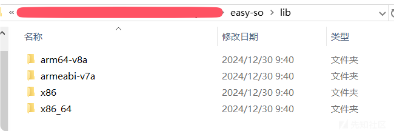  
下面是一个案例进入lib进入到目录中得到以下目录结构,不同架构的手机拥有不同的操汇编代码所以使用四种架构的汇编分别实现一次:

```
├─arm64-v8a
│      libcyberpeace.so
│
├─armeabi-v7a
│      libcyberpeace.so
│
├─x86
│      libcyberpeace.so
│
└─x86_64
        libcyberpeace.so

```

#### 6. res/

**res/** 目录包含了Android应用所需的所有资源文件。与 **assets/** 目录不同，**res/** 目录中的资源文件是经过编译的，按照不同类型的资源进行组织，例如：

* **drawable/**：存放图像资源（如PNG、JPEG等格式的图片）。
* **layout/**：存放XML格式的布局文件，定义界面的结构。
* **values/**：存放各种配置文件，定义应用的常量、颜色、字符串等资源。例如：
  + `strings.xml`：存储应用的文本字符串。
  + `colors.xml`：存储应用使用的颜色资源。
  + `styles.xml`：存储样式资源。

在`values/`目录下，除了`strings.xml`、`colors.xml`等常见资源文件，还会有像`dimens.xml`（尺寸定义文件）和`attrs.xml`（自定义属性）等资源文件。

可以在文件夹目录中找到也可以在jadx里面查看:  
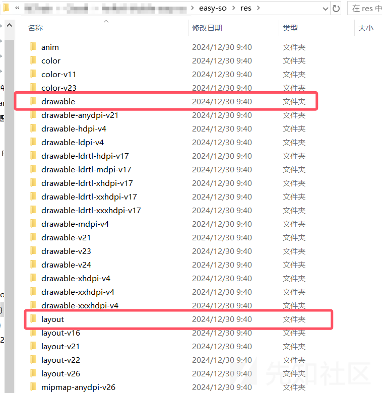

#### 7. META-INF/

**META-INF/** 目录与Java的JAR文件类似，用于存放APK文件的元数据，如签名文件、校验信息等。此目录主要包括以下文件：

* **MANIFEST.MF**：存放APK的清单文件，包含关于APK文件本身的信息。
* **CERT.RSA**：包含APK文件的数字签名。
* **CERT.SF**：存放APK文件的签名摘要。

这些文件确保了APK的完整性和安全性，保证APK文件没有被篡改，且来自合法的开发者。  
下面是一个示例:  
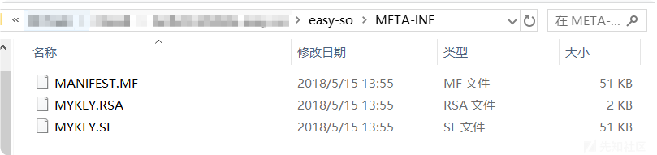

## 第四章：Android逆向分析中的基础

Android 逆向分析是一个深入挖掘应用内部工作原理的过程，通常用于漏洞挖掘、恶意软件分析或应用的安全性研究。在这章中，我们将深入探讨 Android APK 的反编译与结构分析，剖析壳分析与绕过技术，以及如何对资源与布局文件进行分析。我们还会涉猎 Java 层的逆向技巧，以及如何在 Native 层执行逆向工程。每一部分都将逐一分析和讲解，以帮助读者在 Android 逆向分析中取得更好的突破。

### 1. **APK反编译与结构分析：如何找出程序的入口点**

在进行 Android 逆向时，首先需要对 APK 文件进行反编译和结构分析。理解 APK 的基本结构至关重要，因为它帮助我们定位关键组件和入口点。一个典型的 APK 文件包含多个元素，如 `AndroidManifest.xml`、DEX 文件、资源文件和库文件等。

#### 定位入口点实战案例

> **目标**: 学习如何反编译 APK 文件并分析其结构，找出应用程序的入口点。  
> **文章**: [android apk入口分析\_5.apk的程序入口界面 - CSDN博客](https://blog.csdn.net/frankpi/article/details/51005952)  
> **实战案例**:[BUU刷题-简单注册器](https://buuoj.cn/challenges#%E7%AE%80%E5%8D%95%E6%B3%A8%E5%86%8C%E5%99%A8)  
> **更详细的WP**:[BUUCTF之简单注册器(RE) - Eip的浪漫 - 博客园](https://www.cnblogs.com/0x454950/articles/15918632.html)

首先梳理一下基本app的逆向流程:  
  
**1.将apk拖入JADX后寻找到AndroidManifest.xml文件**:  
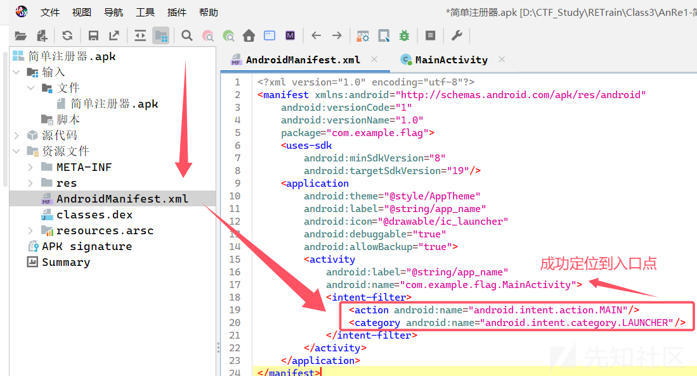

下面给出AndroidManifest.xml文件的详细注释:

```
<?xml version="1.0" encoding="utf-8"?>
<manifest xmlns:android="http://schemas.android.com/apk/res/android"
    android:versionCode="1"  <!-- 应用版本代码，用于区分不同版本的更新 -->
    android:versionName="1.0"  <!-- 应用版本名称，通常为可见版本号 -->
    package="com.example.flag">  <!-- 应用包名，唯一标识应用 -->

    <!-- 使用的最低 SDK 版本和目标 SDK 版本 -->
    <uses-sdk
        android:minSdkVersion="8"  <!-- 设置应用的最低 SDK 版本，表示应用可在 SDK 8 或以上的设备上运行 -->
        android:targetSdkVersion="19"/>  <!-- 设置应用的目标 SDK 版本，表示应用针对 SDK 19 的优化 -->

    <application
        android:theme="@style/AppTheme"  <!-- 设置应用的主题 -->
        android:label="@string/app_name"  <!-- 设置应用的名称 -->
        android:icon="@drawable/ic_launcher"  <!-- 设置应用的图标 -->
        android:debuggable="true"  <!-- 设置应用是否可调试，调试模式下可以进行调试 -->
        android:allowBackup="true">  <!-- 设置是否允许应用数据备份 -->

        <!-- 定义应用的主 Activity -->
        <activity
            android:label="@string/app_name"  <!-- 设置 Activity 的名称 -->
            android:name="com.example.flag.MainActivity">  <!-- 定义该 Activity 的完整类名 -->

            <!-- 配置启动该 Activity 的 Intent Filter -->
            <intent-filter>
                <action android:name="android.intent.action.MAIN"/>  <!-- 指定这是应用的主入口 -->
                <category android:name="android.intent.category.LAUNCHER"/>  <!-- 表明该 Activity 是启动器中的入口 -->
            </intent-filter>
        </activity>
    </application>
</manifest>

```

在 Android 应用中，**`AndroidManifest.xml`** 文件是至关重要的，它定义了应用的所有组件以及组件之间的关系，包括应用的入口点。打开反编译后的 APK 中的 `AndroidManifest.xml` 文件，查找 `<activity>` 标签，它们通常定义了应用的各个 Activity（包括启动 Activity）。

入口点通常由以下两个标记表示：

* `<action android:name="android.intent.action.MAIN" />`：标记这是应用的主入口。
* `<category android:name="android.intent.category.LAUNCHER" />`：表示该 Activity 会出现在应用启动器中（即桌面）。

所以最终得出该app的程序入口点代码是在`android:name="com.example.flag.MainActivity"`处!

**2.成功寻找到activity的代码入口处,开始分析activity的生命执行流程**:  
根据`android:name="com.example.flag.MainActivity"`字段成功找到Activity的功能实现代码位置,一个Activity的生命周期是:`onCreate()`->`onStart()`->`onResume()`->`onPause()`->`onStop()`->`onDestroy()`,所以可以先锁定omCreate函数,锁定app加载的主要逻辑!  
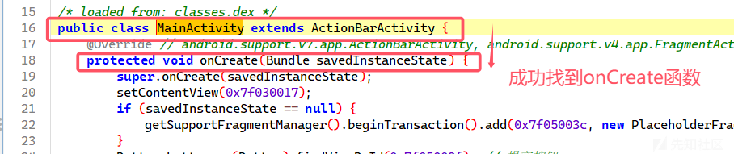

**3.开始分析按钮的逻辑代码,成功解析出需要输入的内容**:  
在主要逻辑中可以发现界面中的一个按钮绑定了一个onclick按钮点击事件:  
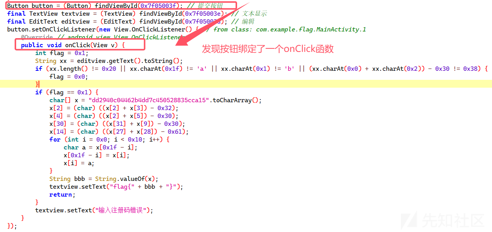  
该函数用于处理用户点击事件，验证输入框中的文本是否符合特定规则，如果符合规则，则对一个预定义的字符串进行一系列字符运算和逆序处理，最终显示一个特定格式的“flag”；否则，显示错误提示“输入注册码错误”。  
也就是说我们只需要输入一个正确的字符串就可以成功拿到flag!  
将代码提取出来分析:

```
button.setOnClickListener(new View.OnClickListener() { // from class: com.example.flag.MainActivity.1
            @Override // android.view.View.OnClickListener
            public void onClick(View v) {
                int flag = 1;
                String xx = editview.getText().toString();
                if (xx.length() != 32 || xx.charAt(31) != 'a' || xx.charAt(1) != 'b' || (xx.charAt(0) + xx.charAt(2)) - 48 != 56) {
                    flag = 0;
                }
                if (flag == 1) {
                    char[] x = "dd2940c04462b4dd7c450528835cca15".toCharArray();
                    x[2] = (char) ((x[2] + x[3]) - 50);
                    x[4] = (char) ((x[2] + x[5]) - 48);
                    x[30] = (char) ((x[31] + x[9]) - 48);
                    x[14] = (char) ((x[27] + x[28]) - 97);
                    for (int i = 0; i < 16; i++) {
                        char a = x[31 - i];
                        x[31 - i] = x[i];
                        x[i] = a;
                    }
                    String bbb = String.valueOf(x);
                    textview.setText("flag{" + bbb + "}");
                    return;
                }
                textview.setText("输入注册码错误");
            }
        });
    }

```

这里的逻辑代码就很清晰了:

```
int flag = 1;
String xx = editview.getText().toString();
if (xx.length() != 32 || xx.charAt(31) != 'a' || xx.charAt(1) != 'b' || (xx.charAt(0) + xx.charAt(2)) - 48 != 56) {
    flag = 0;
}

```

* 获取我们的第一个输入并且判断他的长度和字符的条件要求满足!
* 这个条件意味着字符串的长度必须是 **32**。
* 这个条件意味着字符串的第32个字符（索引为31）必须 **不是** `'a'`。
* 这个条件意味着字符串的第2个字符（索引为1）必须 **不是** `'b'`。
* 字符串的第1个字符（索引为0）和第3个字符（索引为2）的 ASCII 值加起来减去 48 不等于 56。
* 例如，`xx.charAt(0)` 为 `'x'`，`xx.charAt(2)` 为 `'y'`，其 ASCII 值分别为 120 和 121。所以 `(120 + 121) - 48 = 193`，这个结果必须 **不等于** 56。

```
(xx.charAt(0) + xx.charAt(2))  == 104
!               G

```

!bGaaaaaaaaaaaaaaaaaaaaaaaaaaaaa

满足条件的字符串:

```
!bGaaaaaaaaaaaaaaaaaaaaaaaaaaaaa
```

想要详细的解析可以前往其他WP!

* [(4条消息) [BUUCTF]REVERSE——简单注册器\_Angel~Yan的博客-CSDN博客\_简单注册器](https://blog.csdn.net/mcmuyanga/article/details/109595080)
* [BUUCTF之简单注册器(RE) - Eip的浪漫 - 博客园](https://www.cnblogs.com/0x454950/articles/15918632.html)

**4.理清楚解题脚本后,使用python代码实现flag输出**:  
解题脚本:

```
# ✅ 将字符串转换为字符数组 
string = "dd2940c04462b4dd7c450528835cca15"
arr_c = list(string) 
print(arr_c) # ['j', 'i', 'y', 'i', 'k']
arr_c[2] = chr(ord(arr_c[2]) + ord(arr_c[3]) - 50)
arr_c[4] = chr(ord(arr_c[2]) + ord(arr_c[5]) - 0x30)
arr_c[30] = chr(ord(arr_c[0x1F]) + ord(arr_c[9]) - 0x30)
arr_c[14] = chr(ord(arr_c[27]) + ord(arr_c[28]) - 97)

for i in range(16):
    a = arr_c[0x1F - i];
    arr_c[0x1F - i] = arr_c[i];
    arr_c[i] = a;

for i in arr_c:
    print (i,end="")

```

成功得到flag!  
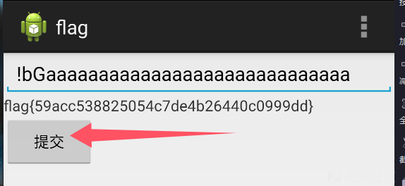

#### **寻找入口点流程梳理**

每个 Android 应用的启动通常由一个 `Activity` 或者 `Service` 作为入口，通常位于 `AndroidManifest.xml` 中。我们可以通过以下步骤来快速找到入口点：  
1.**查看 `AndroidManifest.xml`**：这是每个 Android 应用的配置文件，包含应用的所有组件声明。入口 `Activity` 通常会在 `intent-filter` 中声明 `MAIN` action 和 `LAUNCHER` category。例如：

```
<?xml version="1.0" encoding="utf-8"?>
    <manifest xmlns:android="http://schemas.android.com/apk/res/android"
        android:versionCode="1"  <!-- 应用版本代码，用于区分不同版本的更新 -->
        android:versionName="1.0"  <!-- 应用版本名称，通常为可见版本号 -->
        package="com.example.flag">  <!-- 应用包名，唯一标识应用 -->
    ...
        <application
        ...
            <!-- 定义应用的主 Activity -->
            <activity
                android:label="@string/app_name"  <!-- 设置 Activity 的名称 -->
                android:name="com.example.flag.MainActivity">  <!-- 定义该 Activity 的完整类名 -->
                <!-- 配置启动该 Activity 的 Intent Filter -->
                <intent-filter>
                    <action android:name="android.intent.action.MAIN"/>  <!-- 指定这是应用的主入口 -->
                    <category android:name="android.intent.category.LAUNCHER"/>  <!-- 表明该 Activity 是启动器中的入口 -->
                </intent-filter>
            </activity>
        </application>
    </manifest>

```

该 `Activity` 是应用的入口点。

2.**反编译并查看 `classes.dex` 文件**：通过工具（如 JADX 或者 JEB）反编译 `DEX` 文件，我们可以进一步理解应用的控制流和逻辑。通过分析反编译后的代码，可以找到主 `"com.example.flag.MainActivity"` 的 `onCreate()` 方法，这是启动应用时的第一步。

### 2. 壳分析与绕过:简单分析梆梆免费加固

在 Android 安全分析中，许多应用都使用加固技术来防止反编译和分析。梆梆是一种常见的加固，主要通过修改 APK 的结构，注入防护代码来提高应用的安全性。

#### 脱壳实战案例讲解

> **目标**: 理解如何识别并绕过应用程序加壳保护。  
> **加固与脱壳学习**: [安卓逆向-脱壳学习记录 - Is Yang's Blog](https://www.isisy.com/1420.html
> **实战案例**:[网鼎杯_2020_青龙组_bang](https://buuoj.cn/challenges#[%E7%BD%91%E9%BC%8E%E6%9D%AF%202020%20%E9%9D%92%E9%BE%99%E7%BB%84]bang)  
> **更详细的WP**:

首先梳理一下加壳app的逆向流程:  
  
**1.将apk拖入JADX后寻找到AndroidManifest.xml文件**:  
  
虽然咋i这个xml文件中寻找到了Activity的MainActivity的方法,但是并无此com.example.how\_debug.MainActivity的代码实现,首先判定该app进行了加壳操作!

还可以通过观察APK文件是否在AndroidManifest.xml配置Applicaiton信息来判定,该app实现了一个自定义操作将`Application` 类进行了自定义修改成了`com.SecShell.SecShell.ApplicationWrapper`来实现自己的加壳逻辑.

**注释**:  
`AndroidManifest.xml` 文件中，明显可以看到一个与壳相关的线索：在 `<application>` 标签中，`android:name="com.SecShell.SecShell.ApplicationWrapper"` 指定了应用的 `Application` 类为 `com.SecShell.SecShell.ApplicationWrapper`。这通常意味着应用使用了加壳技术，App通过自定义的 `ApplicationWrapper` 类来启动壳程序。

**拓展**:

> **梆梆加固原理**:  
> 根据APK文件是否在AndroidManifest.xml配置Applicaiton信息，梆梆加固会做不同的处理：  
> 通过上传Applicaiton不同配置的APK文件：
>
> 1. 当APK配置有Applicaition信息时，梆梆加固重写Application类
> 2. 当APK未配置Application信息时，梆梆加固新建类，并在AndroidManifest.xml中配置自己Application类  
>    **详细介绍**:[梆梆加壳原理 - 徐小鱼 - 博客园](https://www.cnblogs.com/littlefishxu/p/3969194.html)

也可以简单来看看`"com.SecShell.SecShell.ApplicationWrapper"`中的代码逻辑:  


```
static {
    d.a();  // 调用加壳相关的操作
    System.loadLibrary("SecShell");  // 加载名为 "SecShell" 的本地库
    if (Helper.PPATH != null) {
        System.load(Helper.PPATH);  // 加载 Helper.PPATH 指定路径的本地库
    }
    if (Helper.J2CNAME.equals("SECNEOJ2C")) {
        return;  // 如果 J2CNAME 为 "SECNEOJ2C"，则跳过加载其他库
    }
    System.loadLibrary(Helper.J2CNAME);  // 加载 Helper.J2CNAME 指定的本地库
}

```

* 该静态代码块是应用启动时的第一个执行逻辑，属于加壳和初始化的关键部分。
* `System.loadLibrary("SecShell")` 这行代码加载了一个名为 `SecShell` 的本地库，该库通常是加壳的核心部分。它可能会执行一些关键的安全操作，如检查当前环境是否为调试状态、是否检测到被反编译等。

**2.开始使用FRIDA-DEXDump工具进行简单的脱壳**:

> **脱壳原理讲解**：[深入 FRIDA-DEXDump 中的矛与盾 (qq.com)](https://mp.weixin.qq.com/s/n2XHGhshTmvt2FhxyFfoMA?poc_token=HNB7OWajKeJK9use1p1SFnhJaiB84wgmovk_-hbo)  
> **思维导图**：[frida-dexdump脱壳工具简单使用的思维导图 - 『移动安全区』](https://www.52pojie.cn/thread-1614476-1-1.html)   
> **原理**：
>
> 1. 在进程的内存中搜索dex文件头
> 2. 如果dex头被抹除，则需要开启深度搜索模式，搜索其他关键字段
> 3. 如果dex的文件file\_size字段被抹去，就需要搜索dex的尾部字段来判断是否是dex和dex的大小

先在模拟器中运行该APP,使用安卓7.1成功安装app:  


将frida传入,启动fridaserver服务后frida才可以正常工作:

```
# 将`frida-server`文件推送到设备的`/data/local/tmp`目录
PS C:\Users\Administrator> adb push D:\CTF_Study\Reverse\AndroidWorkSpace\Frida_libc\frida-server-16.1.11-android-x86_64 /data/local/tmp

# 进入Android设备的shell环境
PS C:\Users\Administrator> adb shell

# 切换到`/data/local/tmp`目录
aosp:/ # cd /data/local/tmp

# 查看目录下的文件，确认`frida-server`是否存在
aosp:/data/local/tmp # ls

# 赋予`frida-server`文件可执行权限
aosp:/data/local/tmp # chmod 777 ./frida-server-16.1.11-android-x86_64

# 启动Frida Server
aosp:/data/local/tmp # ./frida-server-16.1.11-android-x86_64

```

成功脱壳,寻找到两个dex文件:

```
# 使用frida-dexdump(frida-dexdump -U -f 包名 -o 保存地址)
# frida-dexdump -U -p port -o 保存地址 //通过端口
# frida-dexdump -U -n n1book1 -o 保存地址 //通过名字
PS D:\CTF_Study\Reverse\AndroidWorkSpace>  frida-dexdump -U -n how_debug -o ./

...

Attaching...
INFO:Agent:DexDumpAgent<Connection(pid=Session(pid=2525), connected:True), attached=True>: Attach.
INFO:frida-dexdump:[+] Searching...
INFO:frida-dexdump:[*] Successful found 2 dex, used 0 time.
INFO:frida-dexdump:[+] Starting dump to './'...
INFO:frida-dexdump:[+] DexMd5=5cc5b1ecee503082181d8ddae2f9c115, SavePath=./classes.dex, DexSize=0x1d60b8
INFO:frida-dexdump:[+] DexMd5=28514d4f7ccf16c6bb7ba28602b5d72f, SavePath=./classes02.dex, DexSize=0x446c
INFO:frida-dexdump:[*] All done...

```

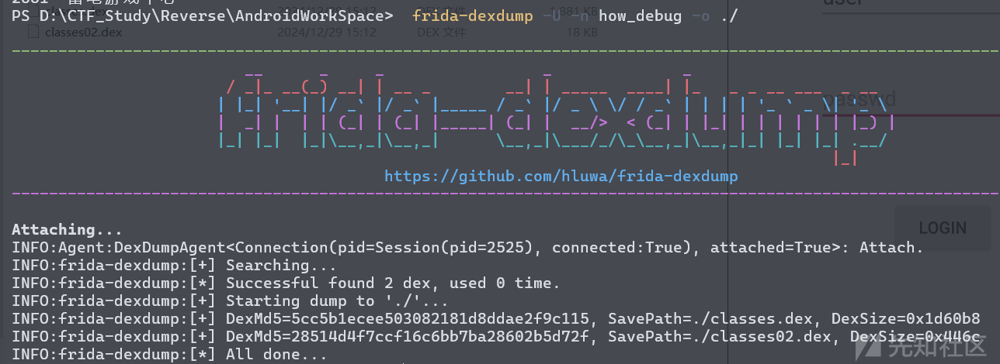

**3.开始分析脱壳出来后的DEX文件,成功寻找到activity的代码入口处**:  
脱壳出来的两个dex文件中偏大的就是我们需要分析的dex了:  
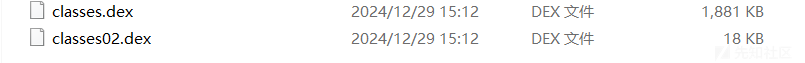  
直接拖入JADX开始分析工作,脱壳后成功找到了逻辑主要代码,之后就可以继续逆向分析了:  
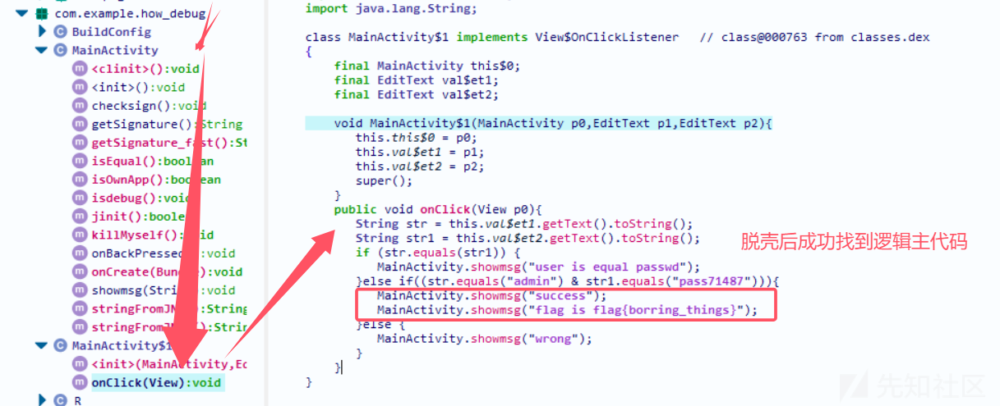

**4.开始分析按钮的逻辑代码,成功解析出flag的内容**:

```
class MainActivity$1 implements View$OnClickListener    // class@000763 from classes.dex
{
    final MainActivity this$0;
    final EditText val$et1;
    final EditText val$et2;

    void MainActivity$1(MainActivity p0,EditText p1,EditText p2){
       this.this$0 = p0;
       this.val$et1 = p1;
       this.val$et2 = p2;
       super();
    }
    public void onClick(View p0){
       String str = this.val$et1.getText().toString();
       String str1 = this.val$et2.getText().toString();
       if (str.equals(str1)) {
          MainActivity.showmsg("user is equal passwd");
       }else if((str.equals("admin") & str1.equals("pass71487"))){
          MainActivity.showmsg("success");
          MainActivity.showmsg("flag is flag{borring_things}");
       }else {
          MainActivity.showmsg("wrong");
       }
    }
}

```

所以得出flag就是flag{borring\_things}.

### 3. 资源与布局文件分析

#### A.如何寻找一个Activity页面的xml布局文件的位置?

> **目标**: 掌握如何定位和分析 APK 中的资源文件  
> **加固与脱壳学习**: [安卓逆向-脱壳学习记录 - Is Yang's Blog](https://www.isisy.com/1420.html)  
> **实战案例**:[攻防世界-基础Android](https://adworld.xctf.org.cn/media/file/task/6a0484a135bb44ba8fdcf829b5d9865b.apk)  
> **更详细的WP**:
>
> 1. [攻防世界-mobile高手进阶区“基础Android”逆向过程，三种方法，附文件 - 吾爱破解 - 52pojie.cn](https://www.52pojie.cn/thread-1632193-1-1.html)

首先按照上文提到的寻找入口点的方法锁定Activity代码实现的位置的onCreate函数:  
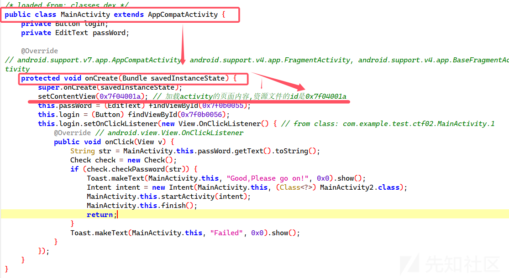

可以锁定到这个函数:

```
setContentView(0x7f04001a); // 加载activity的页面内容,资源文件的id是0x7f04001a
```

`setContentView()` 是 Android 中的一个方法，用于设置当前 Activity 的界面视图（UI）。这个方法通常在 `Activity` 的 `onCreate()` 方法中调用，用来加载布局文件，并将其显示在当前界面上。

`0x7f04001a` 是一个整数值，代表一个资源的 ID。这个资源 ID 对应的是一个 XML 布局文件（通常位于 `res/layout/` 目录下），在编译过程中由 Android 构建工具自动生成。  
所以我们可以手动寻找到布局文件通过jadx的搜索功能寻找到目标资源的名称:  
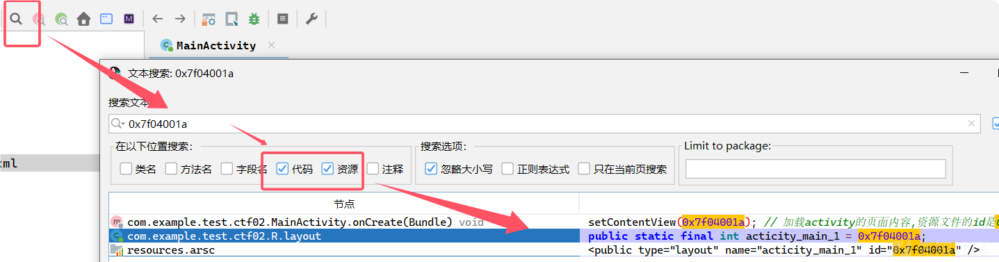

```
com.example.test.ctf02.R.layout:
        public static final int acticity_main_1 = 0x7f04001a;

```

成功获得资源的id和名称,接下来就是在布局文件中寻找了!  
成功在res目录下的layout目录下找到了activity'的页面布局文件:  
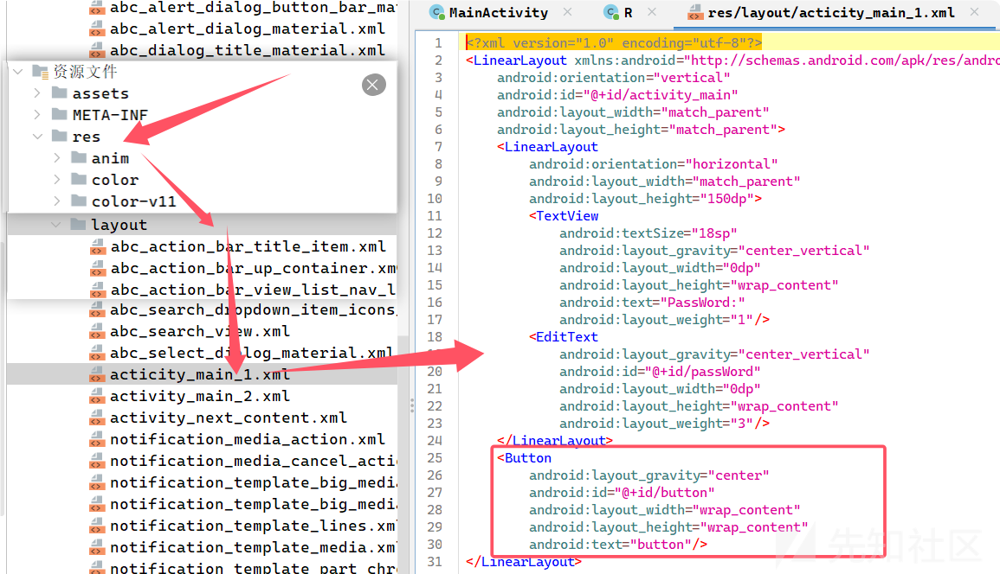  
对比一下xml文件和运行后的app界面:  
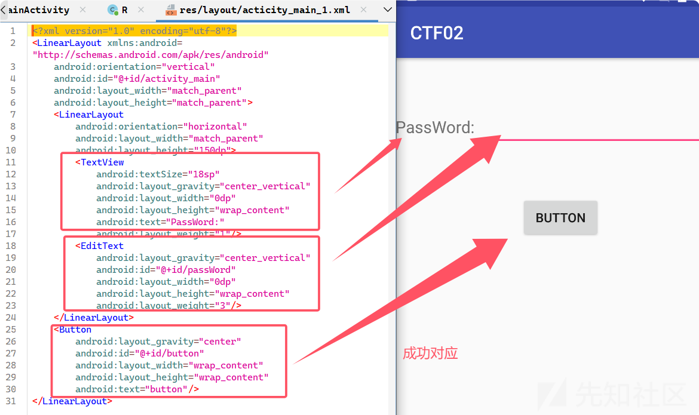

##### xml布局文件的寻找流程梳理

每个 `Activity` 在启动时通常会加载一个或多个布局文件。要找到与 `Activity` 关联的 XML 布局文件，可以按照以下步骤进行：  
1.**查找 `setContentView()` 调用**：这是在 `Activity` 中加载布局的标准方法。通过反编译的代码中查找 `setContentView()`，通常会传递一个布局文件的资源 ID。  
例如：

```
setContentView(R.layout.activity_main);

```

通过这个 ID（如 `R.layout.activity_main`），你可以定位到 `res/layout` 目录下的 XML 布局文件。

2.**手动分析布局文件**：在 APK 中，所有的布局文件都存储在 `res/layout` 目录下。你可以查看这个目录，找到与 `Activity` 相关联的 XML 文件，并分析其 UI 结构。

#### B.如何寻找按钮动态绑定和静态绑定的函数是什么?

在分析 Android 应用时，了解按钮（Button）是如何与函数进行绑定的非常重要。按钮的绑定方式通常有两种：动态绑定和静态绑定。

##### 1.按钮动态绑定函数

动态绑定函数是指通过代码在运行时绑定事件处理程序（如点击事件）到 UI 元素（如按钮）上。通常，按钮的动态绑定是通过 `setOnClickListener()` 方法来实现的，这个方法为按钮设置了点击事件监听器。

> **目标**: 掌握APP是如何动态的为按钮绑定函数的  
> **实战案例**:[攻防世界-基础Android](https://adworld.xctf.org.cn/media/file/task/6a0484a135bb44ba8fdcf829b5d9865b.apk)  
> **更详细的WP**:
>
> 1. [攻防世界-mobile高手进阶区“基础Android”逆向过程，三种方法，附文件 - 吾爱破解 - 52pojie.cn](https://www.52pojie.cn/thread-1632193-1-1.html)

以攻防世界-基础Android这道题目为例:  
首先按照上文提到的寻找入口点的方法锁定Activity代码实现的位置的onCreate函数:  
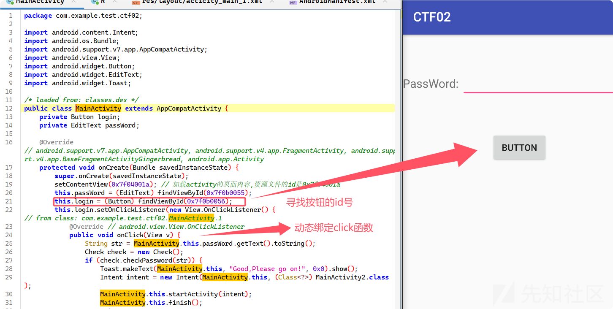  
首先，在 `onCreate()` 方法中，我们可以找到动态绑定的实现代码：

```
public class MainActivity extends AppCompatActivity {
    private Button login;
    private EditText passWord;

    protected void onCreate(Bundle savedInstanceState) {
        super.onCreate(savedInstanceState);
        setContentView(0x7f04001a); // 加载activity的页面内容，资源文件的id是0x7f04001a

        // 动态绑定 EditText 和 Button
        this.passWord = (EditText) findViewById(0x7f0b0055); // 获取 EditText 组件
        this.login = (Button) findViewById(0x7f0b0056); // 获取 Button 组件

        // 给按钮设置点击事件监听器
        this.login.setOnClickListener(new View.OnClickListener() {
            @Override // android.view.View.OnClickListener
            public void onClick(View v) {
                String str = MainActivity.this.passWord.getText().toString(); // 获取密码输入框的内容
                Check check = new Check(); // 调用 Check 类中的函数
                // 处理逻辑...
            }
        });
    }
}

```

* `findViewById()` 方法用于查找页面中的 UI 组件，这里查找的是 `Button` 和 `EditText` 组件。
* `setOnClickListener()` 方法是动态绑定的核心，表示为按钮设置了点击事件监听器。当用户点击按钮时，`onClick()` 方法会被调用。
* 在 `onClick()` 方法内部，开发者可以实现点击事件的逻辑，例如获取输入框内容、进行检查等。

##### 2.按钮静态绑定函数

> **目标**: 掌握APP是如何为静态的为按钮绑定函数的  
> **实战案例**:[BUUCTF在线-FlareOn6\_FlareBear](https://buuoj.cn/challenges#[FlareOn6]FlareBear)  
> **更详细的WP**:
>
> 1. [[FlareOn6]FlareBear-CSDN博客](https://blog.csdn.net/qq_41853048/article/details/132126408)

静态绑定函数是通过 XML 文件静态地将按钮与事件处理函数关联，在 Android 中通常通过 `android:onClick` 属性来实现。

以BUUCTF在线-FlareOn6\_FlareBear这道题目为例:  
首先按照上文提到的如何寻找一个Activity页面的xml布局文件的位置的方法找到页面的xml文件:  
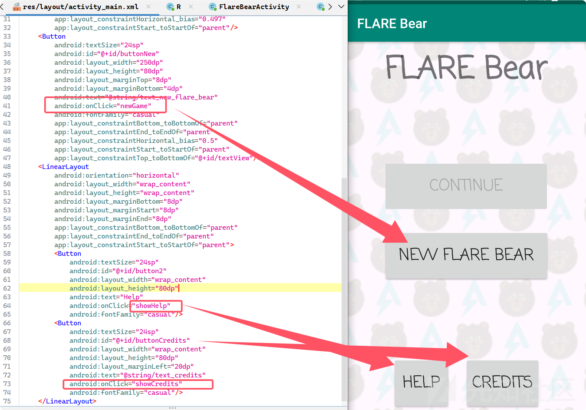  
可以在这个xml文件中发现:

```
<Button
            android:textSize="24sp"
            android:id="@+id/button2"
            android:layout_width="wrap_content"
            android:layout_height="80dp"
            android:text="Help"
            android:onClick="showHelp"   //该按钮绑定了一个showHelp函数
            android:fontFamily="casual"/>
        <Button
            android:textSize="24sp"
            android:id="@+id/buttonCredits"
            android:layout_width="wrap_content"
            android:layout_height="80dp"
            android:layout_marginLeft="20dp"
            android:text="@string/text_credits"
            android:onClick="showCredits"  //该按钮绑定了一个showCredits函数
            android:fontFamily="casual"/>

```

根据函数名称可以在代码中寻找到函数的实现:  
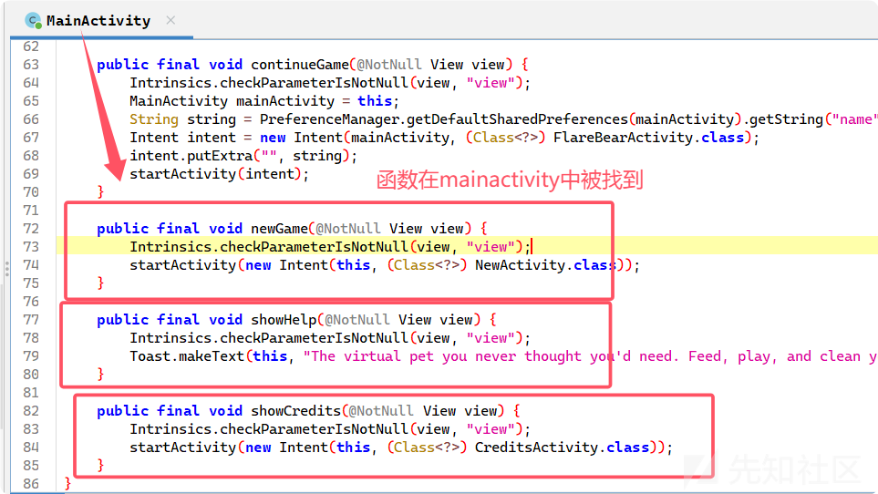

* 在 XML 文件中，`android:onClick="onLoginClick"` 表示按钮的点击事件将绑定到 `onLoginClick()` 方法。
* 在 `Activity` 中，`onLoginClick()` 方法的参数必须是 `View` 类型，它会自动接收点击的视图（在这里是 `Button`）。
* 按钮的点击事件处理是通过静态绑定（XML 声明）完成的，事件处理函数在代码中定义好，并且由 Android 系统自动调用。

**静态绑定** 是通过 XML 文件中的 `android:onClick` 属性，将按钮与方法绑定，在应用启动时，系统会自动为按钮设置监听事件并调用绑定的函数。

##### 3.安卓中按钮的动静态绑定函数的方法梳理

**1.按钮动态绑定函数**  
动态绑定通常通过代码中的 `setOnClickListener()` 方法进行。以下是一个例子：

```
Button btn = findViewById(R.id.my_button);
btn.setOnClickListener(new View.OnClickListener() {
    @Override
    public void onClick(View v) {
        // 触发的逻辑
    }
});

```

在反编译的代码中，找到 `setOnClickListener()` 的实现，可以追踪到事件响应的函数。

**2.按钮静态绑定函数**  
静态绑定通常通过在 XML 布局文件中直接指定一个函数来完成。例如：

```
<Button
    android:id="@+id/my_button"
    android:text="Click me"
    android:onClick="buttonClicked" />

```

在这个例子中，`android:onClick` 指定了 `Activity` 中的 `buttonClicked(View view)` 函数。反编译后，可以找到该函数并分析其逻辑。

#### C.如何寻找一个资源文件在apk中的位置?

> **目标**: 如何寻找一个资源文件在apk中的位置  
> **实战案例**:[攻防世界-基础Android](https://adworld.xctf.org.cn/media/file/task/6a0484a135bb44ba8fdcf829b5d9865b.apk)  
> **更详细的WP**:
>
> 1. [攻防世界-mobile高手进阶区“基础Android”逆向过程，三种方法，附文件 - 吾爱破解 - 52pojie.cn](https://www.52pojie.cn/thread-1632193-1-1.html)

以攻防世界-基础Android这道题目为例:  
首先定位带本题的程序中的:com.example.test.ctf02.MainActivity2代码里的init函数.  
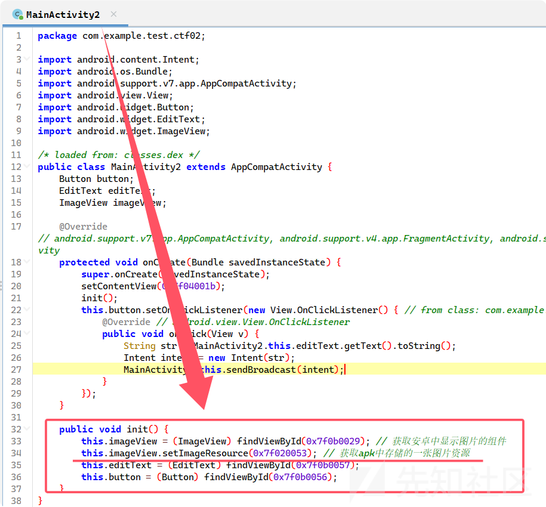  
寻找到代码:

```
public void init() {
    this.imageView = (ImageView) findViewById(0x7f0b0029); // 获取安卓中显示图片的组件
    this.imageView.setImageResource(0x7f020053); // 设置资源ID为图片资源
    this.editText = (EditText) findViewById(0x7f0b0057); // 获取编辑框组件
    this.button = (Button) findViewById(0x7f0b0056); // 获取按钮组件
}

```

在这段代码中，`0x7f020053` 是一个资源ID，它对应的是 `setImageResource()` 方法中的资源项。为了了解这个资源对应的是哪个实际文件，我们需要查找该资源ID在 APK 中的定义位置。

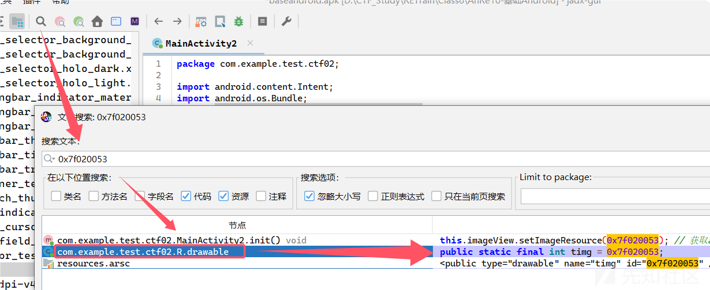  
我们使用反编译工具（如 `JD-GUI` 或 `jdax`）来查看 APK 中的源代码和资源文件映射关系。我们可以直接搜索资源ID `0x7f020053` 在反编译后的代码中的定义位置。

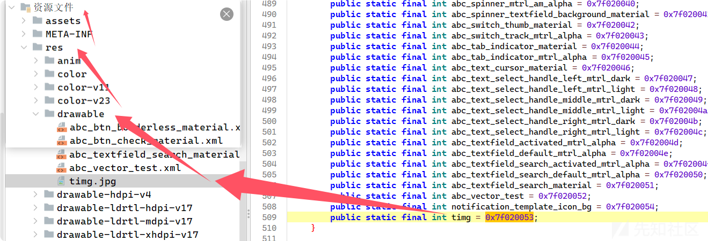  
最后得到的

```
com.example.test.ctf02.R.drawable:
        public static final int timg = 0x7f020053;

```

根据搜索结果，我们得知 `0x7f020053` 对应的是 `timg`，这是一个在 `R.drawable` 中定义的资源。接下来，我们可以查看 `res/drawable/` 文件夹中的资源文件，它通常是一个图片文件，如 `timg.png` 或 `timg.jpg`。

通过反编译 APK 或使用相应的工具（如 `jdax`, `JD-GUI`, `apktool` 等），我们可以从资源ID（如 `0x7f020053`）入手，查找它在源代码中对应的资源名，并通过资源ID映射到 APK 中实际的资源文件，通常是在 `res/drawable/` 目录下的图片文件。

##### 寻找一个资源文件的流程梳理

要查找资源文件（如图片、字符串、布局等）在 APK 中的位置，可以按照以下步骤进行：

1. **查找资源引用**：通过反编译的代码，查看资源的引用（如 `R.drawable.xxx`、`R.string.xxx` 等），然后在 `res` 目录下找到对应的文件。
2. **查看 `res` 目录**：所有资源文件都会存储在 APK 文件的 `res` 目录下。`res/drawable/` 存放图片资源，`res/layout/` 存放布局文件，`res/values/` 存放字符串、颜色等属性资源。

### 4. Java层代码逆向

Java 层的逆向工程通常涉及到分析反编译后的字节码。反编译工具如 JADX、JEB 或者 Procyon 可以将 `.dex` 文件反编译成可读的 Java 代码。通过这些代码，我们可以深入分析程序的逻辑，包括数据加密、网络通信、权限管理等方面的实现。

#### 技巧与工具

* **JADX**：一个流行的反编译工具，可以将 `.dex` 文件反编译成 Java 代码。
* **JEB**：更强大的商业化逆向工具，适合进行深入的 APK 逆向分析。

#### Java层逆向实战案例

> **目标**: 了解如何进行Java层逆向  
> **实战案例**:[BUU-findit](https://buuoj.cn/challenges#findit)  
> **更详细的WP**:
>
> 1. [(4条消息) BUUCTF Reverse刷题笔记05——findit\_Taikx的博客-CSDN博客\_buuctf findit](https://blog.csdn.net/Taikx/article/details/118877481)

**1.将apk拖入JADX后寻找到AndroidManifest.xml文件寻找入口点**:  
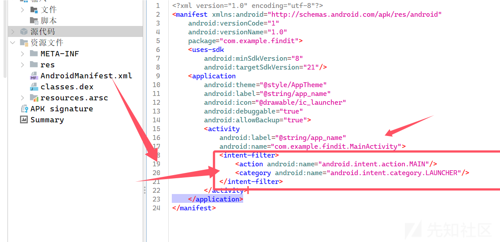  
**2.锁定APP的逻辑著代码之后就可以开始JAVA层逻辑代码逆向了**  
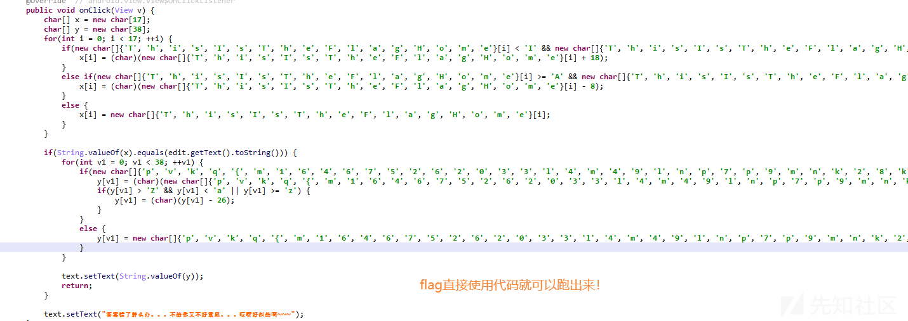  
找到关键代码

```
new char[]{'T', 'h', 'i', 's', 'I', 's', 'T', 'h', 'e', 'F', 'l', 'a', 'g', 'H', 'o', 'm', 'e'}[i]
new char[]{'p', 'v', 'k', 'q', '{', 'm', '1', '6', '4', '6', '7', '5', '2', '6', '2', '0', '3', '3', 'l', '4', 'm', '4', '9', 'l', 'n', 'p', '7', 'p', '9', 'm', 'n', 'k', '2', '8', 'k', '7', '5', '}'}[v1]

找到两个关键字符串！
ThisIsTheFlagHome和pvkq{m164675262033l4m49lnp7p9mnk28k75}
```

分析关键代码:

```
// 当用户点击按钮时执行的点击事件处理方法
public void onClick(View v) {
    // 定义两个字符数组，分别用于存放转换后的字符
    char[] x = new char[17];  // 用于存放处理后的输入字符
    char[] y = new char[38];  // 用于存放处理后的pvkq字符

    // 遍历输入字符数组thisf进行字符转换
    for(int i = 0; i < 17; ++i) {
        // 如果字符在'A'-'Z' 或 'a'-'z'之间，进行转换
        if(thisf[i] < 73 && thisf[i] >= 65 || thisf[i] < 105 && thisf[i] >= 97) {
            // 将字符的ASCII值加18，转换后存入x数组
            x[i] = (char)(thisf[i] + 18);
        }
        // 如果字符在'A'-'Z' 或 'a'-'z'之间，进行另一种转换
        else if(thisf[i] >= 65 && thisf[i] <= 90 || thisf[i] >= 97 && thisf[i] <= 0x7A) {
            // 将字符的ASCII值减8，转换后存入x数组
            x[i] = (char)(thisf[i] - 8);
        }
        else {
            // 如果不符合上述条件，直接将字符赋值给x数组
            x[i] = thisf[i];
        }
    }

    // 如果转换后的x数组和输入的文本相同，则执行后续操作
    if(String.valueOf(x).equals(edit.getText().toString())) {
        // 遍历pvkq数组进行字符转换
        for(int v1 = 0; v1 < 38; ++v1) {
            // 如果字符是字母，进行字符加密处理
            if(pvkq[v1] >= 'A' && pvkq[v1] <= 'Z' || pvkq[v1] >= 'a' && pvkq[v1] <= 'z') {
                // 将字符的ASCII值加16
                y[v1] = (char)(pvkq[v1] + 16);
                // 如果加16后字符超过了'Z'或者小于'a'，进行循环处理
                if(y[v1] > 'Z' && y[v1] < 'a' || y[v1] >= 'z') {
                    y[v1] = (char)(y[v1] - 26);  // 将字符的ASCII值减去26
                }
            }
            else {
                // 非字母字符直接赋值给y数组
                y[v1] = pvkq[v1];
            }
        }

        // 将转换后的y数组字符设置为文本内容
        text.setText(String.valueOf(y));
        return;  // 结束方法
    }

    // 如果转换后的x数组与输入文本不相同，显示错误提示
    text.setText("答案错了肿么办。。。不给你又不好意思。。。哎呀好纠结啊~~~");
}

```

分析后可以发现这其实是一个开始加密的密码:

```
pvkq{m164675262033l4m49lnp7p9mnk28k75}
```

按照题目要求包上flag{}上交，发现不对，事情果真没有这么简单  
仔细观察pvkq，发现f——>p为10，l——>v为10，a——>k为10，g——>q为10，  
所有这我们还需要将得到的字符串进行一次凯撒加密  
凯撒解密：[CTF在线工具-在线凯撒密码加密|在线凯撒密码解密|凯撒密码算法|Caesar Cipher (hiencode.com)](http://www.hiencode.com/caesar.html)

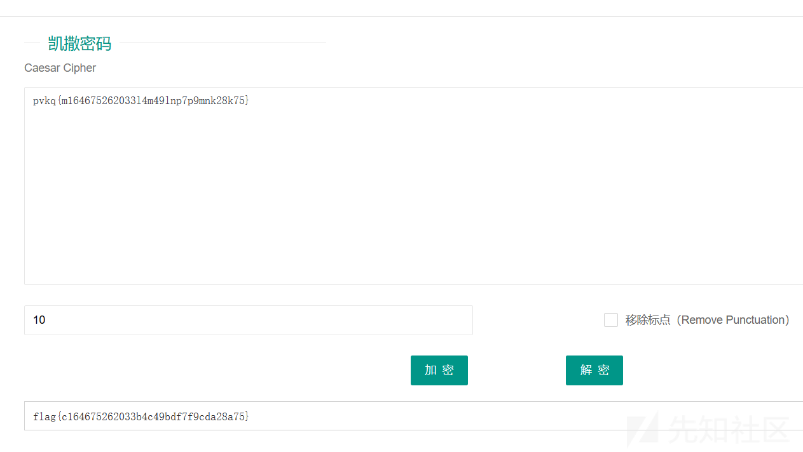

### 5. Native层逆向

Native 层逆向工程涉及到分析 Android 应用中使用的 C 或 C++ 代码。Native 代码通常通过 JNI（Java Native Interface）与 Java 层交互。要逆向 Native 代码，首先需要反编译 APK 中的 `.so` 库文件。

#### 逆向分析步骤：

1. **提取 `.so` 文件**：通过解压 APK，可以获取到 `lib` 目录下的 `.so` 文件，这些文件通常存储了应用的本地库。
2. **反编译 `.so` 文件**：使用工具如 IDA Pro、Ghidra 或 Radare2 来反编译这些二进制文件。通过反汇编，我们可以获得 Native 代码的控制流和逻辑。
3. **分析 JNI 接口**：查找与 Java 层交互的 JNI 函数。JNI 函数通常以 `Java_` 开头，例如 `Java_com_example_app_NativeMethod`。

#### Native层逆向实战案例

> **目标**: 了解如何进行Java层逆向  
> **实战案例**:[攻防世界-Mobile-easy-so](https://adworld.xctf.org.cn/media/file/task/456c1dab04b24036ba1d6e32a08dc882.apk)  
> **更详细的WP**:
>
> 1. [CTF逆向-EasySo攻防世界SO层反汇编\_so反汇编\_Tr0e的博客-CSDN博客](https://blog.csdn.net/weixin_39190897/article/details/115561277)

**1.将apk拖入JADX后寻找到AndroidManifest.xml文件寻找入口点**:  
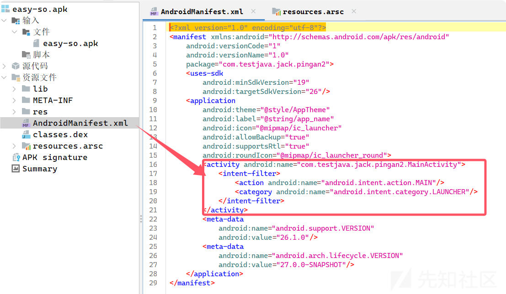  
得到代码入口点位置:**android:name="com.testjava.jack.pingan2.MainActivity"**  
**2.锁定java层代码中的代码逻辑部分**:  
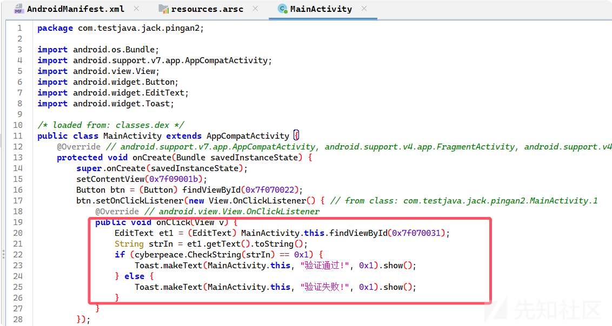

```
public void onClick(View v) {
     EditText et1 = (EditText) MainActivity.this.findViewById(0x7f070031);
     String strIn = et1.getText().toString();
     if (cyberpeace.CheckString(strIn) == 0x1) {
         Toast.makeText(MainActivity.this, "验证通过!", 0x1).show();
     } else {
         Toast.makeText(MainActivity.this, "验证失败!", 0x1).show();
     }
 }

```

代码逻辑校验部分!核心是CheckString函数就可以进去:  
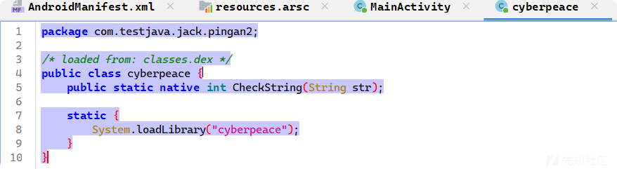  
代码部分:

```
package com.testjava.jack.pingan2;

// `cyberpeace` 类是用来与本地代码（C/C++）交互的。
// 这个类定义了一个本地方法 `CheckString`，它将在本地库中实现，
// 该方法用于检查传入的字符串，可能用于某种字符串校验逻辑。
public class cyberpeace {

    // 本地方法声明，Java 中的 native 方法是没有实现的，
    // 其实现会在 C 或 C++ 等本地代码中定义。
    // `CheckString` 函数接收一个字符串作为参数，并返回一个整数作为校验结果。
    // 这个方法可能会返回一个标志，表示字符串是否符合某种规则或要求。
    public static native int CheckString(String str);

    // 静态代码块，程序加载时会执行这个块中的代码。
    static {
        // 在此加载本地库 `cyberpeace`，该库包含了本地方法的实现。
        // `System.loadLibrary("cyberpeace");` 将加载名为 "cyberpeace" 的本地库，
        // 这个库文件必须存在于系统的库路径中（例如，系统的 `.so` 文件、`.dll` 文件或 `.dylib` 文件）。
        System.loadLibrary("cyberpeace");
    }
}

```

`cyberpeace` 类提供了与本地库交互的接口。`CheckString` 方法通过本地代码实现字符串的校验。Java 端声明了方法，而具体的校验逻辑则是在本地代码中实现的。通过 `System.loadLibrary` 加载本地库，使得 Java 程序能够调用本地实现的逻辑。

可以通过JADX的导出功能将so文件导出,或者直接在压缩包文件夹中搜索:  
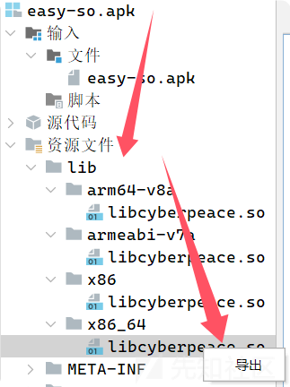

**3.跟进Native层的汇编代码实现,在IDA中查看反汇编**:  
在IDA的Export窗口可以找到Native层的函数定义:  
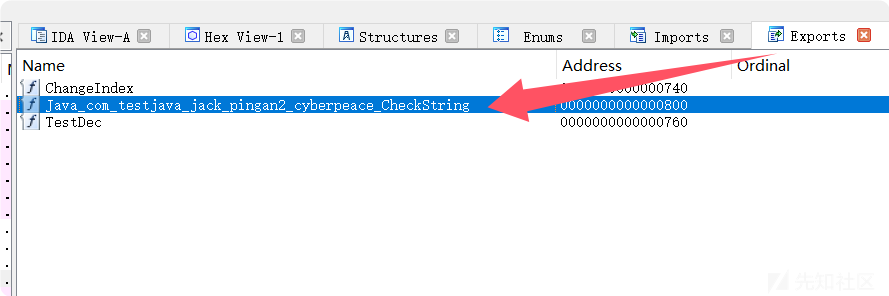  
周到后还需要解决函数结构体的定义问题:  
IDA导入.h文件：[IDA导入jni.h头文件\_ida jni.h-CSDN博客](https://blog.csdn.net/qq_30135181/article/details/81909907)

```
_BOOL8 __fastcall Java_com_testjava_jack_pingan2_cyberpeace_CheckString(_JNIEnv *a1, jobject a2, jstring a3)
{
  // [COLLAPSED LOCAL DECLARATIONS. PRESS KEYPAD CTRL-"+" TO EXPAND]

  string1 = a1->functions->GetStringUTFChars(a1, a3, 0LL);
  len = strlen(string1);
  v5 = len;
  size = ((len << 32) + 0x100000000LL) >> 32;   // 将 v5 左移 32 位后再右移 32 位，相当于只保留低 32 位（这里的操作是为了计算内存分配大小）
  ptr_chunk = malloc(size);
  chunk1 = ptr_chunk;
  isflag = size <= v5;
  true_size = size - v5;
  if ( isflag )
    true_size = 0LL;
  memset(&ptr_chunk[v5], 0, true_size);
  memcpy(chunk1, string1, v5);
  if ( strlen(chunk1) >= 2 )
  {
    idx = 0LL;                                  // 第一部分代码交换了每 16 个字符之间的位置，直到字符串长度的一半
    do
    {
      tmp = chunk1[idx];
      chunk1[idx] = chunk1[idx + 16];
      chunk1[idx++ + 16] = tmp;
    }
    while ( strlen(chunk1) >> 1 > idx );        // 当 v11 小于字符串长度的一半时，继续循环
  }
  v13 = *chunk1;
  if ( *chunk1 )
  {
    *chunk1 = chunk1[1];
    chunk1[1] = v13;
    if ( strlen(chunk1) >= 3 )                  // 第二部分首先交换了前两个字符，然后每两个字符进行一次交换，直到字符串的末尾。
    {
      idx2 = 2LL;
      do
      {
        v15 = chunk1[idx2];
        chunk1[idx2] = chunk1[idx2 + 1];
        chunk1[idx2 + 1] = v15;
        idx2 += 2LL;
      }
      while ( strlen(chunk1) > idx2 );
    }
  }
  return strcmp(chunk1, "f72c5a36569418a20907b55be5bf95ad") == 0;// 要求满足条件
}

```

**4.锁定so文件中要分析的函数逆运算得出flag**:  
**步骤 1：两两交换**

```
*chunk1 = chunk1[1];
    chunk1[1] = v13;
    if ( strlen(chunk1) >= 3 )                  // 第二部分首先交换了前两个字符，然后每两个字符进行一次交换，直到字符串的末尾。
    {
      idx2 = 2LL;
      do
      {
        v15 = chunk1[idx2];
        chunk1[idx2] = chunk1[idx2 + 1];
        chunk1[idx2 + 1] = v15;
        idx2 += 2LL;
      }
      while ( strlen(chunk1) > idx2 );

```

给定字符串 `f72c5a36569418a20907b55be5bf95ad`，我们需要将它按照两两字符交换的方式进行处理：  
原字符串：`f72c5a36569418a20907b55be5bf95ad`  
交换后的字符串：`7fc2a5636549812a90705bb55efb59da`  
这一步骤通过每两个字符进行交换，得到中间结果。

**步骤 2：从中间砍断并拼接**

```
if ( strlen(chunk1) >= 2 )
  {
    idx = 0LL;                                  // 第一部分代码交换了每 16 个字符之间的位置，直到字符串长度的一半
    do
    {
      tmp = chunk1[idx];
      chunk1[idx] = chunk1[idx + 16];
      chunk1[idx++ + 16] = tmp;
    }
    while ( strlen(chunk1) >> 1 > idx );        // 当 v11 小于字符串长度的一半时，继续循环
  }

```

接下来，我们将字符串 `7fc2a5636549812a90705bb55efb59da` 从中间砍断，并将头部拼接到尾部。  
字符串长度是 32（即 16 对字符），中间点是 16，所以我们将前半部分（`7fc2a5636549812a`）和后半部分（`90705bb55efb59da`）交换位置。  
交换后的字符串：`90705bb55efb59da7fc2a5636549812a`

**步骤 3：格式化为 `flag{XXXX}`**  
最后一步，我们将转换后的字符串按 `flag{XXXX}` 的格式显示出来。  
得到的字符串：`90705bb55efb59da7fc2a5636549812a`  
所以最终需要提交的平台 flag 值就是：`flag{90705bb55efb59da7fc2a5636549812a}`

最后得出结果:

```
s = list('f72c5a36569418a20907b55be5bf95ad')

for i in range(0, len(s), 2):
    s1 = s[i]
    s[i] = s[i+1]
    s[i+1] = s1

for i in range(len(s)//2):
    s2 = s[i]
    s[i] = s[i+16]
    s[i+16] = s2

print('flag{' + ''.join(i for i in s) + '}')

```

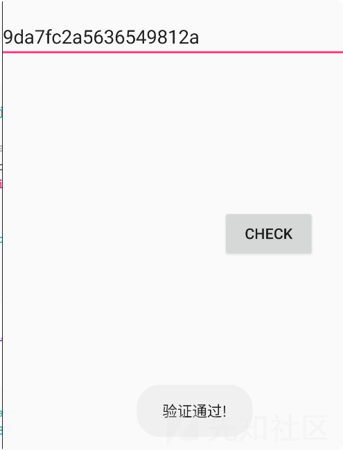

## 第五章：安卓系统中的四大组件

> 概述:Android 系统中的四大组件是应用程序的核心组成部分，它们分别是 **Activity**、**Service**、**Broadcast Receiver** 和 **Content Provider**。每个组件有不同的功能和作用，它们在应用程序中负责不同的任务，这些组件通过 **Intent**、**Binder** 等机制进行交互和通信，相互协作,构成了 Android 应用的整体架构。

相关资料:[安卓逆向-APK结构到四大组件的分析 - FreeBuf网络安全行业门户](https://www.freebuf.com/articles/mobile/285396.html)

1. 活动（activity) ：用于用户交互界面，处理屏幕显示和用户输入。
2. 服务（service):用于后台任务，执行长期运行的操作而不直接与用户交互。
3. 广播接收者（Broadcast recive) : 用于接收和处理广播消息，能够监听系统或其他应用的事件。
4. 内容提供者（Content provider）：支持多个应用中存储和读取数据，相当于数据库

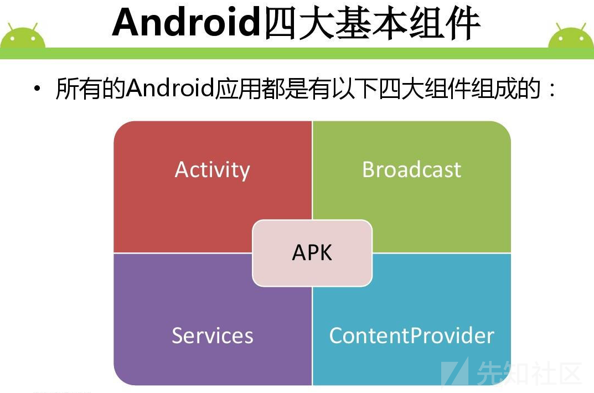

### 1. Activity（活动）

**Activity** 是 Android 应用中负责用户界面和交互的核心组件。每个应用至少有一个 `Activity`，它通常作为应用的启动点，用于展示 UI 并处理用户输入。`Activity` 通过生命周期方法管理与用户的交互，并通过 **Intent** 在多个 `Activity` 之间进行跳转。  
**主要功能**：

* 负责用户界面的展示和用户的交互。
* 每个应用至少有一个 `Activity`，通常应用的启动点就是一个 `Activity`。
* 可以通过 **Intent** 在不同的 `Activity` 之间进行跳转。

**Activity如何在AndroidManifest.xml文件中声明**:

```
<activity
    android:name=".MainActivity"  <!-- 活动类的名称 -->
    android:label="Main Activity"  <!-- 活动的名称标签 -->
    android:theme="@style/Theme.AppCompat.Light"  <!-- 活动的主题 -->
    android:launchMode="singleTask"  <!-- 启动模式 -->
    android:screenOrientation="landscape"  <!-- 屏幕方向 -->
    android:exported="true"  <!-- 是否允许外部启动 -->
    android:configChanges="orientation|keyboardHidden"  <!-- 配置变化 -->
    android:permission="android.permission.INTERNET">  <!-- 需要的权限 -->

    <!-- 可选：定义Intent过滤器，用于匹配启动Activity的Intent -->
    <intent-filter>
        <action android:name="android.intent.action.MAIN" />
        <category android:name="android.intent.category.LAUNCHER" />
    </intent-filter>
</activity>

```

* `<activity>` 标签在 `AndroidManifest.xml` 中用于声明一个 `Activity` 组件。
* 通过设置各个属性，开发者可以控制 `Activity` 的行为、主题、启动模式以及是否允许外部访问等。
* `intent-filter` 用于声明 `Activity` 能够响应的 `Intent`，是启动 `Activity` 的关键。

Activity的官方介绍:[activity 生命周期 | Android Developers](https://developer.android.google.cn/guide/components/activities/activity-lifecycle?hl=zh-cn)  
Activity是一个界面，一个APP是由很多个Activity进行界面调用的，想要使用Activity需要在AndroidManifest中声明，只要调用的就需要声明！（GAD）  
下面是使用GAD查看一个APP的AndroidManifest.xml文件：  
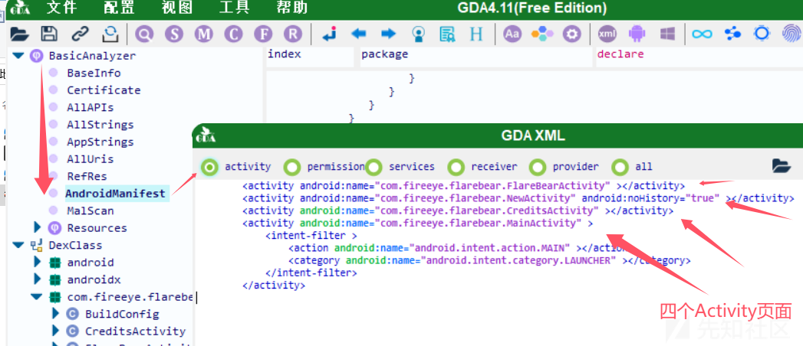

#### 开发时如何创建一个Activity类

在 Android 中创建一个 `Activity` 类，通常需要继承 `Activity` 或其子类。可以选择直接继承 `Activity` 类来创建你的自定义 `Activity`，但是 Android 还提供了几个 `Activity` 的子类，常见的包括：

* `AppCompatActivity`：这是支持库中的 `Activity` 子类，提供了对 `ActionBar` 的支持，通常用于开发现代 Android 应用。
* `FragmentActivity`：继承自 `Activity`，用于支持 Fragment。
* `TabActivity`（已废弃）：曾经用于实现选项卡式界面的 `Activity`。

实际查看一个APP的一个Activity：  
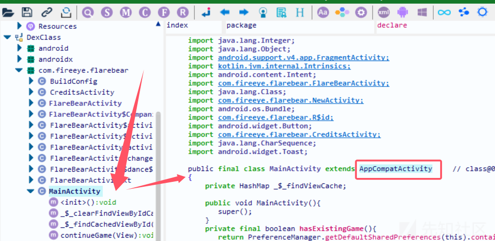

`AppCompatActivity` 是一种常见的 `Activity` 子类，它提供了更多特性支持，并兼容较低版本的 Android 系统，继承 `AppCompatActivity`类：

```
import android.content.Intent;
import android.os.Bundle;
import android.view.View;
import android.widget.Button;
import androidx.appcompat.app.AppCompatActivity;

public class MainActivity extends AppCompatActivity {
    private Button button;
    private Button enableDisableButton;
    @Override
    protected void onCreate(Bundle savedInstanceState) {
        super.onCreate(savedInstanceState);
        // 设置当前 Activity 的布局视图
        setContentView(R.layout.activity_main);
        // 获取布局中的按钮
        button = findViewById(R.id.button);
        enableDisableButton = findViewById(R.id.enableDisableButton);
        // 为 "Enable/Disable" 按钮设置点击事件
        enableDisableButton.setOnClickListener(new View.OnClickListener() {
            @Override
            public void onClick(View v) {
                // 如果按钮已经启用，则禁用它；如果已禁用，则启用它
                if (button.isEnabled()) {
                    button.setEnabled(false);  // 禁用按钮
                    enableDisableButton.setText("Enable Button");  // 更新按钮文本
                } else {
                    button.setEnabled(true);  // 启用按钮
                    enableDisableButton.setText("Disable Button");  // 更新按钮文本
                }
            }
        });

        // 为 "Go to Second Activity" 按钮设置点击事件
        button.setOnClickListener(new View.OnClickListener() {
            @Override
            public void onClick(View v) {
                // 启动 SecondActivity
                Intent intent = new Intent(MainActivity.this, SecondActivity.class);
                startActivity(intent);
            }
        });
    }
}

```

这个例子展示了如何在 `Activity` 中使用 `setEnabled()` 来控制 UI 组件的启用状态，使用 `setContentView()` 来设置布局，并通过 `startActivity()` 来启动另一个 `Activity`。这些是构建交互式 Android 应用时非常常见的操作。  
了解一些简单的Android API函数:

* setEnabled(true/false) : `setEnabled()` 是 `View` 类中的方法，用于启用或禁用视图组件。
* setContentView():`setContentView()` 是 `Activity` 类中的方法，用于设置当前 `Activity` 的布局视图
* startActivity():`startActivity()` 是 `Context` 类中的方法，用于启动一个新的 `Activity`

#### Activity 运行的生命流程

在 Android 中，`Activity` 的生命周期是应用开发中非常重要的一部分，它决定了应用在不同状态下如何响应用户操作以及如何管理资源。Android 提供了一系列生命周期方法，这些方法帮助开发者管理 `Activity` 在不同阶段的行为。下面是对 `Activity` 生命周期的详细讲解，并结合实际案例进一步阐释。

`Activity` 的生命周期非常重要，Android 提供了多个生命周期方法来管理 `Activity` 的状态，例如：

* `onCreate()`：初始化 `Activity`，加载界面。
* `onStart()`：当 `Activity` 可见但未获取焦点时调用。
* `onResume()`：当 `Activity` 获得焦点并开始与用户交互时调用。
* `onPause()`：当另一个 `Activity` 获得焦点时调用，通常用来保存数据或释放资源。
* `onStop()`：当 `Activity` 不再可见时调用。
* `onDestroy()`：`Activity` 被销毁时调用。

下面是一个实际的应用案例,在不同时间时刻Activity的页面的每个关键点都可以进行设置,比如下面这个案例就将每次进入这个页面的动作做进行判断,是否开放按钮的点击权限!  
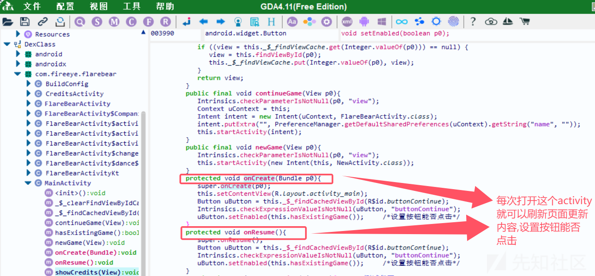

```
protected void onCreate(Bundle p0){
   super.onCreate(p0);
   this.setContentView(R.layout.activity_main);
   Button uButton = this._$_findCachedViewById(R$id.buttonContinue);
   Intrinsics.checkExpressionValueIsNotNull(uButton, "buttonContinue");
   uButton.setEnabled(this.hasExistingGame());  /*设置按钮能否点击*/
}

protected void onResume(){
   super.onResume();
   Button uButton = this._$_findCachedViewById(R$id.buttonContinue);
   Intrinsics.checkExpressionValueIsNotNull(uButton, "buttonContinue");
   uButton.setEnabled(this.hasExistingGame());  /*设置按钮能否点击*/
}

```

* 我们通过 `onCreate()` 和 `onResume()` 方法来控制按钮的启用状态。通过 `hasExistingGame()` 方法判断是否有正在进行的游戏，确保用户只能在合适的时机点击按钮。
* `onCreate()` 用于初始化和设置初始状态，`onResume()` 用于更新Activity状态，确保界面总是保持最新的状态，可以及时更新页面状态。

下面就是在满足条件切换页面后onResume函数被触发,页面内容进行了更新:  
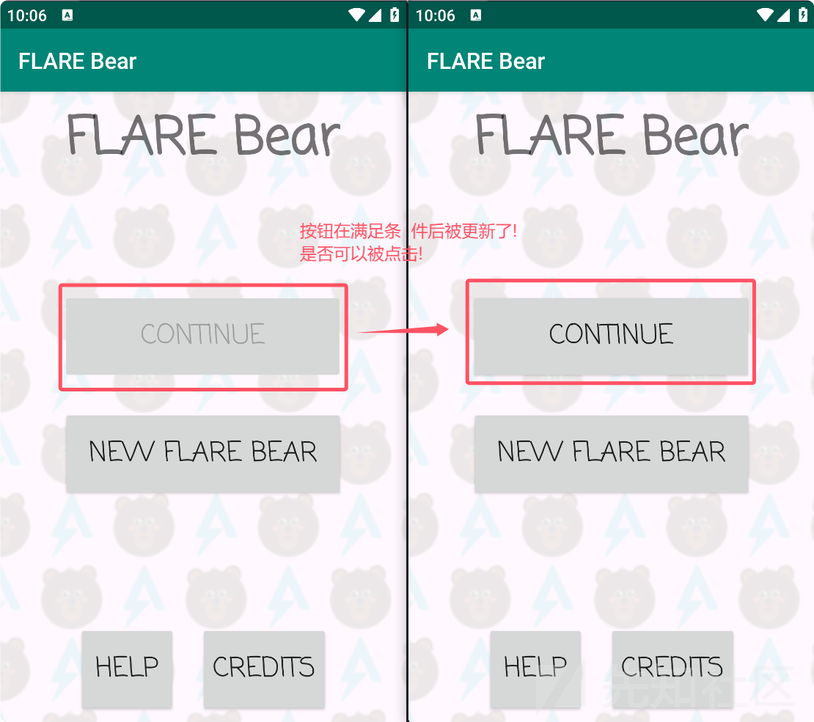

### 2. **Service (服务)**

`Service` 是一个在后台运行的应用组件，它不与用户直接交互，但可以在后台执行长时间的任务。比如，下载文件、播放音乐或进行网络请求等。`Service` 主要用于执行需要长时间运行的操作，或者即使用户切换到其他应用时，服务也能继续运行。

**主要功能**：

* 负责执行后台任务，通常不需要用户交互。
* 可以在主线程之外执行长时间运行的操作，如下载文件、播放音乐。
* 可以与其他组件（如 `Activity`）通信，或者通过广播来通知事件。

**生命周期**：  
`Service` 的生命周期也由多个方法来控制，例如：

* `onCreate()`：当服务第一次被创建时调用。
* `onStartCommand()`：每次调用 `startService()` 后都会调用该方法，用来处理后台任务。
* `onBind()`：当 `Service` 需要与其他组件（如 `Activity`）进行绑定时调用。
* `onDestroy()`：服务被销毁时调用，用于释放资源。

Service (服务)的官方介绍:[服务概览 | Background work | Android Developers](https://developer.android.com/develop/background-work/services?hl=zh-cn)

**Service如何在AndroidManifest.xml文件中声明**:

```
<service
    android:name=".MyService"   <!-- 声明服务的类名，可以是全名或相对路径 -->
    android:enabled="true"      <!-- 指定服务是否启用，如果为 false，系统不会启动此服务 -->
    android:exported="false"    <!-- 控制该服务是否允许其他应用程序访问，true表示服务可以被外部应用调用，false表示只能在当前应用内调用 -->
    android:permission="android.permission.BIND_JOB_SERVICE">  <!-- 为服务定义一个权限，表示访问此服务的应用必须声明相应的权限 -->

    <!-- 可选：定义服务的最小 SDK 版本要求 -->
    <meta-data
        android:name="com.example.myapp.SERVICE_META"
        android:value="some_value" />

    <!-- 可选：声明该服务能够响应的 Intent -->
    <intent-filter>
        <action android:name="com.example.myapp.ACTION_START_SERVICE" />
    </intent-filter>

    <!-- 可选：指定服务所依赖的特定权限 -->
    <uses-permission android:name="android.permission.INTERNET" />
</service>

```

`<service>` 标签的作用是定义一个服务，并告诉 Android 系统该服务的位置和一些重要的配置选项。服务是 Android 应用中的一个独立组件，可以在后台运行，独立于界面部分进行长时间的操作。

接下来是一个简单的 **Service** 类代码示例：

```
public class MyService extends Service {
    @Override
    public int onStartCommand(Intent intent, int flags, int startId) {
        // 执行后台任务，例如下载文件或执行其他耗时操作
        // 返回服务的启动模式，START_STICKY表示服务在被杀死后会自动重启
        return START_STICKY;  
    }

    @Override
    public IBinder onBind(Intent intent) {
        // 如果服务是通过绑定来启动的，返回一个IBinder接口。
        // 如果不需要绑定，可以返回null。
        return null; 
    }
}

```

* **onStartCommand**: 当服务被启动时，`onStartCommand`方法会被调用。在这里你可以编写服务的核心逻辑，如执行后台任务、处理数据等。返回值`START_STICKY`表示服务在被杀死后会自动重启。常见的启动模式还有：
  + `START_NOT_STICKY`: 如果服务被系统杀死后不自动重启。
  + `START_REDELIVER_INTENT`: 如果服务被杀死后，系统会尝试重启并重新传递最后的`Intent`。
* **onBind**: 当服务是通过**绑定**方式启动时，`onBind`方法会被调用，通常返回一个`IBinder`接口。如果服务不支持绑定，直接返回`null`即可。

### 3. **Broadcast Receiver (广播接收器)**

`BroadcastReceiver` 用于接收和处理广播消息。广播是 Android 系统中用于传递信息的机制，`BroadcastReceiver` 可以监听特定的广播事件并作出响应。例如，接收系统广播（如设备开机完成、Wi-Fi 状态变化等），或者应用发送的广播。可以用于不同页面间的通信!

**主要功能**：

* 接收系统或应用发送的广播消息。
* 可以在不与用户交互的情况下执行操作，例如网络连接状态变化、系统启动等。
* 广播可以是系统广播，也可以是应用内部的广播。

**生命周期**：

* `BroadcastReceiver` 的生命周期非常简短，通常只是在接收到广播时调用其 `onReceive()` 方法。
* 它不会像 `Activity` 或 `Service` 那样有长时间的生命周期，接收到广播后，`onReceive()` 方法会立即执行，之后它的生命周期结束。

官方介绍:[广播概览 | Background work | Android Developers](https://developer.android.google.cn/develop/background-work/background-tasks/broadcasts?hl=zh_cn#kotlin)  
广播的详细使用方式:[Android 发送自定义广播\_android 发送广播-CSDN博客](https://blog.csdn.net/guliguliguliguli/article/details/110086270)

**Broadcast Receiver如何在AndroidManifest.xml文件中声明**:

```
<receiver
    android:name=".MyReceiver"              <!-- 广播接收器类的名称 -->
    android:enabled="true"                  <!-- 是否启用该广播接收器 -->
    android:exported="false"                <!-- 是否允许外部应用访问 -->
    android:permission="android.permission.RECEIVE_BOOT_COMPLETED"> <!-- 需要的权限 -->

    <!-- 可选：定义接收的广播事件 -->
    <intent-filter>
        <action android:name="android.intent.action.BOOT_COMPLETED" /> <!-- 广播事件 -->
        <category android:name="android.intent.category.DEFAULT" />   <!-- 广播分类 -->
    </intent-filter>

    <!-- 可选：声明接收器需要的权限 -->
    <uses-permission android:name="android.permission.RECEIVE_BOOT_COMPLETED" />
</receiver>

```

* `<receiver>` 标签用于在 `AndroidManifest.xml` 中声明一个 **BroadcastReceiver** 组件。
* 常见的属性包括 `android:name`（指定接收器类）、`android:enabled`（是否启用接收器）、`android:exported`（是否允许外部访问）、`android:permission`（所需的权限）和 `<intent-filter>`（定义接收的广播事件）。
* 通过适当配置这些属性，应用可以接收来自系统或其他应用的广播，并响应这些广播。

#### 逆向分析：广播(Broadcast Receiver)实战案例

**实战例题来源**：[攻防世界-Mobile-基础android](https://adworld.xctf.org.cn/media/file/task/6a0484a135bb44ba8fdcf829b5d9865b.apk)  
打开题目的AndroidManifest.xml文件,可以找到`<Receiver>`这个标签  
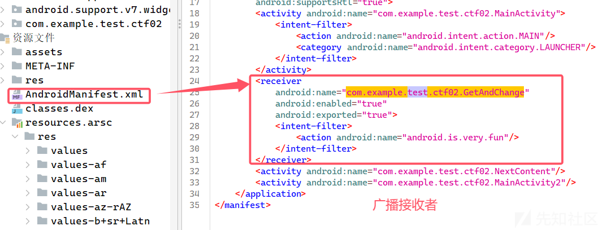  
了解一些AndroidManifest.xml中一些字段:

* `<intent-filter>` 用于在应用的组件声明中指定哪些 `Intent` 可以触发该组件。
* `<action>` 用于指定该 `Intent` 过滤器能够处理的操作（Action）。它告诉 Android 系统，当有一个 `Intent` 的动作（action）匹配时，应该触发相应的组件（如 `BroadcastReceiver`）。  
  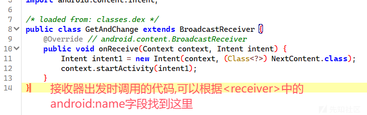

逆向实战题目分析:baseandroid.apk

```
public void onClick(View v) {
    String str = MainActivity2.this.editText.getText().toString();
    Intent intent = new Intent(str);
    MainActivity2.this.sendBroadcast(intent);
}

```

点击后发送广播信号触发AndroidManifest.xml中定义的广播者:

```
<receiver
    android:name="com.example.test.ctf02.GetAndChange"
    android:enabled="true"
    android:exported="true">
    <intent-filter>
        <action android:name="android.is.very.fun"/>
    </intent-filter>
</receiver>

```

在这到题目中你需要知道如何触发广播接收者中的代码,才以可成功获得flag,`sendBroadcast(intent)`可以发送处广播,`"android.is.very.fun"`是可以触发广播响应的信号,所以我们只需要将android.is.very.fun字符串写入编辑框,再点击按钮就可以获得flag了!

### 4. **Content Provider (内容提供者)**

`ContentProvider` 用于跨应用共享数据。它提供了一个统一的接口，使得一个应用可以访问另一个应用的数据。`ContentProvider` 可以封装数据库操作、文件操作或者其他数据存储方式，并通过 `ContentResolver` 提供访问权限。

**主要功能**：

* 提供一个访问数据的接口，可以是本地数据库、共享文件、或是其他数据存储方式。
* 使得应用能够访问其他应用的数据，同时对外暴露统一的 API。
* 通过 `ContentResolver` 进行访问，允许应用进行 CRUD（增、删、改、查）操作。

官方链接:[Content provider | Android Developers](https://developer.android.com/guide/topics/providers/content-providers?hl=zh-cn)

**Content Provider如何在AndroidManifest.xml文件中声明**:

```
<provider
    android:name=".MyProvider"                   <!-- ContentProvider 的类名 -->
    android:authorities="com.example.myapp.provider" <!-- ContentProvider 的 URI 标识符 -->
    android:exported="true"                      <!-- 是否允许外部应用访问 -->
    android:permission="android.permission.READ_CONTACTS"  <!-- 需要的权限 -->
    android:enabled="true"                       <!-- 是否启用 ContentProvider -->
    android:multiProcess="true"                  <!-- 是否支持多进程访问 -->
    android:readPermission="android.permission.READ_EXTERNAL_STORAGE"   <!-- 读取权限 -->
    android:writePermission="android.permission.WRITE_EXTERNAL_STORAGE" /> <!-- 写入权限 -->

```

* `<provider>` 标签在 `AndroidManifest.xml` 文件中声明一个 `ContentProvider` 组件，负责在应用之间共享数据。
* `android:name` 指定 `ContentProvider` 的类，`android:authorities` 指定其标识符（URI）。
* 通过 `android:exported`、`android:permission` 和 `android:multiProcess` 等属性控制 `ContentProvider` 的可见性、权限和进程共享。
* 正确配置这些属性可以确保数据访问的安全性和有效性。

常见的 `ContentProvider` 是 **联系人** 数据库（`ContactsProvider`），允许应用查询联系人信息。

```
public class MyProvider extends ContentProvider {
    @Override
    public boolean onCreate() {
        // 初始化内容提供者
        return true;
    }

    @Override
    public Cursor query(Uri uri, String[] projection, String selection, 
                        String[] selectionArgs, String sortOrder) {
        // 查询数据
        return null;
    }

    @Override
    public Uri insert(Uri uri, ContentValues values) {
        // 插入数据
        return null;
    }

    @Override
    public int update(Uri uri, ContentValues values, String selection, String[] selectionArgs) {
        // 更新数据
        return 0;
    }

    @Override
    public int delete(Uri uri, String selection, String[] selectionArgs) {
        // 删除数据
        return 0;
    }

    @Override
    public String getType(Uri uri) {
        // 返回数据类型
        return null;
    }
}

```

## 第六章：安卓系统体系梳理

更加详细的文档：[Android 系统架构图\_软件静态架构图-CSDN博客](https://blog.csdn.net/freeking101/article/details/105329932)

### 1.安卓系统架构篇

安卓操作系统——一个全球数十亿智能设备的心脏，其架构的设计复杂、精巧，承载了从硬件驱动到应用交互的每一层细节。**安卓架构**并非单一维度的堆叠，而是一张层次分明、各司其职的巨大网络，它将各个模块紧密联系在一起，形成了一个无缝而高效的操作环境。  
在这篇文章中，我们将深入探讨安卓操作系统架构的各个层次，揭开它每一层背后的奥秘，理解其如何从硬件到应用，提供了一个高效且灵活的运行环境。  
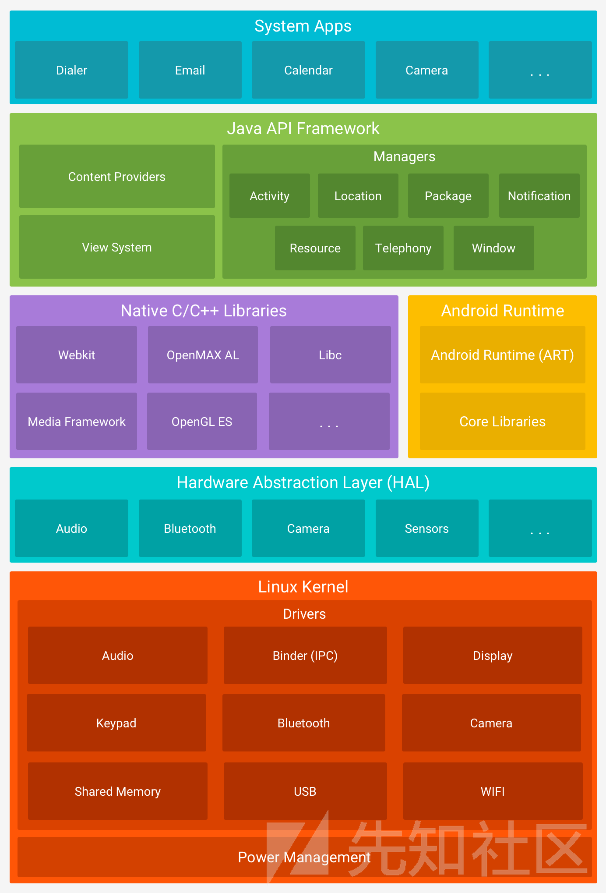

#### **1.1 系统应用（System Apps）**

系统应用是安卓操作系统的基础组成部分，直接影响着用户的日常使用体验。它们通常包括了电话拨号器、邮件客户端、日历应用、相机应用等。这些应用不仅实现了基础功能，还常常与系统的其他组件紧密集成，提供出色的互操作性。

* **Dialer**（拨号器）：负责处理电话呼叫，管理联系人信息，并与系统的电话服务层紧密交互。
* **Email**（邮件）：实现电子邮件收发功能，常与安卓的网络层、后台服务紧密连接。
* **Calendar**（日历）：提供日期管理与提醒服务，利用系统的通知和数据存储能力。
* **Camera**（相机）：直接调用硬件相机设备，处理图像和视频的捕捉、处理及存储。  
  这些系统应用，通过与硬件和系统服务的配合，提供了安卓设备的核心交互功能。

#### 1.2 Java API框架（Java API Framework）

Java API框架是安卓系统的核心部分，它通过封装底层硬件功能和系统服务，向开发者提供了丰富的API接口。通过这些接口，开发者能够方便地调用系统服务，进行应用开发。

* **Content Providers**：内容提供者，允许应用共享数据，使得不同应用之间能够访问数据，比如联系人、日历等信息。
* **Activity**：代表一个应用的界面组件，用户与应用的交互通过Activity来管理和实现。
* **Location Manager**：提供位置服务，允许应用获取设备的地理位置信息。
* **Package Manager**：管理应用程序的安装、卸载及更新，维护系统中所有已安装应用的状态。
* **Notification Manager**：管理系统的通知，确保应用能够在屏幕上发送通知并与用户交互。  
  这些组件通过紧密的交互，使得安卓平台能够有效地支持各种应用程序的运行。

#### **1.3 本地C/C++库（Native C/C++ Libraries）**

在安卓的架构中，C/C++库处于非常关键的位置，负责提供底层的性能支持。它们直接与硬件打交道，执行资源密集型的操作，如音频、视频处理、图形渲染等。

* **Webkit**：一个基于C++的浏览器引擎，安卓中的浏览器和WebView组件都依赖于它来解析HTML和CSS。
* **Media Framework**：为音频、视频和图像的解码、播放等提供支持，OpenMAX AL就是其中的一个组件，用于高效的多媒体处理。
* **OpenGL ES**：用于图形渲染，尤其是三维图形。开发者通过OpenGL ES可以实现复杂的图形效果。
* **Libc**：标准C库，是安卓系统与Linux内核交互的桥梁，提供了许多基本的系统调用，如内存分配、文件操作等。  
  这些本地库提供了强大的性能支持，使得安卓设备在执行计算密集型操作时能够保持高效与流畅。

#### 1.4 安卓运行时（Android Runtime - ART）

安卓运行时是安卓的“心脏”，它包括了Android Runtime本身和核心库。ART替代了之前的Dalvik虚拟机，提供更高效的执行环境，尤其在应用启动速度和内存管理方面有显著提升。

* **Core Libraries**：包括Java标准库和安卓框架库，提供常见的数据结构、文件操作、UI组件等功能，开发者依赖这些库来构建应用。
* **ART**：通过Ahead-of-Time（AOT）编译将应用程序的字节码转化为本地机器码，从而大幅提升了应用的运行效率。  
  这两者的结合，极大地提高了安卓系统的整体性能，使得应用能够更快速、稳定地运行。

#### 1.5 硬件抽象层（Hardware Abstraction Layer - HAL）

硬件抽象层是安卓系统与硬件之间的“缓冲带”。它通过提供标准化的接口，使得安卓系统能够独立于硬件平台开发。无论设备使用何种硬件，HAL都能保证系统服务与硬件之间的兼容性。

* **Audio**：音频硬件的抽象接口，包括麦克风、扬声器等硬件的管理。
* **Bluetooth**：为蓝牙硬件提供抽象，支持无线设备的连接与数据交换。
* **Camera**：提供与摄像头硬件交互的标准接口。
* **Sensors**：支持各类传感器（如加速度计、陀螺仪）的抽象接口，供开发者调用。  
  HAL的设计允许安卓设备制造商根据需要定制硬件，同时又不影响系统的基本功能和兼容性。

#### 1.6 Linux内核（Linux Kernel）

Linux内核是安卓操作系统的基础，它负责直接管理硬件资源，包括CPU、内存、输入设备、显示等。内核的设计保证了安卓系统的高效性和稳定性。

* **Drivers**：驱动程序，用于控制和管理硬件设备，如显示器、键盘、摄像头等。
* **Binder（IPC）**：安卓的进程间通信机制，允许不同进程之间高效、安全地交换数据。
* **Power Management**：电源管理模块，优化设备的电池使用，确保设备在长时间使用下仍能保持稳定运行。  
  内核的设计使得安卓能够跨越多种硬件平台，同时保证了系统的高效性与可靠性。

### 2.安卓程序启动篇

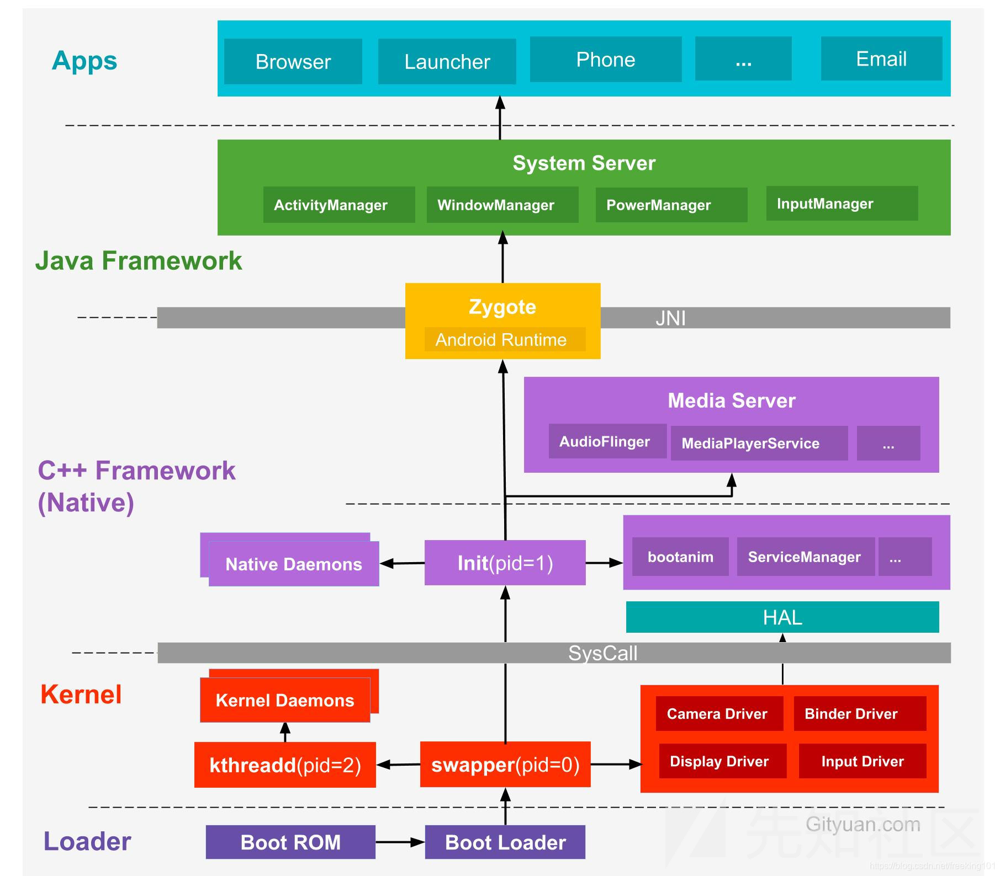  
详细介绍：[Android 系统架构图\_软件静态架构图-CSDN博客](https://blog.csdn.net/freeking101/article/details/105329932)  
Android 系统的启动过程是一个精细的多层级结构，充满了环环相扣的内在联系。从硬件启动到用户应用的加载，每一步都依赖于上一层的稳定运行。Google 提供的经典五层架构图虽简洁明了，但若从进程角度深入探讨，每个阶段的工作机制和交互会更加复杂。  
图解：Android 系统启动过程由上图从下往上的一个过程是由 Boot Loader 引导开机，然后依次进入 -> `Kernel` -> `Native` -> `Framework` -> `App`，接来下简要说说每个过程：  
关于 Loader 层：

* Boot ROM：当手机处于关机状态时，长按 Power 键开机，引导芯片开始从固化在 ROM 里的预设代码开始执行，然后加载引导程序到 RAM；
* Boot Loader：这是启动 Android 系统之前的引导程序，主要是检查 RAM，初始化硬件参数等功能。

## 第七章:Android逆向总结汇总

### 逆向工程的魅力与挑战

逆向工程，这一领域总是充满了挑战与魅力。尤其是在Android应用的世界里，它不仅是解开代码背后深藏的秘密的一扇大门，更是进入黑客、开发者以及安全专家思维深处的钥匙。理解Android逆向工程，意味着要能够透视到一个看似封闭的应用世界，并揭示出它那层层叠叠的复杂结构和潜在的弱点。

### Android逆向工程的核心问题与应用领域

Android逆向工程的核心在于解构与重建。面对每个APK文件，逆向工程师需要通过静态与动态分析的手段，剖析其中的代码、资源和加固机制，理解它是如何运行、如何保护自身不被篡改，甚至如何加密与存储敏感信息。从反编译到脱壳，从调试到利用，逆向工程不仅仅是破解一段代码，它更是与时间赛跑，与不断进化的加固技术博弈。  
在应用领域，Android逆向工程的意义愈加显著。它不仅仅存在于学术或技术探讨之中，它在实际的安全攻防中，尤其是在恶意软件分析、漏洞挖掘、隐私保护以及数字取证等多个层面扮演着至关重要的角色。安全专家利用逆向分析发现并修复应用中的漏洞，黑客则通过逆向技术发现攻击路径与漏洞，开发者则以此保护自己的代码不受侵害。而这一切的核心，便是对Android应用内部结构的全面理解和破解。

### 为什么逆向工程在安全领域至关重要？

Android逆向工程的核心在于解构与重建。面对每个APK文件，逆向工程师需要通过静态与动态分析的手段，剖析其中的代码、资源和加固机制，理解它是如何运行、如何保护自身不被篡改，甚至如何加密与存储敏感信息。从反编译到脱壳，从调试到利用，逆向工程不仅仅是破解一段代码，它更是与时间赛跑，与不断进化的加固技术博弈。  
在应用领域，Android逆向工程的意义愈加显著。它不仅仅存在于学术或技术探讨之中，它在实际的安全攻防中，尤其是在恶意软件分析、漏洞挖掘、隐私保护以及数字取证等多个层面扮演着至关重要的角色。安全专家利用逆向分析发现并修复应用中的漏洞，黑客则通过逆向技术发现攻击路径与漏洞，开发者则以此保护自己的代码不受侵害。而这一切的核心，便是对Android应用内部结构的全面理解和破解。

### 如何理解“逆向”这一概念？

对初学者来说，逆向工程的核心并不是要具备破解应用的黑客技术，而是要理解逆向的本质——一种从表面看似复杂的系统中提取底层逻辑和功能的能力。逆向工程与传统编程截然不同，它不是从零开始编写代码，而是从现有的程序出发，逐步揭示其工作机制。在这过程中，我们不仅要理解如何读取代码，还要懂得如何模拟程序的运行，观察程序与系统的交互，甚至在调试过程中通过各种工具“剪切”出应用的运行  
换句话说，逆向工程的学习和实践，就是从“已知的对象”中重建出“未知的过程”。你可能会从一个加密字符串出发，逐步推敲出整个加密算法的工作原理，最终破解该加密。你可能会在看似无关的代码段中，发现一个异常的系统调用，进而推测出程序的异常行为。这样的过程需要极强的逻辑思维能力和对技术细节的深刻洞察力，同时还要拥有对各种调试工具和反编译工具的熟练运用。  
“逆向”并非一蹴而就，它是一个从简单到复杂的渐进过程，任何一个细节的掌握都可能为解开更复杂的问题铺平道路。在这一过程中，你不仅要学会如何使用工具，更要训练出一双“透视”的眼睛，去看到那些隐藏在代码中的秘密。  
因此，逆向工程不仅是技术的挑战，更是心智的锤炼。它不仅要求我们有一定的编程基础，熟悉应用的工作原理，还要求我们具备对复杂事物的拆解与重组能力。而这一切的背后，正是对“破译”和“重建”这两种能力的培养和锻炼。
