# 【免杀技术】WinApi规避 - 字符串HASH与动态调用 （完美的IAT隐藏技术）-先知社区

> **来源**: https://xz.aliyun.com/news/16402  
> **文章ID**: 16402

---

# 简介

本来想要写一篇WinAPi规避技术中的IAT隐藏的，虽然已经有类似的文章，不过好在对方并没有将这个技术做到极致，按照另一篇文章的做法根本不足以隐藏IAT表。因为Windows的CRT运行时库仍然会带有大量的奇奇怪怪的API，包括GetModuleHandle和GetPorcAddress。并且还会残留大量的字符串硬编码在可执行文件中。

# CRT库删除

在Visual Studio中，可以改变原有的编译参数，从而达到删除运行时库的效果，不过这会导致从头文件“stdio.h”中引用的函数无法正常运行（可以寻求别的API去替代，也可以去自实现它们的原有的功能）。这里不仅删除了CRT库，还关闭了DeBug信息和清单文件，避免出现一些敏感路径在可执行文件上，否则有被溯源的风险。  
接下来的Visual Studio的具体编译参数：

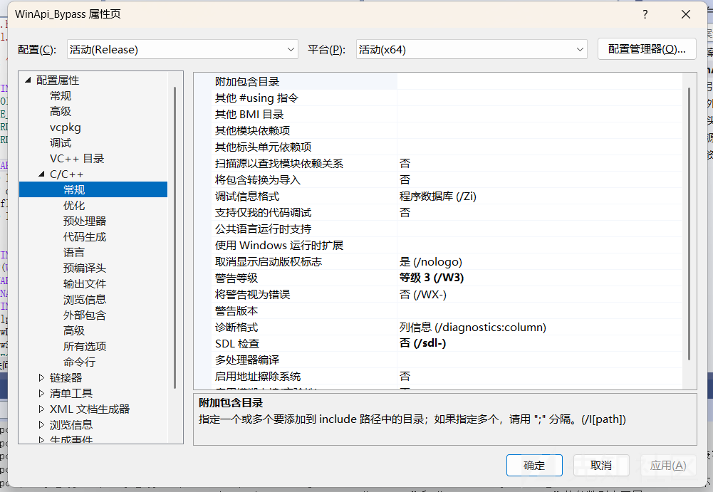

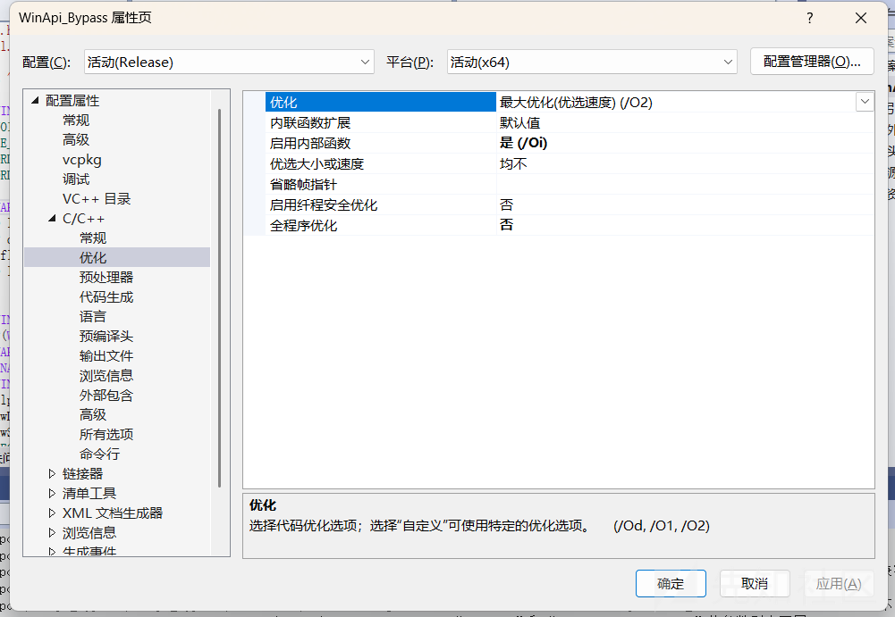

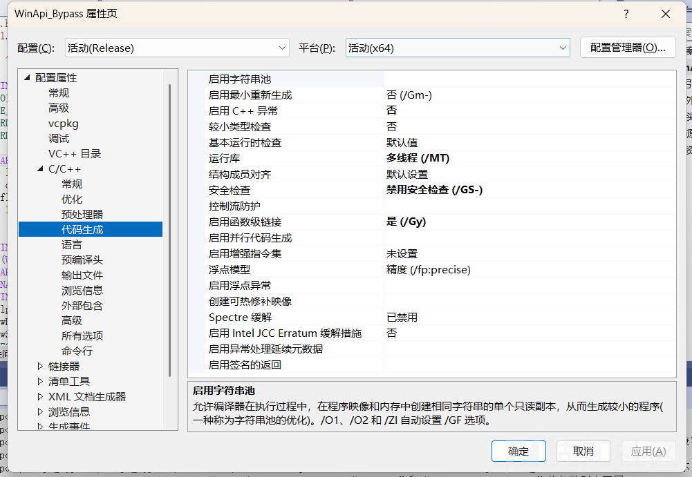

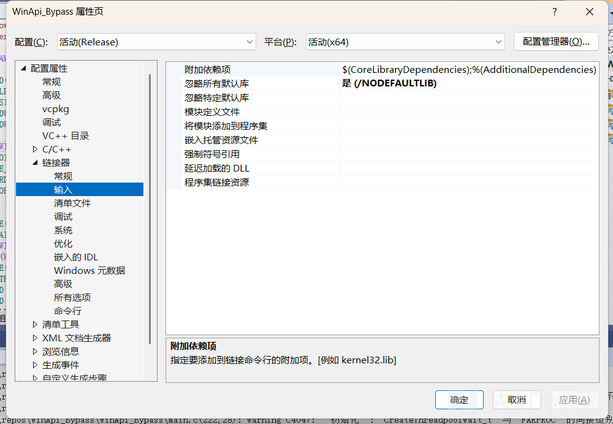

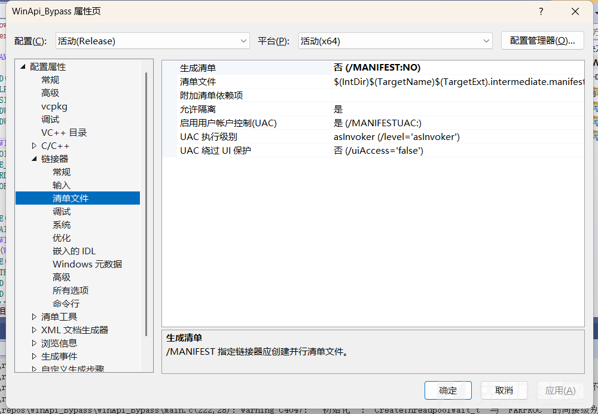

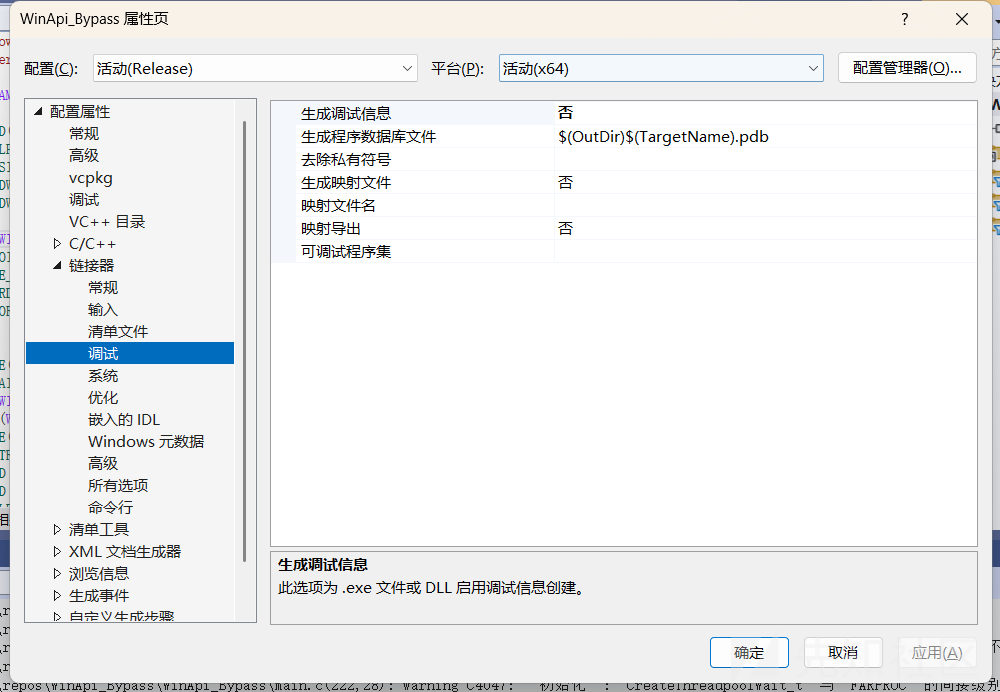

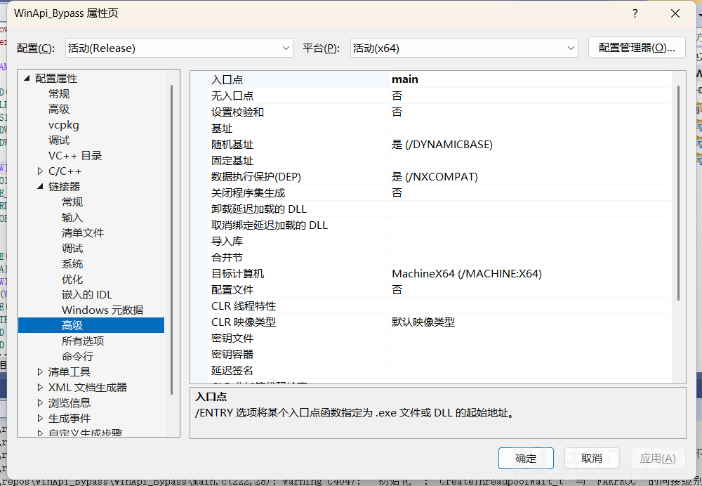

一些内存分配和打印信息的API应该是无法正常使用了，比如memcpy,memset,printf等。这里给一个示例。github,或者ChatGpt也是有很多这种自实现函数的。

```
void* __cdecl my_memset(void* Destination, int Value, size_t Size) {
    // logic similar to memset's one
    unsigned char* p = (unsigned char*)Destination;
    while (Size > 0) {
        *p = (unsigned char)Value;
        p++;
        Size--;
    }
    return Destination;
}

```

# 动态调用+字符串Hash

自实现的原理是获取PEB(双链表结构)，遍历里面的内容。可以通过双链表中的指针来覆盖基地址，实现前后两个不同结构体之前的遍历。每个PEB结构体对应不同的image（也是就是EXE，DLL这些镜像）。

接下来展示我的WinAPiHash中的Hash算法和自实现的那俩函数。

### HASH算法

先上用来加密字符串的HASH算法，其实有很多种HASH都可以使用，我给一个我经常使用的算法。INITIAL\_HASH和SEED可以随意设置，只要保证后续的HASH和算法使用的同一套就行。

```
#define INITIAL_HASH  520
#define SEED           6

// 自定义哈希算法
DWORD HashStringLoseLoseA(_In_ PCHAR String)
{
    ULONG Hash = INITIAL_HASH;
    INT c;

    while (c = *String++) {
        Hash += c;
        Hash *= c + SEED;  // 更新哈希值
    }
    return Hash;
}
// 宽字符版本的自定义哈希算法
DWORD64 HashStringLoseLoseW(_In_ PWCHAR String) {
    ULONG Hash = INITIAL_HASH;
    INT c;

    while (c = *String++) {
        Hash += c;
        Hash *= c + SEED;  // update
    }
    return Hash;
}

```

### 与HASH算法结合的自实现GetModuleHandle

这是一个自实现的GetModuleHandle函数，并且融合了字符串HASH的功能。  
在大部分版本的自实现版本的GetModuleHandle中，遍历DLLNAME的代码原理通常是：

```
while (pDte) {
        // 判断是否读取到了DLL名字
        if (pDte->FullDllName.Length != NULL) {
            if (wcscmp(pDte->FullDllName.Buffer, ModuleName) == 0) {
                // 输出找到的 DLL 地址
                //printf("Dll已找到，地址是：%x", pDte->Reserved2[0]);
                return pDte->Reserved2[0];
            }
        }
        else {
            // 如果读取 DLL 长度失败
            // printf("读取Dll长度失败");
            break;
        }
        pDte = *(PLDR_DATA_TABLE_ENTRY*)(pDte);  // 获取下一个模块
    };

```

上面的代码是通过比较pDte->FullDllName.Buffer和ModuleName的明文字符串的值来确定，而我的方案中，是通过比较HASH值来获取匹配的DLL地址：

```
while (pDte) {

        if (pDte->FullDllName.Length != NULL) {//判断是否读取到了DLL名字
            if (HashStringLoseLoseW(pDte->FullDllName.Buffer) == dwModuleNameHash) {
                //printf("Dll已找到，地址是：%x", pDte->Reserved2[0]);
                return pDte->Reserved2[0];
            }
        }
        else {
            // printf("读取Dll长度失败");
            break;
        }
        pDte = *(PLDR_DATA_TABLE_ENTRY*)(pDte);
    };

```

`HashStringLoseLoseW(pDte->FullDllName.Buffer) == dwModuleNameHash`是主要的区别，整个自实现GetModuleHandleH函数代码如下：

```
HMODULE GetModuleHandleH(DWORD dwModuleNameHash) {
    if (dwModuleNameHash == NULL)
        return NULL;
    // 64位下PEB，进程环境块
    PPEB pPeb = (PPEB)(__readgsqword(0x60));
    // 获取LDR
    PPEB_LDR_DATA           pLdr = (PPEB_LDR_DATA)(pPeb->Ldr);
    // Getting the first element in the linked list which contains information about the first module
    PLDR_DATA_TABLE_ENTRY   pDte = (PLDR_DATA_TABLE_ENTRY)(pLdr->InMemoryOrderModuleList.Flink);
    while (pDte) {

        if (pDte->FullDllName.Length != NULL) {//判断是否读取到了DLL名字
            if (HashStringLoseLoseW(pDte->FullDllName.Buffer) == dwModuleNameHash) {
                //printf("Dll已找到，地址是：%x", pDte->Reserved2[0]);
                return pDte->Reserved2[0];
            }
        }
        else {
            // printf("读取Dll长度失败");
            break;
        }
        pDte = *(PLDR_DATA_TABLE_ENTRY*)(pDte);
    };
}

```

### 与HASH算法结合的自实现GetProAddresss

与上文同理：

```
FARPROC GetProcAddressH(HMODULE hModule, DWORD dwApiNameHash) {

    if (hModule == NULL || dwApiNameHash == NULL)
        return NULL;

    PBYTE pBase = (PBYTE)hModule;

    PIMAGE_DOS_HEADER pImgDosHdr = (PIMAGE_DOS_HEADER)pBase;
    if (pImgDosHdr->e_magic != IMAGE_DOS_SIGNATURE)
        return NULL;

    PIMAGE_NT_HEADERS pImgNtHdrs = (PIMAGE_NT_HEADERS)(pBase + pImgDosHdr->e_lfanew);
    if (pImgNtHdrs->Signature != IMAGE_NT_SIGNATURE)
        return NULL;

    IMAGE_OPTIONAL_HEADER ImgOptHdr = pImgNtHdrs->OptionalHeader;

    PIMAGE_EXPORT_DIRECTORY pImgExportDir = (PIMAGE_EXPORT_DIRECTORY)(pBase + ImgOptHdr.DataDirectory[IMAGE_DIRECTORY_ENTRY_EXPORT].VirtualAddress);

    PDWORD FunctionNameArray = (PDWORD)(pBase + pImgExportDir->AddressOfNames);
    PDWORD FunctionAddressArray = (PDWORD)(pBase + pImgExportDir->AddressOfFunctions);
    PWORD FunctionOrdinalArray = (PWORD)(pBase + pImgExportDir->AddressOfNameOrdinals);

    for (DWORD i = 0; i < pImgExportDir->NumberOfFunctions; i++) {
        CHAR* pFunctionName = (CHAR*)(pBase + FunctionNameArray[i]);
        PVOID pFunctionAddress = (PVOID)(pBase + FunctionAddressArray[FunctionOrdinalArray[i]]);

        // hashing every function name `pFunctionName`
        // if both hashes are equal, then we found the function we want 
        if (dwApiNameHash == HashStringLoseLoseA(pFunctionName)) {
            return pFunctionAddress;
        }
    }

    return NULL;
}

```

### 使用

**先展示一个常规动态调用的思路做对比**

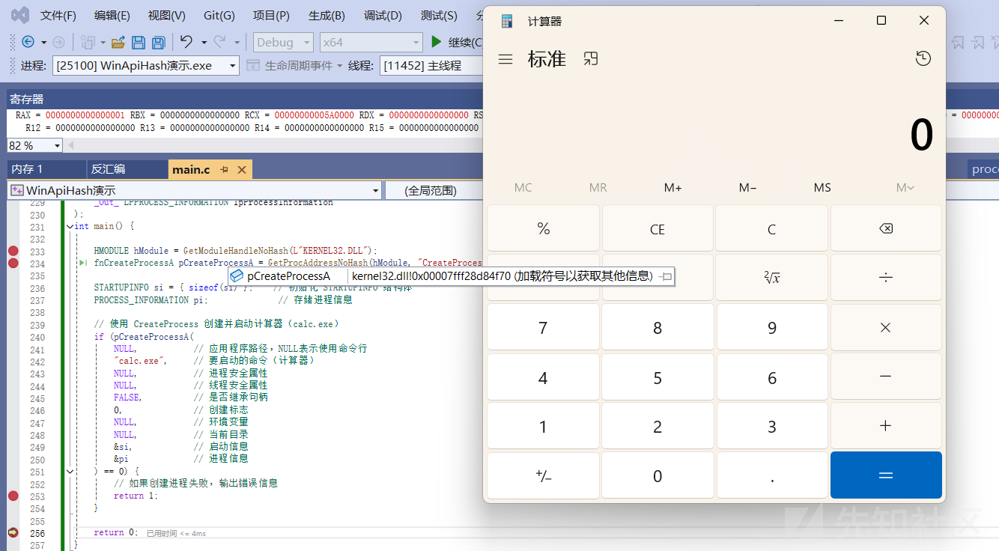

这里使用了只使用了自实现的API，通过CFF查看IAT表，发现出现了GetModuleHandle的名字：

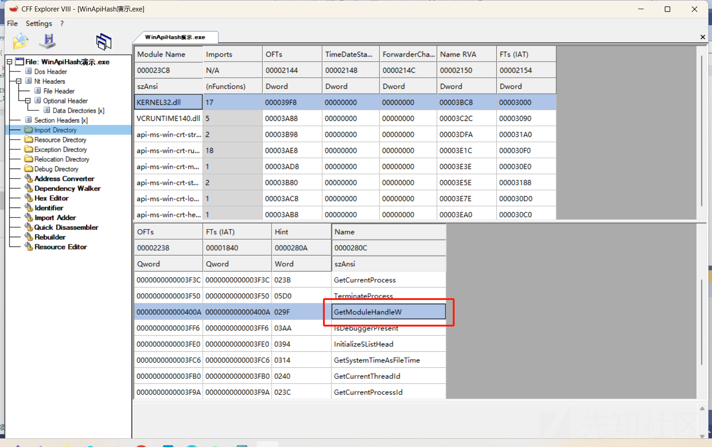

查看可执行文中的字符串：

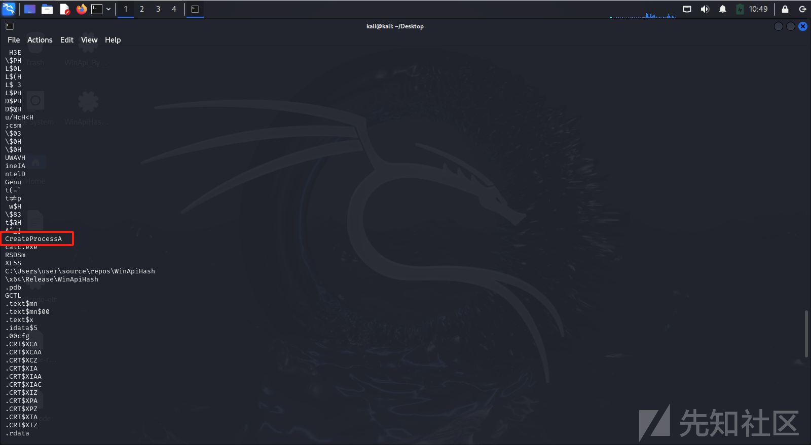

如果不删除CRT库,我可以说动态调用几乎是没有意义的，结合字符串的分析一簇即溃。

**字符串HASH+动态调用+CRT库删除**

首先计算函数名和DLL名的HASH：

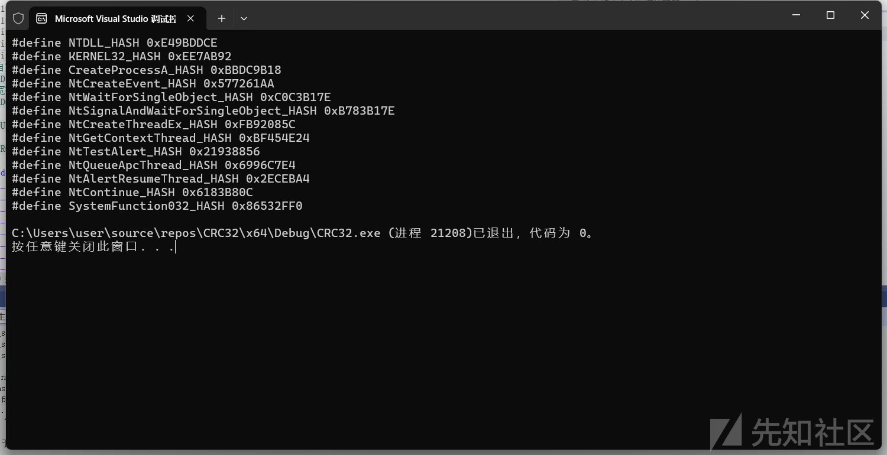

这里可以写一个HASH计算器去快速批量获取HASH。

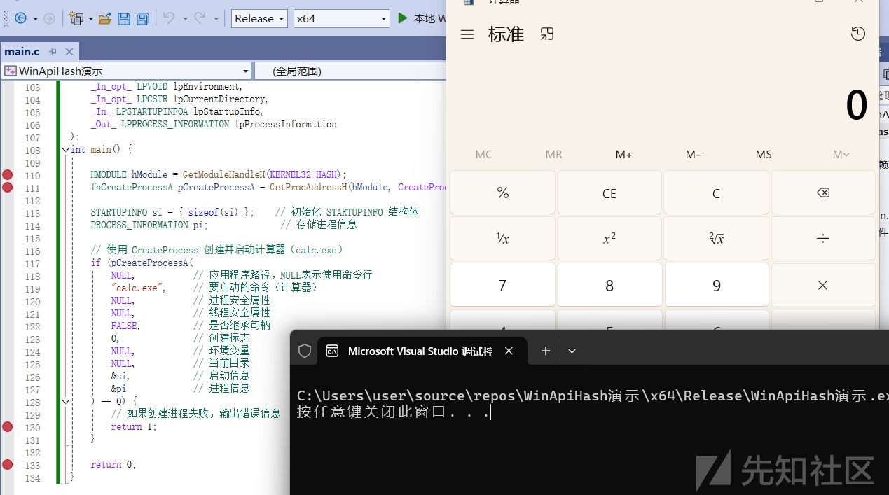

成功执行了，接下来检查字符串和IAT表  
字符串删的连东西都快没了  
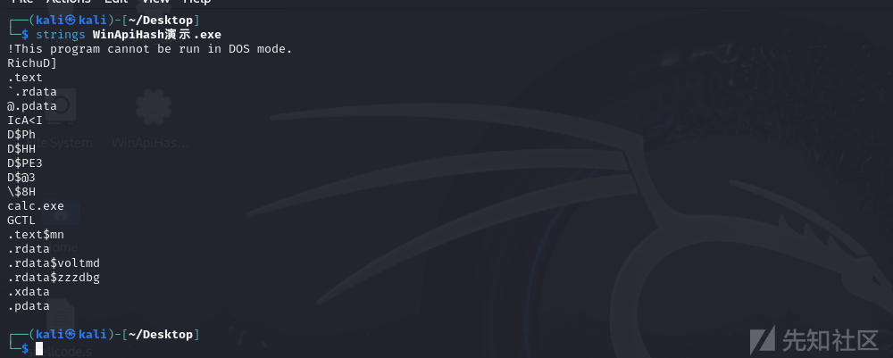  
IAT表更是直接干没了  
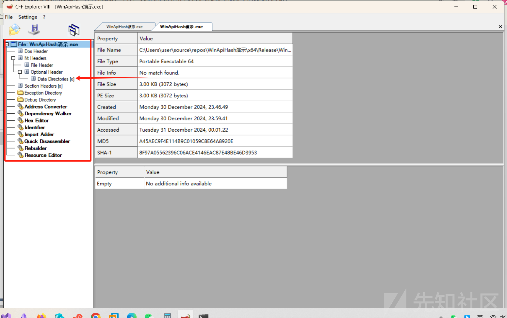

如何评价？？？？？？？？？？？？？？？？
