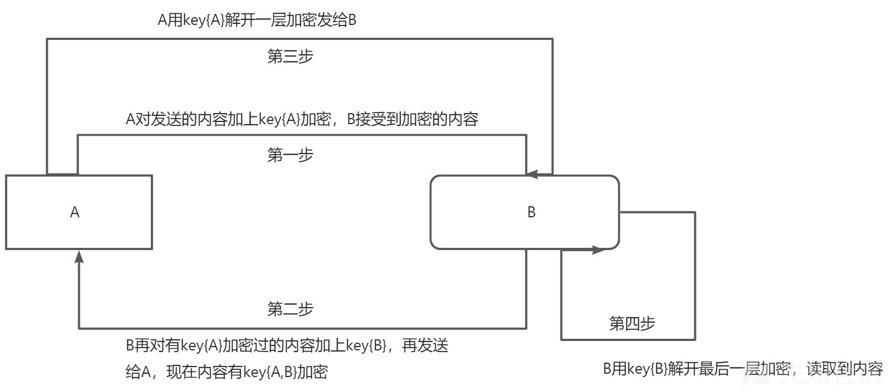

# 浅谈密码相关原理及代码实现-先知社区

> **来源**: https://xz.aliyun.com/news/16403  
> **文章ID**: 16403

---

本代码仅供学习、研究、教育或合法用途。开发者明确声明其无意将该代码用于任何违法、犯罪或违反道德规范的行为。任何个人或组织在使用本代码时，需自行确保其行为符合所在国家或地区的法律法规。

开发者对任何因直接或间接使用该代码而导致的法律责任、经济损失或其他后果概不负责。使用者需自行承担因使用本代码产生的全部风险和责任。请勿将本代码用于任何违反法律、侵犯他人权益或破坏公共秩序的活动。

本文是作者对密码学浅薄学习后的一些总结，分为古典密码学和现代密码学和本人学习后对加密的新的认知。

# 一·传统密码学：

### **方法 1：凯撒密码**

#### **代码实例**

```
#include <iostream>
#include <fstream>
#include <string>
using namespace std;

// 凯撒加密函数
string caesarEncrypt(string text, int shift) {
    string result = "";
    for (char c : text) {
        if (isalpha(c)) {
            char base = islower(c) ? 'a' : 'A';
            result += (c - base + shift) % 26 + base;
        } else {
            result += c; // 非字母不加密
        }
    }
    return result;
}

int main() {
    ifstream inputFile("1.txt");
    ofstream outputFile("1_encrypted.txt");

    if (!inputFile) {
        cerr << "无法打开文件 1.txt" << endl;
        return 1;
    }

    string content((istreambuf_iterator<char>(inputFile)), istreambuf_iterator<char>());
    int shift = 3; // 偏移量
    string encrypted = caesarEncrypt(content, shift);

    outputFile << encrypted;
    cout << "加密完成，结果保存在 1_encrypted.txt 中" << endl;

    inputFile.close();
    outputFile.close();
    return 0;
}
```

#### **加密过程和原理**

1. 将字母按字母表顺序移动指定偏移量（如 3）。
2. 非字母字符保持不变。
3. 偏移量可调整，用于创建不同的密钥。
4. 解密时只需反向移动同样偏移量。

---

### **方法 2：维吉尼亚密码**

#### **代码实例**

```
#include <iostream>
#include <fstream>
#include <string>
using namespace std;

// 维吉尼亚加密函数
string vigenereEncrypt(string text, string key) {
    string result = "";
    int keyIndex = 0;
    for (char c : text) {
        if (isalpha(c)) {
            char base = islower(c) ? 'a' : 'A';
            int shift = key[keyIndex % key.size()] - base;
            result += (c - base + shift) % 26 + base;
            keyIndex++;
        } else {
            result += c;
        }
    }
    return result;
}

int main() {
    ifstream inputFile("1.txt");
    ofstream outputFile("1_encrypted.txt");

    if (!inputFile) {
        cerr << "无法打开文件 1.txt" << endl;
        return 1;
    }

    string content((istreambuf_iterator<char>(inputFile)), istreambuf_iterator<char>());
    string key = "KEYWORD"; // 密钥
    string encrypted = vigenereEncrypt(content, key);

    outputFile << encrypted;
    cout << "加密完成，结果保存在 1_encrypted.txt 中" << endl;

    inputFile.close();
    outputFile.close();
    return 0;
}
```

#### **加密过程和原理**

1. 使用关键字中每个字母的偏移量加密文本。
2. 根据字母表的字母序列循环使用关键字。
3. 每个字母偏移量由关键字决定，增加加密强度。

---

### **方法 3：栅栏密码**

#### **代码实例**

```
#include <iostream>
#include <fstream>
#include <string>
#include <vector>
using namespace std;

// 栅栏加密函数
string railFenceEncrypt(string text, int key) {
    vector<string> rail(key, "");
    int direction = 1; // 1 表示向下，-1 表示向上
    int row = 0;

    for (char c : text) {
        rail[row] += c;
        row += direction;
        if (row == 0 || row == key - 1) direction = -direction;
    }

    string result = "";
    for (string line : rail) result += line;
    return result;
}

int main() {
    ifstream inputFile("1.txt");
    ofstream outputFile("1_encrypted.txt");

    if (!inputFile) {
        cerr << "无法打开文件 1.txt" << endl;
        return 1;
    }

    string content((istreambuf_iterator<char>(inputFile)), istreambuf_iterator<char>());
    int key = 3; // 栅栏的行数
    string encrypted = railFenceEncrypt(content, key);

    outputFile << encrypted;
    cout << "加密完成，结果保存在 1_encrypted.txt 中" << endl;

    inputFile.close();
    outputFile.close();
    return 0;
}
```

#### **加密过程和原理**

1. 将文本分布在多个行（栅栏）中。
2. 按从上到下、再从下到上的顺序排列字符。
3. 最后按行拼接成加密后的字符串。

---

### **方法 4：单表替代密码（Simple Substitution Cipher）**

#### **代码实例**

```
#include <iostream>
#include <fstream>
#include <string>
#include <unordered_map>
using namespace std;

// 单表替代加密函数
string substitutionEncrypt(string text, unordered_map<char, char> substitutionTable) {
    string result = "";
    for (char c : text) {
        if (isalpha(c)) {
            result += substitutionTable[c];
        } else {
            result += c; // 非字母不加密
        }
    }
    return result;
}

int main() {
    ifstream inputFile("1.txt");
    ofstream outputFile("1_encrypted.txt");

    if (!inputFile) {
        cerr << "无法打开文件 1.txt" << endl;
        return 1;
    }

    string content((istreambuf_iterator<char>(inputFile)), istreambuf_iterator<char>());

    // 替代表
    unordered_map<char, char> substitutionTable = {
        {'a', 'q'}, {'b', 'w'}, {'c', 'e'}, {'d', 'r'}, {'e', 't'},
        {'f', 'y'}, {'g', 'u'}, {'h', 'i'}, {'i', 'o'}, {'j', 'p'},
        {'k', 'a'}, {'l', 's'}, {'m', 'd'}, {'n', 'f'}, {'o', 'g'},
        {'p', 'h'}, {'q', 'j'}, {'r', 'k'}, {'s', 'l'}, {'t', 'z'},
        {'u', 'x'}, {'v', 'c'}, {'w', 'v'}, {'x', 'b'}, {'y', 'n'},
        {'z', 'm'}
    };

    string encrypted = substitutionEncrypt(content, substitutionTable);

    outputFile << encrypted;
    cout << "加密完成，结果保存在 1_encrypted.txt 中" << endl;

    inputFile.close();
    outputFile.close();
    return 0;
}
```

#### **加密过程和原理**

1. 为每个字母定义唯一的替换字母。
2. 使用替代表逐字替换文本中的字母。
3. 非字母字符保持不变。

---

### **方法 5：逆序加密（Reverse Cipher）**

#### **代码实例**

```
#include <iostream>
#include <fstream>
#include <string>
#include <algorithm>
using namespace std;

// 逆序加密函数
string reverseEncrypt(string text) {
    reverse(text.begin(), text.end());
    return text;
}

int main() {
    ifstream inputFile("1.txt");
    ofstream outputFile("1_encrypted.txt");

    if (!inputFile) {
        cerr << "无法打开文件 1.txt" << endl;
        return 1;
    }

    string content((istreambuf_iterator<char>(inputFile)), istreambuf_iterator<char>());
    string encrypted = reverseEncrypt(content);

    outputFile << encrypted;
    cout << "加密完成，结果保存在 1_encrypted.txt 中" << endl;

    inputFile.close();
    outputFile.close();
    return 0;
}
```

#### **加密过程和原理**

1. 将文本字符顺序反转。

### **方法 6：Playfair 密码**

#### **代码实例**

```
#include <iostream>
#include <fstream>
#include <string>
#include <vector>
using namespace std;

// 创建 Playfair 密钥矩阵
vector<vector<char>> createPlayfairMatrix(string key) {
    vector<vector<char>> matrix(5, vector<char>(5));
    string alphabet = "ABCDEFGHIKLMNOPQRSTUVWXYZ"; // 'J' 被合并到 'I'
    string adjustedKey = "";
    vector<bool> used(26, false);

    for (char c : key) {
        if (c == 'J') c = 'I';
        if (!used[c - 'A'] && isalpha(c)) {
            adjustedKey += c;
            used[c - 'A'] = true;
        }
    }

    for (char c : alphabet) {
        if (!used[c - 'A']) {
            adjustedKey += c;
            used[c - 'A'] = true;
        }
    }

    int k = 0;
    for (int i = 0; i < 5; ++i)
        for (int j = 0; j < 5; ++j)
            matrix[i][j] = adjustedKey[k++];

    return matrix;
}

// 加密一个双字母对
string encryptPair(char a, char b, const vector<vector<char>>& matrix) {
    int row1, col1, row2, col2;
    for (int i = 0; i < 5; ++i) {
        for (int j = 0; j < 5; ++j) {
            if (matrix[i][j] == a) row1 = i, col1 = j;
            if (matrix[i][j] == b) row2 = i, col2 = j;
        }
    }

    if (row1 == row2) {
        return string(1, matrix[row1][(col1 + 1) % 5]) + matrix[row2][(col2 + 1) % 5];
    } else if (col1 == col2) {
        return string(1, matrix[(row1 + 1) % 5][col1]) + matrix[(row2 + 1) % 5][col2];
    } else {
        return string(1, matrix[row1][col2]) + matrix[row2][col1];
    }
}

// Playfair 加密函数
string playfairEncrypt(string text, string key) {
    vector<vector<char>> matrix = createPlayfairMatrix(key);
    string adjustedText = "";
    for (char c : text) {
        if (c == 'J') c = 'I';
        if (isalpha(c)) adjustedText += toupper(c);
    }

    if (adjustedText.size() % 2 != 0) adjustedText += 'X';

    string result = "";
    for (int i = 0; i < adjustedText.size(); i += 2) {
        char a = adjustedText[i];
        char b = (i + 1 < adjustedText.size() && adjustedText[i + 1] != a) ? adjustedText[i + 1] : 'X';
        result += encryptPair(a, b, matrix);
    }

    return result;
}

int main() {
    ifstream inputFile("1.txt");
    ofstream outputFile("1_encrypted.txt");

    if (!inputFile) {
        cerr << "无法打开文件 1.txt" << endl;
        return 1;
    }

    string content((istreambuf_iterator<char>(inputFile)), istreambuf_iterator<char>());
    string key = "KEYWORD";
    string encrypted = playfairEncrypt(content, key);

    outputFile << encrypted;
    cout << "加密完成，结果保存在 1_encrypted.txt 中" << endl;

    inputFile.close();
    outputFile.close();
    return 0;
}
```

#### **加密过程和原理**

1. 构造 5x5 的字母矩阵，关键字中的字母优先填充。
2. 按规则将字母对替换为矩阵中的对应字母。
3. 解密时反向执行相同规则。

---

### **方法 7：摩斯密码（Morse Code Cipher）**

#### **代码实例**

```
#include <iostream>
#include <fstream>
#include <map>
using namespace std;

map<char, string> morseCode = {
    {'A', ".-"}, {'B', "-..."}, {'C', "-.-."}, {'D', "-.."}, {'E', "."},
    {'F', "..-."}, {'G', "--."}, {'H', "...."}, {'I', ".."}, {'J', ".---"},
    {'K', "-.-"}, {'L', ".-.."}, {'M', "--"}, {'N', "-."}, {'O', "---"},
    {'P', ".--."}, {'Q', "--.-"}, {'R', ".-."}, {'S', "..."}, {'T', "-"},
    {'U', "..-"}, {'V', "...-"}, {'W', ".--"}, {'X', "-..-"}, {'Y', "-.--"},
    {'Z', "--.."}, {'0', "-----"}, {'1', ".----"}, {'2', "..---"}, {'3', "...--"},
    {'4', "....-"}, {'5', "....."}, {'6', "-...."}, {'7', "--..."}, {'8', "---.."},
    {'9', "----."}, {' ', "/"}
};

string morseEncrypt(string text) {
    string result = "";
    for (char c : text) {
        c = toupper(c);
        if (morseCode.count(c)) result += morseCode[c] + " ";
    }
    return result;
}

int main() {
    ifstream inputFile("1.txt");
    ofstream outputFile("1_encrypted.txt");

    if (!inputFile) {
        cerr << "无法打开文件 1.txt" << endl;
        return 1;
    }

    string content((istreambuf_iterator<char>(inputFile)), istreambuf_iterator<char>());
    string encrypted = morseEncrypt(content);

    outputFile << encrypted;
    cout << "加密完成，结果保存在 1_encrypted.txt 中" << endl;

    inputFile.close();
    outputFile.close();
    return 0;
}
```

#### **加密过程和原理**

1. 将每个字符替换为摩斯电码表示（点和横线组合）。
2. 空格用“/”表示。
3. 解密时根据摩斯电码反查字母。

---

### **方法 8：希尔密码（Hill Cipher）**

#### **代码实例**

```
#include <iostream>
#include <fstream>
#include <vector>
using namespace std;

vector<vector<int>> keyMatrix = {{6, 24}, {1, 13}};

string hillEncrypt(string text) {
    string result = "";
    for (int i = 0; i < text.size(); i += 2) {
        int x = text[i] - 'A';
        int y = text[i + 1] - 'A';
        result += (keyMatrix[0][0] * x + keyMatrix[0][1] * y) % 26 + 'A';
        result += (keyMatrix[1][0] * x + keyMatrix[1][1] * y) % 26 + 'A';
    }
    return result;
}

int main() {
    ifstream inputFile("1.txt");
    ofstream outputFile("1_encrypted.txt");

    if (!inputFile) {
        cerr << "无法打开文件 1.txt" << endl;
        return 1;
    }

    string content((istreambuf_iterator<char>(inputFile)), istreambuf_iterator<char>());
    for (char& c : content) if (islower(c)) c = toupper(c);
    if (content.size() % 2 != 0) content += 'X';

    string encrypted = hillEncrypt(content);

    outputFile << encrypted;
    cout << "加密完成，结果保存在 1_encrypted.txt 中" << endl;

    inputFile.close();
    outputFile.close();
    return 0;
}
```

#### **加密过程和原理**

1. 使用矩阵乘法对字母对进行加密。
2. 每对字母转换为向量，与密钥矩阵相乘。
3. 结果向量再映射回字母。

---

### **方法 9：书本密码（Book Cipher）**

#### **代码实例**

```
#include <iostream>
#include <fstream>
#include <sstream>
#include <vector>
using namespace std;

vector<pair<int, int>> key = {{1, 1}, {1, 5}, {2, 3}}; // 示例关键字

string bookEncrypt(string text, string book) {
    string result = "";
    stringstream bookStream(book);
    vector<string> lines;
    string line;
    while (getline(bookStream, line)) lines.push_back(line);

    for (auto [lineIdx, wordIdx] : key) {
        stringstream lineStream(lines[lineIdx - 1]);
        string word;
        for (int i = 0; i < wordIdx; ++i) lineStream >> word;
        result += word + " ";
    }
    return result;
}

int main() {
    ifstream inputFile("1.txt"), bookFile("book.txt");
    ofstream outputFile("1_encrypted.txt");

    if (!inputFile || !bookFile) {
        cerr << "无法打开文件" << endl;
        return 1;
    }

    string content((istreambuf_iterator<char>(inputFile)), istreambuf_iterator<char>());
    string bookContent((istreambuf_iterator<char>(bookFile)), istreambuf_iterator<char>());
    string encrypted = bookEncrypt(content, bookContent);

    outputFile << encrypted;
    cout << "加密完成，结果保存在 1_encrypted.txt 中" << endl;

    inputFile.close();
    bookFile.close();
    outputFile.close();
    return 0;
}
```

#### **加密过程和原理**

1. 使用书中的位置（行号和单词号）指代加密文本。
2. 密钥是行号和单词号的组合。
3. 解密时需参考相同书本和密钥。

---

### **方法 10：换位密码（Transposition Cipher）**

#### **代码实例**

```
#include <iostream>
#include <fstream>
#include <vector>
using namespace std;

string transpositionEncrypt(string text, int key) {
    vector<string> grid(key, "");
    int direction = 1, row = 0;
    for (char c : text) {
        grid[row] += c;
        row += direction;
        if (row == 0 || row == key - 1) direction = -direction;
    }
    string result = "";
    for (string line : grid) result += line;
    return result;
}

int main() {
    ifstream inputFile("1.txt");
    ofstream outputFile("1_encrypted.txt");

    if (!inputFile) {
        cerr << "无法打开文件 1.txt" << endl;
        return 1;
    }

    string content((istreambuf_iterator<char>(inputFile)), istreambuf_iterator<char>());
    string encrypted = transpositionEncrypt(content, 3);

    outputFile << encrypted;
    cout << "加密完成，结果保存在 1_encrypted.txt 中" << endl;

    inputFile.close();
    outputFile.close();
    return 0;
}
```

#### **加密过程和原理**

1. 将文本重新排列为行和列的形式。
2. 按列顺序提取字符重新组成密文。
3. 解密需恢复原排列顺序。

**接下来分享几种各位同行们经常用来加密对抗的小玩意：**

# **二·现代密码学**

### **方法 11：高级加密标准（AES，Advanced Encryption Standard）**

#### **代码实例**

```
cpp复制代码
#include <iostream>
#include <fstream>
#include <openssl/aes.h>
using namespace std;

// AES 加密函数
string aesEncrypt(const string& text, const unsigned char* key) {
    AES_KEY encryptKey;
    AES_set_encrypt_key(key, 128, &encryptKey); // 128 位密钥

    unsigned char encrypted[AES_BLOCK_SIZE];
    AES_encrypt((unsigned char*)text.c_str(), encrypted, &encryptKey);

    return string((char*)encrypted, AES_BLOCK_SIZE);
}

int main() {
    ifstream inputFile("1.txt");
    ofstream outputFile("1_encrypted.txt");

    if (!inputFile) {
        cerr << "无法打开文件 1.txt" << endl;
        return 1;
    }

    string content((istreambuf_iterator<char>(inputFile)), istreambuf_iterator<char>());
    unsigned char key[16] = "examplekey123456"; // 示例密钥
    string encrypted = aesEncrypt(content, key);

    outputFile << encrypted;
    cout << "加密完成，结果保存在 1_encrypted.txt 中" << endl;

    inputFile.close();
    outputFile.close();
    return 0;
}
```

#### **加密过程和原理**

1. **块加密**：AES 使用固定大小的块（128 位）。
2. **密钥长度**：支持 128、192 和 256 位密钥。
3. **多轮替代和排列**：使用 S 盒替代、行移位、列混合、轮密钥添加等操作。
4. **安全性强**：广泛用于文件、网络通信的加密。

---

### **方法 12：RSA 加密**

#### **代码实例**

```
cpp复制代码
#include <iostream>
#include <fstream>
#include <openssl/rsa.h>
#include <openssl/pem.h>
using namespace std;

// RSA 加密函数
string rsaEncrypt(const string& text, const string& publicKeyFile) {
    FILE* pubKeyFile = fopen(publicKeyFile.c_str(), "r");
    if (!pubKeyFile) {
        cerr << "无法打开公钥文件" << endl;
        return "";
    }

    RSA* rsa = PEM_read_RSA_PUBKEY(pubKeyFile, NULL, NULL, NULL);
    fclose(pubKeyFile);

    unsigned char encrypted[256];
    int encryptedLen = RSA_public_encrypt(text.size(), (unsigned char*)text.c_str(),
                                          encrypted, rsa, RSA_PKCS1_PADDING);
    RSA_free(rsa);

    return string((char*)encrypted, encryptedLen);
}

int main() {
    ifstream inputFile("1.txt");
    ofstream outputFile("1_encrypted.txt");

    if (!inputFile) {
        cerr << "无法打开文件 1.txt" << endl;
        return 1;
    }

    string content((istreambuf_iterator<char>(inputFile)), istreambuf_iterator<char>());
    string encrypted = rsaEncrypt(content, "public.pem");

    outputFile << encrypted;
    cout << "加密完成，结果保存在 1_encrypted.txt 中" << endl;

    inputFile.close();
    outputFile.close();
    return 0;
}
```

#### **加密过程和原理**

1. **非对称加密**：使用公钥加密，私钥解密。
2. **数学基础**：基于大整数分解的难题。
3. **常见用途**：用于密钥交换、数字签名和认证。
4. **高安全性**：广泛用于 HTTPS 和 VPN。

---

### **方法 13：哈希函数（SHA-256）**

#### **代码实例**

```
#include <iostream>
#include <fstream>
#include <openssl/sha.h>
using namespace std;

// SHA-256 哈希函数
string sha256(const string& text) {
    unsigned char hash[SHA256_DIGEST_LENGTH];
    SHA256((unsigned char*)text.c_str(), text.size(), hash);

    char outputBuffer[65];
    for (int i = 0; i < SHA256_DIGEST_LENGTH; i++) {
        sprintf(outputBuffer + (i * 2), "%02x", hash[i]);
    }
    outputBuffer[64] = 0;

    return string(outputBuffer);
}

int main() {
    ifstream inputFile("1.txt");
    ofstream outputFile("1_hashed.txt");

    if (!inputFile) {
        cerr << "无法打开文件 1.txt" << endl;
        return 1;
    }

    string content((istreambuf_iterator<char>(inputFile)), istreambuf_iterator<char>());
    string hashed = sha256(content);

    outputFile << hashed;
    cout << "哈希计算完成，结果保存在 1_hashed.txt 中" << endl;

    inputFile.close();
    outputFile.close();
    return 0;
}
```

#### **加密过程和原理**

1. **单向函数**：无法从结果反推输入。
2. **固定输出长度**：无论输入大小，输出都是 256 位。
3. **用途**：广泛用于数字签名、数据完整性校验。

---

### **方法 14：消息认证码（HMAC，Hash-based Message Authentication Code）**

#### **代码实例**

```
#include <iostream>
#include <fstream>
#include <openssl/hmac.h>
using namespace std;

// HMAC 计算函数
string hmacSha256(const string& text, const string& key) {
    unsigned char* result;
    unsigned int len = 32;

    result = HMAC(EVP_sha256(), key.c_str(), key.size(), (unsigned char*)text.c_str(), text.size(), NULL, NULL);

    char outputBuffer[65];
    for (int i = 0; i < len; i++) {
        sprintf(outputBuffer + (i * 2), "%02x", result[i]);
    }
    outputBuffer[64] = 0;

    return string(outputBuffer);
}

int main() {
    ifstream inputFile("1.txt");
    ofstream outputFile("1_hmac.txt");

    if (!inputFile) {
        cerr << "无法打开文件 1.txt" << endl;
        return 1;
    }

    string content((istreambuf_iterator<char>(inputFile)), istreambuf_iterator<char>());
    string key = "examplekey";
    string hmac = hmacSha256(content, key);

    outputFile << hmac;
    cout << "HMAC 计算完成，结果保存在 1_hmac.txt 中" << endl;

    inputFile.close();
    outputFile.close();
    return 0;
}
```

#### **加密过程和原理**

1. **哈希函数结合密钥**：用密钥增强哈希的安全性。
2. **防篡改**：确保数据完整性和来源认证。
3. **应用场景**：用于网络安全协议（如 TLS 和 JWT）。

---

如果需要进一步的加密技术或更详细的安全分析，请告诉我！好的，下面是几种适合信息技术加密对抗和网络安全的加密方法，包括加密名称、代码实例、以及加密过程和原理的简要概括。

---

### **方法 15：AES（高级加密标准）**

#### **代码实例**

```
#include <iostream>
#include <fstream>
#include <vector>
#include <openssl/aes.h>
#include <openssl/rand.h>

void AES_encrypt(const std::vector<unsigned char>& input, std::vector<unsigned char>& output, const std::vector<unsigned char>& key) {
    AES_KEY encryptKey;
    AES_set_encrypt_key(key.data(), 128, &encryptKey);
    AES_encrypt(input.data(), output.data(), &encryptKey);
}

int main() {
    std::vector<unsigned char> key(AES_BLOCK_SIZE);
    RAND_bytes(key.data(), key.size()); // 生成随机密钥

    std::vector<unsigned char> input(AES_BLOCK_SIZE, 'A'); // 明文
    std::vector<unsigned char> output(AES_BLOCK_SIZE);

    AES_encrypt(input, output, key);

    std::ofstream outputFile("1_encrypted.bin", std::ios::binary);
    outputFile.write((const char*)output.data(), output.size());
    std::cout << "加密完成，结果保存在 1_encrypted.bin 中" << std::endl;

    return 0;
}
```

#### **加密过程和原理**

1. 使用 128 位密钥对数据进行分组加密。
2. 数据被分为 16 字节（128 位）块。
3. 采用多轮加密过程，确保安全性；解密过程相似。
4. AES 是对称密钥加密，传输时需安全交换密钥。

---

### **方法 16：RSA（Rivest-Shamir-Adleman）**

#### **代码实例**

```
#include <iostream>
#include <fstream>
#include <openssl/rsa.h>
#include <openssl/pem.h>

void RSA_encrypt(const std::string& plaintext, std::ofstream &outputFile, RSA * publicKey) {
    int size = RSA_size(publicKey);
    std::vector<unsigned char> encrypted(size);
    RSA_public_encrypt(plaintext.size(), (unsigned char*)plaintext.c_str(), encrypted.data(), publicKey, RSA_PKCS1_OAEP_PADDING);
    outputFile.write((const char*)encrypted.data(), encrypted.size());
}

int main() {
    int bits = 2048;
    RSA* rsaKey = RSA_generate_key(bits, RSA_F4, nullptr, nullptr);

    std::ofstream outputFile("1_encrypted.bin", std::ios::binary);
    std::string plaintext = "Hello, RSA!"; // 要加密的明文

    RSA_encrypt(plaintext, outputFile, rsaKey);

    outputFile.close();
    RSA_free(rsaKey);

    std::cout << "加密完成，结果保存在 1_encrypted.bin 中" << std::endl;
    return 0;
}
```

#### **加密过程和原理**

1. 采用一对公钥和私钥，其中公钥用于加密，私钥用于解密。
2. RSA 基于大整数的分解困难性，提供较高的安全性。
3. 通常用于小块数据，加密消息摘要或对称密钥。
4. 易于实现数字签名，确保数据完整性。

---

### **方法 17：SHA-256（安全哈希算法）**

#### **代码实例**

```
#include <iostream>
#include <fstream>
#include <openssl/sha.h>
#include <iomanip>

void SHA256_hash(const std::string& input, std::ofstream &outputFile) {
    unsigned char hash[SHA256_DIGEST_LENGTH];
    SHA256((unsigned char*)input.c_str(), input.length(), hash);

    for (int i = 0; i < SHA256_DIGEST_LENGTH; i++) {
        outputFile << std::hex << std::setw(2) << std::setfill('0') << (int)hash[i];
    }
}

int main() {
    std::ofstream outputFile("1_hashed.txt");
    std::string input = "Hello, SHA-256!"; //要哈希的明文

    SHA256_hash(input, outputFile);

    outputFile.close();
    std::cout << "哈希完成，结果保存在 1_hashed.txt 中" << std::endl;
    return 0;
}
```

#### **加密过程和原理**

1. SHA-256 将任意长度的数据映射为 256 位（32 字节）的哈希值。
2. 不可逆，加密后的数据不能被解析回原始数据。
3. 用于数据完整性验证、数字签名等。
4. 强大的抗碰撞能力，确保不同输入不会生成相同的哈希值。

---

### **方法 18：双重加密（Double Encryption）**

#### **代码实例**

```
#include <iostream>
#include <iomanip>
#include <openssl/aes.h>
#include <openssl/rand.h>

void AES_encrypt(const std::vector<unsigned char>& input, std::vector<unsigned char>& output, const std::vector<unsigned char>& key) {
    AES_KEY encryptKey;
    AES_set_encrypt_key(key.data(), 128, &encryptKey);
    AES_encrypt(input.data(), output.data(), &encryptKey);
}

int main() {
    std::vector<unsigned char> key1(AES_BLOCK_SIZE);
    std::vector<unsigned char> key2(AES_BLOCK_SIZE);
    RAND_bytes(key1.data(), key1.size());
    RAND_bytes(key2.data(), key2.size());

    std::vector<unsigned char> input(AES_BLOCK_SIZE, 'A');
    std::vector<unsigned char> output1(AES_BLOCK_SIZE), output2(AES_BLOCK_SIZE);

    AES_encrypt(input, output1, key1);  // 第一次加密
    AES_encrypt(output1, output2, key2); // 第二次加密

    std::ofstream outputFile("1_double_encrypted.bin", std::ios::binary);
    outputFile.write((const char*)output2.data(), output2.size());
    std::cout << "双重加密完成，结果保存在 1_double_encrypted.bin 中" << std::endl;

    return 0;
}
```

#### **加密过程和原理**

1. 对相同明文进行两次AES加密，使用两个不同密钥。

# 三·理解

通过上文的学习，我对密码学有了初步的认知，想出了基于打表加密的一种方法，与中文字符相对：

### **代码实现（C++）**

```
#include <iostream>
#include <unordered_map>
#include <string>

// 定义英文字母与中文汉字的映射表
std::unordered_map<char, std::string> englishToChinese = {
    {'a', "阿"}, {'b', "博"}, {'c', "成"}, {'d', "东"}, {'e', "恩"},
    {'f', "风"}, {'g', "光"}, {'h', "海"}, {'i', "爱"}, {'j', "杰"},
    {'k', "康"}, {'l', "兰"}, {'m', "明"}, {'n', "宁"}, {'o', "欧"},
    {'p', "鹏"}, {'q', "强"}, {'r', "荣"}, {'s', "山"}, {'t', "天"},
    {'u', "宇"}, {'v', "维"}, {'w', "威"}, {'x', "夏"}, {'y', "阳"},
    {'z', "志"}, {'A', "安"}, {'B', "北"}, {'C', "川"}, {'D', "达"},
    {'E', "儿"}, {'F', "飞"}, {'G', "国"}, {'H', "和"}, {'I', "伊"},
    {'J', "健"}, {'K', "凯"}, {'L', "力"}, {'M', "美"}, {'N', "娜"},
    {'O', "欧"}, {'P', "平"}, {'Q', "清"}, {'R', "瑞"}, {'S', "顺"},
    {'T', "涛"}, {'U', "优"}, {'V', "文"}, {'W', "王"}, {'X', "霞"},
    {'Y', "雅"}, {'Z', "卓"}, {' ', " "}, // 空格直接对应空格
};

// 打表加密函数
std::string encryptToChinese(const std::string& input) {
    std::string encryptedText = "";

    for (char c : input) {
        if (englishToChinese.find(c) != englishToChinese.end()) {
            encryptedText += englishToChinese[c]; // 查表加密
        } else {
            encryptedText += c; // 直接保留未定义字符
        }
    }

    return encryptedText;
}

// 打表解密函数（反向映射）
std::string decryptToEnglish(const std::string& input) {
    // 反向映射表
    std::unordered_map<std::string, char> chineseToEnglish;
    for (const auto& pair : englishToChinese) {
        chineseToEnglish[pair.second] = pair.first;
    }

    std::string decryptedText = "";
    std::string buffer = ""; // 用于存储汉字缓冲

    for (char c : input) {
        if ((unsigned char)c >= 0x80) { // 判断是否为汉字（中文多字节编码）
            buffer += c;

            // 汉字通常是 3 字节，完成一个汉字
            if (buffer.size() == 3) {
                if (chineseToEnglish.find(buffer) != chineseToEnglish.end()) {
                    decryptedText += chineseToEnglish[buffer]; // 查表解密
                } else {
                    decryptedText += buffer; // 如果未定义，直接保留
                }
                buffer.clear();
            }
        } else {
            decryptedText += c; // 非汉字字符直接追加
        }
    }

    return decryptedText;
}

int main() {
    std::string plaintext = "Hello World! This is a test.";

    // 加密
    std::string encrypted = encryptToChinese(plaintext);
    std::cout << "加密后的文本: " << encrypted << std::endl;

    // 解密
    std::string decrypted = decryptToEnglish(encrypted);
    std::cout << "解密后的文本: " << decrypted << std::endl;

    return 0;
}
```

---

### **运行结果**

输入文本为：

`Hello World! This is a test.`

加密后输出：

`海恩兰兰欧 威欧荣兰达! 天海爱山 爱山 阿 天恩山天.`

解密后输出：

`Hello World! This is a test.`

---

### **代码说明**

1. **映射表**：
   * `englishToChinese`是用来映射英文字母到中文汉字的表。
   * 字母大小写区分，空格直接映射为空格。
   * 未在映射表中的字符（如标点符号）会直接保留。
2. **加密逻辑**：
   * 遍历输入字符串中的每个字符。
   * 如果字符在映射表中，查表并加密为对应的汉字；否则，保留原字符。
3. **解密逻辑**：
   * 创建反向映射表，将汉字映射回字母。
   * 使用缓冲区处理汉字（汉字是多字节编码，需要逐字解析）。
   * 非汉字字符直接保留。
4. **扩展性**：
   * 可以随意修改或扩展`englishToChinese`映射表，比如加入更多字符的映射。

---

### **优点与局限性**

#### 优点：

* 简单易实现，方便理解。
* 加密和解密是双向的，可轻松实现反向转换。

#### 局限性：

* 安全性较低，打表加密本质上属于“单表替换密码”，容易被破解。
* 只适合简单的加密需求，无法满足高强度安全需求。

# 四·结合

这种加密本质上是换汤不换药的，我们需要有所创新，下面是我的想法(key{A}和key{B}表示的是A和B独有的秘钥)：

假设现在有服务器192.168.1.1，本机扮演角色A，服务器扮演角色B，进行如下逻辑：A拥有A的专属秘钥（汉字秘钥）进行一次加密发送给B，B接受到后再用B的专属秘钥再次加密发送给A，然后A接受到有两次加密的内容后用A的秘钥解开一次内容再发给B，B接收到后用B的秘钥解开查看内容，以helloword为内容，代码如下：



#### **加密解密函数模块*\*\****

```
#include <iostream>
#include <unordered_map>
#include <string>

// 定义角色 A 和 B 的专属秘钥
std::unordered_map<char, std::string> AKey = {
    {'h', "海"}, {'e', "恩"}, {'l', "兰"}, {'o', "欧"}, {'w', "威"},
    {'r', "荣"}, {'d', "达"}, {'H', "汉"}, {'E', "尔"}, {'L', "理"},
    {'O', "奥"}, {'W', "王"}, {'R', "日"}, {'D', "德"}, {' ', " "},
};

std::unordered_map<char, std::string> BKey = {
    {'h', "鸿"}, {'e', "艺"}, {'l', "雷"}, {'o', "欧"}, {'w', "文"},
    {'r', "仁"}, {'d', "东"}, {'H', "和"}, {'E', "恩"}, {'L', "流"},
    {'O', "奥"}, {'W', "沃"}, {'R', "瑞"}, {'D', "大"}, {' ', " "},
};

// 打表加密函数
std::string encrypt(const std::string& input, const std::unordered_map<char, std::string>& key) {
    std::string encryptedText = "";
    for (char c : input) {
        if (key.find(c) != key.end()) {
            encryptedText += key.at(c); // 查表加密
        } else {
            encryptedText += c; // 未定义字符直接保留
        }
    }
    return encryptedText;
}

// 打表解密函数（反向映射）
std::string decrypt(const std::string& input, const std::unordered_map<char, std::string>& key) {
    // 构造反向映射表
    std::unordered_map<std::string, char> reverseKey;
    for (const auto& pair : key) {
        reverseKey[pair.second] = pair.first;
    }

    std::string decryptedText = "";
    std::string buffer = ""; // 用于存储汉字缓冲

    for (char c : input) {
        if ((unsigned char)c >= 0x80) { // 判断是否为汉字（中文多字节编码）
            buffer += c;

            // 完成一个汉字
            if (buffer.size() == 3) {
                if (reverseKey.find(buffer) != reverseKey.end()) {
                    decryptedText += reverseKey[buffer]; // 查表解密
                } else {
                    decryptedText += buffer; // 未定义字符直接保留
                }
                buffer.clear();
            }
        } else {
            decryptedText += c; // 非汉字字符直接追加
        }
    }

    return decryptedText;
}
```

---

#### **角色 A 的代码**

角色 A 扮演客户端，连接到服务器 B，发送和接收数据。

```
#include <iostream>
#include <string>
#include <cstring>
#include <sys/socket.h>
#include <arpa/inet.h>
#include <unistd.h>
#include "encryption_module.h" // 包含加密解密逻辑

#define SERVER_IP "127.0.0.1" // 或者替换为 "192.168.1.1"
#define SERVER_PORT 8080

int main() {
    // 创建 Socket
    int clientSocket = socket(AF_INET, SOCK_STREAM, 0);
    if (clientSocket < 0) {
        std::cerr << "Socket creation failed!" << std::endl;
        return -1;
    }

    // 设置服务器地址
    sockaddr_in serverAddr;
    serverAddr.sin_family = AF_INET;
    serverAddr.sin_port = htons(SERVER_PORT);
    inet_pton(AF_INET, SERVER_IP, &serverAddr.sin_addr);

    // 连接服务器
    if (connect(clientSocket, (sockaddr*)&serverAddr, sizeof(serverAddr)) < 0) {
        std::cerr << "Connection to server failed!" << std::endl;
        close(clientSocket);
        return -1;
    }

    // 原始消息
    std::string message = "helloworld";
    std::cout << "原始消息: " << message << std::endl;

    // A 使用 AKey 加密
    std::string encryptedByA = encrypt(message, AKey);
    send(clientSocket, encryptedByA.c_str(), encryptedByA.size(), 0);
    std::cout << "A 加密后发送: " << encryptedByA << std::endl;

    // 接收 B 的加密消息
    char buffer[1024] = {0};
    int bytesReceived = recv(clientSocket, buffer, sizeof(buffer) - 1, 0);
    std::string encryptedByB(buffer, bytesReceived);
    std::cout << "A 收到双重加密消息: " << encryptedByB << std::endl;

    // A 解密一次
    std::string decryptedByA = decrypt(encryptedByB, AKey);
    std::cout << "A 解密后发送给 B: " << decryptedByA << std::endl;
    send(clientSocket, decryptedByA.c_str(), decryptedByA.size(), 0);

    // 关闭连接
    close(clientSocket);
    return 0;
}
```

---

#### **角色 B 的代码**

角色 B 扮演服务器，接收来自 A 的消息，加密后再发送回去。

```
#include <iostream>
#include <string>
#include <cstring>
#include <sys/socket.h>
#include <arpa/inet.h>
#include <unistd.h>
#include "encryption_module.h" // 包含加密解密逻辑

#define SERVER_PORT 8080

int main() {
    // 创建 Socket
    int serverSocket = socket(AF_INET, SOCK_STREAM, 0);
    if (serverSocket < 0) {
        std::cerr << "Socket creation failed!" << std::endl;
        return -1;
    }

    // 绑定地址和端口
    sockaddr_in serverAddr;
    serverAddr.sin_family = AF_INET;
    serverAddr.sin_port = htons(SERVER_PORT);
    serverAddr.sin_addr.s_addr = INADDR_ANY;

    if (bind(serverSocket, (sockaddr*)&serverAddr, sizeof(serverAddr)) < 0) {
        std::cerr << "Bind failed!" << std::endl;
        close(serverSocket);
        return -1;
    }

    // 监听连接
    if (listen(serverSocket, 1) < 0) {
        std::cerr << "Listen failed!" << std::endl;
        close(serverSocket);
        return -1;
    }
    std::cout << "等待客户端连接..." << std::endl;

    // 接受连接
    sockaddr_in clientAddr;
    socklen_t clientLen = sizeof(clientAddr);
    int clientSocket = accept(serverSocket, (sockaddr*)&clientAddr, &clientLen);
    if (clientSocket < 0) {
        std::cerr << "Accept failed!" << std::endl;
        close(serverSocket);
        return -1;
    }
    std::cout << "客户端已连接!" << std::endl;

    // 接收 A 的加密消息
    char buffer[1024] = {0};
    int bytesReceived = recv(clientSocket, buffer, sizeof(buffer) - 1, 0);
    std::string encryptedByA(buffer, bytesReceived);
    std::cout << "B 收到 A 的消息: " << encryptedByA << std::endl;

    // B 使用 BKey 加密
    std::string encryptedByB = encrypt(encryptedByA, BKey);
    send(clientSocket, encryptedByB.c_str(), encryptedByB.size(), 0);
    std::cout << "B 加密后发送: " << encryptedByB << std::endl;

    // 接收 A 解密后的消息
    bytesReceived = recv(clientSocket, buffer, sizeof(buffer) - 1, 0);
    std::string decryptedByA(buffer, bytesReceived);
    std::cout << "B 收到 A 解密后的消息: " << decryptedByA << std::endl;

    // B 解密
    std::string finalMessage = decrypt(decryptedByA, BKey);
    std::cout << "B 解密后的消息: " << finalMessage << std::endl;

    // 关闭连接
    close(clientSocket);
    close(serverSocket);
    return 0;
}
```

---

#### **运行说明**

1. 先启动角色 B（服务器）。
2. 再启动角色 A（客户端）。
3. 角色 A 和角色 B 会进行多轮消息加密、解密和传输，最终在角色 B 的终端上看到解密后的原始消息`helloworld`。

---

#### **结果示例**

* A 发送加密消息：`海恩兰兰欧威欧荣兰达`
* B 接收到后再次加密：`鸿艺雷雷欧文欧仁雷东`
* A 解密后发送给 B：`海恩兰兰欧威欧荣兰达`
* B 最终解密得到原文：`helloworld`

# 五·小结

密码学通过加密和解密技术，确保数据的机密性、完整性、真实性和不可否认性。它不仅可以防止未经授权的访问，还能验证通信双方的身份，保证数据在传输中的可靠性。例如，现代网络中的 HTTPS 协议、电子邮件加密、数字签名和区块链技术，都依赖于密码学提供的安全保障。

同时，随着量子计算等新兴技术的发展，传统的加密算法可能面临破解的风险，这也推动了后量子密码学的研究和应用。因此，密码学不仅是信息安全的基石，更是技术发展的前沿领域，对构建可信赖的数字社会具有不可替代的作用。在未来，密码学的创新将继续为网络安全提供坚实屏障。
