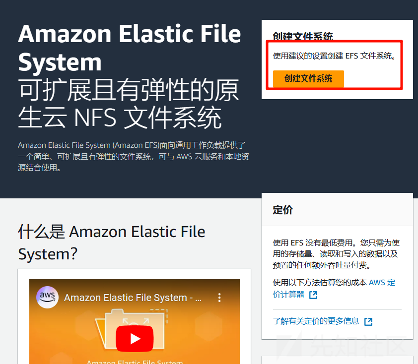
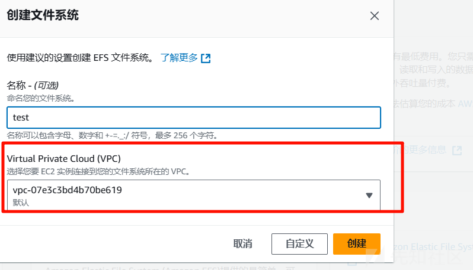
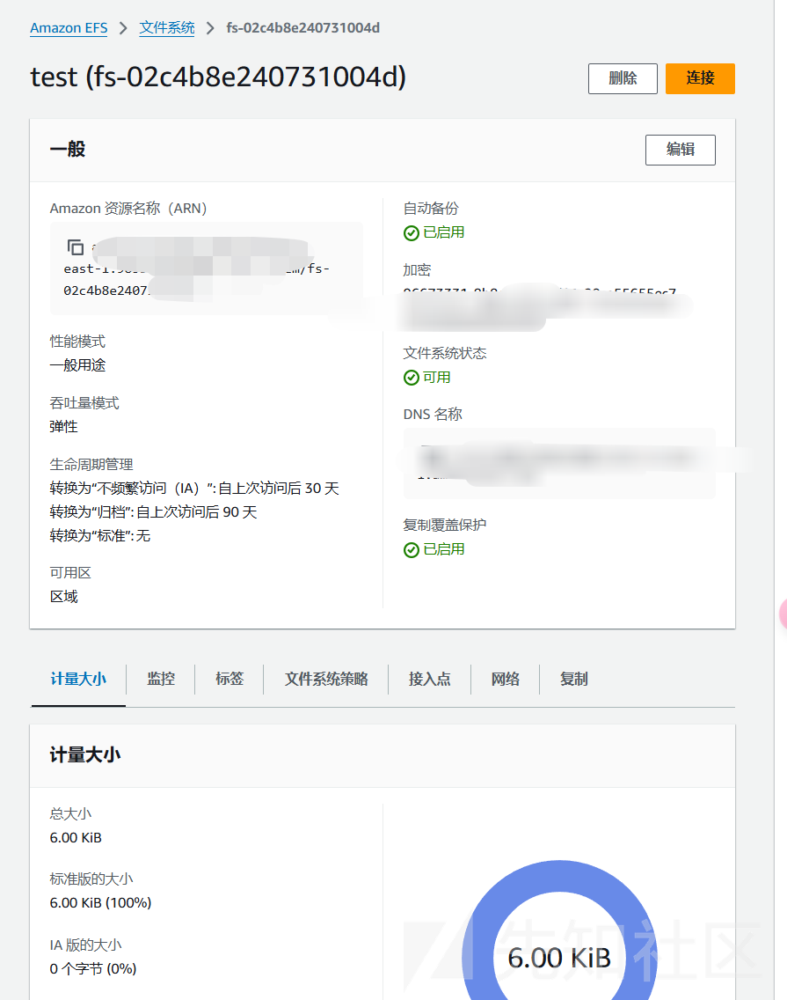
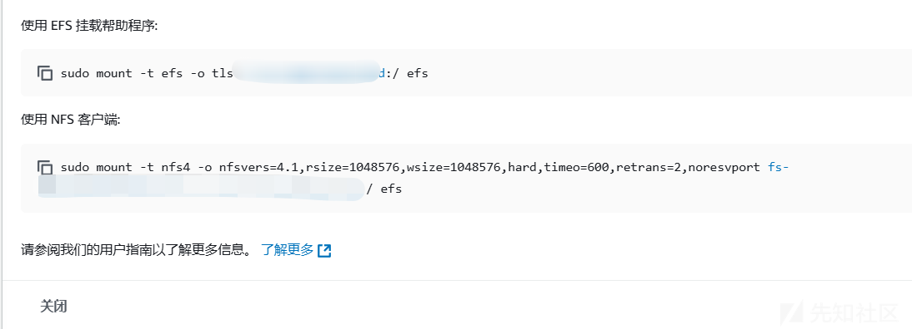
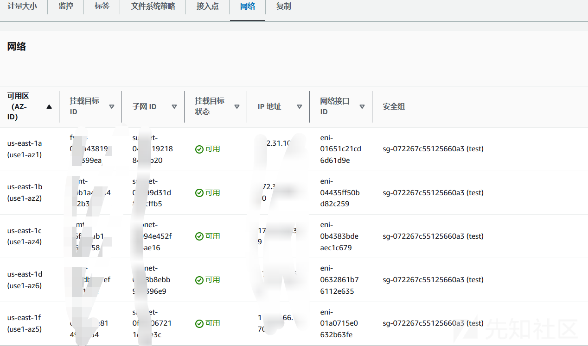

# AWS云之EFS 挂载安全-先知社区

> **来源**: https://xz.aliyun.com/news/16404  
> **文章ID**: 16404

---

# AWS云之EFS 挂载安全

AWS EFS（Elastic File System）是 Amazon Web Services 提供的一种完全托管的、可扩展的网络文件存储服务。它设计用于与多个 EC2 实例（以及其他 AWS 服务）共享文件系统。EFS 允许你将文件存储在多个 EC2 实例之间共享，且具有高度的可扩展性和高可用性。EFS 可以扩展到海量的数据量，并且能够自动根据存储需求增加或减少存储容量。

**EFS 作用**

动态弹性  
Amazon EFS 可在您添加或删除文件时自动即时地扩大或缩小您的文件存储容量，不会中断您的应用程序，可在您需要时为您提供所需的存储空间。您只需创建文件系统和开始添加文件，无需提前预置存储。

完全托管  
Amazon EFS 是一项完全托管型服务，可为通用工作负载提供共享文件系统存储。它提供简单的界面，可使您快速创建和配置文件系统并为您管理文件存储基础设施，从而消除部署、修补和维护文件系统基础的复杂性。

可扩展的性能  
Amazon EFS 旨在提供通用工作负载所需的吞吐量、IOPS 和低延迟。吞吐量和 IOPS 可以随文件系统增长而扩展，并且可以在短时间内突增到较高的吞吐量水平，以支持不可预测的文件工作负载性能需求。对于最苛刻的工作负载，Amazon EFS 可以支持超过 10 GB/秒的性能和高达 500000 次 IOPS。

共享文件存储  
Amazon EFS 可为数千个连接提供安全访问。Amazon EC2 实例和本地服务器可以使用传统的文件许可模型、文件锁定功能和分层目录结构通过 NFSv4 协议同时访问 Amazon EFS 共享文件系统。Amazon EC2 实例可以跨可用区和 AWS 区域访问您的文件系统，而本地服务器可以使用 AWS Direct Connect 或 AWS VPN 进行访问。

### 环境搭建

首先访问  
<https://us-east-1.console.aws.amazon.com/efs/home?region=us-east-1#/get-started>

这里  


然后会涉及到 VPC  


在 AWS 中，VPC（Virtual Private Cloud）是一个虚拟网络，允许你在 AWS 云中定义和控制网络配置。通过 VPC，你可以选择 IP 地址范围、子网布局、路由表、网络网关等，构建一个完全隔离的网络环境，使得你的 AWS 资源（如 EC2 实例、RDS 数据库、EFS 文件系统等）能够在一个私有的、受控的网络中进行通信。

其实也是为了安全考虑  
因为 EFS 是一个网络文件系统，它是基于 NFS 协议的，所以必须在 VPC 内进行配置和挂载。

可以确保 EFS 文件系统只对特定的 EC2 实例、子网或网络区域开放访问。使用 VPC 的安全组和网络 ACL 保护文件系统免受未授权访问。

这样打个比方

EFS（Elastic File System） 是你公司中需要共享的文件柜。每个部门的员工都需要从这个文件柜中拿取文件，可能是财务部、开发部或销售部的员工。为了确保文件柜能够安全地让不同部门共享，你需要把文件柜放在一个子网中，并通过你的 VPC 中的网络控制流量。

如果你没有选择合适的 VPC 设置，文件柜（EFS）就无法被其他部门安全地访问，或者可能会被不应该有权限的部门看到，造成安全隐患。

然后 VPC 组成部分很多，GPT 来生动形象一手

VPC = 你公司里的大楼

想象你有一个公司，想在这栋大楼里放置不同的办公室（即：不同的计算资源）。这栋大楼就是你的 VPC，它定义了你可以在哪里放置这些办公室以及它们如何相互连接。你决定了整个大楼的布局和访问控制。  
子网 = 各个部门

在你的公司大楼里，你会把不同的部门分配到不同的楼层或区域。每个部门代表一个子网，这些部门可能有不同的功能，例如研发部、财务部和人力资源部，每个部门的人员只能在该部门内活动。  
互联网网关（Internet Gateway）= 大楼的主门

互联网网关就像是你公司大楼的主门。通过这个门，你的大楼可以和外界（互联网）进行互动。你可以设置只让某些部门（比如公开的销售部门）通过主门与外界联系，而其他部门（如财务部门）则不允许直接与外界互动。  
路由表 = 楼内的指示牌

公司的每个楼层都可能有指示牌，指引员工从一个部门走到另一个部门。路由表就是这样的指示牌，它告诉数据（例如，你的文件或请求）从一个子网流向另一个子网，或者如何通过主门（互联网网关）到达外面。  
安全组 = 部门的门禁系统

每个部门的门都有门禁系统，只有持有授权证件的人才能进入。例如，财务部的门禁系统只允许财务部的人进入，其他部门的人员无法进入。这就是安全组的作用，它控制着哪些流量能够进入和离开你的 VPC 中的每个资源（例如 EC2 实例、数据库等）。  
网络 ACL = 整栋大楼的安保人员

还可以想象大楼有一套总的安保措施，安保人员会检查进入大楼的每一位员工，确保没有未经授权的人进入。这就是网络 ACL，它在每个子网的入口和出口处进行安全检查，确保符合安全策略。  
VPC Endpoints = 内部电梯

如果你不想让某些部门的员工每次都走出大楼到外面（互联网）去访问某些资源（比如 S3 存储），你可以设置 VPC Endpoint，让他们直接通过内部电梯去到指定的楼层。这就像是通过 VPC Endpoint，你的 VPC 资源可以直接与 AWS 服务（如 S3）通信，而无需经过互联网。

我这里选择的是默认

创建好后如下



连接方法官方提供了两种方法

**DNS 挂载**



**IP 挂载**  
  
不同区域的 ip 不同

然后还可以设置安全组

  
这里为了后续的方便操作，我把安全组设置了为了全端口

### 漏洞利用

首先列出 EFS

```
root@VM-16-17-ubuntu:~# aws efs describe-file-systems
{
    "FileSystems": [
        {
            "OwnerId": "985539798290",
            "CreationToken": "quickCreated-fabee36e-15d7-415e-8f21-5fbddf43b45a",
            "FileSystemId": "fs-02c4b8e240731004d",
            "CreationTime": 1735479922.0,
            "LifeCycleState": "available",
            "Name": "test",
            "NumberOfMountTargets": 5,
            "SizeInBytes": {
                "Value": 6144,
                "ValueInIA": 0,
                "ValueInStandard": 6144
            },
            "PerformanceMode": "generalPurpose",
            "Encrypted": true,
            "KmsKeyId": "arn:aws:kms:us-east-1:985539798290:key/96673331-8b8a-44ac-9d91-20ca55655ec7",
            "ThroughputMode": "elastic",
            "Tags": [
                {
                    "Key": "Name",
                    "Value": "test"
                },
                {
                    "Key": "aws:elasticfilesystem:default-backup",
                    "Value": "enabled"
                }
            ]
        }
    ]
}

```

然后获取了 id 后我们就可以查看他的挂载的目标了

```
root@VM-16-17-ubuntu:~# aws efs describe-mount-targets --file-system-id fs-02c4b8e240731004d
{
    "MountTargets": [
        {
            "OwnerId": "985539798290",
            "MountTargetId": "fsmt-00b1a4f5544f2b3ec",
            "FileSystemId": "fs-02c4b8e240731004d",
            "SubnetId": "subnet-08399d31d84ecffb5",
            "LifeCycleState": "available",
            "IpAddress": "172.31.83.160",
            "NetworkInterfaceId": "eni-04435ff50bd82c259",
            "AvailabilityZoneId": "use1-az2",
            "AvailabilityZoneName": "us-east-1b"
        },
        {
            "OwnerId": "985539798290",
            "MountTargetId": "fsmt-019dba41ef86e1ede",
            "FileSystemId": "fs-02c4b8e240731004d",
            "SubnetId": "subnet-00e8b8ebb946396e9",
            "LifeCycleState": "available",
            "IpAddress": "172.31.34.52",
            "NetworkInterfaceId": "eni-0632861b76112e635",
            "AvailabilityZoneId": "use1-az6",
            "AvailabilityZoneName": "us-east-1d"
        },
        {
            "OwnerId": "985539798290",
            "MountTargetId": "fsmt-06ffa7ab1c4654158",
            "FileSystemId": "fs-02c4b8e240731004d",
            "SubnetId": "subnet-0f094e452fec4ae16",
            "LifeCycleState": "available",
            "IpAddress": "172.31.29.39",
            "NetworkInterfaceId": "eni-0b4383bdeaec1c679",
            "AvailabilityZoneId": "use1-az4",
            "AvailabilityZoneName": "us-east-1c"
        },
        {
            "OwnerId": "985539798290",
            "MountTargetId": "fsmt-074a438191f1399ea",
            "FileSystemId": "fs-02c4b8e240731004d",
            "SubnetId": "subnet-04cf21921884d1b20",
            "LifeCycleState": "available",
            "IpAddress": "172.31.10.214",
            "NetworkInterfaceId": "eni-01651c21cd6d61d9e",
            "AvailabilityZoneId": "use1-az1",
            "AvailabilityZoneName": "us-east-1a"
        },
        {
            "OwnerId": "985539798290",
            "MountTargetId": "fsmt-09a4ccce81498c634",
            "FileSystemId": "fs-02c4b8e240731004d",
            "SubnetId": "subnet-0ff05067211ddde3c",
            "LifeCycleState": "available",
            "IpAddress": "172.31.66.170",
            "NetworkInterfaceId": "eni-01a0715e0632b63fe",
            "AvailabilityZoneId": "use1-az5",
            "AvailabilityZoneName": "us-east-1f"
        }
    ]
}

```

然后我们查询一下他的安全组，方便我们观察是否可以利用

```
root@VM-16-17-ubuntu:~# aws efs describe-mount-target-security-groups --mount-target-id fsmt-00b1a4f5544f2b3ec
{
    "SecurityGroups": [
        "sg-0d6efe3bbd120c805"
    ]
}

```

```
root@VM-16-17-ubuntu:~# aws ec2 describe-security-groups --group-ids sg-072267c55125660a3
{
    "SecurityGroups": [
        {
            "Description": "ok",
            "GroupName": "test",
            "IpPermissions": [
                {
                    "FromPort": 0,
                    "IpProtocol": "tcp",
                    "IpRanges": [
                        {
                            "CidrIp": "0.0.0.0/0"
                        }
                    ],
                    "Ipv6Ranges": [],
                    "PrefixListIds": [],
                    "ToPort": 65535,
                    "UserIdGroupPairs": []
                }
            ],
            "OwnerId": "985539798290",
            "GroupId": "sg-072267c55125660a3",
            "IpPermissionsEgress": [
                {
                    "IpProtocol": "-1",
                    "IpRanges": [
                        {
                            "CidrIp": "0.0.0.0/0"
                        }
                    ],
                    "Ipv6Ranges": [],
                    "PrefixListIds": [],
                    "UserIdGroupPairs": []
                }
            ],
            "VpcId": "vpc-07e3c3bd4b70be619"
        }
    ]
}

```

然后我们开始挂载

首先需要下载一下工具

```
apt install nfs-common

```

下载好了之后我们就可以挂载了，只需要使用刚刚的命令就 ok 了，不过注意 VPC 的限制，如果我们控制了一台 EC2 服务器，就可以尝试挂载

参考<https://wx.zsxq.com/group/48844484415158>
