# 【免杀技术】致盲组件 - AMSI内存修复 （修改一个字节就能绕过AMSI？）-先知社区

> **来源**: https://xz.aliyun.com/news/16408  
> **文章ID**: 16408

---

# 简介

AMSI是微软开发的一个用于扫描特殊攻击面的反病毒组件，可以看微软官方的[AMSI介绍](https://learn.microsoft.com/zh-cn/windows/win32/amsi/antimalware-scan-interface-portal "AMSI介绍")。这是微软官方的[扫描原理介绍](https://learn.microsoft.com/zh-cn/windows/win32/amsi/how-amsi-helps "扫描原理介绍")，ASMI接口会提供扫描的结果给杀毒软件，最后还是由杀软来处理恶意事件。官方还给出了AMSI的一些扫描API：

| 函数名称 | 说明 |
| --- | --- |
| AmsiCloseSession | 关闭由 AmsiOpenSession 打开的会话。 |
| AmsiInitialize | 初始化 AMSI API。 |
| AmsiNotifyOperation | 向反恶意软件提供程序发送任意操作的通知。 |
| AmsiOpenSession | 打开一个会话，在该会话中可以关联多个扫描请求。 |
| AmsiResultIsMalware | 确定扫描结果是否指示应阻止内容。 |
| AmsiScanBuffer | 扫描包含恶意软件内容的缓冲区。 |
| AmsiScanString | 扫描字符串以查找恶意软件。 |
| AmsiUninitialize | 删除最初由 AmsiInitialize 打开的 AMSI API 实例。 |

AMSI内存修补绕过的攻击面主要集中在AmsiOpenSession、AmsiScanBuffer、AmsiScanString。

# 逆向分析

AMSI的功能都是从amsi.dll中调用的API，可以在HackerProcess中看见这个powershell进程中加载了amsi.dll:

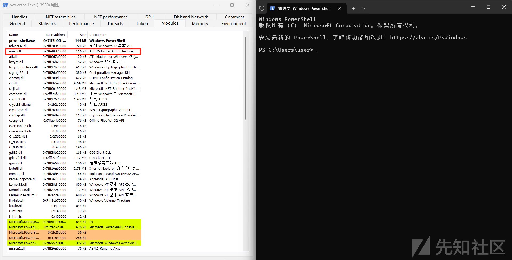

这也是我们能够进行修补的根本原因（反病毒的代码就在当前的进程内存中）。

在system32目录下找到amsi.dll，拖进IDA中

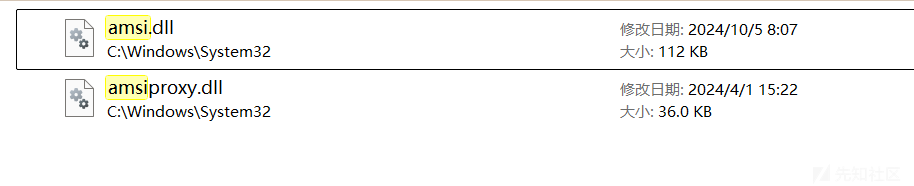

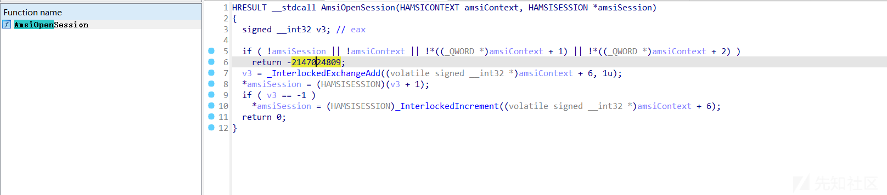

```
HRESULT __stdcall AmsiOpenSession(HAMSICONTEXT amsiContext, HAMSISESSION *amsiSession)
{
  signed __int32 v3; // eax

  if ( !amsiSession || !amsiContext || !*((_QWORD *)amsiContext + 1) || !*((_QWORD *)amsiContext + 2) )
    return -2147024809;
  v3 = _InterlockedExchangeAdd((volatile signed __int32 *)amsiContext + 6, 1u);
  *amsiSession = (HAMSISESSION)(v3 + 1);
  if ( v3 == -1 )
    *amsiSession = (HAMSISESSION)_InterlockedIncrement((volatile signed __int32 *)amsiContext + 6);
  return 0;
}

```

AmsiOpenSession接受两个参数`HAMSICONTEXT amsiContext`和`HAMSISESSION *amsiSession`，然后会对这两个变量做一些是否为空指针的判断，如果都有空指针，那么就`return -2147024809;`。根据ChatGPT的回答：这个特定的值 -2147024809 是一个常见的 Windows 错误代码，它在十六进制表示为 0x80070057。0x80070057 是 Windows 系统中的 E\_INVALIDARG 错误代码，表示 “无效的参数”（Invalid Argument）。

以我的编程习惯，如果遇到这种参数无效的情况一般都是用return去退出当前函数，这个`return -2147024809`看着还挺像这么一回事。事实也是如此，只要执行到了`return -2147024809`这步，那么这个AMSI的API就会执行失败，后续的扫描也是不会执行的。

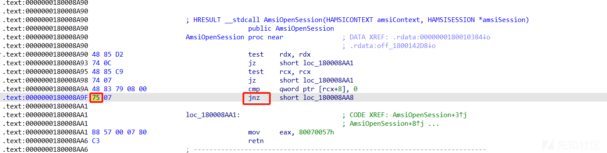

这部分if判断对应的汇编如上，我们只需把圈出来的部分的字节码0x75替换成0x74即可，这样就可以让if判断的逻辑反着来了。

再对AmsiScanString和AmsiScanBuffer进行分析也可以发现有类似结构，并且AmsiScanString貌似是直接调用的AmsiScanBuffer。：

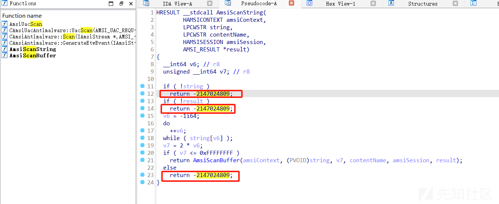

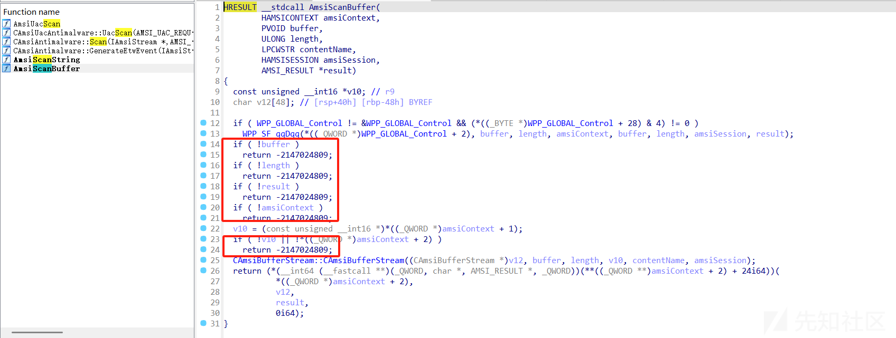

那只要对AmsiScanBuffer做单字节修补，其实也变相对AmsiScanString做了修补了。

# 单字节修补AmsiScanBuffer绕过AMSI扫描接口

正常情况下执行ps1恶意脚本会遭遇到AMSI的扫描，并且被WD拦截：

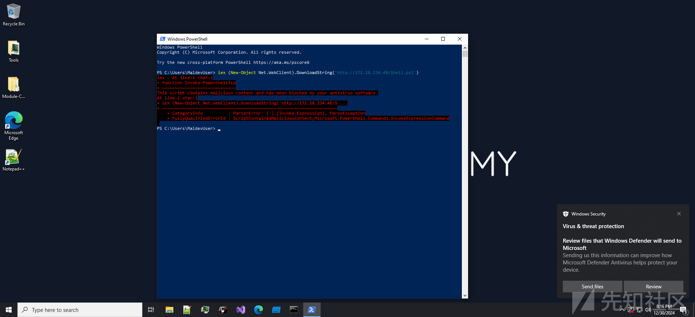

打开xdbg，附加一个PowerShell进程，找到AmsiScanBuffer的位置，箭头所指的地方就是`return -2147024809;`。

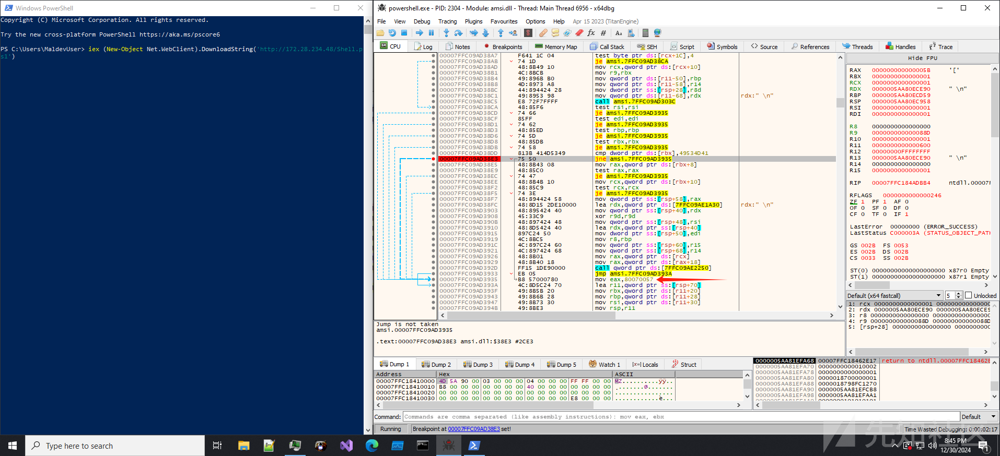

先运行一个反弹shell的nishang脚本。  
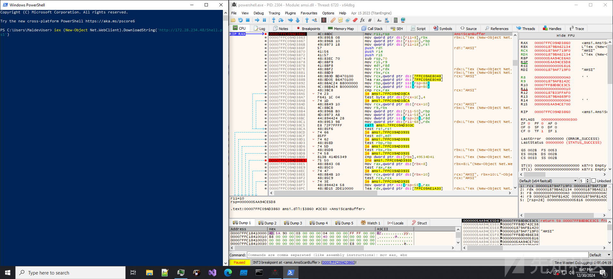

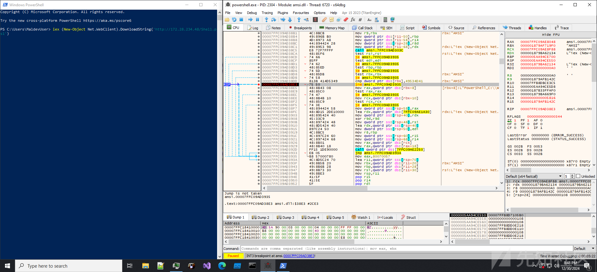

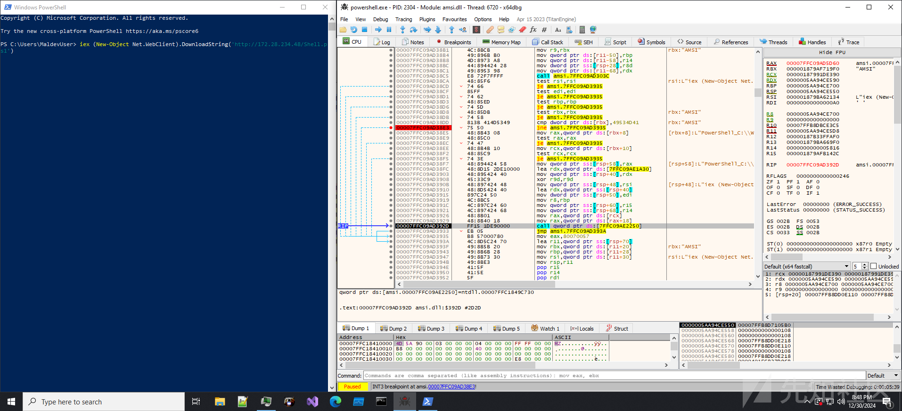

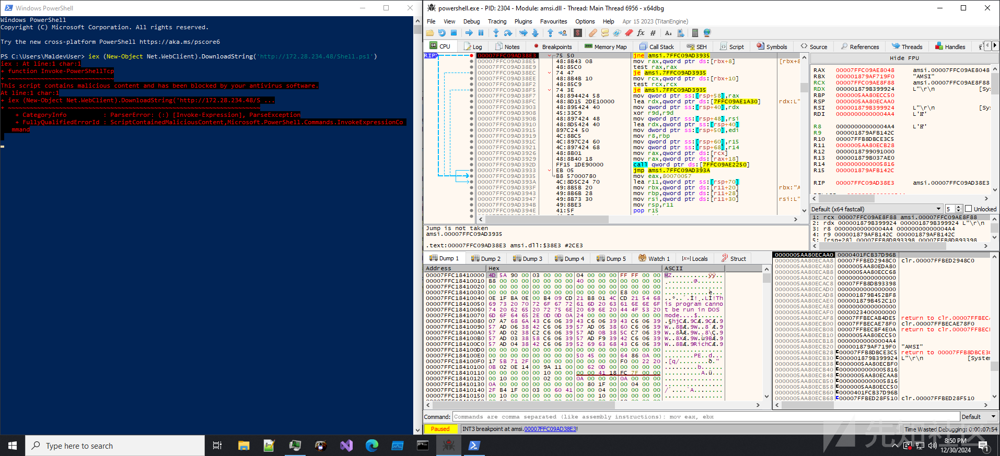  
可以看到正常情况下的AMSI不会执行到`return -2147024809;`，并且还会报毒。

写好POC后，我们再次用xdbg查看PowerShell进程

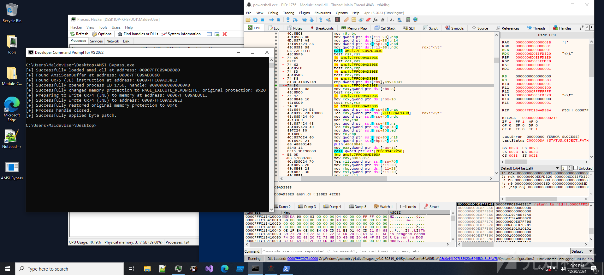

可以发现`jne`指令已经被替换成了`je`,下次运行按道理来说肯定就会跳转到`return -2147024809;`了。

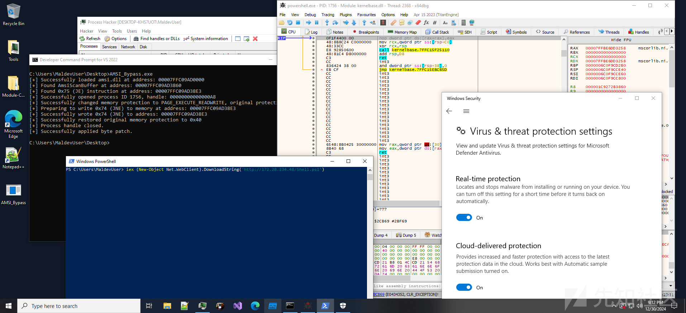

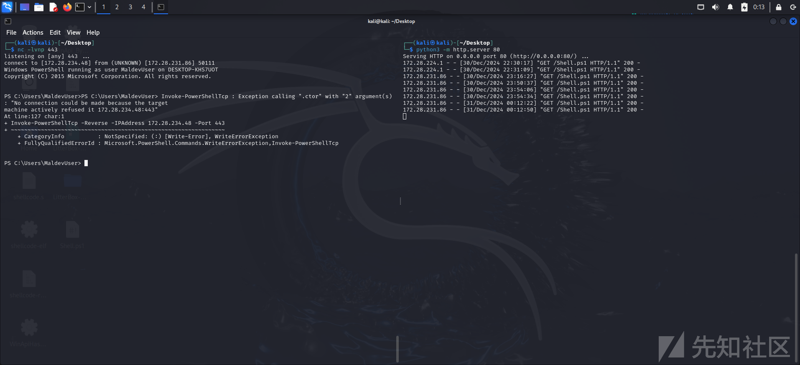

AmsiOpenSession和这两个函数略有不同，区别主要是在jz jnz的排布上。

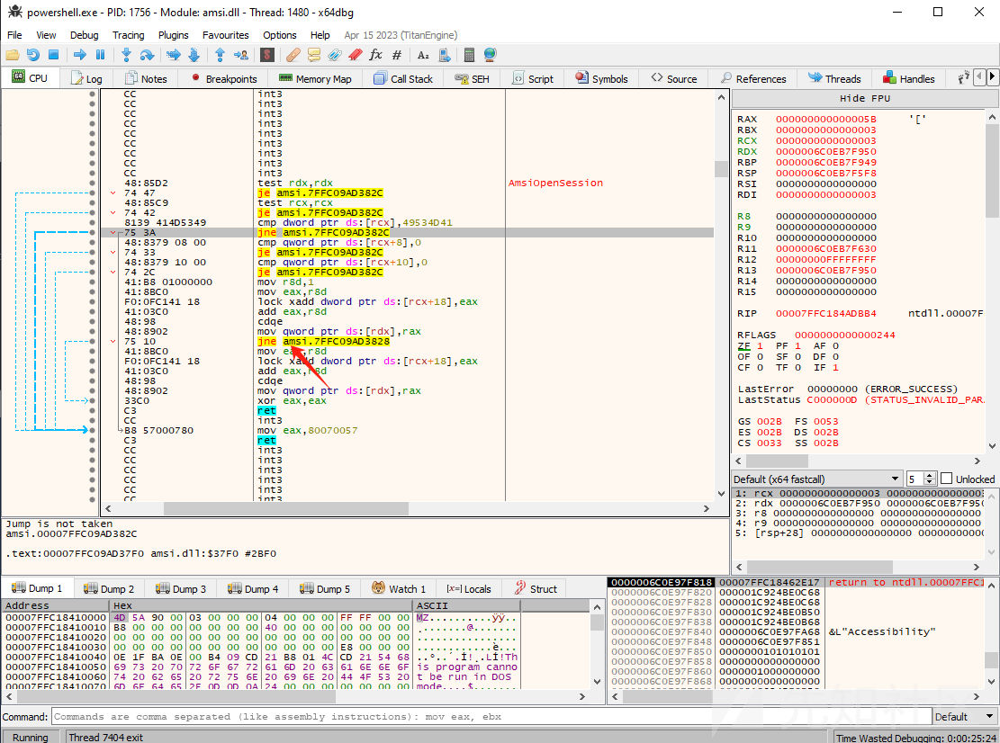

因为这里会多一个jne，所以你要找到第二个jne指令，原理都是一样的。

# AMSI的内存修补POC的规避

一些杀软会对AMSI修补行为进行规避，参考一下[Elatic的规则](https://github.com/elastic/protections-artifacts/blob/main/behavior/rules/windows/defense_evasion_amsi_or_wldp_bypass_via_memory_patching.toml "Elatic的规则")，似乎不是很严格。规则中对API的使用进行了检测，如`WriteProcessMemory`、`VirtualProtectEx`等。在只是面对杀毒软件的情况下，这完全就可以通过系统调用直接绕过了。规则中还有大量的白名单排除项，路径排除项，可信进程排除项等（白+黑直接绕了）。

我的POC在没有做任何免杀的情况下，没有被WD查杀，能够正常执行，不过却触发了一个文件上传请求，WD觉得可疑，所以向我索要POC文件。

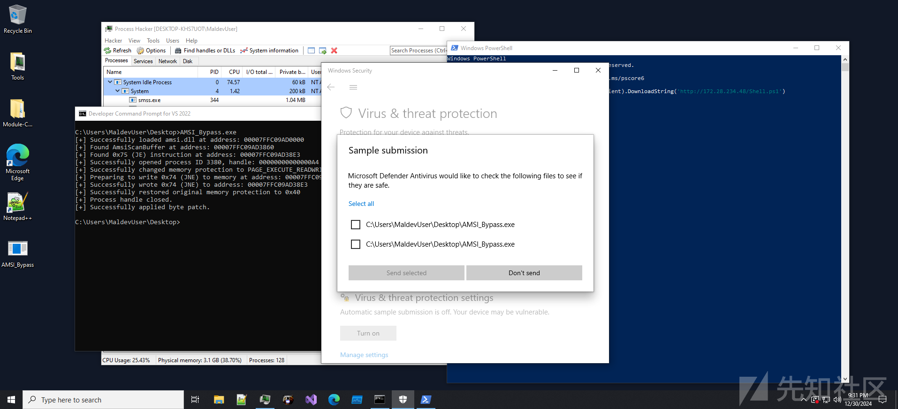

其实用C语言操作远程进程的内存是非常可疑的，内存修补更好的方案是写成C#语言的POC，直接在PowerShell当前进程中执行。

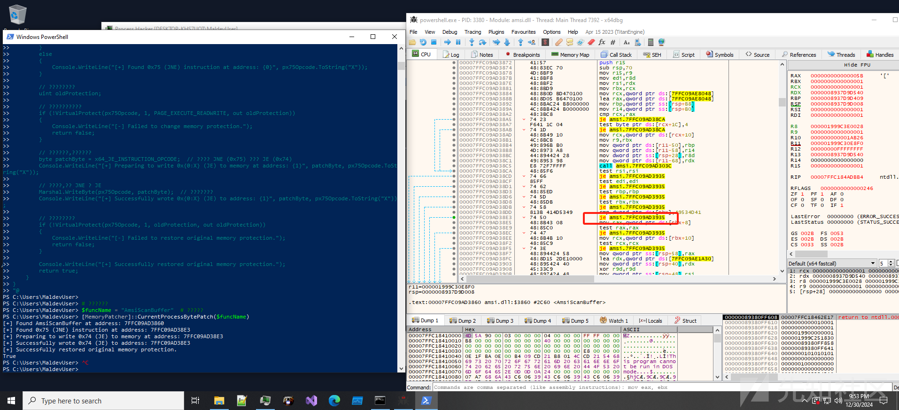

这下直接连告警都没了，实战中可以写进ps1文件中进行远程的无文件攻击。


