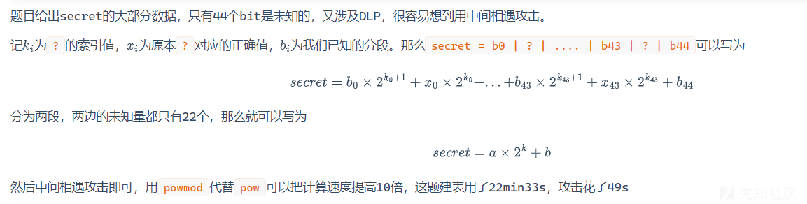

# 2024ImaginaryCTF 12月练习赛——部分Crypto题解分享-先知社区

> **来源**: https://xz.aliyun.com/news/16412  
> **文章ID**: 16412

---

# Analyze

50pts——109solves

> 题目描述：
>
> I replaced each letter with another letter. Surely you can't decrypt my secret message! Example: All "a" become "b", all "b" become "c" etc.
>
> encoded.txt

```
Fka gavfkas tofcnba nc utjaui, gnfk v ctlf psaaxa vwb ruavs cqnac. Fka cow cknwac yawfui, wtf ftt psnykf, vwb fka vns laauc lsack vwb rvuh. Fsaac cgvi cunykfui, fkans uavjac socfunwy unqa v monaf ctwy. Pnsbc lui vwb cnwy, vbbnwy unla ft fka eavralou crawa. Nf nc fka qnwb tl bvi fkvf hvqac ito gvwf ft cfae tof vwb awdti fka gtsub. Cork gavfkas laauc easlarf, unqa v ynlf lsth wvfosa. nrfl{rkvfYEF_nc_hi_pacf_lsnawb}
```

词频分析网站一把梭 -> <https://quipqiup.com/>

```
The weather outside is lovely, with a soft breeze and clear skies. The sun shines gently, not too bright, and the air feels fresh and calm. Trees sway slightly, their leaves rustling like a quiet song. Birds fly and sing, adding life to the peaceful scene. It is the kind of day that makes you want to step out and enjoy the world. Such weather feels perfect, like a gift from nature. ictf{chatGPT_is_my_best_friend}
```

# Affine Padding

75pts——27solves

> 题目描述：
>
> I've heard low exponent attacks aren't an issue so long as you pad your messages. I don't trust pkcs so I made my own :)
>
> task.py

```
from Crypto.Util.number import getPrime, bytes_to_long
from Crypto.Random import get_random_bytes

e = 3
p = getPrime(1024)
q = getPrime(1024)
N = p * q


a = N
b = N

while(a >= N and b >= N):
    a = bytes_to_long(get_random_bytes(256))
    b = bytes_to_long(get_random_bytes(256))

M = b'ictf{REDACTED}'
assert(len(M) == 33)

C = pow(a * bytes_to_long(M) + b,3,N)

print(f"N = {N}")
print(f"a = {a}")
print(f"b = {b}")
print(f"C = {C}")
"""
N = 16359619110156658417685579228035521619940754617127991298327842479988835746612985585692907929072422029777417836293830137480825024955607938245687851339105215326502240511614728565508137119254345765413056092912468555958815902448459560499405595865900219359927160476092910407287436471073080138358848402932246882345967289692973272342226115086173414795064892347241700300076982298140907668415052157130375012758335958074220685253503993724604556568407164409326975295634454933421797420945516603112688370742971651711288867980175867408318512973605513732743426474185183897830662219648475072300550928821629587107815501418565192290803
a = 634313456280006546763096515170083689926176019381119163353423895755607670184946174337238273448254717470687254172856416008862567323579475014842078247798290268709933855032677714351411265082930118097695352939019988972705584726975174566691609364170624362198244725834101103596363246991143281221739276252925780527473121132832134310764654229074743808917729326041437819723506902154775027140604287218547185755660197379231395429392798003395207029831223131915162458149975183322073020912504768769556490997370923700862831051501508909588687895243825384094726849627102493479138392029498386262531035022616470001852863715449366796760
b = 17765475685158869061080978763771920969765602293608432891670354111319671321988590459896293455397551599927802619003215903011576825278656381547601643928193588911477420761071013694795919818403278159118758896243325904725227918551185831141953828149312728317368444118980103887447934645152757877870749409122561920564454561124382412529273189328020553654351830121246833457506768895359984684838604703597334432572453817855808437514026261595539900273423813687425913755148158467441887076501548454820085997355092089055977251043690306805844585980187568144620167734999443156096739304105767062932847746323677828553693182384347556319804
C = 12323020322606231658027275139602237894670502140619675942995626997633237892464485148466621083913659541893807052982584160217299961202047657118618866171663965638520338215823161013858238009265947434325872133347361920979069390287991442191213449250391005825688103442301097629891193714842587077125676893698862663007008858660358908462230009466287060364510879714841063199731955023118009725523719821308066142543053210679455074709945181348890698871533392583275413016297358871798034475057755890486515367700426781132023232717317089214348187490554234263698482746283793737932691199118640746736084098392316758223447900259905627872845
"""

```

把flag的已知信息当作$m\_h$，然后在模N下建立多项式  
$$  
f = (a(m\_h + x)+ b)^3 - C  
$$

此时未知量只有27字节，用coppersmith即可得解

> exp

```
# sage10.4
from Crypto.Util.number import *

N = 16359619110156658417685579228035521619940754617127991298327842479988835746612985585692907929072422029777417836293830137480825024955607938245687851339105215326502240511614728565508137119254345765413056092912468555958815902448459560499405595865900219359927160476092910407287436471073080138358848402932246882345967289692973272342226115086173414795064892347241700300076982298140907668415052157130375012758335958074220685253503993724604556568407164409326975295634454933421797420945516603112688370742971651711288867980175867408318512973605513732743426474185183897830662219648475072300550928821629587107815501418565192290803
a = 634313456280006546763096515170083689926176019381119163353423895755607670184946174337238273448254717470687254172856416008862567323579475014842078247798290268709933855032677714351411265082930118097695352939019988972705584726975174566691609364170624362198244725834101103596363246991143281221739276252925780527473121132832134310764654229074743808917729326041437819723506902154775027140604287218547185755660197379231395429392798003395207029831223131915162458149975183322073020912504768769556490997370923700862831051501508909588687895243825384094726849627102493479138392029498386262531035022616470001852863715449366796760
b = 17765475685158869061080978763771920969765602293608432891670354111319671321988590459896293455397551599927802619003215903011576825278656381547601643928193588911477420761071013694795919818403278159118758896243325904725227918551185831141953828149312728317368444118980103887447934645152757877870749409122561920564454561124382412529273189328020553654351830121246833457506768895359984684838604703597334432572453817855808437514026261595539900273423813687425913755148158467441887076501548454820085997355092089055977251043690306805844585980187568144620167734999443156096739304105767062932847746323677828553693182384347556319804
C = 12323020322606231658027275139602237894670502140619675942995626997633237892464485148466621083913659541893807052982584160217299961202047657118618866171663965638520338215823161013858238009265947434325872133347361920979069390287991442191213449250391005825688103442301097629891193714842587077125676893698862663007008858660358908462230009466287060364510879714841063199731955023118009725523719821308066142543053210679455074709945181348890698871533392583275413016297358871798034475057755890486515367700426781132023232717317089214348187490554234263698482746283793737932691199118640746736084098392316758223447900259905627872845

mhigh = bytes_to_long(b"ictf{" + b"\x00" * 27 + b"}")
R.<x> = PolynomialRing(Zmod(N))
f = (a*(mhigh + x*256) + b)^3 - C
res = f.monic().small_roots(X=256**27,beta=0.4)
print(res)
m = mhigh + int(res[0]) * 256
print(long_to_bytes(m))
# ictf{b4d_p4dd1n6_4nd_5m4ll_r0075}

```

# RS-Survey

125pts——5solves

> task.py

```
from Crypto.Util.number import getPrime, long_to_bytes, bytes_to_long
from Crypto.Cipher import AES
from Crypto.Random import get_random_bytes
import base64


def encrypt_file_ecb(file_path, output_path):

    key = get_random_bytes(16)

    cipher = AES.new(key, AES.MODE_ECB)

    with open(file_path, 'rb') as file:
        plaintext = file.read()

    pad_len = 16 - len(plaintext) % 16
    padded_plaintext = plaintext + bytes([pad_len] * pad_len)

    ciphertext = cipher.encrypt(padded_plaintext)

    with open(output_path, 'wb') as encrypted_file:
        encrypted_file.write(ciphertext)

    return base64.b64encode(key)


p = getPrime(1024)
q = getPrime(1024)
N = p * q

e = 0x10001


m = (1 << 384) - 1
m = m | (m << 640)


a = p & m

b = encrypt_file_ecb("part_2","part_2_encrypted")
print(f"key = {b.decode('utf-8')}")
pt = bytes_to_long(b)
ct = pow(pt,e,N)
print(f"ct = {hex(ct)}")
print(f"N = {hex(N)}")
print(f"a = {hex(a)}")
"""
ct = 0x5e650fba38ef0baa32bd288a9d6482c1a5b7394082f119a9b033a981eef0fcf234b2a5d6e5cb06225a63bba54517811ae8ce3416134255383d9533e65d387b74de2c73a0fc2beaf6dcf2a6c79098081a19fe92f9d61a3ccc55300d6d40219a2ad8b06117857026418ec506e7e3ff6dcce930d7915b6a9ec159522f78e8ec3eaa2ba7fcfee42b8fc946cd99ffc217b7de60b5cc51d4da66c5072a101648ecc01222ad6ecef37e1afca2b49a1879aa18e3c61e74826507ea60617d7367afeabe4618f7fb22dae6090fd91563c7f4946fe2bc8365161cc0227a7a62b108f8bcd424e680b6b9c98416f81c586270b29dc78f3c3255a1f7f078067ed25373d9cdc88a
N = 0x7ff220c1d126520667d7506f8f9e7ad7b4bde810dca0572f8a738f4171fc1a0dceb6fe6856fef2c82d9b2386918ca728ad55a7c576671200ab0cd3a2aef8a172a46a7882bf5e384c138973a62ab8d0f0f252731109bc0ac7539cc37602c4256acb21d020067729fd41f2d2cbf338e6f4aa285c590c6e6f5818faec8e840809b1f83fe94b11a795d0312a61e9988d92e9d9c38e3b82bc141a2144593f661b0c015e8b1e45c81c188b89d756d0f6a38d00fe1d21bd8c1dd6669659bafaf1aae5d8b76a80441fb81f75ed84b68cb4cb6905f73017409ab3e4131e01986c4802f55123e4b7fc7dfba27976b218c5c2ebd96e0ecc09f3f03526a8fc2fb5d62aef7f5b
a = 0xaff2b91e1d0c773dd641043de27624c1e7454df5db174c2e03fb26301e654febbd83130c1d0f9f83ccf8faf665ea68c000000000000000000000000000000000000000000000000000000000000000001682259134c00474a27fb36e6182494aa46e58eed5df515c82f2c892d281a6f81999a8538ed5684b66929e6e97abac0d
"""

```

## step1

这里相当于给出了p的高384位，低384位，中间差256位，coppersmith即可得解

> exp

```
# sage 10.4
from Crypto.Util.number import *
from base64 import b64decode
from Crypto.Cipher import AES
from Crypto.Util.Padding import unpad

ct = 0x5e650fba38ef0baa32bd288a9d6482c1a5b7394082f119a9b033a981eef0fcf234b2a5d6e5cb06225a63bba54517811ae8ce3416134255383d9533e65d387b74de2c73a0fc2beaf6dcf2a6c79098081a19fe92f9d61a3ccc55300d6d40219a2ad8b06117857026418ec506e7e3ff6dcce930d7915b6a9ec159522f78e8ec3eaa2ba7fcfee42b8fc946cd99ffc217b7de60b5cc51d4da66c5072a101648ecc01222ad6ecef37e1afca2b49a1879aa18e3c61e74826507ea60617d7367afeabe4618f7fb22dae6090fd91563c7f4946fe2bc8365161cc0227a7a62b108f8bcd424e680b6b9c98416f81c586270b29dc78f3c3255a1f7f078067ed25373d9cdc88a
N = 0x7ff220c1d126520667d7506f8f9e7ad7b4bde810dca0572f8a738f4171fc1a0dceb6fe6856fef2c82d9b2386918ca728ad55a7c576671200ab0cd3a2aef8a172a46a7882bf5e384c138973a62ab8d0f0f252731109bc0ac7539cc37602c4256acb21d020067729fd41f2d2cbf338e6f4aa285c590c6e6f5818faec8e840809b1f83fe94b11a795d0312a61e9988d92e9d9c38e3b82bc141a2144593f661b0c015e8b1e45c81c188b89d756d0f6a38d00fe1d21bd8c1dd6669659bafaf1aae5d8b76a80441fb81f75ed84b68cb4cb6905f73017409ab3e4131e01986c4802f55123e4b7fc7dfba27976b218c5c2ebd96e0ecc09f3f03526a8fc2fb5d62aef7f5b
a = 0xaff2b91e1d0c773dd641043de27624c1e7454df5db174c2e03fb26301e654febbd83130c1d0f9f83ccf8faf665ea68c000000000000000000000000000000000000000000000000000000000000000001682259134c00474a27fb36e6182494aa46e58eed5df515c82f2c892d281a6f81999a8538ed5684b66929e6e97abac0d

p_h = a >> (1024 - 384) << (1024 - 384)
p_l = a % 2**384
R.<x> = PolynomialRing(Zmod(N))
f = p_h + x*2^384 + p_l
res = f.monic().small_roots(X=2^256,beta=0.4)
p = p_h + int(res[0]) * 2^384 + p_l
q = N // p
d = inverse(65537,(p-1)*(q-1))
key = b64decode(long_to_bytes(pow(ct,d,N)))

enc_part2 = open('part_2_encrypted','rb').read()
aes = AES.new(key,AES.MODE_ECB)
dec_part2 = unpad(aes.decrypt(enc_part2),16)
f2 = open('part_2.zip','wb')
f2.write(dec_part2)

```

## step2

这里打开压缩包之后还有一层

区别在于把m修改了

```
m = (1<<(1024 - 256)) - 1
m = m << 128

```

我们能知道p中间768位，这个要用bivariate的二元copper

```
# sage 10.4
from Crypto.Util.number import *
from base64 import b64decode
from Crypto.Cipher import AES
from Crypto.Util.Padding import unpad

def bivariate(pol, XX, YY, kk=4):
    N = pol.parent().characteristic()

    f = pol.change_ring(ZZ)
    PR, (x, y) = f.parent().objgens()

    idx = [(k - i, i) for k in range(kk + 1) for i in range(k + 1)]
    monomials = list(map(lambda t: PR(x ** t[0] * y ** t[1]), idx))
    # collect the shift-polynomials
    g = []
    for h, i in idx:
        if h == 0:
            g.append(y ** h * x ** i * N)
        else:
            g.append(y ** (h - 1) * x ** i * f)

    # construct lattice basis
    M = Matrix(ZZ, len(g))
    for row in range(M.nrows()):
        for col in range(M.ncols()):
            h, i = idx[col]
            M[row, col] = g[row][h, i] * XX ** h * YY ** i

    # LLL
    B = M.LLL()

    PX = PolynomialRing(ZZ, 'xs')
    xs = PX.gen()
    PY = PolynomialRing(ZZ, 'ys')
    ys = PY.gen()

    # Transform LLL-reduced vectors to polynomials
    H = [(i, PR(0)) for i in range(B.nrows())]
    H = dict(H)
    for i in range(B.nrows()):
        for j in range(B.ncols()):
            H[i] += PR((monomials[j] * B[i, j]) / monomials[j](XX, YY))

    # Find the root
    poly1 = H[0].resultant(H[1], y).subs(x=xs)
    poly2 = H[0].resultant(H[2], y).subs(x=xs)
    poly = gcd(poly1, poly2)
    x_root = poly.roots()[0][0]

    poly1 = H[0].resultant(H[1], x).subs(y=ys)
    poly2 = H[0].resultant(H[2], x).subs(y=ys)
    poly = gcd(poly1, poly2)
    y_root = poly.roots()[0][0]

    return x_root, y_root

ct = 0x6c9e26baaec25a5f7280ea2212a9ab5725cf193dbbb15137f06c10f980d5e99a7b084ff27a9953e6aa16eff5f67e8c98a898cceca8ae3e269efe8994662403c14b3c668a01c8df5e9520bd895cc0d2fe6a1bbca608e7dee78921930c8c19aae60bf536fa9ca87c638e02756d4c1ba9dd8c0ebc11a2e794fd2621ff2a4de37ca6384d29d43ec0eea01f542cbedadaad9bfb8d6d0cb5b3236c0a2b9b185caf4cfd80eb394014056dfdaa4d583af647ded87c7b14743b6046bb32152e4a672d08e00ac0773012a7bce102c1cdf7f9461d2fbc2296665be722472a38fc9d7797930c0dea0da739fb8910966a991b279f911135b81b28c273c3d4a34c65a573c65c31
N = 0x74764fd075edb9fb9e6f02bf2e2b6d613f5be9e9bd69486ed5a745b7e17d53f33e15f15f8892f7e6a9291f35a672feaf5d026ad1066d0fe5fafdcebc9e848fae0280abe220cafb5d4841f18a80c0194ac650eb98671636df0add9ebe38e884f32e1172c7b6bbefcb8919600b0a9243c679d6006c6075eff77c2d7428071028c1d2cc0c6709e240011a419348dab45f8d86418faba07e6a96e4af34e2f7c830a34ad2dafb64b1b935e74327c1bdb57ede8d487424806312e68bdb953a9e900ac26ed392a755b5c18dd2a8f2d3717245f3b158ee8c8fa06f322f931a6a0ca1859d4f61e48c2de43350e3c4b47029bf34a7ca1f01279082339bc08a7712050d4021
a = 0x69588afc0cdde8d3c78cf5d781b6e22358b62e7fe1fcfce688c73e2b9199fc61577d1e3e7483d65656bb16470c39378fb4c2ed5af01ad0d91dfe55804cbccf412e3b4e1f80f39954eb068176bc08de9b4df384e5bfe364a531d9bb4a5a04077500000000000000000000000000000000

unknown = 128
p_m = a >> unknown
R.<x,y> = PolynomialRing(Zmod(N))
f = x*2^(1024 - unknown) + p_m * 2^unknown + y
x,y = bivariate(f,2^unknown,2^unknown,5)

p = int(x)*2^(1024 - unknown) + p_m * 2^unknown + int(y)
q = N // p
d = inverse(65537,(p-1)*(q-1))
key = b64decode(long_to_bytes(pow(ct,d,N)))
enc_part3 = open('part_3_encrypted','rb').read()
aes = AES.new(key,AES.MODE_ECB)
dec_part3 = unpad(aes.decrypt(enc_part3),16)
f2 = open('part_3.zip','wb')
f2.write(dec_part3)

```

## step3

特么还有一层

```
m1 = (1<<64) - 1
m2 = m1 << (416 + 64)
m3 = m2 << (416 + 64)
a = p - (p & (m1 | m2 | m3))

```

相当于p被分为5段`p = p1 | p2 | p3 | p4 | p5`，其中p1，p3,p5这三段均为64bit，都是未知的

卡在三元copper

基于[项目](https://github.com/Connor-McCartney/coppersmith/blob/main/coppersmith.sage)中的demo10，进行修改即可

> exp

```
"""
References:

https://www.iacr.org/archive/asiacrypt2008/53500412/53500412.pdf
https://gist.github.com/hyunsikjeong/0c26e83bb37866f5c7c6b8918a854333
https://github.com/josephsurin/lattice-based-cryptanalysis/blob/main/lbc_toolkit/problems/small_roots.sage
https://github.com/kionactf/coppersmith
https://eprint.iacr.org/2023/032.pdf
"""

from sage.rings.polynomial.multi_polynomial_sequence import PolynomialSequence
from Crypto.Util.number import getPrime
from tqdm import tqdm
import cysignals
import itertools
from re import sub as re_sub
from subprocess import run as subprocess_run

def _xgcd_list(intlst):
    """
    extended gcd algorithm for a_0,...,a_k
    input: [a_0, ..., a_k]
    output: d_, [b_0, ..., b_k] s.t. gcd(a_0,...,a_k) = d_, sum(a_i*b_i for i) = d_
    """

    if len(intlst) == 1:
        if intlst[0] >= 0:
            return intlst[0], [1]
        else:
            return -intlst[0], [-1]

    d, a, b = xgcd(intlst[0], intlst[1])

    curgcd = d
    curlst = [a, b]
    for i in range(2, len(intlst)):
        d, a, b = xgcd(curgcd, intlst[i])
        curlst = list(map(lambda x: x*a, curlst)) + [b]
        curgcd = d
    return curgcd, curlst

def _from_sagematrix_to_fplllmatrix(mat: matrix) -> str:
    return '[' + re_sub(
        r'\[ ',
        r'[',
        re_sub(r' +', r' ', str(mat))
    ) + ']'


def _fplllmatrix_to_sagematrix(matrixstr: str) -> matrix:
    matlist = eval(matrixstr.replace(' ', ',').replace('\n', ','))
    return matrix(ZZ, matlist)


def _transformation_matrix(mat, lllmat, use_pari_matsol=False):
    # pari.matker() does not assure smallest kernel in Z (seems not call hermite normal form)
    # Sage kernel calls hermite normal form
    #
    # for computing ZZ transformation, use pari.matker, pari.matsolvemod
    # assume first kerdim vectors for lllmat are zero vector
    #
    # anyway, transformation computation after LLL/BKZ is slow.
    # instead, use builtin transformation computation on LLL/BKZ package

    if use_pari_matsol:
        mat_pari = pari.matrix(mat.nrows(), mat.ncols(), mat.list())
        ker_pari_t = pari.matker(pari.mattranspose(mat_pari), 1)
        kerdim = len(ker_pari_t)
        if kerdim == 0:
            # empty matrix
            trans = matrix(ZZ, 0, mat.nrows())
        else:
            trans = matrix(ZZ, pari.mattranspose(ker_pari_t).Col().list())

        mat_pari = pari.matrix(mat.nrows(), mat.ncols(), mat.list())
        for i in range(kerdim, lllmat.nrows(), 1):
            lllmat_pari = pari.vector(lllmat.ncols(), lllmat[i].list())
            trans_pari_t = pari.matsolvemod(
                pari.mattranspose(mat_pari), 0, pari.mattranspose(lllmat_pari)
            )
            transele = matrix(ZZ, trans_pari_t.mattranspose().Col().list())
            trans = trans.stack(transele)
    else:
        trans = mat.kernel().matrix()
        kerdim = trans.nrows()

        for i in range(kerdim, lllmat.nrows(), 1):
            transele = mat.solve_left(lllmat[i])
            trans = trans.stack(transele)

    return trans


def do_LLL_flatter(
        mat: matrix,
        transformation: bool = False,
        use_pari_kernel: bool = False, use_pari_matsol: bool = False
    ):


    if mat == zero_matrix(ZZ, mat.nrows(), mat.ncols()):
        return mat, identity_matrix(ZZ, mat.nrows())

    # sage has integer_kernel(), but somehow slow. instead using pari.matker
    if use_pari_kernel:
        mat_pari = pari.matrix(mat.nrows(), mat.ncols(), mat.list())
        ker_pari_t = pari.matker(mat_pari.mattranspose(), 1)
        ker = matrix(ZZ, ker_pari_t.mattranspose().Col().list())
    else:
        ker = mat.kernel().matrix()

    kerdim = ker.nrows()
    matrow = mat.nrows()
    col = mat.ncols()
    if kerdim == matrow: # full kernel
        return zero_matrix(ZZ, matrow, col), ker
    if kerdim == 0:
        Hsub = mat
        U = identity_matrix(ZZ, matrow)
    else:
        # heuristic construction for unimodular matrix which maps zero vectors on kernel
        # searching unimodular matrix can be done by HNF
        # (echeron_form(algorithm='pari') calls mathnf()),
        # but it is slow and produces big elements
        #
        # instead, searching determinant of submatrix = 1/-1,
        # then the determinant of whole unimodular matrix is det(submatrix)*(-1)^j
        # assume kernel has good property for gcd (gcd of some row elements might be 1)
        found_choice = False
        ker_submat_rows = tuple(range(kerdim))
        ker_submat_cols = []
        pivot = matrow - 1
        # search submatrix of kernel assuming last column vectors are triangulate
        while len(ker_submat_cols) < kerdim:
            if ker[ker_submat_rows, tuple([pivot])] != zero_matrix(ZZ, kerdim, 1):
                ker_submat_cols.append(pivot)
            pivot -= 1
        ker_submat_cols = tuple(sorted(ker_submat_cols))
        ker_last_det = int(ker[ker_submat_rows, ker_submat_cols].determinant())
        if ker_last_det == 0:
            raise ValueError("no unimodular matrix found (cause ker_last_det=0)")
        for choice in range(pivot, -1, -1):
            # gcd check
            gcd_row = ker_last_det
            for i in range(kerdim):
                gcd_row = GCD(gcd_row, ker[i, choice])
            if abs(gcd_row) != 1:
                continue

            # choice pivot: last columes for kernel are triangulated and small
            kersubidxes = [choice] + list(ker_submat_cols)
            detlst = [ker_last_det]
            for i in range(1, kerdim+1, 1):
                ker_submat_rows = tuple(range(kerdim))
                ker_submat_cols = tuple(kersubidxes[:i] + kersubidxes[i+1:])
                detlst.append(ker[ker_submat_rows, ker_submat_cols].determinant())
                detlist_gcd, detlist_coef = _xgcd_list(detlst)
                if detlist_gcd == 1:
                    found_choice = True
                    break
            if not found_choice:
                continue
            detlist_coef = detlist_coef + [0] * ((kerdim + 1) - len(detlist_coef))
            break
        if not found_choice:
            raise ValueError("no unimodular matrix found")
        U_top_vec = [0 for _ in range(matrow)]
        for i in range(kerdim+1):
            U_top_vec[kersubidxes[i]] = (-1)**i * detlist_coef[i]
        U_sub = matrix(ZZ, 1, matrow, U_top_vec)
        not_kersubidxes = sorted(list(set(list(range(matrow))) - set(kersubidxes)))
        for j in range(kerdim+1, matrow):
            onevec = [0 for _ in range(matrow)]
            onevec[not_kersubidxes[j-(kerdim+1)]] = 1
            U_sub = U_sub.stack(vector(ZZ, matrow, onevec))
        Hsub = U_sub * mat
        U = ker.stack(U_sub)
        #assert abs(U.determinant()) == 1

    if Hsub.nrows() == 1:
        lllmat = Hsub
    else:
        matstr = _from_sagematrix_to_fplllmatrix(Hsub)
        result = subprocess_run(
            'flatter',
            input=matstr.encode(), capture_output=True
        )
        if result.returncode != 0:
            print(result.stderr)
            raise ValueError(f"LLL failed with return code {result.returncode}")
        lllmat = _fplllmatrix_to_sagematrix(result.stdout.decode().strip())

    if transformation:
        trans = _transformation_matrix(Hsub, lllmat, use_pari_matsol=use_pari_matsol)
    else:
        trans = None

    restrows = mat.nrows() - lllmat.nrows()
    final_lllmat = zero_matrix(ZZ, restrows, lllmat.ncols()).stack(lllmat)

    if transformation:
        middle_trans = identity_matrix(ZZ, restrows).augment(zero_matrix(ZZ, restrows, trans.ncols())).stack(
            zero_matrix(ZZ, trans.nrows(), restrows).augment(trans)
        )
        final_trans = middle_trans * U
        #assert abs(final_trans.determinant()) == 1
        #assert final_trans * mat == final_lllmat
    else:
        final_trans = None

    return final_lllmat, final_trans

def generate_polynomial(N, _p):
    coefficients = []
    bounds = []
    i = 0
    ii = 0
    is_previous_unknown = True if _p[-1] == '?' else False

    for char in _p[::-1]:
        is_current_unknown = True if char == '?' else False
        if is_current_unknown and not is_previous_unknown:
            coefficients.append(2^(4*ii))
            i = 0
        if not is_current_unknown and is_previous_unknown:
            bounds.append(2^(4*i))
        is_previous_unknown = is_current_unknown
        i += 1
        ii += 1

    if is_current_unknown:
        bounds.append(2^(4*i))

    if _p[-1] == '?':
        coefficients = coefficients[::-1]
        coefficients.append(1)

    d = len(coefficients)
    xs = [f"x{i}" for i in range(d)]
    PR = PolynomialRing(Zmod(N), d, xs)
    f = int(_p.replace("?", "0"), 16) + sum([c * PR.objgens()[1][n] for n, c in enumerate(coefficients)])
    return f, bounds[::-1]

def univariate(f, X, beta=1.0, m=None):
    N = f.parent().characteristic()
    delta = f.degree()
    if m is None:
        epsilon = RR(beta^2/f.degree() - log(2*X, N))
        m = max(beta**2/(delta * epsilon), 7*beta/delta).ceil()
    t = int((delta*m*(1/beta - 1)).floor())
    #print(f"m = {m}")

    f = f.monic().change_ring(ZZ)
    P,(x,) = f.parent().objgens()
    g  = [x**j * N**(m-i) * f**i for i in range(m) for j in range(delta)]
    g.extend([x**i * f**m for i in range(t)]) 
    B = Matrix(ZZ, len(g), delta*m + max(delta,t))

    for i in range(B.nrows()):
        for j in range(g[i].degree()+1):
            B[i,j] = g[i][j]*X**j

    try:
        B, _ = do_LLL_flatter(B)
    except:
        B = B.LLL()
    f = sum([ZZ(B[0,i]//X**i)*x**i for i in range(B.ncols())])
    roots = set([f.base_ring()(r) for r,m in f.roots() if abs(r) <= X])
    return [root for root in roots if N.gcd(ZZ(f(root))) >= N**beta]


def solve_root_jacobian_newton_internal(pollst, startpnt, maxiternum=500):
    # NOTE: Newton method's complexity is larger than BFGS, but for small variables Newton method converges soon.
    pollst_Q = Sequence(pollst, pollst[0].parent().change_ring(QQ))
    vars_pol = pollst_Q[0].parent().gens()
    jac = jacobian(pollst_Q, vars_pol)

    if all([ele == 0 for ele in startpnt]):
        # just for prepnt != pnt
        prepnt = {vars_pol[i]: 1 for i in range(len(vars_pol))}
    else:
        prepnt = {vars_pol[i]: 0 for i in range(len(vars_pol))}
    pnt = {vars_pol[i]: startpnt[i] for i in range(len(vars_pol))}

    iternum = 0
    while True:
        if iternum >= maxiternum:
            return None

        evalpollst = [(pollst_Q[i].subs(pnt)) for i in range(len(pollst_Q))]
        if all([int(ele) == 0 for ele in evalpollst]):
            break
        jac_eval = jac.subs(pnt)
        evalpolvec = vector(QQ, len(evalpollst), evalpollst)
        try:
            pnt_diff_vec = jac_eval.solve_right(evalpolvec)
        except:
            return None

        prepnt = {key:value for key,value in prepnt.items()}
        pnt = {vars_pol[i]: int(pnt[vars_pol[i]] - pnt_diff_vec[i]) for i in range(len(pollst_Q))}
        if all([prepnt[vars_pol[i]] == pnt[vars_pol[i]] for i in range(len(vars_pol))]):
            return None
        prepnt = {key:value for key,value in pnt.items()}
        iternum += 1
    return [int(pnt[vars_pol[i]]) for i in range(len(vars_pol))]


def solve_system_jacobian(pollst, bounds):
    vars_pol = pollst[0].parent().gens()
    # not applicable to non-determined system
    if len(vars_pol) > len(pollst):
        return []
    # pollst is not always algebraically independent,
    # so just randomly choose wishing to obtain an algebraically independent set
    for random_subset in tqdm(Combinations(pollst, k=len(vars_pol))): 
        for signs in itertools.product([1, -1], repeat=len(vars_pol)):
            startpnt = [signs[i] * bounds[i] for i in range(len(vars_pol))]
            result = solve_root_jacobian_newton_internal(random_subset, startpnt)
            # filter too much small solution
            if result is not None:
                if all([abs(ele) < 2**16 for ele in result]):
                    continue
                return [result]

def solve_system_gb(H, f, timeout=5):
    vs = list(f.variables())
    H_ = PolynomialSequence([], H[0].parent().change_ring(QQ))
    for h in tqdm(H):
        H_.append(h)
        I = H_.ideal()
        roots = []

        alarm(timeout)
        try:
            for root in I.variety(ring=ZZ):
                root = tuple(H[0].parent().base_ring()(root[var]) for var in vs)
                roots.append(root)
            cancel_alarm()
            if roots != []:
                return roots
        except:
            cancel_alarm()       

class IIter:
    def __init__(self, m, n):
        self.m = m
        self.n = n
        self.arr = [0 for _ in range(n)]
        self.sum = 0
        self.stop = False

    def __iter__(self):
        return self

    def __next__(self):
        if self.stop:
            raise StopIteration
        ret = tuple(self.arr)
        self.stop = True
        for i in range(self.n - 1, -1, -1):
            if self.sum == self.m or self.arr[i] == self.m:
                self.sum -= self.arr[i]
                self.arr[i] = 0
                continue

            self.arr[i] += 1
            self.sum += 1
            self.stop = False
            break
        return ret

def multivariate_herrmann_may(f, bounds, m, t):
    n = f.nvariables()
    N = f.base_ring().cardinality()
    f /= f.coefficients().pop(0)  
    f = f.change_ring(ZZ)
    x = f.parent().objgens()[1]

    g = []
    monomials = []
    Xmul = []
    for ii in IIter(m, n):
        k = ii[0]
        g_tmp = f^k * N^max(t-k, 0)
        monomial = x[0]^k
        Xmul_tmp = bounds[0]^k
        for j in range(1, n):
            g_tmp *= x[j]^ii[j]
            monomial *= x[j]^ii[j]
            Xmul_tmp *= bounds[j]^ii[j]
        g.append(g_tmp)
        monomials.append(monomial)
        Xmul.append(Xmul_tmp)

    B = Matrix(ZZ, len(g), len(g))
    for i in range(B.nrows()):
        for j in range(i + 1):
            if j == 0:
                B[i, j] = g[i].constant_coefficient()
            else:
                v = g[i].monomial_coefficient(monomials[j])
                B[i, j] = v * Xmul[j]

    print("LLL...")
    try:
        B, _ = do_LLL_flatter(B)
    except:
        B = B.LLL()
    print("LLL done")

    h = []
    for i in range(B.nrows()):
        h_tmp = 0
        for j in range(B.ncols()):
            if j == 0:
                h_tmp += B[i, j]
            else:
                assert B[i, j] % Xmul[j] == 0
                v = ZZ(B[i, j] // Xmul[j])
                h_tmp += v * monomials[j]
        h.append(h_tmp)

    return f, h

def multivariate_shift_polynomials(f, bounds, m, d):
    if d is None:
        d = f.degree()

    R = f.base_ring()
    N = R.cardinality()
    f_ = (f // f.lc()).change_ring(ZZ)
    f = f.change_ring(ZZ)
    l = f.lm()

    M = []
    for k in range(m+1):
        M_k = set()
        T = set((f ^ (m-k)).monomials())
        for mon in (f^m).monomials():
            if mon//l^k in T: 
                for extra in itertools.product(range(d), repeat=f.nvariables()):
                    g = mon * prod(map(power, f.variables(), extra))
                    M_k.add(g)
        M.append(M_k)
    M.append(set())

    shifts = PolynomialSequence([], f.parent())
    for k in range(m+1):
        for mon in M[k] - M[k+1]:
            g = mon//l^k * f_^k * N^(m-k)
            shifts.append(g)

    B, monomials = shifts.coefficients_monomials()
    monomials = vector(monomials)

    factors = [monomial(*bounds) for monomial in monomials]
    for i, factor in enumerate(factors):
        B.rescale_col(i, factor)

    print("LLL...")
    try:
        B, _ = do_LLL_flatter(B)
    except:
        B = B.dense_matrix().LLL()
    print("LLL done")

    B = B.change_ring(QQ)
    for i, factor in enumerate(factors):
        B.rescale_col(i, 1/factor)
    B = B.change_ring(ZZ)

    H = PolynomialSequence([h for h in B*monomials if not h.is_zero()])
    return f, H

def multivariate(f, bounds, implementation, algorithm, m=1, t=1, d=None):
    if implementation == "herrmann_may":
        f, h = multivariate_herrmann_may(f, bounds, m, t)
    elif implementation == "shift_polynomials":
        f, h = multivariate_shift_polynomials(f, bounds, m, d)
    else:
        print("invalid implementation")
        return None

    if algorithm == "jacobian":
        return solve_system_jacobian(h, bounds)
    elif algorithm == "groebner":
        return solve_system_gb(h, f)
    else:
        print("invalid algorithm")
        return None

def recover_p_high(p_high, n, p_bits):
    p_high_bits = len(bin(p_high)) - 2
    PR.<x> = PolynomialRing(Zmod(n))
    f = p_high * 2**(p_bits-p_high_bits) + x
    x = univariate(f, X=2**(p_bits-p_high_bits), beta=0.4)
    if x == []:
        return None
    p = int(f(x[0]))
    if is_prime(p):
        return p
    return None

def recover_p_low(p_low, n, p_bits):
    p_low_bits = len(bin(p_low)) - 2
    PR.<x> = PolynomialRing(Zmod(n))
    f = x * 2**p_low_bits + p_low
    x = univariate(f, X=2**(p_bits-p_low_bits), beta=0.4)
    if x == []:
        return None
    p = int(f(x[0]))
    if is_prime(p):
        return p
    return None

from Crypto.Util.number import *
from Crypto.Cipher import AES
from base64 import b64decode

def solve():
    ct = 0x3a4b29c2430686dc34e70197f3c421c47153a22630ff2239bad0e1f6a54232d45ab8663aa51a2aaaa99b170b61d9fe6517d36d3f18cf84a0ab51fc336238a08693e7d0bcad7a0b541a4b6019c319fc31cfcdc863e4a1f463d4cac2735a25f92df2ea4cf2c52a2b4ae109194f6c722f2a7fe328abde69ad676e04364482572a5b6be22fbe52cfb34fe3fca0a9447bee9c779eda02366cf2d669d38d04ab0fddef779881ad481bda1b8b34e791388206905a7f321a1e4cdeab835613e4916553704a4c108c66703acf99e5f000a578fe019d145e86df7bcbe7f1a113e877bf9d25e69a97f8f6066342dfac32969b8879694ccca9ab4f5333b7426aa3f9e94989ef
    n = 0x59cdafec0de91597e9555922f96a56bb731bfce0c321282e4f815bea6fa349ac8ef4b0fe779558b7057c55bdc261aad0d515a02affab49c20f343366f203dcea8f745f87a34e300cd90efda9dbdd0b3b3d72d322cf64e53b36441cd18b074a68dfbb6d2c8539291fd63719f6fa2bc0ff09cca6948a5379ab42a40749861e51c150d91d1822a1358d5934394bdfb449ccb6e6637d384b82b5bc591247f5d4ec6bff17f7831bb1b1e91b2e4246f5b207cc3cef087868a00c6e69cbb7cad8e380339ff20a5716caa741ecba718e6bccc036532542eba3873a11e57c4d435cd44011b668cc4e462896260c8a3cb3a3daa3e4eeca2d998e0c11d46e69d532c46d3bcb
    a = 0xcfc8fc978830936cba5fded83c8ef8a1491cce1ffe2800e632c7a84aaeab2517c346162a8c1d54804826a2bfabece1e7ebac7875000000000000000071c4fdc62affa167473ac96169812a080067044a0062530313b89667191922cfbf6fe1d77811db0550b613ede24735a81c1f28a90000000000000000
    hex_a = hex(a)[2:].zfill(256)
    _p = '?'*16 + hex_a[16:16+104] + '?'*16 + hex_a[136:136+104] + '?'*16
    f, bounds = generate_polynomial(n, _p)
    print("\ndemo 10: three chunks")
    res = multivariate(f, bounds, implementation="herrmann_may", algorithm="jacobian", m=5)
    print(res)
    p = res[0][0] * 2^960 + res[0][1] * 2^480 + res[0][2] + a
    q = n // p
    d = inverse(65537,(p-1)*(q-1))
    m = pow(ct,d,n)
    return long_to_bytes(int(m))

key = solve()
key = b64decode(key)
c = open('encrypted_flag','rb').read()
aes = AES.new(key,AES.MODE_ECB)
flag = aes.decrypt(c)
print(flag)
# good job heres a flag :D\r\nictf{7r1v4r1473_c0pp3r5m17h_4774ck}\x03\x03\x03

```

# Cold Case

75pts——5solves

> 题目描述：
>
> Alice and Bob have been hosting an illegal flag sharing service. The flags we recovered were all encrypted but luckily ictf forensics was able to recovered most of bobs secret key. That shouldn't be problem for you though...
>
> task.py

```
from Crypto.Util.number import inverse, getPrime, long_to_bytes
from Crypto.Util.Padding import pad
from Crypto.Hash import SHA256
from Crypto.Cipher import AES

def transmit_params(p,g):
    ...
    return

def transmit_public_key(pub):
    ...
    return

def recieve_public_key():
    ...
    alices_public_key = bytes_to_long(b'this_isnt_alices_public_key')
    return alices_public_key

def transmit_data(data):
    ...
    return


p = getPrime(1024)

g = getPrime(1020)

transmit_params(p,g)

bob_secret = getPrime(1020)

bobs_pub_key = pow(g,bob_secret,p)

transmit_public_key(bobs_pub_key)

alice_pub_key = recieve_public_key()


shared_secret = SHA256.new()
shared_secret.update(long_to_bytes(pow(alice_pub_key,bob_secret,p)))
AES_key = shared_secret.digest()


flag = b'ictf{this_is_a_fake_flag}'

cipher = AES.new(AES_key,AES.MODE_ECB)
encrypted_data = cipher.encrypt(pad(flag,32))

transmit_data(encrypted_data)

```

> mem\_dump.txt

```
bob_secret = 11000010111010101?11100110011011011010100000001010111110111?1111011000011010110100000111010000111100101100?10000?011011011010000110100111101110011001111001000101101?000011110100111101000001?111001101110011001000?101101?10111101011?11101000010110001011?100100000100111001011100101010001?00100100110001100010100111101011110011101101100001?1010100010?11101110010010001??000?011000?00010100101100010000010001010?0011100101100001010110111001110001100001100?0?1?0011100110111?10?100011000011001000101011000001000000100101111000000111111100100?1?0001000110011101101010011011010111100111011001111101010101111111000100011000101011100011?101?010111?10011010010000?01?00100000101110000111000010100101011001?0011001100010010100100101011110100000100110000100010011010011110011100010100100101010?11011100010111100010111101?01111?10010010101000111011110001000?101?1111?10101100110000?1001011010011000001111001001111110110001101101?0??01111111?101001111010011?1100000001000000?01010001111101100110011001111110001110000101001010110010101
```

> network\_capture.txt

```
p = 93578713586734506259175139244800724800277955606506733830477918942760820542060100125629000813891610492786935836609356525339298348178582483183893998841186929615785004704930757747518046733401784457071008695295171184751151275343874090149030686399106121126054252869653858605448967883369001734550811303075992839949
g = 9666511028954005002240339545796448159046819887743418041150872001872751826912726049589630635751646368549739615160194850286108425662009673954394344782098526520160868789755663634003319559637928500193275279962389846712594816702760475889404594095960360599442422727135196062427551529795091581475825156194879517667
alice_pub = 22377332381023491895800437818929979606048213324375139594401838063907573151416259567879264291766508132669556652966811769378578534952453832478796256233782052173601710615663401488837825770815195952600881502980471289149406614872120350565804727120447209201765142691909334788309727754081976289305163309100906699065
bobs_pub = 47425047731638582975271582067056629326958770244321787917098687650487764453236742841522361589878851449921331210617306001966858330801929853554327598600804314367026330026853750356681935346699571302210395763344395184642310712732624588809315218528766131153975843491075640245667915953620959417743733048416224023197
AES_data = b"\xd6\xfb\x84\xd1\xd9\xa4~['%\x0c\xd1zi|U\x87K\xf7\x8a4x\xb1H\xdd\xea\xa8\xd7\x8f9\xf5\t\xb6\xec\xa1\xf3\xbe'\xf0\x82\xc0!\x94\xb4\x1d\x12\xa3\x14vY\xd1\xaa\xf7\x92<\xc2n\xc4\xa6\xad\x11\xe9g\xa5"
```



> exp.py

```
from Crypto.Util.number import inverse,long_to_bytes
from Crypto.Hash import SHA256
from Crypto.Cipher import AES
from itertools import product
from tqdm import tqdm
from gmpy2 import powmod

p = 93578713586734506259175139244800724800277955606506733830477918942760820542060100125629000813891610492786935836609356525339298348178582483183893998841186929615785004704930757747518046733401784457071008695295171184751151275343874090149030686399106121126054252869653858605448967883369001734550811303075992839949
g = 9666511028954005002240339545796448159046819887743418041150872001872751826912726049589630635751646368549739615160194850286108425662009673954394344782098526520160868789755663634003319559637928500193275279962389846712594816702760475889404594095960360599442422727135196062427551529795091581475825156194879517667
alice_pub = 22377332381023491895800437818929979606048213324375139594401838063907573151416259567879264291766508132669556652966811769378578534952453832478796256233782052173601710615663401488837825770815195952600881502980471289149406614872120350565804727120447209201765142691909334788309727754081976289305163309100906699065
y = 47425047731638582975271582067056629326958770244321787917098687650487764453236742841522361589878851449921331210617306001966858330801929853554327598600804314367026330026853750356681935346699571302210395763344395184642310712732624588809315218528766131153975843491075640245667915953620959417743733048416224023197
AES_data = b"\xd6\xfb\x84\xd1\xd9\xa4~['%\x0c\xd1zi|U\x87K\xf7\x8a4x\xb1H\xdd\xea\xa8\xd7\x8f9\xf5\t\xb6\xec\xa1\xf3\xbe'\xf0\x82\xc0!\x94\xb4\x1d\x12\xa3\x14vY\xd1\xaa\xf7\x92<\xc2n\xc4\xa6\xad\x11\xe9g\xa5"

tmp = '11000010111010101?11100110011011011010100000001010111110111?1111011000011010110100000111010000111100101100?10000?011011011010000110100111101110011001111001000101101?000011110100111101000001?111001101110011001000?101101?10111101011?11101000010110001011?100100000100111001011100101010001?00100100110001100010100111101011110011101101100001?1010100010?11101110010010001??000?011000?00010100101100010000010001010?0011100101100001010110111001110001100001100?0?1?0011100110111?10?100011000011001000101011000001000000100101111000000111111100100?1?0001000110011101101010011011010111100111011001111101010101111111000100011000101011100011?101?010111?10011010010000?01?00100000101110000111000010100101011001?0011001100010010100100101011110100000100110000100010011010011110011100010100100101010?11011100010111100010111101?01111?10010010101000111011110001000?101?1111?10101100110000?1001011010011000001111001001111110110001101101?0??01111111?101001111010011?1100000001000000?01010001111101100110011001111110001110000101001010110010101'

# 先找出?的索引值并且分为两半
idx = []
tmp_ = tmp[::-1]
for i in range(len(tmp_)):
    if tmp_[i] == '?':
        idx.append(i)
    else:
        continue
idx = idx[::-1]
idx.append(-1)
idx1 = idx[:len(idx)//2]
idx2 = idx[len(idx)//2:]

# ?的数量
unknown = tmp.count('?')
print(f"?的数量一共为: {unknown}")
# 分段
tmp_part = tmp.split('?')
tmp_part1 = tmp_part[:len(tmp_part)//2]
tmp_part2 = tmp_part[len(tmp_part)//2:]

# 让?的数量等分，即22个，这样做的目的是让x = a*2^k + b
# 先恢复a这部分
a = 0
table = {}
for i in range(len(tmp_part1)):
    if tmp_part1[i] == '':
        a += 0
    else:
        a += int(tmp_part1[i],2)*2**(idx1[i]+1)
# 以下恢复 '?'
for i in tqdm(product(['0','1'],repeat=unknown // 2)):
    aa = a
    for k in range(unknown // 2):
        aa += int(i[k])*2**(idx1[k])
    aa_inv = y * inverse(powmod(g,aa,p),p) % p
    table[aa_inv] = i
print("前半部分建表完成")
# 恢复b这部分
b = 0
for i in range(len(tmp_part2)):
    if tmp_part2[i] == '':
        b += 0
    else:
        b += int(tmp_part2[i],2)*2**(idx2[i]+1)

for i in tqdm(product(['0','1'],repeat=unknown // 2)):
    bb = b
    for k in range(unknown // 2):
        bb += int(i[k])*2**(idx2[k])
    bbb = powmod(g,bb,p)
    if bbb in table.keys():
        print(f"前半部分为: {table[bbb]},后半部分为: {i}")
        m = table[bbb] + i
        secret = 0
        for i in range(len(tmp_part)):
            if tmp_part[i] == '':
                secret += 0
            else:
                secret += int(tmp_part[i],2)*2**(idx[i]+1)
        for k in range(unknown):
            secret += int(m[k])*2**(idx[k])
        print(f"secret = {secret}")
        shared_secret = SHA256.new()
        shared_secret.update(long_to_bytes(powmod(alice_pub,secret,p)))
        AES_key = shared_secret.digest()
        cipher = AES.new(AES_key,AES.MODE_ECB)
        flag = cipher.decrypt(AES_data)
        if b"ictf" in flag:
            print(flag)
            break
        # ictf{c00l_k1d5_r3m3mb3r_70_3r453_73mp_k3y5}\x15\x15\x15\x15\x15\x15\x15\x15\x15\x15\x15\x15\x15\x15\x15\x15\x15\x15\x15\x15\x15

```

# Soup or Salad

65pts——8solves

> 题目描述：
>
> Bob is currently trying to take Alice's order, but Alice can only communicate in this strange and cryptic language. Can you help Bob decode her order? note: the flag you find will be of the form, ictfSomeEnglishMessage, submit it as ictf{SomeEnglishMessage}
>
> Hint: Some languages aren't read left to right or right to left...
>
> cipher.txt

```
xVMWNSsEeEUaGdjTgnxkqAKnEEcIw
rRCAlmJCBwOzefvDbGKhoyibPcwPn
iyqIQWNccPVkcnXAMXlIGRLaEUggv
uSKjbpabgtsOIjafoUVubcKBYonqh
RdGwStXNuhsDNjJyQwgHPxmkHHTrZ
pdzxOUgDOEYAJKKNMZTGiLMuHiWHI
tGBjxSnMLxGcPSCUpnurHaKQGzgGO
hXyEgQzTqyznVIRDJcxkxUIaNhKpQ
pgwenbkLvaXathzhfvHHUKpHeqWGc
gghlkalKkKNJsUwWNTBWwriJkIvxl
XIdVZXZmcYkFYEohFBMcmzlXtrjHi
hMylDMrToJAfLeSYwvohZKJXctrQG
PkKNYngqTlHqLkScHoqrlKMdSGofF
aDxlLOShGktxRmVrZyiZmnxYUowcC
ltLuVWVurNnoAlKFxULzlFPlOABWQ
pTiLUAOyxUqqgEFDhdsPhhJHkbUGM
nSCKducQSIQRUoQOGGwfZDnUlEsNM
hcnhbhqcKXPMxxeuXswtIcHhYGaPI
PRLcUtQditVKEmOvEuWgduAiueIzc
HqkkVgFYrufvcwpIaHiDOUBtftghn
pDhojfuhxzaOaUnrmGPqBrVFUnXsU
uZMyHTYqKdgljHqtMIHuqYunrUyaG
tOUWWswBzxmeHVZxkcpKgpuPBSFEZ
RQUuiyYtybwfTOPrLvmVbXalCDCeG
wSBZUCDeCdDTjGrpYWRgbpfnxxBcS
dmQnRLvnuoOVCOfqbvXRFdSrMXmnI
xxfQPLIlhMWLZZoJATEDaDgCxDmZF
rvlAlIksBXmnFYLDhJDSgaOxJyRns
tGxUaMQWYKGtLcXRWJABiTRpwhqtx
```

从上到下读

```
from Crypto.Util.number import getPrime

data = open('0.txt','r').readlines()

row = len(data)
col = len(data[0]) - 1

message = ''
for i in range(col):
    for j in range(row):
        message += data[j][i]


print(message)
# xriuRpthpgXhPalpnhPHputRwdxrtVRySddGXggIMkDtTScRqDZOQSmxvGMCqKGzBywhdyKxLiCnLkhMUUBQflxWAIjwxjEelVlNluLKhckoyWuZnQAUNlQbSOxgnkZDYLVUdbUVjHWiURPlaSmWptUSQbaXMnOWAuhtgfTsyCLLIMsJNaXgnzklZrgSVOcqQFuYwYDvIkQECcbNDMTLKmTqhuyQcdYhqBtenlsWeBcguOLqvkcoTGrxSKirxKzyCuhBYEwPthExyaKYJlkNUIXtuzdxbdoMXKUOVssYGzXNkAHtnqQPVfagmwDOWmGazkODAcnaJFfqxoqRMKvOlefTVLntGecINJPVtsYLLRAgUxEcajHTjCZFLdfnjjKSIhUEekmlEoxmwUHVOGOZYcjvXaJKCRzwoSSVKFQeOpnqZPrfoLXTDAfyNUDhWhYcrFDOuvIrtxrpqJDRgbMoQMpJfNFwHZxhGXEamMkLYbAhWnGXUwZncvTBvoyUdGsuHGIcvWvTJJxKlVgTuxHBMoqiLswwWiPHpmRXEDAkhIuHGrkHWchrZzPftgDquKVgRDSBqoGbPiHxUwmZlmlhZIdOBqgbbFagiAyRcxLaUKrzKKnFhDcuUrYpXpdDaTKiLKmMKIpilJMxPJnHABVuuafSgORnbaBkuQaHJXXdYlHUhitFnPlnrCxpEPEYHHGNektcSUOklYufUrBCxMxJwEcUoHizhqIrtGoAbEGetnUSDxXDyhcwgnTWgKWvjrowBUsaIgXyFCBmmRqIPgqrHGpGxHQfcWGNPzhsaEecnZntwnvhZIOQcliGFCQMMIcnUGZGSIFsx

```

之后凯撒移位15得到

```
ictfCaesarIsAlwaysASafeChoiceGCjDooRIrrTXvOeEDnCbOKZBDxigRXNbVRkMjhsojViWtNyWvsXFFMBqwiHLTuhiuPpwGwYwfWVsnvzjHfKyBLFYwBmDZiryvKOJWGFomFGuSHtFCAwlDxHaeFDBmlIXyZHLfserqEdjNWWTXdUYlIrykvwKcrDGZnbBQfJhJOgTvBPNnmYOXEWVxEbsfjBnoJsbMepywdHpMnrfZWbgvnzERciDVtciVkjNfsMJPhAesPijlVJUwvYFTIefkoimozXIVFZGddJRkIYvLSeybBAGqlrxhOZHxRlkvZOLnylUQqbizbCXVgZwpqEGWyeRpnTYUAGedJWWCLrFiPnluSEuNKQWoqyuuVDTsFPpvxwPzixhFSGZRZKJnugIlUVNCkhzDDGVQBpZaybKAcqzWIEOLqjYFOsHsJncQOZfgTceicabUOCrmXzBXaUqYQhSKisRIPlxXvWJmLsHyRIFhKyngEMgzjFoRdfSRTngHgEUUiVwGrEfiSMXzbtWdhhHtASaxCIPOLvsTfSRcvSHnscKkAqerObfVGrCODMbzRmAtSiFhxKwxwsKToZMbrmmQlrtLjCniWlFVckVVyQsOnfFcJaIaoOlEVtWVxXVTatwUXiAUySLMGfflqDrZCymlMvfBlSUIIoJwSFsteQyAwycNiaPAPJSSRYpvenDFZvwJfqFcMNiXiUhPnFzStksbTceRzLmPRpeyFDOiIOjsnhryEHrVHguczhMFdlTrIjQNMxxCbTArbcSRaRiSBqnHRYAksdlPpnyKyehygsKTZBnwtRQNBXXTnyFRKRDTQdi
```

开头有`ictfCaesarIsAlwaysASafeChoice`

所以flag是`ictf{CaesarIsAlwaysASafeChoice}`

# RSARSA

100pts——7solves

> 题目描述：
>
> Twice the RSA means twice the security... right??
>
> task.py

```
from secret import flag
from Crypto.Util.number import bytes_to_long, getPrime
from os import urandom

p, q, P, Q = 1, 1, 1, 1
while p%3 == 1: p = getPrime(1001)
while q%3 == 1: q = getPrime(1001)
while P%3 == 1: P = getPrime(1024)
while Q%3 == 1: Q = getPrime(1024)

n = p*q
N = P*Q

m = bytes_to_long(flag.encode() + urandom(250-len(flag)))
e = 3

c = pow(m,e,n)
C = (pow(p,e,N)*q)%N

with open('out.txt','w') as file:
    file.write(f'{n = }\n')
    file.write(f'{c = }\n')
    file.write(f'{N = }\n')
    file.write(f'{C = }\n')
from secret import flag
from Crypto.Util.number import bytes_to_long, getPrime
from os import urandom

p, q, P, Q = 1, 1, 1, 1
while p%3 == 1: p = getPrime(1001)
while q%3 == 1: q = getPrime(1001)
while P%3 == 1: P = getPrime(1024)
while Q%3 == 1: Q = getPrime(1024)

n = p*q
N = P*Q

m = bytes_to_long(flag.encode() + urandom(250-len(flag)))
e = 3

c = pow(m,e,n)
C = (pow(p,e,N)*q)%N

with open('out.txt','w') as file:
    file.write(f'{n = }\n')
    file.write(f'{c = }\n')
    file.write(f'{N = }\n')
    file.write(f'{C = }\n')
"""
n = 236165963974549843165116395504697902191713379536628118224442456369682302266394059291805550850454501790983078745877277808465242450967192483721221804260097540207577805062483656523327027127554710603966355779002569448126827875849586909708264874355346913072634179303036432164732044525075631421114547665911909245396864649081324916352615048804238378500443339490430805687717735684234839495464001575301049381927288871113238709183695134250935765261299598697578849137375656662373462784922948497996422774555641898913228531573884546030084889237337034678567704892293682351242487623366576639394595575585737748297628969
c = 70937012742384298918498947273158135897378405817961054208468507698675885078698256087375111837428304573078062065633783770628342991758025350342481268180700230612722899026588541878904025893741429507151056686887872849449670311554735563584135338155830845926213289013822577616362794865255147852918994796746331323556683930502366845200103692080775988066038363189731329287562177600843653604176315077351590599271405298532429144976167210974674215140921019287905291182057378400248332045718636113089603523143042785670709665781815838353423684587315486764254364359269569359888642641186171777475467206816292957014109298
N = 13559643931510231890645252059392928830324878403065777432078047001203751827960606291671049295745925572045928516195747933143730424354729124065331936456182264578676144427400292605461916569434409294456724314100819999479249740665646695282083306225220537019377541170020872360049287615554093874460563300874852415511897525645607710048718121342471391046511248087651223041929052149218448630378746909560110882899655656687984011210519333987281129803478797350285596913131043564417404130060868808451206852147929161483360924558387919617786314342462258102165618528861476250258876654302439406603504196138731002715669914240460335010891
C = 8275456195949033635467084095519107709201520788369843769112612900914126045121100567953979244052722913960259224583894825296560682673296622047075175324016507276388107904876439908187727967560228110789357765846667845045209064071847259841181338077835834748735605960343420564692832127030070311244168918947119031684158691819391344400702542409477570193678230185099108849985093513086193902773249508226511128276263713550182135750315888219451287568184957554794890731479934946953654922694958015237442372049821287406228796371974841586661090969263065535555883597103891939136230373286602239899758144274469967582717851587584634595648
"""

```

$$  
C \equiv p^3q \mod N  
$$

即  
$$  
C \equiv n\times p^2 \mod N  
$$

$$  
C\times n^{-1} \equiv p^2 \mod N  
$$

N是2048bit，p是1001bit，上式直接就是$p^2$，开根号就有p

> exp

```
from Crypto.Util.number import *
import gmpy2

n = 236165963974549843165116395504697902191713379536628118224442456369682302266394059291805550850454501790983078745877277808465242450967192483721221804260097540207577805062483656523327027127554710603966355779002569448126827875849586909708264874355346913072634179303036432164732044525075631421114547665911909245396864649081324916352615048804238378500443339490430805687717735684234839495464001575301049381927288871113238709183695134250935765261299598697578849137375656662373462784922948497996422774555641898913228531573884546030084889237337034678567704892293682351242487623366576639394595575585737748297628969
c = 70937012742384298918498947273158135897378405817961054208468507698675885078698256087375111837428304573078062065633783770628342991758025350342481268180700230612722899026588541878904025893741429507151056686887872849449670311554735563584135338155830845926213289013822577616362794865255147852918994796746331323556683930502366845200103692080775988066038363189731329287562177600843653604176315077351590599271405298532429144976167210974674215140921019287905291182057378400248332045718636113089603523143042785670709665781815838353423684587315486764254364359269569359888642641186171777475467206816292957014109298
N = 13559643931510231890645252059392928830324878403065777432078047001203751827960606291671049295745925572045928516195747933143730424354729124065331936456182264578676144427400292605461916569434409294456724314100819999479249740665646695282083306225220537019377541170020872360049287615554093874460563300874852415511897525645607710048718121342471391046511248087651223041929052149218448630378746909560110882899655656687984011210519333987281129803478797350285596913131043564417404130060868808451206852147929161483360924558387919617786314342462258102165618528861476250258876654302439406603504196138731002715669914240460335010891
C = 8275456195949033635467084095519107709201520788369843769112612900914126045121100567953979244052722913960259224583894825296560682673296622047075175324016507276388107904876439908187727967560228110789357765846667845045209064071847259841181338077835834748735605960343420564692832127030070311244168918947119031684158691819391344400702542409477570193678230185099108849985093513086193902773249508226511128276263713550182135750315888219451287568184957554794890731479934946953654922694958015237442372049821287406228796371974841586661090969263065535555883597103891939136230373286602239899758144274469967582717851587584634595648

D = C*inverse(n,N) % N
p = gmpy2.iroot(D,2)[0]
q = n // p

d = inverse(3,(p-1)*(q-1))
m = pow(c,d,n)
print(long_to_bytes(int(m)))
# ictf{my_d0u813D_RSA_D!D_n07_Cook}

```
