# 前端加密对抗常见场景突破-先知社区

> **来源**: https://xz.aliyun.com/news/16418  
> **文章ID**: 16418

---

# 前端加密对抗常见场景突破

## 前言

前端加密是很目前网站非常常见的一种形式，相对于明文传输的数据，我们可以很简单的就可以爆破，但是密文传输，又该如何解决呢？常见的场景如下

## AES 固定 key

首先我们需要简单了解一下 AES 加密

**对称加密**：

对称加密意味着加密和解密使用的是同一个密钥。在加密过程中，发送方和接收方使用相同的密钥来加密和解密数据。

直接举个例子容易理解，我们不需要在意具体是怎么计算的，我们只需要知道原理

假设你有一段文字 "HELLO"，你使用一个密钥（比如 "1234567890abcdef"），将这个文字加密后变成了密文，只有拥有相同密钥的人才能解密它，得到 "HELLO" 这个明文。

**实际例子**

  
一个登录页面，我们选择 AES 固定 key  
然后我们给 js 代码下个断点

得到关键部分

```
const jsonData = JSON.stringify(formData);

    const key = CryptoJS.enc.Utf8.parse("1234567890123456");
    const iv = CryptoJS.enc.Utf8.parse("1234567890123456");

    const encrypted = CryptoJS.AES.encrypt(jsonData, key, {
            iv: iv,
            mode: CryptoJS.mode.CBC,
            padding: CryptoJS.pad.Pkcs7
        })
        .toString();
    const params = `encryptedData=${encodeURIComponent(encrypted)}`;

    fetch(url, {
            method: "POST",
            headers: {
                "Content-Type": "application/x-www-form-urlencoded; charset=utf-8"
            },
            body: params
        })
        .then(response => response.json())
        .then(data => {
            if (data.success) {
                alert("登录成功");
                window.location.href = "success.html";
            } else {
                alert("用户名或密码错误");
            }
        })
        .catch(error => {
            console.error("请求错误:", error);
        });

    closeModal();
}

```

这就是一个典型的固定 key 传输数据，得到的内容如下

```
POST /encrypt/aes.php HTTP/1.1
Host: qianduan:7952
Content-Length: 84
User-Agent: Mozilla/5.0 (Windows NT 10.0; Win64; x64) AppleWebKit/537.36 (KHTML, like Gecko) Chrome/131.0.0.0 Safari/537.36
Content-Type: application/x-www-form-urlencoded; charset=utf-8
Accept: */*
Origin: http://qianduan:7952
Referer: http://qianduan:7952/easy.php
Accept-Encoding: gzip, deflate, br
Accept-Language: zh-CN,zh;q=0.9
Cookie: PHPSESSID=8l013iet6fdujht6mblfj2o1se
Connection: keep-alive

encryptedData=nArXfVdnoe67UzojAPP2X%2B6qSiznLMBAI3a5Bi%2BzlNxdbZ%2FOS8HQ6QCw6cm3stZk

```

我们如果要爆破等操作，需要知道加密逻辑

key 都告诉了，使用 autoDecoder 工具即可  
需要进行一个基础的配置  
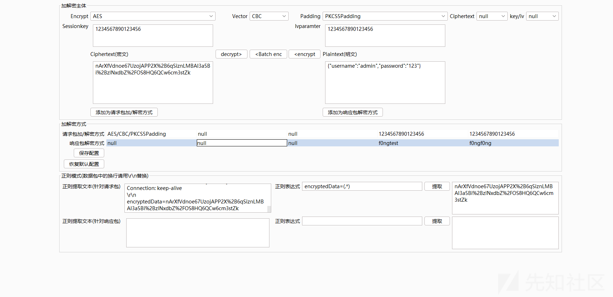  
至少测试能够解密成功  
我们随便抓包试一试  
原始请求  
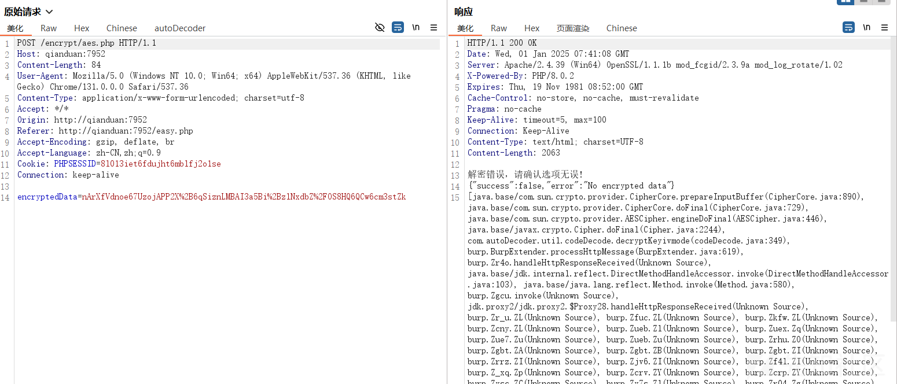  
然后解密后  
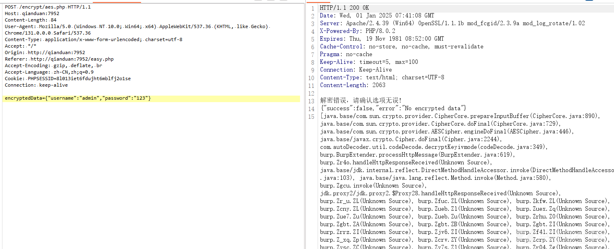  
响应包我们先不需要管，可以看到是可以解密成功的，我们直接发生爆破模块开始爆破

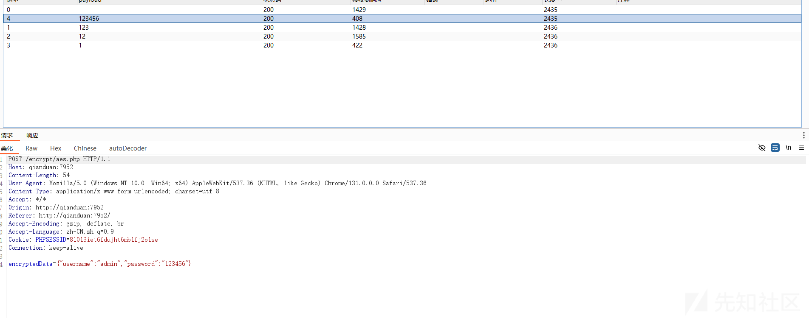  
因为密码就是 123456，这里节约时间字典随便加几个就 ok  
然后我们看看 123456响应  
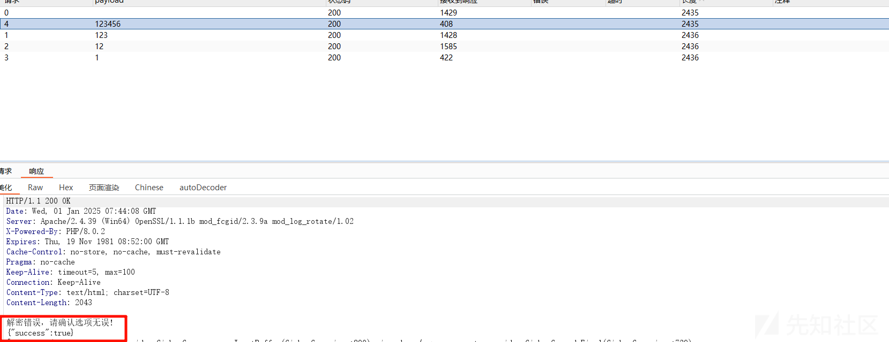  
发现成功

## AES 服务端获取 Key

这次不再是固定的 key 了

然后还是一样的步骤，查查前端的 js 代码

```
async function fetchAndSendDataAes(url) {
    let aesKey, aesIv;

    try {
        const response = await fetch("encrypt/server_generate_key.php");
        const data = await response.json();
        aesKey = CryptoJS.enc.Base64.parse(data.aes_key);
        aesIv = CryptoJS.enc.Base64.parse(data.aes_iv);
    } catch (error) {
        console.error("获取 AES 密钥失败:", error);
        alert("无法获取 AES 密钥，请刷新页面重试");
        return;
    }

    const formData = {
        username: document.getElementById("username")
            .value,
        password: document.getElementById("password")
            .value
    };
    const jsonData = JSON.stringify(formData);

    const encryptedData = CryptoJS.AES.encrypt(jsonData, aesKey, {
            iv: aesIv,
            mode: CryptoJS.mode.CBC,
            padding: CryptoJS.pad.Pkcs7
        })
        .toString();

    fetch(url, {
            method: "POST",
            headers: {
                "Content-Type": "application/json"
            },
            body: JSON.stringify({
                encryptedData: encryptedData
            })
        })
        .then(response => response.json())
        .then(data => {
            if (data.success) {
                alert("登录成功");
                window.location.href = "success.html";
            } else {
                alert("用户名或密码错误");
            }
        })
        .catch(error => console.error("请求错误:", error));

    closeModal();
}

```

关键点在于我们的 key 是从 fetch("encrypt/server\_generate\_key.php")获取的

但是问题出现在从服务端获取的 key 和 iv 是不变的

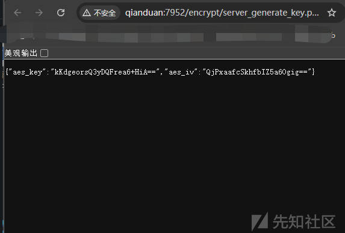

然后抓个包看看格式

```
POST /encrypt/aesserver.php HTTP/1.1
Host: qianduan:7952
Content-Length: 84
User-Agent: Mozilla/5.0 (Windows NT 10.0; Win64; x64) AppleWebKit/537.36 (KHTML, like Gecko) Chrome/131.0.0.0 Safari/537.36
Content-Type: application/json
Accept: */*
Origin: http://qianduan:7952
Referer: http://qianduan:7952/easy.php
Accept-Encoding: gzip, deflate, br
Accept-Language: zh-CN,zh;q=0.9
Cookie: PHPSESSID=8l013iet6fdujht6mblfj2o1se
Connection: keep-alive

{"encryptedData":"/TU3Mh8yKqNBcTcVGqXTSwSz0T0/lmSAzTbJg7HWOSBsOhH4mVxgnoP6x6oUd5Mu"}

```

首先还是配置我们的工具，正则匹配需要修改一下

```
"encryptedData":"(.*)"

```

得能够提取出来  
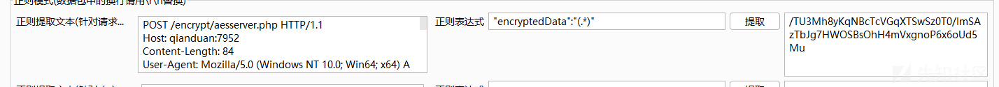

然后修改 key  
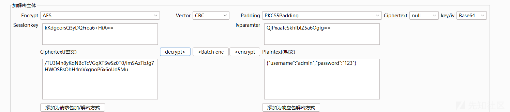

然后我们去重发器解密看看

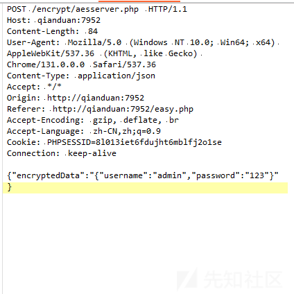  
成功解密，这里就不爆破了  
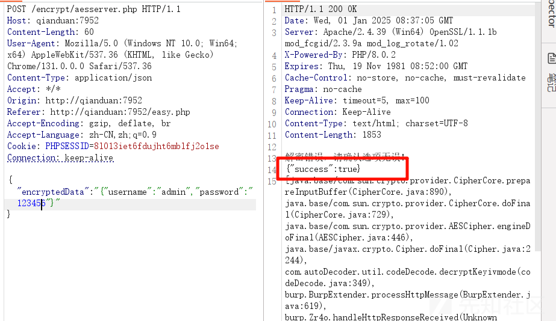

## RSA 加密

RSA 加密是一种非对称加密技术，它广泛用于数据加密和数字签名。RSA 加密的基本特点是：使用一对密钥——公钥（公开）和私钥（保密）

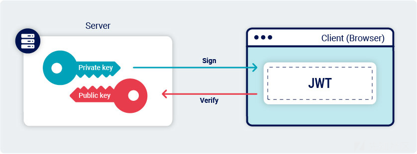

一样的我们先来看看前端的逻辑

```
function sendEncryptedDataRSA(url) {
    const publicKey = `
-----BEGIN PUBLIC KEY-----
MIGfMA0GCSqGSIb3DQEBAQUAA4GNADCBiQKBgQDRvA7giwinEkaTYllDYCkzujvi
NH+up0XAKXQot8RixKGpB7nr8AdidEvuo+wVCxZwDK3hlcRGrrqt0Gxqwc11btlM
DSj92Mr3xSaJcshZU8kfj325L8DRh9jpruphHBfh955ihvbednGAvOHOrz3Qy3Cb
ocDbsNeCwNpRxwjIdQIDAQAB
-----END PUBLIC KEY-----
  `;
    const username = document.getElementById("username").value;
    const password = document.getElementById("password").value;

    const dataPacket = {
        username: username,
        password: password
    };

    const dataString = JSON.stringify(dataPacket);

    const encryptor = new JSEncrypt();
    encryptor.setPublicKey(publicKey);

    const encryptedData = encryptor.encrypt(dataString);

    if (!encryptedData) {
        alert("加密失败，请检查公钥是否正确");
        return;
    }

    const formData = new URLSearchParams();
    formData.append('data', encryptedData);

    fetch(url, {
        method: "POST",
        headers: {
            "Content-Type": "application/x-www-form-urlencoded"
        },
        body: formData.toString()
    })
    .then(response => response.json())
    .then(data => {
        if (data.success) {
            alert("登录成功");
            window.location.href = "success.html";
        } else {
            alert(data.error || "用户名或密码错误");
        }
    })
    .catch(error => console.error("请求错误:", error));

    closeModal();
}

```

可以看到是给出了公钥的，如果我们有公钥那只能加密，是不能解密的

但是我们得知道明文的形式

问问 GPT  
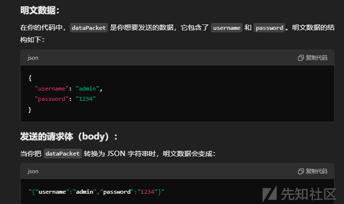  
可能是这样的，如果会 js 调试的话还可以调试

  
大概也就是这样

我们发生的是加密数据，所以解密我们目前并不需要关心，配置  
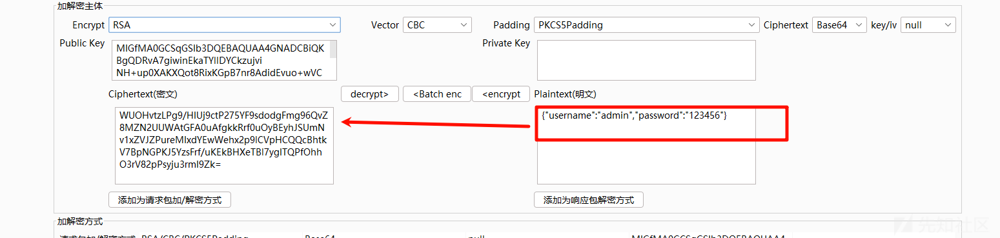  
然后我们把加密后的数据发生过去  
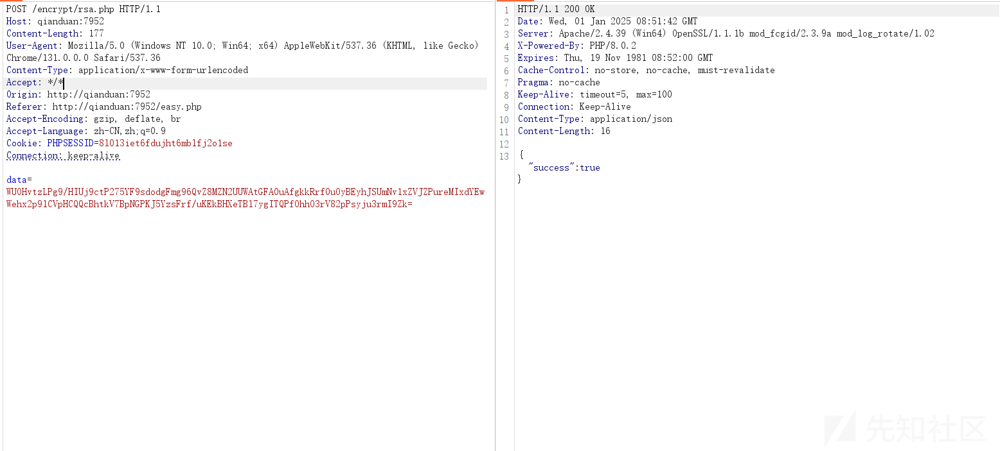  
成功  
然后发送明文数据实现自动的加密  
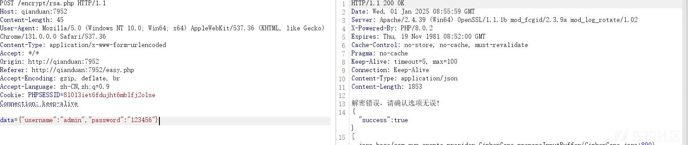

参考<https://github.com/f0ng/autoDecoder/blob/main/FAQ.md>  
<https://github.com/SwagXz/encrypt-labs>
