# shiro codeql分析理解（附带完整ql代码）-先知社区

> **来源**: https://xz.aliyun.com/news/16420  
> **文章ID**: 16420

---

参考使用SummerSec师傅的项目数据库和文档进行学习：<https://github.com/SummerSec/learning-codeql>

codeql代码审计最重要的是去寻找sink、source  
所以一开始我们先寻找source,也就是入口点。

在反序列化漏洞中入口点也就是反序列化入口------实现了Serializable的类。

```
import java
from Class cls

// 检查 cls 是否是 TypeSerializable 的子类，并且是从源代码中定义的
where cls.getASupertype() instanceof TypeSerializable and cls.fromSource()

// 选择符合条件的类
select cls

```

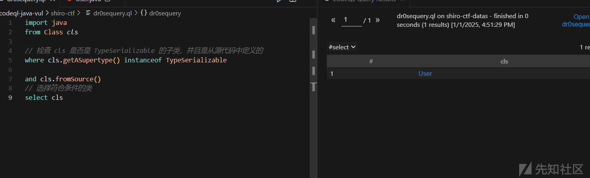  
看到user类。

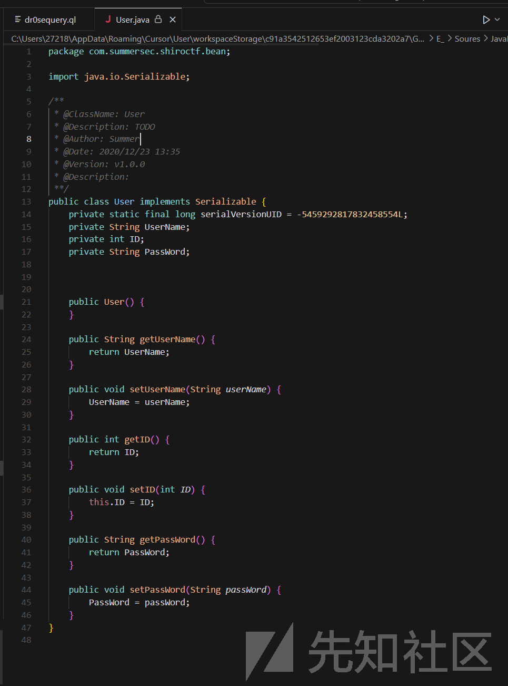  
接下来就是寻找这个类的实现。

进行ql规则的编写。

```
import java

/* 找到实例化User的类 */
class FindUser extends RefType {
    FindUser() {
        // 检查当前类是否具有指定的包名和类名
        this.hasQualifiedName("com.summersec.shiroctf.bean", "User")
    }
}

// 当你使用 from ClassInstanceExpr clie 时，CodeQL 会遍历代码库中的所有类实例化表达式，并将每一个实例化表达式赋值给 clie 变量。
from ClassInstanceExpr clie
where 
    // 检查 clie 的类型是否是 FindUser 的实例
    clie.getType() instanceof FindUser
select clie

```

使用RefType中的方法hasQualifiedName来在代码中寻找User的实现实例。  
这里的instanceof是判断是否为一个类的实例，也就是在where语句中的逻辑是核心逻辑，匹配所有的实例化对象是不是FindUser()返回的User的实例化  
而from ClassInstanceExpr clie则是获取所有的实例化对象。  
FindUser() 构造函数的作用是验证当前类是否是 User 类的引用。如果是，它将被视为 FindUser 的实例。

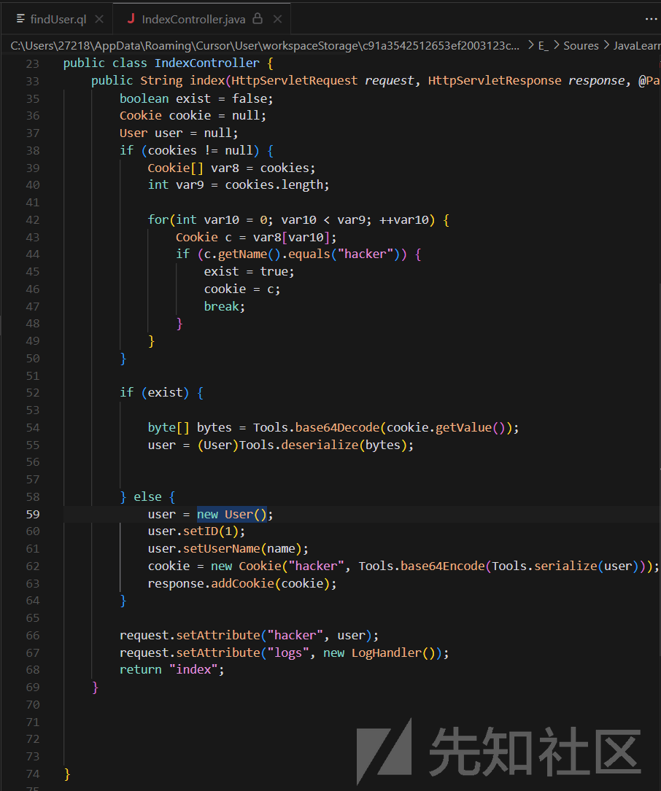  
这样我们就查询到了在IndexController类中有一个User的实例user。  
对这段代码逻辑进行简单分析。

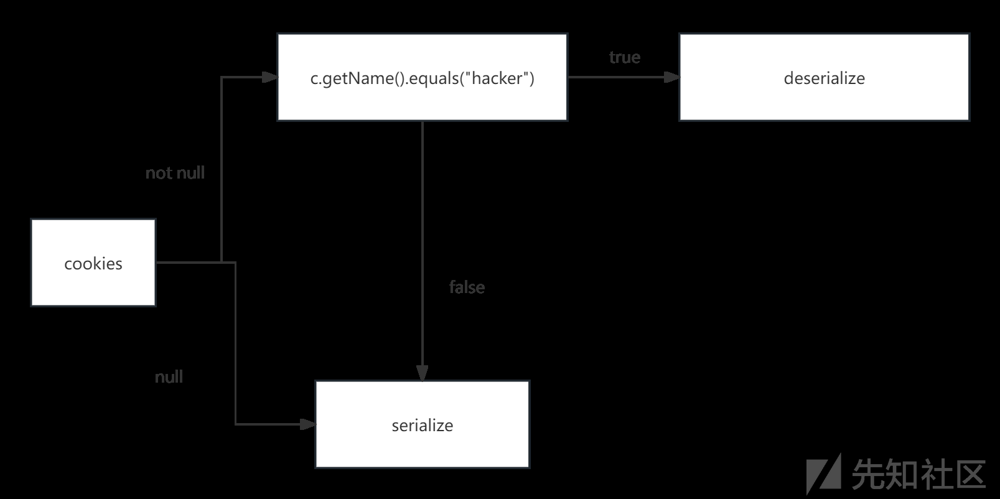  
我们接下来最好是可以观察一下几个重点函数的源码:  
base64Encode()  
serialize()  
deserialize()

编写一个查询在com.summersec.shiroctf.Tools包下查询这三个方法的ql规则

```
import java

from Method m
where m.getName() = "deserialize" 
or m.getName() = "serialize"
or m.getName()="base64Encode"
//匹配包名，确保方法所在包正确
and m.getDeclaringType().getPackage().getName() = "com.summersec.shiroctf.Tools"
select m

```

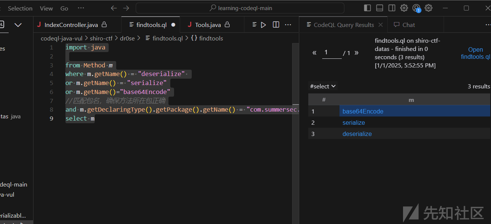

查看源码

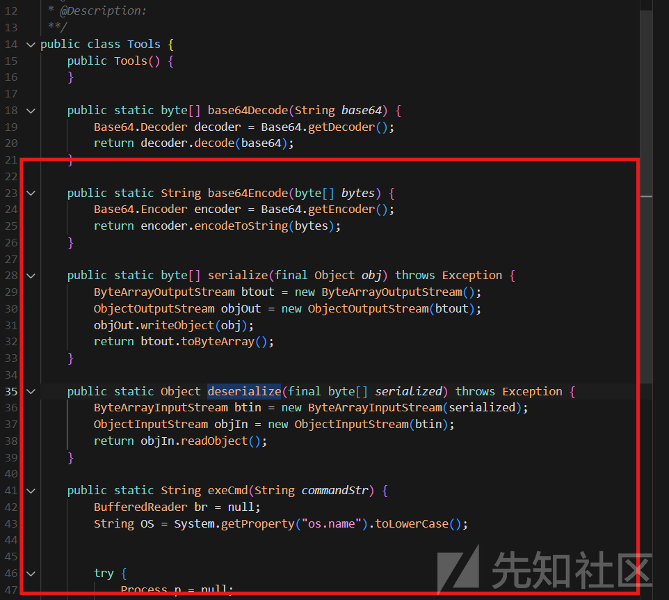

在下面看到了一个可以命令执行的方法，这是链子的尾部。  
寻找哪里调用了这个方法。

```
import java

/* 查找调用 exeCmd 方法的所有位置 */
from MethodAccess call
where call.getMethod().hasName("exeCmd")
select call, "调用 exeCmd 方法"

```

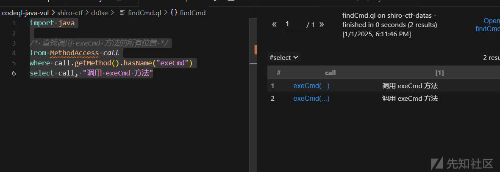  
查询到了两处。进行查看。

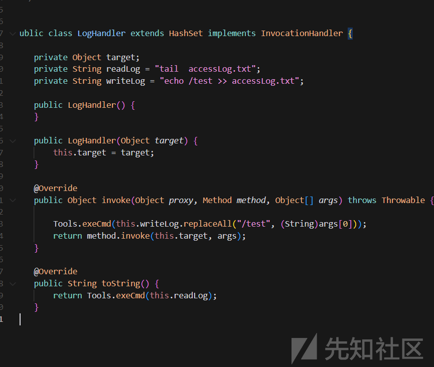  
在LogHandler类中查询到了两处对于exeCmd方法的调用

## sink&source

理论上，我们codeql对此的分析大体思路是有了  
在我们查询user的实例化的时候，发现了IndexController类中可以设一个source给request参数。他的cookie经过一系列处理后，理想的状态可以到达deserialize方法。进行反序列化，如果我们吧exeCmd方法放到反序列化中，就可以完成利用。

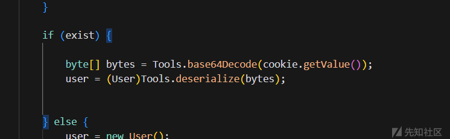  
这个传入deserialize中的bytes，就可以作为我们的sink。

### sink

```
predicate deser(Expr arg){
    exists(MethodAccess des |
    des.getMethod().hasName("deserialize") // 检查方法名是否为 "deserialize"
    and
    arg = des.getArgument(0) // 确保参数是反序列化方法的第一个参数
    )
}

```

## 补充RemoteFlowSource

在ql中存在RemoteFlowSource，是远端输入，可以覆盖不受信任的所有远端输入。这样我们的source就不需要自己处理。  
在 CodeQL 中，开发者可以定义多个源类型，并结合使用它们来创建更全面的安全分析。例如，可以同时使用 RemoteFlowSource 和 LocalFlowSource 来捕获所有可能的输入点。

### 重写source

```
override predicate isSource(DataFlow::Node source) {
        source instanceof RemoteFlowSource // 源节点是远程流源
    }

```

## 完整ql规则

```
/**
 * @name Unsafe shiro deserialization
 * @kind path-problem
 * @id java/unsafe-shiro-deserialization
 */

// 导入必要的库
import java
import semmle.code.java.dataflow.FlowSources
import DataFlow::PathGraph

// 定义一个谓词，用于检查表达式是否为反序列化方法的参数，找到反序列化
predicate deser(Expr arg){
    exists(MethodAccess des |
    des.getMethod().hasName("deserialize") // 检查方法名是否为 "deserialize"
    and
    arg = des.getArgument(0) // 确保参数是反序列化方法的第一个参数
    )
}

// 定义一个类，用于配置不安全的反序列化检测
class ShiroUnsafeDeserializationConfig extends TaintTracking::Configuration {
    ShiroUnsafeDeserializationConfig() { 
        this = "StrutsUnsafeDeserializationConfig" // 设置配置名称
    }

    // 重写谓词，定义数据流的源
    override predicate isSource(DataFlow::Node source) {
        source instanceof RemoteFlowSource // 源节点是远程流源
    }

    // 重写谓词，定义数据流的汇
    override predicate isSink(DataFlow::Node sink) {
        exists(Expr arg|
            deser(arg) and // 检查是否为反序列化参数
            sink.asExpr() = arg /* bytes */ // 确保汇节点是反序列化的参数
        )
    }
}

// 从配置中获取流路径
from ShiroUnsafeDeserializationConfig config, DataFlow::PathNode source, DataFlow::PathNode sink
where config.hasFlowPath(source, sink) // 检查源和汇之间是否存在流路径
select sink.getNode(), source, sink, "Unsafe shiro deserialization" ,source.getNode(), "this user input"

```

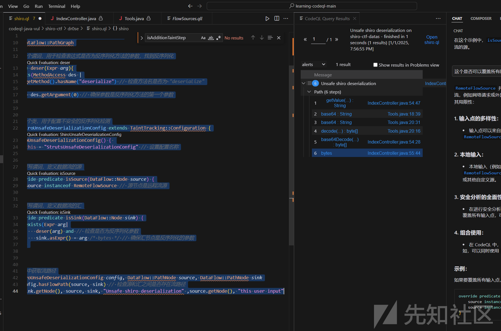

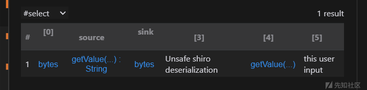  
查询得到完整数据流
