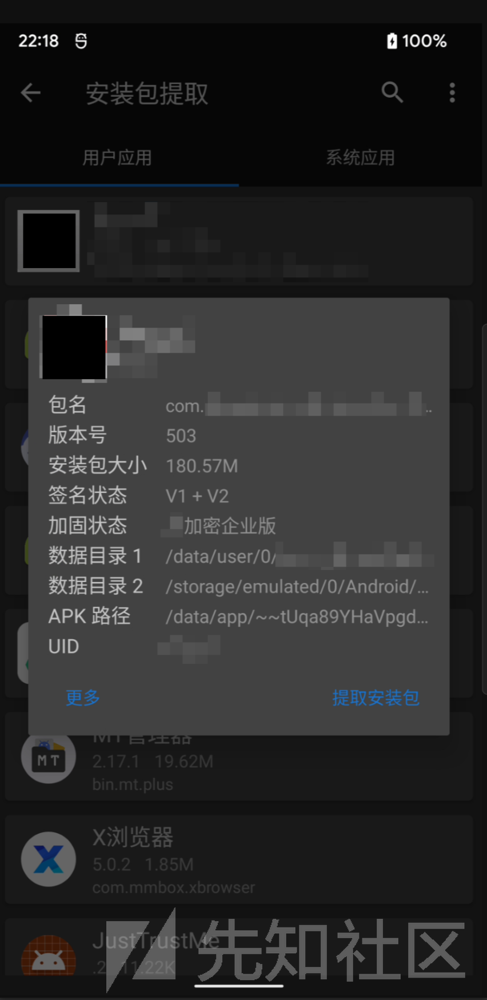
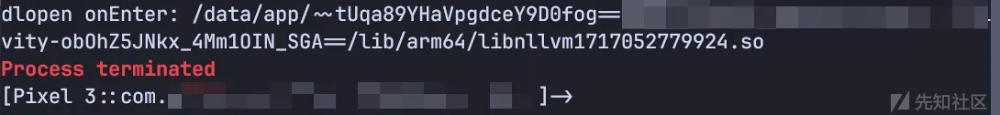
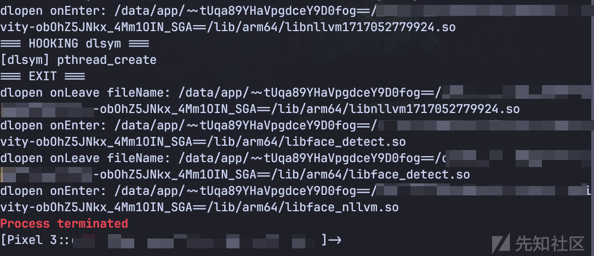
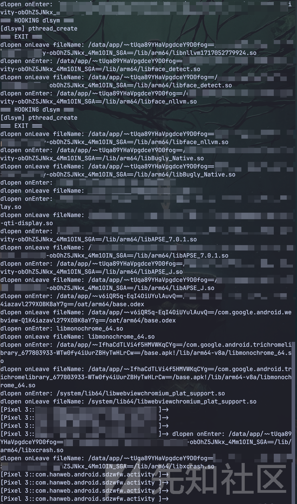
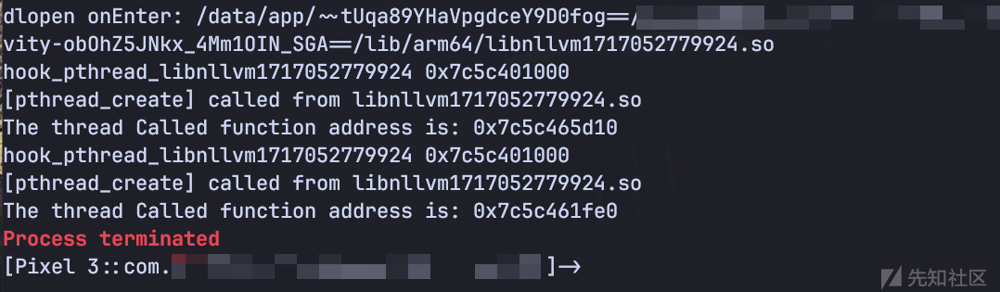
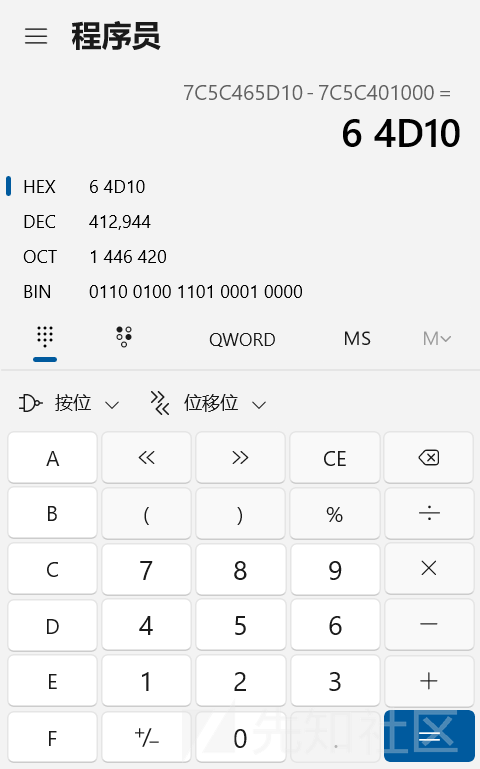
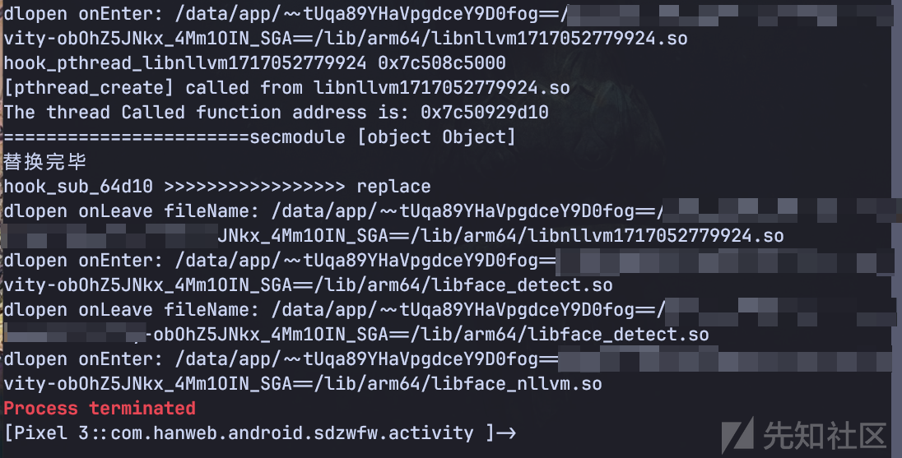
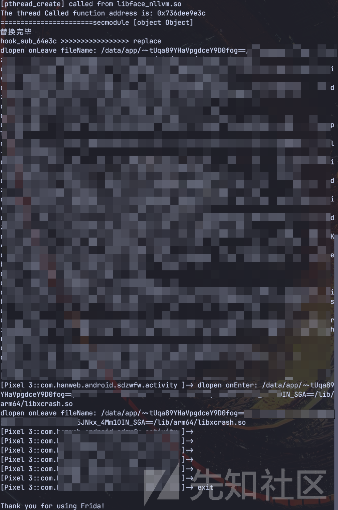

# 绕过App某加密企业版加固Frida检测-先知社区

> **来源**: https://xz.aliyun.com/news/16425  
> **文章ID**: 16425

---

## 0x00：测试环境

设备：Pixel 3

Android版本：12

面具版本：Magisk Delta 26.4-kitsune(26400)

## 0x01：加壳应用

某App 最新版本（24年9月最新版本）

某加密企业版



## 0x02：分析

App的root检测一般在Java代码层面检测，主要可能检测一些路径如

```
/system/xbin/ 
/system/bin/ 
/system/sbin/ 
/sbin/ 
/vendor/bin/ 
/su/bin/

```

针对root的检测其实是很好绕过的，如Delta版本的面具就可以通过设置App访问root权限白名单从而绕过root检测，也可以使用Shamiko插件进行绕过  
而Frida检测一般都是在Native层（也就是so层）实现的，首先需要定位检测进程是在哪个so文件中实现的，这里我们就需要先hook Android的动态链接库加载函数，观察它加载到哪个so的时候程序会崩溃

hook`android_dlopen_ext`>查看so文件的加载流程

```
var dlopen_interceptor = hook_dlopen();

function hook_dlopen() {
    Interceptor.attach(Module.findExportByName(null, "android_dlopen_ext"),
        {
            onEnter: function (args) {
                this.fileName = args[0].readCString()
                console.log(`dlopen onEnter: ${this.fileName}`)
            }, onLeave: function(retval){
                console.log(`dlopen onLeave fileName: ${this.fileName}`)
            }
        }
    );
}

```

打印结果如下：

```
____
    / _  |   Frida 16.5.6 - A world-class dynamic instrumentation toolkit
   | (_| |
    > _  |   Commands:
   /_/ |_|       help      -> Displays the help system
   . . . .       object?   -> Display information about 'object'
   . . . .       exit/quit -> Exit
   . . . .
   . . . .   More info at https://frida.re/docs/home/
   . . . .
   . . . .   Connected to Pixel 3 (id=8AJX0TXU2)
Spawned `com.xxxapp`. Resuming main thread!
[Pixel 3::com.xxxapp ]-> dlopen onEnter: /system/framework/oat/arm64/org.apache.http.legacy.odex
dlopen onLeave fileName: /system/framework/oat/arm64/org.apache.http.legacy.odex
dlopen onEnter: /data/app/~~tUqa89YHaVpgdceY9D0fog==/com.xxxapp-obOhZ5JNkx_4Mm1OIN_SGA==/oat/arm64/base.odex
dlopen onLeave fileName: /data/app/~~tUqa89YHaVpgdceY9D0fog==/com.xxxapp-obOhZ5JNkx_4Mm1OIN_SGA==/oat/arm64/base.odex
dlopen onEnter: /data/user/0/com.xxxapp/files/libexec.so
dlopen onLeave fileName: /data/user/0/com.xxxapp/files/libexec.so
dlopen onEnter: /data/user/0/com.xxxapp/files/libexecmain.so
dlopen onLeave fileName: /data/user/0/com.xxxapp/files/libexecmain.so
dlopen onEnter: /data/app/~~tUqa89YHaVpgdceY9D0fog==/com.xxxapp-obOhZ5JNkx_4Mm1OIN_SGA==/lib/arm64/libhtsfx.so
dlopen onLeave fileName: /data/app/~~tUqa89YHaVpgdceY9D0fog==/com.xxxapp-obOhZ5JNkx_4Mm1OIN_SGA==/lib/arm64/libhtsfx.so
（省略一部分）
dlopen onEnter: /data/app/~~tUqa89YHaVpgdceY9D0fog==/com.xxxapp-obOhZ5JNkx_4Mm1OIN_SGA==/lib/arm64/libmpaascpu.so
dlopen onLeave fileName: /data/app/~~tUqa89YHaVpgdceY9D0fog==/com.xxxapp-obOhZ5JNkx_4Mm1OIN_SGA==/lib/arm64/libmpaascpu.so
dlopen onEnter: /data/app/~~tUqa89YHaVpgdceY9D0fog==/com.xxxapp-obOhZ5JNkx_4Mm1OIN_SGA==/lib/arm64/libnllvm1717052779924.so
Process terminated
[Pixel 3::com.xxxapp ]->

```



多次发现hook后发现最后都是在加载到/lib/arm64/libnllvm1717052779924.so后崩溃  
初步推测libnllvm1717052779924.so中创建了Frida检测进程，尝试直接hook创建进程的函数`pthread_create`

```
function hook_pthred_create(){
    var interceptor = Interceptor.attach(Module.findExportByName(null, "pthread_create"),
        {
            onEnter: function (args) {
                var module = Process.findModuleByAddress(ptr(this.returnAddress))
                if (module != null) {
                    console.log("[pthread_create] called from", module.name)
                }
                else {
                    console.log("[pthread_create] called from", ptr(this.returnAddress))
                }
            },
        }
    )
}

```

发现程序要么进入卡死白屏状态，要么就不打印pthread\_create相关信息后强制退出（这里出了一个小bug，这个方法留给后面0x03补充分析进行继续）  
于是尝试hook dlsym函数看看它有没有加载`pthread_create`函数，在加载libnllvm1717052779924.so之前hook dlsym函数：

```
dlsym函数简单介绍：dlsym()函数是动态链接库（Dynamic Link Library，简称DLL）函数之一，用于在运行时从共享库中查找符号（如函数或变量）的地址。
dlsym()函数的作用是在已经加载的动态链接库中查找指定符号的地址。具体来说，它接受两个参数：

1. 句柄（handle）：由dlopen()函数返回的句柄，表示已经加载的共享库。
2. 符号名（symbol name）：要查找的符号的名称，通常是一个函数名或变量名。函数返回一个指向该符号的指针，如果找不到该符号，则返回NULL
```

```
function hook_dlsym() {
    console.log("=== HOOKING dlsym ===")
    var interceptor = Interceptor.attach(Module.findExportByName(null, "dlsym"),
        {
            onEnter: function (args) {
                const name = ptr(args[1]).readCString()
                console.log("[dlsym]", name)
                if (this.fileName.indexOf("libnllvm1717052779924.so") >= 0) {
                    hook_dlsym()
                }
            },
            onLeave: function(retval) {
                console.log("=== EXIT ===")
            }
        }
    )
    return interceptor
}

```

打印结果如下：

```
dlopen onEnter: /system/framework/oat/arm64/org.apache.http.legacy.odex
dlopen onLeave fileName: /system/framework/oat/arm64/org.apache.http.legacy.odex
dlopen onEnter: /data/app/~~tUqa89YHaVpgdceY9D0fog==/com.xxxapp-obOhZ5JNkx_4Mm1OIN_SGA==/oat/arm64/base.odex
dlopen onLeave fileName: /data/app/~~tUqa89YHaVpgdceY9D0fog==/com.xxxapp-obOhZ5JNkx_4Mm1OIN_SGA==/oat/arm64/base.odex
dlopen onEnter: /data/user/0/com.xxxapp/files/libexec.so
dlopen onLeave fileName: /data/user/0/com.xxxapp/files/libexec.so
dlopen onEnter: /data/user/0/com.xxxapp/files/libexecmain.so
dlopen onLeave fileName: /data/user/0/com.xxxapp/files/libexecmain.so
dlopen onEnter: /data/app/~~tUqa89YHaVpgdceY9D0fog==/com.xxxapp-obOhZ5JNkx_4Mm1OIN_SGA==/lib/arm64/libhtsfx.so
dlopen onLeave fileName: /data/app/~~tUqa89YHaVpgdceY9D0fog==/com.xxxapp-obOhZ5JNkx_4Mm1OIN_SGA==/lib/arm64/libhtsfx.so
dlopen onEnter: /data/user/0/com.xxxapp/.tcache/libs/libhts.so
dlopen onLeave fileName: /data/user/0/com.xxxapp/.tcache/libs/libhts.so
dlopen onEnter: /data/user/0/com.xxxapp/files/libijmDataEncryption.so
dlopen onLeave fileName: /data/user/0/com.xxxapp/files/libijmDataEncryption.so
dlopen onEnter: /data/app/~~tUqa89YHaVpgdceY9D0fog==/com.xxxapp-obOhZ5JNkx_4Mm1OIN_SGA==/lib/arm64/libmmkv.so
dlopen onLeave fileName: /data/app/~~tUqa89YHaVpgdceY9D0fog==/com.xxxapp-obOhZ5JNkx_4Mm1OIN_SGA==/lib/arm64/libmmkv.so
dlopen onEnter: /data/app/~~tUqa89YHaVpgdceY9D0fog==/com.xxxapp-obOhZ5JNkx_4Mm1OIN_SGA==/lib/arm64/libumeng-spy.so
dlopen onLeave fileName: /data/app/~~tUqa89YHaVpgdceY9D0fog==/com.xxxapp-obOhZ5JNkx_4Mm1OIN_SGA==/lib/arm64/libumeng-spy.so
dlopen onEnter: /data/app/~~tUqa89YHaVpgdceY9D0fog==/com.xxxapp-obOhZ5JNkx_4Mm1OIN_SGA==/lib/arm64/libc++_shared.so
dlopen onLeave fileName: /data/app/~~tUqa89YHaVpgdceY9D0fog==/com.xxxapp-obOhZ5JNkx_4Mm1OIN_SGA==/lib/arm64/libc++_shared.so
dlopen onEnter: /data/app/~~tUqa89YHaVpgdceY9D0fog==/com.xxxapp-obOhZ5JNkx_4Mm1OIN_SGA==/lib/arm64/libweexcore.so
dlopen onLeave fileName: /data/app/~~tUqa89YHaVpgdceY9D0fog==/com.xxxapp-obOhZ5JNkx_4Mm1OIN_SGA==/lib/arm64/libweexcore.so
dlopen onEnter: /data/app/~~tUqa89YHaVpgdceY9D0fog==/com.xxxapp-obOhZ5JNkx_4Mm1OIN_SGA==/lib/arm64/libmpaascpu.so
dlopen onLeave fileName: /data/app/~~tUqa89YHaVpgdceY9D0fog==/com.xxxapp-obOhZ5JNkx_4Mm1OIN_SGA==/lib/arm64/libmpaascpu.so
dlopen onEnter: /data/app/~~tUqa89YHaVpgdceY9D0fog==/com.xxxapp-obOhZ5JNkx_4Mm1OIN_SGA==/lib/arm64/libnllvm1717052779924.so
=== HOOKING dlsym ===
[dlsym] pthread_create
=== EXIT ===
[dlsym] pthread_create
=== EXIT ===
```


可以发现dlsym函数加载了两次pthread\_create，可以认为这两个进程（或某一个进程）是和Frida的检测有关的，于是为了绕过检测，我们可以让它加载一个虚假的pthread\_create函数，得到一个空结果绕过检测  
创建一个虚假的pthread\_create函数：

```
function create_fake_pthread_create() {
    const fake_pthread_create = Memory.alloc(4096)
    Memory.protect(fake_pthread_create, 4096, "rwx")
    Memory.patchCode(fake_pthread_create, 4096, code => {
        const cw = new Arm64Writer(code, { pc: ptr(fake_pthread_create) })
        cw.putRet()
    })
    return fake_pthread_create
}
```

我们现在有了虚假的pthread\_create函数，现在就可以让假函数去替代真的pthread\_create，就可以绕过开发者创建的专门用于检测Frida的进程：  
因为从上文可以看到它是创建了两个关于pthread\_create的，我们替换第一个pthread\_create进程，并设置替换完后就不在拦截此dlsym函数了

```
var dlopen_interceptor = hook_dlopen();
var fake_pthread_create = create_fake_pthread_create()


function create_fake_pthread_create() {
    const fake_pthread_create = Memory.alloc(4096)
    Memory.protect(fake_pthread_create, 4096, "rwx")
    Memory.patchCode(fake_pthread_create, 4096, code => {
        const cw = new Arm64Writer(code, { pc: ptr(fake_pthread_create) })
        cw.putRet()
    })
    return fake_pthread_create
}

function hook_dlsym() {
    console.log("=== HOOKING dlsym ===")
    var interceptor = Interceptor.attach(Module.findExportByName(null, "dlsym"),
        {
            onEnter: function (args) {
                const name = ptr(args[1]).readCString()
                console.log("[dlsym]", name)
            },
            onLeave: function(retval) {
                retval.replace(fake_pthread_create)
                console.log("=== EXIT ===")
                interceptor.detach()
            }
        }
    )
    return interceptor
}

function hook_dlopen() {
    Interceptor.attach(Module.findExportByName(null, "android_dlopen_ext"),
        {
            onEnter: function (args) {
                this.fileName = args[0].readCString()
                console.log(`dlopen onEnter: ${this.fileName}`)
                if (this.fileName.indexOf("libnllvm1717052779924.so") >= 0) {
                    hook_dlsym()
                }
            }, onLeave: function(retval){
                console.log(`dlopen onLeave fileName: ${this.fileName}`)
            }
        }
    );
}
```

打印结果如下：

```
dlopen onEnter: /data/app/~~tUqa89YHaVpgdceY9D0fog==/com.xxxapp-obOhZ5JNkx_4Mm1OIN_SGA==/lib/arm64/libmpaascpu.so
dlopen onLeave fileName: /data/app/~~tUqa89YHaVpgdceY9D0fog==/com.xxxapp-obOhZ5JNkx_4Mm1OIN_SGA==/lib/arm64/libmpaascpu.so
dlopen onEnter: /data/app/~~tUqa89YHaVpgdceY9D0fog==/com.xxxapp-obOhZ5JNkx_4Mm1OIN_SGA==/lib/arm64/libnllvm1717052779924.so
=== HOOKING dlsym ===
[dlsym] pthread_create
=== EXIT ===
dlopen onLeave fileName: /data/app/~~tUqa89YHaVpgdceY9D0fog==/com.xxxapp-obOhZ5JNkx_4Mm1OIN_SGA==/lib/arm64/libnllvm1717052779924.so
dlopen onEnter: /data/app/~~tUqa89YHaVpgdceY9D0fog==/com.xxxapp-obOhZ5JNkx_4Mm1OIN_SGA==/lib/arm64/libface_detect.so
dlopen onLeave fileName: /data/app/~~tUqa89YHaVpgdceY9D0fog==/com.xxxapp-obOhZ5JNkx_4Mm1OIN_SGA==/lib/arm64/libface_detect.so
dlopen onEnter: /data/app/~~tUqa89YHaVpgdceY9D0fog==/com.xxxapp-obOhZ5JNkx_4Mm1OIN_SGA==/lib/arm64/libface_nllvm.so
Process terminated
[Pixel 3::com.xxxapp ]->
```



可以看到绕过了libnllvm1717052779924.so，又卡在了libface\_nllvm.so  
可以使用同样方法把libface\_nllvm.so也绕过去，修改代码如下：

```
var dlopen_interceptor = hook_dlopen();
var fake_pthread_create = create_fake_pthread_create()

function create_fake_pthread_create() {
    const fake_pthread_create = Memory.alloc(4096)
    Memory.protect(fake_pthread_create, 4096, "rwx")
    Memory.patchCode(fake_pthread_create, 4096, code => {
        const cw = new Arm64Writer(code, { pc: ptr(fake_pthread_create) })
        cw.putRet()
    })
    return fake_pthread_create
}

function hook_dlsym() {
    console.log("=== HOOKING dlsym ===")
    var interceptor = Interceptor.attach(Module.findExportByName(null, "dlsym"),
        {
            onEnter: function (args) {
                const name = ptr(args[1]).readCString()
                console.log("[dlsym]", name)
            },
            onLeave: function(retval) {
                retval.replace(fake_pthread_create)
                console.log("=== EXIT ===")
                interceptor.detach()
            }
        }
    )
    return interceptor
}

function hook_dlopen() {
    Interceptor.attach(Module.findExportByName(null, "android_dlopen_ext"),
        {
            onEnter: function (args) {
                this.fileName = args[0].readCString()
                console.log(`dlopen onEnter: ${this.fileName}`)
                if (this.fileName.indexOf("libnllvm1717052779924.so") >= 0|| this.fileName.indexOf("libface_nllvm.so") >= 0) {
                    hook_dlsym()
                }
            }, onLeave: function(retval){
                console.log(`dlopen onLeave fileName: ${this.fileName}`)
            }
        }
    );
}
```

成功绕过检测



## 0x03：补充分析（pthread\_create）

前边提到直接对`pthread_create`函数进行hook时，会出现白屏或者死机，经过我多次尝试，发现会有偶尔几次不死机的，鉴于这个情况我就尝试打印pthread\_create函数和so文件的地址来计算它的偏移量  
代码如下：

```
var dlopen_interceptor = hook_dlopen();

function hook_pthread_libnllvm1717052779924(){
    var interceptor = Interceptor.attach(Module.findExportByName(null, "pthread_create"),
        {
            onEnter: function (args) {
                var module = Process.findModuleByAddress(ptr(this.returnAddress))
                if (module != null) {
                    console.log("hook_pthread_libnllvm1717052779924 "+Process.findModuleByName("libnllvm1717052779924.so").base)
                    console.log("[pthread_create] called from", module.name)
                    let func_addr = args[2]
                    console.log(`The thread Called function address is: ${func_addr}`)
                }
                else {
                    console.log("[pthread_create] called from", ptr(this.returnAddress))
                }
            },
        }
    )
}

function hook_dlopen() {
    Interceptor.attach(Module.findExportByName(null, "android_dlopen_ext"),
        {
            onEnter: function (args) {
                this.fileName = args[0].readCString()
                console.log(`dlopen onEnter: ${this.fileName}`)
                if (this.fileName.indexOf("libnllvm1717052779924.so") >= 0) {
                    hook_pthread_libnllvm1717052779924();
                }
            }, onLeave: function(retval){
                console.log(`dlopen onLeave fileName: ${this.fileName}`)
            }
        }
    );
}
```

  
根据打印结果获取到so文件的基值和pthread\_create的地址  
经过计算得到偏移值



就可以直接对这个地址进行操作，把它的内容给替换掉，这样就绕过了检测  
代码如下：

```
var dlopen_interceptor = hook_dlopen();

function hook_64d10(){
    let secmodule = Process.findModuleByName("libnllvm1717052779924.so")
    console.log("=======================secmodule " + secmodule)
    Interceptor.replace(secmodule.base.add(0x64d10), new NativeCallback(function () {
        console.log(`hook_sub_64d10 >>>>>>>>>>>>>>>>> replace`)
        }, 'void', []));
    console.log("替换完毕")

}

function hook_pthread_libnllvm1717052779924(){
    var interceptor = Interceptor.attach(Module.findExportByName(null, "pthread_create"),
        {
            onEnter: function (args) {
                var module = Process.findModuleByAddress(ptr(this.returnAddress))
                if (module != null) {
                    console.log("hook_pthread_libnllvm1717052779924 "+Process.findModuleByName("libnllvm1717052779924.so").base)
                    console.log("[pthread_create] called from", module.name)
                    let func_addr = args[2]
                    console.log(`The thread Called function address is: ${func_addr}`)
                    hook_64d10()
                    interceptor.detach()
                }
                else {
                    console.log("[pthread_create] called from", ptr(this.returnAddress))
                }
            },
        }
    )
}

function hook_dlopen() {
    Interceptor.attach(Module.findExportByName(null, "android_dlopen_ext"),
        {
            onEnter: function (args) {
                this.fileName = args[0].readCString()
                console.log(`dlopen onEnter: ${this.fileName}`)
                if (this.fileName.indexOf("libnllvm1717052779924.so") >= 0) {
                    hook_pthread_libnllvm1717052779924();
                }
            }, onLeave: function(retval){
                console.log(`dlopen onLeave fileName: ${this.fileName}`)
            }
        }
    );
}
```

结果如下：



成功绕过了libnllvm1717052779924.so的检测，又到了libface\_nllvm.so的检测，使用同样的方法去绕过libface\_nllvm.so的检测，代码我这里就不上了，大家可以自己修改以下  
最后成功绕过，达到0x02同样绕过效果


