# JAVA代码审计-StudentManager-先知社区

> **来源**: https://xz.aliyun.com/news/16427  
> **文章ID**: 16427

---

# 一、环境搭建

```
StudentManager
idea IntelliJ IDEA 2022.2.3
jdk1.8 
mysql 5.7.26
apache-tomcat-9.0.68
```

搭建访问  
用idea打开文件夹

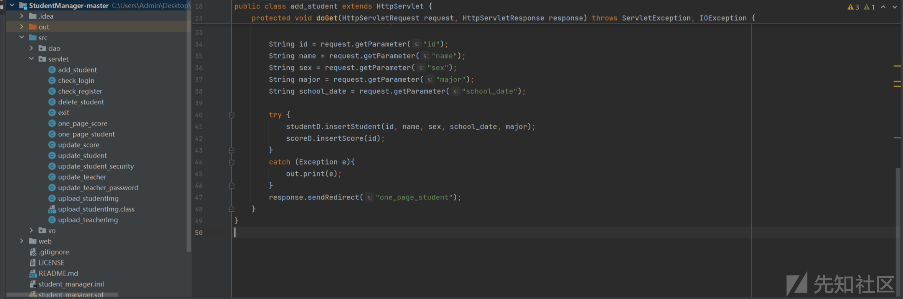

接着 点击项目设置 点击 模块 选择路径 选择 使用模块编译输入路径

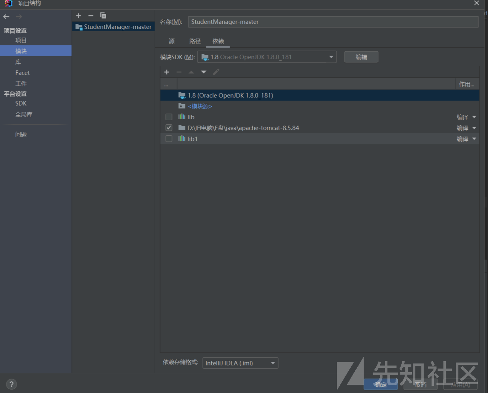

如果这里不设置的情况下编译的时候就会自动在项目生成out目录 启动项目的时候会失败的。  
创建数据库 导入mysql

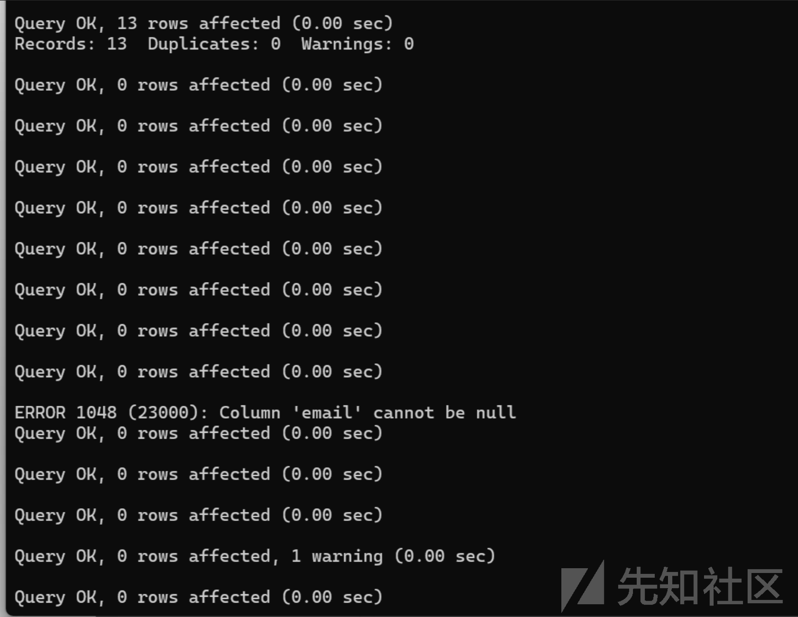

修改java文件夹里的mysql设置的信息 数据库 账号和密码

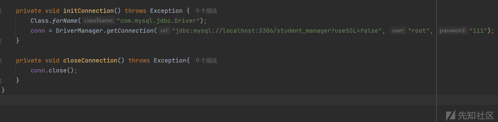

设置tomcat 这里设置端口是8081

选择部署 设置外部源为web目录


导入tomcat依赖 选择项目结构 项目设置 选择依赖

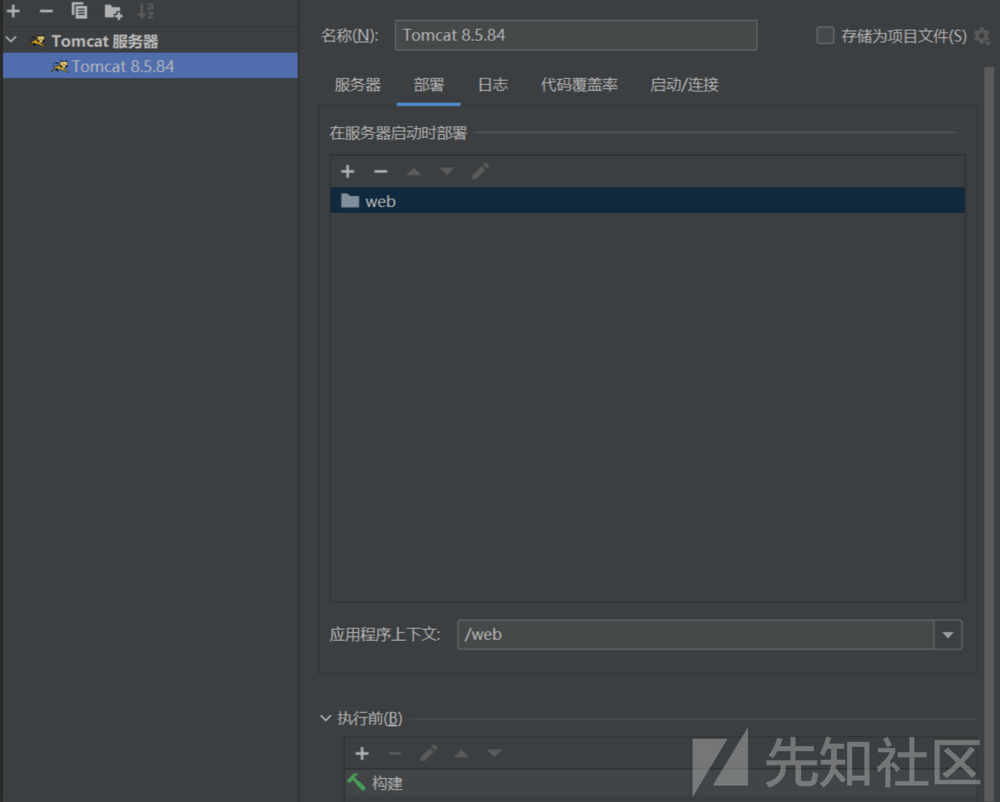

启动tomcat 访问8081端口

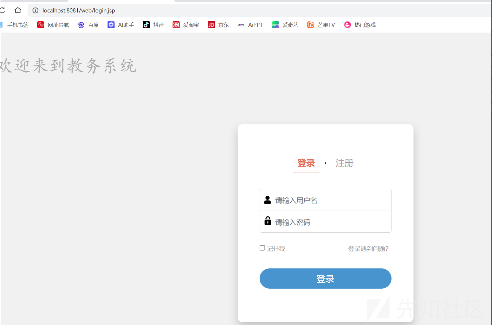

登录用户 20162430634 密码 0

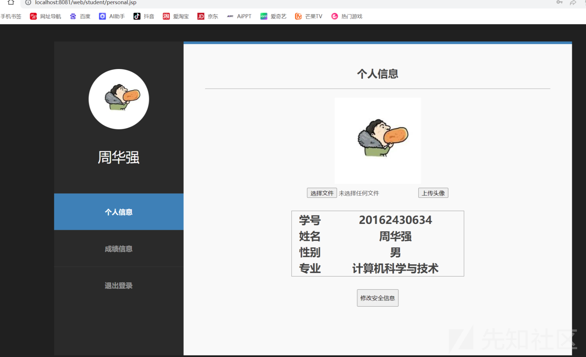

# 三、审计StudentManager

## 审计思路

找一个功能点 例如登录系统 跟踪观察整个登录过程。  
关注点 SQL是否采用预编译处理，输入的参数是否被过滤。 严重是否存在逻辑漏洞  
分析登录点

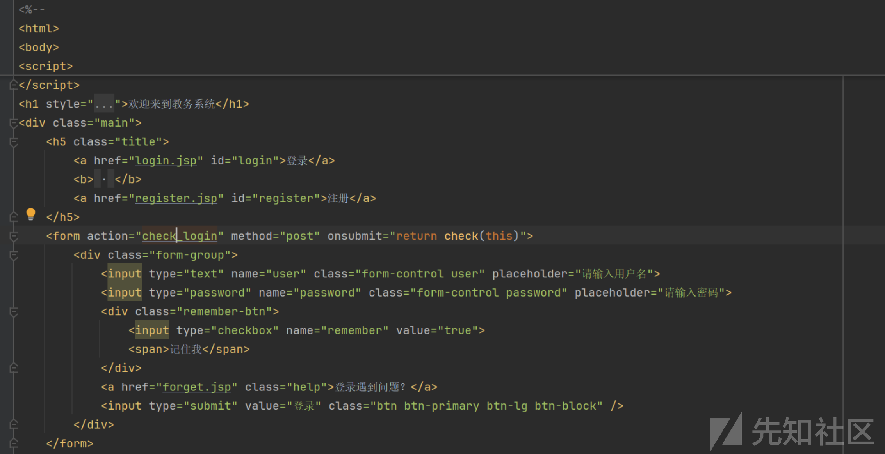

找到对应的servlet

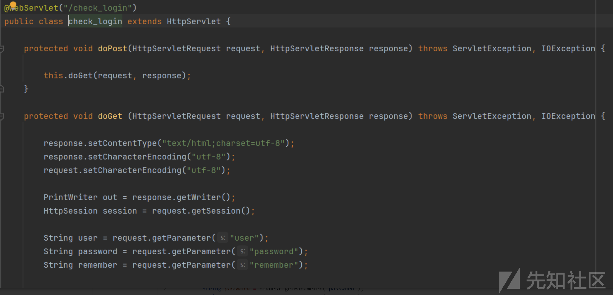

三个参数没有过滤

```
String user = request.getParameter("user");
        String password = request.getParameter("password");
        String remember = request.getParameter("remember");
```

判断身份这里都要调用数据库

```
try {
            // 判断用户身份
            teacher = teacherD.checkAccount(user, password);
            student = studentD.checkAccount(user, password);
        }
```

点击进入studentD checkAccount方法

```
package dao;

import vo.Student;

import java.sql.*;
import java.util.ArrayList;

public class StudentD {

    private Connection conn = null;

    public Student checkAccount(String user, String password) throws Exception {
        initConnection();
        Statement stat = conn.createStatement();
        String sql = "select * from student where id = '" + user + "' and password = '" + password + "'";
        ResultSet rs = stat.executeQuery(sql);
        Student stu = getStudent(rs);
        closeConnection();
        return stu;
    }
```

SQL 采用 字符串拼接 且没有进行过滤 所以存在注入。

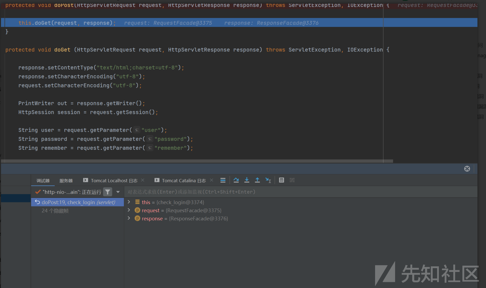

登录 输入 admin'or 1=1# 密码随便 即可任意用户登录。

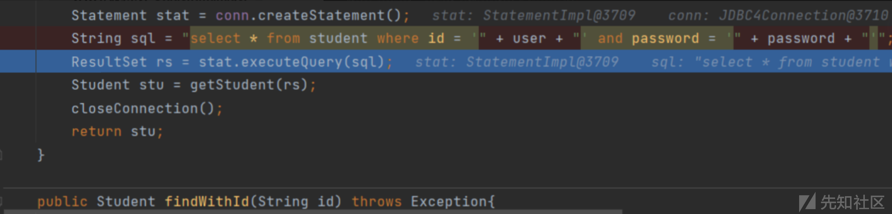

登录成功

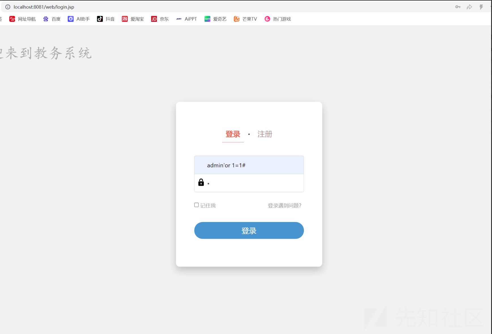

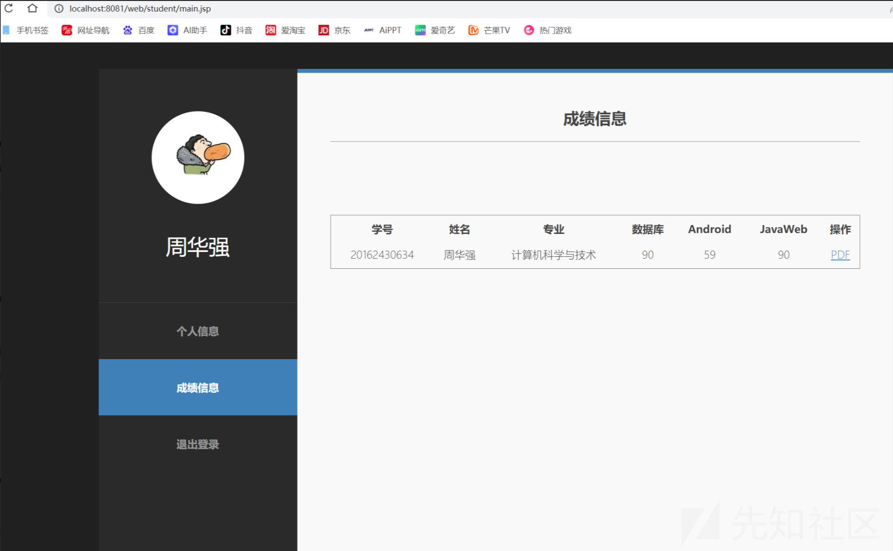

## SQL注入漏洞

TeacherD.java  
checkAccount 和 findWithId 均存在注入

```
public Teacher checkAccount(String id, String password) throws Exception {
        initConnection();
        Statement stat = conn.createStatement();
        String sql = "select * from teacher where id = '" + id + "' and password = '" + password + "'";
        ResultSet rs = stat.executeQuery(sql);
        Teacher tea = getTeacher(rs);
        closeConnection();
        return tea;
    }

    public Teacher findWithId(String id) throws Exception {
        initConnection();
        Statement stat = conn.createStatement();
        String sql = "select * from teacher where id = '" + id + "'";
        ResultSet rs = stat.executeQuery(sql);
        Teacher tea = getTeacher(rs);
        closeConnection();
        return tea;
    }
```

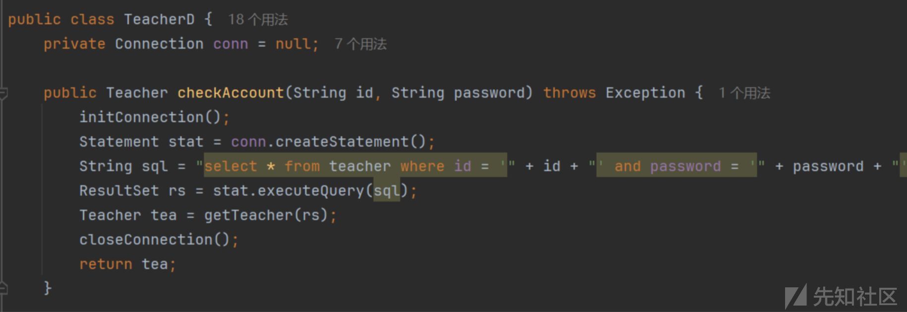

checkAccount 调用处  
方法  
checkAccount(String, String)  
用法或基方法的用法 位置 项目和库 (找到 1 个用法)

```
未分类  (找到 1 个用法)
        StudentManager  (找到 1 个用法)
            servlet  (找到 1 个用法)
                check_login  (找到 1 个用法)
                    doGet(HttpServletRequest, HttpServletResponse)  (找到 1 个用法)
                        42 teacher = teacherD.checkAccount(user, password);
```

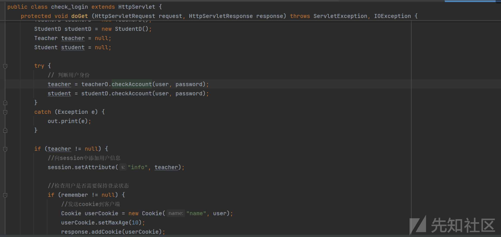

findWithId 调用处

```
findWithId(String)
用法或基方法的用法 位置 项目和库  (找到 4 个用法)
    未分类  (找到 4 个用法)
        StudentManager  (找到 4 个用法)
            dao  (找到 2 个用法)
                TeacherD  (找到 2 个用法)
                    insertTeacher(String, String, String)  (找到 1 个用法)
                        39 Teacher teacher = findWithId(id);
                    updateTeacher(String, String, String, String, String)  (找到 1 个用法)
                        55 Teacher teacher = findWithId(id);
            web  (找到 2 个用法)
                index.jsp  (找到 1 个用法)
                    index.jsp  (找到 1 个用法)
                        31 teacher = teacherD.findWithId(user);
                sendCode.jsp  (找到 1 个用法)
                    sendCode.jsp  (找到 1 个用法)
                        36 teacher = teacherD.findWithId(id);
```

StudentD里得 checkAccount findWithId findWithName deleteStudent方法均存在SQL注入

```
public class StudentD {

    private Connection conn = null;

    public Student checkAccount(String user, String password) throws Exception {
        initConnection();
        Statement stat = conn.createStatement();
        String sql = "select * from student where id = '" + user + "' and password = '" + password + "'";
        ResultSet rs = stat.executeQuery(sql);
        Student stu = getStudent(rs);
        closeConnection();
        return stu;
    }

    public Student findWithId(String id) throws Exception{
        initConnection();
        Statement stat = conn.createStatement();
        String sql = "select * from student where id = '" + id + "'";
        ResultSet rs = stat.executeQuery(sql);
        Student stu = getStudent(rs);
        closeConnection();
        return stu;
    }

    public ArrayList<Student> findWithName(String name) throws Exception{
        ArrayList<Student> al = new ArrayList<>();
        initConnection();
        Statement stat = conn.createStatement();
        String sql = "select * from student where name = '" + name + "'";
        ResultSet rs = stat.executeQuery(sql);
        getMoreStudent(al, rs);
        closeConnection();
        return al;
    }

    public boolean deleteStudent(String id) throws Exception{

        initConnection();
        Statement stat = conn.createStatement();
        String sql = "delete from student where id='"+id+"'";
        int i = stat.executeUpdate(sql);
        closeConnection();
        return i==1;
    }
```

checkAccount 调用

```
checkAccount(String, String)
用法或基方法的用法 位置 项目和库  (找到 1 个用法)
    未分类  (找到 1 个用法)
        StudentManager  (找到 1 个用法)
            servlet  (找到 1 个用法)
                check_login  (找到 1 个用法)
                    doGet(HttpServletRequest, HttpServletResponse)  (找到 1 个用法)
                        43 student = studentD.checkAccount(user, password);
```

findWithId 方法调用

```
findWithId(String)
用法或基方法的用法 位置 项目和库  (找到 9 个用法)
    未分类  (找到 9 个用法)
        StudentManager  (找到 9 个用法)
            servlet  (找到 1 个用法)
                one_page_student  (找到 1 个用法)
                    doGet(HttpServletRequest, HttpServletResponse)  (找到 1 个用法)
                        62 Student student = studentD.findWithId(key);
            web  (找到 2 个用法)
                index.jsp  (找到 1 个用法)
                    index.jsp  (找到 1 个用法)
                        32 student = studentD.findWithId(user);
                sendCode.jsp  (找到 1 个用法)
                    sendCode.jsp  (找到 1 个用法)
                        37 student = studentD.findWithId(id);
            web\student  (找到 2 个用法)
                main.jsp  (找到 2 个用法)
                    main.jsp  (找到 2 个用法)
                        58 String name = stuD.findWithId(student.getId()).getName();
                        59 String major = stuD.findWithId(student.getId()).getMajor();
            web\teacher  (找到 4 个用法)
                score.jsp  (找到 2 个用法)
                    score.jsp  (找到 2 个用法)
                        63 String name = stuD.findWithId(stu.getId()).getName();
                        64 String major = stuD.findWithId(stu.getId()).getMajor();
                score_excel.jsp  (找到 2 个用法)
                    score_excel.jsp  (找到 2 个用法)
                        38 String name = stuD.findWithId(stu.getId()).getName();
                        39 String major = stuD.findWithId(stu.getId()).getMajor();
```

findWithName 调用

```
findWithName(String)
用法或基方法的用法 位置 项目和库  (找到 1 个用法)
    未分类  (找到 1 个用法)
        StudentManager  (找到 1 个用法)
            servlet  (找到 1 个用法)
                one_page_student  (找到 1 个用法)
                    doGet(HttpServletRequest, HttpServletResponse)  (找到 1 个用法)
                        73 ArrayList<Student> stus = studentD.findWithName(key);
```

deleteStudent 调用

```
deleteStudent(String)
用法或基方法的用法 位置 项目和库  (找到 1 个用法)
    未分类  (找到 1 个用法)
        StudentManager  (找到 1 个用法)
            servlet  (找到 1 个用法)
                delete_student  (找到 1 个用法)
                    doGet(HttpServletRequest, HttpServletResponse)  (找到 1 个用法)
                        33 studentD.deleteStudent(id);
```

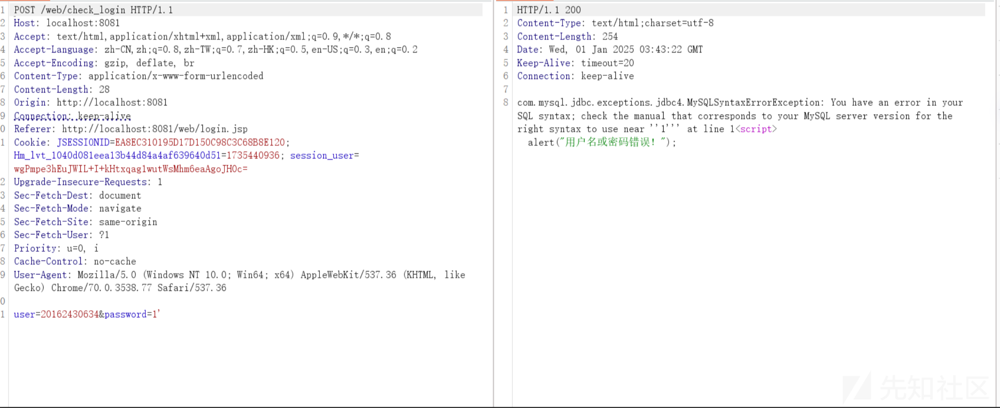

2.越权访问漏洞  
在登录main.jsp页面中并没有做权限判断验证 只有一个简单的session信息获取 导致不用登录即可访问敏感页面  
但是页面会报500错误

```
student/main.jsp
<%
    Student student = (Student) session.getAttribute("info");
%>
teacher/main.jsp
<%
    Teacher teacher = (Teacher) session.getAttribute("info");
    ArrayList<Student> stus = (ArrayList<Student>) session.getAttribute("onePageStudent");
    int sumIndex = (int) session.getAttribute("sumIndex");
%>
```

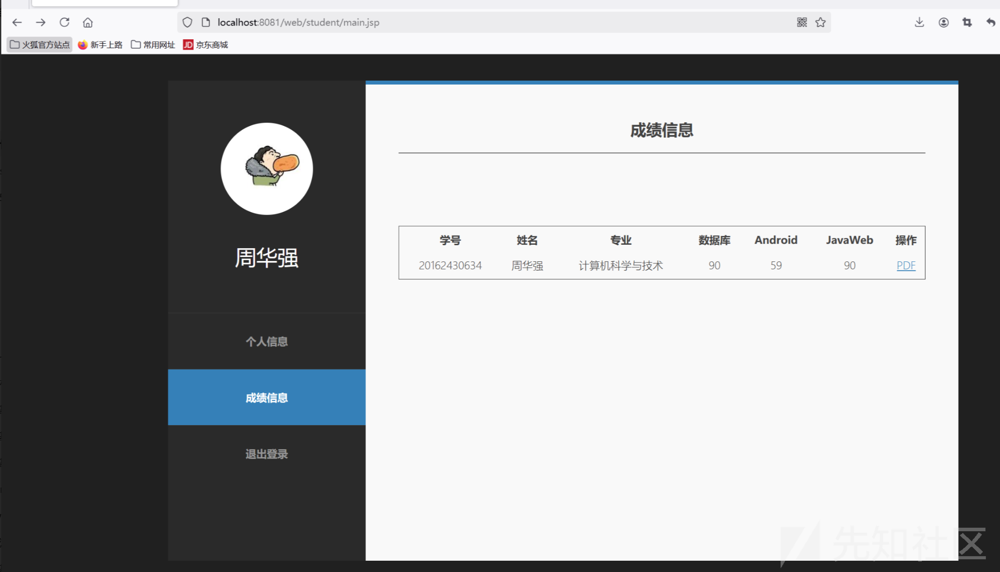

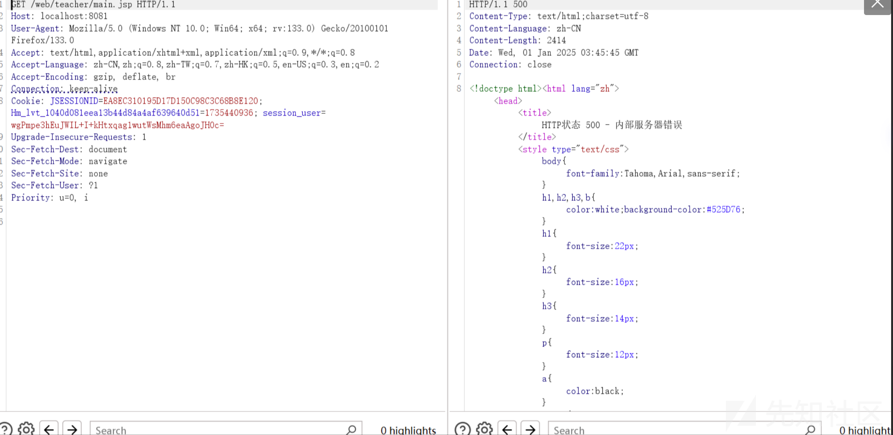

## 密码重置漏洞

这个是学生更新密码的代码

```
@WebServlet("/update_student_security")
public class update_student_security extends HttpServlet {
    protected void doPost(HttpServletRequest request, HttpServletResponse response) throws ServletException, IOException {

        this.doGet(request, response);
    }

    protected void doGet(HttpServletRequest request, HttpServletResponse response) throws ServletException, IOException {

        response.setContentType("text/html;charset=utf-8");
        response.setCharacterEncoding("utf-8");
        request.setCharacterEncoding("utf-8");

        PrintWriter out = response.getWriter();
        StudentD studentD = new StudentD();

        String id = request.getParameter("id");
        String email = request.getParameter("email");
        String password = request.getParameter("password");

        try {
            studentD.updateStudentSecurity(id, email, password);
            out.print("<script>alert(\"修改成功\");window.location.href='login.jsp';</script>");
        }
        catch (Exception e){
            out.print(e);
        }
    }
}
```

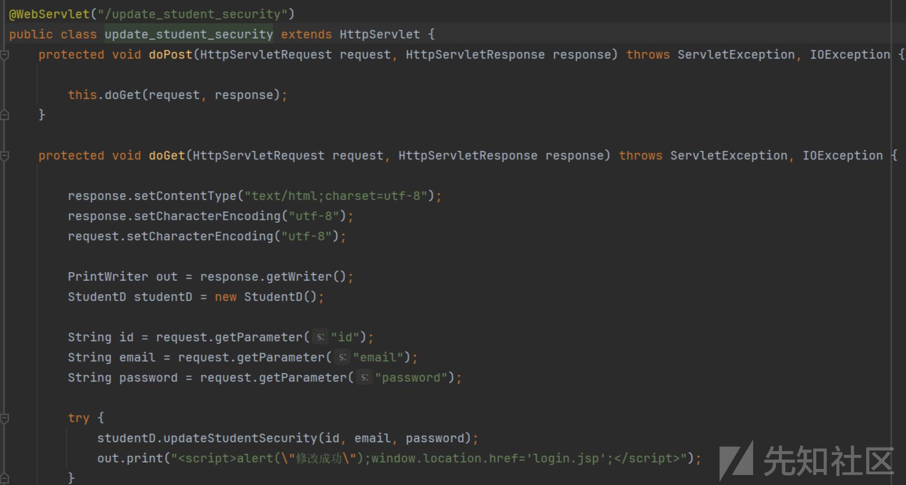

跟踪 studentD.updateStudentSecurity 账号id和账号密码都是可控的 所以存在任意账号密码修改漏洞

```
public void updateStudentSecurity(String id, String email, String password) throws Exception{

        initConnection();
        String sql = "update student set password=?, email=? where id=?";
        PreparedStatement ps = conn.prepareStatement(sql);
        ps.setString(1, password);
        ps.setString(2, email);
        ps.setString(3, id);
        ps.executeUpdate();
        closeConnection();
    }
```

复现  
<http://localhost:8081/web/update_student_security?id=20162430646&email=&password=123456>  
未授权任意修改id为20162430646的密码

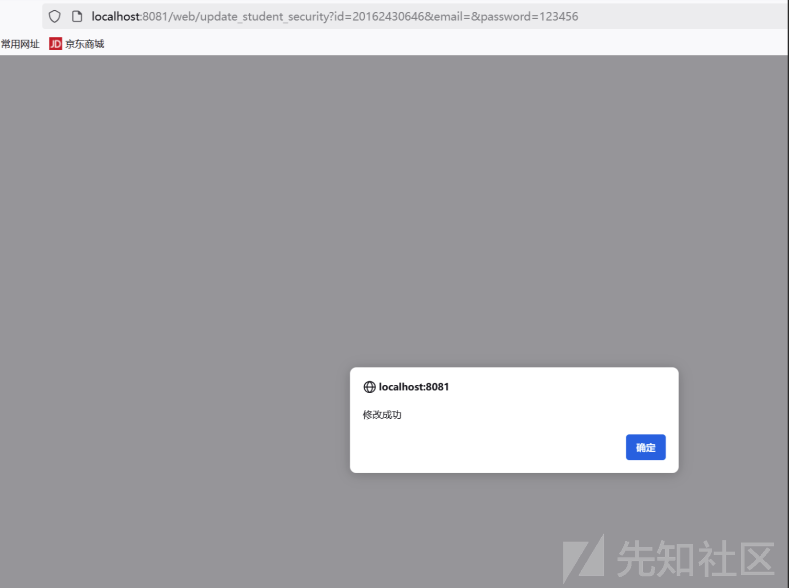

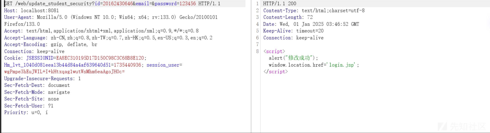

同理teacker 中也存在任意账号密码修改漏洞

```
@WebServlet("/update_teacher_password")
public class update_teacher_password extends HttpServlet {
    protected void doPost(HttpServletRequest request, HttpServletResponse response) throws ServletException, IOException {

        this.doGet(request, response);
    }

    protected void doGet(HttpServletRequest request, HttpServletResponse response) throws ServletException, IOException {

        response.setContentType("text/html;charset=utf-8");
        response.setCharacterEncoding("utf-8");
        request.setCharacterEncoding("utf-8");

        PrintWriter out = response.getWriter();
        TeacherD teacherD = new TeacherD();

        String id = request.getParameter("id");
        String password = request.getParameter("password");

        try {
            teacherD.updateTeacherPassword(id, password);
            out.print("<script>alert(\"修改成功\");window.location.href='login.jsp';</script>");
        }
        catch (Exception e){
            out.print(e);
        }
    }
}
```

<http://localhost:8081/web/update_teacher_password?id=1&email=&password=123456>

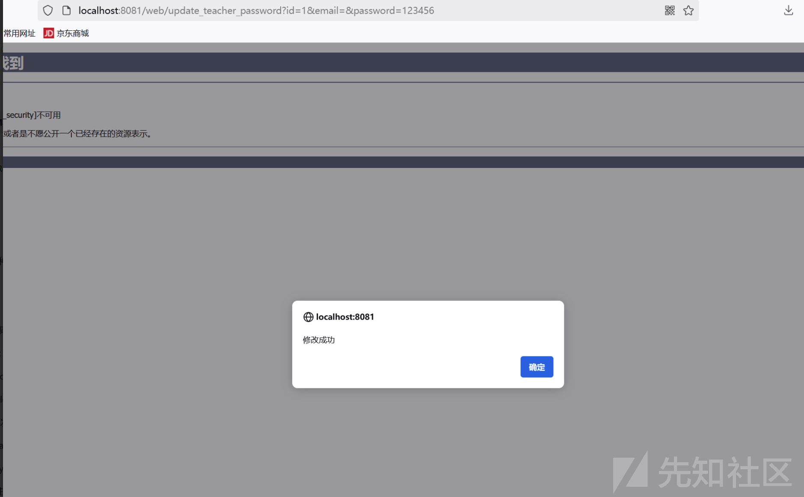

3.4 验证码重用漏洞  
验证码对比之后直接跳转 并没有进行销毁 所以存在验证码重用漏洞

```
@WebServlet("/check_register")
public class check_register extends HttpServlet {
    protected void doPost(HttpServletRequest request, HttpServletResponse response) throws ServletException, IOException {

        response.setContentType("text/html;charset=utf-8");
        response.setCharacterEncoding("utf-8");
        request.setCharacterEncoding("utf-8");

        String email = request.getParameter("email");
        String user = request.getParameter("user");
        String password = request.getParameter("password1");
        String code = request.getParameter("code");

        PrintWriter out = response.getWriter();
        HttpSession session = request.getSession();

        String randStr = (String) session.getAttribute("randStr");

        if (!code.equals(randStr)) {
            out.print("<script>alert(\"验证码错误！\");location.href = \"register.jsp\";</script>");
        } else {

            TeacherD teacherD = new TeacherD();
            Teacher teacher = null;

            try {
                teacher = teacherD.insertTeacher(user, password, email);
            } catch (Exception e) {
                out.print(e);
            }
            if (teacher != null) {
                //向session中添加用户信息
                session.setAttribute("info", teacher);
                response.sendRedirect("one_page_student");
            } else {
                out.print("<script>alert(\"此用户已经注册！\");location.href = \"register.jsp\";</script>");
            }
        }
    }
```

复现  
设置正确的验证码 之后 一直重复提交。均没有验证码错误提示

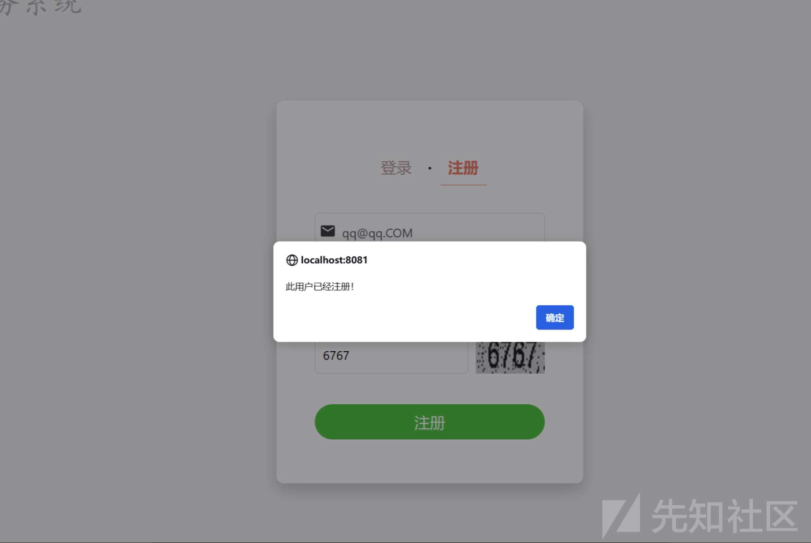

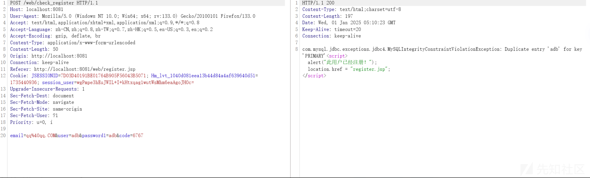

## 目录穿越漏洞

漏洞代码

```
package servlet;

import com.jspsmart.upload.File;
import com.jspsmart.upload.Request;
import com.jspsmart.upload.SmartUpload;

import javax.servlet.ServletConfig;
import javax.servlet.ServletException;
import javax.servlet.annotation.WebServlet;
import javax.servlet.http.HttpServlet;
import javax.servlet.http.HttpServletRequest;
import javax.servlet.http.HttpServletResponse;
import java.io.IOException;
import java.io.PrintWriter;

@WebServlet("/upload_studentImg")
public class upload_studentImg extends HttpServlet {
    protected void doPost(HttpServletRequest request, HttpServletResponse response) throws ServletException, IOException {

        this.doGet(request, response);
    }

    protected void doGet(HttpServletRequest request, HttpServletResponse response) throws ServletException, IOException {
        response.setContentType("text/html;charset=utf-8");
        response.setCharacterEncoding("utf-8");
        request.setCharacterEncoding("utf-8");
        PrintWriter out = response.getWriter();

        SmartUpload smartUpload = new SmartUpload();
        Request rq = smartUpload.getRequest();
        ServletConfig config = this.getServletConfig();
        smartUpload.initialize(config, request, response);
        try {
            //上传文件
            smartUpload.upload();
            String id = rq.getParameter("id");
            File smartFile = smartUpload.getFiles().getFile(0);
            smartFile.saveAs("/userImg/"+id+".jpeg");
            out.print("<script>alert(\"上传成功!\");window.location.href='student/personal.jsp';</script>");
        }
        catch (Exception e){
            out.print(e);
        }
    }
}

 String id = rq.getParameter("id"); 是没有进行过滤的
```

漏洞复现  
目录跳转../ 可以上传文件都不同的目录

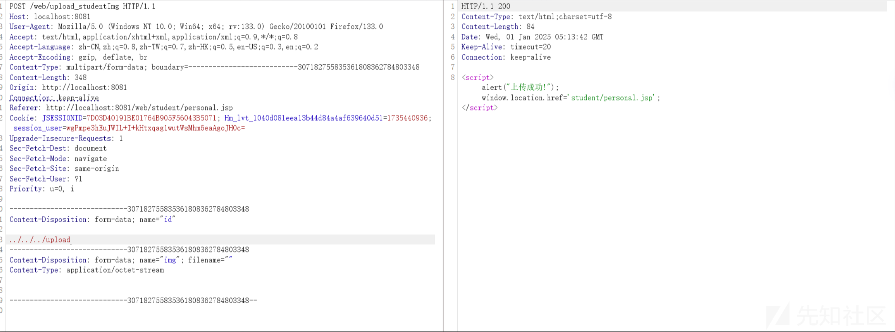

## xss漏洞

jsp文件中使用 <%=xx%> 这种表达式 并没有对xss恶意脚本进行过滤 所以全局用到都存在xss漏洞

```
<tr>
                        <td height="35"><%=stu.getId()%></td>
                        <td><%=name%></td>
                        <td><%=major%></td>
                        <td><input value="<%=stu.getDatabase()%>" name="database" class="table-input"></td>
                        <td><input value="<%=stu.getAndroid()%>" name="android" class="table-input"></td>
                        <td><input value="<%=stu.getJsp()%>" name="jsp" class="table-input"></td>
                        <input value="<%=stu.getId()%>" name="id" type="hidden">
```                    </tr>
漏洞验证
修改个人信息 填写 xss恶意脚本
```

"><script>alert(1)</script><"  
```  
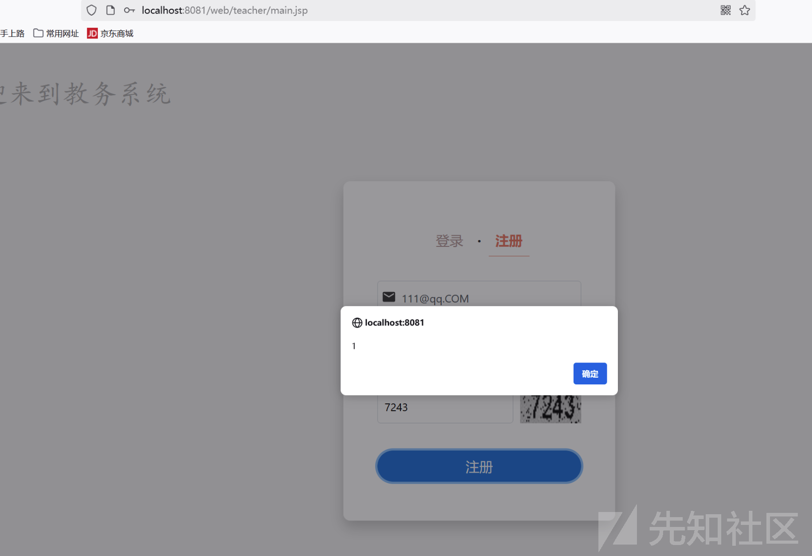

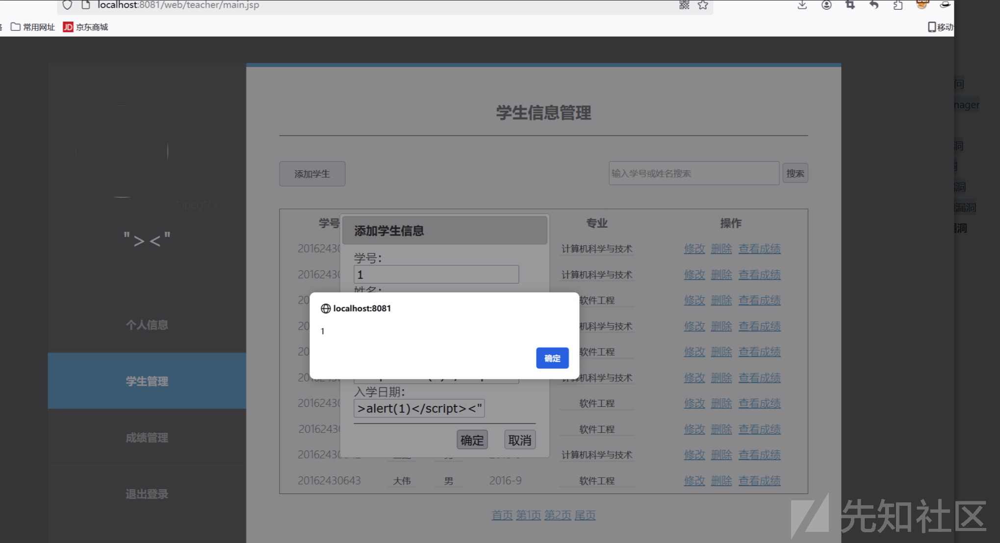

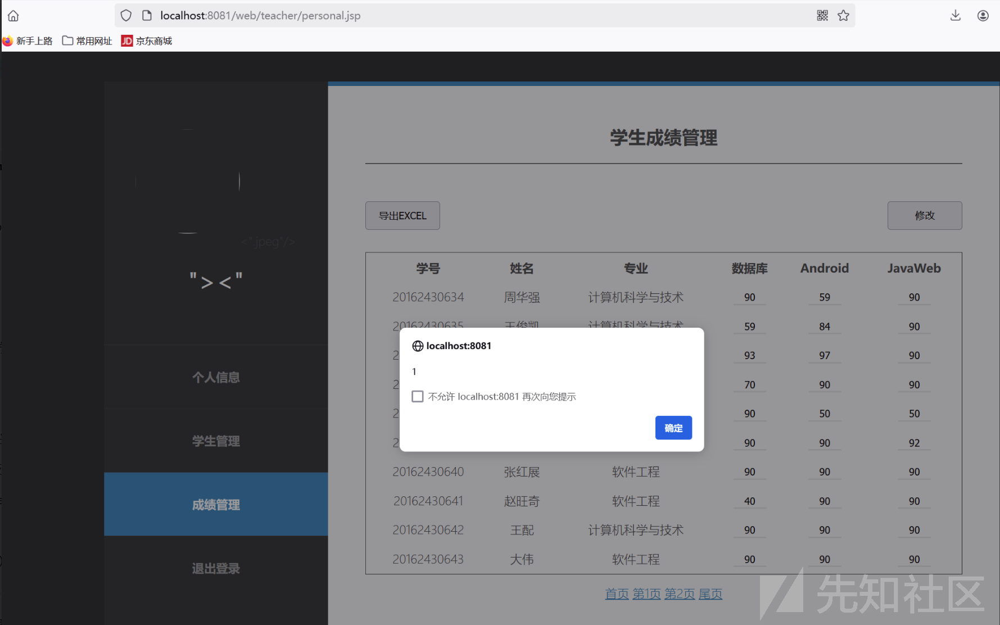
