# Sekiro+Yakit 热加载无痛绕sign-先知社区

> **来源**: https://xz.aliyun.com/news/16440  
> **文章ID**: 16440

---

# 涉及

Js 逆向

无限 debugger 绕过

Js-rpc技术

Yakit 热加载批量

# 背景

之前写过的一篇文章<https://xz.aliyun.com/t/16673> 主要讲实战自动化加解密，其中对加密算法的处理就需要先分析再写加解密脚本

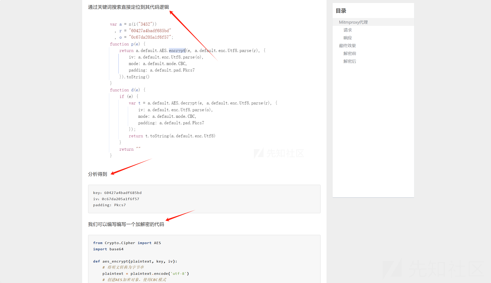

这种方式需要我们能够读懂目标JS代码的加密逻辑，完整还原加密链，然后再去编写代码。像0xsdeo师傅文章[双层mitmproxy代理实现自动化加解密](https://mp.weixin.qq.com/s/L5GD6PwivRG-1IfgpSCfEw)中提到的通过execjs来在python中运行JS代码，同样需要梳理加密逻辑。

在实战场景下，多数情况会存在多层加密或者自研算法，并且还伴有代码混淆的情况。此时，想要完整还原加密链，是非常困难的。

因此，今天的主角 `sekiro` 登场了，其可以使无需理解它的算法细节也可以完成加解密，那...接下来深入的学习一下，感受其魅力！

# Sekiro 简介

首先需要了解一下 JSRPC 技术，JSRPC是远程调用JavaScript函数的方法。它的原理是在客户端（也就是浏览器）注入JSRPC环境，使客户端与JSRPC服务器建立WebSocket连接，保持通信。然后在客户端注册需要用到的加解密函数的demo，这样当JSRPC服务器发送信息给客户端时，客户端接收到并执行相应的方法，然后将结果发送回服务器。服务器接收到结果并将其显示出来。

**sekiro** 相当于一个将其封装好的框架，当然其功能更为强大，今天我们只关注其在 js 逆向的作用！

# 实操演示

实名认证的场景，一般这种接口都是收费的。如果该接口未限制用户访问频率，则可以出一个不受限制的资源调用的洞。


但是比较烦的是，他虽然没限制频率，但是请求有有验签(sign)的操作, 导致我们不能批量爆破了  
(数据包处理过的哈)

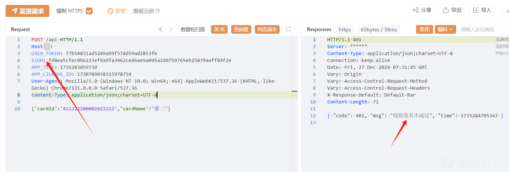

因此我们需要逆向一下 sign，来绕过签名，首先肯定是，F12，找找看那个函数生成的 sign

## 无限 debugger 绕过

说干就干，不过运气貌似不太行，碰到了无限 debugger 反调试

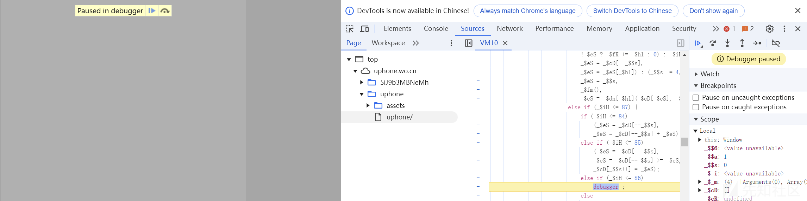

如果不需要调试，只看代码的话，我们可以直接把断点的功能关了

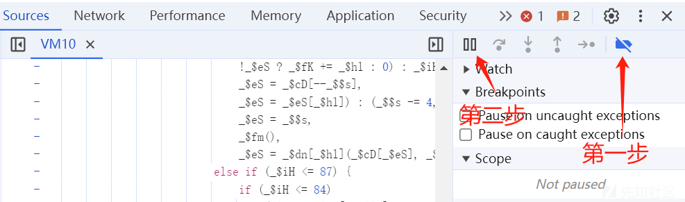

但是这样的话，咱就也不能打断点了。那怎么办，当然，无限 debugger 是可以绕过的。咱们这里使用最朴素的办法即可绕过

使用朋友给的小脚本

```
var _constructor = constructor;

Function.prototype.constructor = function (s) {
    if (s == "debugger"){
        console.log(s)
        return null;
    }
    return _constructor(s)
}
```

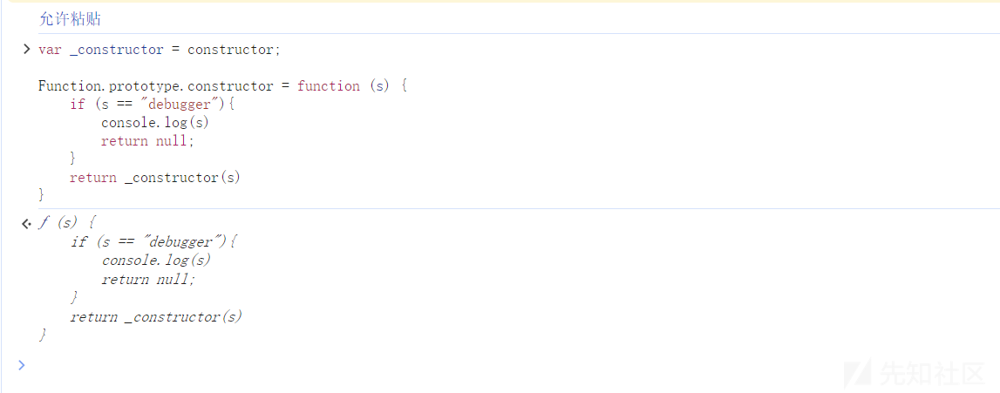

再搭配：一律不再此处暂停


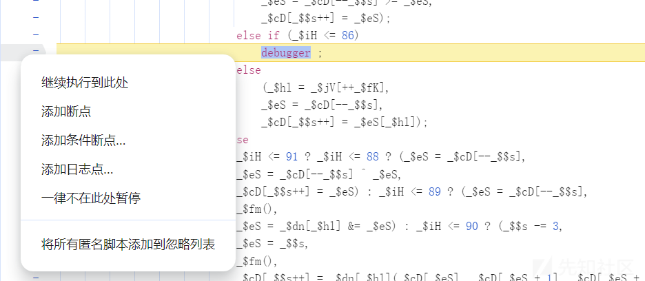

两次就过了，现在我们可以打断点了，更加详细的请看下文。

<https://mp.weixin.qq.com/s/hpJ3qSaYI4yFJU0LWsm23A>

## sign 逆向

首先我们可以在数据包中尝试，看看是哪些参数影响到了 sign

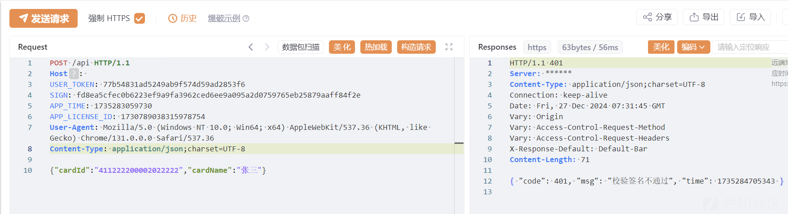

可以通过按个删减尝试

最终发现 `APP_TIME`、`APP_LICENSE_ID` 参数均影响，通过关键词到 js 中搜索

找到了一处可以的地方

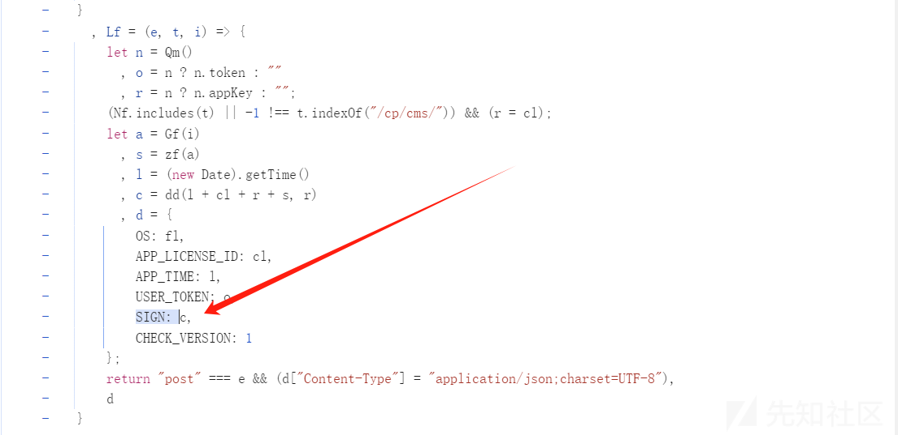

然后我们打个断点试试

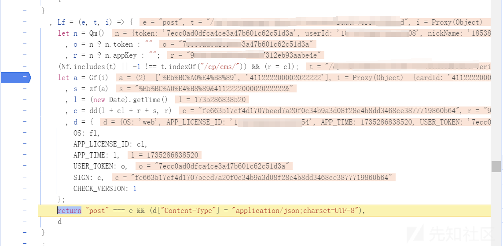


现在我们梳理一下

```
#函数
    dd()
#参数 
    l=APP_TIME
    cl=APP_LICENSE_ID  
    r=appKey
    s=张三&4112002000090876112&  //url编码
#调用
    sign=dd(l + cl + r + s, r)
```

试试 ok 不 ok，改身份证最后一位成 3，试试构造 l、cl、r 都可以使用固定参数

```
dd("1735286838520"+"1730789038315978754"+"9b5a1fa345624fdf937312eb93aabe4e"+"%E5%BC%A0%E4%B8%89&411222200002022223&","9b5a1fa345624fdf937312eb93aabe4e")
```

控制台直接生成

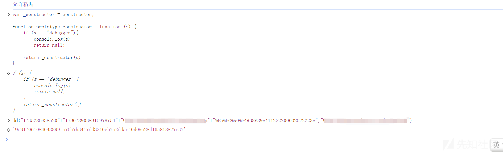

然后成功过签

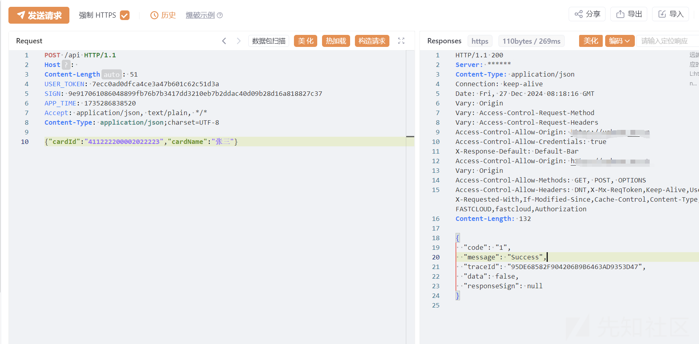

正常思路，我们要开始逆向 dd 函数，或者使用 execjs ，但是这都太麻烦了，今天的主角 `Sekiro` 登场

## Sekiro

花里胡哨的不讲，网上也挺多的，直接实操（安装就不讲喽，一搜一大堆）

首先把 dd（）函数作用域提升至全局

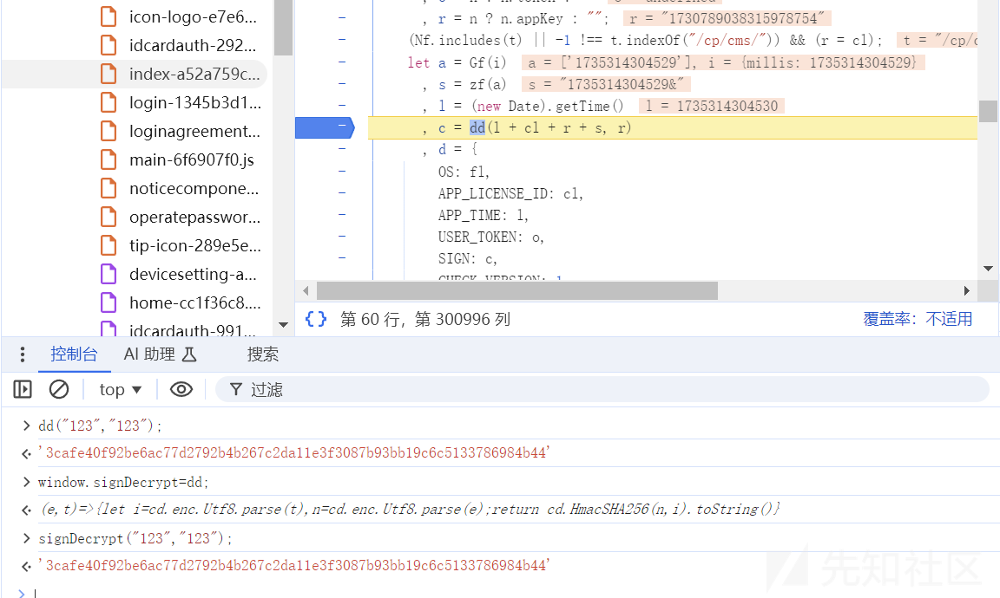

启动Sekiro

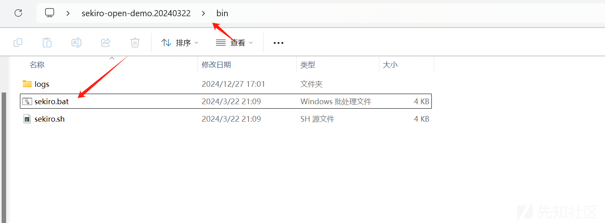

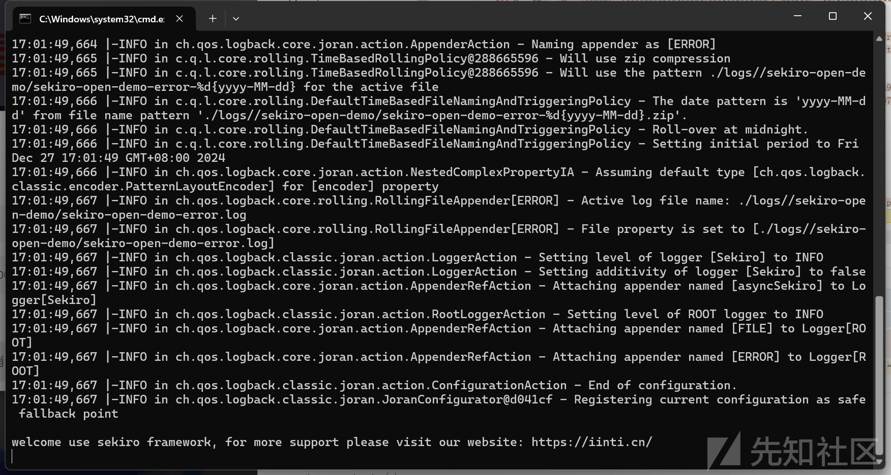

添加如下代码到控制台或者新增代码段

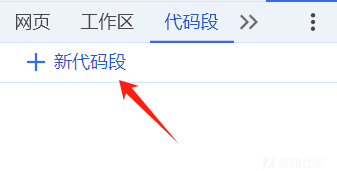

[快速上手 | sekiro](https://sekiro.iinti.cn/sekiro-doc/01_manual/1.quickstart.html#android-xposed)

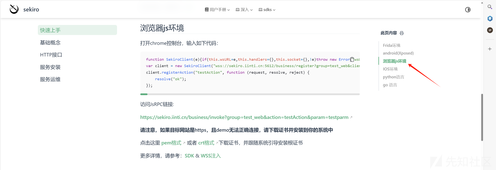

但是需要我们有一点小改动（箭头指向的 4 处）

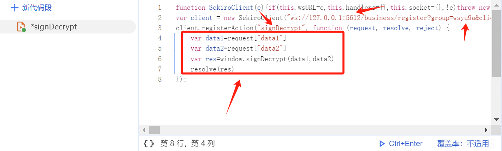

* 将wss://sekiro.iinti.cn:5612改成ws://127.0.0.1:5612
* test\_web 随意
* testAction 随意
* 代码逻辑根据实际情况来

然后点击下边的 `Ctrl+Enter` 即可

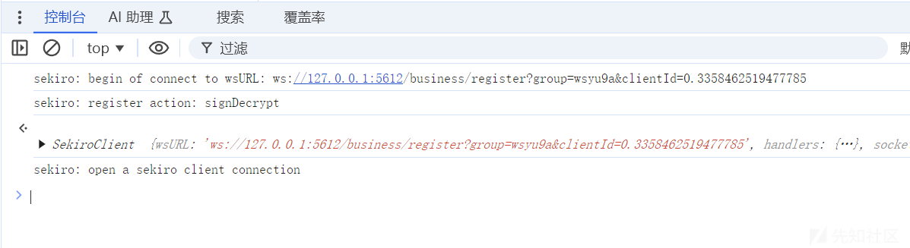

python 代码调试

```
import requests  
data = {  
        "group": "wsyu9a",  
        "action": "signDecrypt",  
        "data1":"123",  
        "data2":"123"  
}  
res = requests.get("http://127.0.0.1:5612/business/invoke",params=data )  
print(res.text)
```

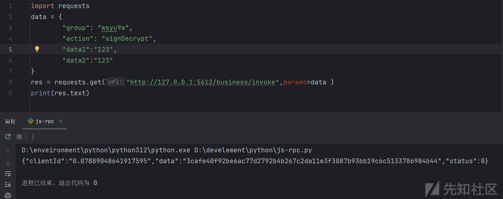

## Yakit 热加载

```
signDecryot = func(sfz) {
  APP_TIME = '1735326352548'
  APP_LICENSE_ID = '1730789038315978754'
  appKey = '9b5a1fa345624fdf937312eb93aabe4e'
  s=codec.EscapeQueryUrl('张三')+'&'+sfz+'&'
  // return s
  data1=APP_TIME+APP_LICENSE_ID+appKey+codec.EncodeUrl(s)
  data2=appKey
  rsp = http.Get(f"http://127.0.0.1:5612/business/invoke?group=wsyu9a111&action=signDecrypt&data1=${data1}&data2=${data2}")~
  return json.Find(rsp.Data(), "$.data")  
}
```

成功

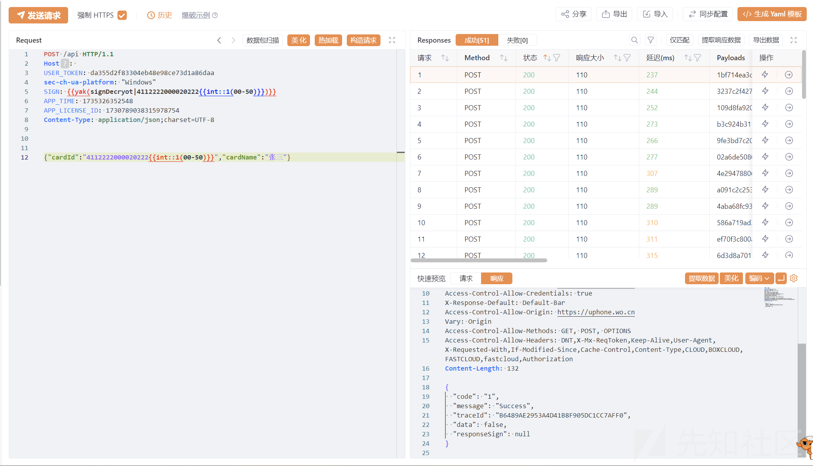

# 参考

<https://sekiro.iinti.cn/sekiro-doc/01_manual/1.quickstart.html#android-xposed>

<https://mp.weixin.qq.com/s/383WoENRfTpVWLNXvEjHqw>

<https://blog.csdn.net/weixin_43927244/article/details/127125217>
