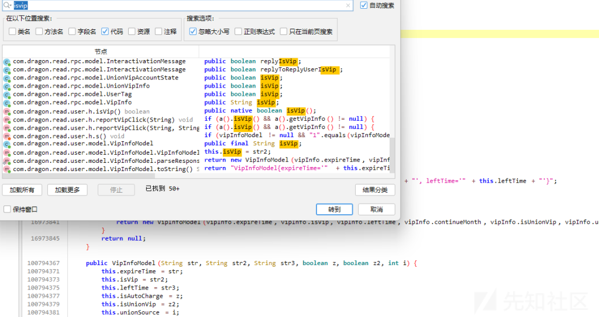
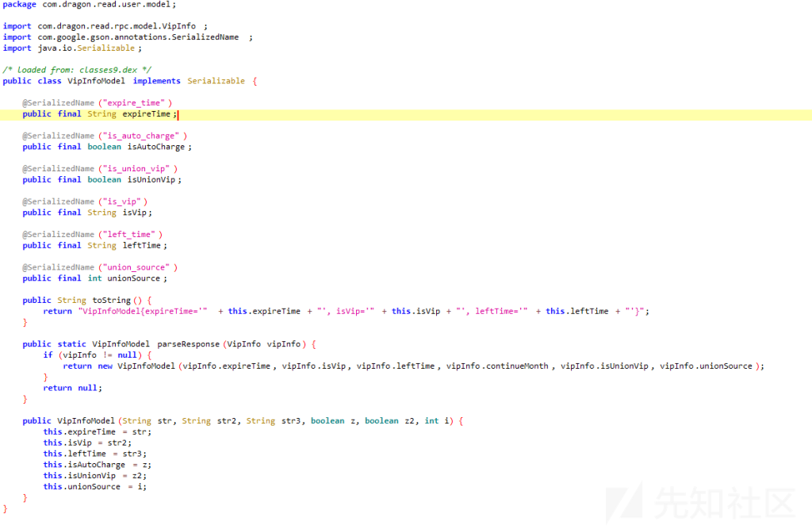
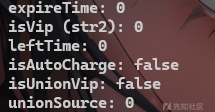

# 某小说vip破解代码分析-先知社区

> **来源**: https://xz.aliyun.com/news/16443  
> **文章ID**: 16443

---

首先jadx打开，看看代码，老规矩，搜索isvip

  
点进str2所在，

  
可以看到str2不是传统的bool类型，而是一个string，然后expire也是一个string(通过frida hook之后发现是vip的到期时间的unix时间戳)，所以话不多说，直接上frida，

```
Java.perform(function () {

    var VipInfoModel = Java.use('com.dragon.read.user.model.VipInfoModel');


    VipInfoModel.$init.overload('java.lang.String', 'java.lang.String', 'java.lang.String', 'boolean', 'boolean', 'int').implementation = function (str, str2, str3, z, z2, i) {

        console.log("VipInfoModel constructor called!");
        console.log("expireTime: " + str);
        console.log("isVip (str2): " + str2); 
        console.log("leftTime: " + str3);
        console.log("isAutoCharge: " + z);
        console.log("isUnionVip: " + z2);
        console.log("unionSource: " + i);

    };

    console.log("success");
});

```

发现输出是



所以，直接改了就行，

```
Java.perform(function () {

    var VipInfoModel = Java.use('com.dragon.read.user.model.VipInfoModel');


    VipInfoModel.$init.overload('java.lang.String', 'java.lang.String', 'java.lang.String', 'boolean', 'boolean', 'int').implementation = function (str, str2, str3, z, z2, i) {

        console.log("VipInfoModel constructor called!");
        console.log("expireTime: " + str);
        console.log("isVip (str2): " + str2); 
        console.log("leftTime: " + str3);
        console.log("isAutoCharge: " + z);
        console.log("isUnionVip: " + z2);
        console.log("unionSource: " + i);
        var ret = this.$init("4102415999","1","100000",false,false,0);
        console.log("Modified constructor return value: " + ret);
    };

    console.log("success");
});

```


