# 【Reverse-Crypto】深入逆向-密码篇-MD5算法详解以及代码编写-先知社区

> **来源**: https://xz.aliyun.com/news/16451  
> **文章ID**: 16451

---

### 引子

MD5全称为Message Digest Algorithm 5，消息摘要算法第五代  
首先对于MD5的结果为固定的32位，并且为hex字符串的输出，那么实际的长度为16字节：  
对于HelloWorld的MD5结果为：（==不区分大小写==）

```
68E109F0F40CA72A15E05CC22786F8E6
```

该结果的68描述一个字节，而不是两个字节，所以其结果实际上的位宽为`16*8`，即128位，对于任意长度的明文数据，最终得到的都是128位的结果，那么该算法得到的结果属于全损压缩，无法从该加密结果中得到原始信息的内容，也无法直接解密出明文，而对于明文中每一位的修改都会影响最终的结果，所以该算法属于散列算法，基于上面描述得到该算法的特点：不可逆性和抗碰撞性，所以广泛用于文件的完整性校验以及签名校验等  
关于其可破解，在算法初期通过彩虹表进行md5的碰撞，也即对于通用的明文数据进行加密，将其结果放入彩虹表中，通过查表反推出MD5结果对应的明文数据，由于其加密流程很快速，所以也可以通过暴力破解，通过对明文直接算MD5与结果进行比较，而通过某种算法可实现Hash碰撞，即存在`MD5(m1) = MD5(m2)`  
MD5处理步骤

1. 消息填充
2. 分组
3. 缓冲区初始化
4. 迭代
5. 输出  
   ### 1. 消息填充(Padding)  
   该步骤需要将输入的数据长度填充成模512（bit）等于448（bit）的长度，填充内容为1以及若干个0  
   存在两种特殊情况：
6. 若模512刚好等于448则直接填充512位
7. 若模512等于447，则只需要往右填充一个1即可，不需要补0  
   可以得到MD5的填充长度为1-512  
   关于计算，设模512后的值为x：
8. 若模512后的值大于448，则需要填充的位数为 512 - x % 448
9. 若模512后的值小于448， 则需要填充的位数为 448 - x  
   结合上面的特殊情况，可将大于和等于448的情况结合：

   ```
   size_t x %= 512;
   size_t bitsPadding = 0;
   if ( x >= 448) {
     bitsPadding = 512 - x % 448; // 由于x先模512，所以不可能比512大
   } else {
     bitsPadding = 448 - x;
   }

   ```

   获取输入数据的bit数，对于每个字符应该为BYTE的长度，否则会影响计算，利用unsigned char数组来接收输入的字符

   ```
   vector<uint8_t> data

   ```

   这里首个字符H的hex值为0x48，实际上是通过整个8位来描述H这个字符，那么实际上的HelloWorld的长度就是`10 * 8 = 80`位，对于任意长度的信息，其最终的位数都是8的倍数，由于信息长度为8的整数倍，所以就不会出现模512等于447的情况，也就不会出现只移位1位的情况，通过单元测试测试输入

   ```
   TEST(TestMD5, testPadding) {  
     char input[] = "HelloWorld";  
     vector<uint8_t> plaintext;  
     plaintext.insert(plaintext.end(), input, input+sizeof(input)-1);  
     ASSERT_EQ(plaintext.size(), sizeof(input)-1);
   }

   ```

   padding函数通过引用传入一个vector数组进行数据填充：

   ```
   void MD5::padding(vector<unsigned char> &data) {  
     uint64_t nBits = data.size() * 8;  
     size_t paddingBits = 0;  
     if (nBits % 512 >= 448) {  
         paddingBits = 512 - nBits % 512 % 448;  
     } else {  
         paddingBits = 448 - nBits;  
     }  

     // 拆分两次进行左移，先左移1位，将该为置1  
     data = Tools::left_shift(data, 1);  
     data[data.size()-1] ^= 0x1;  
     paddingBits -= 1;  
     data = Tools::left_shift(data, paddingBits);
   }

   ```

   vector移位通过`left_shift`实现，返回一个移位后的vector容器，该函数需要实现：
10. 对于第`i`个字节，其结果应该为`i`字节左移`n`位的结果或上`i+1`字节右移`8-n`位的结果
11. 对于第`0`个字节，其结果可能会产生溢出，需要对溢出进行判断  
    在该函数中，先对左移的位数进行判断，如果左移的位数为0，则直接返回其本身，不需要进行后续的操作

    ```
    vector<unsigned char> Tools::left_shift(std::vector<unsigned char> vec, size_t shift) {  
     if (shift == 0) {  // 考虑到0值
         return vec;  
     }  
     size_t byte_shift = shift / 8; // 移动的字节数  
     size_t bit_shift = shift % 8;  // 字节内移动的位数  

     std::vector<unsigned char> result(vec.size() + byte_shift, 0);  // 创建并初始化结果容器

     for (size_t i = 0; i < vec.size(); ++i) {  
         result[i] |= (vec[i] << bit_shift);  // 第i个字节左移n位
         if (i + 1 < vec.size()) {  
             result[i] |= (vec[i + 1] >> (8 - bit_shift));  // 第i+1个字节右移8-n位
         }    
     }  
     if (vec[0] >> (8 - bit_shift)) {  // 如果第0个字节右移8-n位后还有值，说明左移n位后会产生溢出
         result.insert(result.begin(), 1); // 在最前面插入一个字节  
         result[0] = (vec[0] >> (8 - bit_shift));  // 其值就为第0个字节右移8-n的结果
     }  
     return result;  
    }

    ```

    单元测试：

    ```
    TEST(TestMD5, testPadding) {  
     char input[] = "HelloWorld";  
     vector<uint8_t> plaintext;  
     plaintext.insert(plaintext.end(), input, input+sizeof(input)-1);  
     string hexString = Tools::toHexString(plaintext);  
     cout << "Origin hexString: " << hexString << endl;  

     // ASSERT_EQ(plaintext.size(), sizeof(input)-1);  
     MD5 md5;  
     md5.padding(plaintext);  
     hexString = Tools::toHexString(plaintext);  
     cout << "Padding hexString: " << hexString << endl;
    }

    ```

    第一步填充的正确结果：

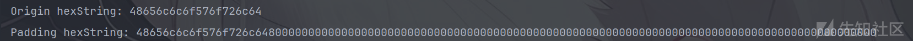

确认位数：`0b`的前缀占用了两位，而python的输出会从1开始算起，所以得到的位数只有449-2=447，实际上在vector中保存的结果长度就是448

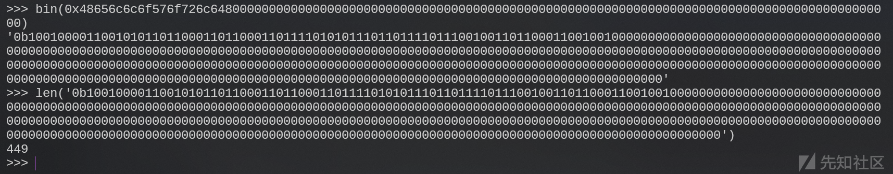

将input设置为123456：0x31二进制为`0010 0001`，所以python转二进制后会省略前面两位得到的就是448，再减`0b`占位此时输出的实际长度是446，加上省略的两位就是448

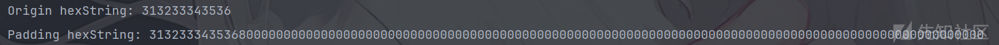

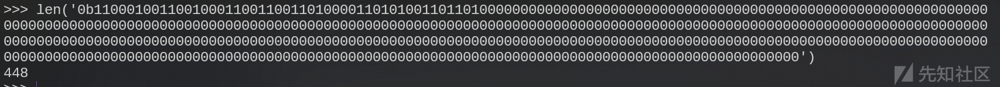

第一步填充完成后，此时的数据长度应为`N*512 + 448`，这里模值为448，就是为了留64位来描述原始输入的数据长度，此时可以描述的信息最大长度为`2^64`，所以直接通过`uint64_t`存储原始信息长度，存储单位为bit：

```
uint64_t nBits = data.size() * 8;

```

通过`uint64ToVector`将uint64转成`vector<uint8_t>`

```
vector<unsigned char> Tools::uint64ToVector(uint64_t value) {  
    vector<uint8_t> vec(8); // 创建一个大小为8的vector，足够存放64位数据  

    // 将uint64_t的每个字节提取到vector中  
    for (size_t i = 0; i < 8; ++i) {  
        vec[i] = static_cast<uint8_t>((value >> ((7 - i) * 8)) & 0xFF); // 提取每个字节  
    }  

    return vec; 
}

```

在插入信息前需要知道大小端概念，对于HelloWorld，其信息长度为0x50，而通过小端存储时会表现为：`0x 50 00 00 00 00 00 00 00`，所以在追加到信息前需要将其转成小端存储：

```
// 确认有效信息位  
uint64_t Tools::swapEndian64(uint64_t x) {  
    return ((x >> 56) & 0xff) |  
        ((x >> 40) & 0xff00) |  
        ((x >> 24) & 0xff0000) |  
        ((x >> 8) & 0xff000000) |  
        ((x << 8) & 0xff00000000) |  
        ((x << 24) & 0xff0000000000) |  
        ((x << 40) & 0xff000000000000) |  
        ((x << 56) & 0xff00000000000000);  
}

```

最终处理结果：

```
void MD5::padding(vector<unsigned char> &data) {  
    uint64_t nBits = data.size() * 8;

    // 第一步填充
    // ...
    // ...

    // 插入原始信息长度  
    vector<uint8_t> MessageSize = Tools::uint64ToVector(Tools::swapEndian64(nBits));  
    data.insert(data.end(), MessageSize.begin(), MessageSize.end());

```

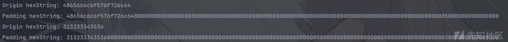

### 2. 分组(Grouping)

该步将填充得到的结果按512位为一组进行划分，这也是为何要模512，而由于填充后的位数一定是512，那么最高位一定是1，此时`data[0] & 0x80`条件为真，不需要考虑`data[0]`的实际数据长度是否小于类型宽度，  
每一组512再按32位进行划分，所以可以根据此定义一个二维vector：

```
size_t groupCount = data.size() * 8 / 512;  
vector<vector<uint32_t>> groups(groupCount);

```

外层vector的数量未定，这取决于输入的信息长度，而内层的vector数量是固定的为16：所以对于每一次循环都可以创建并初始化一个容量为16的uint32\_t，通过或操作4个uint8\_t并入uint32\_t中：

```
for (size_t i = 0; i < groupCount; i++) {  
    groups[i] = vector<uint32_t>(16, 0);  
    for (size_t j = 0; j < 16; j++) {  
        for (size_t k = 0; k < 4; k++) {  
            groups[i][j] |= (uint32_t)data[i*64+j*4+k] << ((3-k)*8);  
        }    
    }
}

```

通过步骤一将HelloWorld填充成512位，分割得到：（只有一组512）

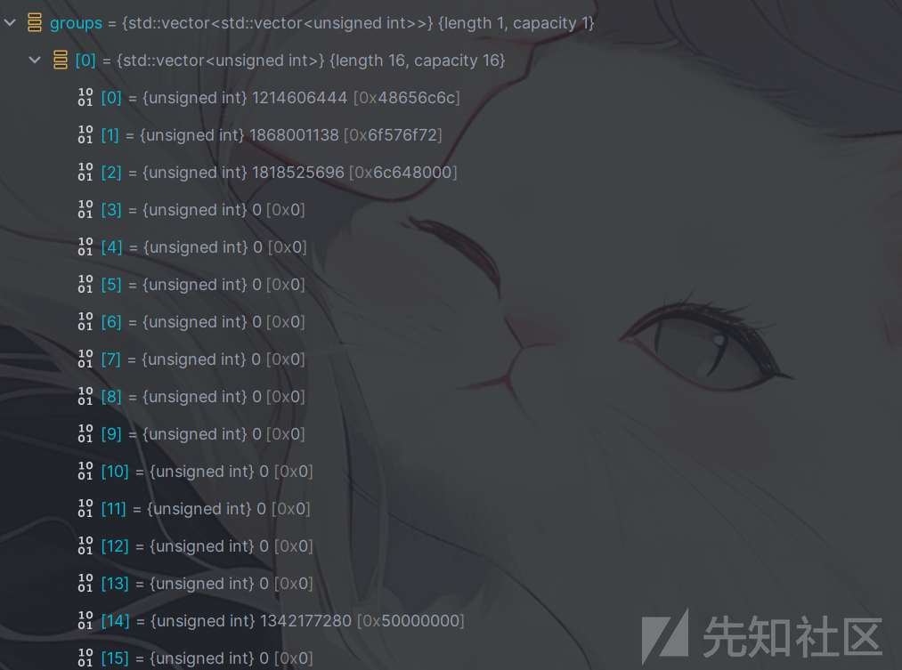

### 3. 缓冲区初始化及迭代(Iterator)

首先定义4个初始的幻数，接下来的所有操作围绕这四个幻数进行：

```
const uint32_t A = 0x67452301;  
const uint32_t B = 0xEFCDAB89;  
const uint32_t C = 0x98BADCFE;  
const uint32_t D = 0x10325476;

```

按照顺序复制一份给res数组：

```
vector<uint32_t> res = {A, B, C, D};

```

迭代过程：

1. 调用四个非线性函数：`FF、GG、HH、II`，执行顺序为`FF->GG->HH->II`
2. 每一个线性函数执行16次，执行16次的原因就是第二步分组后为16个单位的4字节信息，需要将每一组的信息都进行摘取，所有函数传入的参数相同，都是7个
   1. 前四个为幻数（**注意参数中的abcd不对应初始化的幻数ABCD**）
   2. M 为输入的信息分组后的
   3. t 为伪随机数，通过该伪随机数混淆输入的信息
   4. shiift 为循环左移的位数  
      对于输入的a, b, c, d四个参数，会将b, c, d进行对应的`与或非异或`操作后（每个函数对应的线性操作不同），与a进行相加，该结果与输入的信息的进行相加，再通过伪随机数进行混淆，此时得到的结果再通过循环左移进行混淆，得到的结果再加b，最后返回给a，每一次迭代的结果只修改幻数中的一个，修改后的结果放入下一次迭代，幻数的迭代顺序为`A->D->C->B`，每一个函数执行16次，每一个幻数就会迭代4次，该次数针对每一组512位，对于`N*512`的输入信息，则需要执行`16 * 4 * N`

```
uint32_t MD5::FF(uint32_t a, uint32_t b, uint32_t c,  
            uint32_t d, uint32_t M, uint32_t t, uint32_t shift) {  
    return b + Tools::rotate_left(a + this->F(b,c,d) + M + t, shift);  
}  

uint32_t MD5::GG(uint32_t a, uint32_t b, uint32_t c,  
    uint32_t d, uint32_t M, uint32_t t, uint32_t shift) {  
    return b + Tools::rotate_left(a + this->G(b, c, d) + M + t, shift);  
}  

uint32_t MD5::HH(uint32_t a, uint32_t b, uint32_t c,  
    uint32_t d, uint32_t M, uint32_t t, uint32_t shift) {  
    return b + Tools::rotate_left(a + this->H(b, c, d) + M + t, shift);  
}  

uint32_t MD5::II(uint32_t a, uint32_t b, uint32_t c,  
    uint32_t d, uint32_t M, uint32_t t, uint32_t shift) {  
    return b + Tools::rotate_left(a + this->I(b, c, d) + M + t, shift);  
}

```

循环左移：

```
uint32_t Tools::rotate_left(uint32_t value, uint8_t shift) {  
    const int bits = 32;  
    shift %= bits;  
    return (value << shift) | (value >> (bits - shift));  
}

```

非线性函数的子操作，对于输入B，C，D进行与或非操作  
$$  
\begin{cases}  
F(x, y, z) = (x \land y) \lor (\neg x \land z)  
\ G(x, y, z) = (x \land z) \lor (y \land \neg z)  
\ H(x , y, z) = x \oplus y \oplus z  
\ I(x, y, z) = y \oplus (x \lor \neg z)  
\end{cases}  
$$

```
#define F(x, y, z) (((x) & (y)) | ((~(x) & (z))))  
#define G(x, y, z) (((x) & (z)) | ((y) & (~(z))))  
#define H(x, y, z) ((x) ^ (y) ^ (z))  
#define I(x, y, z) (y ^ (x | ~z))
```

迭代操作最简单的就是将每一个函数的参数都逐个传入逐个调用，定义一个transByIterator函数，传入的后四个参数为当前幻数的值，对于分组数大于1的信息，需要多次调用该函数，将每一组执行后的幻数传入：**不同的非线性函数调用时传入的输入信息不是按顺序的**

```
void MD5::transByIterator(vector<uint32_t> &v, uint32_t &A, uint32_t &B, uint32_t &C, uint32_t &D) {  
    // Round 1  
    A = this->FF(A, B, C, D, v[0], 0xd76aa478, 7);  
    D = this->FF(D, A, B, C, v[1], 0xe8c7b756, 12);  
    C = this->FF(C, D, A, B, v[2], 0x242070db, 17);  
    B = this->FF(B, C, D, A, v[3], 0xc1bdceee, 22);  
    A = this->FF(A, B, C, D, v[4], 0xf57c0faf, 7);  
    D = this->FF(D, A, B, C, v[5], 0x4787c62a, 12);  
    C = this->FF(C, D, A, B, v[6], 0xa8304613, 17);  
    B = this->FF(B, C, D, A, v[7], 0xfd469501, 22);  
    A = this->FF(A, B, C, D, v[8], 0x698098d8, 7);  
    D = this->FF(D, A, B, C, v[9], 0x8b44f7af, 12);  
    C = this->FF(C, D, A, B, v[10], 0xffff5bb1 , 17);  
    B = this->FF(B, C, D, A, v[11], 0x895cd7be, 22);  
    A = this->FF(A, B, C, D, v[12], 0x6b901122, 7);  
    D = this->FF(D, A, B, C, v[13], 0xfd987193 , 12);  
    C = this->FF(C, D, A, B, v[14], 0xa679438e, 17);  
    B = this->FF(B, C, D, A, v[15], 0x49b40821 , 22);  

    // Round 2  
    A = this->GG(A, B, C, D, v[1], 0xf61e2562, 5);  
    D = this->GG(D, A, B, C, v[6], 0xc040b340, 9);  
    C = this->GG(C, D, A, B, v[11], 0x265e5a51, 14);  
    B = this->GG(B, C, D, A, v[0], 0xe9b6c7aa, 20);  
    A = this->GG(A, B, C, D, v[5], 0xd62f105d, 5);  
    D = this->GG(D, A, B, C, v[10], 0x02441453, 9);  
    C = this->GG(C, D, A, B, v[15], 0xd8a1e681, 14);  
    B = this->GG(B, C, D, A, v[4], 0xe7d3fbc8, 20);  
    A = this->GG(A, B, C, D, v[9], 0x21e1cde6, 5);  
    D = this->GG(D, A, B, C, v[14], 0xc33707d6, 9);  
    C = this->GG(C, D, A, B, v[3], 0xf4d50d87, 14);  
    B = this->GG(B, C, D, A, v[8], 0x455a14ed, 20);  
    A = this->GG(A, B, C, D, v[13], 0xa9e3e905, 5);  
    D = this->GG(D, A, B, C, v[2], 0xfcefa3f8, 9);  
    C = this->GG(C, D, A, B, v[7], 0x676f02d9, 14);  
    B = this->GG(B, C, D, A, v[12], 0x8d2a4c8a, 20);  

    // Round 3  
    A = this->HH(A, B, C, D, v[5], 0xfffa3942, 4);  
    D = this->HH(D, A, B, C, v[8], 0x8771f681, 11);  
    C = this->HH(C, D, A, B, v[11], 0x6d9d6122, 16);  
    B = this->HH(B, C, D, A, v[14], 0xfde5380c, 23);  
    A = this->HH(A, B, C, D, v[1], 0xa4beea44, 4);  
    D = this->HH(D, A, B, C, v[4], 0x4bdecfa9, 11);  
    C = this->HH(C, D, A, B, v[7], 0xf6bb4b60, 16);  
    B = this->HH(B, C, D, A, v[10], 0xbebfbc70, 23);  
    A = this->HH(A, B, C, D, v[13], 0x289b7ec6, 4);  
    D = this->HH(D, A, B, C, v[0], 0xeaa127fa, 11);  
    C = this->HH(C, D, A, B, v[3], 0xd4ef3085, 16);  
    B = this->HH(B, C, D, A, v[6], 0x04881d05, 23);  
    A = this->HH(A, B, C, D, v[9], 0xd9d4d039, 4);  
    D = this->HH(D, A, B, C, v[12], 0xe6db99e5, 11);  
    C = this->HH(C, D, A, B, v[15], 0x1fa27cf8, 16);  
    B = this->HH(B, C, D, A, v[2], 0xc4ac5665, 23);  

    // Round 4  
    A = this->II(A, B, C, D, v[0], 0xf4292244, 6);  
    D = this->II(D, A, B, C, v[7], 0x432aff97, 10);  
    C = this->II(C, D, A, B, v[14], 0xab9423a7, 15);  
    B = this->II(B, C, D, A, v[5], 0xfc93a039, 21);  
    A = this->II(A, B, C, D, v[12], 0x655b59c3, 6);  
    D = this->II(D, A, B, C, v[3], 0x8f0ccc92, 10);  
    C = this->II(C, D, A, B, v[10], 0xffeff47d, 15);  
    B = this->II(B, C, D, A, v[1], 0x85845dd1, 21);  
    A = this->II(A, B, C, D, v[8], 0x6fa87e4f, 6);  
    D = this->II(D, A, B, C, v[15], 0xfe2ce6e0, 10);  
    C = this->II(C, D, A, B, v[6], 0xa3014314, 15);  
    B = this->II(B, C, D, A, v[13], 0x4e0811a1, 21);  
    A = this->II(A, B, C, D, v[4], 0xf7537e82, 6);  
    D = this->II(D, A, B, C, v[11], 0xbd3af235, 10);  
    C = this->II(C, D, A, B, v[2], 0x2ad7d2bb, 15);  
    B = this->II(B, C, D, A, v[9], 0xeb86d391, 21);  
}

```

定义一个`vector<uint32_t>`用来存储最终的hash结果，注意在调用非线性函数前，需要将输入的信息切换成小端序，而最终的输出需要切回大端序：

```
vector<uint32_t> MD5::update1(vector<vector<uint32_t>> &groups) {  
    // 初始化结果数组，将初始幻数存入
    vector<uint32_t> res = {A, B, C, D};  

    // 将输入信息切换成小端序：abcd->0x34333231
    for (size_t i = 0; i < groups.size(); i++) {  
        this->encode(groups[i]);  
    }  
    size_t i = 0;  
    while (i < groups.size()) {
        uint32_t tmp_A = res[0];  
        uint32_t tmp_B = res[1];  
        uint32_t tmp_C = res[2];  
        uint32_t tmp_D = res[3];  
        this->transByIterator(groups[i], tmp_A, tmp_B, tmp_C, tmp_D);
        res[0] += tmp_A; res[1] += tmp_B; res[2] += tmp_C; res[3] += tmp_D;   
        i++;  
    }    

    // Hash后切回大端序并返回
    this->decode(res);  
    return res;  
}

```

单元测试：

```
TEST(TestMD5, testUpdate1) {  
    char input[] = "HelloWorld";  
    vector<uint8_t> plaintext;  
    plaintext.insert(plaintext.end(), input, input+sizeof(input)-1);  

    // 填充  
    MD5 md5;  
    md5.padding(plaintext);  
    string hexString = Tools::toHexString(plaintext);  
    cout << "Padding hexString: " << hexString << endl;  

    // 分组  
    vector<vector<uint32_t>> groups = md5.blockText(plaintext);  
    // Hash  
    vector<uint32_t> res = md5.update1(groups);  
    // 输出  
    cout << "md5(HelloWorld): ";  
    for (size_t i = 0; i < res.size(); i++) {  
        cout << hex << res[i];  
    }
}

```

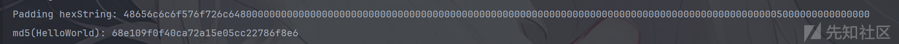

对比调用python库的结果：

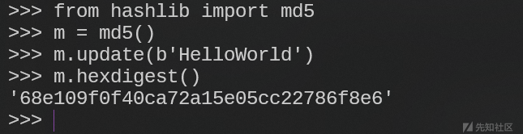

### 4. 简化Hash代码

4个线性函数的操作几乎相同，所以这里采用简化操作，将迭代改成循环，将所有的下标、伪随机数、循环移位的位数设置成数组，幻数也设置成常量，放入`constants.h`中：

```
#ifndef CONSTANTS_H  
#define CONSTANTS_H  

typedef unsigned char uint8_t;  
typedef unsigned short uint16_t;  
typedef unsigned int uint32_t;  

// 初始化幻数  
const uint32_t A = 0x67452301;  
const uint32_t B = 0xEFCDAB89;  
const uint32_t C = 0x98BADCFE;  
const uint32_t D = 0x10325476;

// 定义4*4位移矩阵  
inline uint8_t shiftBits[4][4] = {  
    {7, 12, 17, 22},  
    {5, 9, 14, 20},  
    {4, 11, 16, 23},  
    {6, 10, 15, 21}  
};  

// 定义4*16伪随机数矩阵  
inline uint32_t pseudoRandom[4][16] = {  
    {   
        0xd76aa478, 0xe8c7b756, 0x242070db, 0xc1bdceee,  
        0xf57c0faf, 0x4787c62a, 0xa8304613, 0xfd469501,  
        0x698098d8, 0x8b44f7af, 0xffff5bb1, 0x895cd7be,  
        0x6b901122, 0xfd987193, 0xa679438e, 0x49b40821  
    },  
    {   
        0xf61e2562, 0xc040b340, 0x265e5a51, 0xe9b6c7aa,  
        0xd62f105d, 0x02441453, 0xd8a1e681, 0xe7d3fbc8,  
        0x21e1cde6, 0xc33707d6, 0xf4d50d87, 0x455a14ed,  
        0xa9e3e905, 0xfcefa3f8, 0x676f02d9, 0x8d2a4c8a  
    },  
    {       
        0xfffa3942, 0x8771f681, 0x6d9d6122, 0xfde5380c,  
        0xa4beea44, 0x4bdecfa9, 0xf6bb4b60, 0xbebfbc70,  
        0x289b7ec6, 0xeaa127fa, 0xd4ef3085, 0x04881d05,  
        0xd9d4d039, 0xe6db99e5, 0x1fa27cf8, 0xc4ac5665  
    },  
    {        
        0xf4292244, 0x432aff97, 0xab9423a7, 0xfc93a039,  
        0x655b59c3, 0x8f0ccc92, 0xffeff47d, 0x85845dd1,  
        0x6fa87e4f, 0xfe2ce6e0, 0xa3014314, 0x4e0811a1,  
        0xf7537e82, 0xbd3af235, 0x2ad7d2bb, 0xeb86d391  
    }  
};  

// 定义  
inline uint8_t groupsIndex[4][16] = {  
    {0,0x1,0x2,0x3,0x4,0x5,0x6,0x7,0x8,0x9,0xA,0xB,0xC,0xD,0xE,0xF},  
    {0x1,0x6,0xB,0,0x5,0xA,0xF,0x4,0x9,0xE,0x3,0x8,0xD,0x2,0x7,0xC},  
    {0x5,0x8,0xB,0xE,0x1,0x4,0x7,0xA,0xD,0,0x3,0x6,0x9,0xC,0xF,0x2},  
    {0,0x7,0xE,0x5,0xC,0x3,0xA,0x1,0x8,0xF,0x6,0xD,0x4,0xB,0x2,0x9}  
};  

#endif //CONSTANTS_H

```

将`FF、GG、HH、II`四个非线性函数定义为函数指针数组，通过`roundFunctions.size()`的循环进行调用：

```
MD5.h:
using RoundFunction = uint32_t (MD5::*)(uint32_t, uint32_t, uint32_t, uint32_t, uint32_t, uint32_t, uint32_t);

MD5.cpp:
void MD5::transByRange(vector<uint32_t> &v, vector<uint32_t> &res) {
    RoundFunction roundFunctions[] = {&MD5::FF, &MD5::GG, &MD5::HH, &MD5::II};
    ...
    for (size_t i = 0; i < 4; i++) {  
        this->*roundFunctions[i](...);      
    }
    ...
}

```

内层循环这里由于伪随机数、移位位数、信息传入顺序都跟调用的非线性函数是一一对应的，所以通过一个for循环取不同的伪随机数数组、移位位数的数组、以及信息传入顺序的数组，再通过i的值判断调用的非线性函数，进入到内层循环对幻数进行Hash，几个矩阵的外层数组都是4，一一对应着每个函数每次迭代时需要的参数，内层则通过内层循环的k进行取值，对于shiftBits需要对4取余进行取值，这里k从16开始的原因是迭代顺序为`A->D->C->B`，所以第二次迭代时res传入的顺序为`res[3]->res[0]->res[1]->res[2]`

```
void MD5::transByRange(vector<uint32_t> &v, vector<uint32_t> &res) {  
    RoundFunction roundFunctions[] = {&MD5::FF, &MD5::GG, &MD5::HH, &MD5::II};  

    for (size_t i = 0; i < 4; i++) {  
        uint32_t* pseudo = pseudoRandom[i];  
        uint8_t* shift =  shiftBits[i];  
        uint8_t* groupIndex = groupsIndex[i];  

        for (size_t k = v.size(); k > 0 ; k--) {  
            res[k % 4] = (this->*roundFunctions[i])(  
                res[k % 4],  
                res[(k + 1) % 4],  
                res[(k + 2) % 4],  
                res[(k + 3) % 4],  
                v[groupIndex[16 - k]],  
                pseudo[16 - k],  
                shift[(16 - k) % 4]);  
        }  
    }  
}

```

通过循环取值时传入的参数跟迭代类似，只不过此时只需要传入`vector<uint32_t>`即可：

```
vector<uint32_t> MD5::updateRange(vector<vector<uint32_t>> &groups) {  
    // 将初始幻数存入  
    vector<uint32_t> res = {A, B, C, D};  

    // 将输入信息切换成小端序：abcd->0x34333231  
    for (size_t i = 0; i < groups.size(); i++) {  
        this->encode(groups[i]);  
    }  
    size_t i = 0;  
    while (i < groups.size()) {  
        vector<uint32_t> tmp = res;  
        this->transByRange(groups[i], tmp);  
        for (size_t j = 0; j < 4; j++) {  
            res[j] += tmp[j];  
        }  
        i++;  
    }

    // Hash后切回大端序并返回  
    this->decode(res);  
    return res;  
}

```

单元测试：

```
TEST(TestMD5, testUpdateByRange) {  
    char input[] = "HelloWorld";  

    // 初始化  
    vector<uint8_t> plaintext;  
    plaintext.insert(plaintext.end(), input, input+sizeof(input)-1);  

    // 填充  
    MD5 md5;  
    md5.padding(plaintext);  
    // 分组  
    vector<vector<uint32_t>> groups = md5.blockText(plaintext);  
    // Hash  
    vector<uint32_t> res = md5.updateIterator(groups);  
    // 输出  
    cout << "md5(" << input << "): ";  
    for (size_t i = 0; i < res.size(); i++) {  
        cout << hex << res[i];  
    }}

```

同样可以成功输入结果

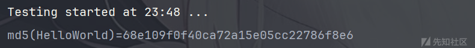

通过main函数调用`testing::InitGoogleTest(&argc, argv);`， GoogleTest会自动测量每个TEST用例执行的时间，通过该方式比较两个算法下执行时间的差距，经过三次测试，可以发现两种算法的执行效率并无明显区别，通过循环替代直接迭代的算法也无显著影响md5的hash效率：

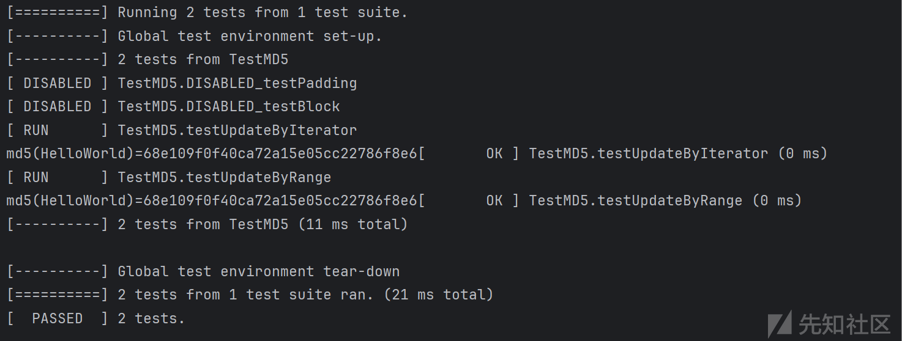

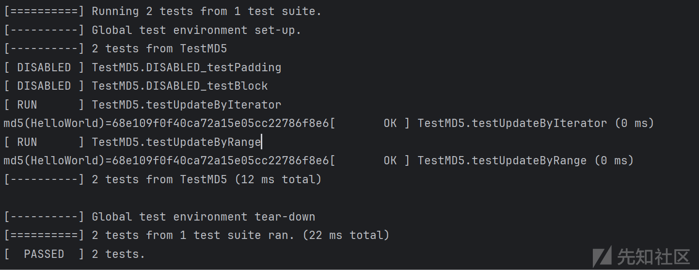

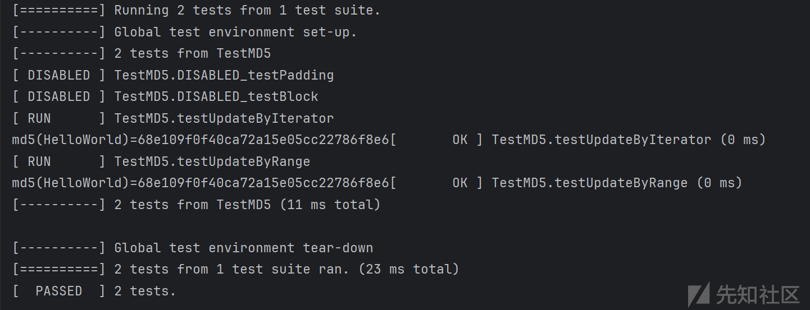

测试填充后分组大于1的信息：

```
TEST(TestMD5, testRound2) {  
    char input[] = "abcdefghijklmnopqrstuvwxyzABCDEFGHIJKLMNOPQRSTUVWXYZ0123456789";  
    // 初始化  
    vector<uint8_t> plaintext;  
    plaintext.insert(plaintext.end(), input, input+sizeof(input)-1);  

    // 填充  
    MD5 md5;  
    md5.padding(plaintext);  
    // 分组  
    vector<vector<uint32_t>> groups = md5.blockText(plaintext);  
    // Hash  
    vector<uint32_t> res = md5.updateRange(groups);  
    // 输出  

    cout << "md5(" << input << ")=";  
    for (size_t i = 0; i < res.size(); i++) {  
        cout << hex << res[i];  
    }  
}

```


封装单元测试：

```
class TestMD5 : public ::testing::Test {  
protected:  
    MD5 md5; // Instance of MD5 class for each test  

    string calculateMD5(const string& input, int choice) {  
        vector<uint8_t> plaintext;  
        plaintext.insert(plaintext.end(), input.begin(), input.end());  

        md5.padding(plaintext);  
        vector<vector<uint32_t>> groups = md5.blockText(plaintext);  
        vector<uint32_t> res;  
        if (choice == 1) {  
            res = md5.updateRange(groups);  
        } else {  
            res = md5.updateIterator(groups);  
        }  
        stringstream ss;  
        for (size_t i = 0; i < res.size(); i++) {  
            ss << hex << setw(8) << setfill('0') << res[i]; // Pad with zeros for consistent output  
        }  
        return ss.str();  
    }  

};

```

此时单元测试类为TestMD5，单元测试方式由TEST改为TEST\_F，分别测试调用迭代器和循环执行的结果是否都正确，并且测试多组信息下结果是否正确：

```
TEST_F(TestMD5, testUpdateByRange) {  
    const char input[] = "123456";  
    string res = calculateMD5(input, 1);  
    string expected = "e10adc3949ba59abbe56e057f20f883e";  
    ASSERT_EQ(expected, res);  
}  

TEST_F(TestMD5, testUpdateByIterator) {  
    const char input[] = "123456";  
    string res = calculateMD5(input, 2);  
    string expected = "e10adc3949ba59abbe56e057f20f883e";  
    ASSERT_EQ(expected, res);  
}  

TEST_F(TestMD5, testMultiGroup) {  
    const char input[] = "abcdefghijklmnopqrstuvwxyzABCDEFGHIJKLMNOPQRSTUVWXYZ0123456789";  
    string res = calculateMD5(input, 1);  
    string expect_hash = "76658de2ac7d406f93dfbe8bb6d9f549";  
    ASSERT_EQ(res, expect_hash);  
}

```

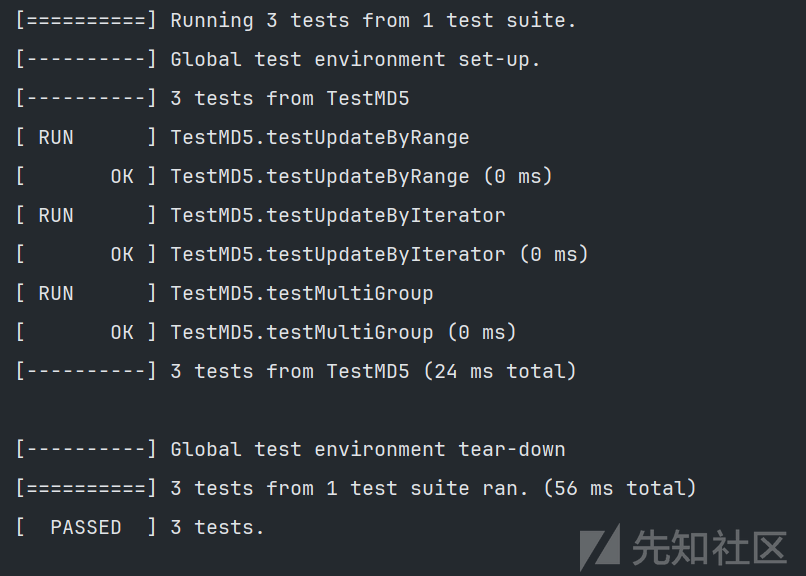

### 5. 总结

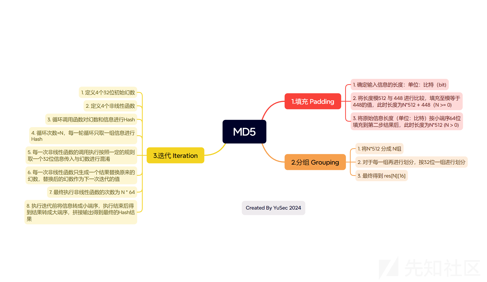
