# ctf中的字节爆破-先知社区

> **来源**: https://xz.aliyun.com/news/16459  
> **文章ID**: 16459

---

# 方法

比赛中的加密方法都是单字节或者多字节进行加密，因此我们可以使用字节爆破的方法进行解决

# 方法一 exit返回下标

原理就是通过exit返回得到比对成功的下标值，以此作为当前字节或者字节组合是否正确的依据

例题为吾杯ctf re的love题目

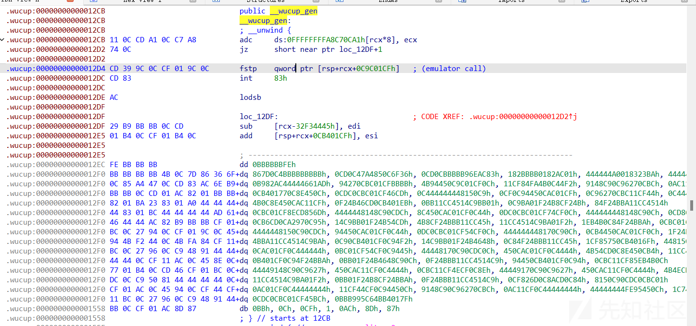

这题目进行修改前还需要进行一些操作，可以看到当前段是需要解密的，我们可以依据函数调用的时候前面进行对栈的操作反堆得到需要异或的值

idc脚本

```
#include <idc.idc>

static main()
{
    auto des = 0x176d;
    auto addr=0x155f;
    auto i;
    for(i = 0;addr+i!=des; ++i){
        PatchByte(addr+i,Byte(addr+i)^0x43);
    }
}
```

```
#include <idc.idc>

static main()
{
    auto des = 0x155f;
    auto addr=0x12CB;
    auto i;
    for(i = 0;addr+i!=des; ++i){
        PatchByte(addr+i,Byte(addr+i)^0x44);
    }
}
```


即可恢复函数内容

依次分析，先检查了输入的flag开头是否为wucup

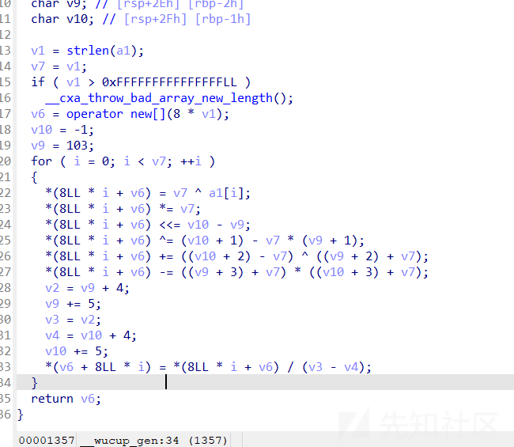

加密内容相对简单，就是单字节的加密方式，往往采取爆破的方式

开始修改程序

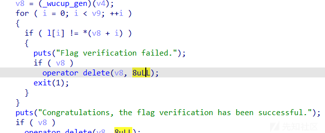

修改此次，当比较错误字节exit当前的下标值，编写python脚本接收退出值，实现爆破

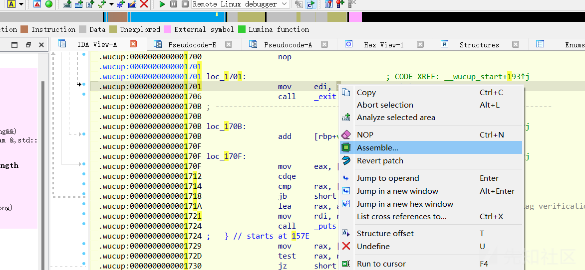

找到修改的位置修改汇编

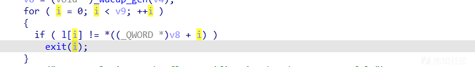

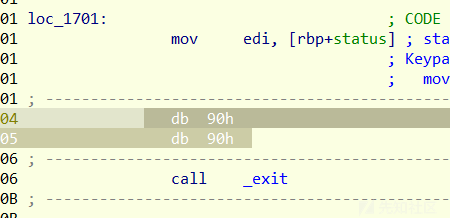

完成修改

脚本

```
import string
import itertools
import subprocess
import time

from paramiko.util import mod_inverse

alp = "0123456789abcdefghijklmnopqrstuvwxyzABCDEFGHIJKLMNOPQRSTUVWXYZ!\"#$%&'()*+,-./:;<=>?@[\]^_`{|}~"

input_data = "WuCup{aaaaaaaaaaaaaaaaaaaa}"
exe_file_path = r"/home/ubuntu/pycharm/cx/pythonProject/love"  # File directory
star = ord('0') + 1
flag=0
ans = ''
for i in range(6,len(input_data)-1):
    for chars in itertools.product(alp, repeat=1):
        modified_data = (input_data[:i * 1] + ''.join(chars) + input_data[(i + 1) * 1:])

        process = subprocess.Popen(
            exe_file_path,
            stdin=subprocess.PIPE,
            stdout=subprocess.PIPE,
            stderr=subprocess.PIPE,
            text=True
        )

        stdout, stderr = process.communicate(input=modified_data)
        print(process.returncode)
        print(modified_data)
        print(stdout)
        if process.returncode>flag:
            flag=process.returncode

            #print(modified_data)
            input_data=modified_data
            break

        if "Congratulations" in stdout:
            print(stdout)
            print(modified_data)
            exit(0)

    print(input_data)
```

注意因为该文件需要在ubuntu等linux环境下运行

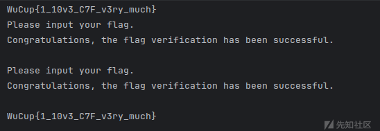

完成爆破

# 方法二 通过回显进行爆破

整体的思路都是类似的

例题 buildctf的ezvm

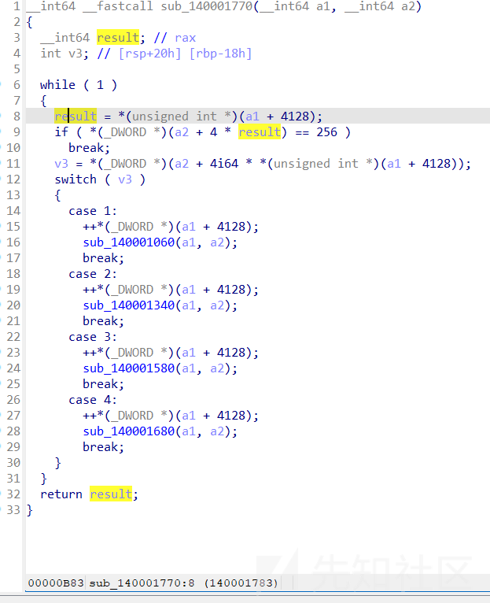

这题是常见的棘手题目但是依旧可以爆破解决

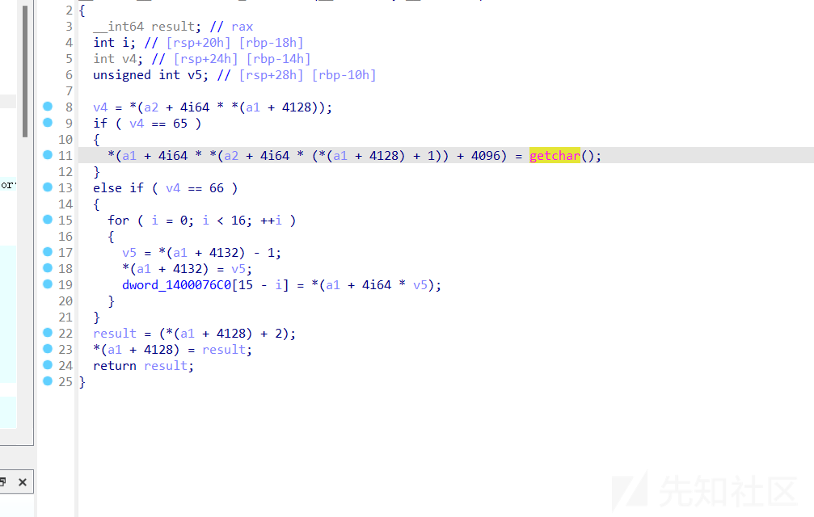

这里就是读取字符串的位置，但是这题是有一些需要注意的，vm题目会有op值指定对应的操作，动态调试会发现，是连续执行两次这个操作，意味着就是双字节加密

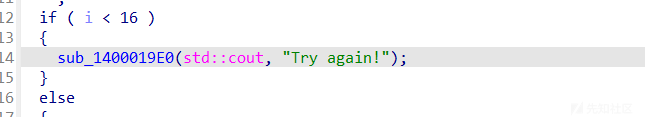

本次修改的位置

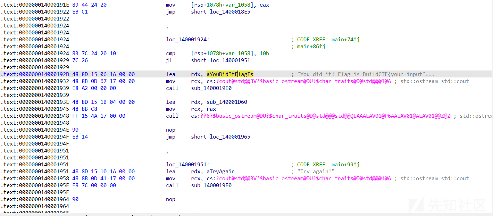

修改流程

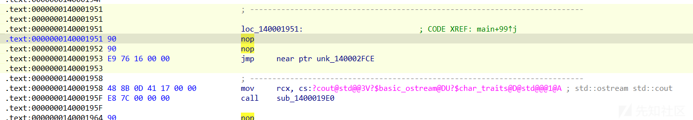

这里jmp是因为空间不够 jmp到空地方进行编写


修改后的程序

脚本

```
import string
import itertools
import subprocess
import time

alp = "0123456789abcdefghijklmnopqrstuvwxyzABCDEFGHIJKLMNOPQRSTUVWXYZ!\"#$%&'()*+,-./:;<=>?@[\]^_`{|}~"

input_data = "!!!!!!!!!!!!!!!!!"
exe_file_path = r"D:\桌面\ez_vm\ez_vm\ez_vm.exe"  # File directory
star = ord('A') + 2
ans = ''
for i in range(len(input_data)//2):
    for chars in itertools.product(alp, repeat=2):
        modified_data = (input_data[:i * 2] + ''.join(chars) + input_data[(i + 1) * 2:])

        process = subprocess.Popen(
            exe_file_path,
            stdin=subprocess.PIPE,
            stdout=subprocess.PIPE,
            stderr=subprocess.PIPE,
            text=True
        )
        print(modified_data)
        stdout, stderr = process.communicate(input=modified_data)
        flag_prompt = "Please input your flag :"
        output_after_flag_prompt = stdout.split(flag_prompt, 1)[-1].strip() if flag_prompt in stdout else ""

        num = output_after_flag_prompt
        if num == chr(star):
            ans += ''.join(chars)
            input_data = modified_data
            print('[!]\t' + ans)
            star += 2
            break
        elif 'You did it! Flag is ' in num:
            ans += ''.join(chars)
            print('[!]\t' + ans)
            exit(0)
        else:
            continue
# vMp_1s_r0u9h_ORZ
```

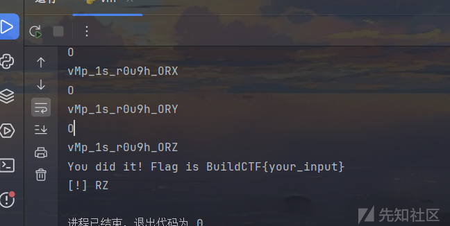

# 总结

总结爆破的方法很多这里只是列举几个常见的方法，整体的思路就是让程序返回一个值用于判断flag的正确位数
