# codeql 之 SSRF 漏洞自动化 寻找-先知社区

> **来源**: https://xz.aliyun.com/news/16467  
> **文章ID**: 16467

---

# codeql 之 SSRF 漏洞自动化 寻找

## 环境搭建

下载项目  
<https://github.com/l4yn3/micro_service_seclab>

然后放入 IDEA 即可，之后运行

这里主要研究 SSRF  
SSRF 的漏洞代码

```
package com.l4yn3.microserviceseclab.controller;

import com.squareup.okhttp.Call;
import com.squareup.okhttp.OkHttpClient;
import com.squareup.okhttp.Response;
import org.apache.http.HttpResponse;
import org.apache.http.client.methods.HttpGet;
import org.apache.http.impl.client.DefaultHttpClient;
import org.springframework.web.bind.annotation.RequestMapping;
import org.springframework.web.bind.annotation.RequestParam;
import org.springframework.web.bind.annotation.RestController;
import org.apache.http.client.fluent.Request;

import java.io.IOException;
import java.io.InputStream;
import java.net.HttpURLConnection;
import java.net.URL;

@RestController
@RequestMapping(value = "/ssrf")
public class SSRFController {

    @RequestMapping(value = "/one")
    public String One(@RequestParam(value = "url") String imageUrl) {
        try {
            URL url = new URL(imageUrl);
            HttpURLConnection connection = (HttpURLConnection) url.openConnection();
            connection.setRequestMethod("GET");
            return connection.getResponseMessage();
        } catch (IOException var3) {
            System.out.println(var3);
            return "Hello";
        }
    }

    @RequestMapping(value = "/two")
    public String Two(@RequestParam(value = "url") String imageUrl) {
        try {
            URL url = new URL(imageUrl);
            HttpResponse response = Request.Get(String.valueOf(url)).execute().returnResponse();
            return response.toString();
        } catch (IOException var1) {
            System.out.println(var1);
            return "Hello";
        }
    }

    @RequestMapping(value = "/three")
    public String Three(@RequestParam(value = "url") String imageUrl) {
        try {
            URL url = new URL(imageUrl);
            OkHttpClient client = new OkHttpClient();
            com.squareup.okhttp.Request request = new com.squareup.okhttp.Request.Builder().get().url(url).build();
            Call call = client.newCall(request);
            Response response = call.execute();
            return response.toString();
        } catch (IOException var1) {
            System.out.println(var1);
            return "Hello";
        }
    }
    @RequestMapping(value = "/four")
    public String Four(@RequestParam(value = "url") String imageUrl) {
        try {
            DefaultHttpClient client = new DefaultHttpClient();
            HttpGet get = new HttpGet(imageUrl);
            HttpResponse response = client.execute(get);
            return response.toString();
        } catch (IOException var1) {
            System.out.println(var1);
            return "Hello";
        }
    }

    @RequestMapping(value = "five")
    public String Five(@RequestParam(value = "url") String imageUrl) {
        try {
            URL url = new URL(imageUrl);
            InputStream inputStream = url.openStream();
            return String.valueOf(inputStream.read());
        } catch (IOException var1) {
            System.out.println(var1);
            return "Hello";
        }
    }
}

```

但是这个不太明显  
我修改了一下这样更好观察

```
package com.l4yn3.microserviceseclab.controller;

import com.squareup.okhttp.Call;
import com.squareup.okhttp.OkHttpClient;
import com.squareup.okhttp.Response;
import org.apache.http.HttpResponse;
import org.apache.http.client.methods.HttpGet;
import org.apache.http.impl.client.DefaultHttpClient;
import org.springframework.web.bind.annotation.RequestMapping;
import org.springframework.web.bind.annotation.RequestParam;
import org.springframework.web.bind.annotation.RestController;
import org.apache.http.client.fluent.Request;

import java.io.IOException;
import java.io.InputStream;
import java.net.HttpURLConnection;
import java.net.URL;

@RestController
@RequestMapping(value = "/ssrf")
public class SSRFController {

    @RequestMapping(value = "/one")
    public String One(@RequestParam(value = "url") String imageUrl) {
        try {
            URL url = new URL(imageUrl);
            HttpURLConnection connection = (HttpURLConnection) url.openConnection();
            connection.setRequestMethod("GET");
            return connection.getResponseMessage();
        } catch (IOException var3) {
            System.out.println(var3);
            return "Hello";
        }
    }

    @RequestMapping(value = "/two")
    public String Two(@RequestParam(value = "url") String imageUrl) {
        try {
            URL url = new URL(imageUrl);
            HttpResponse response = Request.Get(String.valueOf(url)).execute().returnResponse();
            return response.toString();
        } catch (IOException var1) {
            System.out.println(var1);
            return "Hello";
        }
    }

    @RequestMapping(value = "/three")
    public String Three(@RequestParam(value = "url") String imageUrl) {
        try {
            URL url = new URL(imageUrl);
            OkHttpClient client = new OkHttpClient();
            com.squareup.okhttp.Request request = new com.squareup.okhttp.Request.Builder().get().url(url).build();
            Call call = client.newCall(request);
            Response response = call.execute();
            return response.toString();
        } catch (IOException var1) {
            System.out.println(var1);
            return "Hello";
        }
    }
    @RequestMapping(value = "/four")
    public String Four(@RequestParam(value = "url") String imageUrl) {
        try {
            DefaultHttpClient client = new DefaultHttpClient();
            HttpGet get = new HttpGet(imageUrl);
            HttpResponse response = client.execute(get);
            return response.toString();
        } catch (IOException var1) {
            System.out.println(var1);
            return "Hello";
        }
    }

    @RequestMapping(value = "five")
    public String Five(@RequestParam(value = "url") String imageUrl) {
        try {
            URL url = new URL(imageUrl);
            InputStream inputStream = url.openStream();
            return String.valueOf(inputStream.read());
        } catch (IOException var1) {
            System.out.println(var1);
            return "Hello";
        }
    }
}

```

```
http://127.0.0.1:8888/ssrf/one?url=http://www.baidu.com

```

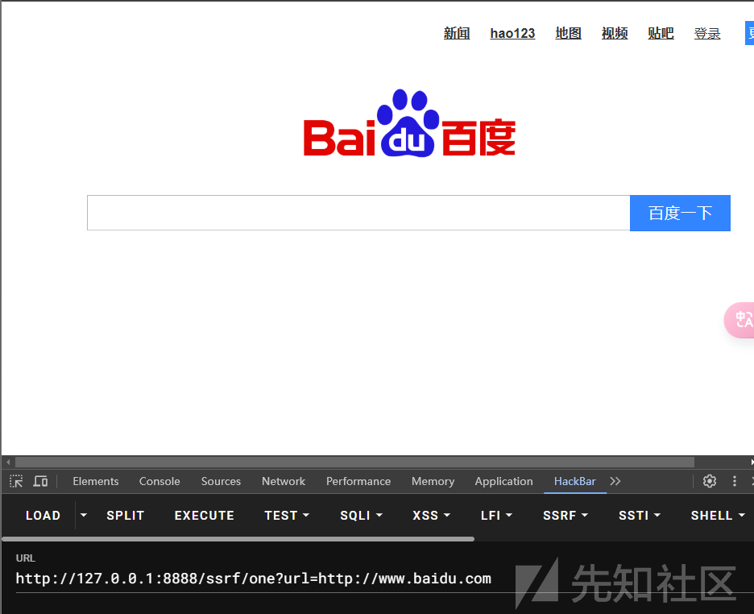  
成功

## 漏洞分析

我们首先需要看明白造成 SSRF 漏洞的类型

**HttpURLConnection 发起请求**

```
@RequestMapping(value = "/one")
public String One(@RequestParam(value = "url") String imageUrl) {
    try {
        URL url = new URL(imageUrl);
        HttpURLConnection connection = (HttpURLConnection) url.openConnection();
        connection.setRequestMethod("GET");
        return connection.getResponseMessage();
    } catch (IOException var3) {
        System.out.println(var3);
        return "Hello";
    }
}

```

HttpURLConnection 是 Java 标准库中的一个类，用于通过 URL 发起 HTTP 请求。这里直接将用户提供的 URL 用来创建连接，并发送 GET 请求

而且 URL 我们可以控制，造成了 ssrf

**Apache HttpClient**

```
@RequestMapping(value = "/two")
public String Two(@RequestParam(value = "url") String imageUrl) {
    try {
        URL url = new URL(imageUrl);
        HttpResponse response = Request.Get(String.valueOf(url)).execute().returnResponse();
        return response.toString();
    } catch (IOException var1) {
        System.out.println(var1);
        return "Hello";
    }
}

```

这里使用了 Apache HttpClient（通过 fluent API）发起 HTTP 请求。用户提供的 URL 被用来发起 GET 请求，并返回响应。

**OkHttp**

```
@RequestMapping(value = "/three")
public String Three(@RequestParam(value = "url") String imageUrl) {
    try {
        URL url = new URL(imageUrl);
        OkHttpClient client = new OkHttpClient();
        com.squareup.okhttp.Request request = new com.squareup.okhttp.Request.Builder().get().url(url).build();
        Call call = client.newCall(request);
        Response response = call.execute();
        return response.toString();
    } catch (IOException var1) {
        System.out.println(var1);
        return "Hello";
    }
}

```

OkHttp 是一个比 HttpURLConnection 和 HttpClient 更现代的 HTTP 客户端，它的设计更注重性能和易用性。

**DefaultHttpClient**

```
@RequestMapping(value = "/four")
public String Four(@RequestParam(value = "url") String imageUrl) {
    try {
        DefaultHttpClient client = new DefaultHttpClient();
        HttpGet get = new HttpGet(imageUrl);
        HttpResponse response = client.execute(get);
        return response.toString();
    } catch (IOException var1) {
        System.out.println(var1);
        return "Hello";
    }
}

```

这段代码使用的是 Apache HttpClient 中的 DefaultHttpClient 类，HttpGet 请求方式用于发起 HTTP 请求。DefaultHttpClient 是 HttpClient 的一个实现，它提供了更丰富的功能和配置选项。

**openStream**

```
@RequestMapping(value = "five")
public String Five(@RequestParam(value = "url") String imageUrl) {
    try {
        URL url = new URL(imageUrl);
        InputStream inputStream = url.openStream();
        return String.valueOf(inputStream.read());
    } catch (IOException var1) {
        System.out.println(var1);
        return "Hello";
    }
}

```

URL.openStream() 方法打开用户提供的 URL 并读取数据。openStream() 方法本质上是执行了一次 HTTP 请求，获取响应的字节流。

## codeql 分析

首先就是 sink 点的匹配

官方的规则库相当的复杂，包含的类型远远比我们这五种多

其中定义在 RequestForgeryConfig 类

我们看注释

```
/**
* DEPRECATED: Use `RequestForgeryConfiguration` module instead.
*
* A taint-tracking configuration characterising request-forgery risks.
*/

```

描述请求伪造风险的污点跟踪配置。

我们的 SSRF 类型就属于 request-forgery 风险

### source 点分析

#### RemoteFlowSource

```
override predicate isSource(DataFlow::Node source) {
  source instanceof RemoteFlowSource and
  // Exclude results of remote HTTP requests: fetching something else based on that result
  // is no worse than following a redirect returned by the remote server, and typically
  // we're requesting a resource via https which we trust to only send us to safe URLs.
  not source.asExpr().(MethodCall).getCallee() instanceof UrlConnectionGetInputStreamMethod
}

```

首先是 RemoteFlowSource

我们跟进

```
/** A data flow source of remote user input. */
abstract class RemoteFlowSource extends SourceNode {
  /** Gets a string that describes the type of this remote flow source. */
  abstract string getSourceType();

  override string getThreatModel() { result = "remote" }
}

```

很明显看注释远程用户输入的数据流源

我们看到实现类，这里很多

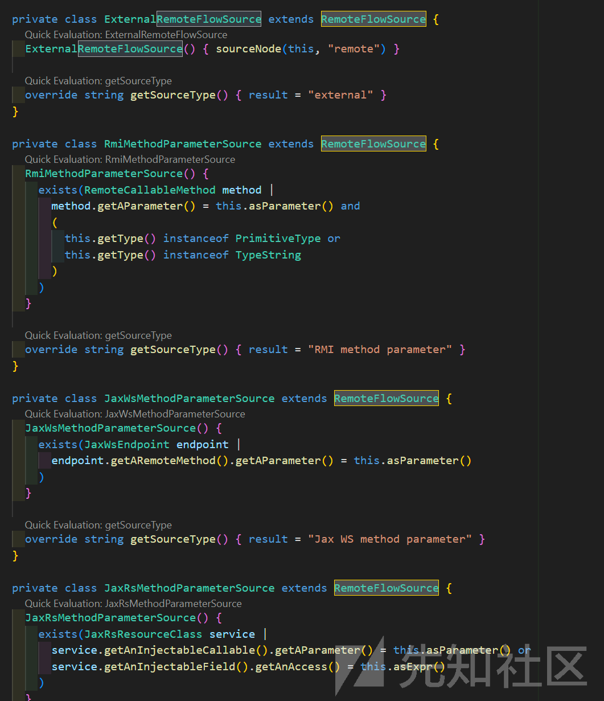

这里就拿

```
private class SpringServletInputParameterSource extends RemoteFlowSource {
  SpringServletInputParameterSource() {
    this.asParameter() = any(SpringRequestMappingParameter srmp | srmp.isTaintedInput())
  }

  override string getSourceType() { result = "Spring servlet input parameter" }
}

```

SpringServletInputParameterSource 来举个例子

首先我们需要知道什么是 SpringRequestMappingParameter 参数

这个就不跟了，因为也不是重点，就是

```
SpringRequestMappingParameter() { this.getCallable() instanceof SpringRequestMappingMethod }

```

参数的调用方法是 spring 中请求映射的方法即可，这个大家跟了就会明白

isTaintedInput 呢看注释就可以明白

```
predicate isTaintedInput() {
    this.isExplicitlyTaintedInput()
    or
    // Any parameter which is not explicitly identified, is consider to be an `@RequestParam`, if
    // it is a simple bean property) or a @ModelAttribute if not
    not this.isNotDirectlyTaintedInput()
  }
}

```

isTaintedInput() 是一个用于判断输入是否为污点的谓词

然后我们可以查查看  
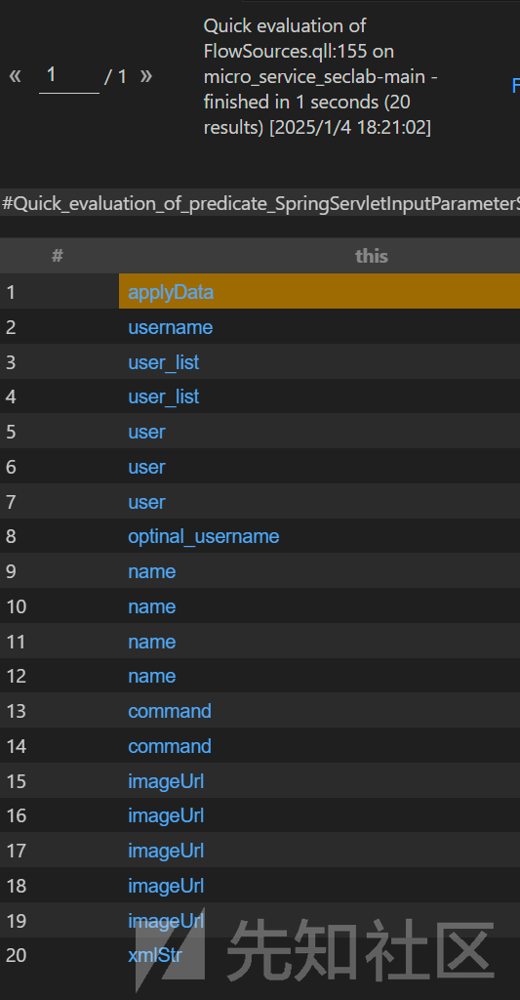

随便点几个

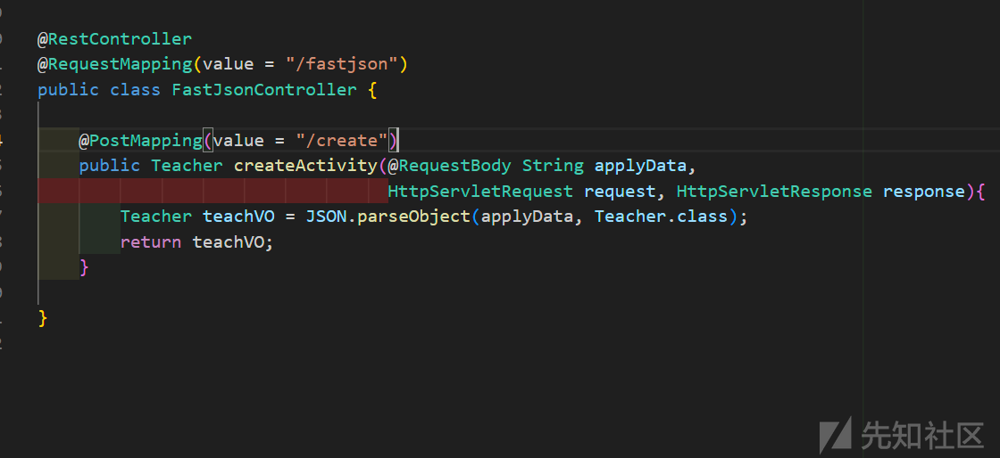

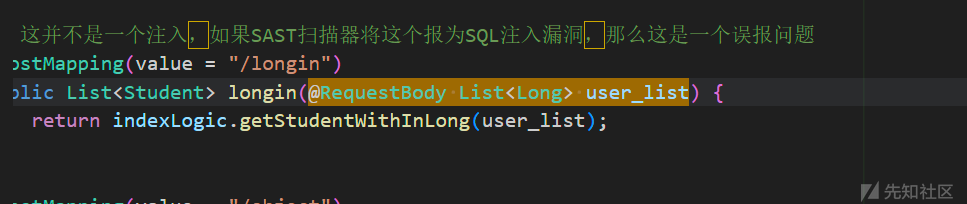

大家看这个截图应该能明白到底匹配了些什么 source，其实就是 spring 中用户可控的输入

#### 排除的 source

```
not source.asExpr().(MethodCall).getCallee() instanceof UrlConnectionGetInputStreamMethod

```

跟过去

```
/** The method `java.net.URLConnection::getInputStream`. */
class UrlConnectionGetInputStreamMethod extends Method {
  UrlConnectionGetInputStreamMethod() {
    this.getDeclaringType() instanceof TypeUrlConnection and
    this.hasName("getInputStream") and
    this.hasNoParameters()
  }
}

```

就是排除某些远程请求：然后，排除所有通过 HttpURLConnection.getInputStream 方法发起的远程请求。这是因为 getInputStream 方法通常用于安全地获取远程资源，例如通过 HTTPS 请求访问外部 URL，不把这些认为是可疑的

### Sink 点

```
override predicate isSink(DataFlow::Node sink) { sink instanceof RequestForgerySink }

```

跟进 RequestForgerySink 类

```
abstract class RequestForgerySink extends DataFlow::Node { }

private class DefaultRequestForgerySink extends RequestForgerySink {
  DefaultRequestForgerySink() { sinkNode(this, "request-forgery") }
}

```

他的实现类是 DefaultRequestForgerySink 类，而匹配的是 request-forgery 类型

sinkNode 就是标记特定的数据流的，而 request-forgery 表示被标记的类型

而我们怎么知道哪些是 request-forgery 类型呢？

codeql 有一堆配置好了的类型

我们可以全局搜索 request-forgery

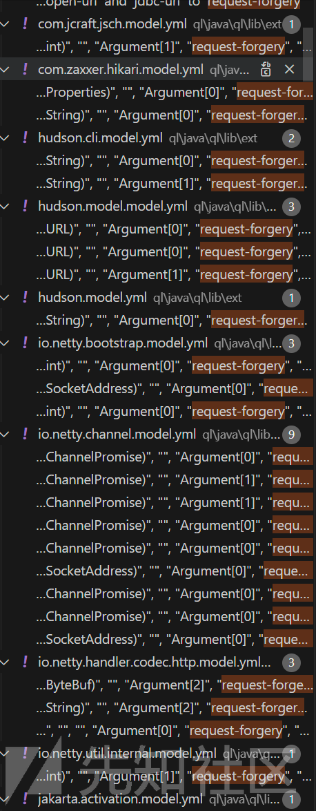  
可以看出来大概是以所在的包名来分的

比如 okhttp 这种很小众的

```
@RequestMapping(value = "/three")
public String Three(@RequestParam(value = "url") String imageUrl) {
    try {
        URL url = new URL(imageUrl);
        OkHttpClient client = new OkHttpClient();
        com.squareup.okhttp.Request request = new com.squareup.okhttp.Request.Builder().get().url(url).build();
        Call call = client.newCall(request);
        Response response = call.execute();
        return response.toString();
    } catch (IOException var1) {
        System.out.println(var1);
        return "Hello";
    }
}

```

我们找找这个包

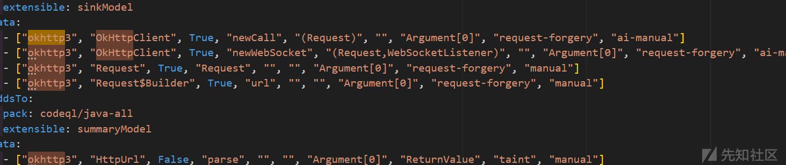  
可以看到是有的

### isAdditionalTaintStep

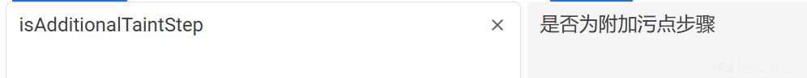

这个很好理解，就是可能污点不能从 a 到 b 去追踪，但是实际的情况 a 到 b 就是一个传播过程，这时候我们就需要自己去跟踪污点了

```
override predicate isAdditionalTaintStep(DataFlow::Node pred, DataFlow::Node succ) {
  any(RequestForgeryAdditionalTaintStep r).propagatesTaint(pred, succ)
}

```

跟进 RequestForgeryAdditionalTaintStep

```
private class TypePropertiesRequestForgeryAdditionalTaintStep extends RequestForgeryAdditionalTaintStep
{
  override predicate propagatesTaint(DataFlow::Node pred, DataFlow::Node succ) {
    exists(MethodCall ma |
      // Properties props = new Properties();
      // props.setProperty("jdbcUrl", tainted);
      // Propagate tainted value to the qualifier `props`
      ma.getMethod() instanceof PropertiesSetPropertyMethod and
      ma.getArgument(0).(CompileTimeConstantExpr).getStringValue() = "jdbcUrl" and
      pred.asExpr() = ma.getArgument(1) and
      succ.asExpr() = ma.getQualifier()
    )
  }
}

```

一共是两个具体的实现类

#### DefaultRequestForgeryAdditionalTaintStep

```
private class DefaultRequestForgeryAdditionalTaintStep extends RequestForgeryAdditionalTaintStep {
  override predicate propagatesTaint(DataFlow::Node pred, DataFlow::Node succ) {
    // propagate to a URI when its host is assigned to
    exists(UriCreation c | c.getHostArg() = pred.asExpr() | succ.asExpr() = c)
    or
    // propagate to a URL when its host is assigned to
    exists(UrlConstructorCall c | c.getHostArg() = pred.asExpr() | succ.asExpr() = c)
  }
}

```

其中 **UriCreation** 代表的是

```
class UriCreation extends Call {
UriCreation() {
  this.getCallee().getDeclaringType() instanceof TypeUri and
  (this instanceof ClassInstanceExpr or this.getCallee().hasName("create"))
}

```

比如

```
// 例 1：通过字符串创建 URI
URI uri1 = new URI("http://example.com/path");

// 例 2：通过 URI.create 创建 URI
URI uri2 = URI.create("http://example.com/path");

```

**UrlConstructorCall**代表的是

```
UrlConstructorCall() { this.getConstructor().getDeclaringType() instanceof TypeUrl }

```

也就是匹配构造函数的，不过匹配的是

```
URL url = new URL("http://example.com");  // 通过 URL 构造函数创建 URL 对象

```

一个是 URI，一个是 URL

而 propagatesTaint 方法就是我们逻辑的主要实现

比如 UriCreation

如果其主机部分（host） 被赋值为 pred.asExpr()（即当前污点源），并且 succ.asExpr()（即潜在的污点目标）是这个 UriCreation 对象时，污点就会从 pred 传播到 succ。

比如下面的代码

```
String userInput = request.getParameter("url");  // 假设这是用户输入的数据
URI uri = URI.create(userInput);  // 使用用户输入创建 URI 对象
URL url = new URL(userInput);  // 使用用户输入创建 URL 对象

```

我们的规则就是

当 userInput 被用作创建 URI 或 URL 时，污点就会从 userInput 传播到 uri 和 url 对象上。

如果没有那么我们的传播就是

**userInput-->URI.create(userInput)**  
这一步它会跟丢，找不到了

#### TypePropertiesRequestForgeryAdditionalTaintStep

```
private class TypePropertiesRequestForgeryAdditionalTaintStep extends RequestForgeryAdditionalTaintStep
{
  override predicate propagatesTaint(DataFlow::Node pred, DataFlow::Node succ) {
    exists(MethodCall ma |
      // Properties props = new Properties();
      // props.setProperty("jdbcUrl", tainted);
      // Propagate tainted value to the qualifier `props`
      ma.getMethod() instanceof PropertiesSetPropertyMethod and
      ma.getArgument(0).(CompileTimeConstantExpr).getStringValue() = "jdbcUrl" and
      pred.asExpr() = ma.getArgument(1) and
      succ.asExpr() = ma.getQualifier()
    )
  }
}

```

注释给的很清楚了

就是如下的这种也需要污点传播

```
Properties props = new Properties();
String userInput = request.getParameter("jdbcUrl");  // 假设这是用户输入的数据
props.setProperty("jdbcUrl", userInput);  // 设置 JDBC URL 为用户输入

```

通过这种方式，我们可以确保污点传播被追踪到 Properties 对象

### isSanitizer

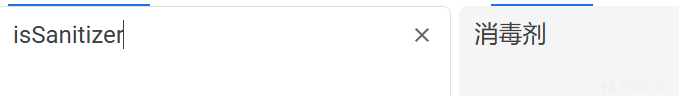  
emmm，理解为清理的意思吧，就是有些点不是我们的点，可能控制的部分并不能造成漏洞

```
override predicate isSanitizer(DataFlow::Node node) { node instanceof RequestForgerySanitizer }

```

跟进 RequestForgerySanitizer  
有许多的实现类

#### HostnameSantizer

```
HostnameSanitizingPrefix() {
    // Matches strings that look like when prepended to untrusted input, they will restrict
    // the host or entity addressed: for example, anything containing `?` or `#`, or a slash that
    // doesn't appear to be a protocol specifier (e.g. `http://` is not sanitizing), or specifically
    // the string "/".
    exists(this.getStringValue().regexpFind("([?#]|[^?#:/\\\\][/\\\\])|^/$", 0, offset))
  }

  override int getOffset() { result = offset }
}

/**
 * A value that is the result of prepending a string that prevents any value from controlling the
 * host of a URL.
 */
private class HostnameSantizer extends RequestForgerySanitizer {
  HostnameSantizer() { this.asExpr() = any(HostnameSanitizingPrefix hsp).getAnAppendedExpression() }
}

```

比如<http://example.com/page?name=value> 中的 ?name=value 是查询部分，我们只能控制后面的，这种就不算一个点

#### RelativeUrlSanitizer

```
private predicate isRelativeUrlSanitizer(Guard guard, Expr e, boolean branch) {
  guard =
    any(MethodCall call |
      call.getMethod().hasQualifiedName("java.net", "URI", "isAbsolute") and
      e = call.getQualifier() and
      branch = false
    )
}

/**
 * A check that the URL is relative, and therefore safe for URL redirects.
 */
private class RelativeUrlSanitizer extends RequestForgerySanitizer {
  RelativeUrlSanitizer() {
    this = DataFlow::BarrierGuard<isRelativeUrlSanitizer/3>::getABarrierNode()
  }
}

```

就是需要满足我们传入的是绝对的路径，这个 codeql 的代码还是很复杂的

比如这端代码

```
import java.net.URI;

public class UrlValidator {

    public static boolean validateUrl(String url) {
        URI uri = URI.create(url);

        // 检查URL是否是绝对的
        if (uri.isAbsolute()) {
            return true;  // 这是绝对 URL
        }
        return false;  // 这是相对 URL
    }

    public static void main(String[] args) {
        String testUrl = "http://example.com";
        boolean isValid = validateUrl(testUrl);
        System.out.println("Is valid: " + isValid);
    }
}

```

`call.getMethod().hasQualifiedName("java.net", "URI", "isAbsolute")`：这部分会匹配 URI 类中的 isAbsolute() 方法。

然后

`e = call.getQualifier()`：call.getQualifier() 返回的是 uri 对象，即调用 isAbsolute() 方法的那个对象。因此，e 需要与 uri 对象匹配。

branch = false：这意味着我们正在查找方法调用的“否”分支，也就是 uri.isAbsolute() 返回 false 的情况。

确保我们可控的是绝对的 uri

当然还有一些......大家自己看看

## codeql 实践

我们运行最后的代码  
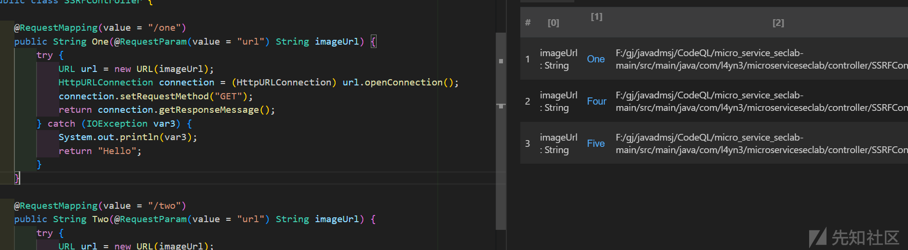

没有二和三  
只有三个从 sink 到 source 的点，但是我们是有五个的，这个的话就需要慢慢检测了

首先其实 sink 点是没有问题的

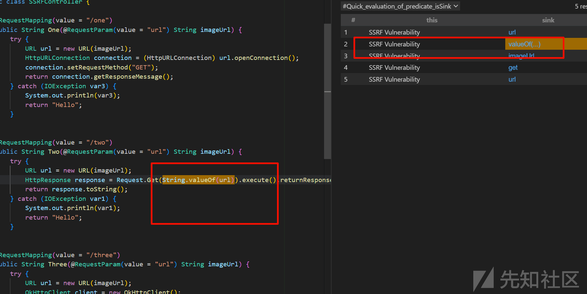  
问题出现在污点传播的过程中  
可以看到<https://forum.butian.net/share/2117位师傅>

问题出现是在正常情况下程序不会觉得 String.valueOf 方法返回的仍然是污点。

这里我们就需要自己去修改了

这里我们需要按照上面分析的同理去操作

还是回到这个代码  
RequestForgery.qll  
我们只需要续写一下 DefaultRequestForgeryAdditionalTaintStep

首先需要匹配到 valueOf 的代码，然后提取里面的参数

```
HttpResponse response = Request.Get(String.valueOf(url)).execute().returnResponse();

```

调用者是 String

首先我们去匹配这个类型

```
class TypeStringLib extends RefType {
  TypeStringLib() { this.hasQualifiedName("java.lang", "String") }
}

```

然后只需要使用如下的代码

```
class StringValue extends MethodAccess {
    StringValue(){
      this.getCallee().getDeclaringType() instanceof TypeStringLib and
      this.getCallee().hasName("valueOf")
    }
}

```

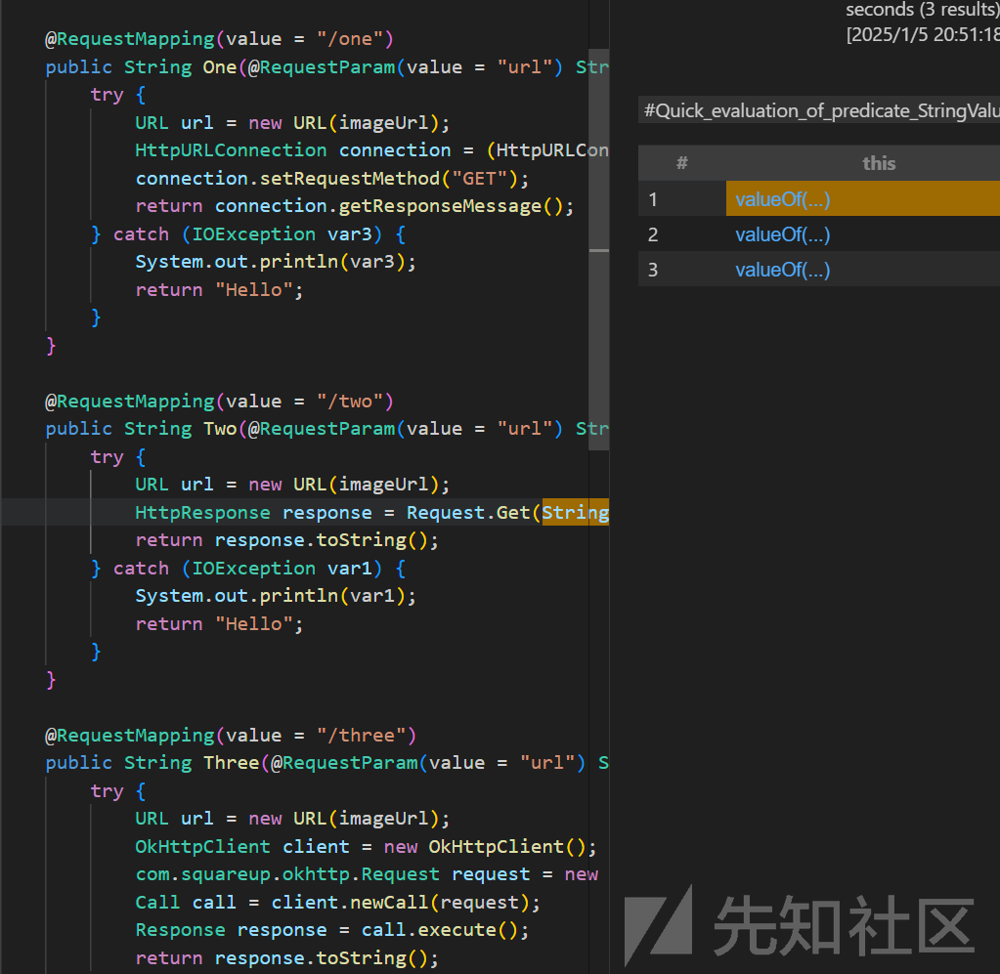  
成功的匹配到

然后续写

```
private class DefaultRequestForgeryAdditionalTaintStep extends RequestForgeryAdditionalTaintStep {
  override predicate propagatesTaint(DataFlow::Node pred, DataFlow::Node succ) {
    // propagate to a URI when its host is assigned to
    exists(UriCreation c | c.getHostArg() = pred.asExpr() | succ.asExpr() = c)
    or
    // propagate to a URL when its host is assigned to
    exists(UrlConstructorCall c | c.getHostArg() = pred.asExpr() | succ.asExpr() = c)
    or
    exists(StringValue c | c.getArgument(0) = pred.asExpr() | succ.asExpr() = c)
  }
}

```

然后我们再去查询

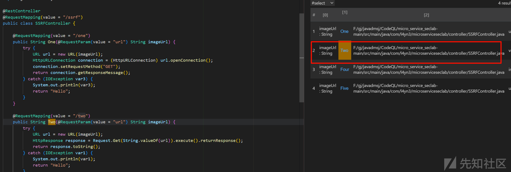

可以看到是已经成功了

参考<https://forum.butian.net/share/2117>
