# MaxKB远程命令执行漏洞分析(CVE-2024-56137)-先知社区

> **来源**: https://xz.aliyun.com/news/16468  
> **文章ID**: 16468

---

# 漏洞通告

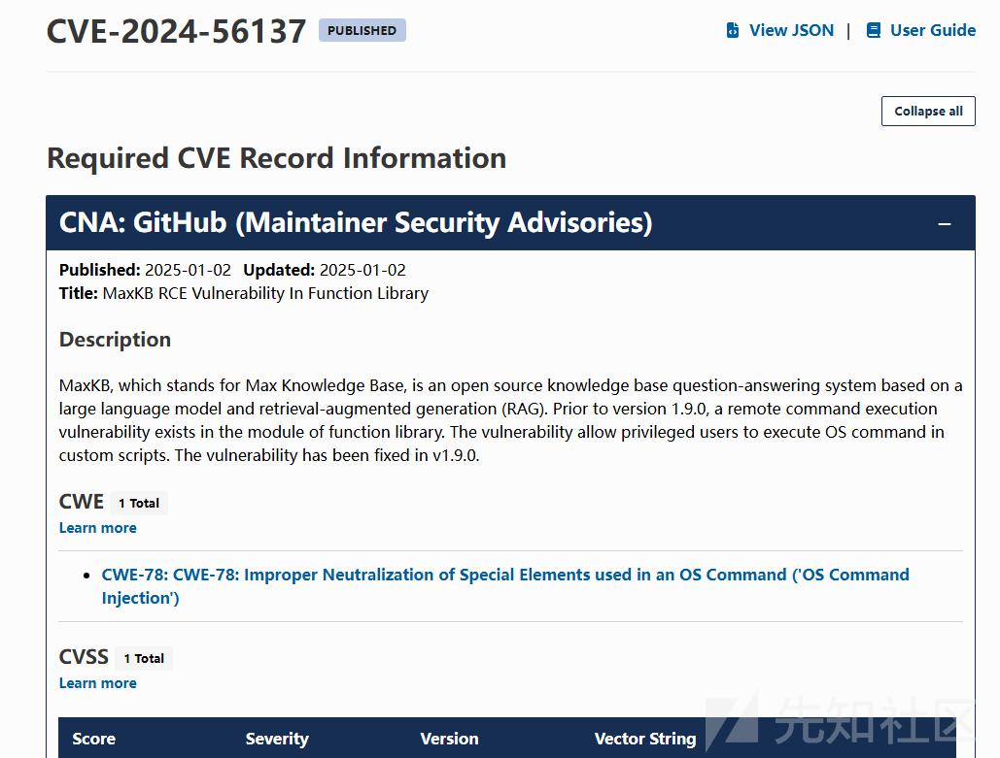

# 漏洞分析

根据文献了解这个是一个概念漏洞，是模块存在rce，并且1.9.0已经修复了；

关键漏洞触发点在`FunctionExecutor->exec_code`

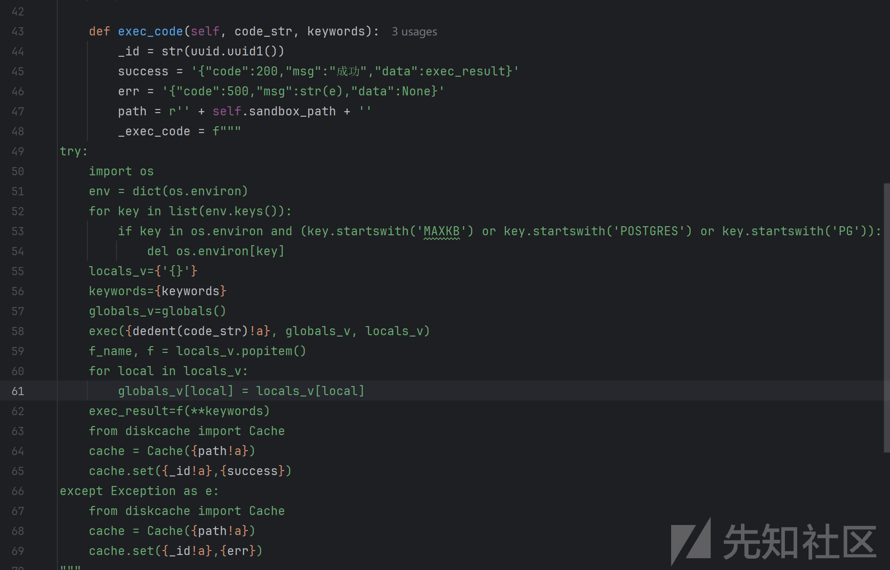

\_exec\_code被\_exec\_sandbox调用分析\_exec\_sandbox代码

传递进来的代码段被写入到了py文件里

通过subprocess.run来触发写入py文件的代码段

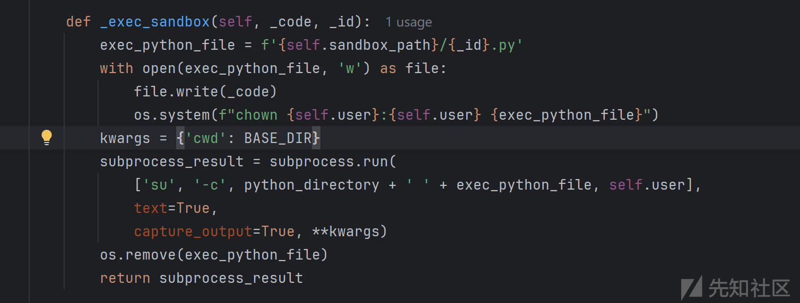

exec\_code在debug方法中

可以看到code是通过debug\_instance.get('code')获取的

debug\_instance是通过上层函数传递的继续向上分析

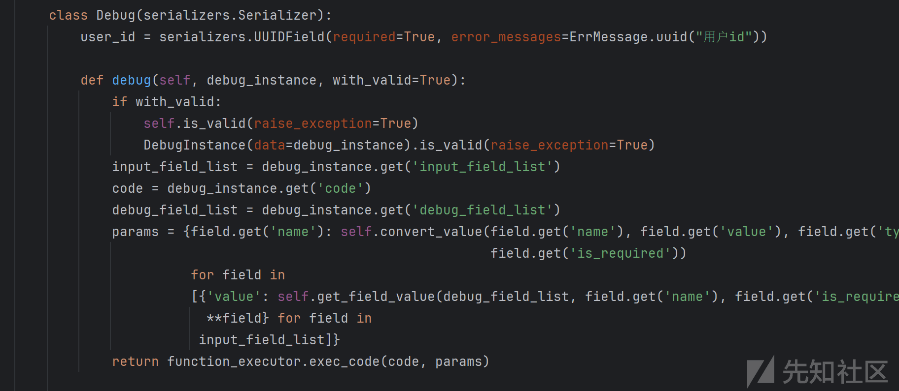

上层是`post`函数调用，`FunctionLibView`类继承了`from rest_framework.views import APIView`，这是一个Django框架，并且是函数的入口点接口是`debug` post请求

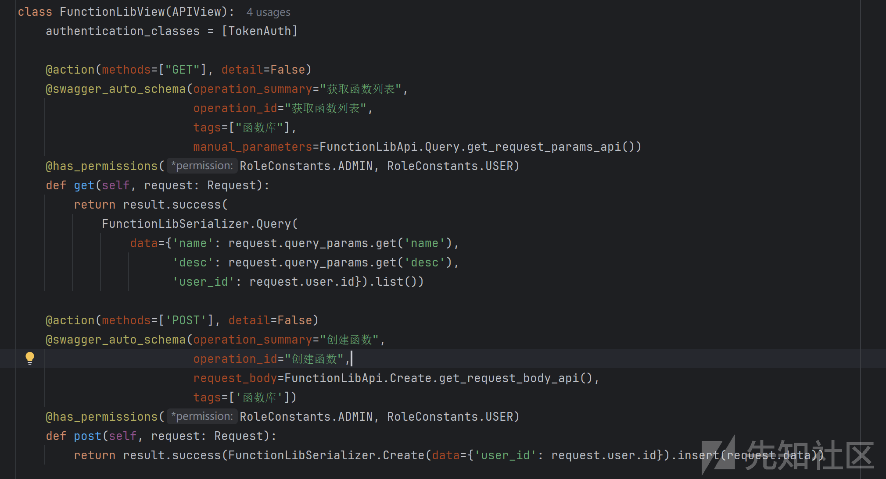

## 路由寻找

查看`urls.py`方法，看到了路由`function_lib/debug`指向`Debug`类，而且使用urls.py文件使用app\_name（空间命名），那么应该还存在一个项目的 URL 配置文件

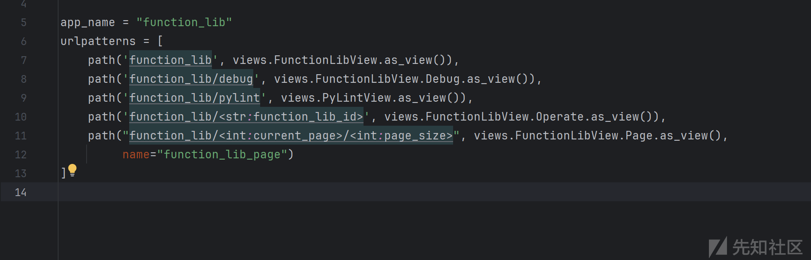

全局搜索function\_lib.urls关键字

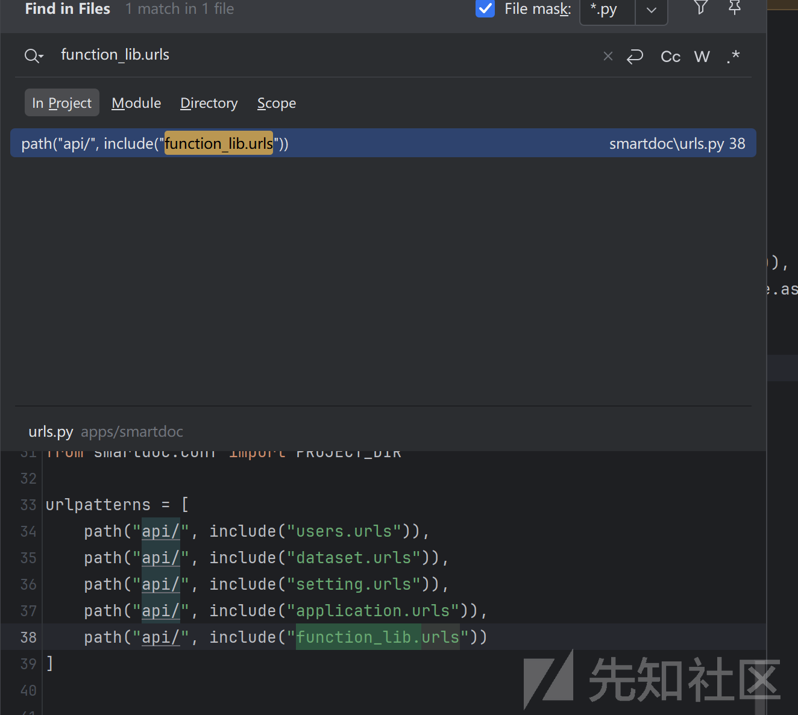

目前获取到触发漏洞的url地址是`/api/function_lib/debug`，参数是`code`

# 漏洞复现

根据官方文档搭建环境

登录后台

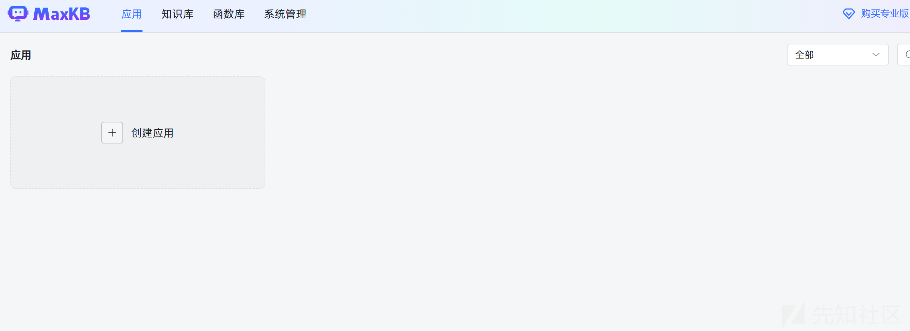

点击函数库，并创建函数代码

```
import subprocess

def runcmd():
    cmd = subprocess.run(["whoami"],capture_output=True,text=True)
    return cmd.stdout

```

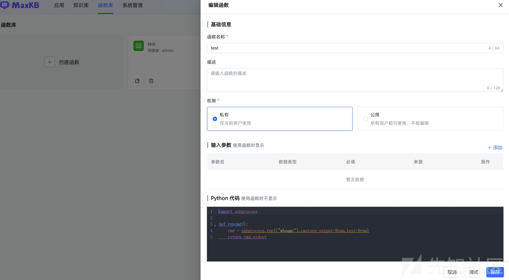

点击调试，命令执行成功。

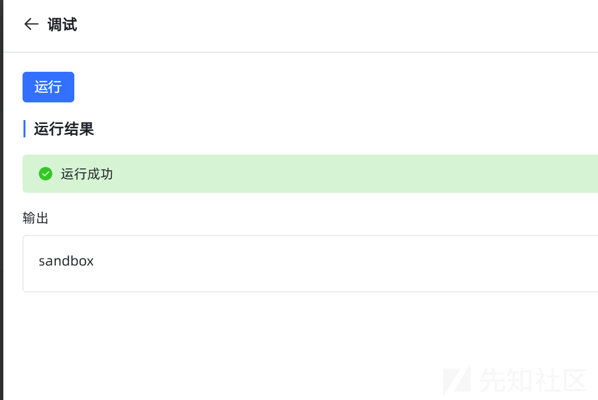

查看url地址，与推断的url地址一致

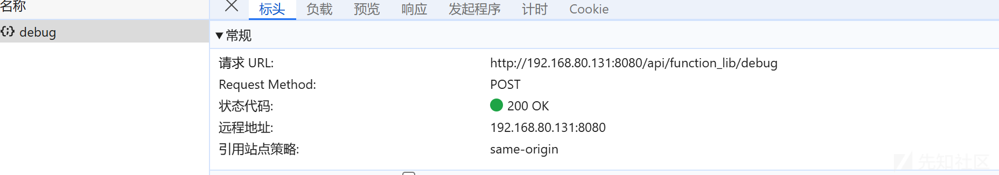
