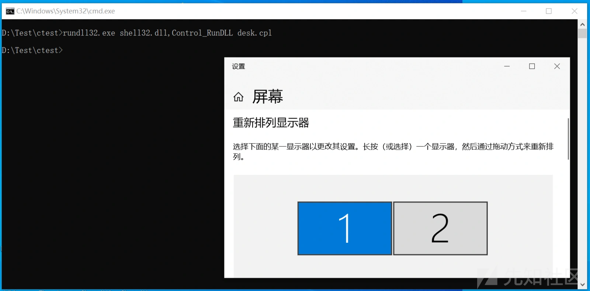
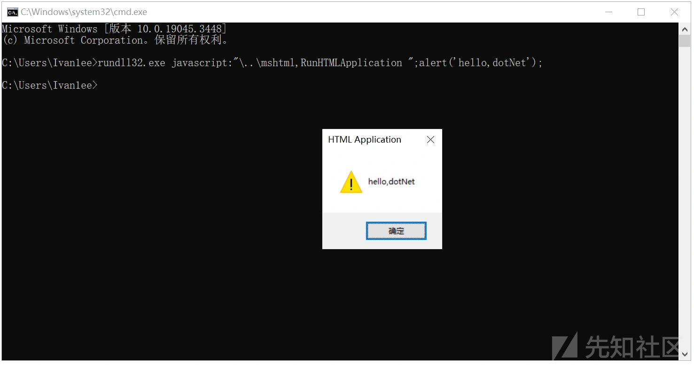
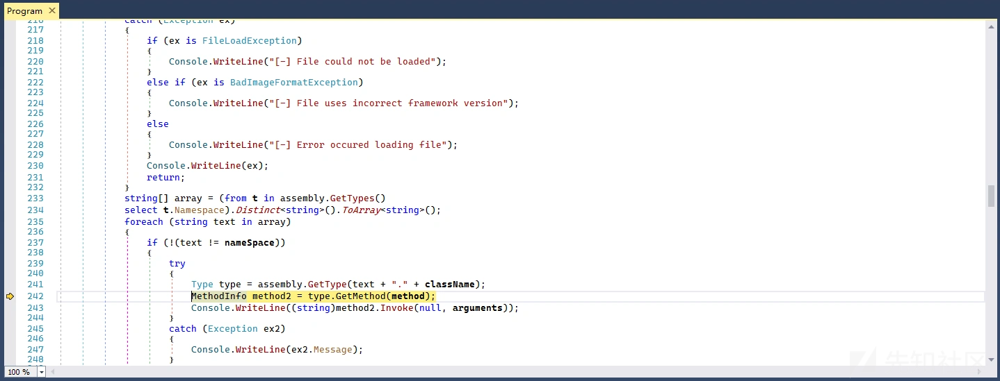
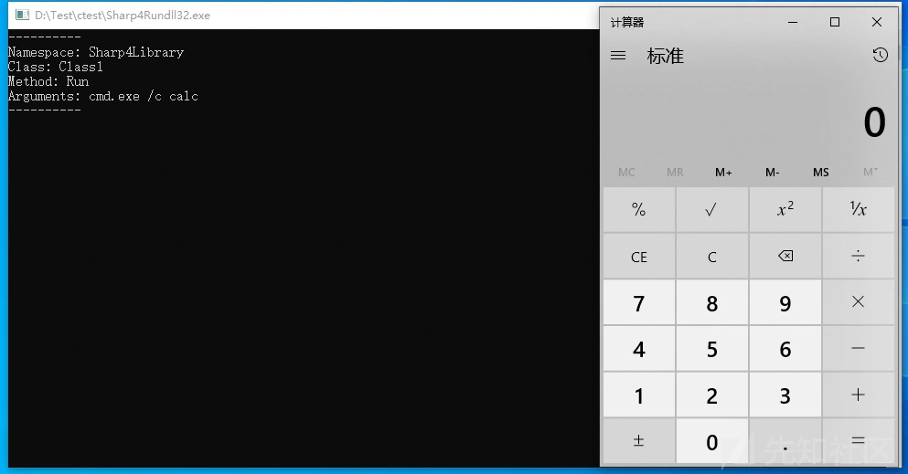

# Sharp4Rundll32：一款通过.NET反射实现Rundll32功能绕过安全防护的工具-先知社区

> **来源**: https://xz.aliyun.com/news/16475  
> **文章ID**: 16475

---

在攻防对抗中，攻击者常利用 .NET 提供的反射技术，通过动态加载外部 DLL 并调用其中的任意方法，实现灵活且隐蔽的恶意代码执行。这种技术无需提前绑定目标代码，能够有效规避静态检测，同时模仿类似 rundll32.exe 的行为，进一步提高攻击链的隐匿性。通过加载如 Sharp4Library.dll 的组件并动态调用其方法，攻击者可以轻松实现任意指令执行，为渗透测试和实际攻击提供强大的支持。

### 0x01 rundll32

rundll32.exe 是一个位于 Windows 系统 C:\Windows\System32 目录中的可执行文件。主要功能是通过加载C或C++编译的动态链接库中指定的函数来执行某些特定任务。在实际使用中， 以下是 rundll32.exe 典型的用法格式：

```
rundll32.exe <DLL路径>,<函数名> [参数]

```

比如，调用 Shell32.dll 中的 Control\_RunDLL 函数打开 Windows控制面板，具体命令如下所示。

```
rundll32.exe shell32.dll,Control_RunDLL desk.cpl

```



因此，系统管理员可以通过 rundll32.exe 在脚本中执行系统相关任务，如批量管理控制面板功能。  
由于 rundll32.exe 可以动态加载 DLL 并执行其函数，它也成为攻击者利用的一个常见目标，攻击者可以创建恶意 DLL，并通过 rundll32.exe 执行其中的恶意代码，比如通过RunHTMLApplication 函数，执行嵌入式的 HTML 和 JavaScript 代码。具体代码如下所示。

```
rundll32.exe javascript:"\..\mshtml,RunHTMLApplication ";alert('hello,dotNet');

```

执行上述命令后，将弹出一个消息框，内容为 "hello,dotNet"，如下图所示。



### 0x02 .NET 反射技术

反射是 .NET 提供的一种强大功能，可以在运行时动态获取类型信息（类、方法、属性、字段等），并进行实例化、调用方法或修改字段值。.NET 中反射的核心类都位于 System.Reflection 命名空间，.NET反射一般有以下几个步骤，首先通过 Assembly 类加载程序集，通常需要提供一个绝对的物理路径，并且使用LoadFrom或者LoadFile载入，具体代码如下所示。

```
using System.Reflection;
Assembly assembly = Assembly.LoadFrom("Sharp4Library.dll");
Assembly assembly = Assembly.LoadFile(@"C:\Path\To\Sharp4Library.dll");

```

接着，使用 Assembly 对象的GetType方法获取对象类型，具体如下所示。

```
Type specificType = assembly.GetType("Sharp4Library.Class1");
Console.WriteLine(specificType.FullName);

```

再通过反射创建对象的实例，最后，通过GetMethod、Invoke 方法进行调用，代码如下所示。

```
Type type = assembly.GetType("Sharp4Library.Class1");
ConstructorInfo ctor = type.GetConstructor(new Type[] { typeof(int), typeof(string) });
object instanceWithParams = ctor.Invoke(new object[] { 42, "Hello" });
MethodInfo method = type.GetMethod("Run");
method.Invoke(null, new object[] { arg1, arg2 });
object result = method.Invoke(instance, new object[] { arg1, arg2 });

```

.NET 反射是一种强大的技术，允许在运行时操作类型和成员。虽然反射灵活性高，但也有性能和安全问题。

### 0x03 使用 .NET 实现rundll32的功能

在 .NET 中，我们可以Sharp4Rundll32.exe这款工具实现类似的功能，该工具实现动态加载指定路径的 DLL 文件，调用 DLL 中的指定命名空间、类和方法，并传递自定义参数，实现复杂的功能调用，具体代码如下所示。

```
using System;
using System.IO;
using System.Linq;
using System.Reflection;

class Program
{
    public static void Main(string[] args)
    {
        if (args.Length < 4)
        {
            Console.WriteLine("用法: 程序路径.dll 命名空间 类名 方法名 [参数]");
            return;
        }
        string fullPath = args[0];
        string namespaceName = args[1];
        string className = args[2];
        string methodName = args[3];
        string[] methodArgs = args.Length > 4 ? args.Skip(4).ToArray() : new string[0];
        StdLoad(fullPath, namespaceName, className, methodName, methodArgs);
    }

    private static void StdLoad(string path, string nameSpace, string className, string method, string[] arguments)
    {
        Assembly assembly = null;
        try
        {
            assembly = Assembly.LoadFile(Path.GetFullPath(path));
        }
        catch (Exception ex)
        {
            if (ex is FileLoadException)
            {
                Console.WriteLine("[-] 文件无法加载");
            }
            else if (ex is BadImageFormatException)
            {
                Console.WriteLine("[-] 文件使用了错误的框架版本");
            }
            else
            {
                Console.WriteLine("[-] 加载文件时出错");
            }
            Console.WriteLine(ex);
            return;
        }
        var namespaces = (from t in assembly.GetTypes()
                          select t.Namespace).Distinct().ToArray();
        foreach (string ns in namespaces)
        {
           if (ns == nameSpace)
            {
                try
                {
                    Type type = assembly.GetType(ns + "." + className);
                    MethodInfo methodInfo = type.GetMethod(method);
                    object result = methodInfo.Invoke(null, arguments);
                    Console.WriteLine($"[+] 调用结果: {result}");
                }
                catch (Exception ex2)
                {
                    Console.WriteLine($"调用失败: {ex2.Message}");
                }
            }
        }
    }
}

```

上述代码中，通过从加载的 Assembly 对象中提取所有类型的命名空间，并去重后转换为数组 var namespaces。接着，再利用反射机制调用指定类型的指定方法，代码如下所示。

```
foreach (string ns in namespaces)
{
            if (ns == nameSpace)
            {
                try
                {
                    Type type = assembly.GetType(ns + "." + className);
                    MethodInfo methodInfo = type.GetMethod(method);
                    object result = methodInfo.Invoke(null, arguments);
                    Console.WriteLine($"[+] 调用结果: {result}");
                }
                catch (Exception ex2)
                {
                    Console.WriteLine($"调用失败: {ex2.Message}");
                }
            }
 }

```

此处的 ns + "." + className 拼接命名空间和类名，形成完整的类型名称，调用 assembly.GetType() 方法查找该类型，并且返回一个 Type 对象。最后，调用 methodInfo.Invoke() 执行方法。



假设我们有以下一个名为 Sharp4Library.dll 的第三方 DLL，包含以下类和方法：

```
namespace Sharp4Library
{
    public class Class1
    {
        public static string Run(string command, string arguments)
        {
            System.Diagnostics.Process.Start(command, arguments);
            return $"已执行: {command} {arguments}";
        }
    }
}

```

通过以下命令调用上述 DLL 的功能， 执行后将弹出计算器，具体命令如下所示。

```
Sharp4Rundll32.exe Sharp4Library.dll Sharp4Library Class1 Run cmd.exe /c calc

```




### 0x04 小结

综上，通过 .NET 的 Assembly.LoadFile 和反射机制，可以实现动态加载和调用 DLL 的功能。这种技术不仅能够满足动态扩展和模块化开发的需求，还能在特定场景下替代 rundll32.exe 的功能。
