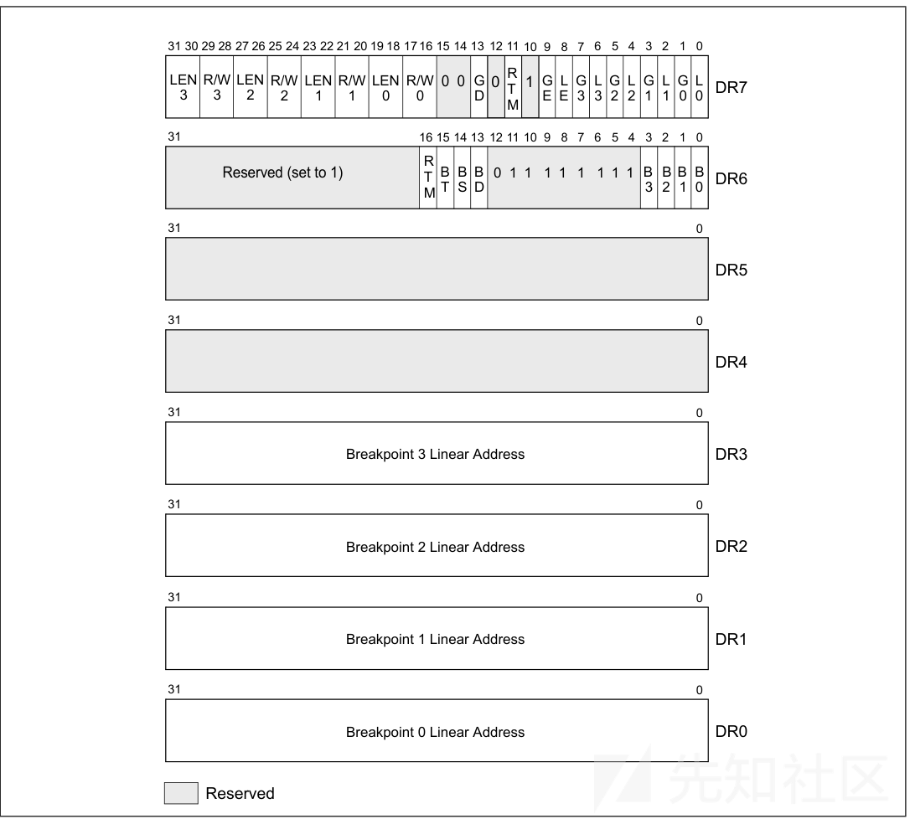
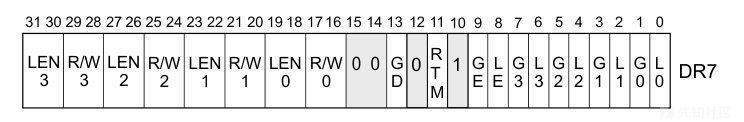
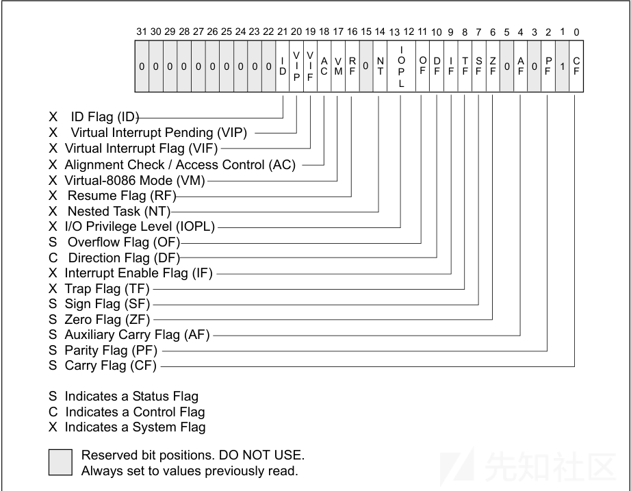
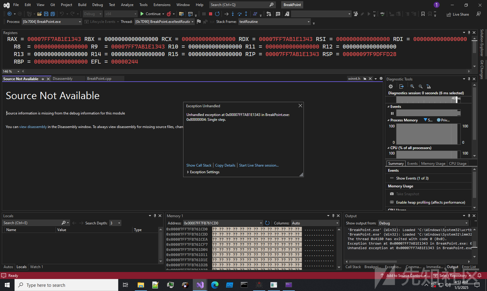
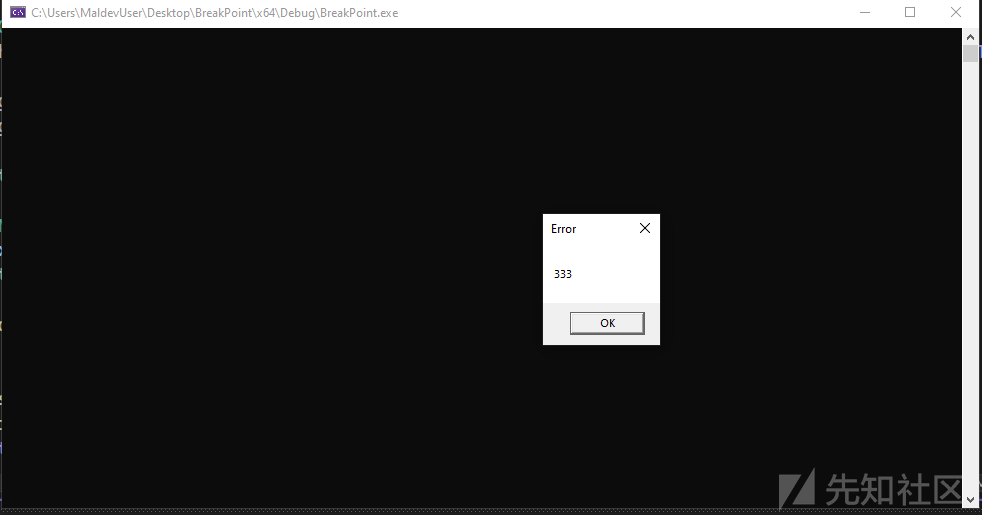
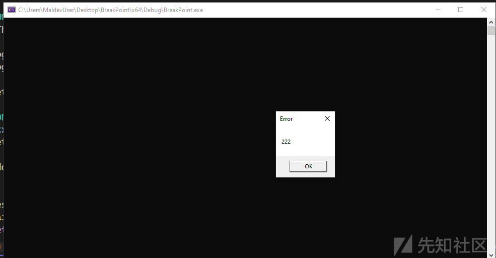
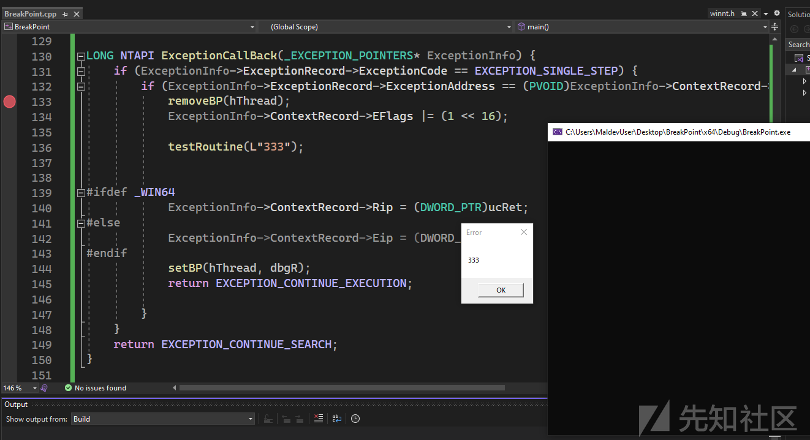
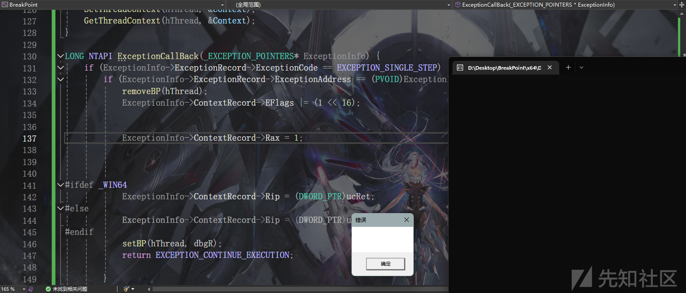
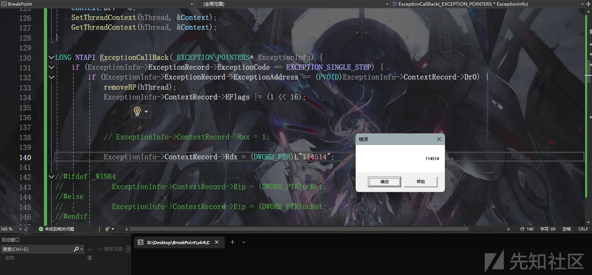

# 免杀基础-硬断Hook-先知社区

> **来源**: https://xz.aliyun.com/news/16482  
> **文章ID**: 16482

---

inline hook是通过patch原始执行流，将执行流程重定向到自定义逻辑，从而实现对目标行为的监控或修改

无论是通过E8还是E9进行跳转 都是要修改内存的 这样十分容易被检测

这里介绍硬件hook

# 什么是硬件断点

首先我们先了解什么是软件断点

在某个地址上下软件断点的时候 会向该地址注入一个`int 3`指令(0xcc) cpu遇到之后就会查idt进index为3的中断门

硬件断点也是类似的

先来看看调试寄存器



从0-7一共8个

`DR0 - DR3` 结构相同 记录了硬件断点的线性地址

`DR7` 描述断点条件



L代表当前线程 G代表所有 0-3分别对应的`DR0-DR3` G位setThreadContext并不能置上

控制断点是否启用

R/W位代表如何触发 0是执行 1是写 2是读 3是读写

LEN是监控的长度

64位下高位用0补齐

硬件断点只影响安装了他们的线程 每个线程最多可以设置4个硬件断点 因为一共就4个寄存器



eflags中的`RF`位控制如何处理调试异常 当断点断下的时候修改其为1恢复代码执行

下面写一个Demo 通过WindowsAPI来设置硬件断点

# 从DEMO到硬断hook

之前在说线程劫持的时候已经见过 这俩API了 `GetThreadContext` `SetThreadContext`

分别用于获取 修改线程上下文

先定义一下相关结构

```
#ifdef _WIN64 
typedef struct _DR7 {
    DWORD L0 : 1;
    DWORD G0 : 1;
    DWORD L1 : 1;
    DWORD G1 : 1;
    DWORD L2 : 1;
    DWORD G2 : 1;
    DWORD L3 : 1;
    DWORD G3 : 1;
    DWORD LE : 1;
    DWORD GE : 1;
    DWORD Reserved1 : 3;
    DWORD GD : 1;
    DWORD Reserved2 : 2;
    DWORD RW0 : 2;
    DWORD LEN0 : 2;
    DWORD RW1 : 2;
    DWORD LEN1 : 2;
    DWORD RW2 : 2;
    DWORD LEN2 : 2;
    DWORD RW3 : 2;
    DWORD LEN3 : 2;
    DWORD Reserved : 32; 
} DR7, * PDR7;
#else 
typedef struct _DR7 {
    DWORD L0 : 1;
    DWORD G0 : 1;
    DWORD L1 : 1;
    DWORD G1 : 1;
    DWORD L2 : 1;
    DWORD G2 : 1;
    DWORD L3 : 1;
    DWORD G3 : 1;
    DWORD LE : 1;
    DWORD GE : 1;
    DWORD Reserved1 : 3;
    DWORD GD : 1;
    DWORD Reserved2 : 2;
    DWORD RW0 : 2;
    DWORD LEN0 : 2;
    DWORD RW1 : 2;
    DWORD LEN1 : 2;
    DWORD RW2 : 2;
    DWORD LEN2 : 2;
    DWORD RW3 : 2;
    DWORD LEN3 : 2;
} DR7, * PDR7;
#endif


#ifdef _WIN64
typedef DWORD64 DRR_TYPE;  
#else
typedef DWORD DRR_TYPE;    
#endif

typedef struct _DRR {
    DRR_TYPE DR0;
    DRR_TYPE DR1;
    DRR_TYPE DR2;
    DRR_TYPE DR3;
    DRR_TYPE DR6;
    _DR7 DR7;
} DRR, * PDRR;

DRR_TYPE ConvertDr7(PDR7 dr7Struct) {
    DRR_TYPE dr7Value = 0;

    dr7Value |= ((DRR_TYPE)dr7Struct->L0 & 1) << 0;
    dr7Value |= ((DRR_TYPE)dr7Struct->G0 & 1) << 1;
    dr7Value |= ((DRR_TYPE)dr7Struct->L1 & 1) << 2;
    dr7Value |= ((DRR_TYPE)dr7Struct->G1 & 1) << 3;
    dr7Value |= ((DRR_TYPE)dr7Struct->L2 & 1) << 4;
    dr7Value |= ((DRR_TYPE)dr7Struct->G2 & 1) << 5;
    dr7Value |= ((DRR_TYPE)dr7Struct->L3 & 1) << 6;
    dr7Value |= ((DRR_TYPE)dr7Struct->G3 & 1) << 7;
    dr7Value |= ((DRR_TYPE)dr7Struct->LE & 1) << 8;
    dr7Value |= ((DRR_TYPE)dr7Struct->GE & 1) << 9;
    dr7Value |= ((DRR_TYPE)dr7Struct->Reserved1 & 7) << 10;  
    dr7Value |= ((DRR_TYPE)dr7Struct->GD & 1) << 13;
    dr7Value |= ((DRR_TYPE)dr7Struct->Reserved2 & 3) << 14;  
    dr7Value |= ((DRR_TYPE)dr7Struct->RW0 & 3) << 16;  
    dr7Value |= ((DRR_TYPE)dr7Struct->LEN0 & 3) << 18; 
    dr7Value |= ((DRR_TYPE)dr7Struct->RW1 & 3) << 20;  
    dr7Value |= ((DRR_TYPE)dr7Struct->LEN1 & 3) << 22; 
    dr7Value |= ((DRR_TYPE)dr7Struct->RW2 & 3) << 24;  
    dr7Value |= ((DRR_TYPE)dr7Struct->LEN2 & 3) << 26; 
    dr7Value |= ((DRR_TYPE)dr7Struct->RW3 & 3) << 28;  
    dr7Value |= ((DRR_TYPE)dr7Struct->LEN3 & 3) << 30; 

    return dr7Value;
}

```

```
void testRoutine() {
    MessageBox(0, 0, 0, 0);
}

HANDLE hThread = NULL;
DRR dbgR = { 0 };


VOID setBP(HANDLE hThread, DRR dbgR)
{
    CONTEXT Context = {0};
    Context.ContextFlags = CONTEXT_FULL | CONTEXT_DEBUG_REGISTERS;
    GetThreadContext(hThread, &Context);
    Context.Dr0 = dbgR.DR0;
    Context.Dr7 = ConvertDr7(&dbgR.DR7);

    SetThreadContext(hThread, &Context);
}
int main(){

    DWORD eid = NULL;
    hThread = CreateThread(NULL,NULL,(LPTHREAD_START_ROUTINE)&testRoutine,(LPVOID)L"222", CREATE_SUSPENDED, &eid);


    dbgR.DR0 = (DWORD_PTR)testRoutine;
    dbgR.DR7.L0 = 1;

    setBP(hThread, dbgR);

    ResumeThread(hThread);
    WaitForSingleObject(hThread, -1);
    return 0;
}

```

通过setBP函数来下硬件断点



硬件断点会触发`Single step`异常

通过VEH捕获

```
LONG NTAPI ExceptionCallBack(_EXCEPTION_POINTERS* ExceptionInfo) {
    if (ExceptionInfo->ExceptionRecord->ExceptionCode == EXCEPTION_SINGLE_STEP) {
        if (ExceptionInfo->ExceptionRecord->ExceptionAddress == (PVOID)ExceptionInfo->ContextRecord->Dr0) {
            removeBP(hThread);
            ExceptionInfo->ContextRecord->EFlags |= (1 << 16);

            testRoutine(L"333");


            setBP(hThread, dbgR);
            return EXCEPTION_CONTINUE_EXECUTION;

        }
    }
    return EXCEPTION_CONTINUE_SEARCH;
}

int main(){

    DWORD eid = NULL;
    hThread = CreateThread(NULL,NULL,(LPTHREAD_START_ROUTINE)&testRoutine,(LPVOID)L"222", CREATE_SUSPENDED, &eid);

    dbgR.DR0 = (DWORD_PTR)testRoutine;
    dbgR.DR7.L0 = 1;

    setBP(hThread, dbgR);

    AddVectoredExceptionHandler(1, ExceptionCallBack);


    ResumeThread(hThread);
    WaitForSingleObject(hThread, -1);
    return 0;
}

```

这里判断必须是我们下的硬断才操作





现在有个问题 当执行完我们的`testRoutine(L"333");`之后会继续把原来的函数跑完 因为执行流恢复了

所以我们要手动更改RIP 直接ret 不执行原函数

```
#pragma section(".text")
__declspec(allocate(".text")) const unsigned char ucRet[] = {0xc3};

....


LONG NTAPI ExceptionCallBack(_EXCEPTION_POINTERS* ExceptionInfo) {
    if (ExceptionInfo->ExceptionRecord->ExceptionCode == EXCEPTION_SINGLE_STEP) {
        if (ExceptionInfo->ExceptionRecord->ExceptionAddress == (PVOID)ExceptionInfo->ContextRecord->Dr0) {
            removeBP(hThread);
            ExceptionInfo->ContextRecord->EFlags |= (1 << 16);

            testRoutine(L"333");


#ifdef _WIN64 
            ExceptionInfo->ContextRecord->Rip = (DWORD_PTR)ucRet;
#else
            ExceptionInfo->ContextRecord->Eip = (DWORD_PTR)ucRet;
#endif
            setBP(hThread, dbgR);
            return EXCEPTION_CONTINUE_EXECUTION;

        }
    }
    return EXCEPTION_CONTINUE_SEARCH;
}

```



# 修改返回值

实际上我们可能还有修改函数返回值的需求

现修改 testRoutine 如下

```
BOOLEAN testRoutine() {

    return (1 > 100);
}

```

现在要求返回`TRUE`

实现方法也很简单 直接修改RAX的值即可

我们对当前线程下硬断hook



```
#include <iostream>
#include <Windows.h>

#ifdef _WIN64 
typedef struct _DR7 {
    DWORD L0 : 1;
    DWORD G0 : 1;
    DWORD L1 : 1;
    DWORD G1 : 1;
    DWORD L2 : 1;
    DWORD G2 : 1;
    DWORD L3 : 1;
    DWORD G3 : 1;
    DWORD LE : 1;
    DWORD GE : 1;
    DWORD Reserved1 : 3;
    DWORD GD : 1;
    DWORD Reserved2 : 2;
    DWORD RW0 : 2;
    DWORD LEN0 : 2;
    DWORD RW1 : 2;
    DWORD LEN1 : 2;
    DWORD RW2 : 2;
    DWORD LEN2 : 2;
    DWORD RW3 : 2;
    DWORD LEN3 : 2;
    DWORD Reserved : 32;
} DR7, * PDR7;
#else 
typedef struct _DR7 {
    DWORD L0 : 1;
    DWORD G0 : 1;
    DWORD L1 : 1;
    DWORD G1 : 1;
    DWORD L2 : 1;
    DWORD G2 : 1;
    DWORD L3 : 1;
    DWORD G3 : 1;
    DWORD LE : 1;
    DWORD GE : 1;
    DWORD Reserved1 : 3;
    DWORD GD : 1;
    DWORD Reserved2 : 2;
    DWORD RW0 : 2;
    DWORD LEN0 : 2;
    DWORD RW1 : 2;
    DWORD LEN1 : 2;
    DWORD RW2 : 2;
    DWORD LEN2 : 2;
    DWORD RW3 : 2;
    DWORD LEN3 : 2;
} DR7, * PDR7;
#endif


#ifdef _WIN64
typedef DWORD64 DRR_TYPE;
#else
typedef DWORD DRR_TYPE;
#endif

typedef struct _DRR {
    DRR_TYPE DR0;
    DRR_TYPE DR1;
    DRR_TYPE DR2;
    DRR_TYPE DR3;
    DRR_TYPE DR6;
    _DR7 DR7;
} DRR, * PDRR;

DRR_TYPE ConvertDr7(PDR7 dr7Struct) {
    DRR_TYPE dr7Value = 0;

    dr7Value |= ((DRR_TYPE)dr7Struct->L0 & 1) << 0;
    dr7Value |= ((DRR_TYPE)dr7Struct->G0 & 1) << 1;
    dr7Value |= ((DRR_TYPE)dr7Struct->L1 & 1) << 2;
    dr7Value |= ((DRR_TYPE)dr7Struct->G1 & 1) << 3;
    dr7Value |= ((DRR_TYPE)dr7Struct->L2 & 1) << 4;
    dr7Value |= ((DRR_TYPE)dr7Struct->G2 & 1) << 5;
    dr7Value |= ((DRR_TYPE)dr7Struct->L3 & 1) << 6;
    dr7Value |= ((DRR_TYPE)dr7Struct->G3 & 1) << 7;
    dr7Value |= ((DRR_TYPE)dr7Struct->LE & 1) << 8;
    dr7Value |= ((DRR_TYPE)dr7Struct->GE & 1) << 9;
    dr7Value |= ((DRR_TYPE)dr7Struct->Reserved1 & 7) << 10;
    dr7Value |= ((DRR_TYPE)dr7Struct->GD & 1) << 13;
    dr7Value |= ((DRR_TYPE)dr7Struct->Reserved2 & 3) << 14;
    dr7Value |= ((DRR_TYPE)dr7Struct->RW0 & 3) << 16;
    dr7Value |= ((DRR_TYPE)dr7Struct->LEN0 & 3) << 18;
    dr7Value |= ((DRR_TYPE)dr7Struct->RW1 & 3) << 20;
    dr7Value |= ((DRR_TYPE)dr7Struct->LEN1 & 3) << 22;
    dr7Value |= ((DRR_TYPE)dr7Struct->RW2 & 3) << 24;
    dr7Value |= ((DRR_TYPE)dr7Struct->LEN2 & 3) << 26;
    dr7Value |= ((DRR_TYPE)dr7Struct->RW3 & 3) << 28;
    dr7Value |= ((DRR_TYPE)dr7Struct->LEN3 & 3) << 30;

    return dr7Value;
}

BOOLEAN testRoutine() {

    return (1 > 100);
}

HANDLE hThread = NULL;
DRR dbgR = { 0 };

#pragma section(".text")
__declspec(allocate(".text")) const unsigned char ucRet[] = { 0xc3 };

VOID setBP(HANDLE hThread, DRR dbgR)
{
    CONTEXT Context = { 0 };
    Context.ContextFlags = CONTEXT_FULL | CONTEXT_DEBUG_REGISTERS;
    GetThreadContext(hThread, &Context);
    Context.Dr0 = dbgR.DR0;
    Context.Dr7 = ConvertDr7(&dbgR.DR7);
    SetThreadContext(hThread, &Context);
}
VOID removeBP(HANDLE hThread) {
    CONTEXT Context = { 0 };
    Context.ContextFlags = CONTEXT_FULL | CONTEXT_DEBUG_REGISTERS;
    GetThreadContext(hThread, &Context);
    Context.Dr0 = 0;
    Context.Dr7 = 0;
    SetThreadContext(hThread, &Context);
    GetThreadContext(hThread, &Context);
}

LONG NTAPI ExceptionCallBack(_EXCEPTION_POINTERS* ExceptionInfo) {
    if (ExceptionInfo->ExceptionRecord->ExceptionCode == EXCEPTION_SINGLE_STEP) {
        if (ExceptionInfo->ExceptionRecord->ExceptionAddress == (PVOID)ExceptionInfo->ContextRecord->Dr0) {
            removeBP(hThread);
            ExceptionInfo->ContextRecord->EFlags |= (1 << 16);


            ExceptionInfo->ContextRecord->Rax = 1;


#ifdef _WIN64 
            ExceptionInfo->ContextRecord->Rip = (DWORD_PTR)ucRet;
#else
            ExceptionInfo->ContextRecord->Eip = (DWORD_PTR)ucRet;
#endif
            setBP(hThread, dbgR);
            return EXCEPTION_CONTINUE_EXECUTION;

        }
    }
    return EXCEPTION_CONTINUE_SEARCH;
}

int main() {

    DWORD eid = NULL;
    //hThread = CreateThread(NULL, NULL, (LPTHREAD_START_ROUTINE)&testRoutine, NULL, CREATE_SUSPENDED, &eid);
    hThread = GetCurrentThread();
    dbgR.DR0 = (DWORD_PTR)testRoutine;
    dbgR.DR7.L0 = 1;
    setBP(hThread, dbgR);

    CONTEXT ctx = { 0 };
    ctx.ContextFlags = CONTEXT_ALL | CONTEXT_DEBUG_REGISTERS;
    GetThreadContext(hThread, &ctx);

    AddVectoredExceptionHandler(1, ExceptionCallBack);


    BOOLEAN bRet = testRoutine();
    if (bRet) {
        MessageBox(0, 0, 0, 0);
    }


    return 0;
}

```

# 遍历所有线程进行hook

通过`NtQuerySystemInformation`

```
void EnumThreadSetBp(DRR dbgR) {
    HMODULE hNtdll = GetModuleHandle(L"ntdll.dll");
    pNtQuerySystemInformation NtQuerySystemInformation = (pNtQuerySystemInformation)(
        GetProcAddress(hNtdll, "NtQuerySystemInformation")
        );
    ULONG retLen1,retLen2;


    NtQuerySystemInformation(SystemProcessInformation,NULL,NULL,&retLen1);

    PVOID lpMem = VirtualAlloc(NULL, retLen1, MEM_COMMIT | MEM_RESERVE, PAGE_READWRITE);

    NTSTATUS status = NtQuerySystemInformation(SystemProcessInformation, lpMem, retLen1, &retLen2);
    if (NT_SUCCESS(status)) {
        PSYSTEM_PROCESS_INFORMATION processInfo = (PSYSTEM_PROCESS_INFORMATION)lpMem;
        while (processInfo->NextEntryOffset != 0) {
            PVOID CurrentPid = (PVOID)GetCurrentProcessId();

            if (processInfo->UniqueProcessId != 0) {
                if ((PVOID)processInfo->UniqueProcessId == CurrentPid) {
                    PSYSTEM_THREAD_INFORMATION threadInfo = (PSYSTEM_THREAD_INFORMATION)processInfo->Threads;

                    for (ULONG i = 0; i < processInfo->NumberOfThreads; i++) {

                        hThread = OpenThread(THREAD_ALL_ACCESS, FALSE, (DWORD)threadInfo->ClientId.UniqueThread);
                        setBP(hThread, dbgR);
                        threadInfo++;
                    }
                }
            }

            processInfo = (PSYSTEM_PROCESS_INFORMATION)((ULONG_PTR)processInfo + processInfo->NextEntryOffset);
        }
    }

    VirtualFree(lpMem, 0, MEM_RELEASE);


}

```

```
int main() {

    DWORD eid = NULL;
    hThread = CreateThread(NULL, NULL, (LPTHREAD_START_ROUTINE)&MessageBox, NULL, CREATE_SUSPENDED, & eid);
    AddVectoredExceptionHandler(1, ExceptionCallBack);

    LPVOID funcAddr = MessageBoxW;

    dbgR.DR0 = (DWORD_PTR)funcAddr;
    dbgR.DR7.L0 = 1;
    EnumThreadSetBp(dbgR);

    CONTEXT ctx = { 0 };
    ctx.ContextFlags = CONTEXT_ALL | CONTEXT_DEBUG_REGISTERS;
    GetThreadContext(hThread, &ctx);

    ResumeThread(hThread);
    WaitForSingleObject(hThread, -1);
    CloseHandle(hThread);
    return 0;
}

```

这里通过修改寄存器直接修改参数 那就不能修改Rip到ret了



# 相关结构定义

```
#ifdef _WIN64 
typedef struct _DR7 {
    DWORD L0 : 1;
    DWORD G0 : 1;
    DWORD L1 : 1;
    DWORD G1 : 1;
    DWORD L2 : 1;
    DWORD G2 : 1;
    DWORD L3 : 1;
    DWORD G3 : 1;
    DWORD LE : 1;
    DWORD GE : 1;
    DWORD Reserved1 : 3;
    DWORD GD : 1;
    DWORD Reserved2 : 2;
    DWORD RW0 : 2;
    DWORD LEN0 : 2;
    DWORD RW1 : 2;
    DWORD LEN1 : 2;
    DWORD RW2 : 2;
    DWORD LEN2 : 2;
    DWORD RW3 : 2;
    DWORD LEN3 : 2;
    DWORD Reserved : 32;
} DR7, * PDR7;
#else 
typedef struct _DR7 {
    DWORD L0 : 1;
    DWORD G0 : 1;
    DWORD L1 : 1;
    DWORD G1 : 1;
    DWORD L2 : 1;
    DWORD G2 : 1;
    DWORD L3 : 1;
    DWORD G3 : 1;
    DWORD LE : 1;
    DWORD GE : 1;
    DWORD Reserved1 : 3;
    DWORD GD : 1;
    DWORD Reserved2 : 2;
    DWORD RW0 : 2;
    DWORD LEN0 : 2;
    DWORD RW1 : 2;
    DWORD LEN1 : 2;
    DWORD RW2 : 2;
    DWORD LEN2 : 2;
    DWORD RW3 : 2;
    DWORD LEN3 : 2;
} DR7, * PDR7;
#endif


#ifdef _WIN64
typedef DWORD64 DRR_TYPE;
#else
typedef DWORD DRR_TYPE;
#endif

typedef struct _DRR {
    DRR_TYPE DR0;
    DRR_TYPE DR1;
    DRR_TYPE DR2;
    DRR_TYPE DR3;
    DRR_TYPE DR6;
    _DR7 DR7;
} DRR, * PDRR;

typedef enum _SYSTEM_INFORMATION_CLASS
{
    SystemBasicInformation, // q: SYSTEM_BASIC_INFORMATION
    SystemProcessorInformation, // q: SYSTEM_PROCESSOR_INFORMATION
    SystemPerformanceInformation, // q: SYSTEM_PERFORMANCE_INFORMATION
    SystemTimeOfDayInformation, // q: SYSTEM_TIMEOFDAY_INFORMATION
    SystemPathInformation, // not implemented
    SystemProcessInformation, // q: SYSTEM_PROCESS_INFORMATION
    SystemCallCountInformation, // q: SYSTEM_CALL_COUNT_INFORMATION
    SystemDeviceInformation, // q: SYSTEM_DEVICE_INFORMATION
    SystemProcessorPerformanceInformation, // q: SYSTEM_PROCESSOR_PERFORMANCE_INFORMATION (EX in: USHORT ProcessorGroup)
    SystemFlagsInformation, // q: SYSTEM_FLAGS_INFORMATION
    SystemCallTimeInformation, // not implemented // SYSTEM_CALL_TIME_INFORMATION // 10
    SystemModuleInformation, // q: RTL_PROCESS_MODULES
    SystemLocksInformation, // q: RTL_PROCESS_LOCKS
    SystemStackTraceInformation, // q: RTL_PROCESS_BACKTRACES
    SystemPagedPoolInformation, // not implemented
    SystemNonPagedPoolInformation, // not implemented
    SystemHandleInformation, // q: SYSTEM_HANDLE_INFORMATION
    SystemObjectInformation, // q: SYSTEM_OBJECTTYPE_INFORMATION mixed with SYSTEM_OBJECT_INFORMATION
    SystemPageFileInformation, // q: SYSTEM_PAGEFILE_INFORMATION
    SystemVdmInstemulInformation, // q: SYSTEM_VDM_INSTEMUL_INFO
    SystemVdmBopInformation, // not implemented // 20
    SystemFileCacheInformation, // q: SYSTEM_FILECACHE_INFORMATION; s (requires SeIncreaseQuotaPrivilege) (info for WorkingSetTypeSystemCache)
    SystemPoolTagInformation, // q: SYSTEM_POOLTAG_INFORMATION
    SystemInterruptInformation, // q: SYSTEM_INTERRUPT_INFORMATION (EX in: USHORT ProcessorGroup)
    SystemDpcBehaviorInformation, // q: SYSTEM_DPC_BEHAVIOR_INFORMATION; s: SYSTEM_DPC_BEHAVIOR_INFORMATION (requires SeLoadDriverPrivilege)
    SystemFullMemoryInformation, // not implemented // SYSTEM_MEMORY_USAGE_INFORMATION
    SystemLoadGdiDriverInformation, // s (kernel-mode only)
    SystemUnloadGdiDriverInformation, // s (kernel-mode only)
    SystemTimeAdjustmentInformation, // q: SYSTEM_QUERY_TIME_ADJUST_INFORMATION; s: SYSTEM_SET_TIME_ADJUST_INFORMATION (requires SeSystemtimePrivilege)
    SystemSummaryMemoryInformation, // not implemented // SYSTEM_MEMORY_USAGE_INFORMATION
    SystemMirrorMemoryInformation, // s (requires license value "Kernel-MemoryMirroringSupported") (requires SeShutdownPrivilege) // 30
    SystemPerformanceTraceInformation, // q; s: (type depends on EVENT_TRACE_INFORMATION_CLASS)
    SystemObsolete0, // not implemented
    SystemExceptionInformation, // q: SYSTEM_EXCEPTION_INFORMATION
    SystemCrashDumpStateInformation, // s: SYSTEM_CRASH_DUMP_STATE_INFORMATION (requires SeDebugPrivilege)
    SystemKernelDebuggerInformation, // q: SYSTEM_KERNEL_DEBUGGER_INFORMATION
    SystemContextSwitchInformation, // q: SYSTEM_CONTEXT_SWITCH_INFORMATION
    SystemRegistryQuotaInformation, // q: SYSTEM_REGISTRY_QUOTA_INFORMATION; s (requires SeIncreaseQuotaPrivilege)
    SystemExtendServiceTableInformation, // s (requires SeLoadDriverPrivilege) // loads win32k only
    SystemPrioritySeperation, // s (requires SeTcbPrivilege)
    SystemVerifierAddDriverInformation, // s (requires SeDebugPrivilege) // 40
    SystemVerifierRemoveDriverInformation, // s (requires SeDebugPrivilege)
    SystemProcessorIdleInformation, // q: SYSTEM_PROCESSOR_IDLE_INFORMATION (EX in: USHORT ProcessorGroup)
    SystemLegacyDriverInformation, // q: SYSTEM_LEGACY_DRIVER_INFORMATION
    SystemCurrentTimeZoneInformation, // q; s: RTL_TIME_ZONE_INFORMATION
    SystemLookasideInformation, // q: SYSTEM_LOOKASIDE_INFORMATION
    SystemTimeSlipNotification, // s: HANDLE (NtCreateEvent) (requires SeSystemtimePrivilege)
    SystemSessionCreate, // not implemented
    SystemSessionDetach, // not implemented
    SystemSessionInformation, // not implemented (SYSTEM_SESSION_INFORMATION)
    SystemRangeStartInformation, // q: SYSTEM_RANGE_START_INFORMATION // 50
    SystemVerifierInformation, // q: SYSTEM_VERIFIER_INFORMATION; s (requires SeDebugPrivilege)
    SystemVerifierThunkExtend, // s (kernel-mode only)
    SystemSessionProcessInformation, // q: SYSTEM_SESSION_PROCESS_INFORMATION
    SystemLoadGdiDriverInSystemSpace, // s: SYSTEM_GDI_DRIVER_INFORMATION (kernel-mode only) (same as SystemLoadGdiDriverInformation)
    SystemNumaProcessorMap, // q: SYSTEM_NUMA_INFORMATION
    SystemPrefetcherInformation, // q; s: PREFETCHER_INFORMATION // PfSnQueryPrefetcherInformation
    SystemExtendedProcessInformation, // q: SYSTEM_PROCESS_INFORMATION
    SystemRecommendedSharedDataAlignment, // q: ULONG // KeGetRecommendedSharedDataAlignment
    SystemComPlusPackage, // q; s: ULONG
    SystemNumaAvailableMemory, // q: SYSTEM_NUMA_INFORMATION // 60
    SystemProcessorPowerInformation, // q: SYSTEM_PROCESSOR_POWER_INFORMATION (EX in: USHORT ProcessorGroup)
    SystemEmulationBasicInformation, // q: SYSTEM_BASIC_INFORMATION
    SystemEmulationProcessorInformation, // q: SYSTEM_PROCESSOR_INFORMATION
    SystemExtendedHandleInformation, // q: SYSTEM_HANDLE_INFORMATION_EX
    SystemLostDelayedWriteInformation, // q: ULONG
    SystemBigPoolInformation, // q: SYSTEM_BIGPOOL_INFORMATION
    SystemSessionPoolTagInformation, // q: SYSTEM_SESSION_POOLTAG_INFORMATION
    SystemSessionMappedViewInformation, // q: SYSTEM_SESSION_MAPPED_VIEW_INFORMATION
    SystemHotpatchInformation, // q; s: SYSTEM_HOTPATCH_CODE_INFORMATION
    SystemObjectSecurityMode, // q: ULONG // 70
    SystemWatchdogTimerHandler, // s: SYSTEM_WATCHDOG_HANDLER_INFORMATION // (kernel-mode only)
    SystemWatchdogTimerInformation, // q: SYSTEM_WATCHDOG_TIMER_INFORMATION // (kernel-mode only)
    SystemLogicalProcessorInformation, // q: SYSTEM_LOGICAL_PROCESSOR_INFORMATION (EX in: USHORT ProcessorGroup)
    SystemWow64SharedInformationObsolete, // not implemented
    SystemRegisterFirmwareTableInformationHandler, // s: SYSTEM_FIRMWARE_TABLE_HANDLER // (kernel-mode only)
    SystemFirmwareTableInformation, // SYSTEM_FIRMWARE_TABLE_INFORMATION
    SystemModuleInformationEx, // q: RTL_PROCESS_MODULE_INFORMATION_EX
    SystemVerifierTriageInformation, // not implemented
    SystemSuperfetchInformation, // q; s: SUPERFETCH_INFORMATION // PfQuerySuperfetchInformation
    SystemMemoryListInformation, // q: SYSTEM_MEMORY_LIST_INFORMATION; s: SYSTEM_MEMORY_LIST_COMMAND (requires SeProfileSingleProcessPrivilege) // 80
    SystemFileCacheInformationEx, // q: SYSTEM_FILECACHE_INFORMATION; s (requires SeIncreaseQuotaPrivilege) (same as SystemFileCacheInformation)
    SystemThreadPriorityClientIdInformation, // s: SYSTEM_THREAD_CID_PRIORITY_INFORMATION (requires SeIncreaseBasePriorityPrivilege)
    SystemProcessorIdleCycleTimeInformation, // q: SYSTEM_PROCESSOR_IDLE_CYCLE_TIME_INFORMATION[] (EX in: USHORT ProcessorGroup)
    SystemVerifierCancellationInformation, // SYSTEM_VERIFIER_CANCELLATION_INFORMATION // name:wow64:whNT32QuerySystemVerifierCancellationInformation
    SystemProcessorPowerInformationEx, // not implemented
    SystemRefTraceInformation, // q; s: SYSTEM_REF_TRACE_INFORMATION // ObQueryRefTraceInformation
    SystemSpecialPoolInformation, // q; s: SYSTEM_SPECIAL_POOL_INFORMATION (requires SeDebugPrivilege) // MmSpecialPoolTag, then MmSpecialPoolCatchOverruns != 0
    SystemProcessIdInformation, // q: SYSTEM_PROCESS_ID_INFORMATION
    SystemErrorPortInformation, // s (requires SeTcbPrivilege)
    SystemBootEnvironmentInformation, // q: SYSTEM_BOOT_ENVIRONMENT_INFORMATION // 90
    SystemHypervisorInformation, // q: SYSTEM_HYPERVISOR_QUERY_INFORMATION
    SystemVerifierInformationEx, // q; s: SYSTEM_VERIFIER_INFORMATION_EX
    SystemTimeZoneInformation, // q; s: RTL_TIME_ZONE_INFORMATION (requires SeTimeZonePrivilege)
    SystemImageFileExecutionOptionsInformation, // s: SYSTEM_IMAGE_FILE_EXECUTION_OPTIONS_INFORMATION (requires SeTcbPrivilege)
    SystemCoverageInformation, // q: COVERAGE_MODULES s: COVERAGE_MODULE_REQUEST // ExpCovQueryInformation (requires SeDebugPrivilege)
    SystemPrefetchPatchInformation, // SYSTEM_PREFETCH_PATCH_INFORMATION
    SystemVerifierFaultsInformation, // s: SYSTEM_VERIFIER_FAULTS_INFORMATION (requires SeDebugPrivilege)
    SystemSystemPartitionInformation, // q: SYSTEM_SYSTEM_PARTITION_INFORMATION
    SystemSystemDiskInformation, // q: SYSTEM_SYSTEM_DISK_INFORMATION
    SystemProcessorPerformanceDistribution, // q: SYSTEM_PROCESSOR_PERFORMANCE_DISTRIBUTION (EX in: USHORT ProcessorGroup) // 100
    SystemNumaProximityNodeInformation, // q; s: SYSTEM_NUMA_PROXIMITY_MAP
    SystemDynamicTimeZoneInformation, // q; s: RTL_DYNAMIC_TIME_ZONE_INFORMATION (requires SeTimeZonePrivilege)
    SystemCodeIntegrityInformation, // q: SYSTEM_CODEINTEGRITY_INFORMATION // SeCodeIntegrityQueryInformation
    SystemProcessorMicrocodeUpdateInformation, // s: SYSTEM_PROCESSOR_MICROCODE_UPDATE_INFORMATION
    SystemProcessorBrandString, // q: CHAR[] // HaliQuerySystemInformation -> HalpGetProcessorBrandString, info class 23
    SystemVirtualAddressInformation, // q: SYSTEM_VA_LIST_INFORMATION[]; s: SYSTEM_VA_LIST_INFORMATION[] (requires SeIncreaseQuotaPrivilege) // MmQuerySystemVaInformation
    SystemLogicalProcessorAndGroupInformation, // q: SYSTEM_LOGICAL_PROCESSOR_INFORMATION_EX (EX in: LOGICAL_PROCESSOR_RELATIONSHIP RelationshipType) // since WIN7 // KeQueryLogicalProcessorRelationship
    SystemProcessorCycleTimeInformation, // q: SYSTEM_PROCESSOR_CYCLE_TIME_INFORMATION[] (EX in: USHORT ProcessorGroup)
    SystemStoreInformation, // q; s: SYSTEM_STORE_INFORMATION (requires SeProfileSingleProcessPrivilege) // SmQueryStoreInformation
    SystemRegistryAppendString, // s: SYSTEM_REGISTRY_APPEND_STRING_PARAMETERS // 110
    SystemAitSamplingValue, // s: ULONG (requires SeProfileSingleProcessPrivilege)
    SystemVhdBootInformation, // q: SYSTEM_VHD_BOOT_INFORMATION
    SystemCpuQuotaInformation, // q; s: PS_CPU_QUOTA_QUERY_INFORMATION
    SystemNativeBasicInformation, // q: SYSTEM_BASIC_INFORMATION
    SystemErrorPortTimeouts, // SYSTEM_ERROR_PORT_TIMEOUTS
    SystemLowPriorityIoInformation, // q: SYSTEM_LOW_PRIORITY_IO_INFORMATION
    SystemTpmBootEntropyInformation, // q: BOOT_ENTROPY_NT_RESULT // ExQueryBootEntropyInformation  
    SystemVerifierCountersInformation, // q: SYSTEM_VERIFIER_COUNTERS_INFORMATION
    SystemPagedPoolInformationEx, // q: SYSTEM_FILECACHE_INFORMATION; s (requires SeIncreaseQuotaPrivilege) (info for WorkingSetTypePagedPool)
    SystemSystemPtesInformationEx, // q: SYSTEM_FILECACHE_INFORMATION; s (requires SeIncreaseQuotaPrivilege) (info for WorkingSetTypeSystemPtes) // 120
    SystemNodeDistanceInformation, // q: USHORT[4*NumaNodes] // (EX in: USHORT NodeNumber)
    SystemAcpiAuditInformation, // q: SYSTEM_ACPI_AUDIT_INFORMATION // HaliQuerySystemInformation -> HalpAuditQueryResults, info class 26
    SystemBasicPerformanceInformation, // q: SYSTEM_BASIC_PERFORMANCE_INFORMATION // name:wow64:whNtQuerySystemInformation_SystemBasicPerformanceInformation
    SystemQueryPerformanceCounterInformation, // q: SYSTEM_QUERY_PERFORMANCE_COUNTER_INFORMATION // since WIN7 SP1
    SystemSessionBigPoolInformation, // q: SYSTEM_SESSION_POOLTAG_INFORMATION // since WIN8
    SystemBootGraphicsInformation, // q; s: SYSTEM_BOOT_GRAPHICS_INFORMATION (kernel-mode only)
    SystemScrubPhysicalMemoryInformation, // q; s: MEMORY_SCRUB_INFORMATION
    SystemBadPageInformation, // SYSTEM_BAD_PAGE_INFORMATION
    SystemProcessorProfileControlArea, // q; s: SYSTEM_PROCESSOR_PROFILE_CONTROL_AREA
    SystemCombinePhysicalMemoryInformation, // s: MEMORY_COMBINE_INFORMATION, MEMORY_COMBINE_INFORMATION_EX, MEMORY_COMBINE_INFORMATION_EX2 // 130
    SystemEntropyInterruptTimingInformation, // q; s: SYSTEM_ENTROPY_TIMING_INFORMATION
    SystemConsoleInformation, // q; s: SYSTEM_CONSOLE_INFORMATION
    SystemPlatformBinaryInformation, // q: SYSTEM_PLATFORM_BINARY_INFORMATION (requires SeTcbPrivilege)
    SystemPolicyInformation, // q: SYSTEM_POLICY_INFORMATION (Warbird/Encrypt/Decrypt/Execute)
    SystemHypervisorProcessorCountInformation, // q: SYSTEM_HYPERVISOR_PROCESSOR_COUNT_INFORMATION
    SystemDeviceDataInformation, // q: SYSTEM_DEVICE_DATA_INFORMATION
    SystemDeviceDataEnumerationInformation, // q: SYSTEM_DEVICE_DATA_INFORMATION
    SystemMemoryTopologyInformation, // q: SYSTEM_MEMORY_TOPOLOGY_INFORMATION
    SystemMemoryChannelInformation, // q: SYSTEM_MEMORY_CHANNEL_INFORMATION
    SystemBootLogoInformation, // q: SYSTEM_BOOT_LOGO_INFORMATION // 140
    SystemProcessorPerformanceInformationEx, // q: SYSTEM_PROCESSOR_PERFORMANCE_INFORMATION_EX // (EX in: USHORT ProcessorGroup) // since WINBLUE
    SystemCriticalProcessErrorLogInformation, // CRITICAL_PROCESS_EXCEPTION_DATA
    SystemSecureBootPolicyInformation, // q: SYSTEM_SECUREBOOT_POLICY_INFORMATION
    SystemPageFileInformationEx, // q: SYSTEM_PAGEFILE_INFORMATION_EX
    SystemSecureBootInformation, // q: SYSTEM_SECUREBOOT_INFORMATION
    SystemEntropyInterruptTimingRawInformation,
    SystemPortableWorkspaceEfiLauncherInformation, // q: SYSTEM_PORTABLE_WORKSPACE_EFI_LAUNCHER_INFORMATION
    SystemFullProcessInformation, // q: SYSTEM_PROCESS_INFORMATION with SYSTEM_PROCESS_INFORMATION_EXTENSION (requires admin)
    SystemKernelDebuggerInformationEx, // q: SYSTEM_KERNEL_DEBUGGER_INFORMATION_EX
    SystemBootMetadataInformation, // 150 // (requires SeTcbPrivilege)
    SystemSoftRebootInformation, // q: ULONG
    SystemElamCertificateInformation, // s: SYSTEM_ELAM_CERTIFICATE_INFORMATION
    SystemOfflineDumpConfigInformation, // q: OFFLINE_CRASHDUMP_CONFIGURATION_TABLE_V2
    SystemProcessorFeaturesInformation, // q: SYSTEM_PROCESSOR_FEATURES_INFORMATION
    SystemRegistryReconciliationInformation, // s: NULL (requires admin) (flushes registry hives)
    SystemEdidInformation, // q: SYSTEM_EDID_INFORMATION
    SystemManufacturingInformation, // q: SYSTEM_MANUFACTURING_INFORMATION // since THRESHOLD
    SystemEnergyEstimationConfigInformation, // q: SYSTEM_ENERGY_ESTIMATION_CONFIG_INFORMATION
    SystemHypervisorDetailInformation, // q: SYSTEM_HYPERVISOR_DETAIL_INFORMATION
    SystemProcessorCycleStatsInformation, // q: SYSTEM_PROCESSOR_CYCLE_STATS_INFORMATION (EX in: USHORT ProcessorGroup) // 160
    SystemVmGenerationCountInformation,
    SystemTrustedPlatformModuleInformation, // q: SYSTEM_TPM_INFORMATION
    SystemKernelDebuggerFlags, // SYSTEM_KERNEL_DEBUGGER_FLAGS
    SystemCodeIntegrityPolicyInformation, // q; s: SYSTEM_CODEINTEGRITYPOLICY_INFORMATION
    SystemIsolatedUserModeInformation, // q: SYSTEM_ISOLATED_USER_MODE_INFORMATION
    SystemHardwareSecurityTestInterfaceResultsInformation,
    SystemSingleModuleInformation, // q: SYSTEM_SINGLE_MODULE_INFORMATION
    SystemAllowedCpuSetsInformation, // s: SYSTEM_WORKLOAD_ALLOWED_CPU_SET_INFORMATION
    SystemVsmProtectionInformation, // q: SYSTEM_VSM_PROTECTION_INFORMATION (previously SystemDmaProtectionInformation)
    SystemInterruptCpuSetsInformation, // q: SYSTEM_INTERRUPT_CPU_SET_INFORMATION // 170
    SystemSecureBootPolicyFullInformation, // q: SYSTEM_SECUREBOOT_POLICY_FULL_INFORMATION
    SystemCodeIntegrityPolicyFullInformation,
    SystemAffinitizedInterruptProcessorInformation, // q: KAFFINITY_EX // (requires SeIncreaseBasePriorityPrivilege)
    SystemRootSiloInformation, // q: SYSTEM_ROOT_SILO_INFORMATION
    SystemCpuSetInformation, // q: SYSTEM_CPU_SET_INFORMATION // since THRESHOLD2
    SystemCpuSetTagInformation, // q: SYSTEM_CPU_SET_TAG_INFORMATION
    SystemWin32WerStartCallout,
    SystemSecureKernelProfileInformation, // q: SYSTEM_SECURE_KERNEL_HYPERGUARD_PROFILE_INFORMATION
    SystemCodeIntegrityPlatformManifestInformation, // q: SYSTEM_SECUREBOOT_PLATFORM_MANIFEST_INFORMATION // since REDSTONE
    SystemInterruptSteeringInformation, // q: in: SYSTEM_INTERRUPT_STEERING_INFORMATION_INPUT, out: SYSTEM_INTERRUPT_STEERING_INFORMATION_OUTPUT // NtQuerySystemInformationEx // 180
    SystemSupportedProcessorArchitectures, // p: in opt: HANDLE, out: SYSTEM_SUPPORTED_PROCESSOR_ARCHITECTURES_INFORMATION[] // NtQuerySystemInformationEx
    SystemMemoryUsageInformation, // q: SYSTEM_MEMORY_USAGE_INFORMATION
    SystemCodeIntegrityCertificateInformation, // q: SYSTEM_CODEINTEGRITY_CERTIFICATE_INFORMATION
    SystemPhysicalMemoryInformation, // q: SYSTEM_PHYSICAL_MEMORY_INFORMATION // since REDSTONE2
    SystemControlFlowTransition, // (Warbird/Encrypt/Decrypt/Execute)
    SystemKernelDebuggingAllowed, // s: ULONG
    SystemActivityModerationExeState, // SYSTEM_ACTIVITY_MODERATION_EXE_STATE
    SystemActivityModerationUserSettings, // SYSTEM_ACTIVITY_MODERATION_USER_SETTINGS
    SystemCodeIntegrityPoliciesFullInformation,
    SystemCodeIntegrityUnlockInformation, // SYSTEM_CODEINTEGRITY_UNLOCK_INFORMATION // 190
    SystemIntegrityQuotaInformation,
    SystemFlushInformation, // q: SYSTEM_FLUSH_INFORMATION
    SystemProcessorIdleMaskInformation, // q: ULONG_PTR[ActiveGroupCount] // since REDSTONE3
    SystemSecureDumpEncryptionInformation,
    SystemWriteConstraintInformation, // SYSTEM_WRITE_CONSTRAINT_INFORMATION
    SystemKernelVaShadowInformation, // SYSTEM_KERNEL_VA_SHADOW_INFORMATION
    SystemHypervisorSharedPageInformation, // SYSTEM_HYPERVISOR_SHARED_PAGE_INFORMATION // since REDSTONE4
    SystemFirmwareBootPerformanceInformation,
    SystemCodeIntegrityVerificationInformation, // SYSTEM_CODEINTEGRITYVERIFICATION_INFORMATION
    SystemFirmwarePartitionInformation, // SYSTEM_FIRMWARE_PARTITION_INFORMATION // 200
    SystemSpeculationControlInformation, // SYSTEM_SPECULATION_CONTROL_INFORMATION // (CVE-2017-5715) REDSTONE3 and above.
    SystemDmaGuardPolicyInformation, // SYSTEM_DMA_GUARD_POLICY_INFORMATION
    SystemEnclaveLaunchControlInformation, // SYSTEM_ENCLAVE_LAUNCH_CONTROL_INFORMATION
    SystemWorkloadAllowedCpuSetsInformation, // SYSTEM_WORKLOAD_ALLOWED_CPU_SET_INFORMATION // since REDSTONE5
    SystemCodeIntegrityUnlockModeInformation, // SYSTEM_CODEINTEGRITY_UNLOCK_INFORMATION
    SystemLeapSecondInformation, // SYSTEM_LEAP_SECOND_INFORMATION
    SystemFlags2Information, // q: SYSTEM_FLAGS_INFORMATION
    SystemSecurityModelInformation, // SYSTEM_SECURITY_MODEL_INFORMATION // since 19H1
    SystemCodeIntegritySyntheticCacheInformation,
    SystemFeatureConfigurationInformation, // q: in: SYSTEM_FEATURE_CONFIGURATION_QUERY, out: SYSTEM_FEATURE_CONFIGURATION_INFORMATION; s: SYSTEM_FEATURE_CONFIGURATION_UPDATE // NtQuerySystemInformationEx // since 20H1 // 210
    SystemFeatureConfigurationSectionInformation, // q: in: SYSTEM_FEATURE_CONFIGURATION_SECTIONS_REQUEST, out: SYSTEM_FEATURE_CONFIGURATION_SECTIONS_INFORMATION // NtQuerySystemInformationEx
    SystemFeatureUsageSubscriptionInformation, // q: SYSTEM_FEATURE_USAGE_SUBSCRIPTION_DETAILS; s: SYSTEM_FEATURE_USAGE_SUBSCRIPTION_UPDATE
    SystemSecureSpeculationControlInformation, // SECURE_SPECULATION_CONTROL_INFORMATION
    SystemSpacesBootInformation, // since 20H2
    SystemFwRamdiskInformation, // SYSTEM_FIRMWARE_RAMDISK_INFORMATION
    SystemWheaIpmiHardwareInformation,
    SystemDifSetRuleClassInformation, // SYSTEM_DIF_VOLATILE_INFORMATION
    SystemDifClearRuleClassInformation,
    SystemDifApplyPluginVerificationOnDriver, // SYSTEM_DIF_PLUGIN_DRIVER_INFORMATION
    SystemDifRemovePluginVerificationOnDriver, // SYSTEM_DIF_PLUGIN_DRIVER_INFORMATION // 220
    SystemShadowStackInformation, // SYSTEM_SHADOW_STACK_INFORMATION
    SystemBuildVersionInformation, // q: in: ULONG (LayerNumber), out: SYSTEM_BUILD_VERSION_INFORMATION // NtQuerySystemInformationEx // 222
    SystemPoolLimitInformation, // SYSTEM_POOL_LIMIT_INFORMATION (requires SeIncreaseQuotaPrivilege)
    SystemCodeIntegrityAddDynamicStore,
    SystemCodeIntegrityClearDynamicStores,
    SystemDifPoolTrackingInformation,
    SystemPoolZeroingInformation, // q: SYSTEM_POOL_ZEROING_INFORMATION
    SystemDpcWatchdogInformation, // q; s: SYSTEM_DPC_WATCHDOG_CONFIGURATION_INFORMATION
    SystemDpcWatchdogInformation2, // q; s: SYSTEM_DPC_WATCHDOG_CONFIGURATION_INFORMATION_V2
    SystemSupportedProcessorArchitectures2, // q: in opt: HANDLE, out: SYSTEM_SUPPORTED_PROCESSOR_ARCHITECTURES_INFORMATION[] // NtQuerySystemInformationEx // 230
    SystemSingleProcessorRelationshipInformation, // q: SYSTEM_LOGICAL_PROCESSOR_INFORMATION_EX // (EX in: PROCESSOR_NUMBER Processor)
    SystemXfgCheckFailureInformation, // q: SYSTEM_XFG_FAILURE_INFORMATION
    SystemIommuStateInformation, // SYSTEM_IOMMU_STATE_INFORMATION // since 22H1
    SystemHypervisorMinrootInformation, // SYSTEM_HYPERVISOR_MINROOT_INFORMATION
    SystemHypervisorBootPagesInformation, // SYSTEM_HYPERVISOR_BOOT_PAGES_INFORMATION
    SystemPointerAuthInformation, // SYSTEM_POINTER_AUTH_INFORMATION
    SystemSecureKernelDebuggerInformation,
    SystemOriginalImageFeatureInformation, // q: in: SYSTEM_ORIGINAL_IMAGE_FEATURE_INFORMATION_INPUT, out: SYSTEM_ORIGINAL_IMAGE_FEATURE_INFORMATION_OUTPUT // NtQuerySystemInformationEx
    SystemMemoryNumaInformation, // SYSTEM_MEMORY_NUMA_INFORMATION_INPUT, SYSTEM_MEMORY_NUMA_INFORMATION_OUTPUT
    SystemMemoryNumaPerformanceInformation, // SYSTEM_MEMORY_NUMA_PERFORMANCE_INFORMATION_INPUTSYSTEM_MEMORY_NUMA_PERFORMANCE_INFORMATION_INPUT, SYSTEM_MEMORY_NUMA_PERFORMANCE_INFORMATION_OUTPUT // since 24H2 // 240
    SystemCodeIntegritySignedPoliciesFullInformation,
    SystemSecureCoreInformation, // SystemSecureSecretsInformation
    SystemTrustedAppsRuntimeInformation, // SYSTEM_TRUSTEDAPPS_RUNTIME_INFORMATION
    SystemBadPageInformationEx, // SYSTEM_BAD_PAGE_INFORMATION
    SystemResourceDeadlockTimeout, // ULONG
    SystemBreakOnContextUnwindFailureInformation, // ULONG (requires SeDebugPrivilege)
    SystemOslRamdiskInformation, // SYSTEM_OSL_RAMDISK_INFORMATION
    MaxSystemInfoClass
} SYSTEM_INFORMATION_CLASS;
typedef struct _UNICODE_STRING {
    USHORT Length;
    USHORT MaximumLength;
    PWSTR  Buffer;
} UNICODE_STRING;
typedef UNICODE_STRING* PUNICODE_STRING;
typedef struct _CLIENT_ID
{
    HANDLE UniqueProcess;
    HANDLE UniqueThread;
} CLIENT_ID, * PCLIENT_ID;
typedef LONG KPRIORITY;
typedef struct _SYSTEM_THREAD_INFORMATION
{
    LARGE_INTEGER KernelTime;
    LARGE_INTEGER UserTime;
    LARGE_INTEGER CreateTime;
    ULONG WaitTime;
    PVOID StartAddress;
    CLIENT_ID ClientId;
    KPRIORITY Priority;
    LONG BasePriority;
    ULONG ContextSwitches;
    ULONG ThreadState;
    ULONG WaitReason;
    ULONG PadPadAlignment;
} SYSTEM_THREAD_INFORMATION, * PSYSTEM_THREAD_INFORMATION;
typedef struct _SYSTEM_PROCESS_INFORMATION
{
    ULONG NextEntryOffset;
    ULONG NumberOfThreads;
    LARGE_INTEGER WorkingSetPrivateSize; // since VISTA
    ULONG HardFaultCount; // since WIN7
    ULONG NumberOfThreadsHighWatermark; // since WIN7
    ULONGLONG CycleTime; // since WIN7
    LARGE_INTEGER CreateTime;
    LARGE_INTEGER UserTime;
    LARGE_INTEGER KernelTime;
    UNICODE_STRING ImageName;
    KPRIORITY BasePriority;
    HANDLE UniqueProcessId;
    HANDLE InheritedFromUniqueProcessId;
    ULONG HandleCount;
    ULONG SessionId;
    ULONG_PTR UniqueProcessKey; // since VISTA (requires SystemExtendedProcessInformation)
    SIZE_T PeakVirtualSize;
    SIZE_T VirtualSize;
    ULONG PageFaultCount;
    SIZE_T PeakWorkingSetSize;
    SIZE_T WorkingSetSize;
    SIZE_T QuotaPeakPagedPoolUsage;
    SIZE_T QuotaPagedPoolUsage;
    SIZE_T QuotaPeakNonPagedPoolUsage;
    SIZE_T QuotaNonPagedPoolUsage;
    SIZE_T PagefileUsage;
    SIZE_T PeakPagefileUsage;
    SIZE_T PrivatePageCount;
    LARGE_INTEGER ReadOperationCount;
    LARGE_INTEGER WriteOperationCount;
    LARGE_INTEGER OtherOperationCount;
    LARGE_INTEGER ReadTransferCount;
    LARGE_INTEGER WriteTransferCount;
    LARGE_INTEGER OtherTransferCount;
    SYSTEM_THREAD_INFORMATION Threads[1]; // SystemProcessInformation
    // SYSTEM_EXTENDED_THREAD_INFORMATION Threads[1]; // SystemExtendedProcessinformation
    // SYSTEM_EXTENDED_THREAD_INFORMATION + SYSTEM_PROCESS_INFORMATION_EXTENSION // SystemFullProcessInformation
} SYSTEM_PROCESS_INFORMATION, * PSYSTEM_PROCESS_INFORMATION;
typedef NTSTATUS(NTAPI* pNtQuerySystemInformation)(
    SYSTEM_INFORMATION_CLASS SystemInformationClass,
    PVOID SystemInformation,
    ULONG SystemInformationLength,
    PULONG ReturnLength
    );


#define NT_SUCCESS(status)              (status >= 0)

```
